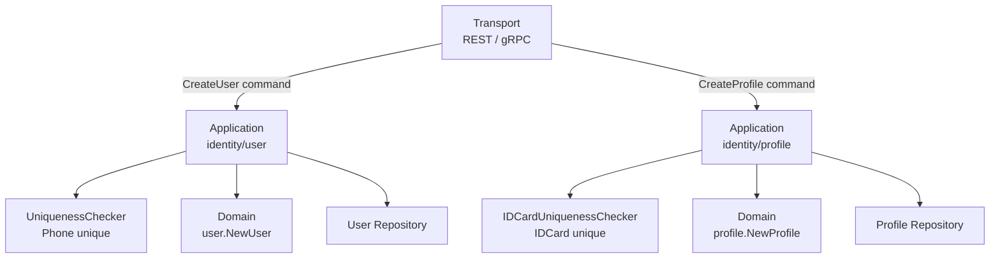
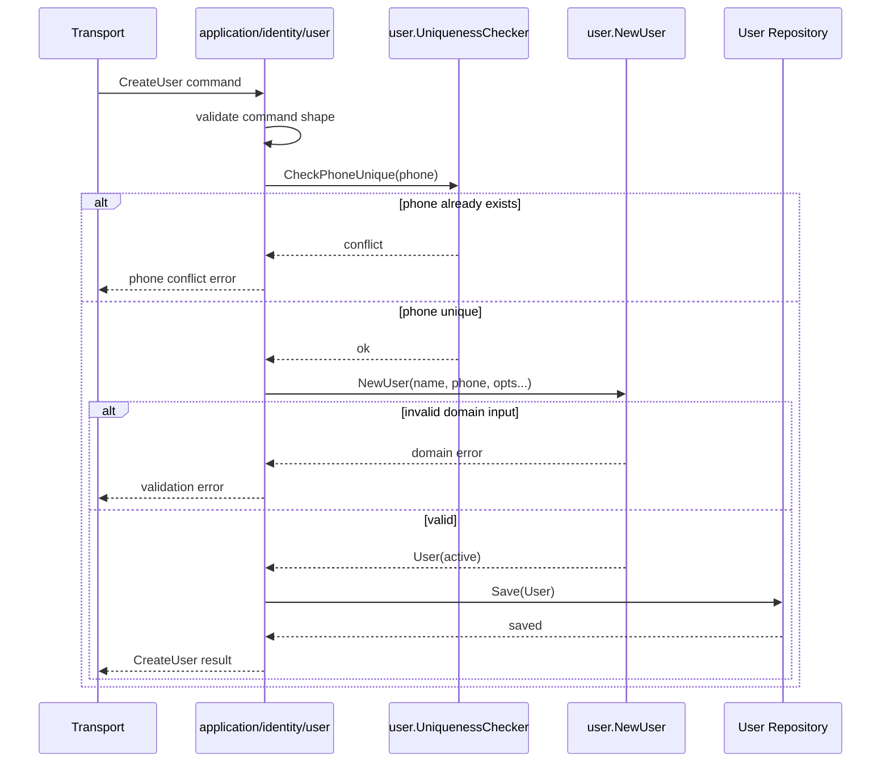
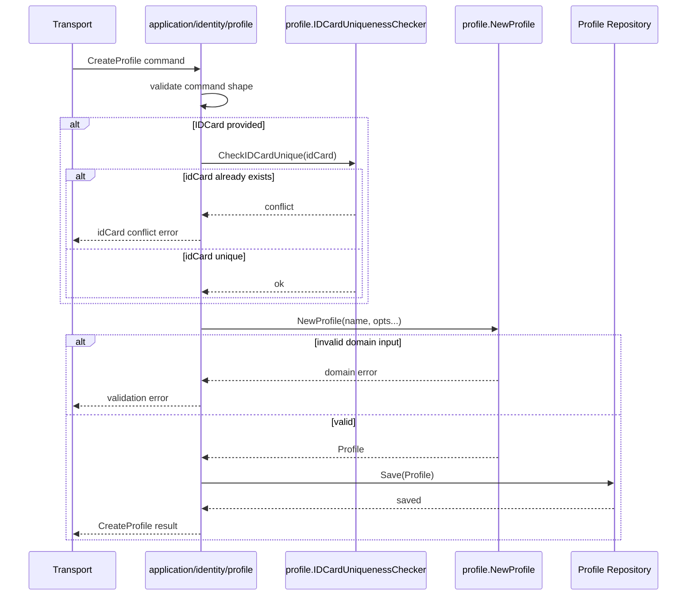
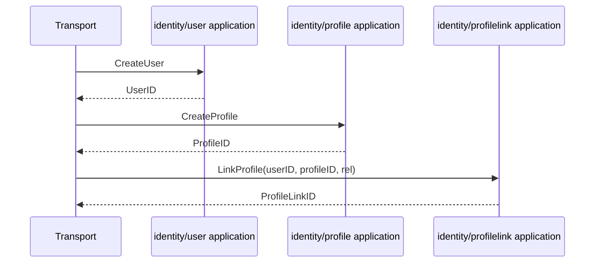

# 关键链路：创建 User 与 Profile

> 状态：待补证据 · 第一版正文，待继续按 `application/identity/user`、`application/identity/profile`、REST/gRPC 契约和测试逐项核对。

---

## 1. 本文回答

本文回答 7 个问题：

- 创建 `User` 和创建 `Profile` 分别解决什么问题？
- 为什么二者要拆成两条链路，而不是一次性创建“用户档案”？
- 创建 User 时有哪些输入、领域规则、唯一性约束和失败边界？
- 创建 Profile 时有哪些输入、领域规则、唯一性约束和失败边界？
- transport、application、domain、repository 在链路中各自负责什么？
- AuthN、AuthZ、IDP、Suggest 为什么不应该绕过 Identity 创建 User/Profile？
- 修改该链路时应该核对哪些代码和测试？

本文只讲创建 `User` 与 `Profile`。`User` 与 `Profile` 建立关系的链路见 [03-关键链路-建立与撤销ProfileLink.md](03-关键链路-建立与撤销ProfileLink.md)，领域模型见 [01-领域模型-User-Profile-ProfileLink.md](01-领域模型-User-Profile-ProfileLink.md)。

---

## 2. 30 秒结论

创建 `User` 与创建 `Profile` 是两条不同链路。

```text
User    = IAM 内部稳定身份主体
Profile = 业务档案 / 被服务对象
```

创建 User 回答：

```text
系统内部这个用户是谁？
后续 AuthN/AuthZ/Suggest 应该通过哪个稳定 UserID 引用他？
```

创建 Profile 回答：

```text
业务系统真正服务、管理、搜索的档案是谁？
后续 User 如何通过 ProfileLink 与该档案建立关系？
```

核心规则：

```text
User 创建时 Name、Phone 必填；
User 默认 active；
User 手机号唯一性由 Identity 应用层治理；
Profile 创建时 Name 必填；
Profile 提供 IDCard 时需要身份证唯一性校验；
创建 User 不等于创建 LoginIdentity；
创建 Profile 不等于建立 ProfileLink；
创建 Profile 不等于赋权。
```

如果只记一句话：

> User 和 Profile 都属于 Identity 写模型；前者是内部身份主体，后者是业务档案，它们的关系必须通过 ProfileLink 明确建立。

---

## 3. 链路总览



这张图表达 4 个边界：

```text
transport 只解析请求并调用 application；
application 负责编排唯一性检查、领域对象创建和持久化；
domain 负责表达 User/Profile 的构造规则；
repository 负责保存 Identity 事实。
```

---

## 4. 为什么 User 和 Profile 分开创建

`User` 和 `Profile` 表达的是两类不同事实。

| 对象 | 事实类型 | 说明 |
| --- | --- | --- |
| `User` | 内部身份主体 | IAM 内部稳定身份锚点，AuthN/AuthZ 通过 UserID 引用 |
| `Profile` | 业务档案 | 被服务、被管理、被搜索的业务对象 |
| `ProfileLink` | 身份关系事实 | 连接 User 与 Profile，表达 self/parent/grandparent/other 等关系 |

如果创建 User 时强行内嵌 Profile，会导致：

```text
无法表达一个 User 关联多个 Profile；
无法表达 User 与 Profile 的关系类型；
无法独立撤销关系；
无法保留关系历史；
容易把 Profile 当成登录账号；
容易把 ProfileLink 当成权限。
```

因此创建链路应保持拆分：

```text
创建 User：创建内部身份主体；
创建 Profile：创建业务档案；
创建 ProfileLink：建立二者关系。
```

---

## 5. 创建 User 链路

### 5.1 链路目标

创建 User 的目标是生成 IAM 内部稳定身份主体。

它不负责：

```text
创建登录身份 LoginIdentity；
创建密码或验证码 Credential / Challenge；
创建 Session；
签发 Token；
创建 Profile；
建立 ProfileLink；
写入权限 RoleBinding。
```

---

### 5.2 输入与输出

输入通常包括：

```text
Name；
Phone；
Nickname；
Email。
```

其中：

```text
Name 必填；
Phone 必填；
Nickname 可选；
Email 可选。
```

输出通常包括：

```text
UserID；
Name；
Phone；
Nickname；
Email；
Status。
```

具体字段必须以 REST OpenAPI、gRPC proto 和当前 application DTO 为准。

---

### 5.3 时序图



---

### 5.4 分层职责

| 层 | 职责 |
| --- | --- |
| transport | 解析 REST/gRPC 请求，构造 CreateUser command，映射响应和错误 |
| application | 编排手机号唯一性检查、调用领域构造、保存 User、控制事务边界 |
| domain | `NewUser` 校验 Name/Phone 必填，默认 active，提供状态和行为方法 |
| repository | 持久化 User，按 ID/Phone 等查询 User |

关键边界：

```text
transport 不直接调用 repository；
repository 不定义 User 领域规则；
手机号唯一性属于 Identity 写模型治理；
AuthN 不应绕过 Identity 创建 User。
```

---

### 5.5 领域规则

创建 User 的领域规则：

| 规则 | 说明 | 事实源 |
| --- | --- | --- |
| Name 必填 | 空姓名不允许创建 User | `user.NewUser` |
| Phone 必填 | 空手机号不允许创建 User | `user.NewUser` |
| Status 默认 active | 新建 User 默认可用 | `user.NewUser` |
| Phone 唯一 | 同一手机号不能重复创建 User | `user.UniquenessChecker` + application |

注意：

```text
Name/Phone 必填是领域构造规则；
Phone 唯一通常需要 repository 或唯一索引支撑；
application 层应在写入前做唯一性检查；
数据库层仍应有最终唯一性保护，避免并发竞态。
```

---

### 5.6 失败边界

| 场景 | 期望行为 | 错误类型 |
| --- | --- | --- |
| Name 为空 | 拒绝创建 | validation / domain error |
| Phone 为空 | 拒绝创建 | validation / domain error |
| Phone 已存在 | 拒绝创建 | conflict error |
| repository 保存失败 | 返回服务端错误 | infrastructure error |
| 并发创建同手机号 | 至多一个成功 | conflict / unique constraint error |

对外错误映射应由 transport 负责：

```text
参数错误 -> HTTP 400 / gRPC InvalidArgument；
唯一性冲突 -> HTTP 409 / gRPC AlreadyExists 或 FailedPrecondition；
内部错误 -> HTTP 500 / gRPC Internal。
```

具体错误码以 OpenAPI/proto 和当前实现为准。

---

## 6. 创建 Profile 链路

### 6.1 链路目标

创建 Profile 的目标是生成业务档案或被服务对象。

它不负责：

```text
创建 User；
创建登录身份；
创建 Session / Token；
建立 ProfileLink；
赋予访问权限；
写入 Suggest 索引。
```

---

### 6.2 输入与输出

输入通常包括：

```text
Name；
IDCard；
Gender；
Birthday。
```

其中：

```text
Name 必填；
IDCard 可选；
Gender 可选；
Birthday 可选。
```

输出通常包括：

```text
ProfileID；
Name；
IDCard；
Gender；
Birthday。
```

具体字段必须以 REST OpenAPI、gRPC proto 和当前 application DTO 为准。

---

### 6.3 时序图



---

### 6.4 分层职责

| 层 | 职责 |
| --- | --- |
| transport | 解析 REST/gRPC 请求，构造 CreateProfile command，映射响应和错误 |
| application | 编排身份证唯一性检查、调用领域构造、保存 Profile、控制事务边界 |
| domain | `NewProfile` 校验 Name 必填，提供资料修改方法 |
| repository | 持久化 Profile，按 ID/IDCard/Name 等查询 Profile |

关键边界：

```text
Profile 主事实属于 Identity；
Suggest 只能读取 Profile 构建读模型，不应写 Profile；
创建 Profile 不自动建立 ProfileLink；
创建 Profile 不自动赋权。
```

---

### 6.5 领域规则

创建 Profile 的领域规则：

| 规则 | 说明 | 事实源 |
| --- | --- | --- |
| Name 必填 | 空姓名不允许创建 Profile | `profile.NewProfile` |
| IDCard 可选 | 无身份证时仍可创建 Profile | `profile.NewProfile` |
| IDCard 唯一 | 提供身份证时应保证唯一 | `profile.IDCardUniquenessChecker` + application |

注意：

```text
IDCard 唯一只在提供 IDCard 时校验；
身份证唯一性通常需要 repository 或唯一索引支撑；
数据库层仍应有最终唯一性保护，避免并发竞态；
Profile 没有登录凭证，也没有授权字段。
```

---

### 6.6 失败边界

| 场景 | 期望行为 | 错误类型 |
| --- | --- | --- |
| Name 为空 | 拒绝创建 | validation / domain error |
| IDCard 已存在 | 拒绝创建 | conflict error |
| IDCard 格式非法 | 按 meta/domain 规则拒绝 | validation / domain error |
| repository 保存失败 | 返回服务端错误 | infrastructure error |
| 并发创建同身份证 Profile | 至多一个成功 | conflict / unique constraint error |

对外错误映射应由 transport 负责，具体状态码以 OpenAPI/proto 和当前实现为准。

---

## 7. User 与 Profile 的创建顺序

User 与 Profile 可以独立创建，也可以在更高层用例中被连续创建。

但是语义上必须区分：

```text
创建 User：产生内部身份主体；
创建 Profile：产生业务档案；
建立 ProfileLink：声明二者关系。
```

常见组合流程：



注意：

```text
如果业务上需要“一次性创建用户本人档案”，也应在 application 用例中显式编排 User、Profile、ProfileLink；
不要在 User 实体内部偷偷创建 Profile；
不要在 Profile 实体内部偷偷创建 User；
不要跳过 ProfileLink。
```

---

## 8. 事务边界

创建 User 和创建 Profile 通常各自是一个独立写用例。

推荐原则：

```text
一个用例明确一个事务边界；
唯一性检查和写入应在同一写流程内完成；
数据库唯一约束应兜底并发竞态；
跨对象组合创建时，由 application 明确事务范围；
transport 不持有事务。
```

如果一个上层用例需要同时创建：

```text
User + Profile + ProfileLink
```

则需要明确：

```text
是一个事务全部成功；
还是允许部分成功并通过补偿处理；
失败时如何返回；
是否需要幂等键；
是否需要 Outbox 或事件通知。
```

当前本文不假设已经存在该组合用例。没有代码事实支撑时，不应写成已实现。

---

## 9. 与其他模块的边界

### 9.1 与 AuthN

AuthN 可以引用 `UserID`，但不应绕过 Identity 创建 User。

边界：

```text
创建 User 属于 Identity；
创建 LoginIdentity / Credential / Challenge 属于 AuthN；
创建 Session / Token 属于 AuthN；
登录成功后 Principal 可以携带 UserID；
User 不是 Principal。
```

常见错误：

```text
在 AuthN 注册流程中直接写 User repository；
把 LoginIdentity 当 User；
把手机号登录账号和 User 主体混为一谈。
```

正确方式：

```text
AuthN onboarding 如果需要创建 User，应通过 Identity application service 或受控 port 协作。
```

---

### 9.2 与 AuthZ

AuthZ 可以通过 `Subject` 引用 User，但不拥有 User 写模型。

边界：

```text
创建 User/Profile 不等于授权；
创建 Profile 不等于允许访问 Profile；
ProfileLink 不等于 Permission；
是否可访问资源仍由 AuthZ Check 判定。
```

---

### 9.3 与 IDP

IDP 输出 `ExternalIdentity`，不直接创建 User。

边界：

```text
ExternalIdentity 是外部身份声明；
LoginIdentity 由 AuthN 绑定到 User；
User 属于 Identity；
IDP AppToken 不是 IAM AccessToken。
```

---

### 9.4 与 Suggest

Suggest 消费 Profile 事实构建读模型。

边界：

```text
Profile 主事实由 Identity 创建和维护；
Suggest 不写 Profile；
Suggest Snapshot 不是 Profile 主表；
Profile 创建后是否同步到 Suggest，属于读模型刷新或事件传播问题。
```

---

## 10. 并发与幂等

创建 User/Profile 都涉及唯一性约束，因此需要考虑并发。

### 10.1 User 手机号并发创建

风险：

```text
两个请求同时用同一 Phone 创建 User；
应用层唯一性检查都通过；
最终写入产生重复数据。
```

建议：

```text
application 先做唯一性检查；
repository/database 用唯一索引兜底；
捕获唯一约束冲突并映射为 conflict；
需要对外幂等时引入幂等键或按 Phone 做幂等查询返回。
```

### 10.2 Profile 身份证并发创建

风险：

```text
两个请求同时用同一 IDCard 创建 Profile；
应用层唯一性检查都通过；
最终写入产生重复档案。
```

建议：

```text
提供 IDCard 时 application 先做唯一性检查；
repository/database 用唯一索引兜底；
捕获唯一约束冲突并映射为 conflict；
无 IDCard 的 Profile 需要依靠业务流程避免重复档案。
```

---

## 11. 常见反模式

| 反模式 | 问题 | 推荐做法 |
| --- | --- | --- |
| 创建 User 时内嵌创建 Profile | 混淆身份主体和业务档案 | 显式创建 Profile，再通过 ProfileLink 建立关系 |
| 创建 Profile 时顺手创建 User | 业务档案反向吞并身份主体 | User 创建归 Identity user 用例 |
| AuthN 直接写 User repository | AuthN 绕过 Identity 边界 | AuthN 通过 Identity application/port 协作 |
| Suggest 直接写 Profile | 读模型吞并写模型 | Profile 主事实归 Identity |
| 创建 Profile 后默认拥有访问权 | 身份事实和授权事实混淆 | 权限由 AuthZ Role/Permission/RoleBinding/Check 决定 |
| 只做应用层唯一性检查 | 并发下可能重复 | 应用检查 + 数据库唯一约束兜底 |
| transport 持有事务 | 协议层污染用例边界 | 事务边界归 application |
| repository 里写业务规则 | 持久化层吞并领域规则 | 必填、状态、关系规则放 domain/application |

---

## 12. 代码事实源

| 事实 | 路径 |
| --- | --- |
| User 实体与构造规则 | `internal/apiserver/domain/identity/user/user.go` |
| User 状态定义 | `internal/apiserver/domain/identity/user/types.go` |
| User 手机号唯一性接口 | `internal/apiserver/domain/identity/user` |
| User 创建用例 | `internal/apiserver/application/identity/user` |
| Profile 实体与构造规则 | `internal/apiserver/domain/identity/profile/profile.go` |
| Profile 身份证唯一性接口 | `internal/apiserver/domain/identity/profile` |
| Profile 创建用例 | `internal/apiserver/application/identity/profile` |
| ProfileLink 关系模型 | `internal/apiserver/domain/identity/profilelink` |
| Identity 模块装配 | `internal/apiserver/container/identity` |
| REST transport | `internal/apiserver/transport/rest` |
| gRPC transport | `internal/apiserver/transport/grpc` |
| REST 契约 | `api/rest` |
| gRPC 契约 | `api/grpc` |

---

## 13. Verify

修改本文后至少执行：

```bash
make docs-hygiene
```

涉及 User/Profile 领域构造规则时，执行：

```bash
go test ./internal/apiserver/domain/identity/...
```

涉及 User/Profile 创建用例、唯一性检查或事务边界时，执行：

```bash
go test ./internal/apiserver/application/identity/...
```

涉及 REST/gRPC 契约或 handler/service 时，执行：

```bash
make api-validate
make proto-gen
go test ./internal/apiserver/transport/rest/...
go test ./internal/apiserver/transport/grpc/...
```

涉及分层边界时，执行：

```bash
go test ./internal/pkg/architecture
```

---

## 14. 本文总结

创建 User 与 Profile 可以压缩成两条链路：

```text
CreateUser:
transport -> application/identity/user -> user.NewUser -> UserRepository

CreateProfile:
transport -> application/identity/profile -> profile.NewProfile -> ProfileRepository
```

最重要的边界是：

```text
User 是内部身份主体；
Profile 是业务档案；
二者关系必须通过 ProfileLink 建立；
创建 User 不等于创建 LoginIdentity；
创建 Profile 不等于赋权；
AuthN/AuthZ/IDP/Suggest 不应绕过 Identity 写模型。
```

下一篇 [03-关键链路-建立与撤销ProfileLink.md](03-关键链路-建立与撤销ProfileLink.md) 将继续说明：
User 和 Profile 创建后，如何通过 `ProfileLink` 建立、查询、撤销关系，以及如何保证 self 档案唯一性。
