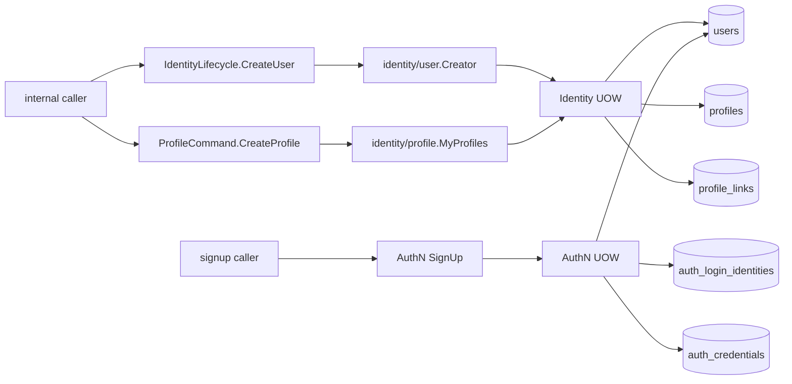
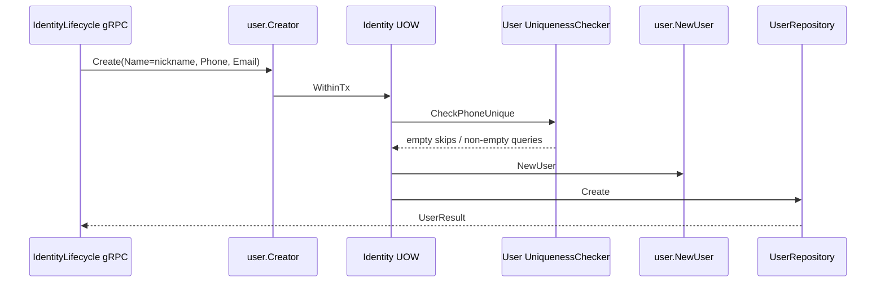
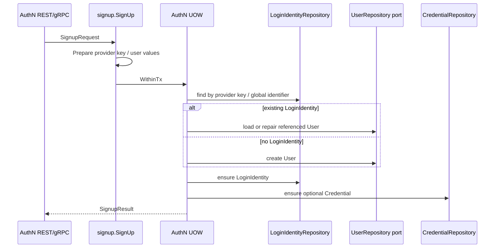
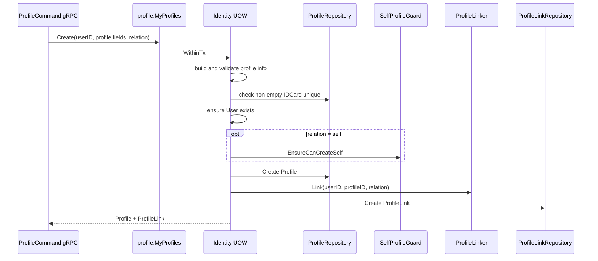

# 关键链路：创建 User 与 Profile

> 状态：已实现 · 已核对 Identity gRPC、AuthN signup、application、UnitOfWork、repository、migration 和测试。

## 1. 本文回答

- User 当前会从哪些入口被创建？
- 为什么 Identity 不提供“同时创建 User + Profile”的通用命令？
- 为什么 `CreateProfile` 必须同时创建 ProfileLink？
- Identity 创建 User 与 AuthN signup 创建 User 有什么不同？
- 哪些校验在 transport、domain、application 或 database 中完成？
- 两条创建链路的事务、并发和失败边界是什么？

## 2. 30 秒结论

当前没有一个通用的“同时创建 User + Profile” Identity 用例。真实创建语义是：

```text
Identity CreateUser
  -> 只创建 User

Identity CreateProfile
  -> 为已存在 User 创建 Profile
  -> 同事务创建 ProfileLink

AuthN SignUp
  -> 解析或创建 User
  -> 同事务创建/复用 LoginIdentity
  -> 按需创建 Credential
  -> 不创建 Profile
```

对外协议上：

- Identity 自身的 `CreateUser` 和 `CreateProfile` 只通过 gRPC 暴露；
- Identity REST 没有 User、Profile 或 ProfileLink 创建路由；
- AuthN REST/gRPC signup 是另一条会产生 User 记录的跨模块链路，不能被忽略。

最重要的一致性差异是：Identity `CreateUser` 会对非空 Phone 执行唯一性预检查；AuthN signup 会根据 LoginIdentity 复用 User，不按 Phone 复用，也不调用该 checker。
数据库又没有 Phone 唯一键，所以“非空 Phone 全局唯一”并不是当前系统级保证。

## 3. 问题背景

### 3.1 注册主体、开通登录和业务建档是三件事

User、LoginIdentity 和 Profile 的生命周期不同：

- User 是 IAM 内部稳定主体；
- LoginIdentity 表达 username、phone、wechat 等可用于登录的 provider key；
- Profile 表达业务服务对象的档案事实。

将它们绑成一个固定创建流程会引入错误假设：

- 创建 User 必然已获得完整档案资料；
- 一个 User 必然要为本人建档；
- 创建 User 必然已经选定登录 provider；
- 注册失败、建档失败和登录开通失败必须共享一个补偿模型。

因此当前系统保留了不同的创建边界，并只在必须原子成功的地方组合对象。

### 3.2 Profile 可以独立建模，但当前创建用例不允许孤立落库

Profile 不是 User 的内嵌子对象，但当前的业务命令是“为某个 User 建档”。这意味着：

```text
模型可独立 != 当前公开用例允许独立创建
```

如果先保存 Profile，再由调用方建立 ProfileLink，第二步失败就会留下孤立 Profile。当前 `MyProfiles.Create` 因此将两次写入收敛到同一 Identity UnitOfWork。

## 4. 设计目标与约束

| 目标或约束 | 对创建链路的影响 |
| --- | --- |
| User 可在未建档时存在 | `CreateUser` 不隐式创建 Profile |
| Profile 创建后必须有明确关系 | `CreateProfile` 同事务创建 ProfileLink |
| User 不一定为本人建档 | relation 由创建命令显式提供 |
| AuthN signup 不能留下孤立 User 或 LoginIdentity | AuthN UOW 同事务使用 User、LoginIdentity、Credential repository ports |
| 对终端用户收窄身份写入面 | Identity 创建命令仅暴露 gRPC，REST 仅自助查改 |
| 唯一性预检查无法抵御并发 | IDCard 有 DB 唯一键兜底；Phone 当前存在缺口 |
| 契约字段不能超前于实现 | operator、contacts、external identities 等未消费字段单独标记为缺口 |

## 5. 当前创建入口总图



| 创建场景 | 对外入口 | 事务中的主要写入 | 是否建 Profile |
| --- | --- | --- | --- |
| Identity User 生命周期 | gRPC `IdentityLifecycle.CreateUser` | User | 否 |
| 为已存在 User 建档 | gRPC `ProfileCommand.CreateProfile` | Profile + ProfileLink | 是 |
| AuthN 登录身份开通 | AuthN REST/gRPC signup | User + LoginIdentity + 可选 Credential | 否 |

## 6. 核心设计决策

### 6.1 决策 A：User 创建不隐式创建 Profile

> 标签：设计决策 · 提交 `0d62d27d` 和当前测试可证明

#### 解决的问题

允许“已有 IAM User，尚未建档”，并让建档流程区分本人和关系人。

#### 选择

`user.Creator.Create` 只构造和保存 User。Profile 必须由后续明确用例创建。

#### 替代方案

1. User 创建时自动创建空 self Profile；
2. 将 User 资料直接当成 Profile；
3. 对外只暴露固定的 User + self Profile 组合命令。

#### 未采用原因

这些方案都默认注册信息足以建档，且首次 Profile 必然是 self，不符合当前允许关系人建档的模型。

#### 代价与后果

调用方必须显式处理“无 self Profile”，也不能将 User 创建成功当成建档成功。

### 6.2 决策 B：Profile 和 ProfileLink 是一个组合建档用例

> 标签：设计决策 · 提交 `5dd54232`、`MyProfiles.Create` 和 Identity UOW 可证明

#### 解决的问题

防止 Profile 成功落库、ProfileLink 创建失败后留下孤立档案。

#### 选择

`MyProfiles.Create` 使用同一个 Identity UnitOfWork 完成 Profile 和 ProfileLink 写入，并同时返回两个结果。

#### 替代方案

1. 暴露 standalone `CreateProfile` 和 `EstablishProfileLink`，由调用方编排；
2. 先建 Profile，链接失败后删除或异步补偿；
3. 允许孤立 Profile，由后续归属任务处理。

#### 未采用原因

当前建档语义已经知道 User 和 relation，没有必要为一个本地 MySQL 可原子完成的写入引入孤立状态和补偿机制。

#### 代价与后果

如果未来出现“先批量导入档案，之后再建立归属”的需求，应新增专门用例和孤立数据治理，而不是把当前组合用例拆散。

### 6.3 决策 C：Identity 创建命令只暴露 gRPC

> 标签：设计决策 · 提交 `5dd54232`、当前 router 和 proto 可证明

#### 解决的问题

区分面向当前登录用户的自助查改，与受信内部服务的身份创建和编排。

#### 选择

Identity REST 仅保留 `/identity/me`、Profile 和 ProfileLink 查改；Identity 创建 User/Profile 只位于 gRPC `IdentityLifecycle` 和
`ProfileCommand`。

#### 替代方案

- REST 和 gRPC 暴露完全对称的写入能力；
- 客户端直接调用 application；
- 所有写入都收敛到 AuthN signup。

#### 代价与后果

能力不对称降低了外部写入面，但接入方和文档必须明确区分 Identity API 与 AuthN signup，不能从 application 已有类型推导 REST 也有同名路由。

### 6.4 决策 D：AuthN signup 用一个跨模型 MySQL 事务开通登录身份

> 标签：设计决策 · AuthN UOW、signup steps 和契约测试可证明

#### 解决的问题

避免创建 User 后 LoginIdentity/Credential 失败，或 LoginIdentity 成功后 User 不存在的半完成账号。

#### 选择

AuthN `SignUp` 的 UOW 在同一 MySQL 事务中提供 Identity User、AuthN LoginIdentity 和 Credential repository ports。
signup 先按 LoginIdentity provider key 解析 User，未命中时创建 User，再确保 LoginIdentity/Credential。

#### 替代方案

1. AuthN 先调用 Identity gRPC，再开始 AuthN 本地事务；
2. 通过事件异步创建 User 或 LoginIdentity；
3. 允许部分成功并建立补偿工作流。

#### 未采用原因

当前三类记录使用同一 MySQL 事务基础，可直接获得原子性；分布式调用或异步补偿会增加中间状态和运维成本。

#### 边界代价

AuthN application/UOW 显式依赖 Identity `user.Repository` port，而不是 Identity application `Creator`。这是为了事务原子性接受的跨模块结构耦合，
不应扩展成 AuthN 可以任意编辑 User/Profile/ProfileLink。

### 6.5 决策 E：唯一性使用“业务预检查 + DB 兜底”

> 标签：当前实现

application checker 能返回稳定的业务错误，数据库唯一键在并发下做最终裁决：

| 字段 | Identity application 预检查 | DB 唯一键 | 其他写入链路 |
| --- | --- | --- | --- |
| Profile IDCard | 非空时检查 | `profiles.uk_id_card` | 当前 Profile 公开创建收敛到组合用例 |
| User Phone | Identity Create/Patch 非空时检查 | `users.uk_users_active_phone`（生成列，仅活跃非空手机号） | AuthN signup 不按 Phone 自动合并 User；数据库仍统一裁决冲突 |

因此 IDCard 与活跃 User Phone 都具备数据库并发兜底；User 软删除后手机号可复用。

## 7. Identity `CreateUser` 当前实现

### 7.1 协议输入语义

gRPC `CreateUserRequest` 中当前真正被 handler 消费的是：

| proto 字段 | application 映射 | 当前语义 |
| --- | --- | --- |
| `nickname` | `CreateUserDTO.Name` | 必填；实际写入 User.Name，不是 User.Nickname |
| `phone` | `CreateUserDTO.Phone` | 可选；非空时解析并查重 |
| `email` | `CreateUserDTO.Email` | 可选；非空时解析 |
| `avatar_url` | 无 | 当前忽略 |
| `contacts` | 无 | 当前忽略 |
| `external_identities` | 无 | 当前忽略 |
| `operator` | 无 | 当前未校验、未传递 |

`nickname -> Name` 是当前契约与模型的语义不对称，不应根据字段名误以为它会写入 User.Nickname。

### 7.2 调用链



事务内依次完成：

1. 空 Phone 解析为空值；非空 Phone 解析为 `meta.Phone`；
2. 对 Phone 调用 `UniquenessChecker.CheckPhoneUnique`；
3. `user.NewUser` 校验 Name，Status 默认 active；
4. 按需解析 Email；
5. 保存 User 并返回结果。

### 7.3 失败边界

| 失败点 | 结果 |
| --- | --- |
| nickname 空白 | transport 返回 gRPC `InvalidArgument` |
| Phone/Email 格式无效 | application 返回编码错误，transport 映射 gRPC status |
| Phone 预检查冲突 | 事务不写入 User |
| repository 写入失败 | 事务回滚 |
| 并发写入同 Phone | `uk_users_active_phone` 只允许一个活跃 User 成功；冲突映射为现有 `ErrUserAlreadyExists` |

Identity `CreateUser` 当前没有请求幂等键。重试是否会创建新 User，取决于 Phone 是否非空且预检查能否命中，不应宣称为幂等接口。

## 8. AuthN `SignUp` 中的 User 创建

### 8.1 调用链



### 8.2 User 解析语义

`resolveUserStep` 的顺序是：

1. 按 LoginIdentity provider key 查询；
2. 未命中时，如果有 global identifier 则再查询；
3. 命中 LoginIdentity 时加载其 UserID；允许 repair 的 provider 可在 User 缺失时按原 ID 重建；
4. 没有命中 LoginIdentity 时创建新 User；
5. 不会仅因 Phone 相同就复用旧 User。

测试 `TestUserResolverDoesNotReuseUserByPhoneWithoutLoginIdentity` 明确保护第 5 条。这避免了只凭联系字段将新 LoginIdentity 绑到旧 User，
但也意味着 Phone 在这条链路中不是用户合并键。

### 8.3 当前一致性边界

AuthN signup 直接调用 `user.NewUser` 和 `user.Repository.Create`，没有复用 Identity `user.Creator` 的友好预检查；
最终并发一致性由 `users.active_phone` 生成列和 `uk_users_active_phone` 唯一索引保证。同 Phone 不能经由不同 LoginIdentity 创建多个活跃 User，
数据库冲突统一映射为现有 `ErrUserAlreadyExists`。

Phone 仍不是账号自动合并键：signup 不会仅凭 Phone 把新 LoginIdentity 绑定到旧 User；唯一索引只负责拒绝重复活跃手机号，不执行隐式账号合并。软删除 User 后，该手机号可被重新使用。

## 9. Identity `CreateProfile` 当前实现

### 9.1 协议输入语义

| proto 字段 | 当前语义 |
| --- | --- |
| `user_id` | 必填且必须指向已存在 User |
| `legal_name` | 必填；transport TrimSpace 后传入 application |
| `gender` | 可选；male/female 映射 1/2，other/unspecified 映射 0 |
| `dob` | 可选；非空时检查日期值 |
| `id_card_number` | 可选；非空时用 Name + Number 构造 IDCard |
| `relation` | unspecified 映射 `other`；运行时不拒绝 |
| `operator` | 当前未校验、未传递 |

### 9.2 组合事务



任意一步返回错误都使整个事务回滚，包括 Profile repository 已经执行 insert、但 Link 检查或保存失败的情况。

### 9.3 失败边界

| 失败点 | 结果 |
| --- | --- |
| `user_id`/`legal_name` 缺失 | transport 返回 `InvalidArgument` |
| User 不存在 | application 拒绝，不创建 Profile |
| Gender/Birthday/IDCard 无效 | application 拒绝 |
| IDCard 已存在 | application 预检查拒绝；并发冲突由 DB 唯一键兜底 |
| User 已有 active self | `SelfProfileGuard` 拒绝；DB self key 兜底并发 |
| ProfileLink 保存失败 | Profile insert 一起回滚 |

### 9.4 不存在 standalone production creator

production container 只装配 `profile.NewMyProfiles(uow)` 作为创建能力。测试的 `ProfileFixture` 可直接建 Profile 来准备数据，但它不是运行时应用用例。

## 10. 事务、并发与幂等矩阵

| 链路 | 事务边界 | 并发兜底 | 幂等语义 |
| --- | --- | --- | --- |
| Identity CreateUser | 单个 Identity MySQL 事务 | application 友好预检查 + `uk_users_active_phone` 最终兜底 | 无请求幂等键 |
| AuthN SignUp | User + LoginIdentity + Credential 同一 AuthN MySQL 事务 | LoginIdentity repository 唯一约束；Phone 非合并键 | 按 provider key 复用 LoginIdentity/User，不是通用请求幂等 |
| Identity CreateProfile | Profile + ProfileLink 同一 Identity MySQL 事务 | IDCard 唯一键、active self 唯一键、ProfileLink 组合唯一键 | 无请求幂等键 |

## 11. 已知缺口与复议条件

| 项目 | 当前状态 | 需要决策或修复 |
| --- | --- | --- |
| Phone 唯一性 | 所有写入链路受 `uk_users_active_phone` 约束；Identity 保留友好预检查，AuthN signup 依赖数据库最终兜底 | 保持 duplicate-key 错误映射和 MySQL 8 迁移/并发测试 |
| CreateUser `nickname` | 实际写入 User.Name | 契约重命名或修正 mapper，并制定兼容政策 |
| User 扩展字段 | avatar、contacts、external identities 当前忽略 | 删除超前契约，或完成模型/映射/存储 |
| OperatorContext | Identity 写 handler 不强制也不传递 | 确认审计主体模型后端到端落地 |
| CreateProfile relation | unspecified 降级 `other` | 确认宽容兼容还是强制显式语义 |
| 孤立 Profile 导入 | 当前无 production 用例 | 只在出现真实导入/预建档需求时复议组合事务 |
| User + Profile 一次建立 | 当前无通用组合用例 | 需求确立时明确原子性、relation、幂等与失败补偿 |

## 12. 事实源与 Verify

| 内容 | 路径 |
| --- | --- |
| Identity User gRPC | `api/grpc/iam/identity/v2/identity.proto`、`internal/apiserver/transport/grpc/service/identity/identity_lifecycle.go` |
| Identity User 创建 | `internal/apiserver/application/identity/user/service_create.go` |
| Profile 组合建档 | `internal/apiserver/application/identity/profile/service_my_profiles.go`、`profile_creation.go` |
| Identity 事务 | `internal/apiserver/application/identity/uow/uow.go`、`internal/apiserver/infra/mysql/uow/identity/uow.go` |
| AuthN signup | `internal/apiserver/application/authn/signup/service.go`、`step_resolve_user.go` |
| AuthN 跨模型事务 | `internal/apiserver/application/authn/uow/uow.go`、`internal/apiserver/infra/mysql/uow/authn/uow.go` |
| 唯一性和表结构 | `internal/pkg/migration/migrations` |

```bash
go test ./internal/apiserver/application/identity/user
go test ./internal/apiserver/application/identity/profile
go test ./internal/apiserver/application/authn/signup
go test ./internal/apiserver/transport/grpc/service/identity
go test ./internal/apiserver/infra/mysql/user ./internal/apiserver/infra/mysql/profile ./internal/apiserver/infra/mysql/profilelink
```

## 13. 继续阅读

- 为什么拆分 User/Profile/ProfileLink：[01-领域模型](01-领域模型-User-Profile-ProfileLink.md)
- ProfileLink 的建立、撤销、查询和批处理：[03-建立与撤销 ProfileLink](03-关键链路-建立与撤销ProfileLink.md)
- AuthN/Identity 的跨模块事务边界：[04-模块边界](04-模块边界-Identity与AuthN-AuthZ-Suggest.md)
