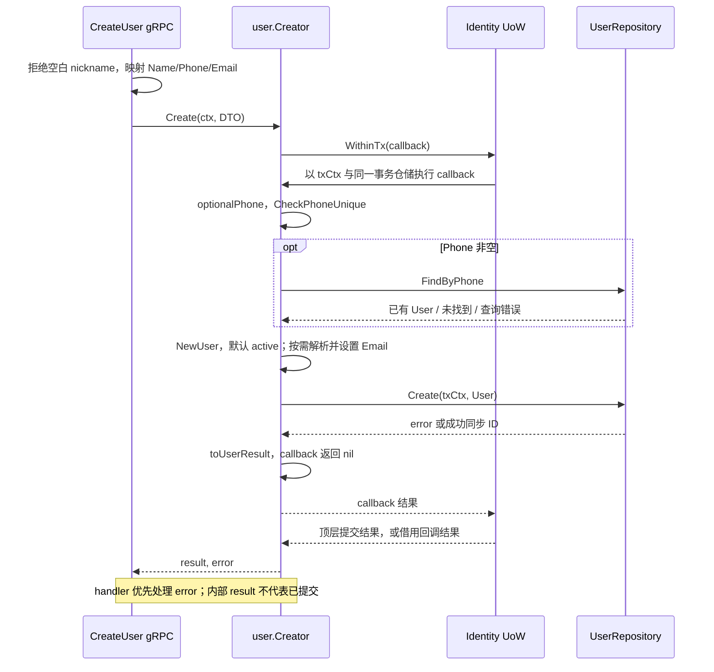
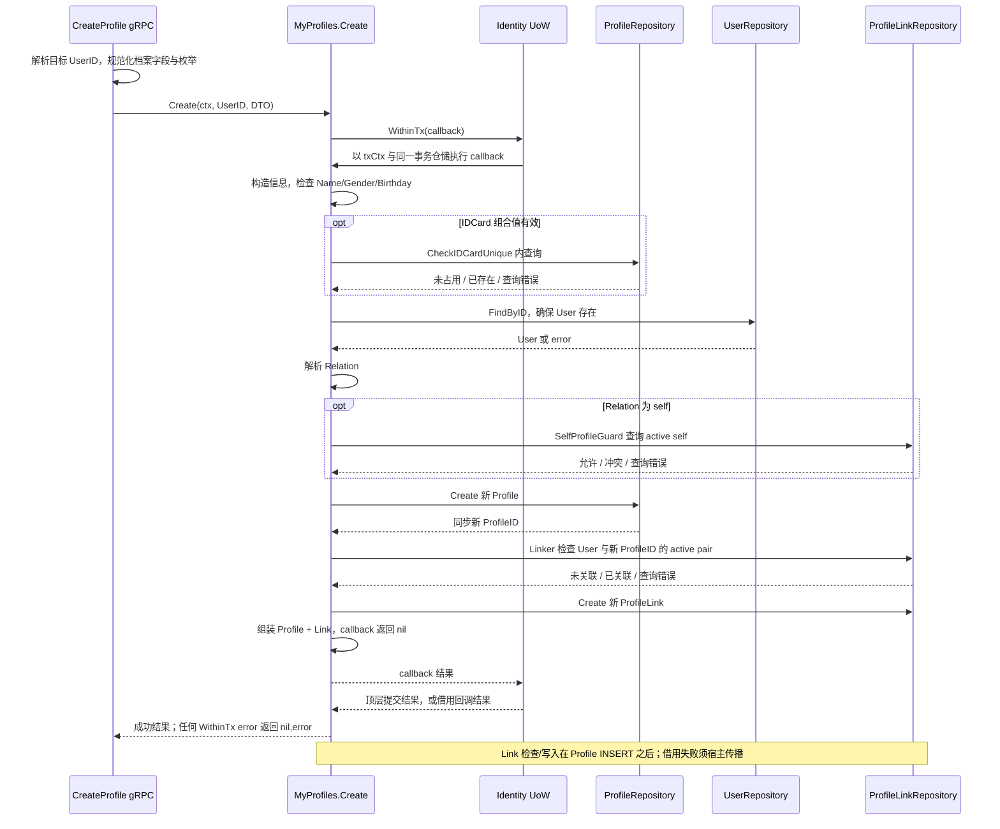

# 关键链路：创建 User 与 Profile

> 状态：已实现 · 本文维护创建入口、输入投影、事务与失败语义。候选改进尚未实施；测试与真实环境证据分开记录。

## 1. 三个创建用例，分别完成什么

当前没有通用的“创建 User 并自动建本人档案”命令。注册主体、开通登录和业务建档分别由以下用例负责：

| 用例 | 入口与编排者 | 本次写入 | 成功不表示 |
| --- | --- | --- | --- |
| 创建主体 | Identity gRPC `IdentityLifecycle.CreateUser` → `user.Creator` | 一个 active User | 已有登录入口、Session、Profile 或权限 |
| 为已有主体建档 | Identity gRPC `ProfileCommand.CreateProfile` → `profile.MyProfiles.Create` | 新 Profile + 新 ProfileLink | 已证明本人/亲属关系，或已有 AuthZ 动作能力 |
| 开通登录身份 | AuthN REST/gRPC SignUp → signup steps | 解析/创建 User，确保 LoginIdentity、可选 Credential | 已登录或已建 Profile |

例如，先创建 U17，再为其创建本人 P42 和父母 P43，需要分别执行一次 CreateUser、两次 CreateProfile。第二次建档失败不会撤销此前创建的 U17/P42。三个 RPC 不组成一个数据库事务。

这个拆分允许先注册后建档，也允许 User 为别人建档。当前建档用例已经知道 User 与 relation，因而将 Profile 和 Link 两次写入放进一个同库事务，避免正常顶层调用产生“档案写入成功，关系创建失败”的半完成结果。模型与关系基数由[领域模型](01-领域模型-User-Profile-ProfileLink.md)维护；创建时组合两个对象不改变对象所有权。

Identity REST 当前只有自助查改，没有 User/Profile/ProfileLink 创建路由；gRPC 是内部写入口。能调用内部服务与能代表某个终端用户创建档案，仍是两个需要区分的授权判断。

## 2. 谁在调用，谁是目标，审计写的是谁

CreateProfile 的 `user_id` 是请求给出的目标 UserID。handler 解析它后直接传给 MyProfiles；应用检查 User 存在，不检查其 active 状态，也不校验目标 UserID 属于服务调用者或最终用户。CreateUser 同样没有在本 handler 中验证最终用户 JWT。

标准 gRPC 组合链可装配 mTLS、凭证验证、服务 ACL、调用审计。这些服务准入不自动形成用户委派。仓库生产配置模板启用 mTLS/ACL/audit，关闭应用层凭证认证；这描述模板，不能证明当前部署使用了同一配置。

| 标识 | 当前用途 | 不能据此推出 |
| --- | --- | --- |
| mTLS 服务身份 | 识别调用服务，供服务 ACL/调用日志使用 | 此次操作代表哪一个人 |
| CreateProfile.user_id | 要关联新档案的目标 User | 数据库 created_by 就是这个 User |
| proto OperatorContext | 注释要求写接口提供，但两个创建 handler 均未读取、未强制、未传递 | 填入 operator_id/operator_name 后已经验证或完成操作者审计 |
| context 的 `requestctx.KeyUserID` | PO BeforeCreate 读取，填 CreatedBy/UpdatedBy；缺失或无效取 0 | 它会由 operator、目标 UserID 或证书服务名自动生成 |
| RequestID | 调用追踪关联 | 创建去重或第一次结果的恢复键 |

当前标准 gRPC 链没有把 OperatorContext 或服务身份映射为上述 context UserID。调用审计启用时仍可记录服务身份、凭证、方法与状态；因此“数据库创建人缺失”和“完全没有调用日志”不能混为一谈。

假设服务为 U17 建 P42，但 context 没有 UserID：Link.User=U17，Profile/Link 的 CreatedBy=0。Suggest 按 created_by 形成的 owner 投影不能因此把 U17 当作创建人。关系资格与 owner 可见性是不同的消费事实，详见[模型中的消费边界](01-领域模型-User-Profile-ProfileLink.md#7-有效删除可访问必须按消费位置解释)。

## 3. CreateUser：先解析联系字段，再创建主体

### 3.1 输入与结果投影

| 输入 | handler 与应用当前行为 |
| --- | --- |
| nickname | handler 拒绝去空白后为空，但把原字符串作为 DTO.Name 传入；领域构造再处理 Name。实际创建 User.Name，不设置 User.Nickname |
| phone | 可省略；原始空字符串跳过解析/查重。非空交给 meta.Phone 规范化，只有空白的字符串会解析失败 |
| email | 可省略；非空解析后 ChangeEmail；不执行 Email 唯一性检查 |
| avatar_url / contacts / external_identities | 当前未消费，不建立外部登录入口或联系验证事实 |
| operator | 当前未消费，审计语义见第 2 节 |
| 指定 UserID | 仅内部 CreateUserDTO.ID 支持非零 ID；公开 CreateUserRequest 没有该字段 |

Repository 保存成功后只把 ID 同步回领域对象。结果由 Creator 从内存 User 组装，并非数据库整行回读。proto nickname 可回退到 Name；contacts 没有控制证明时间，avatar/external identities 和审计时间字段也未完整填充。完整字段语义由[模型](01-领域模型-User-Profile-ProfileLink.md)拥有，不按 proto 字段名推断实名、验证或审计能力。

### 3.2 实际顺序与职责

图展开通过各步骤后的成功主路径；任一步返回 error 都终止 callback，不沿后续写入箭头继续。回滚与借用事务的差别见第 5 节。

```mermaid
sequenceDiagram
    participant G as CreateUser gRPC
    participant A as user.Creator
    participant U as Identity UoW
    participant R as UserRepository

    G->>G: 拒绝空白 nickname，映射 Name/Phone/Email
    G->>A: Create(ctx, DTO)
    A->>U: WithinTx(callback)
    U->>A: 以 txCtx 与同一事务仓储执行 callback
    A->>A: optionalPhone，CheckPhoneUnique
    opt Phone 非空
        A->>R: FindByPhone
        R-->>A: 已有 User / 未找到 / 查询错误
    end
    A->>A: NewUser，默认 active；按需解析并设置 Email
    A->>R: Create(txCtx, User)
    R-->>A: error 或成功同步 ID
    A->>A: toUserResult，callback 返回 nil
    A-->>U: callback 结果
    U-->>A: 顶层提交结果，或借用回调结果
    A-->>G: result, error
    Note over G,A: handler 优先处理 error；内部 result 不代表已提交
```

Phone 预检查发生在 NewUser/Email 解析之前。因此同一请求同时存在已占用 Phone 和非法 Email 时，当前首先报告 Phone 冲突，不会穷举所有输入错误。指定非零 DTO.ID 会保留该 ID，但重复创建同 ID 仍撞主键，不会读取并返回旧结果。

### 3.3 当前错误分类

下表根据 handler、应用、错误注册和 ToStatusError 联合推导；不是完整网络故障专项结果。

| 失败点 | 应用/仓储行为 | 公开 gRPC status |
| --- | --- | --- |
| nickname 空白 | handler 直接拒绝 | InvalidArgument |
| 直接应用调用的 Name 去空白后为空 | NewUser 返回 ErrUserBasicInfoInvalid | 同类编码错误转换为 InvalidArgument；公开 handler 会更早拒绝 |
| Phone 或 Email 格式无效 | Creator 原样返回 meta 的普通 Go error | Internal，普通错误消息为 `internal server error` |
| Phone 预检查已存在 | ErrUserAlreadyExists | InvalidArgument |
| Phone 查询故障 | checker 包装 ErrDatabase 并保留 cause | 普通数据库故障为 Internal；保留的取消/超时按转换器处理 |
| INSERT 检测到重复键 | User repository 转 ErrUserAlreadyExists | InvalidArgument |
| INSERT 其他普通存储错误 | 仓储原样返回，再由 transport 转换 | 普通错误为 Internal；取消/超时等按转换器处理 |

ErrUserAlreadyExists 注册为 HTTP 400，因此不是 gRPC AlreadyExists。重复识别没有按约束名区分：指定 ID 的主键冲突也可得到同一错误，不能从该码精确诊断“手机号重复”。识别器还包含唯一冲突文本兜底，不只识别 MySQL 1062。

## 4. CreateProfile：新档案与新关系一起创建

### 4.1 公开输入与应用输入并非同一校验面

| 输入 | 当前公开 gRPC 行为 |
| --- | --- |
| user_id | 拒绝缺失，解析十进制 ID 与范围；字符串 `0` 能通过数值解析，后续仍须通过 User 存在性检查 |
| legal_name | TrimSpace 后拒绝空值，再传 DTO.Name |
| gender | male/female → 1/2；other、unspecified 及未知枚举值 → 0 |
| dob | TrimSpace；非空按日期格式校验，不证明真实出生日期 |
| id_card_number | TrimSpace；可为空。非空使用姓名与号码构造 IDCard，不进行实名、亲属关系或三字段一致性核验 |
| relation | self/parent/grandparent 映射相应关系，unspecified/未知值降级 other；当前不强制调用方显式选关系 |
| operator | 当前未消费 |

直接调用应用比这个 handler 更宽：Name 只检查是否等于空字符串，Relation 空白会拒绝、未知非空值可降级 other。例如直接传空白 Name 与合法号码，IDCard 内部姓名被去空白后为空，组合值 IsValid=false；后续可能跳过查重及 WithIDCard，保存空白姓名和 NULL 证件。此为源码推演；公开 gRPC 会在此前拒绝空白姓名，不能将其写成已经复现的公开入口行为。

### 4.2 执行顺序

图展开成功主路径；构造、查询或写入失败立即终止 callback。Profile INSERT 之后的失败需要结合第 5 节的事务归属判断。

```mermaid
sequenceDiagram
    participant G as CreateProfile gRPC
    participant A as MyProfiles.Create
    participant U as Identity UoW
    participant P as ProfileRepository
    participant R as UserRepository
    participant L as ProfileLinkRepository

    G->>G: 解析目标 UserID，规范化档案字段与枚举
    G->>A: Create(ctx, UserID, DTO)
    A->>U: WithinTx(callback)
    U->>A: 以 txCtx 与同一事务仓储执行 callback
    A->>A: 构造信息，检查 Name/Gender/Birthday
    opt IDCard 组合值有效
        A->>P: CheckIDCardUnique 内查询
        P-->>A: 未占用 / 已存在 / 查询错误
    end
    A->>R: FindByID，确保 User 存在
    R-->>A: User 或 error
    A->>A: 解析 Relation
    opt Relation 为 self
        A->>L: SelfProfileGuard 查询 active self
        L-->>A: 允许 / 冲突 / 查询错误
    end
    A->>P: Create 新 Profile
    P-->>A: 同步新 ProfileID
    A->>L: Linker 检查 User 与新 ProfileID 的 active pair
    L-->>A: 未关联 / 已关联 / 查询错误
    A->>L: Create 新 ProfileLink
    A->>A: 组装 Profile + Link，callback 返回 nil
    A-->>U: callback 结果
    U-->>A: 顶层提交结果，或借用回调结果
    A-->>G: 成功结果；任何 WithinTx error 返回 nil,error
    Note over A,L: Link 检查/写入在 Profile INSERT 之后；借用失败须宿主传播
```

这条命令使用新 ProfileID，随后创建新 Link，不走旧关系 Restore。为已有 Profile 建立或恢复关系是另一个[ProfileLink 用例](03-关键链路-建立与撤销ProfileLink.md)。当前没有生产 standalone Profile creator；测试 Fixture 直接保存 Profile 只用于准备数据。

User 存在性与 self 预检查是普通查询，不锁定 User 生命周期；在检查与后续写入之间，其他调用可能更新 User。这里没有“存在且 active 始终成立”的事务承诺。

### 4.3 各阶段失败并不返回同一类错误

| 失败点 | 当前应用错误 | gRPC status |
| --- | --- | --- |
| Name/Gender/Birthday/IDCard 格式不接受 | ErrInvalidArgument | InvalidArgument |
| IDCard 查重已存在 | 创建用例把 checker 错误重写为 ErrInvalidArgument | InvalidArgument |
| IDCard 查重数据库故障 | 同样重写为 ErrInvalidArgument，内部说明“身份证信息已存在”，原分类丢失 | InvalidArgument |
| 标准 User repository 找不到目标 | ErrUserNotFound 被 ensureUserExists 外层包装 ErrDatabase | Internal |
| User repository 返回 nil,nil 的替身分支 | ErrUserInvalid | InvalidArgument |
| 已有 active self，或 Link INSERT duplicate | ErrIdentityProfileLinkExists | InvalidArgument |
| self Guard 普通查询故障 | ErrDatabase | Internal；保留的取消/超时 cause 按转换器处理 |
| Profile INSERT duplicate | ErrIdentityProfileExists | InvalidArgument |
| Link 写入的其他错误 | 由仓储及通用转换器决定 | 普通存储错误为 Internal |

错误转换取外层已注册 coder，故“不存在 User 必然返回 NotFound”不符合当前创建路径。IDCard 预检查的数据库故障也不能被调用方可靠区分为可重试基础设施失败。这些是当前分类偏差，不是已经修复的契约。

Profile 结果也是内存投影。空证件由 mapper 写 SQL NULL，返回空字符串；未提供 Birthday 时 PO 是空字符串路径，不能因列 DEFAULT NULL 或 meta.Birthday.Value 的逻辑就宣称这里写 NULL。创建时 IDCard 保留内部姓名，数据库回读 Scan 不恢复该姓名；返回值与回读组合有效性可能不同，细节见模型正文。

## 5. 事务成功、唯一性和创建结果分别保证什么

### 5.1 UnitOfWork 负责句柄与顶层提交，应用负责步骤

Identity UoW 为 User/Profile/Link repository 装配同一个事务句柄。共享 Required 实现发现 context 已有事务时，只执行 callback；没有内层 savepoint、局部回滚或自动 rollback-only 标记。

| 调用与失败位置 | 当前边界 |
| --- | --- |
| 无外层事务，callback 写入前拒绝 | 本命令没有新增记录 |
| 无外层事务，Profile 已 INSERT，Link 检查/保存失败 | callback error 使顶层事务回滚，Profile 写入一起撤销 |
| 借用事务，Profile 已 INSERT，Link 失败 | 返回 error；宿主须继续传播错误并决定外层回滚 |
| 借用事务，宿主吞掉内层 error 后提交 | 内层没有自动撤销此前 Profile INSERT；可能留下半完成记录 |
| 顶层提交报错，或提交后响应未收到 | 调用方不能只凭 error 判断数据库最终状态；须独立确认结果 |
| 借用事务，Create 返回成功 | 只说明回调成功，外层可能还未提交、仍可能回滚 |

提交与交付失败需要区分“服务器确认回滚”与“调用方不知道提交结果”。普通 callback error 导致本地事务回滚的测试，不覆盖提交通信异常或响应丢失。

Creator 在 callback 内填结果，最终可返回非空 result 与 commit error；MyProfiles.Create 遇到 WithinTx error 则返回 nil,error。两个 gRPC handler 都优先返回 error，不交付这个内部结果。任何内部对象或 ID 已生成都不是提交凭证。

### 5.2 预检查给出早期判断，索引只裁决各自的键

| 约束 | 预检查 | 数据库裁决与限制 |
| --- | --- | --- |
| User 非空 Phone | Identity Creator 的 FindByPhone；AuthN 不复用该 checker | active_phone 生成列与唯一键覆盖未软删除行。Identity 查询没有相同删除过滤，可能仍拒绝旧删除行 |
| Profile 证件 | 有效 IDCard 组合值查重 | 非空号码唯一；空证件 NULL 可出现多条，不把所有人自动去重 |
| 一个 User 的 active self | SelfProfileGuard | self_key 唯一约束按 User 限制；不是一个 Profile 只能有一个 self User |
| 相同 User/Profile/Type | Linker 检查 active pair | 组合键裁决该 pair/type；新 ProfileID 不会与上次建档 pair 相同 |

两个并发请求都通过预检查，不代表都能写入；最终可能在不同 INSERT 阶段失败。反过来，某个唯一键挡住第二次请求，也不表示系统记住并能重放第一次请求的结果。跨 Type 和恢复周期的不变量归属由模型正文维护。

## 6. 重试与 AuthN 协作：具体后果

### 6.1 创建命令没有请求结果幂等

标准 `sdk.NewClient` 填入的默认 Retry 启用、最多 3 次尝试，状态为 UNAVAILABLE/RESOURCE_EXHAUSTED/ABORTED；ServiceConfig 匹配所有 RPC，没有排除这两个创建方法。按方法重试工具虽另有定义，未自动代替标准连接策略。

是否实际重发还取决于 gRPC 已接收响应的阶段、状态及宿主连接配置。不能说每次响应丢失都必然自动重试；调用方手动重试同样需要处理提交结果未知。

以下均假设第一次已经提交、调用方未拿到结果，再次执行相同业务请求，是源码推论，尚无完整断链专项：

| 再次请求 | 可能结果 | 为何不是第一次结果重放 |
| --- | --- | --- |
| CreateUser，Phone 空 | 新 UserID，重复主体 | 没有请求键，手机号约束不参与 |
| CreateUser，Phone 非空 | 顺序重试通常 Phone 冲突 | 不返回原 UserID；不能仅凭联系号码证明归属并自动合并 |
| 内部 DTO 指定同 UserID | 主键冲突 | 不读取原结果，公开 RPC 也没有此输入 |
| CreateProfile，无证件且 relation=parent/other | 新 Profile + 新 Link | 两次 ProfileID 不同，pair/type 唯一键不冲突 |
| CreateProfile，证件非空 | 通常证件已存在而拒绝 | 不返回第一次 Profile/Link |
| CreateProfile，relation=self | 通常 active self 已占而拒绝 | self Guard 不承担请求结果恢复 |

调用方已持久保存并能确认的 UserID/ProfileID 可用于后续操作，但当前没有按请求键查询创建回执的 API。没有收到 ID 时，不应把“按 Phone/姓名找到类似记录”升级为自动认领、合并或重试成功。

### 6.2 AuthN 与 Identity 共享 User 存储，不共享完整创建语义

AuthN SignUp 使用自己的 UoW 和步骤，直接依赖 Identity User domain/repository port，组合 User/LoginIdentity/可选 Credential。它不调用 Creator，不按 users.phone 归并主体；provider/global identifier 的匹配、缺失 User repair、入口与密码 ensure 由[注册登录与身份绑定](../02-AuthN/02-注册登录与身份绑定.md)独占维护。

| 对比 | Identity CreateUser | AuthN 新主体注册分支 |
| --- | --- | --- |
| User 复用依据 | 不复用，创建新主体 | 先匹配 LoginIdentity；未匹配才创建 |
| Phone 预检查 | 有 | 没有 Creator 的预检查 |
| 数据库重复 | repository ErrUserAlreadyExists 保留 | 创建步骤改写成 ErrDatabase，不能声称公开错误相同 |
| 后续组合 | 不开通登录、不建档 | 确保登录入口及可选密码；不建 Session/Profile |

同一个 active_phone 索引只能说明两条链路受同一存储约束，不能说明它们返回同一错误。repair 分支对重复错误按原 ID 回读，也不等于按 Phone 找另一主体。

当前同库组合减少 User 已创建但登录身份失败的窗口，代价是 AuthN 显式依赖 Identity User port。若改为先调 Identity gRPC 再开 AuthN 本地事务，原子性会丢失；新增事件补偿或拆库前必须重新定义中间状态、恢复与幂等合同。原子性依赖实际仓储使用同一事务，不能按 port 名称推断任意替身或未来 adapter 都有此保证。

## 7. 候选设计与需要先决定的合同

本节是改进方案，不是已实现能力；文档校准不顺带修改业务行为。

| 触发需求 | 具体候选 | 取舍与先决条件 |
| --- | --- | --- |
| 内部服务代表终端用户写入且需追责 | 分别携带服务 caller、可验证委派 actor、目标 User；校验后将审计 actor 写入 context，同时记录调用服务 | 不能直接信任裸 operator.operator_id，也不能把目标 User 当操作者；先决定系统导入/无人操作用哪个审计身份 |
| 调用方要区分错误并选择重试 | 将格式失败编码为参数错误；查重数据库故障保留故障类别；目标缺失与重复在各入口统一明确 | 修改现有 status 会影响客户端重试/错误分支；先列入口和兼容期，不只按 Err 名字改 HTTP 注册 |
| 创建可重试并恢复原结果 | 以 caller + 用例 + 显式请求键记录输入指纹和结果 ID，回执与业务写入同事务；同键同输入重放，同键不同输入拒绝 | 定义保留期限、敏感字段保护、请求键并发争抢和回执查询授权；Phone/IDCard 是业务唯一键，不替代请求键 |
| 业务确需一次注册并建档或预导入孤立 Profile | 新增明确组合/导入用例，规定 relation、资料完整性、幂等与恢复，再选择同库顶层事务或可治理中间状态 | 当前 Creator/MyProfiles 可以借用事务，但宿主必须传播错误；串联远程 RPC 不自动得到同库原子性 |

在实现前至少增加三类专项：提交后响应丢失与重试恢复、Profile INSERT 后 Link 失败的顶层/借用事务、operator—准入—context—PO—查询投影贯通。业务需要决定的是“哪些人可以代表谁建档”和“如何恢复同一次创建”，并非只增加一个字段或唯一索引。

## 8. 事实源与验证边界

| 主题 | 当前事实源 |
| --- | --- |
| RPC 字段与投影 | `api/grpc/iam/identity/v2/identity.proto`；`internal/apiserver/transport/grpc/service/identity/{identity_lifecycle,profile_command,user_mapper,profile_mapper,profile_link_mapper}.go` |
| User 创建顺序/结果 | `internal/apiserver/application/identity/user/{service_create,contact_value,mapper}.go` |
| Profile 组合/错误 | `internal/apiserver/application/identity/profile/{service_my_profiles,profile_creation,mapper}.go` |
| 唯一性与保存投影 | `internal/apiserver/domain/identity/{user,profile,profilelink}`；`internal/apiserver/infra/mysql/{user,profile,profilelink}`；迁移 000001（初始表/索引）、000007（既有表 self_key 补齐）、000017（active_phone） |
| Required 与事务归属 | `internal/apiserver/infra/mysql/uow/identity/uow.go`；`pkg/uow/gorm/uow.go` |
| 错误映射 | `internal/pkg/code/identity.go`；`internal/pkg/grpc/error_mapper.go`；pinned component-base errors.ParseCoder |
| 审计 context / 服务准入 | `internal/pkg/database/mysql/audit.go`；`internal/pkg/grpc/server.go`；生产配置/ACL 模板 |
| 默认 SDK 创建/重试 | `pkg/sdk/{client.go,config/defaults.go,internal/transport/service_config.go,internal/transport/dial_options.go,identity/write.go,identity/profile_command.go}` |
| AuthN User 创建 | `internal/apiserver/application/authn/signup/step_resolve_user.go`；AuthN UoW |

现有测试证明不同层面的有限行为：

| 现有用例 | 实际证明与限制 |
| --- | --- |
| Identity User/Profile 应用测试 | SQLite 下成功、可选字段、顺序重复/格式拒绝和组合结果；多数失败只断 error/nil，不证明本篇全部 wire status |
| User 测试名为 Transaction_Rollback 的顺序重复用例 | 第二次在 Phone 预检查就失败，核对第一条仍存在；不证明 INSERT 后故障回滚 |
| CreateProfile handler + stub，User/Profile mapper 测试 | 直接调用的输入/输出映射，不启动 mTLS/ACL，不证明数据库或用户委派；没有 CreateUser handler 专项 |
| Profile 并发 repository 测试 | SQLite 下一个成功且至少一个 duplicate 映射；不要求所有失败都为 duplicate，也不证明组合建档 self 竞争 |
| Shared UoW 与 AuthN UoW 测试 | 一般提交/回滚、Required 复用；SQLite 注册可持久化入口/密码。没有吞错 rollback-only、提交异常或创建断链专项 |
| 通用 gRPC mapper、SDK transport 测试 | 已注册 HTTP 分类映射、普通错误 Internal；重试配置可被 grpc.NewClient 接受。没有真实创建请求的提交后重发验收 |
| MySQL 迁移专项 | 存在 active_phone/soft-delete 等直接 SQL 用例；需另行配置执行，不能并入 SQLite 回归结论 |

可按上述事实源选择本地包运行验证；本轮具体执行、复用证据和图源校验见[重构复核记录](../../_data/reviews/2026-10-06-docs-refactor.md)。文档门禁证明链接、状态和已编码规则，不证明所有叙述、真实 MySQL 竞争或部署/业务验收。

下一篇[建立与撤销 ProfileLink](03-关键链路-建立与撤销ProfileLink.md)维护已有档案的关联、恢复和批处理；[模块边界](04-模块边界-Identity与AuthN-AuthZ-Suggest.md)维护生命周期与消费协作。创建错误、结果和请求重试以本文为事实源。
