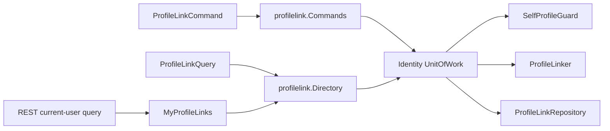
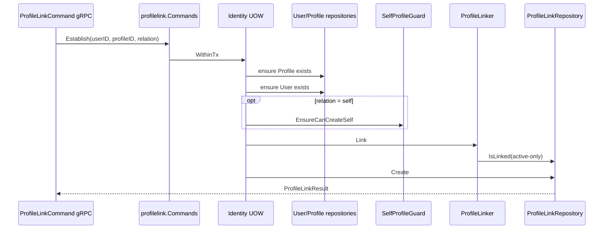
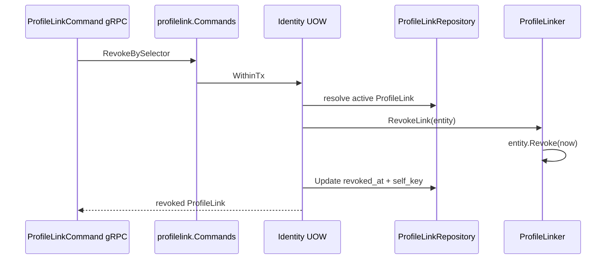

# 关键链路：建立与撤销 ProfileLink

> 状态：已实现 · 已核对 domain、application、REST/gRPC、MySQL repository、唯一索引和测试。

## 1. 本文回答

- 为什么建立关系是独立用例，而不是直接更新 User 或 Profile？
- relation 和 type 在哪一层解析、推导和校验？
- active pair、active self 和历史组合唯一有什么不同？
- 为什么撤销使用软撤销？
- 为什么领域实体幂等不等于 gRPC 接口幂等成功？
- active-only 和 including-revoked 查询为什么必须分开？
- BatchRevoke 和 Import 是一个批事务吗？
- 并发建立和并发撤销的真实保证是什么？

## 2. 30 秒结论

ProfileLink 是 Identity 中可独立查询和撤销的关系事实。建立关系要在一个 Identity 事务中确认 User/Profile 存在、检查 active pair 和 active self，然后插入 ProfileLink。

```text
Establish
  -> validate participants
  -> parse Relation
  -> guard active self when Rel=self
  -> reject active User/Profile pair
  -> derive Type from Relation
  -> insert ProfileLink

Revoke
  -> resolve active link
  -> set RevokedAt
  -> update ProfileLink
```

当前关键语义：

- 建立和撤销只通过 Identity gRPC 暴露；REST 只提供当前 User 视角的查询；
- relation 由调用方提供，type 由 domain 推导，调用方不能单独选 type；
- 撤销保留记录，active 查询隐藏 revoked，history 查询可包含 revoked；
- domain `Revoke` 只在同一实体实例上保留首次时间；并发请求可以加载不同实体实例，当前 DB 更新不能保证全局“首次撤销时间”；
- `uk_user_profile_link(user_id, profile_id, type)` 覆盖全部历史，撤销后不能重建同 Type；
- BatchRevoke/Import 逐项执行单条命令，每项独立事务，允许部分成功。

## 3. 问题背景

### 3.1 关系是有生命周期的事实

如果只在 User 上保存 ProfileID 集合，或在 Profile 上保存 owner UserID，系统无法表达：

- 同一 User 与不同 Profile 的关系语义；
- 同一 Profile 被多个 User 关联；
- 关系何时建立和撤销；
- 某个 User/Profile pair 是否当前 active；
- 一个 User 是否已有 active self Profile。

因此 ProfileLink 不只是关联表，也是有独立 ID、关系语义和撤销行为的领域实体。

### 3.2 “当前有关系”与“历史上有过关系”是不同查询

业务访问通常只能使用 active link，但运营、排障或审计可能需要看到已撤销记录。如果 repository 只有一组含糊的 `Find` 方法，已撤销关系容易被误用为当前关系。

当前将两类语义写进 repository 和 application 方法名：

```text
Find...                         -> active-only
Find...IncludingRevoked        -> active + revoked
```

## 4. 设计目标与约束

| 目标或约束 | 设计回应 |
| --- | --- |
| User/Profile 独立存在 | ProfileLink 只持有 ID，建立时由 application 校验参与者 |
| relation 由业务输入，type 不应被伪造 | transport 只传 relation，domain `TypeFromRelation` 推导 type |
| 同 User/Profile 同时只有一条 active link | `Linker.IsLinked` 事务内预检查 |
| 同 User 最多一条 active self | `SelfProfileGuard` + DB `self_key` 唯一键 |
| 并发插入要有最终裁决 | DB duplicate translator 将唯一键冲突转为 ProfileLink 业务错误 |
| 保留关系历史 | 写 `RevokedAt`，不物理删除 |
| 当前访问不得误用历史关系 | active-only 为默认，history 必须显式 opt-in |
| 内部批处理需要返回逐项结果 | proto 同时提供 success 和 failure 列表 |

## 5. 当前能力与主链路

| 能力 | REST | gRPC | 默认范围 |
| --- | --- | --- | --- |
| 判断 active link | 无 | `HasProfileLink` | active-only |
| 按 User 列出 Profile | `/identity/me/profiles`、`/identity/profile-links` | `ListProfiles` | active-only，可显式包含 revoked |
| 按 Profile 列出 Link | `/identity/profile-links` | `ListProfileLinks` | REST 要求当前 User 对 Profile 有 active link |
| 建立关系 | 无 | `EstablishProfileLink` | 单条事务 |
| 撤销关系 | 无 | `RevokeProfileLink` | 单条事务 |
| 批量撤销 | 无 | `BatchRevokeProfileLinks` | 逐项事务，部分成功 |
| 批量导入 | 无 | `ImportProfileLinks` | 逐项事务，部分成功 |



## 6. 核心设计决策

### 6.1 决策 A：调用方提供 Relation，Type 由 Domain 推导

> 标签：设计决策 · proto、mapper 和 `TypeFromRelation` 可证明

**解决的问题**

防止调用方传入自相矛盾的 `relation=self, type=relation` 或 `relation=parent, type=self`。

**选择**

gRPC 只提供 relation enum；domain 统一将 `RelSelf` 推导为 `TypeSelf`，其他 relation 推导为 `TypeRelation`。

**替代方案**

1. relation/type 都由调用方提供，服务端校验组合；
2. 只持久化 relation，type 在查询时计算；
3. 只保留 type，丢弃细分关系。

**取舍**

当前方案保持对外输入单一，但在存储中留下可由 relation 派生的冗余 type。为什么长期必须持久化两者尚缺决策记录，详见 [01-领域模型](01-领域模型-User-Profile-ProfileLink.md)。

### 6.2 决策 B：active self 用预检查和 DB 唯一键双层保护

> 标签：设计决策 · `SelfProfileGuard`、migration `000007` 和并发测试可证明

**解决的问题**

应用预检查可以提供业务错误，但两个并发请求可能同时看到“没有 self”。

**选择**

- `SelfProfileGuard` 在事务内检查 active self；
- repository 为 active self 写入 `self_key=user_id`；
- `uk_active_self_profile_link(self_key)` 在数据库中只允许一条；
- revoked 时 `self_key` 变为 `NULL`，释放 active 唯一位。

**替代方案**

- 只依靠 application 查询；
- 对 User 行加锁并在代码中串行化；
- 在 User 上保存固定 self_profile_id。

**取舍**

`self_key` 是为 MySQL 表达“只对 active self 唯一”引入的持久化技巧，它不是新的领域概念。

### 6.3 决策 C：撤销保留历史，且 active-only 默认优先

> 标签：设计决策 · entity、repository 和 REST/gRPC query 契约可证明

**解决的问题**

在不丢失关系历史的前提下，保证日常业务查询不误用已失效关系。

**选择**

`RevokedAt=nil` 为 active；撤销只写时间。Repository 默认方法追加 `revoked_at IS NULL`，只有 `IncludingRevoked` 方法读取历史。

**替代方案**

1. 物理删除 ProfileLink；
2. 所有查询默认返回历史，调用方自行过滤；
3. 主表只保留 active，撤销后搬到审计表。

**取舍**

软撤销使查询和唯一性模型更复杂，所有派生读模型也必须显式处理 `revoked_at`。当前 Suggest Loader 没有过滤它，是已知缺口。

### 6.4 决策 D：批处理返回逐项成功/失败，而非一个原子批事务

> 标签：当前契约决策；原始业务动机待确认

proto 的 batch response 同时定义 `revoked/created` 和 `failures`。Transport 遍历每条记录，复用单条 gRPC handler，因此每条都开启独立 application 事务。

**替代方案**

- 整批单事务，任一失败全部回滚；
- 先全量预检，全部合法后再批量写入；
- 异步 job，通过 job status 返回进度。

当前方案适合希望尽量处理有效项的导入/治理任务，但仓库内没有足够决策记录证明这正是原始业务要求。在确认前，只能将“部分成功”视为当前契约，不应扩展出未记录的理由。

## 7. 建立 ProfileLink 链路

### 7.1 输入与解析

gRPC `EstablishProfileLink` 要求非空 `user_id` 和 `profile_id`。`relation` 通过 `protoRelationToString` 转换；unspecified 和未知枚举均映射为 `other`。

application 再调用 `domain.ParseRelation`，同样会把未知字符串降级为 `RelOther`。所以当前入口不存在“未知 relation 返回 InvalidArgument”的行为。

### 7.2 时序



### 7.3 三类唯一性不要混淆

| 规则 | 检查范围 | 实际后果 |
| --- | --- | --- |
| `IsLinked(user, profile)` | 同 pair 的任意 active link | 不允许同一 pair 同时存在多条 active relation |
| `SelfProfileGuard` | 同 User 的 active self | 同 User 最多一条 active self，不限制普通 relation 数量 |
| `uk_user_profile_link(user_id, profile_id,type)` | 全部历史 | 同 pair 的同 Type 撤销后也不能重建 |
| `uk_active_self_profile_link(self_key)` | active self | 并发建立 self 时最终只允许一条 |

一个容易忽略的后果：parent、grandparent 和 other 都映射为 `TypeRelation`。因此撤销 parent 后，尝试为同一 pair 创建 grandparent/other 也会命中历史组合唯一键。

## 8. 撤销 ProfileLink 链路

### 8.1 selector 和 active 前置

gRPC 支持两类 selector：

- `profile_link_id`；
- `user_id + profile_id`。

ID selector 会先加载 ProfileLink，并显式拒绝 `nil` 或已 revoked 实体。Pair selector 通过 repository active-only 查询解析。两条路径都要求当前存在 active link。

### 8.2 时序



撤销不会：

- 删除 User 或 Profile；
- 物理删除 ProfileLink；
- 修改 AuthZ RoleBinding/Permission；
- 撤销 AuthN Session；
- 直接刷新 Suggest 索引。

### 8.3 幂等边界

| 层次 | 重复撤销语义 |
| --- | --- |
| `ProfileLink.Revoke(at)` | 同一实体实例重复调用时不覆盖已有 `RevokedAt` |
| `ProfileLinker.RevokeLink(entity)` | 对传入的已加载实体保持上述语义 |
| application/gRPC | 只解析 active link；重复请求返回 not-found 类错误，不是成功幂等 |

### 8.4 并发撤销并不保证全局保留第一次时间

`ProfileLink` 中的 mutex 只保护一个 Go 实体实例。两个并发请求可以：

1. 分别从数据库加载两个 active 实体实例；
2. 分别写入不同 `RevokedAt`；
3. 使用只按 `id` 过滤的 `UPDATE`；
4. 后提交者可能覆盖先提交时间。

当前 repository 没有使用 `WHERE id=? AND revoked_at IS NULL` 的条件更新，也没有检查 affected rows 来区分并发败者。

> 标签：已知缺口。如果全局首次撤销时间是审计不变量，需要条件更新、行锁或等价存储约束。

## 9. 查询链路

### 9.1 系统视角与当前用户视角

| 视角 | application 能力 | 访问范围 |
| --- | --- | --- |
| 系统侧 gRPC | `profilelink.Directory` | 按请求的 UserID/ProfileID 查询，不应用 REST 当前 User 限制 |
| 当前用户 REST | `MyProfileLinks` | UserID 强制改为当前 User；按 Profile 查询前要求当前 User 有 active link |

REST `include_revoked=true` 会使 `Active=false`，然后调用 `IncludingRevoked` 查询。兼容参数 `active=false` 也是“包含 revoked”，而不是“只返回 revoked”。

### 9.2 查询的组装代价

- 按 User 列 ProfileLink 后，application 使用 `Profiles.FindByIDs` 批量加载 Profile，避免 N+1；
- gRPC 按 Profile 列 Link 后，transport 使用 `UserDirectory.BatchGetByID` 批量加载 User，并按 link 原顺序组装 edge；
- 架构测试保护上述两处不回退为逐条查询。

## 10. 批量撤销与导入

```text
for each target/record:
    call single Revoke/Establish handler
    open one application transaction
    append success or failure
continue
```

这意味着：

- 中间一项失败不会回滚已成功项；
- 失败不会阻止后续项执行；
- 重试时已成功项可能因 active duplicate 或已 revoked 而返回失败；
- 调用方必须按分项结果做重试或对账，不能只根据 RPC 无顶层错误就判定全部成功。

`reason` 和 `operator` 存在于 proto，但单条 handler/application/domain 当前没有消费或持久化它们。

## 11. 已知缺口与复议条件

| 项目 | 当前状态 | 需要决策或修复 |
| --- | --- | --- |
| 未知 relation | 静默降级 `other` | 确认兼容性政策，决定是否改为严格拒绝 |
| 撤销后重建 | DB 禁止同 pair/type 历史重复 | 确认关系是否允许多周期建立；若允许需改 schema 与测试 |
| 并发撤销时间 | 后写可能覆盖先写 | 如属审计不变量，使用条件更新或锁 |
| API 撤销幂等 | 重复撤销返错 | 确认客户端重试契约，再决定是否改为幂等成功 |
| batch 原子性 | 部分成功 | 业务如要求全或无，需要新的 application batch UOW，不能只修 transport |
| 审计上下文 | reason/operator 被忽略 | 定义审计模型、持久化或事件后端到端落地 |
| Suggest 同步 | 无 ProfileLink 事件，Loader 不过滤 revoked | 先修正派生数据，再决定定时或事件刷新 |
| 参与者完整性 | application 校验，DB 无 FK | 确认是否继续依赖受控写入边界 |

## 12. 事实源与 Verify

| 内容 | 路径 |
| --- | --- |
| gRPC 契约和 handler | `api/grpc/iam/identity/v2/identity.proto`、`internal/apiserver/transport/grpc/service/identity/profile_link_command.go`、`profile_link_query.go` |
| 建立/撤销编排 | `internal/apiserver/application/identity/profilelink/service_command.go` |
| 当前用户访问 | `internal/apiserver/application/identity/profilelink/service_access.go` |
| active/history 查询 | `internal/apiserver/application/identity/profilelink/service_query.go` |
| 关系实体与规则 | `internal/apiserver/domain/identity/profilelink` |
| MySQL 过滤与更新 | `internal/apiserver/infra/mysql/profilelink/repo.go` |
| 唯一约束 | `internal/pkg/migration/migrations/000001_init_schema.up.sql`、`000007_add_active_self_profile_link_guard.up.sql` |
| N+1 护栏 | `internal/pkg/architecture/architecture_test.go` |

```bash
go test ./internal/apiserver/domain/identity/profilelink
go test ./internal/apiserver/application/identity/profilelink
go test ./internal/apiserver/infra/mysql/profilelink
go test ./internal/apiserver/transport/grpc/service/identity
go test ./internal/apiserver/transport/rest/identity/handler
go test ./internal/pkg/architecture
```

## 13. 继续阅读

- ProfileLink 模型、Type/Rel 和不变量：[01-领域模型](01-领域模型-User-Profile-ProfileLink.md)
- Profile 组合创建中如何复用 Linker：[02-创建 User 与 Profile](02-关键链路-创建User与Profile.md)
- ProfileLink 与 AuthZ/Suggest 的边界：[04-模块边界](04-模块边界-Identity与AuthN-AuthZ-Suggest.md)
- 关系事实不是权限：[ProfileLink 为什么不是 Permission](../../05-专题设计/05-ProfileLink为什么不是Permission.md)
