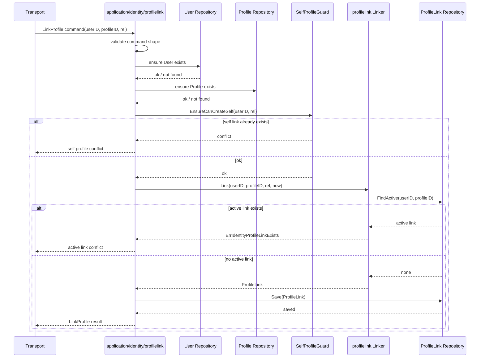
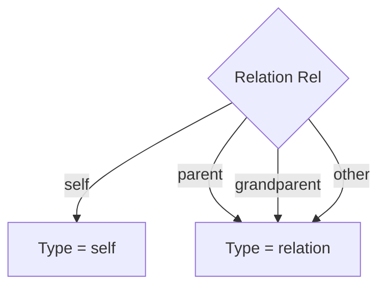
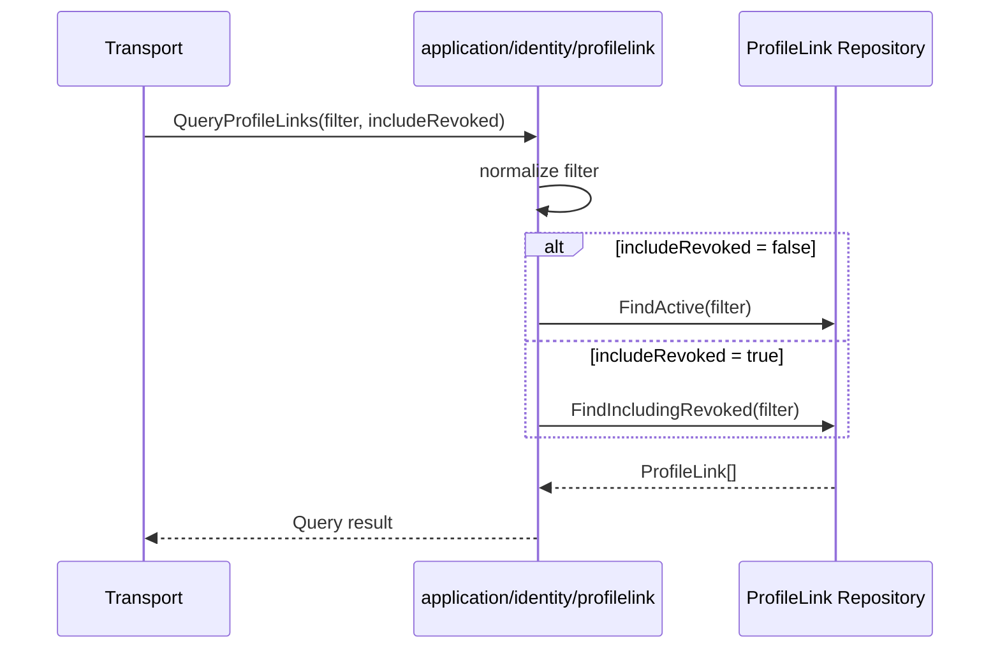
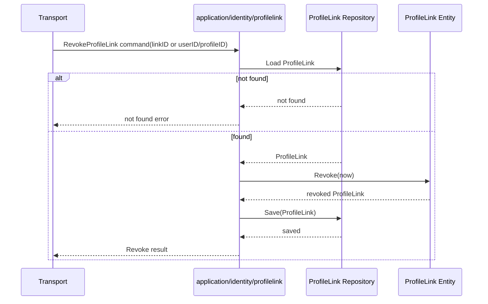

# 关键链路：建立与撤销 ProfileLink

> 状态：待补证据 · 第一版正文，待继续按 `domain/identity/profilelink`、`application/identity/profilelink`、REST/gRPC 契约和测试逐项核对。

---

## 1. 本文回答

本文回答 8 个问题：

- `ProfileLink` 这条链路解决什么问题？
- 为什么 User 与 Profile 的关系必须通过 `ProfileLink` 显式建立？
- 建立 ProfileLink 时如何处理 `Rel`、`Type`、active link 和 self 档案唯一性？
- 撤销 ProfileLink 为什么是软撤销，而不是删除关系？
- 查询 ProfileLink 时为什么要区分 active 与 including revoked？
- `ProfileLink` 为什么不是授权策略，也不是 Suggest 可见范围？
- transport、application、domain、repository 在链路中各自负责什么？
- 修改该链路时应该核对哪些代码和测试？

本文只讲 `ProfileLink` 建立、查询、撤销。
创建 `User` 与 `Profile` 见 [02-关键链路-创建User与Profile.md](02-关键链路-创建User与Profile.md)；
领域模型见 [01-领域模型-User-Profile-ProfileLink.md](01-领域模型-User-Profile-ProfileLink.md)。

---

## 2. 30 秒结论

`ProfileLink` 是 `User` 与 `Profile` 之间的一条身份关系事实。

它回答：

```text
某个 User 和某个 Profile 是否有关联？
这个关联是什么关系？
关系什么时候建立？
关系是否已经撤销？
```

核心规则：

```text
ProfileLink 通过 UserID + ProfileID 引用双方；
Rel 表达关系语义：self / parent / grandparent / other；
Type 由 Rel 推导：self -> self，其他 -> relation；
已存在 active ProfileLink 时不可重复建立；
同一 User 至多一条 active self 档案；
撤销是软撤销：写入 RevokedAt，不删除记录；
重复撤销应保持幂等，不覆盖首次 RevokedAt；
查询需要明确 active-only 还是 including revoked。
```

最重要的边界：

```text
ProfileLink 不是 Permission；
ProfileLink 不是 RoleBinding；
ProfileLink 不是 Suggest 可见范围；
ProfileLink 不决定最终资源访问权。
```

如果只记一句话：

> ProfileLink 只表达身份关系事实，授权访问仍由 AuthZ 判断，联想搜索可见性仍由 Suggest + AuthZ 范围控制。

---

## 3. 链路总览

```mermaid
flowchart TD
    T["Transport\nREST / gRPC"]
    A["Application\nidentity/profilelink"]
    Guard["Domain\nSelfProfileGuard"]
    Linker["Domain\nprofilelink.Linker"]
    Entity["Domain\nProfileLink"]
    Repo["ProfileLink Repository"]

    T -->|Link command| A
    A -->|self rule| Guard
    A -->|create relation| Linker
    Linker -->|check active duplicate| Repo
    Linker --> Entity
    A -->|persist| Repo

    T -->|Revoke command| A
    A -->|load link| Repo
    A -->|Revoke(at)| Entity
    A -->|persist revoked| Repo

    T -->|Query command| A
    A -->|active / including revoked| Repo
```

这张图表达 4 个边界：

```text
transport 只解析请求并调用 application；
application 负责编排规则校验、加载、保存和事务边界；
domain 负责表达关系创建、self 唯一性、软撤销和幂等；
repository 负责查询和持久化 ProfileLink 事实。
```

---

## 4. 为什么需要 ProfileLink

`User` 和 `Profile` 是两个独立实体。

```text
User    = IAM 内部稳定身份主体
Profile = 业务档案 / 被服务对象
```

二者之间不能靠内嵌字段表达关系，因为需要支持：

```text
一个 User 关联多个 Profile；
一个 Profile 被多个 User 以不同关系引用；
关系类型 self / parent / grandparent / other；
关系建立时间；
关系撤销时间；
关系历史追溯；
active-only 查询和历史查询。
```

因此需要 `ProfileLink`：

```text
ProfileLink = UserID + ProfileID + Rel + Type + EstablishedAt + RevokedAt
```

它是 Identity 的关系事实，不是 AuthZ 的授权事实。

---

## 5. 建立 ProfileLink 链路

### 5.1 链路目标

建立 ProfileLink 的目标是声明：

```text
某个 User 与某个 Profile 存在某种身份关系。
```

例如：

```text
User A 是 Profile A 的本人；
User A 是 Profile B 的家长；
User A 是 Profile C 的祖辈；
User A 与 Profile D 是其他关系。
```

建立 ProfileLink 不负责：

```text
创建 User；
创建 Profile；
创建 LoginIdentity；
签发 Token；
创建 Permission；
创建 RoleBinding；
写入 Suggest 索引。
```

---

### 5.2 输入与输出

输入通常包括：

```text
UserID；
ProfileID；
Rel；
EstablishedAt 或由服务端生成的当前时间。
```

其中：

```text
UserID 必须指向已存在 User；
ProfileID 必须指向已存在 Profile；
Rel 应能解析为 self / parent / grandparent / other；
Type 不应由外部直接决定，而应由 Rel 推导。
```

输出通常包括：

```text
ProfileLinkID；
UserID；
ProfileID；
Type；
Rel；
EstablishedAt；
RevokedAt；
IsActive。
```

具体字段必须以 REST OpenAPI、gRPC proto 和当前 application DTO 为准。

---

### 5.3 时序图



注意：上图是推荐领域流程图，具体 repository 方法名和 User/Profile 存在性检查位置以当前代码为准。

---

### 5.4 分层职责

| 层 | 职责 |
| --- | --- |
| transport | 解析 REST/gRPC 请求，构造 LinkProfile command，映射响应和错误 |
| application | 校验 User/Profile 存在性，编排 self guard、Linker、repository，控制事务边界 |
| domain | 表达 Rel/Type 推导、active link 冲突、self 档案唯一性、ProfileLink 构造 |
| repository | 查询 active link、保存 ProfileLink、支持 active/history 查询 |

关键边界：

```text
transport 不直接查 repository；
repository 不决定 Rel/Type 业务语义；
Type 不应由客户端直接决定；
self 唯一性是 Identity 领域规则；
授权判断不在该链路中完成。
```

---

### 5.5 Rel 与 Type 推导

`Rel` 表达用户与档案之间的业务关系。

| Rel | Type | 含义 |
| --- | --- | --- |
| `self` | `self` | 本人档案关系 |
| `parent` | `relation` | 家长关系 |
| `grandparent` | `relation` | 祖辈关系 |
| `other` | `relation` | 其他关系 |

推导规则：

```text
RelSelf -> TypeSelf；
其他 Rel -> TypeRelation。
```



边界：

```text
self 是本人档案关系，不是本人账号；
parent/grandparent/other 是身份关系，不是访问权限；
Type = relation 不代表可访问 Profile；
是否可访问资源仍由 AuthZ Check 判定。
```

---

### 5.6 active link 去重规则

建立 ProfileLink 时必须避免重复 active 关系。

规则：

```text
如果同一 UserID + ProfileID 已存在 active ProfileLink，则不可重复建立；
active 的判断基于 RevokedAt 是否为 nil；
已 revoked 的历史关系不应阻止后续重新建立新 active 关系，具体是否允许要以代码实现为准；
重复 active 关系应返回冲突错误。
```

代码事实源：

```text
internal/apiserver/domain/identity/profilelink/linker.go
internal/apiserver/domain/identity/profilelink/profile_link.go
```

并发注意：

```text
应用层检查不能完全避免并发重复；
repository/database 应用唯一约束或事务机制兜底 active link 唯一性；
如果存储层无法直接表达 active-only 唯一约束，需要在 application/repository 中设计一致性策略。
```

---

### 5.7 self 档案唯一性

同一个 User 至多只能有一条 active 的 `self` 档案关系。

规则：

```text
Rel = self 时，需要检查该 User 是否已经存在 active self ProfileLink；
如果已存在 active self，禁止再创建第二条 active self；
parent / grandparent / other 不属于 self 档案；
撤销已有 self 关系后是否允许重新建立 self，必须以代码和业务规则为准。
```

代码事实源：

```text
internal/apiserver/domain/identity/profilelink/self_profile_guard.go
```

业务含义：

```text
一个用户可以管理多个档案；
但“本人档案”只能有一个 active 关系；
其他关系不能冒充 self。
```

---

## 6. 查询 ProfileLink 链路

### 6.1 为什么查询要区分 active 和 including revoked

ProfileLink 是软撤销模型。

因此查询必须区分两种语义：

```text
active-only：只看当前有效关系；
including revoked：包含历史关系，用于审计、追溯、管理端查看。
```

如果不区分，会导致：

```text
业务误把已撤销关系当成有效关系；
历史追溯无法看到已撤销关系；
Suggest 或 AuthZ 错误消费历史关系；
管理端无法解释关系为什么失效。
```

---

### 6.2 查询类型

常见查询可以包括：

| 查询 | 语义 |
| --- | --- |
| 按 User 查询 active ProfileLink | 查看某个用户当前关联哪些档案 |
| 按 Profile 查询 active ProfileLink | 查看某个档案当前被哪些用户关联 |
| 按 User + Profile 查询 active ProfileLink | 判断二者当前是否有关联 |
| 按 User 查询 including revoked | 查看用户关系历史 |
| 按 Profile 查询 including revoked | 查看档案关系历史 |
| 按 Rel 查询 | 查看 self、parent 等特定关系 |

具体查询能力必须以当前 application、repository 和契约为准。

---

### 6.3 查询链路图



关键边界：

```text
active-only 是业务常用默认语义；
including revoked 应明确命名，避免误用；
查询 ProfileLink 不等于授权 Check；
查询 ProfileLink 不应绕过可见范围直接暴露敏感档案。
```

---

## 7. 撤销 ProfileLink 链路

### 7.1 链路目标

撤销 ProfileLink 的目标是让一条关系失效，同时保留历史事实。

它不负责：

```text
删除 User；
删除 Profile；
删除历史关系记录；
撤销 AuthZ Permission；
撤销 AuthN Session；
删除 Suggest 索引。
```

---

### 7.2 时序图



注意：撤销入口使用 `linkID` 还是 `userID + profileID`，必须以当前契约和 application 实现为准。

---

### 7.3 软撤销规则

撤销由 `RevokedAt` 表达。

| RevokedAt | 语义 | IsActive |
| --- | --- | --- |
| `nil` | 当前有效关系 | true |
| 非 `nil` | 已撤销关系 | false |

撤销规则：

```text
首次撤销写入 RevokedAt；
重复撤销不覆盖首次 RevokedAt；
撤销保留关系历史；
撤销后 active 查询不再返回该关系；
including revoked 查询仍可返回该关系。
```

代码事实源：

```text
internal/apiserver/domain/identity/profilelink/profile_link.go
```

---

### 7.4 撤销失败边界

| 场景 | 期望行为 | 说明 |
| --- | --- | --- |
| ProfileLink 不存在 | 返回 not found | 不应伪造成功，除非明确设计为幂等接口 |
| ProfileLink 已撤销 | 幂等保持已撤销状态 | 不覆盖首次 RevokedAt |
| repository 保存失败 | 返回服务端错误 | 不应在响应中伪造撤销成功 |
| 并发撤销同一关系 | 最终只有一个首次 RevokedAt | 需要 repository/事务保证一致性 |

是否把“撤销不存在关系”设计为幂等成功，要以当前 API 语义为准。本文不假设已实现。

---

## 8. ProfileLink 与 AuthZ 的边界

ProfileLink 经常被误解成权限，这是 Identity 文档中必须反复强调的边界。

ProfileLink 回答：

```text
User 和 Profile 是什么身份关系？
```

AuthZ Check 回答：

```text
Subject 能否对 Resource 执行 Action，并满足 Scope？
```

对比：

| 概念 | 所属模块 | 核心字段 | 回答的问题 |
| --- | --- | --- | --- |
| `ProfileLink` | Identity | `UserID, ProfileID, Rel, RevokedAt` | User 与 Profile 是什么身份关系 |
| `RoleBinding` | AuthZ | `Subject, Role, Scope` | Subject 被绑定了什么角色 |
| `Permission` | AuthZ | `Resource, Action, Scope` | 角色拥有什么能力 |
| `Check` | AuthZ | `Subject, Resource, Action, Scope` | 是否允许访问 |

结论：

```text
有 ProfileLink 不等于有访问权；
没有 ProfileLink 也不必然等于无任何访问权；
是否能访问资源仍由 AuthZ Check 判定；
ProfileLink 不应该写 Resource/Action/Scope 字段。
```

---

## 9. ProfileLink 与 Suggest 的边界

Suggest 可以消费 Identity 的 Profile 事实和必要的可见范围，但 `ProfileLink` 不等于 Suggest 可见范围。

边界：

```text
ProfileLink 是身份关系事实；
ProfileAccessScope 是 Suggest 查询可见范围；
Suggest Snapshot 是读模型；
ProfileLink 不应直接变成搜索可见性规则；
手机号搜索、脱敏、限流、审计仍属于 Suggest 安全策略。
```

正确理解：

```text
Suggest 可以参考 ProfileLink 或 AuthZ 范围做过滤；
但最终是否能返回某个 Profile，应由 Suggest 查询策略和 AuthZ 可见范围共同决定；
不能因为存在 parent ProfileLink 就无条件返回 Profile 给任意请求。
```

---

## 10. 事务边界

建立和撤销 ProfileLink 都是写链路，需要明确事务边界。

推荐原则：

```text
一个 Link/Revoke 用例明确一个事务边界；
检查和写入应在同一事务语义内完成；
active link 去重需要 repository/database 兜底；
self 唯一性需要 repository/database 或事务机制兜底；
transport 不持有事务；
domain 不知道事务实现。
```

并发风险：

```text
两个请求同时为同一 User/Profile 建立 active link；
两个请求同时为同一 User 建立 self link；
一个请求撤销，另一个请求同时查询 active；
两个请求同时撤销同一 link。
```

建议：

```text
application 层做显式规则检查；
repository/database 层通过唯一约束、事务、锁或条件更新兜底；
并发冲突统一映射为 conflict 或可重试错误；
撤销操作保持幂等。
```

---

## 11. 常见反模式

| 反模式 | 问题 | 推荐做法 |
| --- | --- | --- |
| 建立 ProfileLink 时不校验 User/Profile 是否存在 | 产生悬挂关系 | application 显式校验或 repository 外键/约束兜底 |
| Type 由客户端传入 | 客户端可绕过 Rel 推导规则 | Type 由 Rel 推导 |
| 允许重复 active link | 当前关系语义不唯一 | Linker + repository/database 兜底 |
| 允许多个 active self link | 本人档案语义混乱 | SelfProfileGuard + repository/database 兜底 |
| 物理删除 ProfileLink 表示撤销 | 历史关系丢失 | 使用 RevokedAt 软撤销 |
| 重复撤销覆盖 RevokedAt | 首次撤销时间丢失 | Revoke 幂等，不覆盖首次时间 |
| 把 ProfileLink 当 Permission | 身份关系和授权事实混淆 | 授权由 AuthZ Check 决定 |
| 把 ProfileLink 当 Suggest 可见范围 | 搜索可见性规则过度简化 | Suggest 使用 ProfileAccessScope/AuthZ 过滤 |
| 查询时不区分 active 和 revoked | 已撤销关系被误用 | API 和 repository 明确 active-only / including revoked |
| transport 直接写 ProfileLink repository | 协议层绕过业务规则 | handler 调 application service |

---

## 12. 代码事实源

| 事实 | 路径 |
| --- | --- |
| ProfileLink 字段与软撤销 | `internal/apiserver/domain/identity/profilelink/profile_link.go` |
| Type / Relation 定义与推导 | `internal/apiserver/domain/identity/profilelink/types.go` |
| 建立关系领域服务 | `internal/apiserver/domain/identity/profilelink/linker.go` |
| self 档案唯一性守卫 | `internal/apiserver/domain/identity/profilelink/self_profile_guard.go` |
| ProfileLink 用例编排 | `internal/apiserver/application/identity/profilelink` |
| User 实体 | `internal/apiserver/domain/identity/user` |
| Profile 实体 | `internal/apiserver/domain/identity/profile` |
| AuthZ Subject/Permission/RoleBinding | `internal/apiserver/domain/authz` |
| Suggest 读模型 | `internal/apiserver/domain/suggest` |
| REST transport | `internal/apiserver/transport/rest` |
| gRPC transport | `internal/apiserver/transport/grpc` |
| REST 契约 | `api/rest` |
| gRPC 契约 | `api/grpc` |

---

## 13. Verify

修改本文后至少执行：

```bash
make docs-hygiene
```

涉及 ProfileLink 领域规则时，执行：

```bash
go test ./internal/apiserver/domain/identity/...
```

涉及 ProfileLink 用例、查询、建立、撤销、事务边界时，执行：

```bash
go test ./internal/apiserver/application/identity/...
```

涉及 REST/gRPC 契约或 handler/service 时，执行：

```bash
make api-validate
make proto-gen
go test ./internal/apiserver/transport/rest/...
go test ./internal/apiserver/transport/grpc/...
```

涉及 AuthZ/Suggest 边界时，按实际影响执行：

```bash
go test ./internal/apiserver/domain/authz/...
go test ./internal/apiserver/domain/suggest/...
go test ./internal/pkg/architecture
```

---

## 14. 本文总结

建立与撤销 ProfileLink 可以压缩成两条链路：

```text
LinkProfile:
transport -> application/identity/profilelink -> SelfProfileGuard / Linker -> ProfileLinkRepository

RevokeProfileLink:
transport -> application/identity/profilelink -> load ProfileLink -> Revoke(at) -> ProfileLinkRepository
```

最重要的边界是：

```text
ProfileLink 是身份关系事实；
Rel 决定 Type；
active link 不可重复；
同一 User 至多一条 active self；
撤销是软撤销；
查询要区分 active 和 including revoked；
ProfileLink 不是 Permission；
ProfileLink 不是 Suggest 可见范围。
```

下一篇 [04-模块边界-Identity与AuthN-AuthZ-Suggest.md](04-模块边界-Identity与AuthN-AuthZ-Suggest.md) 将继续说明：
将继续从模块协作角度说明：Identity 如何向 AuthN、AuthZ、IDP、Suggest 提供身份事实，同时避免边界漂移。
