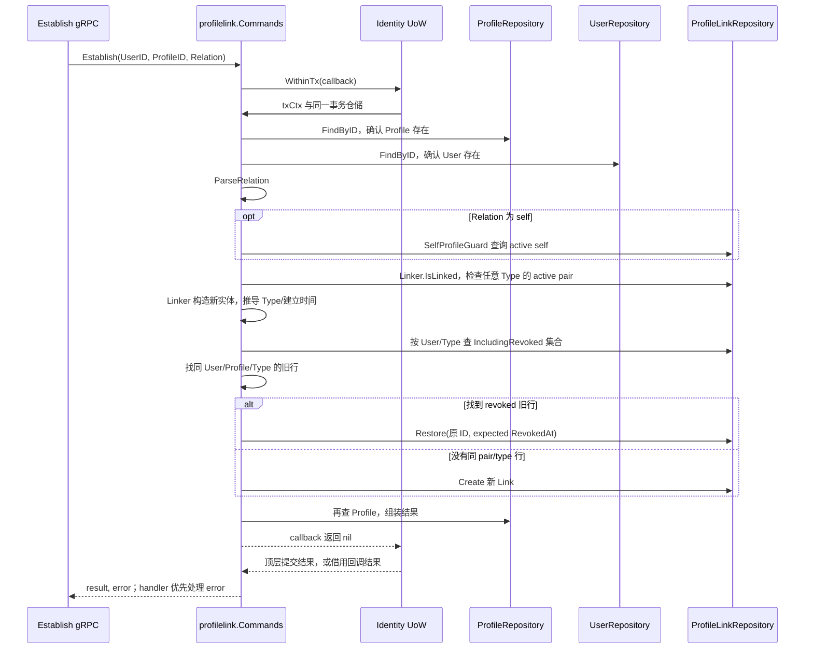
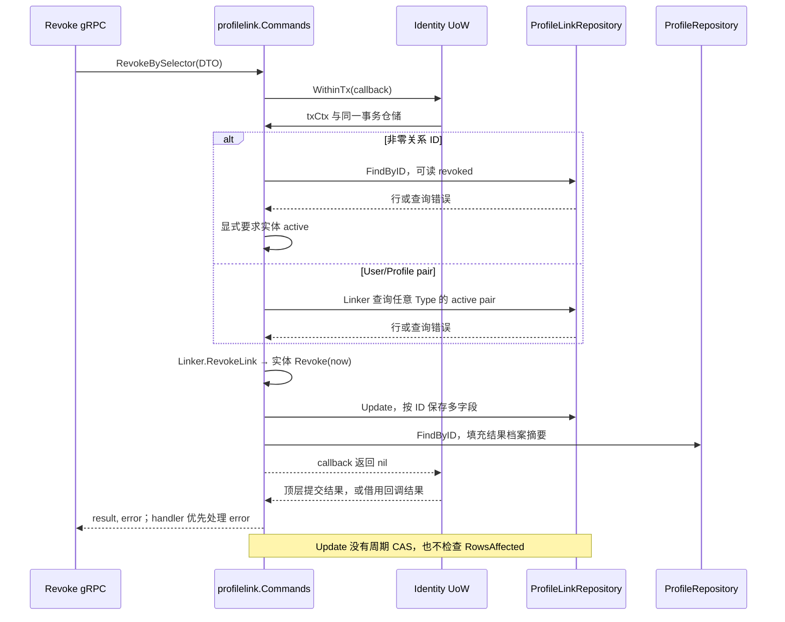

# 关键链路：建立与撤销 ProfileLink

> 状态：已实现 · 本文维护关系命令、读取、批处理和请求重试。交错与异常场景按源码推论标记；候选合同尚未实施。

## 1. 本文回答与关键结论

本篇回答已有 User/Profile 如何建立、恢复、撤销关系，调用失败或重试会怎样，以及“查到关系”具体证明什么。对象基数、Type/Rel 和 self_key 的完整不变量由[领域模型](01-领域模型-User-Profile-ProfileLink.md)维护；新建 Profile 时的组合事务由[创建链路](02-关键链路-创建User与Profile.md)维护。

| 场景 | 当前行为 | 需要记住的边界 |
| --- | --- | --- |
| 首次 Establish | 确认两端存在，检查 self/active pair，保存新 Link | 不证明关系真实性，不复核 User active，也不授予 AuthZ 能力 |
| 同 pair/type 撤销后 Establish | Restore 原 ID，更新 Rel/EstablishedAt，清空 RevokedAt | ID 不是某一次建立周期的唯一标识，旧周期被覆盖 |
| Revoke | 解析 active Link，实体撤销，Update，再读取 Profile 组装结果 | 更新只按 ID，没有周期/版本条件；API 不保证重复成功 |
| 系统 gRPC 查询 | 按服务请求的 UserID/ProfileID 查询 | 服务准入与最终用户对象访问不同，HasProfileLink 不是授权租约 |
| REST 关系查询 | 当前 User 自身列表或自身 pair，显式 include_revoked | 不提供普通登录用户查看 Profile 全部关联人的能力 |
| BatchRevoke / Import | 按输入顺序调用单条 handler，收集成功与失败 | 正常 RPC 各有效项独立事务；非空批次全失败也可顶层成功 |

以 U17/P42 为例：parent 关系 L8 撤销后，以 grandparent 再建立，二者同属 TypeRelation，因而恢复 L8，并重写关系及建立时间。若撤销 self 后改建 parent，则 Type 不同，可以产生另一行。查询、重试和审计都必须理解这两种情况，不能只看 ID 是否变化。

## 2. 入口、调用者与解析

当前公开写入口是 gRPC ProfileLinkCommand 的四个 RPC；REST 只注册 `GET /api/v2/identity/profile-links`。应用 MyProfileLinks 虽提供 Grant/Revoke，也不表示 REST 已开放这些写路由。

服务命令使用请求目标 User/Profile，没有 REST current-user 的所属限制。Establish 只验证两端存在；Revoke 不重新验证 User 的存在或状态。reason/operator 虽在协议中出现，单条命令没有消费它们。PO 审计读取 context，外层调用审计记录服务调用，具体区别见[创建链路的操作者说明](02-关键链路-创建User与Profile.md#2-谁在调用谁是目标审计写的是谁)。

| 输入 | 当前解析 |
| --- | --- |
| Establish.user_id / profile_id | 必须有字符串并能解析为范围内十进制 ID；解析器接受 `0`，不是正 ID 门禁 |
| Establish.relation | gRPC unspecified/未知枚举 → other；应用 ParseRelation 也将空或未知字符串降级 other |
| Revoke.target | proto oneof：关系 ID，或 User/Profile key；没有“两种 selector 同时传入再选择优先级”的 wire 合同 |
| 内部 Revoke DTO | 非零 ProfileLinkID 优先，使用读取行的 User/Profile，忽略 DTO pair；ID 为零则走 pair |
| Revoke ID 字符串 `0` | 能通过 transport 解析，应用随后落入零 pair 路径；不能写成 handler 会拒绝所有零 ID |

关系名是本次建立输入，Type 由 domain 推导。Linker 只检查关系值和 active pair、构造实体，不保存，也不自行执行 active self Guard；新增写入口仍须由应用编排 Guard 与仓储。存储恢复也不补做完整 Type/Rel 合法性校验，正常写路径与直写 SQL 的区别见模型。

## 3. Establish：从预检查到新建或恢复

### 3.1 真实顺序

图展开成功主路径，省略 Guard/Linker 内部转调；任一步 error 都终止 callback，不沿后续箭头继续。

```mermaid
sequenceDiagram
    participant G as Establish gRPC
    participant A as profilelink.Commands
    participant U as Identity UoW
    participant P as ProfileRepository
    participant UR as UserRepository
    participant R as ProfileLinkRepository

    G->>A: Establish(UserID, ProfileID, Relation)
    A->>U: WithinTx(callback)
    U->>A: txCtx 与同一事务仓储
    A->>P: FindByID，确认 Profile 存在
    A->>UR: FindByID，确认 User 存在
    A->>A: ParseRelation
    opt Relation 为 self
        A->>R: SelfProfileGuard 查询 active self
    end
    A->>R: Linker.IsLinked，检查任意 Type 的 active pair
    A->>A: Linker 构造新实体，推导 Type/建立时间
    A->>R: 按 User/Type 查 IncludingRevoked 集合
    A->>A: 找同 User/Profile/Type 的旧行
    alt 找到 revoked 旧行
        A->>R: Restore(原 ID, expected RevokedAt)
    else 没有同 pair/type 行
        A->>R: Create 新 Link
    end
    A->>P: 再查 Profile，组装结果
    A-->>U: callback 返回 nil
    U-->>A: 顶层提交结果，或借用回调结果
    A-->>G: result, error；handler 优先处理 error
```

参与者检查是普通读，没有 User/Profile 行锁，也没有 User.IsUsable 判断。persistEstablishedLink 按 User/Type 读取包含撤销行的集合，再在内存里匹配 pair；遇到已 active 的同键行仍报冲突，不进行资料更新。

保存后还会再查 Profile。这个查询失败时，正常顶层事务回滚本次 Create/Restore；不能因为 INSERT/UPDATE 已执行就认为建立成功。借用事务及提交结果未知的公共规则由[创建链路](02-关键链路-创建User与Profile.md#51-unitofwork-负责句柄与顶层提交应用负责步骤)维护：宿主须传播失败，内部非空 result 也不是提交凭证。

### 3.2 索引各自裁决什么

| 规则 | 当前保护 | 保护范围之外 |
| --- | --- | --- |
| 同 User/Profile active pair | Linker.IsLinked 查询任意 Type 的未撤销行 | 没有对应 active pair 数据库唯一键；跨 Type 并发仅靠预检查 |
| 一个 User 的 active self | Guard + 正常 mapper 写 self_key + 唯一索引 | 不限制一个 Profile 被多个 User 声明 self；不自动核验关系证明 |
| 同 User/Profile/Type | 所有行的组合唯一键 | 不按周期留多行；不限制不同 Type 的同时写入 |
| Restore 旧行 | WHERE 匹配 ID/User/Profile/Type/旧 RevokedAt，要求一行 | 没有 expected Version、deleted_at 或其他 Type 的 active pair 条件 |

self_key 是普通可空列，mapper 按 TypeSelf 且未撤销计算，数据库裁决的是非 NULL key 唯一。它不是自动生成列，也不校验 Type/Rel 配对；不能据一个唯一索引声称所有直写数据都满足领域规则。

同 Type 恢复会重写 Rel/EstablishedAt、清空 RevokedAt 并增加数据库 Version；不重新生成 ID，也不保留旧周期的完整内容。parent/grandparent/other 因同 Type 而互相覆盖，是当前生命周期语义，不是接口返回了新 ID 才算成功。

Restore 用撤销时间作为条件，而非独立周期 ID。若不同周期持久化相同撤销时间，仅该条件不足以区分周期；当前 DATETIME 存储、普通 Revoke 不推进 Version 等因素需要另定生命周期合同。这里仅指出条件保护的范围，没有 ABA 或真实 MySQL 交错专项证明。

## 4. Revoke：selector、写后查询与错误

### 4.1 一次撤销如何完成

```mermaid
sequenceDiagram
    participant G as Revoke gRPC
    participant A as profilelink.Commands
    participant U as Identity UoW
    participant R as ProfileLinkRepository
    participant P as ProfileRepository

    G->>A: RevokeBySelector(DTO)
    A->>U: WithinTx(callback)
    U->>A: txCtx 与同一事务仓储
    alt 非零关系 ID
        A->>R: FindByID，可读 revoked
        R-->>A: 行或查询错误
        A->>A: 显式要求实体 active
    else User/Profile pair
        A->>R: Linker 查询任意 Type 的 active pair
        R-->>A: 行或查询错误
    end
    A->>A: Linker.RevokeLink → 实体 Revoke(now)
    A->>R: Update，按 ID 保存多字段
    A->>P: FindByID，填充结果档案摘要
    A-->>U: callback 返回 nil
    U-->>A: 顶层提交结果，或借用回调结果
    A-->>G: result, error；handler 优先处理 error
    Note over A,R: Update 没有周期 CAS，也不检查 RowsAffected
```

Revoke 不删除 User/Profile，不物理删除 Link，不调用 AuthZ、SessionRevoker 或 Suggest 刷新。它保存 RevokedAt，并由 mapper 将 self_key 置 NULL，释放该 User 的 self 占位。

为了组装响应，撤销后必须读取 Profile。孤立 Link 的 User 已缺失而 Profile 仍在时，这条路径没有 User 存在性拒绝；Profile 已不存在时则在 Update 后失败，正常顶层事务会回滚此次撤销。两种情况不能概括成“撤销一定只依赖 Link”。

### 4.2 正常仓储装配下的错误差异

下表由源码与通用转换器联合推导，未通过完整 RPC 故障专项逐项实测。描述普通非取消/超时故障；保留了取消/超时 cause 的错误会先被转换器识别为 Canceled/DeadlineExceeded。

| 失败场景 | 实际错误路径 | gRPC status |
| --- | --- | --- |
| 缺失/非法 selector 或 ID 字符串 | handler 直接拒绝 | InvalidArgument |
| Establish 的 User/Profile 缺失 | 原 not-found 被参与者检查外层包装 ErrDatabase | Internal |
| active pair/self 冲突、INSERT duplicate | ErrIdentityProfileLinkExists，注册 HTTP 400 | InvalidArgument |
| Restore 旧条件失配，或影响行数不是 1 | ErrIdentityProfileLinkExists | InvalidArgument |
| ID selector 指向已存在但 revoked 行 | 显式 ErrIdentityProfileLinkNotFound | NotFound |
| ID selector 指向不存在行 | 原样 gorm.ErrRecordNotFound | Internal |
| pair selector 没有 active 行，含重复撤销 | Linker 将仓储 not-found 包装 ErrDatabase | Internal |
| 保存后读取的 Profile 缺失 | Profile repository ErrIdentityProfileNotFound 原样返回 | NotFound；顶层本次写入回滚 |

因此重复撤销不是统一的 NotFound，更不是统一幂等成功。业务码中的 Exists 也不等于 gRPC AlreadyExists。调用方不能靠错误名字或统一解析失败文本来决定“之前已经成功”。

## 5. 重复请求与并发周期：ID 不承担请求回执

### 5.1 实体幂等与命令幂等

ProfileLink.Revoke 在**同一个 Go 实体实例**上保留首次 RevokedAt，mutex 只保护该实例。两个请求各自加载实体后，仍可以保存不同撤销时间。

Repository.Update 只按 ID 更新 User/Profile/Type/Relation/SelfKey/EstablishedAt/RevokedAt，不匹配旧状态或 Version，不检查零影响行数。它保存的是旧实体的多字段，风险不只限于“最后写入覆盖首次撤销时间”。

例如以下为源码允许的交错，尚未做真实 MySQL 复现：

1. 慢撤销加载 L8：parent，EstablishedAt=t0，active。
2. 另一请求撤销 L8，随后以 grandparent Restore：L8 仍同 ID，EstablishedAt=t2。
3. 慢撤销保存旧实体，可能把 Relation/EstablishedAt 写回 parent/t0，并撤销新周期。

即使没有在途旧实体，客户端晚到的 ID 撤销也会重新读取已经恢复的 L8；协议没有 expected 周期，仍可撤销它。pair selector 不区分 Type/周期，操作的是当时查到的 active pair。若维护直写在查询后物理删行，普通零行 Update 也不会由此仓储判为失败。

### 5.2 SDK 重试不会恢复原命令结果

标准 SDK 的全方法默认重试策略及其实际触发条件见[创建链路](02-关键链路-创建User与Profile.md#61-创建命令没有请求结果幂等)。ProfileLink 四个命令封装只调用 gRPC 并包装顶层 error，没有请求键、expected 周期或按回执查找逻辑。

下表假设第一次已提交但客户端没拿到结果，随后再次执行；均为源码推论，不是网络断链验收：

| 再执行时状态 | 当前可能结果 |
| --- | --- |
| Establish 后仍 active | 冲突，不重放第一次成功结果 |
| Establish 后被另一请求 Revoke | 再次 Establish 可以 Restore，重新激活已撤销关系 |
| Revoke 后仍 revoked | ID 路径 NotFound，pair 路径 Internal |
| Revoke 后被另一请求 Restore | 再次 Revoke 可以撤销新周期，即便 ID 没变 |
| 整批已有部分成功 | 再执行整批时原成功项可能变失败，或跨周期重新改变状态 |

默认 gRPC 是否重发取决于状态、响应阶段、context 和连接配置；不能声称响应丢失必然重试。简单将“已 revoked”改为成功，也不能阻止旧请求在 Restore 后作用于新周期。

## 6. active/history 查询：范围、组装与一致性

### 6.1 每个入口实际返回什么

| 入口 | 当前范围与结果 |
| --- | --- |
| gRPC HasProfileLink | 先 IsLinked/count，再另行 Get 详情；第二步错误被忽略，可返回 true 且无详情 |
| gRPC ListProfiles(UserID) | 请求指定 User 的 Link 列表，可 include_revoked，随后批量补 Profile |
| gRPC ListProfileLinks(ProfileID) | 该 Profile 的 Link 列表，可 include_revoked，随后批量补 User；缺少 User 时保留 edge、User=nil |
| REST /identity/profile-links，无 ProfileID | 应用拒绝其他 UserID，强制当前 User；include_revoked 可列自身撤销记录 |
| REST /identity/profile-links，指定 ProfileID | 普通非零 current User 进入自身 pair 分支，最多一条；不会列该档案的其他关系人 |
| REST /identity/me/profiles | MyProfiles.List 只取未撤销 Link，没有 include_revoked 选项 |

REST 任何 `active` 参数，包括 `active=false` 或空值，都会返回参数错误；没有旧兼容路径。显式 include_revoked 表示**包含**撤销行，不是只取 revoked。

指定 ProfileID 时，即使 include_revoked=true，也先执行 Directory.Get 检查当前 active pair。只剩撤销关系就不能用这个 pair 入口看历史；不指定 ProfileID 的自身历史列表仍可用。这个检查还包含 Profile 读取，任何错误会被改写为 PermissionDenied，不能可靠区分“关系不存在”和“查询数据库故障”。

### 6.2 一条 pair、记录集合和完整历史不同

Repository 的 pair/list/IsLinked 显式用 revoked_at 过滤；FindByID 不过滤。DeletedAt 是普通指针，仓储没有自动删除过滤，mapper 也不将其投影成领域 active 判断；active 不等于“未删且两端可用”。

IncludingRevoked 的 pair Get 使用 First 一行，没有 Type 条件或 active/最近周期优先选择。例如旧 self 已撤销，新 relation active，这个 pair 的历史 Get 可以取到旧行；它不返回全部记录。User/Profile 的 IncludingRevoked list 才可能返回两个 Type 的多行，但同 Type 多周期已经被 Restore 覆盖。

HasProfileLink 的 count 不检查两端状态；正常无外层事务调用时，count 与 Get 分别进入 UoW。REST active pair 准入与后续历史读取同样是不同调用，关系可能在其间变化。内部 context 已有事务时，Required 可复用它，但仍不提供关系锁或持续授权租约。这些查询不锁住关系到业务提交，也不替代 AuthZ 动作、对象关系与业务状态的组合判断。

### 6.3 分页、顺序与查询次数的准确边界

| 路径 | 当前实现 | 限制 |
| --- | --- | --- |
| gRPC ListProfiles | 加载全部 Link/Profile 后内存切片；默认 20，上限 50 | Page 回显原请求，未体现默认/裁剪后的值；仓储没有显式排序，跨请求不是稳定快照 |
| SDK GetUserProfiles / IncludingRevoked helper | 使用无 Page 的 ListProfiles | 默认一页，不自动遍历所有页 |
| gRPC ListProfileLinks | 返回全部 edge，没有分页字段 | 全量关联及补 User；协议没有 Type、日期或排序筛选 |
| REST /identity/profile-links | 全部关系组装后内存分页；默认 20，负 offset 按 0 切片 | limit 没有与 gRPC 同等的 50 上限；响应 limit/offset 回显输入，可能与实际切片不同 |
| application Directory 按 User 列 Link | 去重 ProfileID，调用一次 FindByIDs，按 Link 顺序组装 | 缺 Profile 使整次失败；保持的是输入顺序，不是数据库稳定排序 |
| gRPC 按 Profile 列 Link | 去重 UserID，BatchGetByID 后按 Link 顺序组装 | 正常无外层事务调用时分别读取 Link 与 User，查询错误使整次失败；内部借用则可复用外层事务 |

两项架构护栏仅检查指定源文件的固定字符串，不证明全局 SQL 次数或性能。另有 stub 用例验证批量调用次数和保序；REST MyProfiles.List 仍逐条读取 Profile，不能把该护栏扩大为“所有档案查询无 N+1”。

## 7. BatchRevoke 与 Import：逐项结果不是整批回执

| 条件 | 当前结果 |
| --- | --- |
| nil 请求或空 targets/records | 顶层 InvalidArgument，不开始处理 |
| 非空集合中的参数错误 | 写进 failures；可能尚未进入 UoW |
| 正常 RPC 的有效记录 | 同步调用单条 handler，按项开启顶层事务 |
| 直接调用时 context 已借用事务 | 内层不独立提交；宿主决定提交/回滚与错误传播 |
| 任一项失败，包括全失败 | 循环继续；handler 最终可返回 response,nil |
| context 已取消 | 没有 ctx.Err() 的循环停止检查，仍继续调用后续 handler；实际存储受 context 约束，客户端可能拿不到响应 |

单条 handler 是同进程函数调用，不再进入 mTLS/ACL/调用审计拦截器。外层批次准入与审计不等于每项重新执行单条 RPC 的拦截器。

响应将成功项放入 revoked/created，失败项仅保留原 target/record 与安全错误文本，没有 status、业务码或原始输入索引。普通内部错误会变成 `internal server error`；调用方不能按文本可靠分类。Import.created 还可以包含 Restore 原 ID，并不证明执行了新 INSERT。SDK 原样返回 response，不把 failures 转成顶层 error；分项失败因此也不会自行触发基于顶层状态的 gRPC 重试。

例如导入 A、B、A：A 首次成功，B 失败，再次 A 因 active 冲突进入 failures。此前 A 不回滚；成功/失败列表没有输入索引，不能只按列表位置还原原顺序。正常有效项独立提交的设计减少坏记录对其他项的影响，代价是客户端承担分项核对和结果丢失后的恢复；仓库没有足够记录证明这就是原始业务动机。

若整批 RPC 的响应丢失，之前已提交项也不会因客户端报错自动回滚。只重试失败项需要拿到分项结果；重新发送整批还会面对第 5 节的跨周期副作用，不能用部分成功列表充当持久化批任务回执。

## 8. 撤销之后，消费者何时变化

Identity 命令不发布 ProfileLink 事件、不直接刷新 Suggest。内建 Loader 的下一次成功刷新重新按未删 Profile、未删且未撤销 Link、未删 User 形成资格；User.Status 不在此 SQL 条件中。

多条有效关系中撤销一条，候选仍可保留，Delta 重算聚合手机号后 Upsert；最后一条符合资格的关系失效，Delta 才输出 Delete。自定义 SQL 和实际 scheduler 状态还会影响传播，不能从 API 成功推出“Suggest 已消失”。

VisibleProfileIDs 按 Profile.created_by 解析，owner/组织等可见分支与当前 Link 不同。解绑不保证消除全部搜索可见性，也不撤销已有 Session/Assignment。关系事实与消费者范围详见[模型消费边界](01-领域模型-User-Profile-ProfileLink.md#7-有效删除可访问必须按消费位置解释)、[Suggest 刷新](../05-Suggest/02-关键链路-索引刷新Full-Delta.md)和[模块协作](04-模块边界-Identity与AuthN-AuthZ-Suggest.md)。

## 9. 候选合同与复议条件

以下均未实施。先决定业务要求，再选存储与接口改变：

| 需求 | 具体候选与代价 |
| --- | --- |
| 同 pair 跨 Type 并发也必须唯一 | 以独立 active pair key 裁决，或所有写入口锁定同一参与者/关系锚点；迁移前检查已有双 Type 行。仅增加普通查询或 self_key 不足以实现 |
| 首次撤销时间与新周期不可被旧写覆盖 | 将撤销改为按 ID + expected cycle/version 条件写，只更新撤销字段并检查影响行数；完整版本政策须覆盖 Revoke/Restore，不只依赖现在的 Restore Version+1 |
| 同一次请求重试可恢复结果 | caller/用例/请求键 + 输入指纹 + 结果回执同事务；配合周期前置，避免旧 Establish/Revoke 在新周期继续执行。回执范围/保留期/授权须与批任务明确 |
| 审计要保留每次关系变化 | 保留独立不可变周期或事件，记录 actor/caller/reason；或者明确当前只维护最新周期。若新周期采用新 ID，需调整现有 Restore 与唯一索引的兼容策略 |
| 终端用户可看档案关联人或完整历史 | 新建明确授权的查询用例，区分查看自身关系、档案参与者、已撤销历史；不能仅放开现有 MyProfileLinks 的 current User 限制 |
| 批处理要可靠恢复或全或无 | 可恢复 job 提供输入索引、稳定项键、结构化错误和结果查询；真全或无则在 application 增加批事务并处理规模/锁时长。只修改成功/失败响应结构不改变提交边界 |
| 外部索引必须在撤销后满足时效 | 先定义成功刷新/索引版本/查询预算证据，再选择定时刷新或事件与恢复；同时确认 owner/组织是否保留独立读取许可 |

专项至少覆盖：跨 Type 写竞争、旧 Revoke/Establish 重试跨 Restore 周期、写后 Profile 查询失败的顶层/借用事务、混合批次与取消/响应丢失、REST pair 历史与分页/稳定排序。文档重写没有代替这些合同或实现选择。

## 10. 事实源与验证范围

| 主题 | 当前事实源 |
| --- | --- |
| 命令/批处理/selector | `api/grpc/iam/identity/v2/identity.proto`；`internal/apiserver/transport/grpc/service/identity/profile_link_command.go` |
| 系统查询、分页与 edge | 同目录 `profile_link_query.go`、`profile_link_mapper.go` |
| 应用编排与当前 User | `internal/apiserver/application/identity/profilelink/{service_command,service_query,service_access,mapper}.go` |
| REST 参数和路由 | `internal/apiserver/transport/rest/identity/{router.go,handler/profile_link.go,request/profile_link.go}` |
| 实体/Guard/Linker | `internal/apiserver/domain/identity/profilelink` |
| 存储过滤、Update/Restore | `internal/apiserver/infra/mysql/profilelink/{repo,mapper,profile_link}.go`；迁移 000001/000007 |
| 错误分类、Required、SDK | `internal/pkg/grpc/error_mapper.go`；`pkg/uow/gorm/uow.go`；`pkg/sdk/identity/profile_link_command.go`及默认连接配置 |
| 消费投影 | `internal/apiserver/infra/mysql/suggest/{loader,visibility_reader}.go` |

| 现有用例 | 实际证明与限制 |
| --- | --- |
| 应用 self/parent 撤销后重建 | 复用 ID、恢复 active、重复拒绝及另一 self 占位；不覆盖跨 Type、改关系、删除或周期竞争 |
| 应用 10 并发 Establish | 单连接 SQLite 下最终一条 parent；各请求 error 被忽略，不证明完整并发错误合同 |
| 仓储过滤/self/Restore | SQLite 下撤销过滤、self 占位与释放、旧时间/User 条件、成功后 Version=2；可配置 MySQL 的 helper 本轮关闭外部配置 |
| 实体重复/并发 Revoke | 同一实例；重复测试甚至允许时间更晚，并发测试只断时间存在。严格保留首次时间来自源码，不是这两项断言 |
| REST / gRPC handler | stub 的参数、当前 User 转交、include_revoked、批量补 User/保序及失败脱敏；REST active=false 拒绝有专项 |
| Directory 批量加载/架构护栏 | stub 验证一次批量调用与保序；源文本护栏只检查指定代码片段 |
| Suggest Loader | SQL 文本条件及 SQLite 的 Full/软删 Profile/手机号变化；没有最后 Link 撤销—定时刷新—查询全链验收 |

本篇核验并复用前两篇的相关10包/203个test pass事件，没有重新执行这些Go包或新增测试；业务源码/测试/配置/协议未变。新正文与两图另做文档门禁和真实渲染检查，具体日志摘要、图源与进度见[复核记录](../../_data/reviews/2026-10-06-docs-refactor.md)。源码联合推论不等于完整 wire、真实 MySQL 竞争或生产/业务验收。

下一篇[Identity 模块边界](04-模块边界-Identity与AuthN-AuthZ-Suggest.md)维护 AuthN 共享 User 事务、生命周期撤销任务与 AuthZ/Suggest 协作；命令步骤、查询范围和请求重试以本文为事实源。
