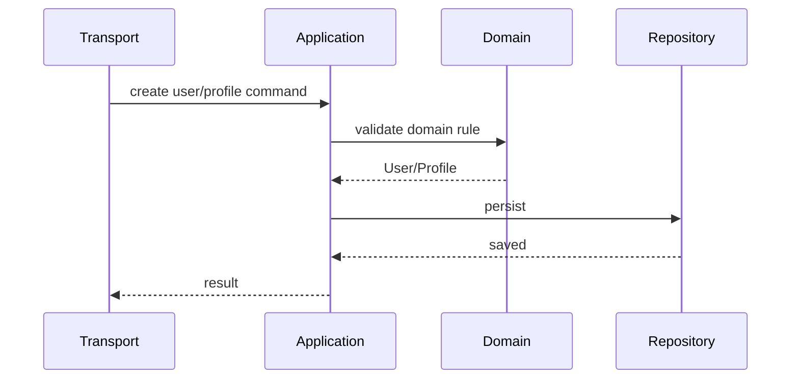

# 关键链路：创建 User 与 Profile

> 状态：待补证据 · 骨架初稿，待与代码/契约核对。

## 链路目标

创建稳定身份主体和业务档案事实。

## 链路

## 关键约束

- User 手机号唯一性由 Identity 侧治理。
- Profile IDCard 唯一性由 Identity 侧治理。
- AuthN 不应绕过 Identity repository 直接写 User。
