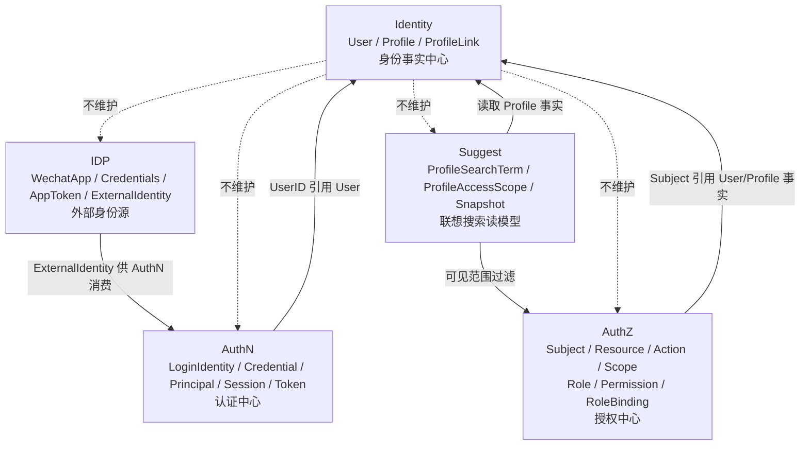

# 模块边界：Identity 与 AuthN / AuthZ / IDP / Suggest

> 状态：待补证据 · 第一版正文，待继续按源码、组合根、跨模块端口、REST/gRPC 契约和架构测试逐项核对。

---

## 1. 本文回答

本文回答 8 个问题：

- Identity 的模块边界是什么？
- Identity 与 AuthN 如何协作，为什么 `User` 不是 `Principal`？
- Identity 与 AuthZ 如何协作，为什么 `User` 不是 `Subject`，`ProfileLink` 不是 `Permission`？
- Identity 与 IDP 如何协作，为什么 `ExternalIdentity` 不是 `User`？
- Identity 与 Suggest 如何协作，为什么 `Suggest Snapshot` 不是 `Profile` 主表？
- 哪些跨模块协作是允许的，哪些是边界漂移？
- Identity 是否可以触发 AuthN Session 撤销？这个例外如何约束？
- 修改模块边界时应该核对哪些代码和测试？

本文只讲模块边界，不重复完整领域模型。领域模型见 [01-领域模型-User-Profile-ProfileLink.md](01-领域模型-User-Profile-ProfileLink.md)，ProfileLink 链路见 [03-关键链路-建立与撤销ProfileLink.md](03-关键链路-建立与撤销ProfileLink.md)。

---

## 2. 30 秒结论

Identity 是 IAM 的身份事实中心，只维护：

```text
User；
Profile；
ProfileLink。
```

它向其他模块提供可引用的身份事实，但不吞并其他模块职责：

```text
AuthN 证明“当前请求者是谁”；
AuthZ 判断“是否允许访问”；
IDP 提供“外部身份来源”；
Suggest 提供“Profile 联想搜索读模型”。
```

核心边界：

```text
User 不是 Principal；
User 不是 Subject；
Profile 不是登录账号；
ProfileLink 不是 Permission；
ExternalIdentity 不是 User；
Suggest Snapshot 不是 Profile 主表；
ProfileAccessScope 不是 ProfileLink。
```

如果只记一句话：

> Identity 提供身份事实，其他模块只能引用或消费这些事实，不能复制、改写或把自己的业务语义塞回 Identity。

---

## 3. 模块边界总图



读图规则：

```text
Identity 是身份事实源；
AuthN/AuthZ/IDP/Suggest 可以引用或消费 Identity 事实；
Identity 不拥有认证、授权、外部身份源和搜索索引模型；
跨模块协作必须通过 application service、port、query service 或组合根显式装配。
```

---

## 4. Identity 的职责边界

Identity 负责：

| 能力 | 说明 |
| --- | --- |
| User 写模型 | 创建、更新、状态变更、手机号唯一性等 |
| Profile 写模型 | 创建、更新、身份证唯一性等 |
| ProfileLink 写模型 | 建立、查询、撤销 User/Profile 关系 |
| 身份不变量 | User 必填字段、Profile 必填字段、active link 去重、self 档案唯一性 |
| 身份事实查询 | 按 ID、手机号、身份证、ProfileLink 等查询身份事实 |

Identity 不负责：

| 不负责 | 所属模块 |
| --- | --- |
| LoginIdentity / Credential / Challenge | AuthN |
| Principal / Session / Token / JWKS | AuthN |
| Subject / Resource / Action / Scope | AuthZ |
| Role / Permission / RoleBinding / Check | AuthZ |
| WechatApp / Credentials / AppToken / ExternalIdentity | IDP |
| ProfileSearchTerm / ProfileAccessScope / Snapshot | Suggest |
| 联想搜索索引构建、刷新、降级 | Suggest |

---

## 5. Identity 与 AuthN

### 5.1 协作关系

AuthN 负责证明当前请求者身份。

AuthN 可以通过 `UserID` 引用 Identity 的 `User`：

```text
LoginIdentity -> UserID -> Identity.User
Principal.UserID -> Identity.User
Session.UserID -> Identity.User
Token subject/user claim -> Identity.UserID
```

Identity 提供：

```text
UserID；
User 状态；
必要的 User 查询能力；
User lifecycle 事件或受控协作点。
```

AuthN 提供：

```text
登录身份；
认证凭据；
认证挑战；
认证结果 Principal；
Session；
AccessToken / RefreshToken；
JWKS。
```

---

### 5.2 User 不是 Principal

| 概念 | 所属模块 | 生命周期 | 含义 |
| --- | --- | --- | --- |
| `User` | Identity | 长期持久化 | IAM 内部稳定身份主体 |
| `Principal` | AuthN | 随认证上下文产生 | 当前请求者的认证结果表达 |

关键边界：

```text
Principal 可以携带 UserID；
Principal 不是 User 实体；
User 不包含认证方式、AMR、Session、Token 等运行时认证上下文；
Identity 不签发 Token；
Identity 不校验密码、验证码、外部登录票据。
```

---

### 5.3 允许的协作

允许：

```text
AuthN 通过 UserID 查询 User 状态；
AuthN 登录成功后把 UserID 写入 Principal / Session / Token；
AuthN 注册或绑定流程通过 Identity application service 创建或查找 User；
Identity 在 User 被封禁时，通过受控 port 触发 AuthN Session 撤销。
```

当前已知例外协作：

```text
封禁 User 会连带撤销该用户的 AuthN Session。
```

该协作应通过注入的端口完成，例如 `session.Revoker`，而不是 Identity 直接访问 AuthN repository 或 token store。

代码事实源：

```text
internal/apiserver/application/identity/user/service_lifecycle.go
```

---

### 5.4 禁止的耦合

禁止：

```text
AuthN 直接写 Identity repository；
Identity 直接写 LoginIdentity / Credential；
Identity 直接签发 Token；
Identity 直接操作 RefreshToken store；
User 实体中出现 password、openid、sessionID、token、amr 等认证字段；
Principal 被持久化成 User；
LoginIdentity 被写成 User。
```

---

## 6. Identity 与 AuthZ

### 6.1 协作关系

AuthZ 负责授权判断。

AuthZ 可以通过 `Subject` 引用 Identity 的身份事实：

```text
Subject{Type: user, ID: UserID}
Subject{Type: profile, ID: ProfileID}，如果当前模型允许
```

Identity 提供：

```text
User / Profile / ProfileLink 身份事实；
必要的身份查询能力；
可供 AuthZ 构造 Subject 或 Scope 的引用 ID。
```

AuthZ 提供：

```text
Subject；
Resource；
Action；
Scope；
Role；
Permission；
RoleBinding；
AuthorizationDecision；
Check。
```

---

### 6.2 User 不是 Subject

| 概念 | 所属模块 | 形态 | 含义 |
| --- | --- | --- | --- |
| `User` | Identity | 实体 | IAM 内部稳定身份主体 |
| `Subject` | AuthZ | `{Type, ID}` 引用 | 授权判断中的主体引用 |

关键边界：

```text
Subject 可以引用 UserID；
user 只是 Subject 的一种类型；
Subject 不拥有 User 写模型；
AuthZ 不维护 User/Profile/ProfileLink；
Identity 不维护 Subject/Role/Permission/RoleBinding。
```

---

### 6.3 ProfileLink 不是 Permission

`ProfileLink` 回答：

```text
User 和 Profile 是什么身份关系？
```

`Permission` 回答：

```text
某个 Role 对某个 Resource / Action / Scope 有什么能力？
```

`Check` 回答：

```text
Subject 能否对 Resource 执行 Action？
```

对比：

| 概念 | 所属模块 | 核心字段 | 回答的问题 |
| --- | --- | --- | --- |
| `ProfileLink` | Identity | `UserID, ProfileID, Rel, RevokedAt` | 身份关系是什么 |
| `RoleBinding` | AuthZ | `Subject, Role, Scope` | 主体绑定了什么角色 |
| `Permission` | AuthZ | `Resource, Action, Scope` | 角色拥有什么能力 |
| `Check` | AuthZ | `Subject, Resource, Action, Scope` | 是否允许访问 |

结论：

```text
有 ProfileLink 不等于有访问权；
没有 ProfileLink 也不必然等于无任何访问权；
是否能访问资源仍由 AuthZ Check 判定；
ProfileLink 不应该出现 Resource / Action / Scope / Effect 字段。
```

---

### 6.4 允许的协作

允许：

```text
AuthZ 使用 UserID 构造 Subject；
AuthZ 使用 ProfileID 构造 Resource 或 Scope，具体以 AuthZ 模型为准；
AuthZ 在授权判断前通过受控查询确认 User/Profile 是否存在；
Identity 查询结果作为 AuthZ 决策输入之一；
Identity 事件触发 AuthZ runtime reload 或策略清理，前提是通过事件/port 显式表达。
```

---

### 6.5 禁止的耦合

禁止：

```text
Identity 直接执行 AuthZ Check；
Identity 写 Role / Permission / RoleBinding；
AuthZ 直接写 User / Profile / ProfileLink；
ProfileLink 兼任 RoleBinding；
ProfileLink.Rel 直接决定 Resource/Action 权限；
在 User/Profile 实体上塞权限字段；
把 Casbin policy 当作 Identity 事实源。
```

---

## 7. Identity 与 IDP

### 7.1 协作关系

IDP 是外部身份源辅助模块。

IDP 负责：

```text
外部 provider 应用配置；
外部 provider 凭据；
外部 access token / AppToken 获取和刷新；
外部身份声明 ExternalIdentity。
```

IDP 不直接创建 IAM 登录态，也不直接拥有 User。

典型协作链路：

```text
IDP provider ticket/code
  -> IDP 解析 ExternalIdentity
  -> AuthN 消费 ExternalIdentity
  -> AuthN 绑定或查找 LoginIdentity
  -> LoginIdentity.UserID 指向 Identity.User
```

---

### 7.2 ExternalIdentity 不是 User

| 概念 | 所属模块 | 含义 |
| --- | --- | --- |
| `ExternalIdentity` | IDP | 外部身份源返回的身份声明 |
| `LoginIdentity` | AuthN | IAM 登录身份，绑定 UserID |
| `User` | Identity | IAM 内部稳定身份主体 |

关键边界：

```text
ExternalIdentity 是外部身份声明；
openid/unionid 不是 UserID；
ExternalIdentity 不等于 Profile；
IDP AppToken 不是 IAM AccessToken；
IDP 不写 Identity.User；
IDP 不签发 IAM Session / Token。
```

---

### 7.3 允许的协作

允许：

```text
AuthN 调用 IDP 解析外部身份；
AuthN 根据 ExternalIdentity 绑定 LoginIdentity；
AuthN 通过 Identity application service 创建或查找 User；
Identity 只接收明确的创建/查询命令，不理解 provider 内部 token 细节。
```

---

### 7.4 禁止的耦合

禁止：

```text
IDP 直接写 User repository；
IDP 直接创建 Session / Token；
Identity 存储 provider app secret；
User 实体出现 openid/unionid/appid/provider token 字段；
Profile 被外部 openid 直接替代；
ExternalIdentity 被当成 User 持久化。
```

---

## 8. Identity 与 Suggest

### 8.1 协作关系

Suggest 是 Profile 联想搜索读模型模块。

Suggest 可以消费 Identity 的 Profile 事实：

```text
Profile.ID；
Profile.Name；
Profile.IDCard；
必要的脱敏展示字段；
必要的 ProfileLink 或 AuthZ 范围输入。
```

Suggest 自己维护：

```text
ProfileSearchTerm；
ProfileAccessScope；
Snapshot；
进程内索引；
刷新任务；
查询限流、脱敏、降级策略。
```

---

### 8.2 Suggest Snapshot 不是 Profile 主表

| 概念 | 所属模块 | 含义 |
| --- | --- | --- |
| `Profile` | Identity | 业务档案主事实 |
| `ProfileSearchTerm` | Suggest | 搜索项 / 归一化检索文本 |
| `ProfileAccessScope` | Suggest / AuthZ 协作边界 | 查询可见范围输入 |
| `Snapshot` | Suggest | 搜索读模型快照 |

关键边界：

```text
Profile 主事实属于 Identity；
Suggest Snapshot 是读模型；
Suggest 不写 Profile 主事实；
Suggest 索引滞后不改变 Identity 事实；
Suggest 降级不能泄露不可见 Profile。
```

---

### 8.3 ProfileAccessScope 不是 ProfileLink

`ProfileLink` 回答：

```text
User 与 Profile 是什么身份关系？
```

`ProfileAccessScope` 回答：

```text
当前查询者在 Suggest 搜索中能看到哪些 Profile 范围？
```

二者可以有关联，但不能等同。

结论：

```text
存在 ProfileLink 不代表一定可被搜索返回；
没有 ProfileLink 不代表一定不能被管理端授权搜索；
Suggest 查询结果必须经过可见范围、脱敏、限流、审计等策略；
ProfileLink 不应直接变成 Suggest 的唯一可见性规则。
```

---

### 8.4 允许的协作

允许：

```text
Suggest 读取 Profile 事实构建索引；
Suggest 订阅 Profile 变化事件刷新 Snapshot；
Suggest 根据 AuthZ 或受控查询计算 ProfileAccessScope；
Suggest 返回脱敏后的 Profile 搜索结果；
Identity 提供 Profile 查询能力或事件，不理解搜索索引细节。
```

---

### 8.5 禁止的耦合

禁止：

```text
Suggest 直接写 Profile repository；
Identity 直接维护 Suggest Snapshot；
Profile 实体出现 search_term、snapshot_version、index_status 等搜索字段；
ProfileLink 直接等同 ProfileAccessScope；
Suggest 绕过 AuthZ/AccessScope 返回不可见 Profile；
搜索降级时返回未脱敏敏感信息。
```

---

## 9. 跨模块协作方式

跨模块协作应显式，而不是隐式共享 repository 或全局变量。

推荐方式：

| 方式 | 适用场景 | 说明 |
| --- | --- | --- |
| application service 调用 | 同进程同步用例协作 | 通过组合根注入依赖 |
| domain port | 领域规则需要外部能力 | 只暴露最小接口 |
| query service | 只读跨模块查询 | 明确查询语义和返回模型 |
| event / outbox | 异步传播事实变化 | 消费方幂等处理 |
| runtime adapter | 技术运行时能力 | 不泄露到 domain |

禁止方式：

```text
跨模块直接 import 对方 repository concrete；
跨模块直接写对方数据库表；
通过全局变量访问对方 service；
为了方便查询在 Identity 实体上冗余认证/授权/搜索字段；
绕过 application 层直接访问 domain 内部对象并保存。
```

---

## 10. 允许依赖与禁止依赖

### 10.1 允许依赖

Identity application 可以依赖：

```text
Identity domain；
Identity repository port；
必要的跨模块最小 port，例如 session.Revoker；
事务管理 port；
事件/outbox port；
时钟、ID 生成器等基础能力。
```

Identity domain 可以依赖：

```text
Identity 内部 value object；
通用 meta value object；
本领域定义的 port interface。
```

Identity transport 可以依赖：

```text
Identity application service；
DTO/proto mapper；
认证上下文中的 Principal 引用，但不解释 AuthN 内部细节。
```

---

### 10.2 禁止依赖

Identity domain 不应依赖：

```text
AuthN domain concrete；
AuthZ domain concrete；
IDP domain concrete；
Suggest domain concrete；
transport/rest 或 transport/grpc；
infra repository concrete；
Casbin / Redis / JWT / WeChat SDK。
```

Identity application 不应直接依赖：

```text
AuthN repository concrete；
AuthZ repository concrete；
Suggest index concrete；
IDP provider concrete；
transport handler；
数据库 client concrete，除非通过 infra adapter/transaction abstraction。
```

---

## 11. 边界漂移检查清单

如果出现以下变化，需要警惕 Identity 边界漂移：

```text
User 增加 password/openid/session/token 字段；
User 增加 role/permission/scope 字段；
Profile 增加 login_identity 或 credential 字段；
ProfileLink 增加 resource/action/effect 字段；
ProfileLink 被 AuthZ 直接当 RoleBinding 使用；
Identity service 直接调用 Casbin Enforce；
Identity service 直接维护 Suggest Snapshot；
Suggest service 直接 Save Profile；
IDP provider 直接 Insert User；
AuthN service 直接操作 Identity repository concrete；
Identity domain import 了 authn/authz/suggest/idp 包。
```

一旦发现，应回到以下问题：

```text
这是身份事实吗？
这是认证上下文吗？
这是授权判断吗？
这是外部身份源吗？
这是搜索读模型吗？
应该通过哪个 application service、port 或事件协作？
```

---

## 12. 常见反模式

| 反模式 | 问题 | 推荐做法 |
| --- | --- | --- |
| User 就是 Principal | 持久身份和认证结果混淆 | User 属于 Identity，Principal 属于 AuthN |
| User 就是 Subject | 身份实体和授权引用混淆 | Subject 属于 AuthZ，可引用 UserID |
| Profile 是登录账号 | 业务档案被误写成账号 | 登录身份归 AuthN LoginIdentity |
| ProfileLink 是 Permission | 身份关系和访问权混淆 | 授权由 AuthZ Role/Permission/Check 判断 |
| ExternalIdentity 直接写 User | 外部身份和内部身份混淆 | ExternalIdentity 由 AuthN 绑定 LoginIdentity，再指向 User |
| Suggest Snapshot 当 Profile 主表 | 读模型吞并写模型 | Profile 主事实归 Identity |
| ProfileAccessScope 等于 ProfileLink | 可见范围被身份关系简化 | Suggest 结合 AuthZ/AccessScope 判断可见性 |
| Identity 直接调用 Casbin | Identity 吞并授权运行时 | AuthZ application/runtime 负责 Check |
| AuthN 直接写 User repository | AuthN 绕过 Identity 写模型 | 通过 Identity application service 或 port 协作 |
| Suggest 直接写 Profile | Suggest 吞并 Identity 写模型 | Suggest 只读 Profile 事实构建索引 |

---

## 13. 代码事实源

| 事实 | 路径 |
| --- | --- |
| Identity User 模型 | `internal/apiserver/domain/identity/user` |
| Identity Profile 模型 | `internal/apiserver/domain/identity/profile` |
| Identity ProfileLink 模型 | `internal/apiserver/domain/identity/profilelink` |
| Identity application | `internal/apiserver/application/identity` |
| User lifecycle 与 Session 撤销协作 | `internal/apiserver/application/identity/user/service_lifecycle.go` |
| AuthN Principal | `internal/apiserver/domain/authn/authentication/principal.go` |
| AuthN Session / Token | `internal/apiserver/domain/authn` |
| AuthZ Subject / Permission / RoleBinding | `internal/apiserver/domain/authz` |
| IDP ExternalIdentity / AppToken | `internal/apiserver/domain/idp` |
| Suggest ProfileSearchTerm / ProfileAccessScope / Snapshot | `internal/apiserver/domain/suggest` |
| 组合根装配 | `internal/apiserver/container` |
| 架构测试 | `internal/pkg/architecture` |

---

## 14. Verify

修改本文后至少执行：

```bash
make docs-hygiene
```

涉及 Identity 领域或应用层边界时，执行：

```bash
go test ./internal/apiserver/domain/identity/...
go test ./internal/apiserver/application/identity/...
```

涉及 AuthN/AuthZ/IDP/Suggest 边界时，按实际影响执行：

```bash
go test ./internal/apiserver/domain/authn/...
go test ./internal/apiserver/domain/authz/...
go test ./internal/apiserver/domain/idp/...
go test ./internal/apiserver/domain/suggest/...
```

涉及组合根和依赖方向时，执行：

```bash
go test ./internal/pkg/architecture
go test ./internal/apiserver/...
```

涉及 REST/gRPC 契约时，执行：

```bash
make api-validate
make proto-gen
go test ./internal/apiserver/transport/rest/...
go test ./internal/apiserver/transport/grpc/...
```

---

## 15. 本文总结

Identity 的模块边界可以压缩成：

```text
Identity 只拥有 User / Profile / ProfileLink 身份事实。
```

与其他模块的关系是：

```text
AuthN 通过 UserID 引用 User，但 User 不是 Principal；
AuthZ 通过 Subject 引用身份事实，但 User 不是 Subject，ProfileLink 不是 Permission；
IDP 输出 ExternalIdentity，但 ExternalIdentity 不是 User；
Suggest 读取 Profile 事实构建读模型，但 Snapshot 不是 Profile 主表，ProfileAccessScope 不是 ProfileLink。
```

最重要的工程规则是：

```text
跨模块协作必须通过 application service、port、query service 或 event 显式表达；
不允许为了方便查询，把认证、授权、外部身份源或搜索读模型字段塞回 Identity。
```

下一篇 [05-分层架构与代码索引.md](05-分层架构与代码索引.md) 将从代码组织角度说明 Identity 的 domain、application、infra、transport、container 入口，以及维护时应该从哪些文件开始读。
