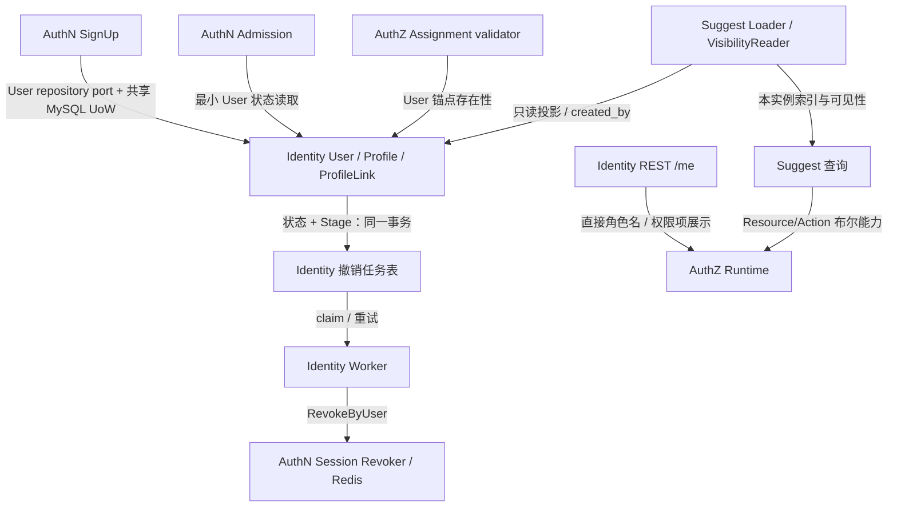
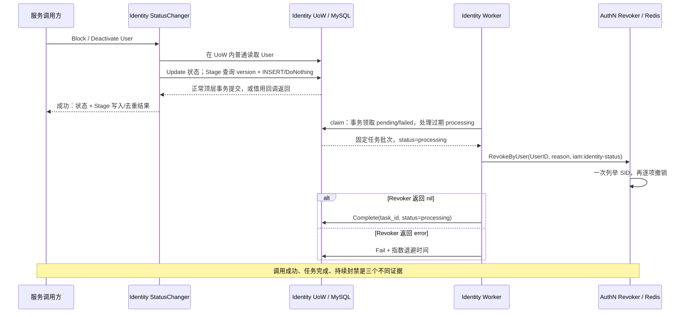

# Identity 与 AuthN / AuthZ / IDP / Suggest 的边界

> 状态：已实现 · 本文维护事实所有权、共享提交、状态撤销任务与展示失败窗口。并发情境按源码推论标记，候选合同尚未实施。

## 1. 本文回答

Identity 保存 User、Profile、ProfileLink，但“User 存在”“允许继续认证”“某动作允许”“某档案可搜索”是四种不同判断。本篇回答它们怎样连接、何时会不同，以及哪个模块应承担后果。

模型不变量由[领域模型](01-领域模型-User-Profile-ProfileLink.md)维护；创建步骤归[创建链路](02-关键链路-创建User与Profile.md)，关系命令与查询归[ProfileLink链路](03-关键链路-建立与撤销ProfileLink.md)。本文不复制这些用例。

## 2. 关键结论与协作图

| 具体情境 | 当前协作 | 成功不能推出什么 |
| --- | --- | --- |
| SignUp 开通登录入口 | AuthN UoW 组合 Identity User、LoginIdentity、Credential | User active、provider/Redis 效果同事务提交或已经登录 |
| Block / Deactivate | Identity 保存状态并 Stage 本地撤销意图；Worker 调 AuthN Revoker | 每次都新增 pending、全部 Session 已清理、所有在途请求已停止 |
| PATCH /identity/me 后权限读取失败 | 先完成资料 UoW，再读 AuthZ roles/permissions | 错误响应意味着资料没保存 |
| 受信服务 Check 一个 blocked User | AuthZ 读取授权事实，不重做 User 准入 | ALLOW 意味着该人当前可以认证或访问业务对象 |
| ProfileLink 撤销后仍搜索到候选 | Suggest 的投影、owner/org/ProfileID 许可各有来源 | 搜索结果意味着仍有关系，或可以读取/修改详情 |

```mermaid
flowchart TB
    AN["AuthN SignUp"] -->|"User repository port + 共享 MySQL UoW"| I["Identity User / Profile / ProfileLink"]
    AD["AuthN Admission"] -->|"最小 User 状态读取"| I
    AZ["AuthZ Assignment validator"] -->|"User 锚点存在性"| I
    I -->|"状态 + Stage：同一事务"| T["Identity 撤销任务表"]
    T -->|"claim / 重试"| W["Identity Worker"]
    W -->|"RevokeByUser"| S["AuthN Session Revoker / Redis"]
    ME["Identity REST /me"] -->|"直接角色名 / 权限项展示"| Z["AuthZ Runtime"]
    Q["Suggest Loader / VisibilityReader"] -->|"只读投影 / created_by"| I
    Q -->|"本实例索引与可见性"| R["Suggest 查询"]
    R -->|"Resource/Action 布尔能力"| Z
```

图中箭头标签区分调用、写入或投影传播；不表示共同聚合、联合快照或外键。IDP proof 的请求链在第7节展开。当前模块共享进程与部分存储，仅有目录/端口不足以证明可以独立部署。

## 3. 事实所有权与稳定 ID

| 事实 | 所有者 | 对外消费的含义 |
| --- | --- | --- |
| User、Status、联系资料 | Identity | 稳定主体与当前存储状态；Phone 不自动成为登录身份或账号合并键 |
| Profile、ProfileLink | Identity | 申报档案与关系事实；self 没有自动实名/亲属证明 |
| LoginIdentity、Credential、Principal、Session | AuthN | 入口归属、身份核验与持续认证；UserID 是引用 |
| Subject、Assignment、PermissionGrant | AuthZ | 主体的角色、资源动作能力；subject.Ref 引用 UserID，不接管 User lifecycle |
| 请求内 ExternalIdentity | IDP | provider/realm 下此次 proof 的结果；不是 IAM User |
| 候选索引、visibility.Scope | Suggest | 查询投影和本次可见规则；不回写 User/Profile 或授予详情访问 |

稳定 ID 让资料变更不破坏 Session、Assignment 或业务引用，但也要求消费方处理缺失、旧读、缓存和投影滞后。openid、username、phone 各有入口/联系生命周期，不能替代这些跨模块引用。

组合根先构造 Identity-owned UserAccess，交给 AuthN 的 UserStatusReader 与 AuthZ 的 UserResolver；完整 IdentityModule 后初始化并不转移所有权。SignUp 的 User repository 是共享提交例外；Suggest 则直接依赖表结构，不经 Identity application API。

这些依赖表达三种不同合同：窄同步端口提供当次结果，共享 UoW 组合本地提交，派生投影承担刷新与恢复。不能用“都经过接口”或“都有 Outbox”概括它们。

## 4. AuthN signup：共享事务的明确例外

SignUp 的本地 User、LoginIdentity、Credential 使用同一 MySQL 事务。AuthN application 调用 Identity domain 构造与 repository port，没有调用 Creator，因而不自动继承 Creator 的 Phone 友好预检查；当前新 User 保存错误也被包装 ErrDatabase。数据库约束与公开错误合同分别由创建主文维护。

外部解析先于 SignUp **自身**的 UoW 调用；若传入 context 已有事务，Required 借用它，provider 交换仍可能发生在外层事务存续期间。返回成功也可能早于宿主提交；provider、state、Redis 效果不受本地 rollback 覆盖。宿主须传播失败，借用层没有自动 rollback-only。

| 方案 | 当前取舍与代价 |
| --- | --- |
| 当前 repository port + 同库 UoW | 组合本地三类记录的提交；AuthN 须理解必要的 Identity 创建规则和错误差异 |
| 候选 Identity 创建端口，共享明确事务 | 可封装 User 规则，仍可保留原子性；须定义事务 owner，不能偷偷独立提交 |
| 复用现有 Creator 并传 txCtx | Creator 的 Required 可借用事务，并非必然独立提交；须接受 Phone 预检查、输入/错误合同与 application 协作依赖 |
| 独立 Identity RPC / 事件创建 | User 已提交、登录入口失败可能半完成；拆库前须设计请求回执、补偿及可查询恢复状态 |

当前 SignUp 流程没有写 Profile/ProfileLink，但 AuthN UoW 实际还暴露这两个仓储。例外是用例和评审约束，并非类型已强制只能访问 User；可候选收窄注册专用 UoW。已有 blocked User 可在复用分支继续确保入口，之后登录仍被 Admission 拒绝；缺失 User repair 也不恢复丢失的旧状态，详细规则归注册主文。开通、登录和建档因此是不同用例。

Admission 先读入口归属/active，再读 User 状态，没有联合行锁或共同版本；已借用事务时还受既有快照影响。在线 Verify/Refresh 的身份来源和在途登录窗口归[AuthN边界](../02-AuthN/07-模块边界-AuthN与Identity-IDP-AuthZ.md)。Linking 不因此获得新的 User 状态证明；它依赖各 adapter 的认证前置，见[Linking](../02-AuthN/03-关键链路-Linking登录身份绑定.md)。

## 5. Block/Deactivate：持久化任务与最终撤销

### 5.1 谁提交什么

公开协议提供 DeactivateUser / BlockUser；Activate 只有 application 能力，没有公开 REST/gRPC 激活入口。两种停用动作在目标状态不同于当前状态时更新 User，再 Stage revoke_all；已经处于目标状态直接成功，不补写任务。

生产 Identity UoW 将 Users 与 SessionRevocations 装配到同一 GORM transaction。应用负责步骤，Stager 保存意图，container 注入 AuthN 窄 Revoker，Worker 负责提交后的执行。替身未装配 Stager 时，用例仍可只改状态，不能把所有装配都写成必有持久任务。

```mermaid
sequenceDiagram
    participant C as 服务调用方
    participant A as Identity StatusChanger
    participant D as Identity UoW / MySQL
    participant W as Identity Worker
    participant R as AuthN Revoker / Redis
    C->>A: Block / Deactivate User
    A->>D: 在 UoW 内普通读取 User
    A->>D: Update 状态；Stage 查询 version + INSERT/DoNothing
    D-->>A: 正常顶层事务提交，或借用回调返回
    A-->>C: 成功：状态 + Stage 写入/去重结果
    W->>D: claim：事务领取 pending/failed，处理过期 processing
    D-->>W: 固定任务批次，status=processing
    W->>R: RevokeByUser(UserID, reason, iam:identity-status)
    R->>R: 一次列举 SID，再逐项撤销
    alt Revoker 返回 nil
        W->>D: Complete(task_id, status=processing)
    else Revoker 返回 error
        W->>D: Fail + 指数退避时间
    end
    Note over C,R: 调用成功、任务完成、持续封禁是三个不同证据
```

图展开状态确需变化的路径；User/Stage/提交失败不返回用例成功。图中的返回是 StatusChanger 应用结果，不是最终 gRPC 响应。借用事务由宿主最终提交与失败传播，没有把回调返回画成独立提交。领取事务与状态事务独立，Redis 也不参加二者。

gRPC DeactivateUser / BlockUser 在 StatusChanger 返回后，还调用 Directory.GetByID 组装 UserOperationResponse。正常顶层命令先提交状态/Stage，再开启查询 UoW；查询或映射后的响应交付失败不能撤回已提交状态。借用事务仍由宿主提交并传播失败。当前没有该公开命令的请求回执，客户端收到错误不能据此认定未执行；依据[生命周期 adapter](../../../internal/apiserver/transport/grpc/service/identity/identity_lifecycle.go)。UpdateUser 则只有一次 Editor.PatchProfile，不是多步独立资料更新。

### 5.2 Stage 的幂等键不是生命周期代次保证

Store.Stage 在当前事务查询 users.version，要求非零，插入任务时冲突 DoNothing。迁移000018唯一键是 user_id + user_version + action，reason 不在键内。Block 与 Deactivate 都使用 revoke_all，因此原因不同不保证得到第二条任务。

UserPO 创建时 version=1，当前 mapper / BeforeUpdate / 通用 Update 不递增版本，迁移也没有 User 状态 trigger。若标准更新、该唯一索引及旧 completed 行仍在，激活后再次停用可复用原键而不新建 pending。此处是源码联合推论；没有核验生产版本、额外 trigger 或任务保留。

同一目标状态的重复 Block 也不是补任务接口。Activate 不取消旧任务；Worker 不按 Task.UserVersion 或当前 User 状态跳过执行。任务尚待处理时激活并新登录，旧任务可能清理新 Session；已 completed 后再次停用，则可能没有新任务。两者机制不同，不能统一称为“幂等解决了重试”。

此外，普通资料 Editor 也读取整个 User 后 Update；mapper 会带入读取时 Status，更新没有 expected Status/Version 条件。慢资料请求具备把旧 Status 带回写入的源码条件，尚未做 MySQL 竞争复现。只给生命周期方法加锁、不约束其他 User writer，仍不能承诺状态与资料写互不覆盖。

### 5.3 Worker 的重试与领取保护

| 环节 | 当前保护 | 不能扩大为的保证 |
| --- | --- | --- |
| Claim | 事务内先回收过期 processing，再按 task_id 领取到期 pending/failed；使用 FOR UPDATE SKIP LOCKED | 领取事务结束后仍拥有独占执行租约 |
| Processing 超时 | 依据 updated_at 与 stale_processing_after 回收 | 原 Worker 已停止、所有副作用已取消；没有心跳续租 |
| Complete / Fail | WHERE task_id 且 status=processing | 比较本次领取 attempt/token；不检查 RowsAffected |
| 执行 | 顺序调用 RevokeByUser；错误后保存下一次指数退避时间 | 批次事务、无限期封禁或一条任务覆盖未来新 SID |
| 失败记录 | last_error 仅存固定 session_revoke_failed 类别 | 已保存全部异常/逐 SID 结果，可据任务行还原业务接受 |

例如 W1 领取后仍执行，超过过期阈值，W2 可重领同一 task；W1 后到的 Complete/Fail 只比较 processing，不能区分 W2 的领取。源码没有领取代次隔离，未进行多 Worker/MySQL 专项；不能仅凭 SKIP LOCKED 宣称执行与完成全程互斥。

RevokeByUser 先读一次用户 SID 索引，再逐 SID 撤销。中途失败可能已有部分清理；重试重新列举，集合可以变化。单 SID 重复撤销可安全处理不等于按 User 任务与新登录共同幂等。新 SID 在列举后保存不在该轮集合内，完整 Session/令牌清理归[Token](../02-AuthN/05-关键链路-Token签发刷新吊销.md)。

### 5.4 运行前提与效力边界

Worker 仅在 Revoker 非nil、PollInterval 正数时启动；Run 的 context 来自 container，Cleanup 取消并等待，没有独立等待期限。任务持久化不证明 Worker 正在执行，IdentityModule.CheckHealth 当前恒nil。

readiness 检查 Store 可查询、最老未完成任务年龄是否超过 OutboxMaxPendingAge；没有未完成行可通过，不证明 Worker 活跃、SID 清理完整或新登录被屏障阻断。后续更强健康合同须区分领取活动、积压、执行错误与最终效果。

在线 Admission 读取到 blocked/inactive 会拒绝后续认证使用；本地 JWT 验签不读 User。已通过 Admission 的在途登录或业务请求没有联合生命周期屏障。状态写入也不删除 Assignment、不推进 AuthZ PolicyVersion；直接服务 Check 仍可 ALLOW。消费方应遵守认证/业务准入，不能把任一模块成功当作整条请求允许。

当前本地任务关闭提交后崩溃/Redis失败的恢复缺口，但没有 MySQL/Redis 原子提交、exactly-once 或持续封禁保证。它不经 NSQ，不是标准事件 Relay；事件 Outbox 的 ACK/handoff 合同另见[事件机制](../../03-基础设施/03-事件与Transactional-Outbox.md)。

## 6. AuthZ：能力读取与对象关系检查分工

### 6.1 /identity/me 的读取顺序与失败

GET 先完成 User Directory UoW；PATCH 先完成 Editor.PatchProfile UoW。随后两者先 resolveRoles，再独立读取 PermissionEntriesForSubject，最后返回 Success。当前 Runtime 实现后一个可选接口；reader 形状也会改变失败合同。

| 阶段 | 当前行为 |
| --- | --- |
| reader=nil / 不实现可选权限接口 | 不附加角色，或权限保持空数组；不等于确认没有权限 |
| roles 读取 error | debug日志后返回nil roles，继续读取 permissions |
| roles 成功 | 当前Runtime给直接分配角色名，不算继承闭包；方法/注释中的 Effective 不改变行为 |
| permissions 读取 | 要求新鲜快照；不可用错误为HTTP503/业务码103002，GET/PATCH整体失败 |
| PATCH 正常顶层 UoW 已提交，随后 permissions 失败 | 资料仍已保存；响应不是该资料事务的回滚凭证 |

角色和权限可以分别读到不同快照；roles失败后权限读取也可能恢复成功。permissions没有AppName过滤，可包含受保护的全局通配Grant；REST丢弃应用结果的Scopes。DTO只有resource/action/mode，不含Assignment Scope或PolicyVersion，不能作为公司/门店范围凭证或多个读取共同版本证明。

例如昵称修改成功而权限投影短暂不新鲜，客户端得到503；先核对资料，再按具体用例处理重试。若希望资料操作独立于权限展示，可候选拆分接口或显式展示降级状态；若希望展示fail-closed，仍须表达“资料已提交”，不能借增强读取制造跨存储回滚。

绑定非法JSON/类型与普通领域格式错误不同：合法JSON中的坏Phone/Email当前可落HTTP500/100101，而不是统一400。机器契约还未完整列User缺失404及权限503；输入/错误来源归[创建链路](02-关键链路-创建User与Profile.md)，契约差异归[接口治理](../../04-接口与SDK/01-REST-gRPC与契约治理.md)。本文只登记，不修改协议或handler。

### 6.2 存在、关系、动作与业务提交分别检查

AuthZ UserResolver只确认User锚点存在，不要求active；授权事实加载也不重读User。Grant/Replace的存在性普通读即使借用事实事务，也不锁住生命周期。Assignment删除有独立清理入口，停用不是赋权自动回收。

普通顶层调用的MyProfiles.Get先完成active pair检查UoW，再进入Directory查询UoW；context已有事务时两次均可借用宿主事务，仍无关系锁/周期条件。Patch虽在同UoW普通读取pair和Profile，也没有关系行锁/expected周期。Revoke完成不自动取消已经通过检查的读写。关系查询故障可被改写PermissionDenied，不能据此判断必然未关联；标准pair读不排除deleted_at。当前普通REST档案自助用例没有Resource/Action输入，不提供通用对象动作授权。

业务应把动作能力、局部对象关系/机构、对象状态与自己的提交合同明确组合；每次普通读都不等于持续许可。AuthZ不接收旧object_context求值，Suggest结果也不是详情凭证；无作用域Profile搜索已下线。完整关系读取范围与周期归[ProfileLink链路](03-关键链路-建立与撤销ProfileLink.md)。

## 7. IDP：外部证明不进入 Identity 主模型

IDP拥有应用配置、provider凭据、Secret/AppToken访问与外部code交换；它产出请求内ExternalIdentity，AuthN mapper再转换为入口标识，最终引用Identity User。

ExternalIdentity包含provider、realm、受限identifiers与VerifiedAt，不包含IAM UserID、provider token或可重放credential；当前覆盖微信小程序、开放平台和企业微信。构造器只检查结构，证明可信性依赖实际Resolver/Exchanger；VerifiedAt是Resolver本地Now，不是provider原始认证时间。结果不证明User已创建/active、当前组织资格或AuthZ能力，应用停用、AppToken与已有Session也没有自动共同生命周期。

历史标识直传使用TrustedLegacyInput，是内部来源分类，不是自动验证来源的凭证；内部调用者传非空OpenID可跳过Resolver，Source没有进一步准入用途。当前公开REST/gRPC mapper只投影AppID/JsCode；新增transport不得把普通用户OpenID接入该可信路径。SignUp/SignIn/Linking各自消费方式由[AuthN边界](../02-AuthN/07-模块边界-AuthN与Identity-IDP-AuthZ.md#4-idp外部交换负责证明来源authn-按用例决定本地归属)维护。

Identity v2 proto的同名ExternalIdentity是另一个历史transport对象：创建handler忽略输入、响应空列表。字段存在不意味着Identity已经保存登录入口或支持provider交换。新增公开provider合同需明确证明来源、幂等及AuthN归属规则，不能借同名message跨越事实所有权。

## 8. Suggest：只读投影，自己组合业务可见性

### 8.1 资格与传播

内建Loader聚合Profile名称/ID/created_by与关联User手机。资格是Profile未软删、至少一条未删且未撤销Link、其User未软删；User.Status不在SQL条件中。撤销一条仍有其他eligible关系时重算Upsert，末条失效才Delete；API成功不等于刷新成功或所有实例已变化。

Full在当前进程构建Store后切换atomic.Value；Delta在该Store锁内应用完整投影。Refresher本地TryLock、防错不推进游标，不提供跨实例屏障或与Identity事务共同快照。索引与VisibilityReader直接依赖schema；“只读”是默认SQL与责任约定，自定义FullSQL/DeltaSQL直接Raw执行，护栏没有SQL只读语义检查。

时间游标还不是提交序号：默认SQL以updated_at/deleted_at/revoked_at严格大于since筛选，成功后游标前进到本轮查询开始，空Delta也不经writer就推进。迁移中的无fsp DATETIME与带小数游标可留下同秒窗口；T0写入而T2晚提交、T1刷新读不到却已推进时，也可能持续漏读。维护硬删或关系移动还需保留可定位的影响ID。均为条件源码推论，没有真实MySQL专项；失败、重复重算与成功Full修复的边界由[刷新主文](../05-Suggest/02-关键链路-索引刷新Full-Delta.md)维护。

### 8.2 查询范围不等于 ProfileLink

FactsReader按user:OperatorID查list_all；true分支再查search_by_mobile_all并跳过VisibilityReader，false分支查search_by_mobile并读取created_by ProfileIDs。适配器只取Decision.Allowed，不读Assignment的company/store Scope或共同授权版本。

非全量scope允许ProfileID **或** OrgID **或** owner命中；不是三者交集。OrgIDs非空时优先于单OrgID，REST当前只填UserID与JWT透传的OrgID，不查询当前组织成员。owner投影来自Profile.created_by，不是领域认领关系。

例如占位Loader OrgID=7会把eligible候选投为同一组织；非全量principal的OrgID=7仍可能走组织分支允许这些候选，受外层准入及召回合同约束。组织声明、配置占位、created_by与active Link不能互相替代。

非全量VisibilityReader失败会使scope解析失败；其缓存也缓存error。清理该缓存并不立即删除旧索引owner/org许可，初次刷新成功的健康标志也不证明以后持续新鲜。默认缺Checker不自动拒绝全部；route装配和组合分支、过滤/手机号披露由[查询主文](../05-Suggest/03-关键链路-SuggestProfile查询.md)维护，不能据端口非nil认定生产准入完整。

## 9. 允许的依赖与复议条件

当前AuthN/AuthZ domain经Identity发布的最小能力消费User；SignUp明确共享UoW，Identity应用经Stager，container Worker经AuthN Revoker，REST经AuthZ只读增强，Suggest经SQL及能力适配。禁止把共享存储改写成共同聚合、投影回写或ProfileLink自动赋权。

静态护栏检查指定直接import和固定文本，包含AuthN/AuthZ domain对两个Identity User repository路径的禁止；没有全局跨模块白名单，也不证明SQL只读、正确组织事实或事务/调用时序。

以下是**未实施候选**，按要求选择而非笼统添加事务/事件：

| 要求 | 具体设计与代价 |
| --- | --- |
| 每次状态变更都留下独立清理意图 | lifecycle generation同事务推进并作任务键；所有User writer统一条件写或隔离资料字段，迁移旧版本/任务 |
| 旧任务不撤新登录、停用屏障更强 | Session携带generation/cutoff并明确在途准入后晚保存的归类；MySQL/Redis间失败与历史Session兼容须另定 |
| 领取到完成均有代次保护 | claim token/attempt条件写、影响行数检查、执行预算或续租；单独处理过期Worker副作用，不能只改Complete SQL |
| /me资料与授权展示失败可区分 | 拆展示读取或增加降级/已提交结果合同；仍保留真正权限决策的失败准入和重新读取 |
| 对象关系撤销立即约束业务提交 | 在拥有业务写入的边界定义关系周期/版本前置；统一锁或可验证条件，不把先查Has当作租约 |
| 搜索提交不漏且撤销有时效证据 | 提交序号/可重放变更流，或明确lookback+去重+周期Full对账；绑定索引版本/年龄，并复议owner/org独立许可 |
| 模块拆库或可独立部署 | 先替代SignUp共享提交、User准入读和Suggest schema直读；设计半完成、回执、缓存期限与恢复，不只换目录/API |

## 10. 事实来源与验证

| 当前事实 | 源码入口 |
| --- | --- |
| 发布能力与装配 | container/module_graph.go、container/identity/{deps,module}.go |
| 状态步骤、Stage原子范围 | application/identity/user/service_lifecycle.go、application/identity/sessionrevocation/ports.go、infra/mysql/uow/identity/uow.go |
| 去重、领取、重试/完成 | infra/mysql/sessionrevocation/{store,worker}.go、迁移000018 |
| User写入范围与版本 | infra/mysql/user/{repo,mapper,user}.go、internal/pkg/database/mysql/base.go |
| SID集合、准入效力 | infra/cache/redis/session_store.go、domain/authn/admission/policy.go |
| 最小User能力与存在性 | domain/identity/useraccess/capabilities.go |
| /me增强 | transport/rest/identity/handler/user.go、infra/authz/runtime/self_permissions.go |
| 共享SignUp、provider结果 | application/authn/signup、infra/mysql/uow/authn/uow.go、application/idp/externalidentity |
| 投影/范围 | infra/mysql/suggest/loader.go、application/suggest/{refreshindex,queryprofile}、domain/suggest/visibility、infra/suggest/index/memory |

表中除internal/pkg外路径均相对internal/apiserver。接口、借用事务及模型约束详见各主文；本篇没有改业务源码/测试/配置/协议。

| 现有证据 | 实际证明与未覆盖项 |
| --- | --- |
| StatusChanger SQLite用例 | 普通状态变更；不证明迁移唯一键下completed后再Stage、旧资料写覆盖或重激活竞争 |
| Store/Worker三个SQLite用例 | 意图参与调用者事务回滚、stub失败后重试完成、年龄/计数；AutoMigrate不带000018完整唯一索引，未测多Worker领取代次 |
| SessionStore miniredis用例 | SID索引清理、Revoke/Extend竞争；不证明停用与新Session共同屏障 |
| SignUp/UoW/Admission用例 | 本地步骤、借用与状态判断；不证明provider与宿主事务的共同恢复 |
| /me角色helper与资料Editor | 角色helper返回值、昵称回退与Editor资料回滚；没有完整GET/PATCH增强失败HTTP专项或跨模块原子性证明 |
| Suggest SQL/refresh/visibility | SQLite或stub的资格、游标、失败与范围组合；不证明长事务不漏、组织成员事实或多实例收敛 |
| container/架构用例 | 装配、注册和指定依赖；Identity模块接受空gorm.DB用例不执行数据库/Worker业务 |

本篇按相关包复用已有回归日志，范围、摘要和本篇实际补充检查另在[复核记录](../../_data/reviews/2026-10-06-docs-refactor.md)绑定；上表不是新的测试执行声明。新正文与两图执行文档门禁、真实渲染和逐图查看。生产schema、Worker运行、实际清理与业务接受仍须各自证据。

下一篇[Identity分层与代码索引](05-分层架构与代码索引.md)维护改动入口和影响面，不复制本文的跨模块规则。
