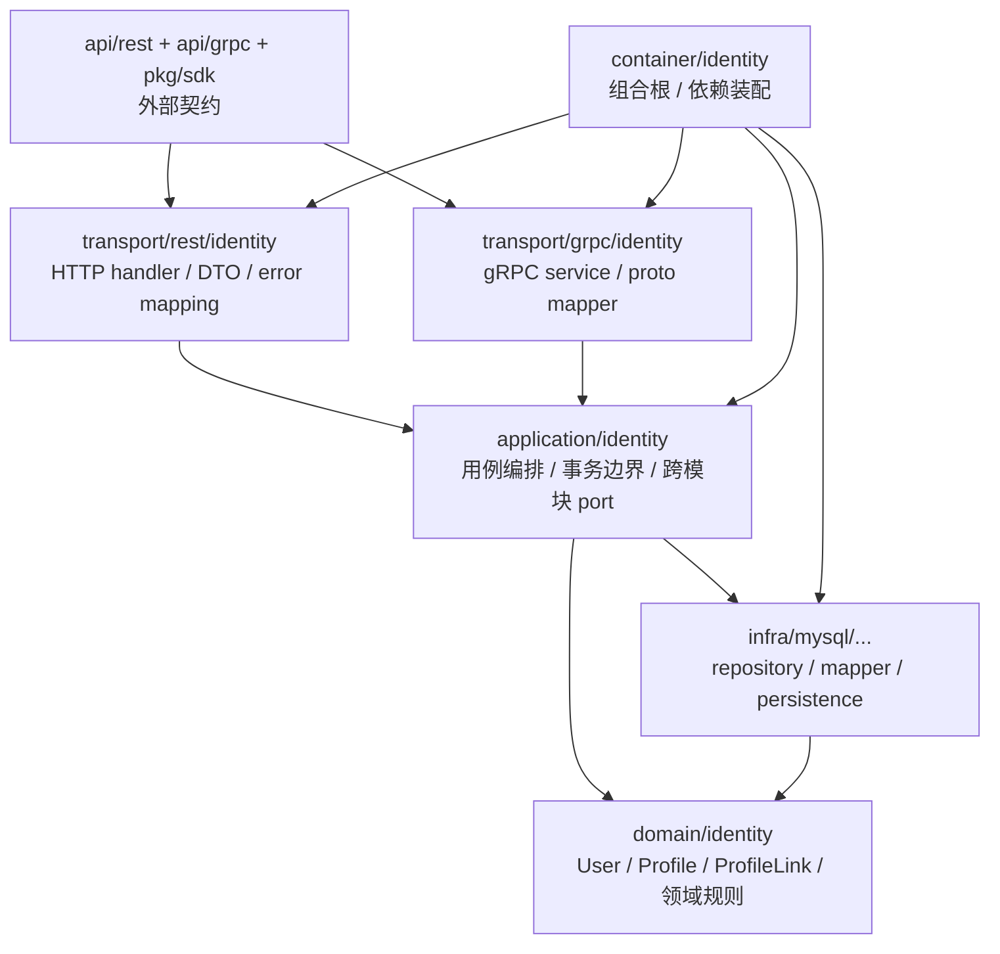

# Identity 分层架构与代码索引

> 状态：待补证据 · 第一版正文，待继续按源码目录、契约文件、组合根和架构测试逐项核对。

---

## 1. 本文回答

本文回答 7 个问题：

- Identity 模块在代码中如何分层？
- `domain / application / infra / transport / container / contract` 各层分别负责什么？
- 维护 `User / Profile / ProfileLink` 时应该从哪些代码入口开始读？
- 创建 User/Profile、建立/撤销 ProfileLink 的代码路径如何串起来？
- 哪些依赖方向是允许的，哪些依赖方向是边界漂移？
- REST/gRPC 契约与 application/domain 如何对应？
- 修改 Identity 代码或文档时应该运行哪些 Verify？

本文是 Identity 的代码导航文档，不重复完整领域模型与关键链路。领域模型见 [01-领域模型-User-Profile-ProfileLink.md](01-领域模型-User-Profile-ProfileLink.md)，关键链路见 [02-关键链路-创建User与Profile.md](02-关键链路-创建User与Profile.md) 和 [03-关键链路-建立与撤销ProfileLink.md](03-关键链路-建立与撤销ProfileLink.md)。

---

## 2. 30 秒结论

Identity 模块按 IAM 通用分层组织：

```text
transport/rest + transport/grpc
  -> application/identity
  -> domain/identity
  -> infra/repository
  -> container/identity
  -> api/rest + api/grpc + pkg/sdk
```

各层职责：

```text
domain：表达 User / Profile / ProfileLink 模型和身份不变量；
application：编排创建、更新、建立关系、撤销关系等用例；
infra：实现 repository、唯一性检查、持久化映射；
transport：把 REST/gRPC 请求转换为 application command/query；
container：组合根，装配 repository、service、handler、跨模块 port；
contract：OpenAPI/proto/SDK 对外接入契约。
```

如果只记一句话：

> Identity 的业务规则应优先落在 domain/application，transport 只做协议适配，infra 只做技术实现，container 只做依赖装配。

---

## 3. 分层总图



读图规则：

```text
transport 依赖 application，不直接依赖 infra repository；
application 可以依赖 domain 和 repository port；
domain 不依赖 transport、infra concrete、REST/gRPC、MySQL、Redis、JWT、Casbin；
infra 可以依赖 domain 做模型映射；
container 可以知道具体实现，但不能执行业务用例；
contract 是外部机器契约，不等同于 domain 模型。
```

---

## 4. 代码事实源总表

| 层 | 路径 | 说明 |
| --- | --- | --- |
| Domain | `../../../internal/apiserver/domain/identity` | Identity 领域模型与领域规则 |
| Application | `../../../internal/apiserver/application/identity` | User/Profile/ProfileLink 用例编排 |
| Infra MySQL | `../../../internal/apiserver/infra/mysql/user` | User repository 实现 |
| Infra MySQL | `../../../internal/apiserver/infra/mysql/profile` | Profile repository 实现 |
| Infra MySQL | `../../../internal/apiserver/infra/mysql/profilelink` | ProfileLink repository 实现 |
| REST transport | `../../../internal/apiserver/transport/rest/identity` | REST handler、DTO、错误映射 |
| gRPC transport | `../../../internal/apiserver/transport/grpc/identity` | gRPC service、proto mapper |
| Container | `../../../internal/apiserver/container/identity` | Identity 模块装配 |
| REST 契约 | `../../../api/rest/identity.v2.yaml` | Identity REST OpenAPI 契约 |
| gRPC 契约 | `../../../api/grpc/iam/identity/v2/identity.proto` | Identity gRPC proto 契约 |
| SDK | `../../../pkg/sdk` | 对外 Go SDK 接入封装，具体路径以当前代码为准 |
| 架构测试 | `../../../internal/pkg/architecture` | 分层依赖边界测试 |

注意：上表中的路径需要继续与当前仓库目录逐项核对。如果源码目录已调整，应以代码为准并同步更新本文。

---

## 5. Domain 层

### 5.1 职责

Domain 层负责表达 Identity 的核心业务模型和不变量。

它应该回答：

```text
User 是什么？
Profile 是什么？
ProfileLink 是什么？
User/Profile/ProfileLink 各自有哪些不变量？
Rel 如何推导 Type？
ProfileLink 如何软撤销？
同一 User 为什么只能有一个 active self 档案？
```

Domain 层不应该负责：

```text
HTTP/gRPC 参数解析；
OpenAPI/proto DTO；
SQL 查询；
MySQL/GORM 细节；
Redis/JWT/Casbin/WeChat SDK；
事务开启和提交；
跨模块具体 repository 调用；
错误码到 HTTP/gRPC status 的映射。
```

---

### 5.2 代码索引

| 对象 / 能力 | 路径 | 说明 |
| --- | --- | --- |
| User 实体 | `../../../internal/apiserver/domain/identity/user/user.go` | User 字段、构造、行为、可用性判断 |
| User 状态 | `../../../internal/apiserver/domain/identity/user/types.go` | active / inactive / blocked |
| User 领域 port | `../../../internal/apiserver/domain/identity/user` | 手机号唯一性等领域端口，具体文件以源码为准 |
| Profile 实体 | `../../../internal/apiserver/domain/identity/profile/profile.go` | Profile 字段、构造、资料修改 |
| Profile 领域 port | `../../../internal/apiserver/domain/identity/profile` | 身份证唯一性等领域端口，具体文件以源码为准 |
| ProfileLink 实体 | `../../../internal/apiserver/domain/identity/profilelink/profile_link.go` | ProfileLink 字段、IsActive、Revoke |
| Type / Relation | `../../../internal/apiserver/domain/identity/profilelink/types.go` | Rel 与 Type 定义和推导 |
| Linker | `../../../internal/apiserver/domain/identity/profilelink/linker.go` | 建立关系、active link 去重 |
| SelfProfileGuard | `../../../internal/apiserver/domain/identity/profilelink/self_profile_guard.go` | active self 档案唯一性 |

---

### 5.3 修改入口

如果要修改：

| 目标 | 优先阅读 |
| --- | --- |
| User 字段或状态 | `domain/identity/user/user.go`、`types.go` |
| User 创建规则 | `user.NewUser` 与 application create 用例 |
| Profile 字段或资料规则 | `domain/identity/profile/profile.go` |
| Profile 身份证规则 | `profile.NewProfile` 与 application create 用例 |
| Rel / Type 语义 | `profilelink/types.go` |
| active link 去重 | `profilelink/linker.go` |
| self 档案唯一性 | `profilelink/self_profile_guard.go` |
| 软撤销语义 | `profilelink/profile_link.go` |

---

## 6. Application 层

### 6.1 职责

Application 层负责用例编排。

它应该处理：

```text
CreateUser；
UpdateUser；
User lifecycle：Activate / Deactivate / Block；
CreateProfile；
UpdateProfile；
LinkProfile；
QueryProfileLinks；
RevokeProfileLink；
唯一性检查；
事务边界；
跨模块最小 port 协作；
应用错误归一化。
```

Application 层不应该处理：

```text
HTTP/gRPC 细节；
SQL 细节；
MySQL row 到 domain entity 的具体映射；
Casbin Enforce；
JWT 签名；
Suggest 索引构建；
IDP provider token 解析。
```

---

### 6.2 代码索引

| 用例组 | 路径 | 说明 |
| --- | --- | --- |
| User application | `../../../internal/apiserver/application/identity/user` | User 创建、更新、状态变更、生命周期协作 |
| Profile application | `../../../internal/apiserver/application/identity/profile` | Profile 创建、更新、查询 |
| ProfileLink application | `../../../internal/apiserver/application/identity/profilelink` | ProfileLink 建立、查询、撤销 |
| User lifecycle | `../../../internal/apiserver/application/identity/user/service_lifecycle.go` | User 状态变化与 Session 撤销协作 |

---

### 6.3 用例调用主线

创建 User：

```text
transport
  -> application/identity/user
  -> user.UniquenessChecker
  -> user.NewUser
  -> UserRepository
```

创建 Profile：

```text
transport
  -> application/identity/profile
  -> profile.IDCardUniquenessChecker
  -> profile.NewProfile
  -> ProfileRepository
```

建立 ProfileLink：

```text
transport
  -> application/identity/profilelink
  -> SelfProfileGuard
  -> profilelink.Linker
  -> ProfileLinkRepository
```

撤销 ProfileLink：

```text
transport
  -> application/identity/profilelink
  -> ProfileLinkRepository.Load
  -> ProfileLink.Revoke
  -> ProfileLinkRepository.Save
```

---

### 6.4 跨模块 port

Identity application 可以通过最小 port 与其他模块协作。

当前已知协作：

```text
User 被封禁时，Identity 触发 AuthN Session 撤销。
```

要求：

```text
通过 port/interface 注入；
不直接 import AuthN repository concrete；
不直接操作 token store；
不在 User 实体中写 Session 逻辑；
组合根负责装配具体实现。
```

---

## 7. Infra 层

### 7.1 职责

Infra 层负责技术实现。

它应该处理：

```text
repository concrete；
数据库查询；
唯一性检查实现；
domain entity 与 persistence record 映射；
事务适配；
数据库错误到应用错误的转换辅助；
索引或唯一约束兜底。
```

Infra 层不应该处理：

```text
定义 User/Profile/ProfileLink 业务语义；
决定 Rel 如何推导 Type；
决定 User 状态机；
决定 AuthZ 是否放行；
签发 Token；
构建 Suggest Snapshot。
```

---

### 7.2 代码索引

| 能力 | 路径 | 说明 |
| --- | --- | --- |
| User repository | `../../../internal/apiserver/infra/mysql/user` | User 持久化与查询 |
| Profile repository | `../../../internal/apiserver/infra/mysql/profile` | Profile 持久化与查询 |
| ProfileLink repository | `../../../internal/apiserver/infra/mysql/profilelink` | ProfileLink 持久化、active/history 查询 |

---

### 7.3 需要重点核对的实现点

| 实现点 | 为什么重要 |
| --- | --- |
| User.Phone 唯一约束 | 防止并发重复创建 User |
| Profile.IDCard 唯一约束 | 防止并发重复创建 Profile |
| ProfileLink active 去重 | 防止重复 active link |
| active self 唯一性 | 防止同一 User 多个本人档案 |
| RevokedAt 查询过滤 | active-only 与 including revoked 语义正确 |
| 事务边界 | 保证检查与写入一致性 |
| 错误映射 | 唯一约束冲突应转换为 conflict，不应暴露 SQL 细节 |

---

## 8. Transport 层

### 8.1 职责

Transport 层负责协议适配。

它应该处理：

```text
REST path/query/body/header 解析；
gRPC request message 解析；
基础参数校验；
DTO/proto 与 application command/result 的转换；
从 context 获取 Principal 或调用者信息；
调用 Identity application service；
把 application error 映射为 HTTP/gRPC 错误；
响应 DTO/proto 组装。
```

Transport 层不应该处理：

```text
直接访问 repository；
直接开启事务；
直接构造 SQL；
直接调用 profilelink.Linker 并保存；
直接决定权限；
直接修改 domain entity 后绕过 application 保存。
```

---

### 8.2 代码索引

| 协议 | 路径 | 说明 |
| --- | --- | --- |
| REST | `../../../internal/apiserver/transport/rest/identity` | Identity REST handler、DTO、路由入口 |
| gRPC | `../../../internal/apiserver/transport/grpc/identity` | Identity gRPC service、proto mapper |

---

### 8.3 错误映射建议

| 应用错误 | REST | gRPC |
| --- | --- | --- |
| 参数错误 | `400 Bad Request` | `InvalidArgument` |
| 不存在 | `404 Not Found` | `NotFound` |
| 唯一性冲突 | `409 Conflict` | `AlreadyExists` 或 `FailedPrecondition` |
| 状态冲突 | `409 Conflict` | `FailedPrecondition` |
| 未认证 | `401 Unauthorized` | `Unauthenticated` |
| 无权限 | `403 Forbidden` | `PermissionDenied` |
| 内部错误 | `500 Internal Server Error` | `Internal` |

具体映射必须以当前 REST/OpenAPI、proto 和错误处理实现为准。

---

## 9. Container 层

### 9.1 职责

Container 是组合根，负责把 Identity 模块装配进 iam-apiserver。

它应该处理：

```text
创建 Identity repository concrete；
创建唯一性 checker；
创建 application service；
注入跨模块 port，例如 session.Revoker；
创建 REST handler；
创建 gRPC service；
把模块对象暴露给 process/transport 注册。
```

Container 不应该处理：

```text
执行业务用例；
处理 HTTP/gRPC 请求；
直接做用户创建；
直接做权限判定；
隐藏跨模块业务流程。
```

---

### 9.2 代码索引

| 能力 | 路径 | 说明 |
| --- | --- | --- |
| Identity module wiring | `../../../internal/apiserver/container/identity` | Identity repository、service、handler 装配 |
| Root container | `../../../internal/apiserver/container` | 全局组合根入口，具体路径以代码为准 |

---

## 10. 契约与 SDK

### 10.1 REST 契约

REST 契约路径：

```text
../../../api/rest/identity.v2.yaml
```

REST 契约应回答：

```text
有哪些 Identity HTTP endpoint；
请求/响应 DTO 字段是什么；
错误码如何表达；
是否暴露 User/Profile/ProfileLink 创建、查询、撤销能力；
字段命名是否与 application result 对齐。
```

---

### 10.2 gRPC 契约

gRPC 契约路径：

```text
../../../api/grpc/iam/identity/v2/identity.proto
```

gRPC 契约应回答：

```text
有哪些 Identity RPC；
request/response message 字段是什么；
是否提供 CreateUser / CreateProfile / LinkProfile / RevokeProfileLink 等能力；
错误语义如何映射；
字段是否与 REST 和 application 语义一致。
```

---

### 10.3 SDK

SDK 应基于 REST/OpenAPI 或 gRPC/proto 契约生成或封装。

SDK 不应该：

```text
绕过服务端 application；
伪造 domain 规则；
把 SDK DTO 当作 domain entity；
在客户端决定 Type 而绕过 Rel 推导；
隐藏服务端 conflict/not found 错误。
```

---

## 11. 典型修改路径

### 11.1 新增 User 字段

推荐检查顺序：

```text
1. domain/identity/user
2. application/identity/user command/result
3. infra/mysql/user persistence mapping
4. transport/rest/identity DTO
5. transport/grpc/identity proto mapper
6. api/rest/identity.v2.yaml
7. api/grpc/iam/identity/v2/identity.proto
8. pkg/sdk
9. tests + docs
```

---

### 11.2 新增 Profile 字段

推荐检查顺序：

```text
1. domain/identity/profile
2. application/identity/profile command/result
3. infra/mysql/profile persistence mapping
4. Suggest 是否需要读取该字段
5. transport/rest + transport/grpc
6. OpenAPI/proto/SDK
7. tests + docs
```

---

### 11.3 修改 Rel / Type

推荐检查顺序：

```text
1. domain/identity/profilelink/types.go
2. profilelink.Linker
3. SelfProfileGuard 是否受影响
4. application/identity/profilelink
5. infra/mysql/profilelink persistence/query
6. REST/gRPC enum 或字段契约
7. AuthZ/Suggest 是否依赖该关系语义
8. tests + docs
```

---

### 11.4 修改撤销语义

推荐检查顺序：

```text
1. domain/identity/profilelink/profile_link.go
2. application/identity/profilelink revoke use case
3. infra/mysql/profilelink active/history 查询
4. REST/gRPC revoke endpoint/RPC
5. Suggest/AuthZ 是否消费 active-only 关系
6. tests + docs
```

---

## 12. 依赖方向规则

### 12.1 允许

```text
transport -> application
application -> domain
application -> repository port
infra -> domain
container -> all concrete wiring targets
contract -> transport implementation alignment
```

### 12.2 禁止

```text
domain -> application；
domain -> infra/mysql；
domain -> transport/rest；
domain -> transport/grpc；
domain -> api/rest or api/grpc；
application -> transport；
transport -> infra repository concrete；
infra -> transport；
Identity domain -> authn/authz/idp/suggest concrete；
Identity application -> authn/authz/idp/suggest repository concrete。
```

---

## 13. 常见反模式

| 反模式 | 问题 | 推荐做法 |
| --- | --- | --- |
| handler 直接调用 repository | 绕过 application 规则 | handler 调 application service |
| repository 决定 Rel/Type | 持久化层吞并领域规则 | Rel/Type 规则放 domain |
| container 里执行业务创建 | 组合根混入业务流程 | container 只装配依赖 |
| domain import MySQL/GORM | 领域层依赖技术实现 | 通过 repository port 反转依赖 |
| proto message 直接当 domain entity | 契约模型污染领域模型 | transport 做 mapper |
| REST DTO 直接进入 repository | 协议对象穿透应用层 | DTO -> command -> domain |
| AuthN 直接写 Identity repository | 跨模块绕过边界 | 通过 Identity application/port 协作 |
| Suggest 直接写 Profile 表 | 读模型吞并写模型 | Suggest 只读 Identity 事实 |
| ProfileLink repository 不区分 active/history | 已撤销关系可能误用 | 明确 active-only 与 including revoked 查询 |

---

## 14. Verify

修改本文后至少执行：

```bash
make docs-hygiene
```

涉及 domain 层：

```bash
go test ./internal/apiserver/domain/identity/...
```

涉及 application 层：

```bash
go test ./internal/apiserver/application/identity/...
```

涉及 infra repository：

```bash
go test ./internal/apiserver/infra/mysql/user/...
go test ./internal/apiserver/infra/mysql/profile/...
go test ./internal/apiserver/infra/mysql/profilelink/...
```

如果实际 infra 测试路径不同，以当前代码为准。

涉及 REST 契约或 REST transport：

```bash
make api-validate
go test ./internal/apiserver/transport/rest/...
```

涉及 gRPC 契约或 gRPC transport：

```bash
make proto-gen
go test ./internal/apiserver/transport/grpc/...
```

涉及 SDK：

```bash
go test ./pkg/sdk/...
```

涉及分层依赖边界：

```bash
go test ./internal/pkg/architecture
```

---

## 15. 本文总结

Identity 的代码结构可以压缩成：

```text
domain       定义 User / Profile / ProfileLink 和身份不变量
application  编排创建、更新、建立关系、撤销关系等用例
infra        实现 repository、唯一性检查和持久化映射
transport    适配 REST/gRPC 请求和响应
container    装配 Identity 模块依赖
contract     约束 REST/gRPC/SDK 对外接入语义
```

维护 Identity 时最重要的工程规则是：

```text
业务规则不要写进 transport；
技术细节不要写进 domain；
跨模块协作不要直接共享 repository；
契约模型不要污染领域模型；
组合根只装配依赖，不执行业务用例。
```

读完本文后，Identity 模块的 5 篇主文档已经形成闭环：

```text
00-模块总览.md
01-领域模型-User-Profile-ProfileLink.md
02-关键链路-创建User与Profile.md
03-关键链路-建立与撤销ProfileLink.md
04-模块边界-Identity与AuthN-AuthZ-Suggest.md
05-分层架构与代码索引.md
```
