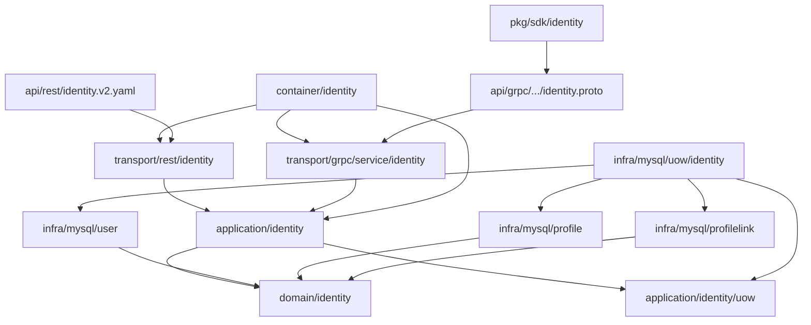

# Identity 分层架构与代码索引

> 状态：已实现 · 本文是代码导航和修改影响索引，不重复总览、模型和链路中的完整设计论证。

## 1. 本文回答

- 要理解或修改 Identity，应从哪个文件开始？
- REST、gRPC、application、domain、UOW、repository 和 container 如何对应？
- 哪些改动会跨越 Identity 边界？
- 哪些 migration 共同决定当前存储结构？
- 当前静态 schema 与 migration 链有什么偏移？
- 不同类型的修改应运行哪些测试？

## 2. 30 秒结论

```text
REST / gRPC transport
  -> application/identity capabilities
  -> domain/identity models and ports
  -> application/identity UnitOfWork
  -> infra/mysql repositories bound to one tx
```

Container 是组合根，只创建和传递 capability，不执行业务流程。REST 与 gRPC 能力不对称，不能看到 application interface 就推导两种协议都有入口。

修改 Identity 时的最短阅读路线：

| 修改类型 | 先读 | 再读 |
| --- | --- | --- |
| 模型字段/行为 | domain entity/value | application DTO/mapper -> repository PO/mapper -> contract mapper |
| 创建/撤销规则 | 对应关键链路文档 + application use case | domain guard/checker -> UOW -> DB constraint -> tests |
| REST/gRPC 契约 | OpenAPI/proto | handler/service -> application capability -> SDK/contract tests |
| 跨模块协作 | [04-模块边界](04-模块边界-Identity与AuthN-AuthZ-Suggest.md) | container deps -> calling application/UOW -> architecture tests |
| 数据库约束 | 完整 migration 链 | PO/mapper -> duplicate translator -> concurrency tests |

## 3. 本文的使用边界

本文负责“去哪里改”，其他文档负责“为什么这样改”：

| 问题 | canonical 文档 |
| --- | --- |
| Identity 为什么存在、宏观决策 | [00-模块总览](00-模块总览.md) |
| User/Profile/ProfileLink 为什么拆分 | [01-领域模型](01-领域模型-User-Profile-ProfileLink.md) |
| User/Profile 创建的事务和失败语义 | [02-创建 User 与 Profile](02-关键链路-创建User与Profile.md) |
| ProfileLink 建立、撤销和查询 | [03-建立与撤销 ProfileLink](03-关键链路-建立与撤销ProfileLink.md) |
| Identity 与 AuthN/AuthZ/IDP/Suggest | [04-模块边界](04-模块边界-Identity与AuthN-AuthZ-Suggest.md) |

代码索引不应重复这些设计正文，也不应把文件名列表误当成依赖方向证明。

## 4. 分层总图



### 4.1 分层责任

| 层 | 应负责 | 不应负责 |
| --- | --- | --- |
| Domain | entity/value 行为、Relation/Type、Linker、guard/checker ports | HTTP/gRPC、SQL、GORM、事务开启、跨模块 concrete |
| Application | 用例编排、跨实体校验、UOW、外部窄端口 | 协议细节、SQL、GORM PO |
| Infrastructure | repository concrete、PO/mapper、事务适配、DB 错误翻译 | 定义关系业务语义、授权决策 |
| Transport | 请求校验、上下文解析、DTO/proto 映射、错误映射 | 直接 repository 访问、事务、domain rule 编排 |
| Container | typed deps、application capability、REST/gRPC 装配 | 执行 Create/Establish/Revoke、隐藏业务流程 |
| Contract/SDK | 公开协议和调用封装 | 代替 domain/application 事实源 |

## 5. 顶层代码入口

| 层 | 路径 | 阅读重点 |
| --- | --- | --- |
| Domain | `internal/apiserver/domain/identity` | User/Profile/ProfileLink 模型、repository ports、checker/guard |
| Application | `internal/apiserver/application/identity` | 用例接口、事务编排、当前用户访问约束 |
| Identity UOW port | `internal/apiserver/application/identity/uow/uow.go` | 事务内三个 repository 的最小集合 |
| Identity MySQL UOW | `internal/apiserver/infra/mysql/uow/identity/uow.go` | 为同一 tx 创建 User/Profile/ProfileLink repositories |
| MySQL repositories | `internal/apiserver/infra/mysql/user`、`internal/apiserver/infra/mysql/profile`、`internal/apiserver/infra/mysql/profilelink` | PO/BO mapper、active/history filter、duplicate translator |
| REST | `internal/apiserver/transport/rest/identity` | 当前用户自助查改和关系受限查询 |
| gRPC | `internal/apiserver/transport/grpc/service/identity` | 系统查询、生命周期、建档和 ProfileLink commands |
| Container | `internal/apiserver/container/identity` | typed deps、capabilities、REST/gRPC collector |
| REST contract | `api/rest/identity.v2.yaml` | HTTP paths、query/body schema、response |
| gRPC contract | `api/grpc/iam/identity/v2/identity.proto` | services、RPC、messages、超前字段 |
| Go SDK | `pkg/sdk/identity` | gRPC raw client 与 read/write/profile/profilelink 封装 |
| Migration | `internal/pkg/migration/migrations` | 按版本顺序得到的最终表结构 |
| Architecture guards | `internal/pkg/architecture/architecture_test.go` | 分层依赖、退役模型、事务 context、N+1 和契约护栏 |

## 6. 按修改目标定位

### 6.1 User 创建、资料或状态

| 目标 | 主入口 | 不要漏掉 |
| --- | --- | --- |
| 用例接口/DTO | `internal/apiserver/application/identity/user/services.go` | REST/gRPC 并不暴露全部 application 能力 |
| Identity 创建 | `internal/apiserver/application/identity/user/service_create.go` | AuthN signup 还有另一条 User 创建路径 |
| AuthN signup 创建/复用 User | `internal/apiserver/application/authn/signup/step_resolve_user.go` | AuthN UOW、Phone 规则和 LoginIdentity 契约测试 |
| 资料更新 | `internal/apiserver/application/identity/user/service_editor.go` | Phone checker、REST contacts 映射、gRPC UpdateUser 多步更新 |
| Activate/Deactivate/Block | `internal/apiserver/application/identity/user/service_lifecycle.go` | Block/Deactivate 的本地安全 Outbox 与最终撤销语义 |
| 查询 | `internal/apiserver/application/identity/user/service_query.go` | batch 查询返回 map 的缺失项语义 |
| 模型/状态 | `internal/apiserver/domain/identity/user/user.go`、`types.go` | 状态方法当前没有迁移前置 |
| Phone 唯一性 | `internal/apiserver/domain/identity/user/uniqueness_checker.go` | application 友好预检查、DB `active_phone` 最终裁决和 duplicate 映射 |
| 持久化 | `internal/apiserver/infra/mysql/user` | nullable Phone 与 migration 终态 |

### 6.2 Profile 创建、更新或查询

| 目标 | 主入口 | 不要漏掉 |
| --- | --- | --- |
| 用例接口/DTO | `internal/apiserver/application/identity/profile/services.go` | `MyProfiles` 是当前用户组合能力 |
| 组合建档 | `internal/apiserver/application/identity/profile/service_my_profiles.go` | ProfileLink、self guard、Identity UOW |
| 创建字段解析 | `internal/apiserver/application/identity/profile/profile_creation.go` | Gender/Birthday/IDCard 可选语义 |
| 更新 | `internal/apiserver/application/identity/profile/service_my_profiles.go` | `MyProfiles.Patch` 执行 active-link 前置并进入 Identity UoW |
| 查询 | `internal/apiserver/application/identity/profile/service_query.go` | 无作用域 REST search 已下线；授权搜索由 Suggest 提供 |
| 模型 | `internal/apiserver/domain/identity/profile/profile.go` | Name 不 TrimSpace，合法性部分在 application |
| IDCard 唯一性 | `internal/apiserver/domain/identity/profile/idcard_uniqueness_checker.go` | DB `profiles.uk_id_card` 并发兜底 |
| 持久化 | `internal/apiserver/infra/mysql/profile` | SQL NULL、duplicate error translation、Suggest Loader 直读表 |

### 6.3 ProfileLink 建立、查询和撤销

| 目标 | 主入口 | 不要漏掉 |
| --- | --- | --- |
| 用例接口/DTO | `internal/apiserver/application/identity/profilelink/services.go` | `Commands/Directory/MyProfileLinks` 是三种不同边界 |
| 建立/撤销 | `internal/apiserver/application/identity/profilelink/service_command.go` | 参与者校验、selector、事务 |
| 当前用户访问 | `internal/apiserver/application/identity/profilelink/service_access.go` | UserID 强制为 current user，按 Profile 查询需 active link |
| active/history 查询 | `internal/apiserver/application/identity/profilelink/service_query.go` | batch Profile 加载顺序与 N+1 护栏 |
| 实体软撤销 | `internal/apiserver/domain/identity/profilelink/profile_link.go` | mutex 只保护单个实体实例 |
| 建立和 active pair | `internal/apiserver/domain/identity/profilelink/linker.go` | repository `IsLinked` active-only |
| active self | `internal/apiserver/domain/identity/profilelink/self_profile_guard.go` | migration `000007`、self_key mapper |
| Relation/Type | `internal/apiserver/domain/identity/profilelink/types.go` | proto unspecified/unknown 映射 other |
| 持久化 | `internal/apiserver/infra/mysql/profilelink` | active/history filter、组合唯一键、无条件 revoke update |

## 7. 协议与实现映射

### 7.1 REST

路由入口：`internal/apiserver/transport/rest/identity/router.go`。

| 路由组 | Handler/DTO | application capability |
| --- | --- | --- |
| `/identity/me` | `handler/user.go`、`request/user.go`、`response/user.go` | User Editor/Directory + RoleNameReader |
| `/identity/me/profiles` | `handler/profile_query.go` | `profile.MyProfiles.List` |
| `/identity/profiles/:id` | `handler/profile_query.go`、`profile_command.go` | `MyProfiles.Get/Patch` |
| `/identity/profile-links` | `handler/profile_link.go` | `profilelink.MyProfileLinks.List` |

REST 没有 User/Profile 创建或 ProfileLink 建立/撤销路由。无作用域的 `/identity/profiles/search` 已下线；授权后的搜索入口是 `/suggest/profile`。OpenAPI
以 `api/rest/identity.v2.yaml` 为契约源。

### 7.2 gRPC

注册入口：`internal/apiserver/transport/grpc/service/identity/service.go`。

| Service | 实现文件 | 主要 application capability |
| --- | --- | --- |
| `IdentityRead` | `identity_read.go` | User/Profile Directory |
| `IdentityLifecycle` | `identity_lifecycle.go` | User Creator/Editor/StatusChanger |
| `ProfileCommand` | `profile_command.go` | `profile.MyProfiles.Create` |
| `ProfileLinkQuery` | `profile_link_query.go` | ProfileLink Directory + User batch query |
| `ProfileLinkCommand` | `profile_link_command.go` | ProfileLink Commands |

proto 变更后至少检查：生成物、service/mapper、`pkg/sdk/identity`、`contract_alignment_test.go`、gRPC ACL 和接入文档。

## 8. Container 装配

`internal/apiserver/container/identity/module.go` 创建一个 MySQL Identity UOW，并装配：

- User `Creator / Editor / StatusChanger / Directory`；
- Profile `Directory / MyProfiles`；
- ProfileLink `Commands / Directory / MyProfileLinks`。

`capabilities.go` 是 transport 可见的 application 能力集；`rest.go` 和 `grpc.go` 将这些能力分别交给两种 transport。

跨模块依赖在 `deps.go` 显式声明：

- AuthZ `RoleNameReader`；
- AuthN `session.Revoker`。

### 8.1 当前 health 边界

`IdentityModule.CheckHealth()` 当前无条件返回 nil，没有探测 DB、repository 或跨模块端口。因此“Identity module health 通过”只表示当前模块健康方法未报错，
不能当成运行时依赖真实可用的证据。

## 9. 数据库与 migration 终态

不要仅读 `000001` 或 GORM tag 推导当前结构。Identity 相关终态由至少以下 migration 按顺序叠加：

| Migration | 对 Identity 的影响 |
| --- | --- |
| `000001_init_schema.up.sql` | users/profiles/profile_links 基础表、Profile IDCard 唯一键、ProfileLink 组合约束 |
| `000002_add_profile_links_profile_id_index.up.sql` | 补齐/迁移 Profile 和 ProfileLink 结构 |
| `000003_make_users_phone_nullable.up.sql` | User Phone 改为可空 |
| `000007_add_active_self_profile_link_guard.up.sql` | 清理重复 active self，添加 `self_key` 和 active self 唯一键 |
| `000009_remove_identity_misplaced_profile_attrs.up.sql` | 从 users 移除误放的 `id_card` 及其唯一索引 |

### 9.1 Schema 事实源

`internal/pkg/migration/migrations/*.sql` 是 schema 的唯一事实源。曾与 migration `000003`、`000009` 终态漂移的旧静态 schema 快照已移除；新库必须执行完整
migration 链，随后才可按需重放不含 DDL 的 `configs/mysql/bootstrap.sql`。

## 10. 架构护栏与它们保护的决策

| 护栏 | 保护内容 |
| --- | --- |
| `TestDomainPackagesDoNotAddInfrastructureDependencies` | domain 不引入 infra/database |
| `TestApplicationPackagesDoNotAddTransportOrInfrastructureDependencies` | application 不引入 transport/infra concrete |
| `TestIdentityApplicationTransactionScopedCallsUseTxContext` | Identity 事务内调用使用 tx context |
| `TestIdentityLegacyChildGuardianshipModelDoesNotReturn` | 退役 child/guardianship 模型、路由和契约不回流 |
| `TestIdentitySemanticServiceNamesDoNotRegress` | 避免 Manager/ApplicationService 空泛能力重新出现 |
| `TestAuthnOnboardingAndProfileLinkContractsDoNotRegress` | signup/ProfileLink RPC 的现行命名和契约 |
| `TestIdentityProfileLinkListDoesNotUseNPlusOneUserLookup` | gRPC Link edge 使用 batch User 查询 |
| `TestProfileLinkListProfilesDoesNotUseNPlusOneProfileLookup` | application 按 User 列 Profile 使用 batch Profile 查询 |

架构测试不能证明业务语义全部正确，但它们使已经做出的结构决策不会在普通重构中悄然回退。

## 11. 典型修改的影响清单

| 改动 | 至少同步检查 |
| --- | --- |
| User 字段 | domain、Identity application DTO/result、AuthN signup input/result、PO/mapper、migration、REST/gRPC mapper、SDK |
| Profile 字段 | domain、application、PO/mapper、migration、REST/gRPC、SDK、Suggest Loader/SearchTerm 是否需要 |
| Relation/Type | domain types/Linker/guard、PO/mapper、唯一索引、proto enum、REST response、SDK、Suggest/AuthZ 消费点 |
| 撤销语义 | entity、application selector、repository active/history/conditional update、REST/gRPC、batch retry、Suggest Loader |
| Phone 唯一性 | Identity Create/Patch、AuthN signup/repair、DB migration、duplicate translator、并发测试 |
| Profile 创建语义 | `MyProfiles`、Identity UOW、ProfileLink guard/Linker、gRPC response、SDK |
| REST 路由/schema | router、handler/request/response、OpenAPI、route matrix/security tests |
| gRPC RPC/message | proto、生成物、service/mapper、SDK、ACL、contract alignment tests |
| Identity/AuthN 事务边界 | 两个 UOW ports/impl、signup/lifecycle、container deps、模块边界文档 |
| DB 唯一性 | migration、PO tag、repository duplicate translator、application 错误映射、并发测试 |
| Container capability | module/capabilities/rest/grpc/deps、module tests、运行时注册 |

## 12. 验证入口

### 12.1 文档修改

```bash
make docs-hygiene
```

### 12.2 Identity 模型、用例或存储

```bash
go test ./internal/apiserver/domain/identity/...
go test ./internal/apiserver/application/identity/...
go test ./internal/apiserver/infra/mysql/user ./internal/apiserver/infra/mysql/profile ./internal/apiserver/infra/mysql/profilelink
```

### 12.3 创建 User 或跨 AuthN 边界

```bash
go test ./internal/apiserver/application/authn/signup
go test ./internal/apiserver/infra/mysql/uow/authn
go test ./internal/apiserver/container/identity ./internal/apiserver/container/authn
```

### 12.4 协议、装配或分层

```bash
make api-validate
go test ./internal/apiserver/transport/grpc/service/identity
go test ./internal/apiserver/transport/rest/identity/...
go test ./pkg/sdk/identity
go test ./internal/pkg/architecture
```

`make api-validate` 用于契约改动，可能依赖本机的容器/生成工具环境；纯 Markdown 修改不需要为了凑命令而把环境缺失报成契约失败。
