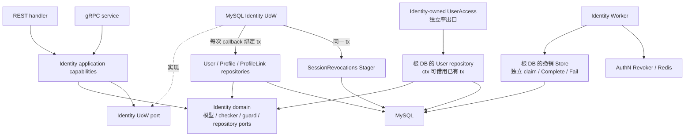

# Identity 分层架构与代码索引

> 状态：已实现 · 本文维护修改入口、依赖方向、装配条件与验证范围。迁移组合的风险按源码推论标记，不表示已复现或已确认生产状态。

## 1. 先按改动找入口

普通 Identity 请求由 transport 调用 application capability；application 分别依赖领域模型和 UoW port。MySQL adapter 在每次回调内创建绑定事务的仓储，不是 Domain 调用 UoW，也不是 container 初始化一个全局事务。跨模块还有 UserAccess、AuthN 共享仓储和 Suggest SQL 投影，不能只沿 Identity application 一条路径修改。

| 要改的合同 | 第一入口 | 必须继续跟读 |
| --- | --- | --- |
| User 创建/Phone 唯一性 | [Creator](../../../internal/apiserver/application/identity/user/service_create.go)、[联系值解析](../../../internal/apiserver/application/identity/user/contact_value.go) | [AuthN resolve User](../../../internal/apiserver/application/authn/signup/step_resolve_user.go)、两个 UoW、User mapper/索引/duplicate translator |
| User 资料/状态 | [Editor](../../../internal/apiserver/application/identity/user/service_editor.go)、[StatusChanger](../../../internal/apiserver/application/identity/user/service_lifecycle.go) | 其他 User writer、SessionRevocations、UserAccess、公开响应的写后读取 |
| Profile 建档/补丁 | [MyProfiles](../../../internal/apiserver/application/identity/profile/service_my_profiles.go)、[创建字段解析](../../../internal/apiserver/application/identity/profile/profile_creation.go) | Link guard/Linker、UoW、PO/mapper、REST/gRPC 各自投影 |
| Link 建立/恢复/撤销 | [Commands](../../../internal/apiserver/application/identity/profilelink/service_command.go) | selector、[实体](../../../internal/apiserver/domain/identity/profilelink/profile_link.go)、仓储条件写、唯一键、公开批次与重试 |
| 当前用户/系统查询 | [MyProfileLinks](../../../internal/apiserver/application/identity/profilelink/service_access.go)、[Directory](../../../internal/apiserver/application/identity/profilelink/service_query.go) | REST 当前 User 来源、gRPC batch mapper、active/history、分页与 Suggest 的独立许可 |
| 公开字段/入口 | REST [router](../../../internal/apiserver/transport/rest/identity/router.go)、gRPC [service](../../../internal/apiserver/transport/grpc/service/identity/service.go) | 机器契约、请求/响应 mapper、错误、SDK、注册及实际部署的安全配置 |

实体与不变量归[模型](01-领域模型-User-Profile-ProfileLink.md)，创建/借用事务归[创建链路](02-关键链路-创建User与Profile.md)，周期/查询/批次归[ProfileLink链路](03-关键链路-建立与撤销ProfileLink.md)，主数据、准入与消费时效归[模块边界](04-模块边界-Identity与AuthN-AuthZ-Suggest.md)。本篇只定位改动；规则先改对应主文，再同步索引。

## 2. 依赖与事务适配


```mermaid
flowchart TB
    REST["REST handler"] --> APP["Identity application capabilities"]
    GRPC["gRPC service"] --> APP
    APP --> DOMAIN["Identity domain<br/>模型 / checker / guard / repository ports"]
    APP --> PORT["Identity UoW port"]
    IMPL["MySQL Identity UoW"] -. "实现" .-> PORT
    IMPL -->|"每次 callback 绑定 tx"| REPOS["User / Profile / ProfileLink repositories"]
    IMPL -->|"同一 tx"| STAGER["SessionRevocations Stager"]
    REPOS --> DOMAIN
    REPOS --> DB["MySQL"]
    STAGER --> DB
    UA["Identity-owned UserAccess<br/>独立窄出口"] --> UAREPO["根 DB 的 User repository<br/>ctx 可借用已有 tx"]
    UAREPO --> DOMAIN
    UAREPO --> DB
    WORKER["Identity Worker"] --> STORE["根 DB 的撤销 Store<br/>独立 claim / Complete / Fail"]
    STORE --> DB
    WORKER --> REV["AuthN Revoker / Redis"]
```

实线表示调用/依赖，虚线表示 interface 实现；不表示所有节点共用一笔事务。UserAccess 自行创建根 DB User repository，不经 Identity application UoW；仓储仍可优先使用 context 中已有的 tx。Worker 使用根 DB Store，领取和完成不参加状态事务。依据：[UoW port](../../../internal/apiserver/application/identity/uow/uow.go)、[MySQL adapter](../../../internal/apiserver/infra/mysql/uow/identity/uow.go)、[UserAccess](../../../internal/apiserver/container/identity/user_access.go)、[仓储 context 适配](../../../internal/pkg/database/mysql/base.go)、[module](../../../internal/apiserver/container/identity/module.go)。

| 层 | 当前承担的工作 | 修改时的判断 |
| --- | --- | --- |
| [Domain](../../../internal/apiserver/domain/identity) | 实体/value、Linker、checker/guard、repository ports | 规则是否也应约束恢复、普通更新和其他入口；构造器不替代全部恢复校验 |
| [Application](../../../internal/apiserver/application/identity) | DTO/result、步骤、当前用户关系前置、UoW | 哪些步骤在 callback 内，结果是用例投影还是另一次回读 |
| [MySQL adapters](../../../internal/apiserver/infra/mysql) | PO/mapper、过滤、duplicate translation、条件写与事务适配 | DB 约束集合与预检查是否一致；Update 是否比较条件/检查影响行数 |
| [REST](../../../internal/apiserver/transport/rest/identity) / [gRPC](../../../internal/apiserver/transport/grpc/service/identity) | 来源解析、校验、字段消费、错误与响应 | 注入/声明的字段是否真正使用；协议间是否有意不同 |
| [Container](../../../internal/apiserver/container/identity) | capability 与窄依赖装配、Worker 启动/清理 | 不编排 Create/Establish/Revoke，但拥有后台资源生命周期 |

[OpenAPI](../../../api/rest/identity.v2.yaml) 描述 REST；[proto](../../../api/grpc/iam/identity/v2/identity.proto) 生成消息与客户端；service 与 [SDK](../../../pkg/sdk/identity) 引入生成的 Go 包。契约文件不直接调用 handler，也不是 ModuleState 的运行时来源。

## 3. 装配成功、注册成功与运行可用分别看

### 3.1 初始化与窄出口

[根 bootstrap](../../../internal/apiserver/container/bootstrap.go) 按 event → IDP → AuthN → AuthZ → Identity → Suggest 初始化。[module_graph](../../../internal/apiserver/container/module_graph.go) 在 AuthN/AuthZ 需要时先创建并缓存 Identity-owned UserAccess，分别注入 UserStatusReader/UserResolver；不是先初始化完整 IdentityModule。

IdentityModule 创建九种应用能力：User Creator/Editor/StatusChanger/Directory，Profile Directory/MyProfiles，Link Commands/Directory/MyProfileLinks。`ApplicationCapabilities` 还携带 AuthZ EffectiveRoleReader。AuthN SignUp 另由[AuthN infra](../../../internal/apiserver/container/authn/infra.go)构造共享 DB 的 AuthN UoW，直接使用 User repository，不调用 IdentityModule.Creator。

修改 User 存在性、状态或创建规则至少有三条线：普通 Identity 用例、UserAccess → Admission/subject resolver、AuthN SignUp。共享 Required context 的 owner/提交规则由两个 UoW 与[基础适配](../../../pkg/uow/gorm)共同决定，不能仅改某个仓储。

### 3.2 collector 与注册条件

| 装配线 | 实际步骤与条件 |
| --- | --- |
| REST | [CollectREST](../../../internal/apiserver/container/identity/rest.go) 以 available/module 过滤，创建 handler → [root REST deps](../../../internal/apiserver/container/rest_deps.go) → [root router](../../../internal/apiserver/transport/rest/router.go) / [module routes](../../../internal/apiserver/transport/rest/module_routes.go) → Identity router；受保护路由还要求 AuthN middleware，后者依赖 AuthN available 与 TokenVerifier |
| gRPC | [CollectGRPC](../../../internal/apiserver/container/identity/grpc.go) 生成 Registration → [root registry](../../../internal/apiserver/container/grpc_registry.go) → [transport registry](../../../internal/apiserver/transport/grpc/registry.go) → service.Register；注册顺序 authn/identity/idp/authz 不等于初始化顺序 |
| available / health | [ModuleState](../../../internal/apiserver/container/module_state.go) 主要记录 initialized 与模块指针；Identity CheckHealth 恒 nil；统一 MarkAllServicesServing 不探测 Identity DB、Worker 或目标 User 准入 |

collectors 是组合根调用的函数，模块对象保存应用能力，不保存这两套 transport 实例。空 capability 也能构造非 nil handler，真实请求与依赖须另验。mTLS、Credential/ACL 的挂载归[服务安全链路](../03-AuthZ/06-关键链路-gRPC服务间授权与SDK.md)，模板列出方法不能证明部署已启用。

### 3.3 Worker 与关闭

module 初始化时已在 Revoker 非 nil、PollInterval > 0 条件下启动 Worker，context 来自 Background；不等待 process 后台任务启动阶段。Cleanup 取消并等待，无独立超时。[runtime deps](../../../internal/apiserver/container/runtime_deps.go)把 Cleanup 交给[process shutdown](../../../internal/apiserver/process/shutdown_lifecycle.go)，正常越过 policy/reliable drain 门禁后才在 DB 关闭前执行，不能写成无条件必定完成。

修改 Worker 应跟读[配置](../../../internal/apiserver/options/runtime_options.go)、module_graph/module、[Store/Worker](../../../internal/apiserver/infra/mysql/sessionrevocation)、readiness 和 shutdown。积压年龄、领取活动、清理结果是不同证据；详细代次/重试限制归模块边界。

## 4. 从公开入口追到真正使用的能力

### 4.1 REST：六个 method/path

下表路径均带 `/api/v2/identity` 前缀，全部挂 AuthN middleware。

| method/path | 实现 | 当前消费能力 |
| --- | --- | --- |
| GET /me | [user handler](../../../internal/apiserver/transport/rest/identity/handler/user.go) | User Directory，再读取 roles/permissions 展示 |
| PATCH /me | 同上 | 一次 Editor.PatchProfile，再读展示；写后失败见模块边界 |
| GET /me/profiles | [profile query](../../../internal/apiserver/transport/rest/identity/handler/profile_query.go) | MyProfiles.List |
| GET /profiles/:id | 同上 | MyProfiles.Get |
| PATCH /profiles/:id | [profile command](../../../internal/apiserver/transport/rest/identity/handler/profile_command.go) | MyProfiles.Patch |
| GET /profile-links | [link handler](../../../internal/apiserver/transport/rest/identity/handler/profile_link.go) | MyProfileLinks.List |

没有 REST 创建 User/Profile、建立/撤销 Link 或激活 User 的入口。UserHandler 保存 Creator、仍有 UserCreateRequest 定义，不表示存在创建 handler/路由。无作用域 search 已下线；Suggest 查询不替代详情准入。

### 4.2 gRPC：五个服务、十七个 RPC

| Service / RPC | 实现 | 当前消费能力 |
| --- | --- | --- |
| IdentityRead：GetUser、BatchGetUsers、SearchUsers、GetProfile、BatchGetProfiles | [identity_read](../../../internal/apiserver/transport/grpc/service/identity/identity_read.go) | User/Profile Directory |
| IdentityLifecycle：CreateUser、UpdateUser、DeactivateUser、BlockUser | [identity_lifecycle](../../../internal/apiserver/transport/grpc/service/identity/identity_lifecycle.go) | Creator、一次 Editor.PatchProfile、StatusChanger；停用后另用 Directory 组装响应 |
| ProfileCommand：CreateProfile | [profile_command](../../../internal/apiserver/transport/grpc/service/identity/profile_command.go) | MyProfiles.Create |
| ProfileLinkQuery：HasProfileLink、ListProfiles、ListProfileLinks | [profile_link_query](../../../internal/apiserver/transport/grpc/service/identity/profile_link_query.go) | Link Directory，部分结果 batch User 映射 |
| ProfileLinkCommand：EstablishProfileLink、RevokeProfileLink、BatchRevokeProfileLinks、ImportProfileLinks | [profile_link_command](../../../internal/apiserver/transport/grpc/service/identity/profile_link_command.go) | Commands；保存的 Directory/MyProfileLinks 未被这些方法调用 |

Activate、独立 Rename/Renickname/UpdateContact、GetByIDCard 没有同名公开 RPC；IdentityStream 未注册。正常顶层 Block/Deactivate 的状态 UoW 可以已提交，之后 Directory 失败使 RPC 报错，不能按客户端错误推导无写入。

SDK 的 `Client.Identity/Profile/ProfileLink` 封装这些服务，共用标准客户端连接；[factory](../../../pkg/sdk/identity/factory.go)不创建额外连接或核验 operator。协议变更沿 proto → `make proto-gen` / 生成物 → service/mapper → SDK/caller → ACL/注册清单检查。生成不是验收，本篇未执行生成或改协议。

### 4.3 字段名和方法名有三处导航陷阱

| 要实现的变化 | 当前事实 | 实际需要改的线 |
| --- | --- | --- |
| operator 成为可信审计/授权事实 | 多个请求声明 operator，直接命令不消费/核验；batch 转给内部方法仍被忽略 | 先选服务声明还是可验证委派，再改 handler → DTO → 用例/context → 存储审计；只改 proto 不成立 |
| 统一脱敏联系/证件投影 | gRPC User value 透传完整规范化 Phone/Email，verified_at 未填；Profile masked_number 透传完整 IDCard，REST Profile mapper 才显式脱敏证件号 | [user mapper](../../../internal/apiserver/transport/grpc/service/identity/user_mapper.go)、[profile mapper](../../../internal/apiserver/transport/grpc/service/identity/profile_mapper.go)、REST mapper/SDK；先定义读权限与兼容，DTO 改名不是保护 |
| 邮箱搜索/真正分页/批量加载 | SearchUsers 优先 phones，其次精确 nickname；emails-only 空成功，page 只回显；BatchGetProfiles 逐项 GetByID，错误归入 NotFoundIds | identity_read → Directory/repository/result → proto/SDK，另验证查询和错误行为；Search/Batch 名称不证明 SQL/分页 |

这些是现有实现差异；完整规则归模型、链路和[契约治理](../../04-接口与SDK/01-REST-gRPC与契约治理.md)，不是本轮顺带修改业务的计划。

## 5. 迁移地图：版本、起点与物理结构一起看

### 5.1 与 Identity 直接相关的版本

文件均在[嵌入迁移目录](../../../internal/pkg/migration/migrations)，必须按完整链和起点解释，不能只读 000001 或 PO tag。

| Migration | 修改影响 |
| --- | --- |
| 000001 init_schema | canonical 主表、Profile IDCard 唯一与 Link 组合约束 |
| 000002 add_profile_links_profile_id_index | 兼容补建并从 legacy 表回填 Profile/Link，冲突时 UPDATE canonical 字段；增加 profile_id 查询索引 |
| 000003 make_users_phone_nullable | Phone 可空 |
| 000007 add_active_self_profile_link_guard | 普通 nullable self_key、回填和 active-self 唯一；归一范围见模型 |
| 000009 remove_identity_misplaced_profile_attrs | 删除 users.id_card/索引，以及 profiles.height/weight；不迁移这两列数据 |
| 000017 users_active_phone_unique_guard | active_phone STORED 生成列与唯一键；谓词是未软删且 Phone 非空，不按 User.Status 判断 active |
| 000018 identity_session_revocation_outbox | task 的 User/version/action 唯一键与领取索引；不是 User 自动推进版本或领取代次保证 |
| 000019 retire_legacy_tables | 补建缺失 canonical 表、INSERT IGNORE 旧数据、重算 self_key/补索引；parity 与对象依赖检查后才 DROP children/guardianships，Down 拒绝 |
| 000024 retire_seeddata_cleanup_tables | 校验四份历史复制表的集合/1359行/成对内容/ID不重叠及依赖后删除；不并入 canonical，Down 拒绝 |

000019 的补建、补拷和最终 DROP 不是整篇事务回滚；检查失败前可能已有 DDL/补拷。不可逆 down 与恢复由[退役审计](../../05-工程质量与运维/06-遗留资产兼容层与数据库退役审计.md)和备份方案维护。

### 5.2 一个未被当前 fixture 覆盖的历史起点

**源码组合推论，未连接 MySQL 复现：**若已有 profiles 与 children，000009 已删 profiles.height/weight，000019 的 CREATE TABLE IF NOT EXISTS 不补列，但 children 分支 INSERT 和 parity 仍引用这些列，可能在最终 DROP 前失败。反之，000009 执行时没有 profiles，000019 后补建的 profiles 又包含 height/weight。因此同一 version 不能单独证明物理列完全相同。

[019 专项](../../../internal/pkg/migration/retire_legacy_identity_mysql_test.go)从 legacy-only fixture 直接运行19，另测冲突/view/Down；[full chain](../../../internal/pkg/migration/full_chain_mysql_test.go)从空专用库走 FreshStages 到40，不覆盖上述组合起点，也未逐一断言全部 Identity 列/索引。024 专项的 canonical fixture 仅有 ID 列。fixture、历史运行和当前目标库应分别记录，不能宣称所有历史升级路径已收敛。

### 5.3 PO、bootstrap 与目标库证据

SQL 是仓库预期 schema 的维护源；真实目标须另查 version/dirty、列/index/generated expression 和数据。PO AutoMigrate 不是完整链：UserPO 没有17生成列/唯一；Profile/Link 部分 unique tag 名与 SQL 不同，Link 缺独立 profile_id index tag；task PO 未表达18唯一/领取索引。[模型](01-领域模型-User-Profile-ProfileLink.md)维护规则，不能据 SQLite AutoMigrate 宣称约束已验收。

实际[启动](../../../internal/apiserver/process/database.go)在31/33/35设置 FreshStages；[迁移器](../../../internal/pkg/migration/migrate.go)仅在迁移启用、起始version=0、除schema_migrations外无表时使用，已有库跳过。33的[独立角色 bootstrap](../../../internal/apiserver/maintenance/rolemodel/bootstrap.go)执行嵌入 DML 后继续迁移。手工重放[bootstrap.sql](../../../configs/mysql/bootstrap.sql)则要求完整当前链；它不含 DDL，但会覆盖固定 User 的资料/status并清除 deleted_at，幂等不等于无副作用。已发布 SQL 不改，修复用新 forward migration，详见[数据库约定](../../../configs/mysql/README.md)。本轮未执行迁移/seed/生产操作。

## 6. 三种改动如何闭合影响面

| 具体改动 | 为什么不能只改一个文件 | 最小闭合范围 |
| --- | --- | --- |
| 给 User 状态变更增加 generation | Editor、SignUp/seed 也写 User；只改 StatusChanger 不排除旧状态回写；task、Session 与领取各需明确代次用途和条件 | 列全 writer/预期条件；domain/PO/新迁移、UoW/Stage/Worker、AuthN Session/Admission、失败/并发合同；公开是否新增字段另定，不能机械要求全部 SDK 改动 |
| 增加 Profile 昵称字段 | 持久字段不必对所有读者公开；Suggest 直读 SQL，但是否进入 SearchTerm 是产品合同 | domain/输入/result/PO/mapper/forward migration；按所选投影同步 REST/gRPC/SDK，按搜索需要改 Loader；验证省略/清空/回读与兼容 |
| 新增关系查询 RPC | Directory/MyProfileLinks 范围不同；注册、允许服务与实际调用是三层 | 先定当前用户还是系统查询、历史准入/分页/错误，再做 proto/generated/service/SDK、collector/Register、ACL与行为验证；注册绿色不替代对象范围接受 |

这是候选改动的检查路径，不是已接受的实现方案。需求先确定观察行为，再选层与验证，避免看到一个字段就要求所有模块改同一合同。

## 7. 验证入口与实际证明范围

### 7.1 结构与契约门禁

架构入口为[architecture_test.go](../../../internal/pkg/architecture/architecture_test.go)。

| 检查 | 实际范围与限制 |
| --- | --- |
| Domain / Application import 护栏 | AST 直接 import 禁止列表、理由 allowlist；生产代码与 testutil 例外分开，不是全部传递依赖/动态调用分析 |
| Identity TxContext 护栏 | 仅禁两个固定旧字符串 `managerService.Establish(ctx` / `managerService.Revoke(ctx`，不证明所有当前 callback 传 txCtx |
| 两项 Identity N+1 护栏 | 固定 gRPC Link / application ListProfiles 文件中的片段与 batch 调用；不统计 SQL，不覆盖所有 Batch 查询 |
| Legacy / Semantic / Onboarding 护栏 | 指定根路径/文本与部分 AST 名称，保护退役 token、命名和入口；不证明运行库已删表或全部字段被消费 |
| gRPC contract alignment | 无拦截器、九个 nil capability 的真实 grpc.Server 检查五服务/十七方法，另查少量文件无退役 token；不调用业务 RPC，不证明 mTLS/ACL/字段消费 |
| `make api-validate` | Spectral/warning baseline、现有 Swagger/OAS、route 集合与 Gin 库存；不生成 Swagger/proto，不检查 gRPC/ACL。通用 schema 短名匹配使当前 Identity 十个 schema 全被跳过；其他匹配项只比属性名/required |

Gin 规则读 Paths 与注册 method/path，不执行 handler；两份声明一致不证明实现一致。新的 schema 覆盖修复须报告匹配/跳过数量，行为合同另测。本轮未修改门禁实现。

### 7.2 回归与数据库专项

| 要验证的改动 | 已有入口 | 边界 |
| --- | --- | --- |
| 模型/用例/仓储 | `domain/identity/...`、`application/identity/...`、`infra/mysql/{user,profile,profilelink}` | SQLite/stub 证受控规则；Identity testutil 常用单连接 AutoMigrate，不执行完整 SQL 链 |
| UoW owner/共享创建 | `pkg/uow/gorm`、`infra/mysql/uow/{identity,authn}`、`application/authn/signup` | Identity UoW 专项仅 nil DB fail-closed；基础 UoW/用例另证提交/借用，不据包名推导多步原子性已全覆盖 |
| mapper/查询/协议 | REST handler、gRPC identity、`internal/pkg/grpc`、SDK transport | 部分受控案例；Profile mapper 预先带星号样本仅证透传，不证运行脱敏；`pkg/sdk/identity` 无测试文件，单包 go test 只证编译 |
| 装配/关闭 | container/identity、root container、REST router、process | nil/空gorm.DB、替身 callback、注册集合；不证真实 DB/Worker 在途清理时限 |
| MySQL schema/历史起点 | `identity_consistency_mysql_test.go`、019/024专项、full chain | 17/18专项目标为生成列/唯一与DDL，不证状态/Worker；各项须绑定 fixture、MySQL版本、目标及 Skip 状态 |

[testutil mysql helper](../../../internal/apiserver/application/identity/testutil/mysql_helper.go)按主机变量选择 MySQL，否则退回 SQLite；两者都 AutoMigrate。[迁移专项 helper](../../../internal/pkg/migration/jwks_single_active_mysql_test.go)缺 MYSQL_HOST 直接 Skip。后者会操作指定库，full chain 强制空专用库；普通 go test 绿色不自动成为升级验收。目标和运行授权与文档修改分别处理。

修改后按影响面选包，不反复执行整张列表：

```bash
# 纯文档：引用/事实/维护规则；另真实渲染并查看修改图
make docs-hygiene docs-facts docs-validation-tests

# 用例/映射变更按上表选已有回归，不表示本篇新跑全部包
go test ./internal/apiserver/application/identity/... ./internal/apiserver/transport/grpc/service/identity
go test ./internal/apiserver/transport/rest/identity/handler ./internal/pkg/architecture
```

本篇业务源码/测试/配置/协议未改，相关已完成回归按原日志范围复用；摘要与本次文档/图示检查绑定在[复核记录](../../_data/reviews/2026-10-06-docs-refactor.md)。未以测试名称、编译成功或源码推论代替真实 MySQL、服务安全、部署与业务接受。

下一篇进入[IDP 应用凭据与 AppToken 缓存](../04-IDP/01-应用凭据与AppToken缓存.md)。
