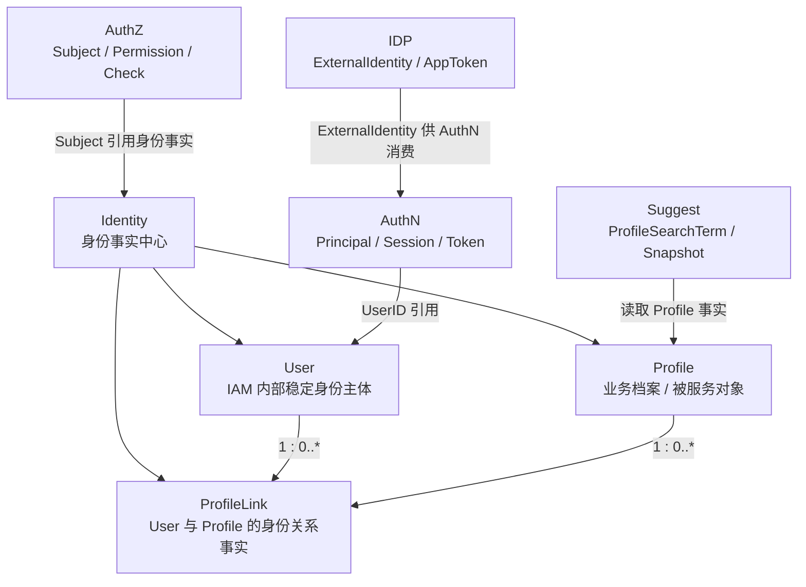

# Identity

> 状态：待补证据 · Identity 模块入口，已按“模型主文档 + 两条关键链路 + 模块边界 + 代码索引”的结构重写，待继续按源码、契约和测试核对。

---

## 1. 本目录定位

`01-Identity/` 是 IAM Identity 模块的文档入口。

Identity 是 IAM 的身份事实中心，负责维护：

```text
User；
Profile；
ProfileLink。
```

它回答 3 个核心问题：

```text
系统内部这个人是谁？
这个人关联了哪些业务档案？
这些关系如何建立、查询和撤销？
```

Identity 不负责认证登录态、不负责权限判定、不负责外部身份源、不负责联想搜索索引。

对应边界：

```text
AuthN 负责证明当前请求者是谁；
AuthZ 负责判断是否允许访问；
IDP 负责外部身份来源；
Suggest 负责 Profile 联想搜索读模型。
```

---

## 2. 30 秒结论

Identity 可以压缩成一个公式：

```text
Identity = User + Profile + ProfileLink + 身份不变量
```

其中：

| 对象 | 一句话 | 不是什么 |
| --- | --- | --- |
| `User` | IAM 内部稳定身份主体 | 不是 `Principal`，也不是 `Subject` |
| `Profile` | 业务档案 / 被服务对象 | 不是登录账号，也不是 Suggest Snapshot |
| `ProfileLink` | User 与 Profile 的身份关系事实 | 不是 `Permission`，也不是 `RoleBinding` |

最重要的边界：

```text
User 不是 Principal；
User 不是 Subject；
Profile 不是登录账号；
ProfileLink 不是 Permission；
ExternalIdentity 不是 User；
Suggest Snapshot 不是 Profile 主表；
ProfileAccessScope 不是 ProfileLink。
```

如果只记一句话：

> Identity 只拥有身份事实；认证、授权、外部身份源和搜索读模型都只能引用或消费这些事实，不能反向污染 Identity 写模型。

---

## 3. 文档结构

当前 Identity 模块保留 5 篇主文档：

| 文档 | 作用 | 阅读重点 |
| --- | --- | --- |
| [00-模块总览.md](00-模块总览.md) | Identity 职责、核心对象、关键规则和模块协作总览 | 建立对 Identity 的整体认知 |
| [01-领域模型-User-Profile-ProfileLink.md](01-领域模型-User-Profile-ProfileLink.md) | User、Profile、ProfileLink 的模型、图、状态机、生命周期和不变量 | 唯一模型主文档，已合并原“领域模型图”和“生命周期”内容 |
| [02-关键链路-创建User与Profile.md](02-关键链路-创建User与Profile.md) | 创建 User 与 Profile 的链路、唯一性、失败边界和事务边界 | 区分内部身份主体与业务档案 |
| [03-关键链路-建立与撤销ProfileLink.md](03-关键链路-建立与撤销ProfileLink.md) | ProfileLink 建立、查询、撤销、self 唯一性和软撤销 | 理解身份关系事实如何建立和失效 |
| [04-模块边界-Identity与AuthN-AuthZ-Suggest.md](04-模块边界-Identity与AuthN-AuthZ-Suggest.md) | Identity 与 AuthN/AuthZ/IDP/Suggest 的协作边界 | 防止 User/Principal/Subject、ProfileLink/Permission 等概念漂移 |
| [05-分层架构与代码索引.md](05-分层架构与代码索引.md) | domain/application/infra/transport/container/contract 代码索引 | 修改代码时的导航入口和 Verify |

注意：

```text
原 02-领域模型图.md 和 03-核心对象生命周期.md 的核心内容已经合并进 01-领域模型-User-Profile-ProfileLink.md。
后续如果文件仍存在，应考虑删除、归档或改成跳转说明，避免重复维护。
```

---

## 4. Identity 模块总图



读图规则：

```text
User 和 Profile 是独立实体；
二者通过 ProfileLink 建立关系；
ProfileLink 只表达身份关系，不表达权限；
AuthN/AuthZ/IDP/Suggest 只能引用或消费 Identity 事实；
Profile 主事实属于 Identity，不属于 Suggest。
```

---

## 5. 核心对象

### 5.1 User

`User` 是 IAM 内部稳定身份主体。

它回答：

```text
系统内部这个人是谁？
其他模块应该通过什么稳定 ID 引用这个人？
多个登录身份最终归属到哪个内部用户？
```

关键规则：

```text
Name 必填；
Phone 必填；
Status 默认 active；
Phone 唯一性由 Identity 写模型治理；
User 状态不是 Session 状态。
```

---

### 5.2 Profile

`Profile` 是业务档案或被服务对象。

它回答：

```text
业务系统真正服务、管理、搜索的档案是谁？
一个 User 关联了哪些业务档案？
```

关键规则：

```text
Name 必填；
IDCard 可选；
提供 IDCard 时需要唯一性校验；
Profile 不能登录；
Profile 不拥有权限字段；
Profile 主事实属于 Identity。
```

---

### 5.3 ProfileLink

`ProfileLink` 是 `User` 与 `Profile` 之间的一条身份关系事实。

它回答：

```text
某个 User 和某个 Profile 是否有关联？
是什么关系？
关系什么时候建立？
关系是否已经撤销？
```

关键规则：

```text
Rel 表达 self / parent / grandparent / other；
Type 由 Rel 推导；
已存在 active link 时不可重复建立；
同一 User 至多一条 active self 档案；
撤销是软撤销，通过 RevokedAt 表达；
重复撤销应保持幂等，不覆盖首次 RevokedAt。
```

---

## 6. 关键链路

### 6.1 创建 User 与 Profile

创建 User：

```text
transport
  -> application/identity/user
  -> user.UniquenessChecker
  -> user.NewUser
  -> UserRepository
```

创建 Profile：

```text
transport
  -> application/identity/profile
  -> profile.IDCardUniquenessChecker
  -> profile.NewProfile
  -> ProfileRepository
```

重点边界：

```text
创建 User 不等于创建 LoginIdentity；
创建 Profile 不等于建立 ProfileLink；
创建 Profile 不等于赋权；
User/Profile 的关系必须通过 ProfileLink 显式建立。
```

详细说明见 [02-关键链路-创建User与Profile.md](02-关键链路-创建User与Profile.md)。

---

### 6.2 建立与撤销 ProfileLink

建立 ProfileLink：

```text
transport
  -> application/identity/profilelink
  -> SelfProfileGuard
  -> profilelink.Linker
  -> ProfileLinkRepository
```

撤销 ProfileLink：

```text
transport
  -> application/identity/profilelink
  -> load ProfileLink
  -> ProfileLink.Revoke(at)
  -> ProfileLinkRepository
```

重点边界：

```text
ProfileLink 是身份关系事实；
ProfileLink 不是 Permission；
ProfileLink 不是 Suggest 可见范围；
查询时要区分 active-only 和 including revoked。
```

详细说明见 [03-关键链路-建立与撤销ProfileLink.md](03-关键链路-建立与撤销ProfileLink.md)。

---

## 7. 模块边界

| 边界 | 正确理解 | 错误理解 |
| --- | --- | --- |
| `User` 与 `Principal` | Principal 可以携带 UserID | User 就是 Principal |
| `User` 与 `Subject` | Subject 可以引用 UserID | User 就是 Subject |
| `Profile` 与登录账号 | Profile 是业务档案 | Profile 可以登录 |
| `ProfileLink` 与 `Permission` | ProfileLink 是身份关系事实 | ProfileLink 是访问权限 |
| `ExternalIdentity` 与 `User` | ExternalIdentity 是外部身份声明 | openid/unionid 就是 User |
| `Snapshot` 与 `Profile` | Snapshot 是 Suggest 读模型 | Snapshot 是 Profile 主表 |
| `ProfileAccessScope` 与 `ProfileLink` | AccessScope 是搜索可见范围输入 | AccessScope 等于 ProfileLink |

详细说明见 [04-模块边界-Identity与AuthN-AuthZ-Suggest.md](04-模块边界-Identity与AuthN-AuthZ-Suggest.md)。

---

## 8. 分层架构

Identity 代码按以下分层维护：

```text
transport/rest + transport/grpc
  -> application/identity
  -> domain/identity
  -> infra/repository
  -> container/identity
  -> api/rest + api/grpc + pkg/sdk
```

| 层 | 职责 |
| --- | --- |
| domain | 定义 User/Profile/ProfileLink 和身份不变量 |
| application | 编排创建、更新、建立关系、撤销关系等用例 |
| infra | 实现 repository、唯一性检查、持久化映射 |
| transport | 适配 REST/gRPC 请求和响应 |
| container | 装配 Identity 模块依赖 |
| contract | 约束 REST/gRPC/SDK 对外接入语义 |

详细代码索引见 [05-分层架构与代码索引.md](05-分层架构与代码索引.md)。

---

## 9. 推荐阅读路径

### 9.1 新读者

```text
00-模块总览.md
  -> 01-领域模型-User-Profile-ProfileLink.md
  -> 04-模块边界-Identity与AuthN-AuthZ-Suggest.md
```

目标：先理解 Identity 是什么，以及它不是什么。

---

### 9.2 准备修改模型

```text
01-领域模型-User-Profile-ProfileLink.md
  -> 05-分层架构与代码索引.md
```

目标：明确字段、状态、不变量和代码入口。

---

### 9.3 准备修改创建链路

```text
02-关键链路-创建User与Profile.md
  -> 01-领域模型-User-Profile-ProfileLink.md
  -> 05-分层架构与代码索引.md
```

目标：理解唯一性、事务边界、transport/application/domain/infra 职责。

---

### 9.4 准备修改 ProfileLink 链路

```text
03-关键链路-建立与撤销ProfileLink.md
  -> 01-领域模型-User-Profile-ProfileLink.md
  -> 04-模块边界-Identity与AuthN-AuthZ-Suggest.md
  -> 05-分层架构与代码索引.md
```

目标：理解 active link、self 唯一性、软撤销、AuthZ/Suggest 边界。

---

### 9.5 准备排查边界漂移

```text
04-模块边界-Identity与AuthN-AuthZ-Suggest.md
  -> 05-分层架构与代码索引.md
  -> ../../04-架构护栏/01-分层依赖边界.md
```

目标：检查 Identity 是否被认证、授权、IDP 或 Suggest 语义污染。

---

## 10. 代码事实源

| 事实 | 路径 |
| --- | --- |
| Identity domain | `../../../internal/apiserver/domain/identity` |
| User domain | `../../../internal/apiserver/domain/identity/user` |
| Profile domain | `../../../internal/apiserver/domain/identity/profile` |
| ProfileLink domain | `../../../internal/apiserver/domain/identity/profilelink` |
| Identity application | `../../../internal/apiserver/application/identity` |
| User application | `../../../internal/apiserver/application/identity/user` |
| Profile application | `../../../internal/apiserver/application/identity/profile` |
| ProfileLink application | `../../../internal/apiserver/application/identity/profilelink` |
| Identity infra | `../../../internal/apiserver/infra/mysql/user`、`../../../internal/apiserver/infra/mysql/profile`、`../../../internal/apiserver/infra/mysql/profilelink` |
| Identity REST transport | `../../../internal/apiserver/transport/rest/identity` |
| Identity gRPC transport | `../../../internal/apiserver/transport/grpc/service/identity` |
| Identity container | `../../../internal/apiserver/container/identity` |
| REST 契约 | `../../../api/rest/identity.v2.yaml` |
| gRPC 契约 | `../../../api/grpc/iam/identity/v2/identity.proto` |
| 架构测试 | `../../../internal/pkg/architecture` |

---

## 11. 常见反模式

| 反模式 | 问题 | 推荐做法 |
| --- | --- | --- |
| User 和 Profile 合成一个模型 | 无法表达多档案、多关系、关系撤销 | User/Profile 独立，通过 ProfileLink 关联 |
| ProfileLink 当 Permission | 身份关系和授权事实混淆 | 授权由 AuthZ Check 判断 |
| User 当 Principal | 持久身份和认证结果混淆 | Principal 属于 AuthN |
| User 当 Subject | 身份实体和授权引用混淆 | Subject 属于 AuthZ |
| Profile 当登录账号 | 业务档案吞并认证模型 | 登录身份归 AuthN LoginIdentity |
| Suggest 写 Profile | 读模型吞并写模型 | Suggest 只读 Profile 事实 |
| IDP 直接创建 User | 外部身份源绕过 Identity/AuthN 边界 | IDP 输出 ExternalIdentity，AuthN 绑定 LoginIdentity，Identity 创建 User |
| handler 直接访问 repository | transport 绕过 application | handler 调 application service |
| domain import infra/transport | 领域层依赖技术细节 | 通过 port 和 mapper 隔离 |

---

## 12. Verify

修改本目录文档后至少执行：

```bash
make docs-hygiene
```

涉及 Identity 领域模型：

```bash
go test ./internal/apiserver/domain/identity/...
```

涉及 Identity 用例编排：

```bash
go test ./internal/apiserver/application/identity/...
```

涉及 infra repository：

```bash
go test ./internal/apiserver/infra/mysql/user/...
go test ./internal/apiserver/infra/mysql/profile/...
go test ./internal/apiserver/infra/mysql/profilelink/...
```

如果实际 infra 测试路径不同，以当前代码为准。

涉及 REST/gRPC 契约或 transport：

```bash
make api-validate
make proto-gen
go test ./internal/apiserver/transport/rest/...
go test ./internal/apiserver/transport/grpc/...
```

涉及分层依赖或模块边界：

```bash
go test ./internal/pkg/architecture
```

---

## 13. 本目录总结

Identity 模块的主线是：

```text
User 是内部身份主体；
Profile 是业务档案；
ProfileLink 是二者之间的身份关系事实。
```

Identity 的核心职责是：

```text
维护身份事实；
维护身份不变量；
提供可引用的 User/Profile/ProfileLink；
通过 application service、port、event 或 query service 与其他模块显式协作。
```

Identity 的核心边界是：

```text
不做认证；
不签发 Token；
不做授权判定；
不管理外部身份源；
不维护搜索索引；
不把 ProfileLink 写成 Permission。
```

读完本目录后，应能清楚说明 Identity 的模型、链路、边界和代码入口，并能在修改代码时避免把 AuthN/AuthZ/IDP/Suggest 的职责混入 Identity。
