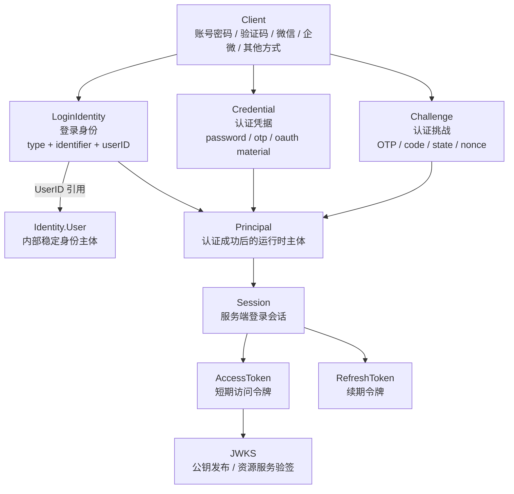

# AuthN 模块总览

> 状态：待补证据 · 第一版正文，待继续按 `internal/apiserver/domain/authn`、`application/authn`、REST/gRPC 契约、Token/JWKS 实现和测试逐项核对。

---

## 1. 本文回答

本文回答 8 个问题：

- AuthN 模块在 IAM 中负责什么？
- AuthN 为什么是“认证中心”，而不是“用户中心”或“权限中心”？
- `LoginIdentity`、`Credential`、`Challenge` 分别表达什么认证事实？
- `Principal`、`Session`、`AccessToken`、`RefreshToken`、`JWKS` 分别处在哪个环节？
- AuthN 如何通过 `UserID` 引用 Identity 的 `User`？
- AuthN 与 Identity、AuthZ、IDP、Suggest 的边界在哪里？
- AuthN 当前有哪些关键链路？
- 阅读 AuthN 代码和后续文档应该从哪里进入？

本文是 AuthN 模块入口，只做总览。后续细节应拆到领域模型、登录链路、Token/JWKS、Session 生命周期、模块边界和代码索引文档中。

---

## 2. 30 秒结论

AuthN 是 IAM 的**认证中心**。

它只回答一个核心问题：

```text
当前请求者如何证明自己是谁？
认证成功后，系统如何表达这个认证结果？
认证结果如何转化为 Session、AccessToken、RefreshToken 和 JWKS 可验证能力？
```

AuthN 维护和产生的核心对象可以概括为：

```text
LoginIdentity / Credential / Challenge
  -> Principal
  -> Session
  -> AccessToken / RefreshToken
  -> JWKS
```

AuthN 不负责：

```text
User / Profile / ProfileLink 写模型；
Role / Permission / RoleBinding / Check；
外部 provider 应用配置和 AppToken 生命周期；
Profile 联想搜索索引；
业务资源访问判定。
```

如果只记一句话：

> AuthN 证明“当前请求者是谁”，Identity 维护“这个人是谁”，AuthZ 判断“这个人能做什么”。

---

## 3. 模块定位

AuthN 是认证域，负责把不同认证方式统一收敛成 IAM 内部可识别的认证结果。

它回答：

| 问题 | AuthN 的回答 |
| --- | --- |
| 用户用什么方式登录？ | `LoginIdentity` |
| 用户如何证明自己控制这个登录身份？ | `Credential` / `Challenge` |
| 认证成功后当前请求者是谁？ | `Principal` |
| 认证结果如何维持一段时间？ | `Session` |
| API 请求如何携带认证结果？ | `AccessToken` |
| 登录态如何续期？ | `RefreshToken` |
| 其他服务如何验签 Token？ | `JWKS` |

AuthN 是登录与认证中心，不是身份档案中心，也不是权限中心。

---

## 4. AuthN 认证主线图



读图规则：

```text
LoginIdentity 指向 UserID，但不是 User；
Credential 用于证明 LoginIdentity，不是 LoginIdentity 本身；
Challenge 是一次性或短期认证挑战，不是登录态；
Principal 是认证成功后的运行时主体，不是 User 实体；
Session 是认证结果的服务端状态，不是 User 状态；
AccessToken 是短期访问凭证，不等于 IDP AppToken；
JWKS 只暴露公钥，不暴露私钥。
```

---

## 5. 核心对象

### 5.1 LoginIdentity

`LoginIdentity` 是登录身份。

它用于回答：

```text
用户通过哪一种登录方式进入系统？
这个登录方式的外部或内部标识是什么？
这个登录身份最终绑定到哪个 IAM User？
```

典型类型可以包括：

```text
password / phone_otp / wx_minip / wecom / operation 等，具体以代码为准。
```

关键边界：

```text
LoginIdentity 不是 User；
LoginIdentity 通过 UserID 引用 Identity.User；
一个 User 可以有多个 LoginIdentity；
一个 LoginIdentity 不应该同时绑定多个 User；
LoginIdentity 不直接表达权限。
```

---

### 5.2 Credential

`Credential` 是认证凭据或认证材料。

它用于回答：

```text
请求者如何证明自己控制某个 LoginIdentity？
```

典型凭据可以包括：

```text
password hash；
phone otp material；
oauth / idp 绑定材料；
operator credential；
其他认证材料。
```

关键边界：

```text
Credential 不是 LoginIdentity；
Credential 不等于明文密码；
Credential 不应该泄露到 transport response；
Credential 不表达 User/Profile 关系；
Credential 不表达访问权限。
```

---

### 5.3 Challenge

`Challenge` 是认证挑战。

它用于回答：

```text
一次登录证明过程如何发起、校验和过期？
```

典型挑战可以包括：

```text
短信验证码；
邮箱验证码；
OAuth state / nonce；
二维码登录 ticket；
临时 code。
```

关键边界：

```text
Challenge 是短期认证过程，不是长期登录态；
Challenge 成功后通常会产生 Principal / Session / Token；
Challenge 不等于 Credential；
Challenge 不等于 RefreshToken。
```

---

### 5.4 Principal

`Principal` 是认证成功后的运行时主体表达。

它用于回答：

```text
当前请求者是谁？
这次认证结果对应哪个 UserID？
这次认证使用了什么认证方式或上下文？
```

关键边界：

```text
Principal 不是 User；
Principal 可以携带 UserID；
Principal 是运行时认证上下文；
Principal 不应该替代 Identity.User；
Principal 不决定最终资源访问权。
```

---

### 5.5 Session

`Session` 是认证结果的服务端会话状态。

它用于回答：

```text
某个认证结果是否仍然有效？
它什么时候创建、过期、撤销？
RefreshToken 是否仍能续期？
```

关键边界：

```text
Session 不是 User 状态；
User blocked 可以触发 Session 撤销，但二者不是同一个模型；
Session 不表达权限；
Session 生命周期属于 AuthN。
```

---

### 5.6 AccessToken / RefreshToken

`AccessToken` 是短期访问令牌。

它用于：

```text
让客户端在 API 请求中携带认证结果；
让服务端或资源服务从 token 中解析认证主体；
在较短 TTL 内减少频繁登录。
```

`RefreshToken` 是续期令牌。

它用于：

```text
在 AccessToken 过期后换取新的 AccessToken；
维持较长登录态；
支持撤销、轮换、黑名单或 session 绑定。
```

关键边界：

```text
AccessToken 不等于 RefreshToken；
IAM AccessToken 不等于 IDP AppToken；
Token 携带认证结果，不等于授权通过；
Token 验签成功不等于 AuthZ Check 通过。
```

---

### 5.7 JWKS

`JWKS` 是 JSON Web Key Set，用于暴露公钥，让资源服务或内部服务验证 JWT 签名。

它用于回答：

```text
其他服务如何验证 IAM 签发的 AccessToken？
当前有哪些可用公钥？
Token header 中的 kid 对应哪把 key？
```

关键边界：

```text
JWKS 只暴露 public key；
private key 不应出现在响应、日志或文档示例中；
JWKS 可用不代表授权通过；
key rotation 需要兼容旧 token 验签窗口。
```

---

## 6. 关键链路

### 6.1 注册 / 绑定登录身份

该链路回答：

```text
如何把某种登录方式绑定到一个 IAM User？
LoginIdentity 如何指向 Identity.User？
Credential 如何与 LoginIdentity 建立关系？
```

主线：

```text
transport
  -> application/authn/register-or-bind
  -> Identity 查询或创建 User
  -> LoginIdentityRepository
  -> CredentialRepository
  -> commit
```

边界：

```text
创建 User 属于 Identity；
创建 LoginIdentity / Credential 属于 AuthN；
AuthN 不应直接写 Identity repository concrete；
IDP 只提供 ExternalIdentity，不直接创建 User。
```

---

### 6.2 登录认证

该链路回答：

```text
请求者如何证明自己控制某个 LoginIdentity？
认证成功后如何得到 Principal？
```

主线：

```text
transport
  -> application/authn/login
  -> locate LoginIdentity
  -> verify Credential or Challenge
  -> build Principal
```

边界：

```text
密码、验证码、OAuth code 校验属于 AuthN；
外部 provider token/code 解析可以调用 IDP；
User 状态可以作为认证前置条件；
权限判断不在登录链路中完成。
```

---

### 6.3 创建 Session 与签发 Token

该链路回答：

```text
认证成功后如何维持登录态？
AccessToken / RefreshToken 如何生成、过期和撤销？
```

主线：

```text
Principal
  -> Session
  -> AccessToken
  -> RefreshToken
  -> token response
```

边界：

```text
Session 属于 AuthN；
Token 签发属于 AuthN；
Token payload 可以携带 UserID/Principal 信息；
Token 不携带完整 User/Profile/ProfileLink 写模型；
Token 验签成功不等于资源授权通过。
```

---

### 6.4 Token 验证 / Auth Middleware

该链路回答：

```text
收到 Bearer Token 后如何识别请求者？
如何把 token 转换为 Principal？
```

主线：

```text
Authorization: Bearer <access_token>
  -> token verifier
  -> signature / exp / issuer / audience / session status
  -> Principal
  -> request context
```

边界：

```text
Auth middleware 只建立认证上下文；
认证成功只说明“请求者是谁”；
是否允许访问具体资源仍由 AuthZ Check 完成。
```

---

### 6.5 Refresh / Logout / Revoke

该链路回答：

```text
AccessToken 过期后如何续期？
用户退出或被封禁后如何撤销登录态？
```

主线：

```text
RefreshToken
  -> validate session / token status
  -> rotate or issue new AccessToken
  -> optional new RefreshToken
```

退出或撤销：

```text
logout / revoke
  -> revoke session or refresh token
  -> blacklist access token if needed
  -> subsequent verification fails or session invalid
```

边界：

```text
Logout 不删除 User；
Revoke Session 不删除 LoginIdentity；
User blocked 可以触发 Session revoke；
Session revoke 不等于删除 ProfileLink。
```

---

## 7. 与其他模块的边界

### 7.1 AuthN 与 Identity

AuthN 通过 `UserID` 引用 Identity 的 `User`。

| AuthN | Identity |
| --- | --- |
| LoginIdentity | User |
| Credential | Profile |
| Principal | ProfileLink |
| Session / Token | 身份事实和关系 |

关键边界：

```text
LoginIdentity 不是 User；
Principal 不是 User；
Session 不是 User 状态；
AuthN 不拥有 User/Profile/ProfileLink 写模型；
Identity 不拥有 Credential/Session/Token 写模型。
```

允许协作：

```text
AuthN 注册/绑定流程通过 Identity service 创建或查找 User；
AuthN 登录时查询 User 状态；
Identity 在 User 被封禁时通过受控 port 触发 Session 撤销。
```

---

### 7.2 AuthN 与 AuthZ

AuthN 证明“是谁”，AuthZ 判断“能不能做”。

```text
AuthN -> Principal
AuthZ -> AuthorizationDecision
```

关键边界：

```text
Token 验签成功不等于授权通过；
Principal 不是 Subject；
Subject 可以由 Principal 映射而来；
AuthN 不维护 Role / Permission / RoleBinding；
AuthZ 不校验密码、验证码或 OAuth code。
```

---

### 7.3 AuthN 与 IDP

IDP 提供外部身份来源，AuthN 消费外部身份声明。

典型链路：

```text
provider code / ticket
  -> IDP 解析 ExternalIdentity
  -> AuthN 绑定或匹配 LoginIdentity
  -> AuthN 生成 Principal / Session / Token
```

关键边界：

```text
ExternalIdentity 不是 LoginIdentity；
ExternalIdentity 不是 User；
IDP AppToken 不是 IAM AccessToken；
IDP 不签发 IAM Token；
AuthN 不应该保存 provider app secret。
```

---

### 7.4 AuthN 与 Suggest

AuthN 通常不直接参与 Suggest 索引。

协作边界：

```text
AuthN 提供当前请求 Principal；
Suggest 可以从请求上下文读取 Principal/UserID；
Suggest 仍需结合 ProfileAccessScope/AuthZ 判断可见范围；
AuthN 不维护 ProfileSearchTerm / Snapshot；
Suggest 不签发 Token。
```

---

## 8. 分层架构入口

AuthN 模块应遵循 IAM 通用分层：

```text
transport/rest + transport/grpc
  -> application/authn
  -> domain/authn
  -> infra/repository + token runtime + session store
  -> container/authn
  -> api/rest + api/grpc + pkg/sdk
```

各层职责：

| 层 | 职责 |
| --- | --- |
| domain | 定义 LoginIdentity、Credential、Challenge、Principal、Session、Token 相关领域规则 |
| application | 编排注册、登录、refresh、logout、verify、revoke 等用例 |
| infra | 实现 repository、password hasher、OTP store、session store、JWT signer/verifier、JWKS provider |
| transport | 适配 REST/gRPC 请求和响应，注入认证上下文 |
| container | 装配 AuthN 依赖、策略、token runtime、handler/service |
| contract | 约束 REST/gRPC/SDK 对外接入语义 |

---

## 9. 推荐阅读路径

### 9.1 新读者

```text
00-模块总览.md
  -> 01-领域模型-LoginIdentity-Credential-Challenge.md
  -> 02-认证主链路-Login-Principal-Session.md
```

目标：先理解 AuthN 证明“是谁”的主线。

---

### 9.2 准备修改登录方式

```text
01-领域模型-LoginIdentity-Credential-Challenge.md
  -> 02-认证主链路-Login-Principal-Session.md
  -> 06-模块边界-AuthN与Identity-IDP-AuthZ.md
  -> 07-分层架构与代码索引.md
```

目标：明确新增登录方式时应该改 LoginIdentity、Credential、Challenge、IDP 还是 application 策略。

---

### 9.3 准备修改 Token / JWKS

```text
03-Token模型-AccessToken-RefreshToken-JWKS.md
  -> 04-Session生命周期与撤销.md
  -> 07-分层架构与代码索引.md
```

目标：理解 AccessToken、RefreshToken、Session、JWKS、key rotation 和 revoke 关系。

---

### 9.4 准备排查认证与授权混淆

```text
06-模块边界-AuthN与Identity-IDP-AuthZ.md
  -> ../03-AuthZ/00-模块总览.md
  -> ../../04-架构护栏/01-分层依赖边界.md
```

目标：确认 AuthN 是否只做认证，不做授权判定。

---

## 10. 常见反模式

| 反模式 | 问题 | 推荐做法 |
| --- | --- | --- |
| LoginIdentity 当 User | 登录身份和内部身份主体混淆 | LoginIdentity 通过 UserID 引用 User |
| Principal 当 User 持久化 | 运行时认证上下文污染身份事实 | Principal 只作为认证结果表达 |
| Token 验签后直接放行资源 | 认证和授权混淆 | Token 验签后仍需 AuthZ Check |
| Credential 存明文密码 | 安全风险 | 存 hash 或受控材料，不返回响应 |
| RefreshToken 当 AccessToken 用 | 令牌职责混淆 | Access 短期访问，Refresh 续期 |
| IDP AppToken 当 IAM AccessToken | 外部平台凭证和 IAM 凭证混淆 | IDP AppToken 只用于调用外部 provider |
| AuthN 直接写 User repository | 绕过 Identity 写模型 | 通过 Identity application/port 协作 |
| AuthN 写 RoleBinding | AuthN 吞并 AuthZ | 授权归 AuthZ |
| JWKS 暴露 private key | 严重安全风险 | JWKS 只暴露 public key |
| Session 状态等同 User 状态 | 登录态和用户主体状态混淆 | User 状态归 Identity，Session 归 AuthN |

---

## 11. 事实源

本文是 AuthN 总览，不是机器契约。

当本文与代码、契约、测试冲突时，按以下优先级判断：

1. 源码与运行时行为。
2. 机器可读契约与配置：OpenAPI、proto、配置、迁移。
3. 测试：领域测试、应用测试、契约测试、架构测试、SDK compile test。
4. 现行维护中的 `docs/`。
5. `_archive/` 历史材料。

当前主要事实源：

| 事实 | 路径 |
| --- | --- |
| AuthN domain | `../../../internal/apiserver/domain/authn` |
| LoginIdentity 模型 | `../../../internal/apiserver/domain/authn` |
| Credential 模型 | `../../../internal/apiserver/domain/authn` |
| Challenge 模型 | `../../../internal/apiserver/domain/authn` |
| Principal 模型 | `../../../internal/apiserver/domain/authn/authentication/principal.go` |
| Session / Token 模型 | `../../../internal/apiserver/domain/authn` |
| AuthN application | `../../../internal/apiserver/application/authn` |
| Token/JWKS application 或 runtime | `../../../internal/apiserver/application/authn/token` |
| AuthN infra | `../../../internal/apiserver/infra` |
| AuthN REST transport | `../../../internal/apiserver/transport/rest` |
| AuthN gRPC transport | `../../../internal/apiserver/transport/grpc` |
| AuthN container | `../../../internal/apiserver/container/authn` |
| REST 契约 | `../../../api/rest` |
| gRPC 契约 | `../../../api/grpc` |
| 架构测试 | `../../../internal/pkg/architecture` |

注意：上表中的具体路径需要继续与当前源码核对。如果源码目录已调整，应以代码为准。

---

## 12. Verify

修改本文后至少执行：

```bash
make docs-hygiene
```

涉及 AuthN 领域模型：

```bash
go test ./internal/apiserver/domain/authn/...
```

涉及 AuthN 应用用例：

```bash
go test ./internal/apiserver/application/authn/...
```

涉及 Token / JWKS：

```bash
go test ./internal/apiserver/application/authn/token/...
go test ./internal/apiserver/infra/...
```

具体路径以当前代码为准。

涉及 REST/gRPC 契约或 transport：

```bash
make api-validate
make proto-gen
go test ./internal/apiserver/transport/rest/...
go test ./internal/apiserver/transport/grpc/...
```

涉及 SDK：

```bash
go test ./pkg/sdk/...
```

涉及分层依赖或模块边界：

```bash
go test ./internal/pkg/architecture
```

---

## 13. 本文总结

AuthN 模块的主线是：

```text
LoginIdentity / Credential / Challenge
  -> Principal
  -> Session
  -> AccessToken / RefreshToken
  -> JWKS
```

AuthN 的核心职责是：

```text
识别登录身份；
验证认证凭据或认证挑战；
生成认证成功后的 Principal；
创建和维护 Session；
签发、验证、刷新和撤销 Token；
通过 JWKS 暴露公钥验证能力。
```

AuthN 的核心边界是：

```text
不维护 User/Profile/ProfileLink 写模型；
不做 Role/Permission/RoleBinding/Check；
不拥有 IDP provider 配置和 AppToken；
不维护 Suggest 索引；
不把 Token 验签成功写成授权通过。
```

读完本文后，应继续编写并阅读 AuthN 的领域模型文档，把 `LoginIdentity`、`Credential`、`Challenge`、`Principal`、`Session`、`Token`、`JWKS` 的模型和生命周期讲清楚。
