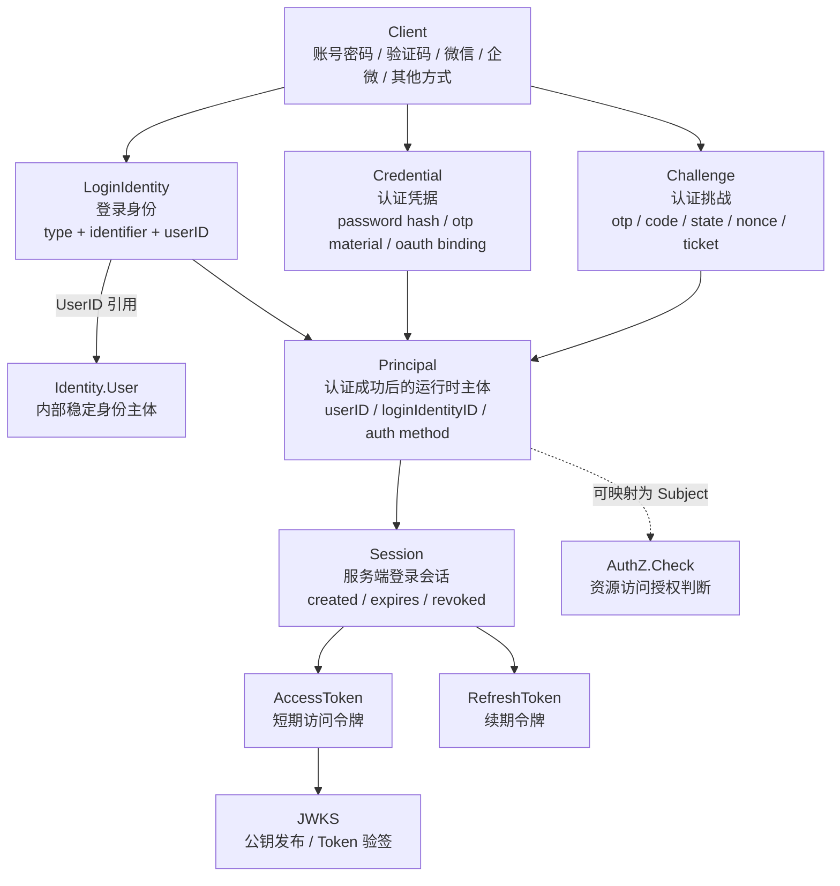
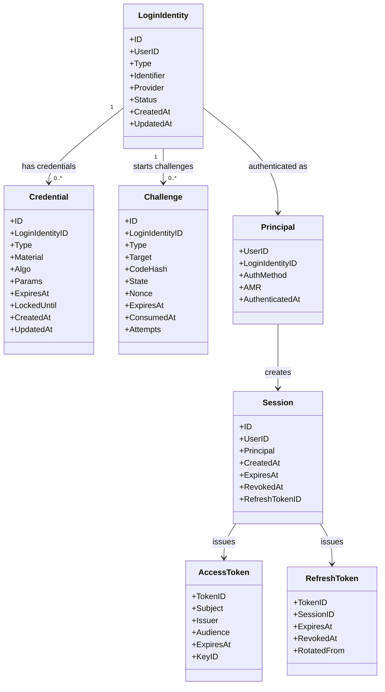
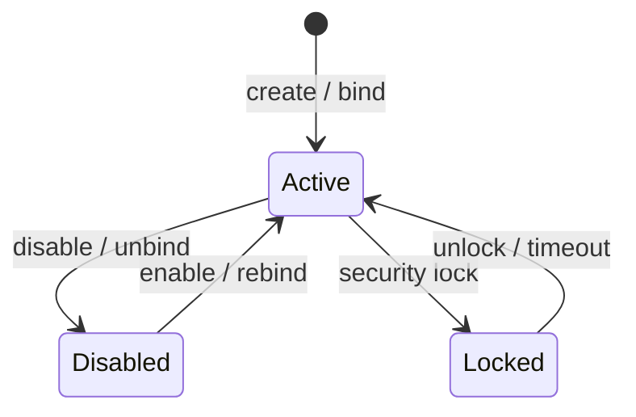
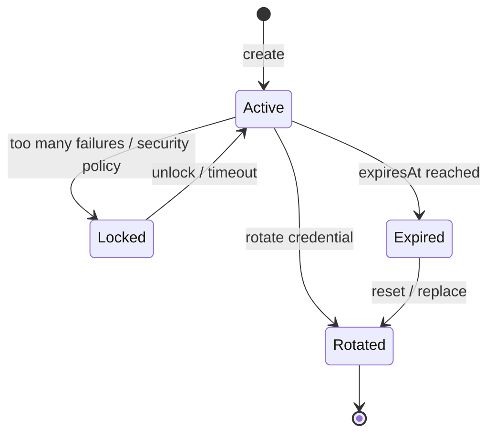
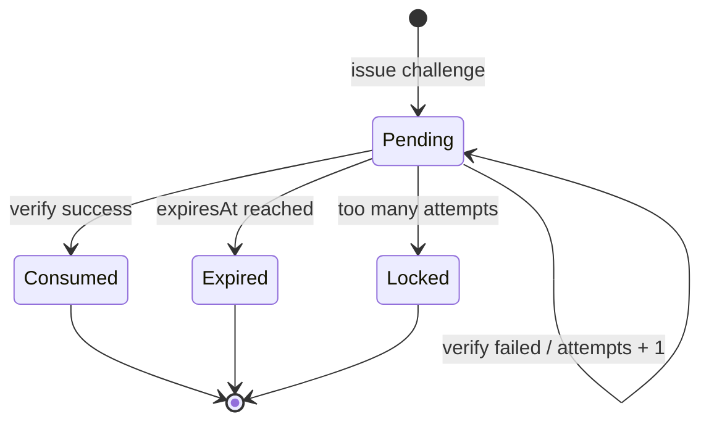
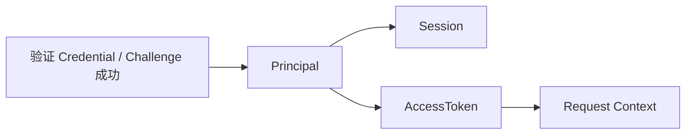
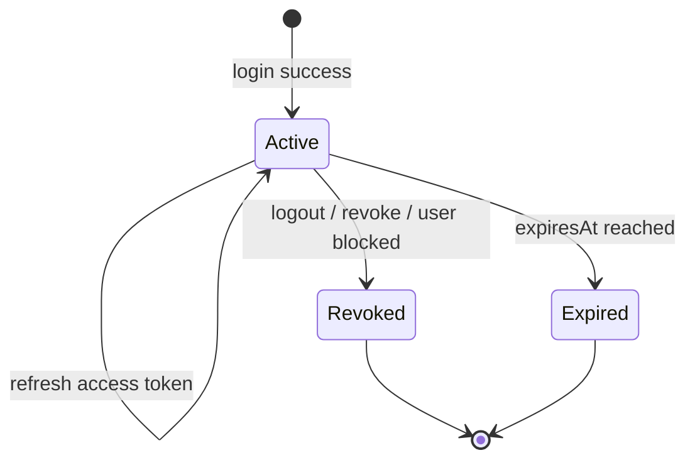
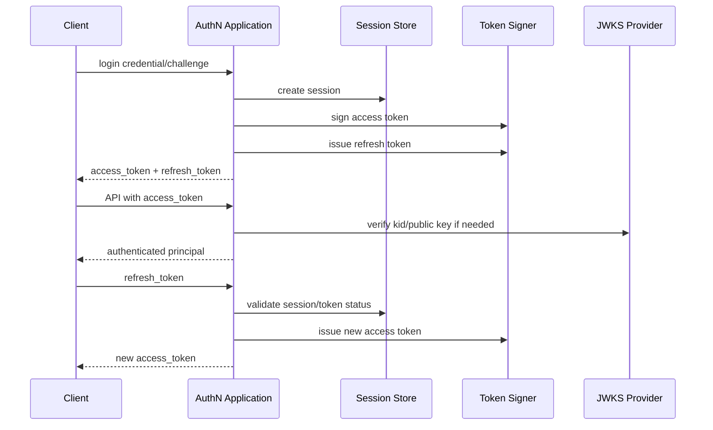
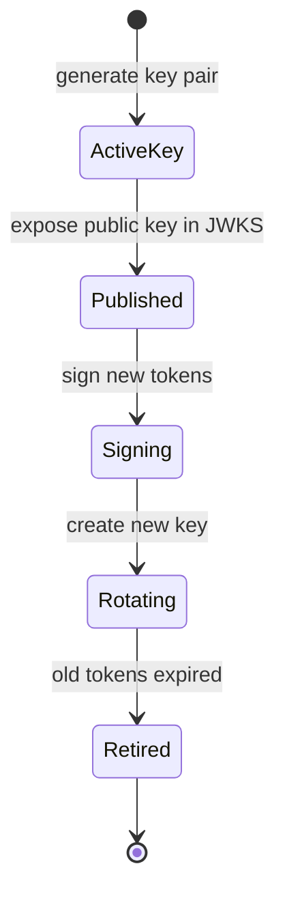
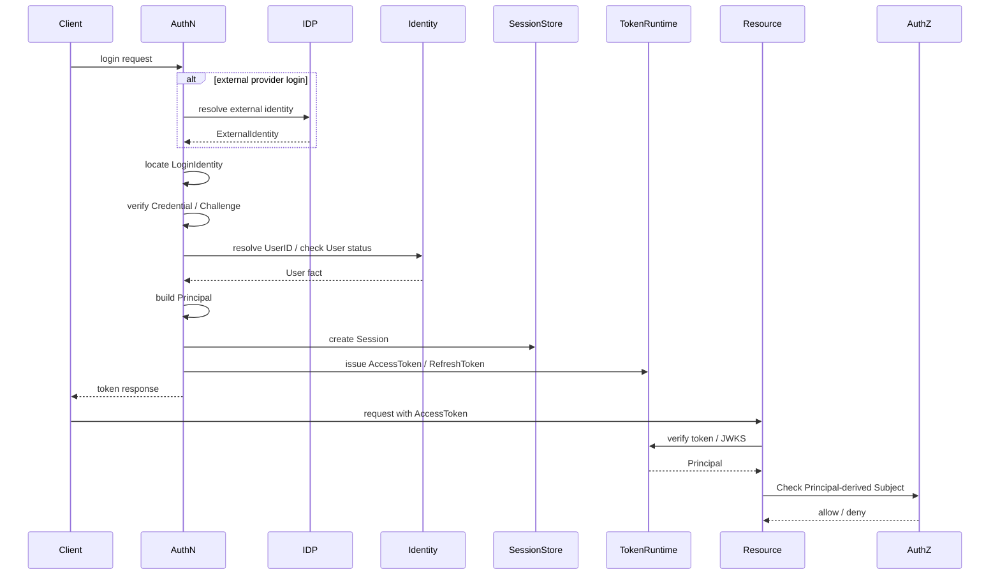

# 领域模型：LoginIdentity / Credential / Challenge / Principal / Session / Token

> 状态：规划改造 · 已完成当前事实盘点；正文仍含待实现或尚未收敛的设计内容，不得作为现有能力承诺。
> 本文合并原“领域模型 / 领域模型图 / 核心对象生命周期”三类内容，作为 AuthN 模型主文档维护。

---

## 1. 本文回答

本文回答 9 个问题：

- AuthN 领域模型由哪些核心对象组成？
- `LoginIdentity`、`Credential`、`Challenge` 分别表达什么认证事实？
- `Principal`、`Session`、`AccessToken`、`RefreshToken` 分别处在哪个认证阶段？
- `JWKS` 在 Token 验证链路中负责什么？
- 为什么 `LoginIdentity` 不是 `User`，`Credential` 不是 `LoginIdentity`？
- 为什么 `Challenge` 不是 `Credential`，`Principal` 不是 `JWT`？
- 为什么 `Session` 不是 `User` 状态，`AccessToken` 不等于授权通过？
- AuthN 核心对象的生命周期如何流转？
- 修改 AuthN 模型时应该核对哪些代码和测试？

本文是 AuthN 模型主文档，集中说明模型定义、模型图、状态流转、生命周期和边界。模块总览见 [00-模块总览.md](00-模块总览.md)。

---

## 2. 30 秒结论

AuthN 的领域模型可以压缩成一条认证主线：

```text
LoginIdentity / Credential / Challenge
  -> Principal
  -> Session
  -> AccessToken / RefreshToken
  -> JWKS
```

每个对象回答的问题不同：

| 对象 | 一句话 | 领域含义 | 不是什么 |
| --- | --- | --- | --- |
| `LoginIdentity` | 登录身份 | 用户通过哪种方式登录，以及该登录身份绑定哪个 UserID | 不是 `User` |
| `Credential` | 认证凭据 | 请求者如何证明自己控制某个登录身份 | 不是明文密码，也不是登录身份本身 |
| `Challenge` | 认证挑战 | 一次短期认证过程如何发起、校验和过期 | 不是长期凭据，也不是登录态 |
| `Principal` | 认证结果 | 认证成功后当前请求者是谁 | 不是 `User`，也不是 JWT |
| `Session` | 服务端登录态 | 某个认证结果是否仍然有效 | 不是 User 状态，也不是权限 |
| `AccessToken` | 短期访问令牌 | API 请求如何携带认证结果 | 不等于授权通过 |
| `RefreshToken` | 续期令牌 | AccessToken 过期后如何续期 | 不是 AccessToken |
| `JWKS` | 公钥集合 | 其他服务如何验签 IAM Token | 不暴露私钥，不表达授权 |

如果只记一句话：

> AuthN 证明“当前请求者是谁”，并把认证结果转化为 Principal、Session 和 Token；它不维护 User/Profile，也不做资源授权判定。

---

## 3. 为什么 AuthN 需要这些模型

认证不是一个“登录接口”就能完整表达。

AuthN 至少要拆开 4 类事实：

```text
登录身份：用户以什么标识登录？
证明材料：用户如何证明自己控制这个标识？
认证结果：证明成功后当前请求者是谁？
登录态与令牌：认证结果如何在后续请求中持续可验证？
```

因此 AuthN 拆出以下对象：

```text
LoginIdentity：登录身份；
Credential：长期或可验证认证材料；
Challenge：短期认证挑战；
Principal：认证成功后的运行时主体；
Session：服务端登录会话；
AccessToken / RefreshToken：客户端携带的认证凭证；
JWKS：Token 验签所需公钥集合。
```

这种拆分可以避免几个常见错误：

```text
把 User 当登录账号；
把 openid 当凭据；
把验证码当长期 Credential；
把 Principal 当持久身份；
把 JWT 当完整会话状态；
把 Token 验签成功当成授权通过；
把 IDP AppToken 当 IAM AccessToken。
```

---

## 4. 认证主线总图



读图规则：

```text
LoginIdentity 指向 UserID，但不是 User；
Credential 用于证明 LoginIdentity，不是 LoginIdentity 本身；
Challenge 是短期认证过程，不是登录态；
Principal 是认证成功后的运行时主体，不是 User 实体；
Session 是认证结果的服务端状态，不是 User 状态；
AccessToken 是短期访问凭证，不等于 IDP AppToken；
JWKS 只暴露公钥，不暴露私钥；
AuthZ.Check 在认证之后执行，不属于 AuthN 模型。
```

---

## 5. 类图：核心对象与关系



注意：

```text
上图是领域语义图，不等于数据库物理表结构；
字段名称和数量以当前源码、迁移和契约为准；
本文只把当前源码、迁移或契约能够证明的字段写成实现事实；未来字段必须单独标记为规划改造。
```

---

## 6. LoginIdentity

### 6.1 定位

`LoginIdentity` 是登录身份。

它用于回答：

```text
用户通过哪一种登录方式进入系统？
这个登录方式的内部或外部标识是什么？
这个登录身份最终绑定到哪个 IAM User？
```

典型登录身份可以包括：

```text
username；
phone；
wechat openid；
wechat unionid；
wecom userid；
operation account；
其他 provider identifier。
```

具体类型以代码为准。

---

### 6.2 核心字段

| 字段 | 含义 | 说明 |
| --- | --- | --- |
| `ID` | LoginIdentity 标识 | AuthN 内部登录身份 ID |
| `UserID` | Identity.User 引用 | 指向 IAM 内部稳定身份主体 |
| `Type` | 登录身份类型 | password / phone / wx_minip / wecom 等 |
| `Identifier` | 登录标识 | username、phone、openid、userid 等 |
| `Provider` | 外部 provider | 微信、企微、operation 等 |
| `Status` | 登录身份状态 | 是否可用、禁用或锁定 |

---

### 6.3 生命周期

`LoginIdentity` 的生命周期可以压缩为：

```text
创建 / 绑定 -> 可用于认证 -> 禁用 / 解绑 / 锁定 -> 不再可用于认证
```



注意：

```text
状态图是领域语义图，具体状态枚举以代码为准；
禁用 LoginIdentity 不等于删除 User；
解绑 LoginIdentity 不等于删除 User；
LoginIdentity 锁定不等于 User blocked。
```

---

### 6.4 边界

```text
LoginIdentity 不是 User；
LoginIdentity 通过 UserID 引用 User；
一个 User 可以有多个 LoginIdentity；
一个 LoginIdentity 不应绑定多个 User；
LoginIdentity 不表达权限；
openid / unionid / wecom userid 是登录标识，不是 Credential。
```

---

## 7. Credential

### 7.1 定位

`Credential` 是认证凭据或认证材料。

它用于回答：

```text
请求者如何证明自己控制某个 LoginIdentity？
```

常见 Credential：

```text
password hash；
operator credential；
oauth binding material；
phone credential material；
其他可验证认证材料。
```

具体类型以代码为准。

---

### 7.2 核心字段

| 字段 | 含义 | 说明 |
| --- | --- | --- |
| `ID` | Credential 标识 | AuthN 内部凭据 ID |
| `LoginIdentityID` | 登录身份引用 | 指向某个 LoginIdentity |
| `Type` | 凭据类型 | password / oauth / otp material 等 |
| `Material` | 凭据材料 | 应为 hash、加密材料或外部绑定信息，不应是明文密码 |
| `Algo` | 算法 | password hash 算法等 |
| `Params` | 算法参数 | salt、cost、版本等，具体以实现为准 |
| `ExpiresAt` | 过期时间 | 可选，适用于有过期语义的凭据 |
| `LockedUntil` | 锁定到期时间 | 可选，适用于失败次数过多等安全策略 |

---

### 7.3 生命周期

`Credential` 的生命周期可以压缩为：

```text
创建 -> 可用于验证 -> 轮换 / 过期 / 锁定 -> 失效
```



注意：

```text
状态图是领域语义图，具体状态字段以代码为准；
Credential 失效不等于 User 删除；
Credential 轮换不等于 LoginIdentity 改变；
失败次数、锁定策略、密码 hash 算法应由安全策略和实现共同约束。
```

---

### 7.4 边界

```text
Credential 不是 LoginIdentity；
Credential 不应保存明文密码；
Credential 不应出现在 response 中；
Credential 不表达 User/Profile 关系；
Credential 不表达 Role/Permission；
短信 OTP 更适合作为 Challenge，而不是长期 Credential。
```

---

## 8. Challenge

### 8.1 定位

`Challenge` 是短期认证挑战。

它用于回答：

```text
一次登录证明过程如何发起、校验、过期和消费？
```

典型 Challenge：

```text
短信验证码；
邮箱验证码；
OAuth state / nonce；
二维码登录 ticket；
一次性临时 code。
```

---

### 8.2 核心字段

| 字段 | 含义 | 说明 |
| --- | --- | --- |
| `ID` | Challenge 标识 | AuthN 内部挑战 ID |
| `LoginIdentityID` | 登录身份引用 | 可选，部分挑战在绑定登录身份前产生 |
| `Type` | 挑战类型 | sms_otp / email_otp / oauth_state / qr_ticket 等 |
| `Target` | 发送或验证目标 | 手机号、邮箱、provider session 等 |
| `CodeHash` | 验证码 hash | 不应保存明文验证码 |
| `State` | 状态参数 | OAuth/扫码等场景可能需要 |
| `Nonce` | 防重放随机值 | 用于防重放和绑定认证上下文 |
| `ExpiresAt` | 过期时间 | Challenge 必须短期有效 |
| `ConsumedAt` | 消费时间 | 防止重复使用 |
| `Attempts` | 尝试次数 | 用于限制暴力猜测 |

---

### 8.3 生命周期

`Challenge` 的生命周期可以压缩为：

```text
创建 -> 待验证 -> 成功消费 / 失败重试 / 过期 -> 不可再用
```



关键规则：

```text
Challenge 应短期有效；
Challenge 成功后应消费，防止重放；
Challenge 失败次数应受限；
Challenge 不应保存明文验证码；
Challenge 不等于 Session；
Challenge 不等于 RefreshToken。
```

---

## 9. Principal

### 9.1 定位

`Principal` 是认证成功后的运行时主体表达。

它用于回答：

```text
当前请求者是谁？
对应哪个 UserID？
由哪个 LoginIdentity 认证而来？
这次认证使用了什么认证方式？
```

---

### 9.2 核心字段

| 字段 | 含义 | 说明 |
| --- | --- | --- |
| `UserID` | Identity.User 引用 | 认证结果最终归属的 User |
| `LoginIdentityID` | 登录身份引用 | 本次认证使用的登录身份 |
| `AuthMethod` | 认证方式 | password / otp / oauth 等 |
| `AMR` | Authentication Methods References | 可选，表达认证强度或方法组合 |
| `AuthenticatedAt` | 认证时间 | 本次认证成功时间 |

具体字段以 `internal/apiserver/domain/authn/authentication/principal.go` 为准。

---

### 9.3 生命周期

`Principal` 通常不是长期持久实体，而是认证成功后在运行时产生。

生命周期：

```text
认证成功 -> 构造 Principal -> 写入 Session/Token/Request Context -> 请求结束或登录态失效
```



边界：

```text
Principal 不是 User；
Principal 不是 JWT；
Principal 不是 Subject；
Principal 可以映射为 AuthZ Subject；
Principal 不决定最终资源访问权。
```

---

## 10. Session

### 10.1 定位

`Session` 是服务端认证上下文或登录会话。

它用于回答：

```text
某次认证成功后的登录态是否仍然有效？
它什么时候创建、过期、撤销？
RefreshToken 是否还可以续期？
```

---

### 10.2 核心字段

| 字段 | 含义 | 说明 |
| --- | --- | --- |
| `ID` | Session 标识 | 服务端登录态 ID |
| `UserID` | User 引用 | 当前 Session 属于哪个 User |
| `Principal` | 认证结果摘要 | 创建 Session 的认证上下文 |
| `CreatedAt` | 创建时间 | Session 创建时间 |
| `ExpiresAt` | 过期时间 | Session 有效期 |
| `RevokedAt` | 撤销时间 | nil 表示未撤销 |
| `RefreshTokenID` | RefreshToken 引用 | 可选，具体以实现为准 |

具体字段以当前 domain / application / infra 实现为准。

---

### 10.3 生命周期

Session 生命周期可以压缩为：

```text
创建 -> active -> refresh / rotate -> revoke / expire -> invalid
```



关键规则：

```text
Session 属于 AuthN；
Session 不是 User 状态；
User blocked 可以触发 Session revoke；
Session revoke 不删除 User；
Session revoke 不删除 LoginIdentity；
Session revoke 不删除 ProfileLink。
```

---

## 11. AccessToken / RefreshToken

### 11.1 AccessToken 定位

`AccessToken` 是短期访问令牌。

它用于：

```text
让客户端在 API 请求中携带认证结果；
让服务端从 token 中恢复 Principal 或主体引用；
让资源服务通过 JWKS 验证签名。
```

AccessToken 通常包含：

```text
issuer；
subject；
audience；
expiresAt；
issuedAt；
keyID；
sessionID 或 tokenID；
认证方法摘要。
```

具体 claim 以 Token 实现和契约为准。

---

### 11.2 RefreshToken 定位

`RefreshToken` 是续期令牌。

它用于：

```text
在 AccessToken 过期后换取新的 AccessToken；
维持较长登录态；
支持撤销、轮换、绑定 Session 和风险控制。
```

RefreshToken 通常应具备：

```text
更长 TTL；
服务端可撤销状态；
与 Session 绑定；
轮换或重放检测策略；
泄露后可失效。
```

---

### 11.3 Token 生命周期



边界：

```text
AccessToken 不等于 RefreshToken；
RefreshToken 不应该当 Bearer AccessToken 使用；
IAM AccessToken 不等于 IDP AppToken；
Token 验签成功只说明认证成立；
是否允许访问资源仍由 AuthZ Check 判定。
```

---

## 12. JWKS

### 12.1 定位

`JWKS` 是 JSON Web Key Set，用于暴露 IAM Token 验签所需公钥。

它用于回答：

```text
资源服务如何验证 IAM 签发的 JWT？
Token header 中的 kid 对应哪把公钥？
Key rotation 期间如何兼容旧 token？
```

---

### 12.2 生命周期

JWKS 与 key lifecycle 相关：

```text
生成 key pair -> 发布 public key -> 使用 private key 签发 token -> rotation -> 保留旧 public key 直到旧 token 过期 -> 下线旧 key
```



边界：

```text
JWKS 只暴露 public key；
private key 不应出现在响应、日志或文档示例中；
JWKS 可用不代表授权通过；
key rotation 需要兼容旧 token 验签窗口。
```

---

## 13. 认证链路生命周期总图



这张图表达：

```text
IDP 只解决外部身份来源；
Identity 只提供 User 事实；
AuthN 生成 Principal / Session / Token；
AuthZ 决定资源访问是否允许。
```

---

## 14. 核心不变量汇总

| 不变量 | 所属对象 | 说明 |
| --- | --- | --- |
| LoginIdentity 必须绑定一个 UserID | LoginIdentity | 登录身份最终归属 Identity.User |
| LoginIdentity 的 provider identifier 应唯一 | LoginIdentity | 同一 provider 标识不应绑定多个 User，具体唯一范围以代码为准 |
| Credential 不保存明文密码 | Credential | 只能保存 hash、加密材料或受控认证材料 |
| Credential 不应出现在 response | Credential | 防止泄露认证材料 |
| Challenge 必须短期有效 | Challenge | 过期后不可再验证 |
| Challenge 成功后应消费 | Challenge | 防止重放 |
| Principal 不是持久 User | Principal | 只是认证成功后的运行时主体 |
| Session 可撤销 | Session | logout、user blocked、refresh token 风险等可导致撤销 |
| AccessToken 短期有效 | AccessToken | 过期后需要 refresh 或重新登录 |
| RefreshToken 可撤销 / 可轮换 | RefreshToken | 支持退出、风控和重放检测 |
| JWKS 不暴露私钥 | JWKS | 只暴露 public key |
| Token 验签成功不等于授权通过 | Token/AuthZ | 资源访问仍需 AuthZ Check |

---

## 15. 失败边界

| 场景 | 期望行为 | 说明 |
| --- | --- | --- |
| LoginIdentity 不存在 | 登录失败 | 不应泄露过多账户枚举信息 |
| Credential 不匹配 | 登录失败 | 应记录失败次数或触发锁定策略 |
| Challenge 过期 | 登录失败 | 需要重新发起挑战 |
| Challenge 已消费 | 登录失败 | 防止重放 |
| User inactive / blocked | 登录失败或撤销 Session | User 状态来自 Identity |
| Session 已撤销 | Refresh / Verify 失败 | 不应继续签发新 AccessToken |
| AccessToken 过期 | Verify 失败 | 客户端应 refresh |
| RefreshToken 过期或撤销 | Refresh 失败 | 需要重新登录 |
| JWT kid 不存在 | Verify 失败 | 可能是 key rotation 或伪造 token |
| JWKS 不可用 | 资源服务验签失败或降级 | 具体策略以运行时设计为准 |

---

## 16. 与其他模块的边界

### 16.1 与 Identity

```text
AuthN 通过 UserID 引用 User；
AuthN 不拥有 User/Profile/ProfileLink 写模型；
Identity 不拥有 Credential/Session/Token 写模型；
User blocked 可以通过受控 port 触发 Session revoke。
```

### 16.2 与 AuthZ

```text
AuthN 证明“是谁”；
AuthZ 判断“能不能做”；
Principal 可以映射为 Subject；
Token 验签成功不等于授权通过。
```

### 16.3 与 IDP

```text
IDP 提供 ExternalIdentity；
AuthN 消费 ExternalIdentity 并绑定 LoginIdentity；
IDP AppToken 不是 IAM AccessToken；
IDP 不签发 IAM Token。
```

### 16.4 与 Suggest

```text
AuthN 提供当前请求 Principal；
Suggest 可以读取 Principal/UserID 作为查询上下文；
Suggest 仍需结合 ProfileAccessScope/AuthZ 判断可见范围；
AuthN 不维护 Suggest Index。
```

---

## 17. 常见反模式

| 反模式 | 问题 | 推荐做法 |
| --- | --- | --- |
| LoginIdentity 当 User | 登录身份和内部身份主体混淆 | LoginIdentity 通过 UserID 引用 User |
| Credential 保存明文密码 | 严重安全风险 | 只保存 hash 或受控材料 |
| openid 当 Credential | 外部登录标识和凭据混淆 | openid 更接近 LoginIdentity identifier |
| SMS OTP 当长期 Credential | 短期挑战和长期凭据混淆 | OTP 属于 Challenge |
| Principal 当 JWT | 认证结果和令牌载体混淆 | Principal 可以被写入 token，但不是 token 本身 |
| Principal 当 User | 运行时认证上下文污染身份事实 | User 属于 Identity |
| Session 当 User 状态 | 登录态和用户主体状态混淆 | Session 属于 AuthN，User 状态属于 Identity |
| RefreshToken 当 AccessToken 用 | 令牌职责混淆 | Access 用于访问，Refresh 用于续期 |
| IDP AppToken 当 IAM AccessToken | 外部平台凭证和 IAM 凭证混淆 | IDP AppToken 只用于调用 provider |
| Token 验签后直接放行资源 | 认证和授权混淆 | 验签后仍需 AuthZ Check |
| JWKS 暴露 private key | 严重安全风险 | JWKS 只暴露 public key |

---

## 18. 代码事实源

| 事实 | 路径 |
| --- | --- |
| AuthN domain | `../../../internal/apiserver/domain/authn` |
| Principal 模型 | `../../../internal/apiserver/domain/authn/authentication/principal.go` |
| LoginIdentity / Credential / Challenge 模型 | `../../../internal/apiserver/domain/authn` |
| Session / Token 模型 | `../../../internal/apiserver/domain/authn` |
| AuthN application | `../../../internal/apiserver/application/authn` |
| Token/JWKS application 或 runtime | `../../../internal/apiserver/application/authn/token` |
| AuthN infra | `../../../internal/apiserver/infra` |
| AuthN REST transport | `../../../internal/apiserver/transport/rest` |
| AuthN gRPC transport | `../../../internal/apiserver/transport/grpc` |
| AuthN container | `../../../internal/apiserver/container/authn` |
| REST 契约 | `../../../api/rest` |
| gRPC 契约 | `../../../api/grpc` |
| 架构测试 | `../../../internal/pkg/architecture` |

注意：上表中的具体路径需要继续与当前源码核对。如果源码目录已调整，应以代码为准并同步更新本文。

---

## 19. Verify

修改本文后至少执行：

```bash
make docs-hygiene
```

涉及 AuthN 领域模型：

```bash
go test ./internal/apiserver/domain/authn/...
```

涉及 AuthN 应用用例：

```bash
go test ./internal/apiserver/application/authn/...
```

涉及 Token / JWKS：

```bash
go test ./internal/apiserver/application/authn/token/...
go test ./internal/apiserver/infra/...
```

具体路径以当前代码为准。

涉及 REST/gRPC 契约或 transport：

```bash
make api-validate
make proto-gen
go test ./internal/apiserver/transport/rest/...
go test ./internal/apiserver/transport/grpc/...
```

涉及 SDK：

```bash
go test ./pkg/sdk/...
```

涉及分层依赖或模块边界：

```bash
go test ./internal/pkg/architecture
```

---

## 20. 本文总结

AuthN 的领域模型可以压缩成：

```text
LoginIdentity / Credential / Challenge
  -> Principal
  -> Session
  -> AccessToken / RefreshToken
  -> JWKS
```

每个对象的职责是：

```text
LoginIdentity：用户用什么方式登录；
Credential：如何证明控制登录身份；
Challenge：一次短期认证挑战如何完成；
Principal：认证成功后的运行时主体；
Session：服务端登录态；
AccessToken：短期访问凭证；
RefreshToken：续期凭证；
JWKS：公钥验签能力。
```

最重要的边界是：

```text
LoginIdentity 不是 User；
Credential 不是 LoginIdentity；
Challenge 不是 Credential；
Principal 不是 User，也不是 JWT；
Session 不是 User 状态；
AccessToken 不等于 RefreshToken；
IAM AccessToken 不等于 IDP AppToken；
Token 验签成功不等于授权通过；
JWKS 不暴露私钥。
```

由于本文已经合并模型图和生命周期内容，后续可以将独立的 `02-领域模型图.md` 和 `03-核心对象生命周期.md` 调整为删除、归档或轻量索引页，避免三处重复维护。
