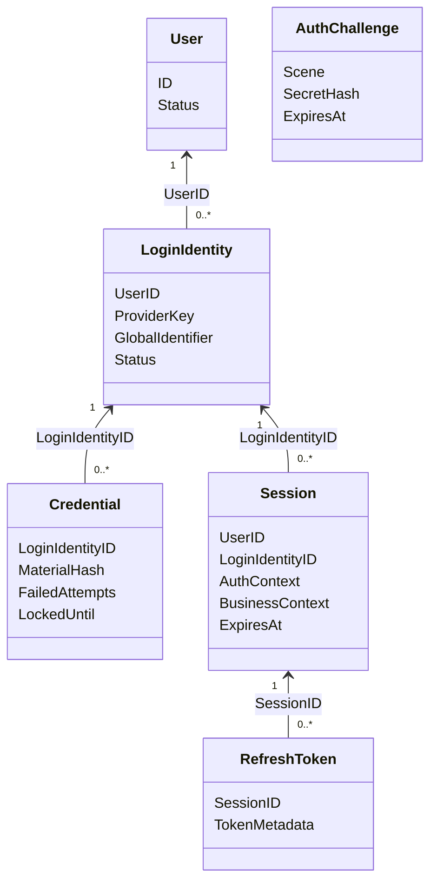

# AuthN 领域模型与身份核验策略

> 状态：已实现 · 当前设计与实现。 本文拥有 AuthN 对象性质、字段来源、生命周期和策略分工；完整用例顺序由各主链路维护。

## 1. 结论：身份、证明、决策与状态不能互换

AuthN 建模的是登录入口的控制关系与认证状态。一个 User 可以拥有多个 LoginIdentity；证明成功产生 Principal；登录准入、Session 建立和令牌颁发仍需分别完成。

以同一 User 绑定用户名密码和微信小程序为例：密码连续输错需要限制密码凭据，微信身份解绑需要改变该登录入口，User 被 blocked 则需要阻止所有入口完成登录。三种操作的影响范围不同，因此不能用 User 上的一个 `locked` 字段概括。本文从这个差异解释对象拆分，再说明一次性证明和登录准入为什么各有自己的失败边界。

| 对象 | 性质与生命周期 | 权威事实或用途 | 不承担的职责 |
| --- | --- | --- | --- |
| LoginIdentity | 长期 MySQL 事实 | provider key 到 UserID 的绑定、验证和状态 | User/Profile 档案、资源权限 |
| Credential | 长期 MySQL 事实 | 密码哈希材料、启用、失败次数和锁定状态 | 请求明文、一次性 OTP、登录态 |
| Challenge | 短期 Redis 事实 | 按 scene 隔离的 OTP/OAuth state、TTL；adapter 另维护尝试计数与原子消费 | 长期秘密、用户 Session |
| IdentityProof | 请求级输入 | 各认证方式核验所需的材料 | 仅凭对象类型宣称已经通过全部认证 |
| AuthDecision | 请求级领域决策 | 成功 Principal，或拒绝原因；可附 CredentialUpdate 意图 | Session、Token、资源授权 |
| Principal | 请求级核验结果 | UserID、LoginIdentityID、AuthenticationContext | 登录准入结果、Session、业务档案 |
| admission.Decision | 请求级准入决策 | Subject、Outcome、Reason | 可跨请求复用的通行凭证 |
| Session | 一段登录期的 Redis 状态 | 原始认证事实、业务快照、在线状态与期限 | 实时业务状态、角色权限 |
| AccessToken / RefreshToken | 已颁发访问 / 续期凭证 | 声明及 Session 关联 / 轮换重放信息 | 替代 Session、Admission 或 AuthZ |
| Result | 完整登录用例输出 | Principal + TokenPair | 持久化聚合、OAuth authorization grant |
| Signing Key | 独立密钥生命周期事实 | key 身份、算法、状态、有效期 | 公共 JWKS wire form 或导出私钥 |

## 2. 局部对象关系



图表示 ID 引用和逻辑基数，不是 MySQL/Redis 外键，也不承诺同时存在多个可用 refresh。Challenge 独立消费、过期，不依附 Session。ProviderKey、MaterialHash、TokenMetadata 是语义分组，不是数据库列清单。请求级 Proof/Decision/Principal/Result 不独立持久化，完整关系见 [V8 图](../../_images/architecture/core-domain-model-v8.png)。

## 3. LoginIdentity：把登录入口从 User 分离

`(provider, realm, identifier)` 标识一条登录入口。Realm 是身份提供方命名空间，不能省略；同样的 openid 字符串在不同 app 下不形成同一个身份。

| Provider | Realm | Identifier | GlobalIdentifier |
| --- | --- | --- | --- |
| username | 固定 `default` | 显式用户名，注册时可从 email/phone fallback | 空 |
| phone | `global` | phone | 空 |
| wechat_minip | appID | openid | unionid，可选 |
| wechat_open | appID | openid | unionid，可选 |
| wecom | corpID | 企业微信 userid | 空 |

一个登录入口只能属于一个 User。`GlobalIdentifier` 是 provider 级跨 realm 查找的 canonical 锚点，同一 `(provider, GlobalIdentifier)` 只保存在一行；同 User 的附加 realm 行不重复保存。数据库唯一约束裁决并发，具体绑定、转移与解绑规则由 [Linking](03-关键链路-Linking登录身份绑定.md)维护。

User 的变化原因是内部主体生命周期；LoginIdentity 的变化原因是登录方式的验证、禁用、绑定和解绑。LoginIdentity 状态是 active、disabled、archived、deleted；密码锁定属于 Credential.LockedUntil，不能另造 locked 登录身份状态。

| 具体变化 | 当前拥有者 | 对其他入口的含义 |
| --- | --- | --- |
| 密码失败达到锁定条件 | Credential 的失败计数、LockedUntil | 不把微信入口改成 locked；微信仍需独立通过身份核验和用户准入 |
| 禁用或解绑某个微信入口 | 对应 LoginIdentity | 不由此删除 User 的其他登录入口 |
| User 被 blocked | Identity 的 User 状态，AuthN Admission 读取 | 即使某个入口证明正确，也不能完成登录；在线 Token 验证/刷新还要检查该状态 |

可以把多个入口做成 User 内的实体集合：它能集中加载主体与入口，也便于在一个对象内校验归属；仍然可以通过 provider 索引定位 User，并保持 Credential 为独立聚合。若再把入口变更和凭据生命周期都纳入 User 的不变量，写入职责及协调才会集中到更大的主体边界。当前按 provider key 直接定位 LoginIdentity，Credential 再引用入口，User 只维护主体状态，使入口与主体可以分别管理；代价是登录必须跨这些事实读取，注册等跨聚合不变量需要应用事务协调。这里说明的是依据当前调用与不变量的方案比较，不是已存在的历史 ADR。

证据：`domain/authn/loginidentity/login_identity.go`、`domain/authn/authentication/password.go`、`domain/authn/admission/policy.go`（均位于 `internal/apiserver/`）；绑定并发与数据库唯一约束由 [Linking](03-关键链路-Linking登录身份绑定.md)维护。

## 4. Credential、Challenge 与 Proof：三个不同的验证对象

### 4.1 长期凭据不是所有认证方式的共同记录

当前 Credential 保存密码哈希材料及启用、失败计数、锁定状态，归属于 LoginIdentity。密码可以反复核验，因此成功一次不删除它；更换算法参数可产生重哈希意图。手机 OTP 和微信登录不需要为每次证明建立长期 Credential 行：前者使用 Challenge，后者使用 provider 交换结果，再查找内部 LoginIdentity。

`CredentialUpdate{CredentialID, Effect, Rotation}` 汇集一次认证的长期凭据记录意图，是请求内结果，不是新的持久化聚合。AuthDecision 的成功身份只从 Principal 读取；RejectedLoginIdentityID 仅定位失败入口。领域 `Validate` 拒绝“核验失败却记录成功”或“失败时轮换材料”等矛盾组合。

### 4.2 密码核验结果和凭据更新必须一起理解

| 密码策略观察到的事实 | 决策与凭据意图 | 后续含义 |
| --- | --- | --- |
| 用户名不存在，或没有密码凭据 | 核验失败，没有失败计数意图 | 不能对不存在的凭据累加次数 |
| LoginIdentity 不可用 | 核验失败，不进入密码比对 | 入口状态优先于秘密是否匹配 |
| Credential 已禁用或 LockedUntil 未到 | 核验失败，Effect 为 None | 已锁定期间的请求不统一计为新的密码错误 |
| hasher.Verify=false，含部分材料格式/算法异常 | RecordFailure | 应用记录失败迁移，再返回核验拒绝；不只表示用户输错 |
| hasher.Verify=true | RecordSuccess，可附 Rotation | 先执行成功记录意图，才进入登录准入；不表示完整登录成功 |

应用 CredentialRecorder 把意图映射为 AuthenticationTransition；失败迁移由领域计算，MySQL adapter 在失败记录事务中读取并锁定当前行；成功记录则一次更新失败计数、成功时间和可选的新材料。这样策略不直接执行 SQL，锁定规则也不交给 handler 临时判断。Recorder 向上返回的存储错误会终止登录；失败记录的行锁不把前面的秘密核验、后面的准入和 Session 创建变成一个全局事务。

当前有一个需要保留的例外：成功或失败记录遇到 `ErrCredentialNotFound` 都被 Recorder 视为 no-op，不向上传播。因此并发删除凭据后，原先的成功决策仍可能进入 Admission；Admission 只重新检查 User/LoginIdentity，不重新核验 Credential。组合根当前装配 Recorder，但 SignIn 本身也容许 Recorder 为 nil。准确合同是“先调用已装配的记录步骤，向上传播的错误阻止颁发”，不能写成所有凭据副作用必定已持久化。此处记录实现边界，不把它解释成已充分论证的业务取舍。

重哈希还区分两个故障：生成升级 hash 失败时，当前策略保留已成立的密码核验结果，不附 Rotation；执行记录意图时向上传播的存储错误则终止登录。`CredentialNotFound` 仍遵循上述 no-op 例外。这避免把算法升级的机会性工作与凭据记录的错误处理混为一谈。

LockedUntil 到期不自动清零 count，下一错误可能立即重新锁定；RecordSuccess 清零但不清未来 LockedUntil。核验与记录分离，成功更新不重验当前 Credential 状态/材料/锁定/Version，因此行锁不保证新锁立即阻断所有在途成功登录。具体时间与竞争案例由 [Login](04-关键链路-Login登录认证.md)维护；成功记录后仍可能因 User 准入失败而没有会话。

证据：`internal/apiserver/domain/authn/authentication/{password,decision}.go`、`internal/apiserver/infra/mysql/credential/repo.go`、`internal/apiserver/application/authn/credential/recorder.go`。算法与参数边界见 [密码学](../../03-基础设施/04-密码学密钥与令牌.md)，完整调用顺序见 [Login](04-关键链路-Login登录认证.md)。

### 4.3 Challenge 消费成功不等于登录成功

AuthChallenge 实体保存 ID、Type、Scene、Target、SecretHash、Payload、ExpiresAt、CreatedAt。尝试次数由 Redis adapter 的独立计数维护；实体没有 Attempts 或 ConsumedAt 字段。领域定义签发、校验及消费要求，adapter 实现条件原子操作，应用编排短信发送 gate/quota 和错误映射。

当前手机登录顺序是：验证并消费登录场景 OTP → 按 phone/global 查找 LoginIdentity → 检查入口状态 → 产生 Principal → 登录准入 → 建立 Session 和颁发令牌。这个顺序有明确后果：

| 消费之后的失败点 | 已发生的事实 | 重试边界 |
| --- | --- | --- |
| 手机号没有绑定入口 | OTP 已消费，返回 NoBinding | 此次正确 OTP 不会自动注册或绑定 User |
| MySQL 读取失败，或入口不可用 | OTP 已消费，仍没有成功登录结果 | 再提交同一 OTP 不能依靠它重新通过消费 |
| User 准入拒绝，或后续 Session/签发失败 | OTP 已消费，可能已产生 Principal | 补偿新 Session 不会恢复已消费的 OTP |

需要重新取得证明时，须重新获取 Challenge，并受发送限额约束。存储故障属于“无法核验”，证明不匹配属于“核验拒绝”，两者都不放行。当前流程没有跨 Redis、MySQL 和签发过程的整体回滚；不能因为最终未返回 Token 就声称一次性材料未使用。

并发条件比较的是 SecretHash，不是独立签发 generation；它只阻止旧 hash 操作已换成不同 hash 的记录。同号同 scene 再签发相同 OTP 时不能据此区分新旧。公开登录还有“verifier规范化号码、身份查找用原输入”的边界，可能消费正确 OTP 后 NoBinding；两类源码案例与测试缺口见 [Login](04-关键链路-Login登录认证.md)。

把 Challenge 放到 MySQL 也是可行备选，但仍需要带条件的原子更新/删除、过期清理以及计数并发规则。收益是可以与部分 MySQL 事实共库协调，代价是短期高频读写、索引清理和连接压力；它也不会自动纳入 Redis Session 或外部 provider 的操作。当前 Redis 条件消费直接满足 TTL 与防重放要求，承担跨存储失败窗口。“先查询再普通删除”无论使用何种存储，都不足以阻止两个并发请求各自接受同一证明。这里是设计分析，未给出性能对比结论。

证据：`internal/apiserver/domain/authn/authentication/phone-otp.go` 的 `Authenticate` 顺序、`domain/authn/challenge/{challenge,repository}.go` 的实体与端口、`infra/cache/redis/challenge_repository.go` 的计数和消费实现（后两处均位于 `internal/apiserver/`）。

### 4.4 IdentityProof 只统一策略输入，不抹平信任来源

正式接口是 `authentication.IdentityProof`，通过 `CredentialKind()` 选择领域策略。PasswordProof/PhoneOTPProof 中的密码和 OTP 仍待核验；微信/企微标识已经由 IDP Resolver 交换并解析，但还没有映射为允许登录的 IAM 主体。`WecomProof.ProviderUserID` 是 provider 用户标识，不是 Principal.UserID。

如果把这些输入统称“已认证凭据”，会错误地把 provider 认可某个外部账号推导为 IAM 允许该 User 登录。正确的信任传递是：可信外部解析 → 内部登录入口匹配 → 当前主体准入。IP/UA 留在应用请求上下文；需要 OAuth state 的入口还必须消费相应 Challenge。类型构造与字段有效性不能替代这些步骤。

## 5. Principal 与登录准入

Principal 仅保存 UserID、LoginIdentityID 及 `AuthenticationContext{Method, Realm, AMR, AuthenticatedAt}`。`auth_time` 是原始核验时间，刷新时刻不能覆盖它。Principal 不携带 SessionID、BusinessContext 或 Token。

密码正确但 User 被 blocked 时，密码策略可以产生 Principal，Admission 仍必须拒绝。这里的 Principal 表达“本次材料匹配了哪个内部入口”，不是可跨请求携带的登录许可。若将 User 状态完全混入每一种密码/OTP/provider 策略，容易遗漏某种登录方式，也难以让在线验证和刷新复用相同的准入规则。

当前 Admission 重新读取 LoginIdentity，检查存在、归属于声明的 User、处于 active，再读取 Identity 暴露的 User 状态。`Evaluate` 返回 `(Decision, error)`，保留三种结果：

| 结果 | 具体例子 | 后续 |
| --- | --- | --- |
| admitted | 入口归属匹配且 active，User active | `IsAdmitted()` 成立，才继续建立 Session |
| denied | 入口缺失/停用/归属不匹配，或 User missing/blocked/inactive | 正常策略拒绝，携带 Reason，不创建 Session |
| error | 状态读取失败、依赖未配置、未知 User 状态 | 无法完成评估，终止登录；不能当作 admitted 或普通身份不匹配 |

拆成 Decision 和 error，使“规则拒绝”与“系统不能确认”能够分别排障；两者的失败方向相同，诊断含义不同。代价是成功核验后还要读取当前状态，并可能在这里失败。当前读取也不是 User 与 LoginIdentity 的整体原子快照：准入之后状态仍可能发生变化，后续在线验证/刷新和撤销流程共同缩小使用窗口，不能声称准入一次便持续有效。

`Require` 为在线 Token 验证/刷新复用这组检查；纯本地 JWKS 验签不读取当前 User/LoginIdentity 状态，因此不能承诺 blocked 在所有本地使用点立即生效。证据：`internal/apiserver/domain/authn/admission/policy.go`、`domain/authn/token/verifier.go`、`application/authn/signin/completion_test.go`（后两处均位于 `internal/apiserver/`）。完整阶段与错误映射见 [Login](04-关键链路-Login登录认证.md)。

Principal 与 AuthZ Subject 分开：前者描述核验事实，后者是授权中的稳定引用。以 UserID 构造 `subject.NewUserRef` 不会授予任何 Resource/Action；最近认证也不代替资源权限。

## 6. Session、Token 与声明事实

Session 保存 AuthContext 和 BusinessContext。新登录只接收 Principal，BusinessContext 为空；历史会话的 OrgID/Attributes 快照可以继续参与刷新投影，却不是实时组织查询或授权隔离维度。Session 与 refresh 分别持久化；Session 延期和 refresh 原子轮换是不同操作。

`UserTokenSet` 是一次颁发产生的 AccessToken + RefreshToken。`TokenMetadata` 仅含标识和期限，没有凭证值。AccessToken.Subject() 从 UserID 派生；AccessTokenClaims 同时包含 sub/UserID 并检查一致。Claims 是数据值对象，构造成功只代表字段不变量，不代表验签、目标受众、在线准入或资源授权已通过。

签发器从 Session 投影完整 AccessTokenClaims，再补 token ID、issuer、audience 和时间；编码器只编码签名。`IssuedTokenDTO` 是颁发摘要，不能当完整声明。显式 refresh 或未知访问令牌类型被拒绝，缺失 token_type 的历史兼容另有门禁。

Signed JWT、JWK/JWKS、权威上下文、寿命和兼容政策由 [Session 模型](03-Session-Token与JWKS.md)维护；mint/保存/刷新/撤销与补偿顺序由 [Token 链路](05-关键链路-Token签发刷新吊销.md)维护；签名密钥状态、跨记录激活与公钥发布由 [JWKS](06-关键链路-JWKS与本地验签.md)维护。公开 JWKS 是公钥投影，不是管理私钥的聚合。

## 7. 两层多态与实现责任

| 能力 | 位置 | 分派或规则 |
| --- | --- | --- |
| 公开请求方法与 payload | application/signin/method | 方法目录与形状选择 |
| 请求 / 外部交换转为 Proof | application/signin/proof | provider 协议 I/O；手机号 builder 不消费 OTP |
| Proof 是否匹配有效入口 | domain/authentication | 唯一真实 AuthStrategy Registry，生成 AuthDecision |
| 长期密码材料与状态 | domain/credential | PasswordIssuer、AuthenticationTransition；没有认证策略注册表 |
| 一次性材料与消费规则 | domain/challenge | SMS OTP / OAuth State 共用 consume/verification 内核；无运行时 Challenge Registry |
| 登录阶段与失败补偿 | application/signin | 独立调用 Admission、SessionCreator、InitialTokenIssuer |

### 微信扫码为什么不能只靠一个策略名称

公开入口与领域输入的分派键不是同一个目录。微信扫码入口使用应用层 `method.CredentialKindWechatScan = oauth_wx_scan`：Selector 校验 appID/code/state 的请求形状，proof builder 消费 OAuth state，核对 appID，再调用 IDP 交换 code。它最终生成 WechatOpenProof，其领域 `authentication.CredentialKindWechatOpen = oauth_wx_open`；领域策略根据已验证的外部标识匹配内部 LoginIdentity，而不是再次发起扫码协议。openid 优先、unionid 回退及历史匹配边界由 [Login](04-关键链路-Login登录认证.md)维护。

这样外部协议 I/O 与内部主体核验可以独立替换和测试。`oauth_wx_scan` 表示获取证明的入口方式，`oauth_wx_open` 表示领域接受的证明种类；不能假定应用 kind 与领域 kind 必须同名。OAuth state 在 provider 交换前已消费，后续 appID 不匹配或交换失败也不会恢复它，具有与 OTP 类似的一次性失败边界。

单个 handler switch 对少量简单方式可以更直接，初期也少一些接口和装配成本。但在当前 IAM 中，它会同时承担请求形状、provider 协议、Challenge 消费、内部绑定和登录状态，测试一种入口就可能需要替身模拟所有边界。当前分层把这些变化原因拆开，代价是组合根必须正确配对 Selector、proof builder 和 AuthStrategy。DefaultSelector 声明某个方法，并不单独证明相应 builder、provider 配置和挑战依赖已可用；例如扫码 builder 需要 OAuth state verifier 才能装配。

证据：`internal/apiserver/application/authn/signin/method/{selector,types,wechat_scan}.go`、`signin/proof/{factory,wechat_scan}.go`（位于 `internal/apiserver/application/authn/`）、`internal/apiserver/domain/authn/authentication/{authenticator,wechat-open}.go`。新增方式应依次明确 provider key、输入目录、proof builder、领域策略、组合根和协议面；SignUp/Linking 是否支持需另行决定。

## 8. 不变量与当前能力边界

1. provider key 带正确 realm，不归属两个 User；长期凭据不暴露材料。
2. Challenge 场景隔离、有 TTL，正确证明只能成功消费一次。
3. 身份核验后先执行已装配的凭据记录；向上传播的记录错误阻止颁发，保留 CredentialNotFound no-op 例外。
4. Principal 仅描述证明成功；User/LoginIdentity 准入仍独立检查。
5. 公开登录须成功建立 Session 并保存初始 refresh 才交付 Result。
6. 用户 access token 绑定 Session；服务身份由 mTLS 建立。
7. 验签、登录准入与资源授权分别成立，不能互相推导。

AuthN 不提供数字 TenantID 多租户登录。用户名固定 default Realm，微信 AppID/企微 CorpID 保持 provider 命名空间原义；业务组织快照不升级为 IAM 资源授权条件。历史迁移与切换要求见 [MySQL 事务与迁移](../../03-基础设施/01-MySQL事务与迁移.md)和[迁移发布](../../05-工程质量与运维/03-迁移发布与数据库运维.md)。

## 9. 事实源与验证边界

源码：`internal/apiserver/domain/authn/{loginidentity,credential,challenge,authentication,admission,session,token,signingkey}`；应用与组合根见 [代码索引](08-分层架构与代码索引.md)。

| 证据 | 覆盖的判断 |
| --- | --- |
| `authentication/decision_contract_test.go` | 决策与凭据 Effect/Rotation 不能矛盾 |
| `authentication/loginidentity_strategy_test.go` | 手机/微信等方式按 LoginIdentity 核验，不要求长期密码 Credential |
| `application/authn/signin/completion_test.go` | 准入拒绝或评估故障不建立 Session；后续失败的 Session 补偿 |
| `token/refresher_atomic_test.go`、`session/lifetime_policy_test.go` | 刷新轮换与会话期限边界；不等价于整个登录过程原子提交 |

表中未写完整前缀的文件分别位于 `internal/apiserver/domain/authn/` 或 `internal/apiserver/`。OTP 消费后再读取入口的失败窗口由源码顺序确认，上述测试不被扩大解释为对全部跨存储故障进行了集成演练。

```bash
go test ./internal/apiserver/domain/authn/... ./internal/apiserver/application/authn/...
```

以上测试检查各边界的实现行为，文档门禁检查引用和已编码事实；两者不能代替 Redis/MySQL/provider 的真实故障演练、部署或业务验收。Session 与 JWT 同时存在的状态权威和安全窗口由 [Session/Token/JWKS](03-Session-Token与JWKS.md)维护，避免在本篇复制第二份令牌生命周期。
