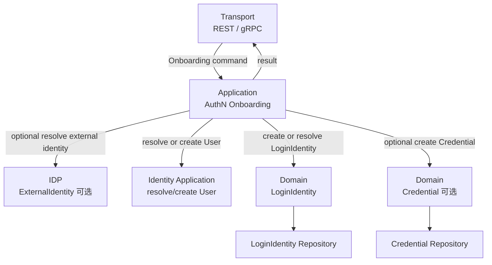
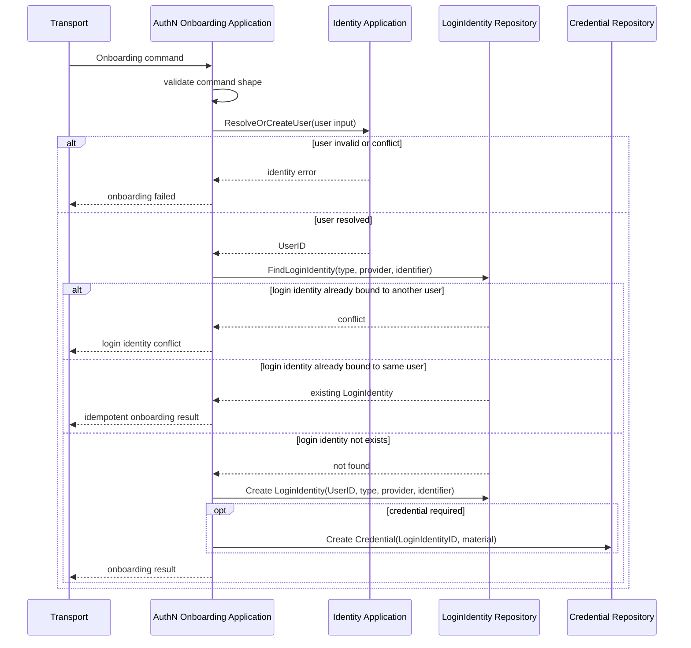
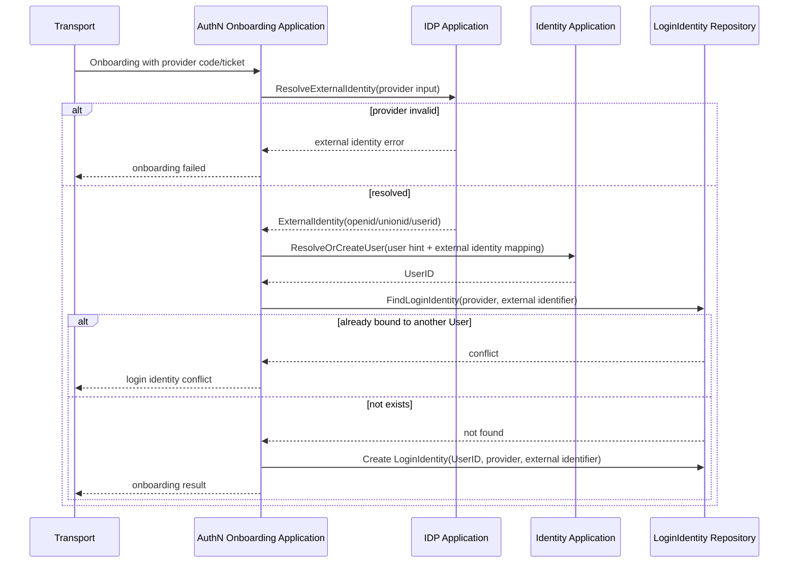

# 关键链路：Onboarding 身份开通

> 状态：设计目标 · 第一版正文，待继续按 `application/authn`、`domain/authn`、`application/identity`、REST/gRPC 契约和测试逐项核对。

---

## 1. 本文回答

本文回答 8 个问题：

- AuthN 中的 Onboarding 身份开通解决什么问题？
- Onboarding 和 Login、Bind、Register 的边界分别是什么？
- 首次开通时，AuthN 如何通过 Identity 创建或解析 `User`？
- `LoginIdentity` 在 Onboarding 中如何创建、去重和绑定 `UserID`？
- `Credential` 为什么是可选的？哪些登录方式需要 Credential，哪些不需要长期 Credential？
- 外部 IDP 登录场景下，`ExternalIdentity`、`LoginIdentity`、`User` 如何衔接？
- Onboarding 的事务、幂等、并发和失败边界如何处理？
- 修改该链路时应该核对哪些代码和测试？

本文只讲 Onboarding 身份开通链路。
AuthN 领域模型见 [01-领域模型-LoginIdentity-Credential-Challenge-Principal-Session-Token.md](01-领域模型-LoginIdentity-Credential-Challenge-Principal-Session-Token.md)；
模块总览见 [00-模块总览.md](00-模块总览.md)。

---

## 2. 30 秒结论

Onboarding 是“让一个登录身份首次进入 IAM 体系”的链路。

它通常完成：

```text
解析或创建 Identity.User；
创建 AuthN.LoginIdentity；
按登录方式决定是否创建 AuthN.Credential；
返回身份开通结果。
```

核心主线：

```text
Onboarding input
  -> validate input
  -> resolve or create User through Identity
  -> create or resolve LoginIdentity
  -> optional create Credential
  -> return onboarding result
```

最重要的边界：

```text
Onboarding 不是 Login；
Onboarding 不是已登录用户绑定更多身份；
Onboarding 不直接签发 Token，除非某个明确的上层用例把 onboarding + login 组合起来；
创建 User 属于 Identity；
创建 LoginIdentity / Credential 属于 AuthN；
外部 IDP 只提供 ExternalIdentity，不直接创建 User。
```

如果只记一句话：

> Onboarding 是“开通登录身份并绑定内部 User”的链路，Login 是“证明登录身份并产生 Principal/Session/Token”的链路。

---

## 3. Onboarding 的定位

Onboarding 用于首次把一个登录入口纳入 IAM。

它回答：

```text
这个外部或内部登录标识是否已经在 IAM 中存在？
如果不存在，应该绑定到哪个 User？
是否需要创建新的 User？
是否需要创建 Credential？
开通完成后，后续 Login 应该如何找到这个 LoginIdentity？
```

Onboarding 的结果通常是：

```text
UserID；
LoginIdentityID；
LoginIdentity Type；
是否新创建 User；
是否新创建 LoginIdentity；
是否创建 Credential；
后续是否可以进入 Login 链路。
```

具体返回字段以当前 REST/gRPC 契约和 application result 为准。

---

## 4. Onboarding 不是 Login / Bind / Register

### 4.1 Onboarding 与 Login

| 链路 | 核心问题 | 主要产物 |
| --- | --- | --- |
| Onboarding | 登录身份如何首次进入 IAM？ | `User`、`LoginIdentity`、可选 `Credential` |
| Login | 请求者如何证明自己控制登录身份？ | `Principal`、`Session`、`AccessToken`、`RefreshToken` |

边界：

```text
Onboarding 可以创建 LoginIdentity；
Login 必须验证 Credential 或 Challenge；
Onboarding 本身不等于认证成功；
Login 成功后才会产生 Principal/Session/Token。
```

---

### 4.2 Onboarding 与 Bind

`Bind` 通常表示“已存在且已认证的 User 给自己追加一个登录身份”。

| 链路 | 前提 | 目标 |
| --- | --- | --- |
| Onboarding | User 可能不存在，也可能需要解析 | 首次开通登录身份和内部 User 关系 |
| Bind | 当前请求者已经有 Principal/UserID | 给当前 User 绑定新的 LoginIdentity |

边界：

```text
Onboarding 可以创建 User；
Bind 不应随意创建另一个 User；
Bind 必须基于当前 Principal 的 UserID；
Bind 更强调账户安全校验和二次确认。
```

---

### 4.3 Onboarding 与 Register

`Register` 更偏产品/接口语义，可能把多个动作组合在一起。

例如：

```text
注册手机号账号 = Onboarding + password/otp Credential + optional Login
微信首次登录 = IDP ExternalIdentity + Onboarding + optional Login
后台账号开通 = create User + create operation LoginIdentity + create password Credential
```

建议：

```text
文档中优先使用 Onboarding 表示领域链路；
Register 可以作为 REST/gRPC 或产品入口名称；
不要把 Register 的接口包装语义误写成 AuthN 领域模型。
```

---

## 5. 链路总览



读图规则：

```text
transport 只构造 command 并映射响应；
AuthN application 编排开通流程；
Identity application 负责 User 创建或解析；
IDP 只解析外部身份声明；
LoginIdentity / Credential 属于 AuthN；
Credential 是否创建取决于登录方式。
```

---

## 6. 输入与输出

### 6.1 输入

Onboarding 输入通常包含 4 类信息。

| 输入类型 | 示例 | 说明 |
| --- | --- | --- |
| User 输入 | name、phone、email、profile hint | 用于创建或解析 Identity.User |
| 登录身份输入 | type、identifier、provider、appID | 用于创建 LoginIdentity |
| 凭据输入 | password、operator secret、credential material | 可选，用于创建 Credential |
| 外部身份输入 | code、ticket、openid、unionid、wecom userid | 可选，通常需要 IDP 解析或校验 |

具体字段必须以 REST OpenAPI、gRPC proto 和当前 application command 为准。

---

### 6.2 输出

Onboarding 输出通常包含：

```text
UserID；
LoginIdentityID；
LoginIdentity Type；
Provider；
Identifier masked or normalized；
CreatedUser；
CreatedLoginIdentity；
CreatedCredential；
NextStep。
```

注意：

```text
Credential material 不应出现在响应中；
password hash 不应出现在响应中；
外部 provider token 不应出现在响应中；
如果 Onboarding 不包含 Login，不应返回 AccessToken / RefreshToken。
```

---

## 7. 标准 Onboarding 时序图



注意：

```text
上图是领域流程图，具体函数名、repository 名称和幂等策略以代码为准；
如果当前实现不是 ResolveOrCreateUser，也应明确实际行为是 create-only、resolve-only 还是 resolve-or-create。
```

---

## 8. 外部 IDP Onboarding 时序图

外部 IDP 场景通常包括微信小程序、微信公众号、企业微信或其他 OAuth/OIDC provider。



关键边界：

```text
ExternalIdentity 不是 User；
openid / unionid / wecom userid 是登录标识，不是 Credential；
IDP AppToken 不是 IAM AccessToken；
IDP 不签发 IAM Token；
外部 IDP 登录通常没有长期 Credential，除非业务明确需要本地绑定材料。
```

---

## 9. Credential 为什么是可选的

不同登录方式对 Credential 的需求不同。

| 登录方式 | 是否需要长期 Credential | 说明 |
| --- | --- | --- |
| username + password | 通常需要 | Credential 保存 password hash 和算法参数 |
| phone + SMS OTP | 通常不需要长期 Credential | OTP 更适合作为 Challenge |
| 微信小程序 openid | 通常不需要本地长期 Credential | IDP 解析 ExternalIdentity，LoginIdentity 绑定 openid |
| 企业微信 userid | 通常不需要本地长期 Credential | IDP 解析企业微信身份 |
| operation account | 通常需要 | 后台账号可能需要 password Credential 或其他凭据 |
| OAuth/OIDC provider | 视设计而定 | 通常保存绑定关系，不保存 provider access token 作为 Credential |

结论：

```text
Credential 是“证明材料”；
并不是所有 LoginIdentity 都需要本地长期 Credential；
短期验证码属于 Challenge；
外部 provider 的 access token / app token 不应直接当 IAM Credential 使用。
```

---

## 10. 幂等与并发

Onboarding 很容易遇到重复请求和并发请求。

### 10.1 幂等目标

理想情况下，重复提交相同 Onboarding 输入应满足：

```text
同一个 provider + identifier 不重复创建 LoginIdentity；
同一个 phone / user identity 不重复创建 User；
同一个 password credential 不重复创建多条 active Credential，具体以策略为准；
重复请求应返回已有结果或明确 conflict，而不是产生脏数据。
```

---

### 10.2 并发风险

| 风险 | 说明 |
| --- | --- |
| 同手机号并发创建 User | Identity 层必须用唯一性检查 + 数据库唯一约束兜底 |
| 同 provider identifier 并发创建 LoginIdentity | AuthN 层必须用唯一约束兜底 |
| 一个外部身份同时绑定两个 User | 应返回冲突或由业务规则明确处理 |
| Credential 创建一半失败 | 需要事务或补偿，避免 LoginIdentity 处于不可认证状态 |
| IDP 解析成功但本地写入失败 | 不应认为 IAM onboarding 成功 |

---

### 10.3 建议策略

```text
对 LoginIdentity 使用 provider + identifier 唯一约束；
对 User 使用 Identity 自身唯一性约束，例如 phone；
Onboarding 用例应有明确事务边界；
如果横跨 Identity/AuthN 两个模块写入，需要明确单事务、受控 port 或补偿策略；
捕获唯一约束冲突并映射为 AlreadyExists/Conflict；
必要时引入 idempotency key。
```

---

## 11. 事务边界

Onboarding 可能涉及多个写模型：

```text
Identity.User；
AuthN.LoginIdentity；
AuthN.Credential。
```

需要明确事务策略。

### 11.1 单事务策略

适用于：

```text
User / LoginIdentity / Credential 在同一数据库或同一事务管理器下；
需要保证全部成功或全部失败；
失败时不允许部分开通。
```

优点：

```text
一致性强；
实现语义直观。
```

风险：

```text
跨模块事务边界可能变大；
Identity/AuthN 的 repository 协作需要清晰抽象。
```

---

### 11.2 分步 + 补偿策略

适用于：

```text
跨存储或跨服务；
无法使用单数据库事务；
允许通过补偿或重试恢复。
```

需要明确：

```text
User 创建成功但 LoginIdentity 创建失败怎么办？
LoginIdentity 创建成功但 Credential 创建失败怎么办？
重复 Onboarding 如何识别并恢复？
是否需要 Outbox 事件？
是否需要人工修复状态？
```

当前文档不假设已经实现补偿策略。没有代码事实支撑时，不应写成已实现。

---

## 12. 失败边界

| 场景 | 期望行为 | 说明 |
| --- | --- | --- |
| User 输入非法 | Onboarding 失败 | Name/Phone 等规则由 Identity 控制 |
| User 唯一性冲突 | 返回 conflict 或解析已有 User | 取决于 create-only 还是 resolve-or-create 策略 |
| 外部 provider code 无效 | Onboarding 失败 | IDP 返回外部身份解析错误 |
| ExternalIdentity 已绑定其他 User | 返回 conflict | 防止账号串绑 |
| LoginIdentity 已存在且属于同一 User | 幂等返回已有结果 | 具体以代码策略为准 |
| LoginIdentity 已存在且属于其他 User | 返回 conflict | provider identifier 唯一性保护 |
| Credential material 无效 | Onboarding 失败 | 密码强度、格式、hash 失败等 |
| Credential 创建失败 | Onboarding 失败或补偿 | 取决于事务策略 |
| repository 保存失败 | Onboarding 失败 | 不应伪造成成功 |

---

## 13. 与其他模块的边界

### 13.1 与 Identity

```text
创建或解析 User 属于 Identity；
AuthN 只通过 Identity application service / port 协作；
AuthN 不应直接写 Identity repository concrete；
LoginIdentity 通过 UserID 引用 User；
User 不是 LoginIdentity。
```

---

### 13.2 与 IDP

```text
IDP 负责解析 ExternalIdentity；
ExternalIdentity 不是 User；
ExternalIdentity 不是 LoginIdentity；
AuthN 根据 ExternalIdentity 创建或匹配 LoginIdentity；
IDP AppToken 不应作为 IAM AccessToken 或 Credential。
```

---

### 13.3 与 AuthZ

```text
Onboarding 不做授权判定；
Onboarding 不创建 RoleBinding，除非有明确的授权开通用例；
即使 Onboarding 后立刻 Login，Token 验签成功也不等于资源访问允许；
资源访问仍由 AuthZ Check 决定。
```

---

### 13.4 与 Suggest

```text
Onboarding 不维护 Suggest Index；
如果 Onboarding 创建了 User 但没有创建 Profile，则不应影响 Profile 搜索；
如果上层注册流程同时创建 Profile，应由 Identity/Suggest 的事件或刷新链路处理；
Suggest 不能通过 Onboarding 绕过可见范围控制。
```

---

## 14. 常见反模式

| 反模式 | 问题 | 推荐做法 |
| --- | --- | --- |
| Onboarding 后直接认为已登录 | 开通和认证混淆 | 需要明确是否组合 Login 链路 |
| AuthN 直接写 User repository | 绕过 Identity 写模型 | 通过 Identity application/port 协作 |
| 外部 openid 直接当 UserID | 外部身份和内部身份混淆 | openid 是 LoginIdentity identifier |
| provider access token 当 Credential | 外部调用凭证和 IAM 凭据混淆 | provider token 由 IDP 管理或短期使用 |
| SMS OTP 创建成长期 Credential | Challenge 和 Credential 混淆 | OTP 属于 Challenge |
| LoginIdentity 重复绑定多个 User | 账号串绑风险 | provider + identifier 唯一约束 |
| Credential 创建失败但返回成功 | 产生不可登录身份 | 用事务或补偿保证一致性 |
| Onboarding 同时写 RoleBinding | 认证开通吞并授权 | 授权开通应由 AuthZ 明确用例处理 |
| Onboarding 直接写 Suggest Index | AuthN 污染搜索读模型 | Suggest 通过事件或刷新读取事实 |

---

## 15. 代码事实源

| 事实 | 路径 |
| --- | --- |
| AuthN domain | `../../../internal/apiserver/domain/authn` |
| LoginIdentity 模型 | `../../../internal/apiserver/domain/authn` |
| Credential 模型 | `../../../internal/apiserver/domain/authn` |
| AuthN onboarding application | `../../../internal/apiserver/application/authn` |
| Identity User application | `../../../internal/apiserver/application/identity/user` |
| IDP ExternalIdentity | `../../../internal/apiserver/domain/idp` |
| AuthN infra repository | `../../../internal/apiserver/infra` |
| AuthN REST transport | `../../../internal/apiserver/transport/rest` |
| AuthN gRPC transport | `../../../internal/apiserver/transport/grpc` |
| AuthN container | `../../../internal/apiserver/container/authn` |
| REST 契约 | `../../../api/rest` |
| gRPC 契约 | `../../../api/grpc` |
| 架构测试 | `../../../internal/pkg/architecture` |

注意：上表中的具体路径需要继续与当前源码核对。如果源码目录已调整，应以代码为准并同步更新本文。

---

## 16. Verify

修改本文后至少执行：

```bash
make docs-hygiene
```

涉及 AuthN 领域模型：

```bash
go test ./internal/apiserver/domain/authn/...
```

涉及 AuthN onboarding / application 用例：

```bash
go test ./internal/apiserver/application/authn/...
```

涉及 Identity 协作：

```bash
go test ./internal/apiserver/application/identity/...
go test ./internal/apiserver/domain/identity/...
```

涉及 IDP 协作：

```bash
go test ./internal/apiserver/domain/idp/...
```

涉及 REST/gRPC 契约或 transport：

```bash
make api-validate
make proto-gen
go test ./internal/apiserver/transport/rest/...
go test ./internal/apiserver/transport/grpc/...
```

涉及分层依赖或模块边界：

```bash
go test ./internal/pkg/architecture
```

---

## 17. 本文总结

Onboarding 身份开通可以压缩成：

```text
Onboarding input
  -> resolve external identity if needed
  -> resolve or create Identity.User
  -> create or resolve AuthN.LoginIdentity
  -> optional create AuthN.Credential
  -> onboarding result
```

最重要的边界是：

```text
Onboarding 不是 Login；
Onboarding 不是 Bind；
Onboarding 不必然签发 Token；
创建 User 属于 Identity；
创建 LoginIdentity / Credential 属于 AuthN；
Credential 是可选的；
ExternalIdentity 不是 User；
LoginIdentity 不能重复绑定多个 User。
```

下一篇应继续编写 Login 认证主链路，说明请求者如何通过 Credential 或 Challenge 证明自己，并如何生成 Principal、Session、AccessToken 与 RefreshToken。
