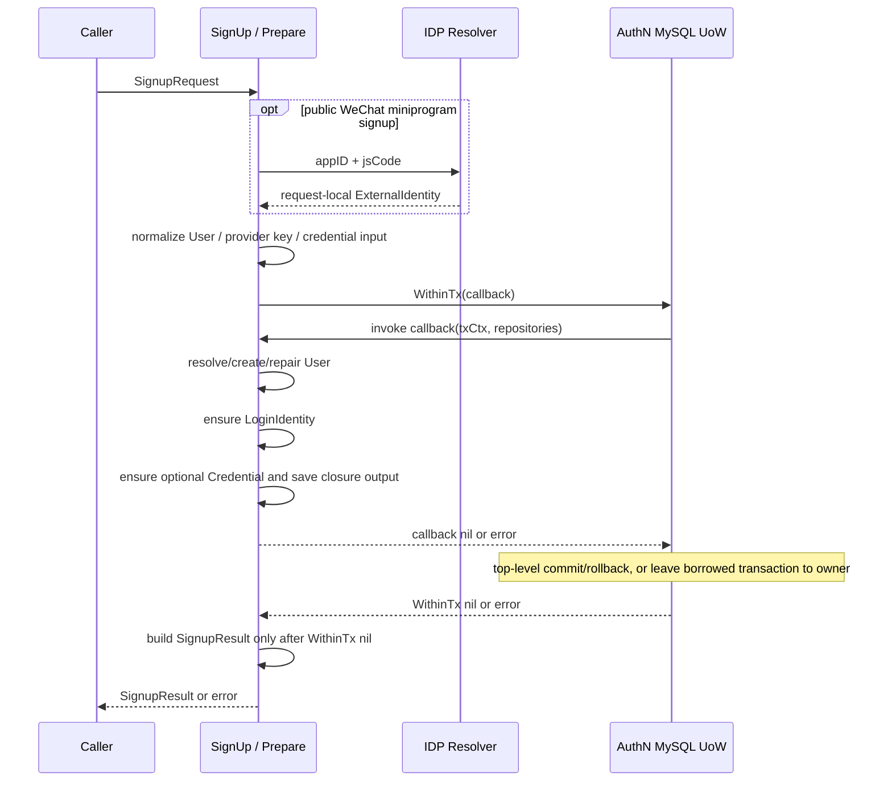

# 注册、登录与身份绑定

> 状态：已实现 · 当前设计与实现。 本文维护 SignUp 的 Prepare/UoW、创建/复用/修复、Credential ensure 和失败边界。Login 与 Linking 的详细行为分别由其主链路维护。

## 1. 结论：开通认证关系与实际登录是两个决策

SignUp 找到或创建 Identity User，并确保登录入口与必要的密码 Credential；它不创建 Session，也不交付 token pair。对外微信注册先由 IDP 解析 appID + jsCode，本地事实随后通过 MySQL UoW 保存；已有外层事务时复用该事务，由外层决定最终提交。

本文重点解释三个容易误判的场景：重复用户名开通时换一个 Password，不等于改密或证明掌握旧密码；相同手机号不自动合并成一个 User；微信入口仍在而 User 丢失时，repair 重建的是原 ID，不是原主体的完整历史状态。

| 用例 | 已知条件 | 目标 | 详细归属 |
| --- | --- | --- | --- |
| SignUp / Onboarding | 经过相应入口准入与校验的开通输入 | ensure User/LoginIdentity/可选 Credential | 本文 |
| SignIn | 已存在可认证入口与新的证明 | 核验、准入、Session、TokenPair | [Login](04-关键链路-Login登录认证.md)、[Token](05-关键链路-Token签发刷新吊销.md) |
| Linking / Unlink | 当前主体与入口控制证明 | 增加或移除 LoginIdentity | [Linking](03-关键链路-Linking登录身份绑定.md) |

当前 SignIn 查不到入口会拒绝，SignUp 单独处理主体创建和复用，Link 给可信当前主体追加入口。可以设计“首次外部登录同时注册”的组合用例，它能减少客户端调用，但必须明确创建准入、唯一冲突、失败后重试和令牌补偿。当前拆分让开通成功与登录许可分别成立，代价是调用方要选择用例并处理两阶段失败，不能把 SignupResult 当作登录结果。绑定的主体来源与控制证明由 [Linking](03-关键链路-Linking登录身份绑定.md)维护。

## 2. Prepare：先规范输入和外部证明，再进入本地写入



图表示本用例先 Prepare、后 WithinTx 的边界，省略事务内错误分支。外部证明失败不调用 WithinTx，本地任一步返回错误不交付 SignupResult。Prepare 只产生请求内输入，不提交本地事实。若调用方已经打开事务并将其放入 ctx，Prepare 不会脱离或关闭外层事务；“外部 I/O 在事务外”只适用于本用例尚未持有外层事务的调用。

### 2.1 输入变体决定规则，不由客户端选择 repair 开关

| 应用输入 | provider key 与证明来源 | Credential / repair |
| --- | --- | --- |
| UsernameLoginIdentityInput | username/default；显式 Username 优先，其次 email、phone；输入本身不核验密码 | 需要 password，缺失 User 不修复 |
| MockConsumerUsernameLoginIdentityInput | 同为 username/default；内部 ensure 当前以 email 为用户名 | 需要 password，缺失 User 不修复 |
| WechatMiniLoginIdentityInput 的公共映射 | 身份证明只取 appID + jsCode，经 IDP 查应用、交换为 openid/可选 unionid | 不需长期密码，允许沿既有入口修复 User |
| WechatMiniLoginIdentityInput 的内部预解析分支 | 非空 OpenID 优先，直接构造 appID/openid/unionid，不执行 code 交换 | 同上，来源标为 TrustedLegacyInput |

公共微信 REST/gRPC 不提供 OpenID、UnionID、Password 或 TrustedLegacyInput/AllowUserRepair 字段。REST 还接收 name，以及可选 phone/email/nickname/avatar/meta；姓名是主体资料，phone/email 只有格式校验，并没有在此完成电话/邮箱控制证明。不能由微信 code 有效推导资料中每个字段都已验证。内部预解析分支与公共 provider 证明必须分开评估，不能因为复用同一个 Go 输入类型就扩大公共协议的信任边界。

`preparedLoginIdentity.Source` 区分 Local、ProviderVerified、TrustedLegacyInput，是请求内来源标记；当前后续步骤没有按该标记增加准入检查，也不将它写入持久化 Meta。创建 LoginIdentity 的 builder 未由此设置 VerifiedAt，不能把 ProviderVerified 解读成数据库已记录 provider 验证时间。Prepare 还裁剪 Name 和密码首尾空白，属于输入规范化，不是秘密核验。

IDP 如何验证 provider 配置和外部响应，由 [外部身份解析](../04-IDP/02-外部身份解析与AuthN协作.md)维护。在没有外层事务的普通调用中，这个顺序避免 provider 网络尾延迟占用本地写事务连接和锁。外部 code 可能已经消费，即使后续本地提交失败，也不能把回滚描述为 provider 操作的回滚。真正的协议映射与调用准入见第 6 节；输入类型存在不等于对外存在相应注册接口。

## 3. UoW：三个仓储一起提交

`signupService.SignUp` 调用 `WithinTx`，使用同一个事务提供的 Users、LoginIdentities、Credentials：

1. `resolveUserStep`：先按 provider key 找已有身份，仅在未命中且本次带 global identifier 时，再按 provider/global identifier 找 canonical 锚点；数据库读取异常终止，不降级为新建。找到入口时加载关联 User，均未命中则创建 User。
2. `ensureLoginIdentityStep`：以已确定 UserID 构造身份，复用兼容入口，或创建新身份。
3. `ensureCredentialStep`：输入变体要求密码时复用或创建 password Credential；否则返回 `CredentialNotRequired`。
4. WithinTx 成功后构造 SignupResult。顶层调用由 UoW 提交或回滚；已有外层事务时，返回结果仍受外层最终提交约束。

这是同数据库跨聚合用例；User 仍由 Identity 定义状态和不变量，事务编排属于 AuthN 应用。生产 UoW 把同一 transaction handle 注入三个仓储，并使用 Required 传播：没有事务才新建，已有事务不打开第二笔事务、不替宿主提交。嵌套调用出错要由外层正确处理并回滚，不能声称 SignUp 内部总有一个独立回滚边界。resolveUserStep 虽允许 Users 缺省时使用 fallback repository，当前生产 adapter 显式提供事务仓储；自定义 adapter 不能只实现接口就宣称具备同等原子性。

例如首次用户名开通已经创建 User 与 LoginIdentity，随后缺少新密码或 hash 失败：顶层 UoW 回滚这两项写入，不留下“主体已创建但登录入口不完整”的半成品。若逐仓储分别提交，补偿要考虑并发请求已经引用新 User/入口，直接删除并不总安全。当前共享本地事务避免这类已提交半成品；它不抹平三个对象的独立生命周期，也不回滚外部 code。

当前密码 hash 在 ensureCredentialStep 内执行，位于写事务中；Prepare 并没有把所有耗时工作移出去。提前 hash 可以缩短新建路径的持锁时间，但重复开通已有 Credential 时可能白做计算，也要明确何时确认新建需求。这里是依据当前顺序的设计取舍分析，没有性能测试数据。当前用例没有本地事实先行提交的 Saga 流程；未来拆成独立存储/服务时，需要重新定义恢复协议，不能直接沿用“一个 UoW”的承诺。

## 4. 创建、复用与修复的精确含义

| 已有事实 | 当前处理 |
| --- | --- |
| provider key 已存在、属于已确定 User 且 active | 复用入口，不换归属 |
| provider key 属于其他 User | 冲突失败 |
| provider key 属于同 User 但 inactive | 拒绝，不静默复活 |
| 外部 provider 的 global identifier 可定位既有 User | 复用该 User，确保当前 realm 的入口；不自动合并两个 User |
| 微信入口指向的 User 缺失，Prepare 允许 repair | 用原 UserID 重建；不另造主体 ID |
| 用户名入口指向的 User 缺失 | `ErrUserNotFound`，不执行 repair |
| 已有 password Credential | 直接复用；不比较输入密码，不检查其 enabled/锁定状态，不修改材料 |
| 需要新建 password Credential，但没有可用新密码输入 | 拒绝，顶层事务回滚 |
| provider 不需要密码 | 不创建占位 Credential |

### 4.1 ensure Credential 不证明掌握现有密码

设 username/default/alice 已有密码 P1 的 Credential。再提交开通请求并带 P2，ensure 先按 LoginIdentityID/type 查现有记录，找到即返回 CredentialReused；P2 不会被拿去校验 P1，也不会覆盖 P1。不传新密码，在直接应用调用中也可能复用成功；公共入口仍可有自己的字段要求。已有记录即使 disabled 或处于锁定期也在这里复用，实际密码登录仍由认证策略拒绝不可用凭据。

因此 SignUp 成功证明兼容的开通事实存在，不证明新密码可登录，不构成改密、解锁或再认证。可选 User 资料、LoginIdentity.Profile/Meta 在复用时也不覆盖旧值。复用的 User 即使 blocked，SignUp 本身没有 Admission 检查；后续 SignIn 独立判断当前许可。

另一个可行选择是“重复注册直接冲突”，语义简单但调用方需另写查找/ensure；“重复注册同时更新材料”则需要新的身份核验、改密授权与会话处置，不能只把重试请求的 Password 当更新值。当前复用策略减少重复创建，代价是调用方必须理解返回摘要与登录证明的区别。

### 4.2 repair 保持身份锚点，不还原历史主体

设已有微信入口 L 指向 UserID=42，但 users 中没有 42。允许 repair 时，应用用 `WithID(42)` 调用 NewUser；Name/Phone/Email 来自本次 User 输入，Nickname 来自本次准备后的 Profile，状态默认 active。它不加载历史档案或原状态，也不恢复 ProfileLink、角色分配或历史 Session。若 User 已存在则直接复用，不更新其字段或解除 blocked。

repair 的价值是避免沿一个已存在登录入口再生成新的 UserID，保留原引用锚点；但“同一个 ID”不足以证明历史状态已恢复。若旧 ProfileLink、Assignment 等记录仍存在，它们继续引用重建后的原 ID，repair 没有重新审核这些关联。默认 active 的重建可能改变先前因 User 缺失而拒绝的 Admission 结果；旧 Session/Token 是否可用还取决于其状态、期限与 LoginIdentity，不能从“没有新建会话”推导旧会话已隔离。这是从现行引用和准入规则推导的影响，尚无专门恢复场景回归。

当前微信分支设置 AllowUserRepair=true、用户名分支为 false，可以确认的是策略差异，不能据此编造原先为什么丢数据或为什么历史主体应当 active。

repair Create 遇到 ErrUserAlreadyExists 时只尝试按原 ID 再读。这不是按手机号找另一 User；其他唯一键冲突或事务视图不可见时，重读仍可能失败。当前普通 FindByID 不是专门的并发修复锁定读取，不能承诺所有竞争请求都归并成功。已有测试尚未覆盖真实 MySQL 下的修复竞争和旧快照可见性。

“发现孤儿入口一律拒绝”可以避免在线重建 active 主体，代价是历史用户无法自助恢复；“单独迁移/修复流程”可以在有历史事实或明确审核决定时确定状态，代价是需要专门工具和运维准入，工具本身不能找回已丢失的数据。当前采用请求内重建，应将未知历史状态和非完整恢复作为限制记录，而非将 repair 命名当作正确性的证明。

### 4.3 SignupResult 的新建标记不是完整恢复审计

应用结果包含主体/入口标识、User 资料/状态、可选 Credential 摘要及是否新建；REST/gRPC 的 SignupResult 映射不输出 UserStatus。不返回密码材料、Session 或 Token。`IsNewUser` 只在内部状态 UserCreated 时为 true，UserRepaired 会返回 false，即使确实重新插入了 User 行。结果没有独立 repaired 标记，不能仅靠 IsNewUser=false 判断这次没有数据库创建行为。

同 provider/global identifier 的 canonical 锚点与多 realm 行由数据库唯一约束维护。迁移 000028 拒绝跨 User 冲突、收敛同 User 重复锚点；具体 canonical 归属规则见 [Linking](03-关键链路-Linking登录身份绑定.md)，存储并发实现见 `internal/apiserver/infra/mysql/loginidentity`。

## 5. 幂等、并发和失败语义

“ensure”描述重复业务输入应复用兼容事实，不等于忽略 repository error，也不等于两个并发请求都返回成功。应用先读后建不能替代唯一索引；同一入口并发创建最终由数据库约束裁决。provider 证明必须重新满足时效，不能重放已消费 code 以换取业务幂等。

User 复用依据已有 LoginIdentity，而不是直接查询 users.phone。当同一 unionid 在新 app realm 开通时，可以沿同 provider 的 canonical 入口找到同一 User，再创建当前 realm 行；如果没有入口匹配，只因资料手机号相同不会自动归并。新 User 写入仍受 active-phone 唯一保护，冲突会失败。Username fallback 恰好使用 phone 字符串时，可能经 username/default 入口匹配而复用，这与按 users.phone 合并不同，也不会因此自动创建 phone/global OTP 登录入口。

| 失败点 | 可确认的结果 | 不能承诺 |
| --- | --- | --- |
| 外部解析 / Prepare 失败 | 本用例尚未调用 WithinTx | provider code 一定尚未消费，或调用方未持有外层事务 |
| 本地任一步返回错误 | 顶层 UoW 回滚；借用事务的调用向外层返回错误 | 外部调用也回滚，或借用事务已由 SignUp 独立回滚 |
| 身份归属或唯一约束冲突 | 拒绝，不覆盖归属 | 所有竞争请求均幂等成功 |
| 密码创建 / repository 错误 | 不交付 SignupResult | 单独重试密码写入可代替整笔事务 |
| commit 通信结果不确定 | 顶层 SignUp 返回提交错误；借用事务可先返回结果，最终提交及错误由外层负责 | 根据网络错误即可判定数据库从未提交 |

当前没有 prepared proof 持久化、通用请求幂等键或跨请求补偿流程。提交确认丢失时，调用方不能只凭错误就认定未开通，也不能重放已消费 code；应先按适当权限核查事实，再取得新的证明继续用例。事务原子性、数据库约束与实际部署迁移各需独立证据；真实 MySQL 行锁/隔离语义不能由 SQLite fallback 通过替代。

## 6. 与登录、绑定的衔接

### 6.1 同一应用用例有不同的调用准入

| 当前实际入口 | 前置条件与公开边界 |
| --- | --- |
| REST `POST /api/v3/authn/signups/wechat-miniprogram` | 公共路由，无用户 JWT/AuthZ 前置；以 appID/jsCode 建立微信入口证明 |
| gRPC `AuthSignupService/SignUpWithWechatMiniProgram` | 仓库生产模板使用服务 mTLS + 方法 ACL，应用凭证认证关闭；当前 ACL 只向 admin 服务开放此 Signup service，不是任一 mTLS 服务都可调用 |
| 内部 REST `POST /api/v3/internal/authn/mock-consumers/ensure` | enabled 且非空 shared secret 才注册，以 X-IAM-Seed-Secret 校验；没有用户 JWT/AuthZ 前置。生产模板当前启用，不能称为仅开发能力 |
| `iam-maintenance account-provision` | 当前 UsernameLoginIdentityInput 的非测试调用方；私有输入、预演指纹及数据库中 active protected platform_admin 检查，actor_id 不是 JWT 认证事实；无对应用户名注册 REST/gRPC |

配置结论仅指仓库模板，不能代替部署证据。维护工具还独立检查历史执行是否完成，并拒绝接管既有身份；不能把应用 ensure 的复用语义直接套到该工具。其执行和恢复合同由 [账号准备手册](../../operations/account-provision.md)维护。内部预解析 OpenID 是保留的应用能力，当前没有发现非测试调用方传入，不据此虚构一条已公开或已运行的接口。

实际 REST 微信路由公开，但 `api/rest/authn.v3.yaml` 仍有全局 bearerAuth，注册操作未以空 security 覆盖，机器声明与路由在此有偏移。当前路由比对检查 method/path，没有证明安全声明一致；此限制同时登记于 [契约治理](../../04-接口与SDK/01-REST-gRPC与契约治理.md)。

入口证据：`internal/apiserver/transport/rest/authn/router.go`、`internal/apiserver/transport/rest/module_routes.go`、`internal/pkg/middleware/authn/seed_mock_secret.go`、`configs/grpc_acl.yaml`、`internal/apiserver/maintenance/accountprovision/tool.go`。字段映射证据为 REST `handler/onboarding.go` 和 gRPC `service/authn/auth_signup_service.go`，均位于 `internal/apiserver/transport/`。

### 6.2 开通后的登录需要新的证明

SignUp 完成后若要获得登录态，调用方另走 SignIn；SignIn 先核验证明，后评估 Admission，不在查不到入口时隐式注册。微信 SignIn 会再次调用 Resolver，不复用注册时的解析结果，调用方需要取得新的 code，不能用同一个已消费 jsCode 把两步流程当成一次幂等操作。已有用户新增入口走 Link：要求可信 UserID 与原始认证时间，再验证 OTP/provider code，只保存 LoginIdentity。

Link 的证明消费、事务外查询和 repository.Create 并不是 SignUp 的三仓储 UoW；Unlink 的最后入口保护是另一项仓储原子操作。最近认证、具体执行顺序与解绑会话影响见 [Linking 主链路](03-关键链路-Linking登录身份绑定.md)。

## 7. 事实来源与验证边界

| 规则 | 代码 |
| --- | --- |
| Prepare 在 UoW 前；三仓储提交 | [service.go](../../../internal/apiserver/application/authn/signup/service.go) |
| 用户名规范化、密码要求与修复开关 | [login_identity.go](../../../internal/apiserver/application/authn/signup/login_identity.go) |
| 公共 / 受信历史微信输入 | [wechat_signup.go](../../../internal/apiserver/application/authn/signup/wechat_signup.go) |
| provider/global 查找与原 ID 修复 | [step_resolve_user.go](../../../internal/apiserver/application/authn/signup/step_resolve_user.go)、[User 默认状态](../../../internal/apiserver/domain/identity/user/user.go) |
| active/归属复用 | [step_ensure_login_identity.go](../../../internal/apiserver/application/authn/signup/step_ensure_login_identity.go) |
| password ensure / 不需要 Credential | [step_ensure_credential.go](../../../internal/apiserver/application/authn/signup/step_ensure_credential.go) |
| 三仓储同 transaction handle、Required 传播 | [AuthN UoW](../../../internal/apiserver/infra/mysql/uow/authn/uow.go)、[共享 UoW](../../../pkg/uow/gorm/uow.go) |

| 测试证据 | 已覆盖 | 不能扩大解释为 |
| --- | --- | --- |
| `signup/services_test.go` | 外部解析先于本用例 WithinTx；不按 users.phone 复用；ProviderVerified/TrustedLegacyInput 来源 | 外层无事务、公共字段均已验证、修复竞争必定成功 |
| `signup/step_prepare_test.go`、`ensurer_contract_test.go` | 各输入的 key/开关、入口归属及 active 复用、不需要 Credential 时无占位行 | 密码 ensure 已核验秘密、repair 还原历史状态 |
| `infra/mysql/uow/authn/signup_loginidentity_integration_test.go` | 临时 SQLite 中用户名开通保存入口/密码，微信开通不建密码 | 真实 MySQL 并发、provider 实际可用或全部故障回滚 |
| `pkg/uow/gorm/uow_test.go` | 共享 UoW 的提交、回滚及已有事务传播 | 业务调用方一定正确处理嵌套错误 |
| REST `handler/onboarding_response_test.go`、gRPC `service/authn/auth_signup_service_test.go` | 公共微信 adapter 只映射 code 证明、不设置内部 OpenID；可选联系方式校验及响应摘要 | 所有资料字段的控制权已验证、真实 provider 交换成功 |

前两组文件位于 `internal/apiserver/application/authn/`，第三组位于 `internal/apiserver/`，最后一组位于 `internal/apiserver/transport/{rest/authn,grpc}/`。repair 成功/冲突、Credential 复用时密码/状态被忽略和 SignUp canonical 回退竞争，当前没有在上述测试中得到专门完整覆盖；相关结论来自当前源码，不能借相邻绿色测试补足证明。公开接口以 `api/rest/authn.v3.yaml`、`api/grpc/iam/authn/v3/authn.proto`与实际注册共同核对。

```bash
go test ./internal/apiserver/application/authn/signup ./internal/apiserver/infra/mysql/uow/authn ./pkg/uow/gorm
```

这些测试和文档门禁确认各自覆盖的本地边界，没有执行真实 MySQL 修复竞争、provider 故障演练、部署或业务验收。
