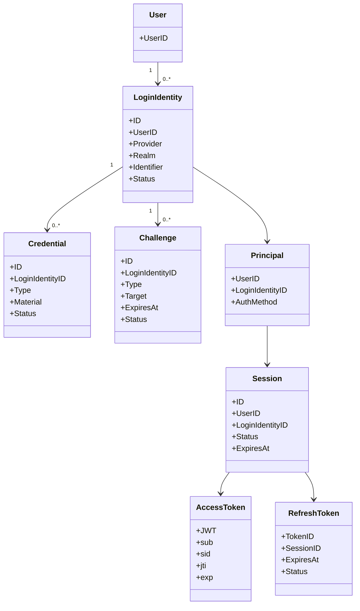

# AuthN 领域模型图

> 状态：待补证据 · 骨架初稿，待与代码/契约核对。

```mermaid
classDiagram
    class User {
        +UserID
    }
    class LoginIdentity {
        +ID
        +UserID
        +Provider
        +Realm
        +Identifier
        +Status
    }
    class Credential {
        +ID
        +LoginIdentityID
        +Type
        +Material
        +Status
    }
    class Challenge {
        +ID
        +LoginIdentityID
        +Type
        +Target
        +ExpiresAt
        +Status
    }
    class Principal {
        +UserID
        +LoginIdentityID
        +AuthMethod
    }
    class Session {
        +ID
        +UserID
        +LoginIdentityID
        +Status
        +ExpiresAt
    }
    class AccessToken {
        +JWT
        +sub
        +sid
        +jti
        +exp
    }
    class RefreshToken {
        +TokenID
        +SessionID
        +ExpiresAt
        +Status
    }
    User "1" --> "0..*" LoginIdentity
    LoginIdentity "1" --> "0..*" Credential
    LoginIdentity "1" --> "0..*" Challenge
    LoginIdentity --> Principal
    Principal --> Session
    Session --> AccessToken
    Session --> RefreshToken
```
