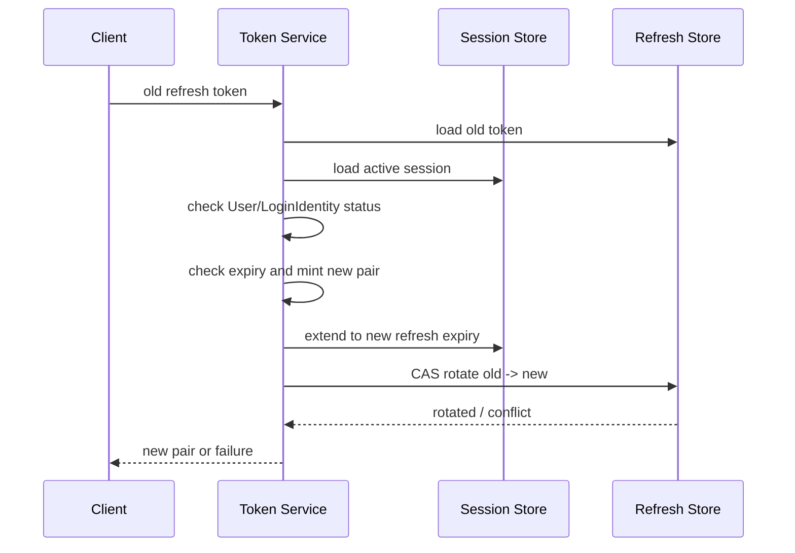

# Session、Token 与 JWKS

> 状态：已实现 · 本文解释令牌签发、刷新、撤销和两种验签语义，并标出当前实现的失败窗口。

## 1. 当前方案不是“纯 JWT”

用户访问采用混合状态模型：

```text
RS256 Access Token
  + Redis Session
  + Redis access-token revocation marker
  + Redis Refresh Token
  + MySQL/JWKS key lifecycle
```

JWT 负责可验证声明，Redis 负责在线撤销和续期状态，MySQL 负责签名密钥生命周期的持久事实。服务令牌是例外：它只有 access token，不创建用户 Session，也没有 refresh token。

## 2. 登录签发

`IssueToken` 的实际步骤是：

1. 用 Principal 创建 Session；
2. 在 Session 上 mint access/refresh pair；
3. 把 refresh token 保存到 Redis；
4. 返回令牌对。

Access token 包含 user、login identity、session、tenant、auth method、realm、AMR 等声明并由当前 active key 签名。Refresh token 是不透明随机值，服务端存储其结构化状态。

### 当前失败窗口

Session 创建成功后，若 mint 或 `SaveRefreshToken` 失败，请求返回失败，但已创建 Session 不会在同一事务中回滚。它没有暴露可用 refresh token，通常只能等待 TTL 或由清理逻辑收敛，但会产生短期孤儿 Session 和额外索引占用。

可选改进包括：保存失败时补偿撤销 Session，或用一段 Redis Lua 原子创建 Session 与 refresh token。后者原子性更强，但会把更多领域结构绑定到单个 Redis 脚本。当前代码尚未实现这两种改进。

## 3. Session 生命周期与滑动续期

`LifetimePolicy` 同时限制：

- `refreshTTL`：每次 refresh 后令牌的滑动窗口；
- `sessionMaxTTL`：从 Session 创建开始计算的绝对上限。

新 refresh 的到期时间取 `now + refreshTTL` 与绝对上限中的较早者。这样活跃用户可以续期，但不能无限延长一条已长期存在的登录会话。

Session 在 Redis 中除主记录外，还维护按 User 和 LoginIdentity 的索引，以支持“退出全部设备”、禁用身份和封禁用户后的批量撤销。多键更新使用 WATCH 重试，失败必须显式返回，不能假装部分索引已经一致。

## 4. Refresh Token Rotation

刷新流程当前按以下顺序执行：



`RotateRefreshToken(oldValue, expectedOldID, newToken)` 由 Redis Lua 原子完成：只有旧值仍存在且 ID 与预期相符时，才写入新值并删除旧值。两个并发 refresh 只有一个能成功，另一个得到“旧 token 已消费”的冲突，而不是同时获得两组有效 refresh token。

### 当前顺序的残余风险

Session 是先延长，refresh token 后轮换。如果轮换最终冲突或 Redis 报错，请求不会拿到新令牌，但 Session TTL 可能已经被延长。这不直接产生可使用的新凭证，却意味着失败请求也可能改变 Session 生存时间。

更严格的设计可把 Session 延长和 refresh 轮换放进同一 Lua 脚本，或先轮换再以幂等方式延长；前者要求两类键和校验逻辑共享一个原子脚本，后者则要处理“令牌已轮换但 Session 延长失败”的更危险窗口。当前选择优先避免发出已轮换但无活跃 Session 的令牌，接受失败时 TTL 可能延长的较小风险。

## 5. 撤销语义

撤销有三层：

- Access token：按 token ID 写入带 TTL 的 revocation marker；
- Refresh token：撤销关联 Session，再删除 refresh token；
- Session：按 session、User 或 LoginIdentity 撤销。

Identity 的 deactivate/block 会在同一 MySQL 事务中写 session-revocation outbox，后台 worker 最终撤销 Redis Session；同时在线 Token 验证还会读取当前 User/LoginIdentity 状态，关闭事件消费延迟窗口。详见 [Identity 与 AuthN 的边界](../01-Identity/04-模块边界-Identity与AuthN-AuthZ-Suggest.md) 与 [事件和 Transactional Outbox](../../03-基础设施/03-事件与Transactional-Outbox.md)。

## 6. IAM 在线验证与 SDK 本地验签不是一回事

IAM 内部 `token.verifier.VerifyToken` 对用户 token 执行：

1. 验签和标准 claims 校验；
2. 查询 access-token revocation marker；
3. 加载 active Session；
4. 检查 User/LoginIdentity 当前状态。

对于 service token，当前验证器在识别 `TokenTypeService` 后直接返回 claims，不走用户 Session 与主体状态检查；服务访问还必须由传输层服务身份策略和 AuthZ 约束。

SDK `LocalVerifyStrategy` 只从 JWKS 获取公钥并做签名、issuer、audience、clock skew 和 required claims 校验。它无法仅凭 JWKS 知道：

- token 是否刚刚被主动撤销；
- Session 是否退出或过期；
- User 是否刚刚被封禁；
- LoginIdentity 是否刚刚被禁用。

因此本地验签适合低延迟、可接受 access-token 剩余寿命窗口的服务；需要即时撤销语义时，应使用 IAM 远程验证或在网关集中执行在线检查。缓存与 fallback 不能被描述为等价安全语义。

## 7. JWKS 与密钥轮换

服务端使用 RS256：私钥用于签名且经 AES-GCM 保护后持久化，JWKS 只发布 active/grace key 的公钥信息。密钥经历 active、grace、retired 状态，使旧 access token 在轮换后的有限窗口内仍可验证。

轮换必须协调“新 key 可签名”和“验证方已能看到新公钥”。当前实现以 MySQL keyset 状态、原子 activation、内存发布快照和周期调度器完成生命周期；完整实现见 [密码学、密钥与令牌](../../03-基础设施/04-密码学密钥与令牌.md)。

## 8. 备选设计

| 设计 | 优点 | 代价 | 适用判断 |
| --- | --- | --- | --- |
| 纯离线短 JWT | 服务无状态、低延迟 | 不能即时撤销 | 可接受短撤销窗口 |
| opaque token + introspection | 状态统一、即时撤销 | IAM 成为每请求热路径 | 强控制、规模可承受 |
| 当前混合方案 | 大多数服务可本地验签，关键路径可在线检查 | 两套语义、Redis 依赖、运维复杂 | 当前选择 |
| refresh token family/reuse detection | 可发现旧 token 被重放并撤销整个家族 | 需要 family 状态与事件处理 | 高风险场景可增强 |

当前 rotation 防止同一 refresh token 并发成功两次，但没有完整 token-family reuse detection；“旧 token 再次出现”只会失败，不自动推断整条家族已泄漏并批量撤销。

## 9. 面试追问

### JWT 被签名后为什么还要查 Redis？

签名只能证明内容由可信签发者产生且未被篡改，不能表达签发后的退出、封禁、身份禁用。Redis 在线状态用于收敛这段时间差。

### Refresh rotation 如何防并发重放？

不能用 Get/Set/Delete 三步；两个请求会同时读到旧值。当前通过“旧值和旧 ID 仍匹配才写新值并删旧值”的 Lua CAS，使消费成为原子操作。

### JWKS 为什么需要 grace key？

轮换前签发的 token 仍由旧私钥签名。如果立刻删除旧公钥，所有未过期 token 会同时失效。grace 窗口应至少覆盖允许验证的旧 token 寿命和缓存传播时间。

## 10. 事实来源与验证

- 签发/刷新/验证：`internal/apiserver/application/authn/token`
- Session 领域：`internal/apiserver/domain/authn/session`
- Redis 存储：`internal/apiserver/infra/redis/authn`
- Key/JWKS 应用：`internal/apiserver/application/authn/jwks`
- SDK：`pkg/sdk/auth/jwks`、`pkg/sdk/auth/verifier`
- 重点测试：`token/refresher_atomic_test.go`、`token/principal_session_test.go`、`session/lifetime_policy_test.go`、`pkg/sdk/auth/jwks/jwks_test.go`

```bash
/Users/yangshujie/.gvm/gos/go1.25.12/bin/go test \
  ./internal/apiserver/application/authn/token \
  ./internal/apiserver/domain/authn/session \
  ./internal/apiserver/application/authn/jwks \
  ./pkg/sdk/auth/jwks ./pkg/sdk/auth/verifier
```
