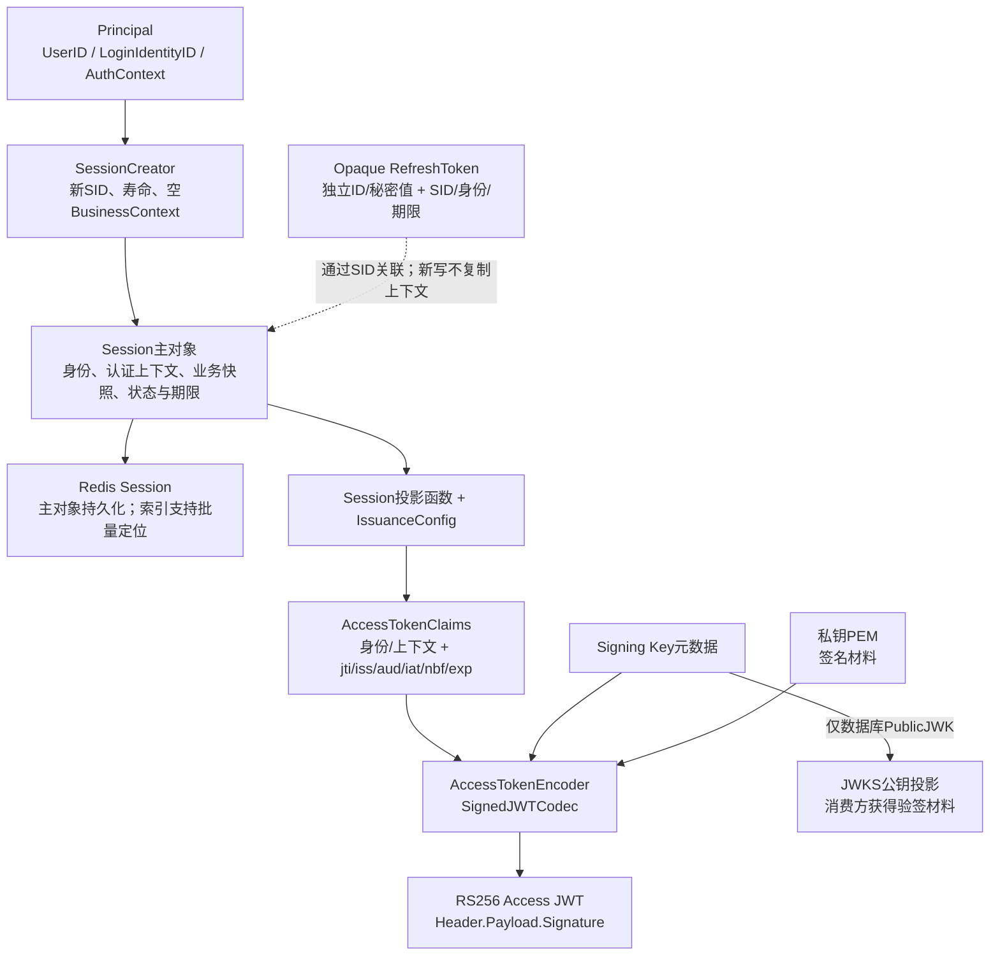
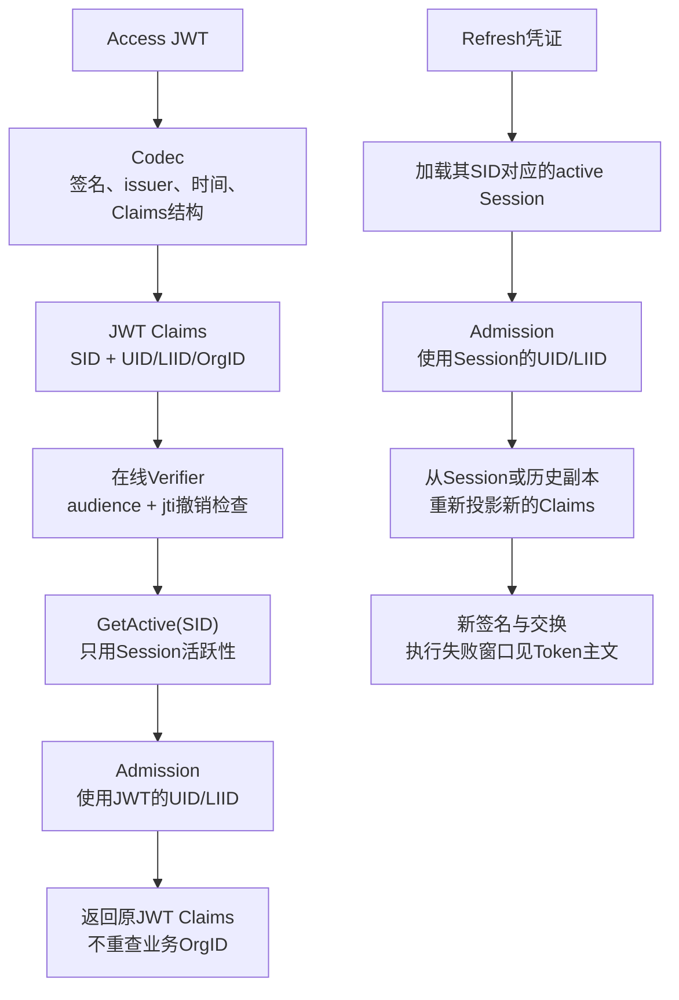

# Session、Token 与 JWKS

> 状态：已实现 · 当前设计与实现。本文定义认证事实、在线状态与签名声明的对象合同，说明构造/恢复、投影、寿命与历史兼容的责任。操作顺序与失败补偿由 [Token 主链路](05-关键链路-Token签发刷新吊销.md)维护；私钥、轮换及消费者缓存由 [JWKS 主链路](06-关键链路-JWKS与本地验签.md)维护。文中的候选约束和源码推演分别标明。

## 1. 结论：认证事实、令牌声明与当前许可分别成立

同一 User 17 可以有密码入口31和微信入口32。两次登录分别建立S1、S2，保存各自的LoginIdentityID、核验方法与时间；只保存UserID会丢失“本次通过哪个入口核验”，无法按入口准入或解释近期认证。Session保存后续续期的上下文，Access JWT保存某次签发的声明，Refresh保存续期凭证与Session关联。它们共同服务登录态，但不共享一个“已认证且一直有效”的标志。

| 事实 | 当前拥有者 | 使用边界 |
| --- | --- | --- |
| 此次身份核验的结果 | Principal中的UserID、LoginIdentityID、AuthContext | SignIn继续检查Admission并建立会话；Principal没有SessionID或权限事实 |
| 后续续期使用的身份与上下文 | Redis Session主对象 | Refresh从Session重新投影；在线Verify只取其活跃性，不重新对齐所有JWT声明 |
| 某次访问令牌的签发声明 | 已签名的Access JWT | 在线Verify返回该JWT的Claims；签名不证明签发后的主体/组织仍有效 |
| 某个续期凭证能否交换 | Redis Refresh主对象、旧值的consumed marker | marker关联SID/UserID，不是完整token-family或实体版本 |
| 某个kid的签发/验签资格 | Signing Key元数据、PEM及key source | JWKS公开公钥投影，不保存会话，也不作业务授权 |
| 当前Resource/Action及公司/门店范围 | AuthZ策略事实与Runtime快照 | 不从Session、AMR或JWT角色字段推导 |


```mermaid
flowchart TB
  P["Principal<br/>UserID / LoginIdentityID / AuthContext"] --> C["SessionCreator<br/>新SID、寿命、空BusinessContext"]
  C --> S["Session主对象<br/>身份、认证上下文、业务快照、状态与期限"]
  S --> R["Redis Session<br/>主对象持久化；索引支持批量定位"]
  S --> F["Session投影函数 + IssuanceConfig"]
  F --> A["AccessTokenClaims<br/>身份/上下文 + jti/iss/aud/iat/nbf/exp"]
  A --> E["AccessTokenEncoder<br/>SignedJWTCodec"]
  E --> J["RS256 Access JWT<br/>Header.Payload.Signature"]
  T["Opaque RefreshToken<br/>独立ID/秘密值 + SID/身份/期限"] -. "通过SID关联；新写不复制上下文" .-> S
  K["Signing Key元数据"] --> E
  PKEY["私钥PEM<br/>签名材料"] --> E
  K -->|"仅数据库PublicJWK"| W["JWKS公钥投影<br/>消费方获得验签材料"]
```

图中的“Session投影函数”是`accessTokenClaimsFromSession`，没有名为AccessTokenProjector的当前端口。AuthN不颁发Service Token；服务身份由mTLS与ACL建立。JWT Claims Set是payload模型，JWS紧凑序列化另含Header和Signature；当前没有JWE，RS256保护完整性，payload仍可被读取。

## 2. 对象字段与校验责任

### 2.1 上下文与标识不能互换

`AuthenticationContext`保存Method、Realm、AMR、AuthenticatedAt。Method记录IAM实际执行的核验策略，例如`password`；AMR是核验手段声明，例如`pwd`，两者不是同一枚举。公开AuthMethod、proof.CredentialKind与结果Method也不总同名：微信小程序分别为`wechat_mini`、`oauth_wx_minip`、`wechat_minip`，领域Authenticator按proof kind分派。Realm是provider或入口命名空间，例如微信appid，不是OrgID或AuthZ授权空间。新上下文构造遇零认证时间会填现在；历史Restore保留未知零值，不把读取当成新的核验。

`BusinessContext`只有OrgID与Attributes。标准SessionCreator以空业务上下文建会话，登录不查询QS当前组织资格；保留的业务快照主要承接既有数据。它不拥有TokenID、签名、签发时间或期限，也不保存Assignment/PermissionGrant。若旧会话携带Org42，后续投影只能说明“来源会话曾有这份快照”，不能证明User17现在仍属于Org42。

`TokenMetadata`只有ID、IssuedAt和ExpiresAt；AccessToken另有Value、SID、UID、LIID，Subject从UserID派生。RefreshToken也有这些关联，旧AuthMethod/Realm/AMR/SessionClaims只为兼容读取保留。UserTokenSet只是访问/续期对象的组合，不证明保存成功、可在线验证或令牌已经交付。

### 2.2 强类型模型没有统一有效性门禁

| 入口 | 实际执行的约束 | 后续责任 |
| --- | --- | --- |
| Principal、AuthContext构造/恢复 | 保存字段、复制非空AMR；New补零时间，Restore保留零时间 | 不校验Method枚举、Realm完整性或时间因果；SignIn另调用Admission |
| Session.NewWithContexts | 设置active、另读时钟设置CreatedAt、复制上下文 | 没有Validate，不验证SID、非零身份、上下文或期限 |
| SessionCreator.Create | Principal非nil、初始寿命可计算、调用Save | 不独立证明User/入口active；正常Login上游已经做Admission |
| Redis SessionStore.Save | 对象非nil、剩余TTL为正、序列化及主对象/索引写入 | 不验证身份不变量、Status枚举或覆盖前的旧主体 |
| NewAccessTokenClaims | 默认缺类型为access、trim部分字符串、复制集合、UTC化时间并Validate | 只得到满足下列结构条件的可变对象，没有已验签标志 |
| IssuanceConfig及Verify请求 | 签发issuer/accessTTL/受众配置；接收方期望受众非空且元素非空 | 不从被验证JWT反推合法issuer或接收方 |
| Codec、在线Verifier、消费方授权 | 密码学/时间、在线状态/准入、业务能力分别检查 | 前一步成功不能代替下一步 |

Claims.Validate要求jti/sub/iss非空、Audience数组非空、iat/nbf/exp非零、exp>nbf、类型为access、SID及两种身份非零、sub等于UserID字符串。它不检查每个aud元素、iat≤exp、当前是否过期、OrgID资格、AMR或AuthenticatedAt。例如在当前10:00构造nbf=08:00、exp=09:00的完整Claims仍可成功，实际验签会拒绝过期；Audience为`[""]`也可通过这一个结构校验，签发配置及Verify请求另有更严格门禁。

这些是内部对象/调用合同的边界。正常公开Login依靠SignIn中的核验和Admission，不能据构造器宽松推导客户端可绕过准入。

### 2.3 复制集合不等于模型不可变

Claims构造会复制Audience、AMR、Attributes；Session投影也复制已有属性与AMR。字段仍公开可写，Session没有Clone或实体Version，AccessTokenClaims没有独立的Validated类型或Clone方法。

BusinessContext.Clone还有一个具体例外：只有Attributes长度大于0时复制map，已经分配的空map仍共享。

```go
attrs := map[string]string{}
original := session.BusinessContext{Attributes: attrs}
copied := original.Clone()
attrs["x"] = "v"
// 当前 copied.Attributes["x"] 同样是 "v"。
```

现有测试覆盖非空map的隔离，没有覆盖空map后新增键。标准新登录的空业务上下文没有分配这类map；上述例子说明内部所有权约束，不是公开输入漏洞的证明。若要承诺不可变快照，候选方案需同时处理空集合复制、私有字段/只读访问、恢复后的校验和既有调用方，单靠Clone命名不足。

## 3. 从Session投影到JWT、传输与请求上下文

### 3.1 一次签发产生新声明，不产生新的身份核验

TokenSetMinter从Session取身份、AuthContext和BusinessContext，再补UUID jti、canonical issuer、配置audience及有效期。一次Mint只捕获一个now；Access的iat/nbf/exp截到秒，领域AccessToken与签发DTO沿用同一jti/时间。Refresh使用同一次now，但IssuedAt和expiry不统一截秒。SessionCreator、Session构造及Mint各自读时钟，整个Login没有一份统一时间快照。

例如09:00核验、09:01建立S1、09:15刷新：新JWT的iat=09:15，auth_time仍为09:00。若历史AuthContext没有认证时间，投影退到CreatedAt=09:01；这是历史近似值，不能当作09:01另做了一次核验。敏感操作的近期认证检查应消费明确的认证时间，不能以刷新后的iat代替。

| 同一事实 | JWT payload | REST Verify Claims | gRPC / SDK投影 |
| --- | --- | --- | --- |
| User17 | `sub:"17"`、`user_id:"17"` | `subject:"17"`、`user_id:"17"` | Subject/UserID字符串 |
| 入口31 | `login_identity_id:"31"` | 同名字符串 | LoginIdentityId/LoginIdentityID |
| 会话S1 | `sid:"S1"` | `session_id:"S1"` | SessionId/SessionID |
| 令牌T1 | `jti:"T1"` | `jti:"T1"` | TokenId/TokenID |
| 原核验时间 | numeric `auth_time`秒 | `authenticated_at`时间字符串 | Timestamp/time.Time |
| 凭证用途 | `token_type:"access"` | Claims中的access | protobuf ACCESS / SDK access |

REST登录/刷新及gRPC TokenPair响应中的`token_type:"Bearer"`表达HTTP使用方式，与Claims中的access用途不同。middleware再把UserID构造为AuthZ主体`user:17`，不会把JWT的sub改成这一语法。应用token.TokenClaims是领域AccessTokenClaims的type alias；REST/gRPC/SDK模型另做传输投影，不能泛称每层都有独立的领域类型。

Method/Realm不写入固定JWT字段；AMR不是Role，OrgID不是当前公司Scope。既有v2 Attributes从Session经投影和codec复制，签发没有统一allowlist；v1/legacy恢复才使用authnclaims的过滤，当前allowlist只有auth_time。新属性必须追查来源、保留/删除规则和每个消费方，不能只加JSON字段。

### 3.2 wire容错会改变事实表达

AuthenticatedAt非零时，Encode同时写顶层numeric auth_time与Attributes里的RFC3339 auth_time，并以领域时间覆盖旧属性；亚秒精度不会保留。零认证时间不会主动生成该顶层声明或覆盖已有属性。Decode在顶层值>0时优先使用它，但不改写已有非空属性。若已签名输入顶层为10:00、属性为09:00，返回的AuthenticatedAt是10:00，Attributes仍是09:00；读时没有双写一致性修复。顶层≤0且属性可解析时才做历史时间fallback。

服务端wire的顶层auth_time为int64，字符串输入不能正常绑定；SDK local兼容RFC3339字符串。身份ID也有容错差异：codec的数字字符串解析失败返回0，UID/LIID随领域结构校验拒绝，OrgID=0不被拒绝；SDK local保留字符串并另行解析业务OrgID。例如`org_id:" 42 "`服务端解析为0，SDK的业务getter可trim后读42。非标准已签名输入不能假定服务端与SDK全等。

还有未覆盖的边界：数字可被ParseUint解析但超过meta.ID的MaxInt64上限时，codec的FromUint64会panic；不能概括为“任意非法ID均返回验证错误”。以上来自源码，现有一致性测试只证明构造样本，不证明这些边界已由专项保护。

### 3.3 在线验证读取JWT身份，刷新读取Session身份


```mermaid
flowchart TB
  J["Access JWT"] --> V["Codec<br/>签名、issuer、时间、Claims结构"]
  V --> Q["JWT Claims<br/>SID + UID/LIID/OrgID"]
  Q --> O["在线Verifier<br/>audience + jti撤销检查"]
  O --> G["GetActive(SID)<br/>只用Session活跃性"]
  G --> D["Admission<br/>使用JWT的UID/LIID"]
  D --> X["返回原JWT Claims<br/>不重查业务OrgID"]
  T["Refresh凭证"] --> S["加载其SID对应的active Session"]
  S --> A["Admission<br/>使用Session的UID/LIID"]
  A --> M["从Session或历史副本<br/>重新投影新的Claims"]
  M --> N["新签名与交换<br/>执行失败窗口见Token主文"]
```

标准可信mint保证新Claims从Session投影。在线Verify的GetActive只充当活跃门禁，没有把Session返回值用于重新核对或覆盖JWT UID/LIID/OrgID；Refresh则以Session身份准入并投影。假设内部错误写入把S1的UID从17改为42，旧JWT仍声明17，在线验证与Refresh会读取不同身份来源；这是源码推演的责任缺口，不等于客户端能篡改已签名JWT。

middleware依赖验证器返回结果：只要求响应非nil且Valid=true，Claims=nil仍继续；没有第二次Claims.Validate。真实标准验证器提供已校验Claims，这个保证来自依赖。它将完整Claims指针存入Gin上下文，并在非零/非空时分别写UID、LIID、OrgID、jti；SID、AMR、AuthTime需从完整Claims读取，不另造独立键。Go context中的AuthZ management actor从UID派生，仍需后续Resource/Action检查。

SDK local要求可信配置的AllowedIssuer；ExpectedIssuer只加一层约束。标准NewTokenVerifier构造时要求配置issuer/audience，单独strategy也可使用调用级ExpectedAudience；非nil选项会替换配置AllowedAudience，而非取交集或只在配置缺失时补齐。调用方必须提供可信的接收方约束。本地验证不读取Session、撤销或Admission，默认也不强制exp存在；RequireExpirationTime/RequiredClaims只补其各自约束，没有在线Claims的完整身份不变量。远程、cache与fallback的窗口由 [Token验证](05-关键链路-Token签发刷新吊销.md)和[JWKS接入](06-关键链路-JWKS与本地验签.md)维护。

## 4. 三种时间、滑动窗口与当前policy

| 时间 | 意义 | 当前规则 |
| --- | --- | --- |
| AuthenticatedAt | 原核验时间；缺失时可能取CreatedAt近似 | Refresh不把它提升到现在；Claims.Validate不检查未来值 |
| CreatedAt | Session构造时间 | 与核验/Mint时钟不同；绝对上限按当前policy计算 |
| Access iat/nbf/exp | 某次Access签发、生效、截止 | 秒级，AccessTTL按mint的now独立计算 |
| Session.ExpiresAt | 此Session的在线有效期限 | 正常Refresh以受限延期更新，Redis主对象TTL随它 |
| Refresh.ExpiresAt | 此续期秘密可交换的期限 | 受Session寿命限制；历史读取保留存储期限 |

正常续期的候选截止为`min(now + refreshTTL, ExpiryLimit(Session))`。ExpiryLimit分支必须分别理解：

1. sessionMaxTTL>0且CreatedAt非零：使用CreatedAt+`当前装配的`sessionMaxTTL。
2. 上述信息不可用但已有ExpiresAt非零：保留该期限，历史状态不会由这里获得更长窗口。
3. Session为nil或没有任何可用期限：返回“没有上限”。纯policy函数仍可能算now+refreshTTL；正常Loader先拒绝缺失/过期Session，不能把该保证归给所有policy调用。

例：Session10:00创建，ExpiresAt18:00，原policy最大8小时；15:00新实例装配4小时policy后，上限变成14:00，Loader会拒绝，即使存储ExpiresAt尚在未来。Loader不把这次绝对上限拒绝写成撤销；原记录仍active时，使用8小时policy的实例又可能允许它。重新放宽也可能恢复这种仅因policy被拒绝的会话，实际ExpiresAt已到期、已撤销或主记录已消失的对象则不能通过标准路径复活。这里是源码推演，当前没有policy热更新或变更专项证据。没有每Session原policy版本或持久化固定绝对截止，Redis Extend另检查当前active。

实体Session.Extend直接替换期限，甚至可将StatusExpired改回active；raw Extender.Extend没有寿命policy。正常Refresh使用ExtendToRefreshExpiry，并由Redis Store的active检查约束，两层责任不同。Session.IsExpired使用now>ExpiresAt，LifetimePolicy在now≥上限时拒绝；实体便利方法不能替代完整边界判定。

模板refreshTTL=168h、sessionMaxTTL=24h，初始期限通常已碰绝对上限，配置了滑动能力也不代表有实际滑动空间。AccessTTL没有裁到Session上限，末期JWT可能晚于Session失效；本地与在线结果因此不同，具体时间案例见 [Token寿命](05-关键链路-Token签发刷新吊销.md#51-寿命实际模板与可滑动能力分开)。

## 5. Redis恢复的是数据，不是重新完成认证

### 5.1 schema_version不是实体Version，也不是解码门禁

新Session JSON写schema_version=2、auth_context及沿用旧名的token_context。领域Session没有Version；decoder不使用SchemaVersion选择版本或拒绝未知值，而按嵌套对象是否非nil选来源。两个上下文各自整块优先，不逐字段补齐。

| 可解码的存储输入 | 当前恢复结果 |
| --- | --- |
| schema_version=999且上下文字段可解码 | 仍恢复；未知版本不会单独拒绝 |
| schema_version=2、只有旧AuthMethod=password | 从旧字段恢复，不因数字2认定迁移完成 |
| auth_context:{}加旧AuthMethod=password | 空typed对象覆盖旧字段，Method仍为空 |
| token_context:{}加旧SessionClaims.org_id=42 | typed业务对象优先，OrgID仍为0 |
| 没有token_context、旧SessionClaims含org_id=42及其他属性 | 提取OrgID，剩余属性按legacy allowlist保留 |
| 既有v2 token_context.Attributes含其他字段 | 直接复制属性，不套同一legacy过滤 |

Get只读，不回写v2或补索引；后续Save/Extend/Revoke实际写入payload时会重新编码为v2，这是触碰记录后的格式改写，没有全量迁移标志。time.Time旧字段使用omitempty不保证零时间键完全省略，“不填充legacy”不能扩大为所有旧JSON键必定消失。

decoder也没有统一Validate：不知道查询key的SID是否等于payload SID，不校验零身份、未知Status或Method。GetActive只检查活跃性与寿命；例如key对应A、payload SID为B，Get(A)可直接返回B。后续Admission、Claims和调用合同承担各自门禁，恢复成功不能当作登录准入证明。

### 5.2 状态与索引的持久性有限

IsActive只判断Status=active且未过期，不参考RevokedAt；内部脏对象active+RevokedAt非nil仍可判active。Get遇已过期active只修改返回副本为expired，不保存这次状态变化；Redis TTL通常最终删除主对象，不能把expired当永久审计记录。

Session主对象承载在线事实，丢失通常需要重新登录。用户/入口ZSet是批量定位索引；仅索引丢失不妨碍按SID读取，却可能漏掉按User/入口撤销。Get不重建它们。Save是同SID覆盖，没有NX或实体版本CAS；若内部调用方改变UID/LIID，只添加新索引，不移除旧索引，旧主体的批量撤销可能命中新主体。当前正常Creator使用新SID，模型依赖身份不被任意改写；上述覆盖后果是源码推演，尚无专项。

Extend/Revoke的WATCH保护的是Redis主key并发变化，不是SessionVersion，也没有覆盖“Session更新+Refresh交换”的共同事务。索引精度、过期清理及操作窗口见 [Redis](../../03-基础设施/02-Redis与缓存一致性.md)和[Token撤销](05-关键链路-Token签发刷新吊销.md)。

### 5.3 Refresh历史恢复只补副本

新Refresh JSON只写`token_id`、`session_id`、`user_id`、`login_identity_id`、`expires_at`，没有schema_version、IssuedAt、状态或版本；恢复构造的IssuedAt是读取时间，不能当作原签发证据。新写不复制旧认证/业务冗余，marker只记录被消费旧值的SID/UID。

历史Refresh fallback仅在Session的Method、Realm、AMR、AuthenticatedAt全部缺失时执行；任一存在就不读取旧refresh冗余。非空旧SessionClaims还会替换签发副本的BusinessContext；若仍没有AMR则用jwt。恢复不查当前业务组织，也不把副本完整写回Session。

Extender按SID重读原对象并更新expiry；新refresh又不含legacy字段。特殊空上下文第一轮可能从旧refresh恢复，下一轮却丢失这份数据。schema_version=2不证明认证信息完整，一次刷新不证明迁移完成；连续两轮例子由 [Token历史恢复](05-关键链路-Token签发刷新吊销.md#52-历史上下文整块回退只恢复到副本)维护。

## 6. 兼容退役：纯policy需要外部证据

| 当前兼容分支 | 增长时点 | 指标 |
| --- | --- | --- |
| Session四项认证上下文全空，进入旧refresh恢复 | 进入副本恢复时，即使旧字段为空或后续刷新失败 | iam_legacy_refresh_context_fallback_total |
| 已验签且issuer通过，JWT缺token_type，按access处理 | 领域Claims构造及在线检查之前 | iam_jwt_missing_token_type_total |
| JWT顶层auth_time≤0，属性时间成功解析 | 领域Claims构造及在线检查之前 | iam_jwt_legacy_attribute_auth_time_fallback_total |

counter统计调用分支，不统计唯一对象或成功请求。JWT后续结构/受众/撤销/准入失败也可已计数；完整v1 Session恢复后可能无需refresh fallback，故它们不是v1读取计数。纯SDK local不增加这些服务端counter，重复访问则可多次增加。

当前LegacyFallbackRetirementPolicy只被单测调用，生产没有装配自动退役门禁。它消费三个正TTL和外部声明的两个时间戳，计算：

```text
window = max(accessTokenTTL, refreshTokenTTL, sessionMaxTTL)
start = max(AllInstancesCurrentSince, AllFallbackMetricsZeroSince)
CanRetireAt = 两个时间戳非零 && now >= start + window
```

它不读取Prometheus、验证实例、扫描Redis、跟踪TTL变化或删除分支。Options默认/开发模板输入max(15m,7d,24h)=7d；生产模板AccessTTL为60m，最大值仍是7d。这些只是输入示例，不能据当前配置与七天无增长直接认定历史对象已清空。

例如旧Session没有CreatedAt但已有30天ExpiresAt，ExpiryLimit保留旧截止；旧Refresh也保留存储期限。对象若十天未被访问，不会增加fallback指标。当前TTL=7d不能证明这些对象在七天后失效。需要确认历史writer、滚动实例、恢复/回放输入以及实际寿命覆盖，指标静默只是其中一项证据。

维护方形成退役证据时应登记实例版本、TTL历史/长寿命对象、采集范围、counter重启/缺采样和静默起点；增长或寿命覆盖变化后重新确定窗口。确认全部旧writer退出并覆盖残存寿命后，才计划同批移除fallback、指标及相应历史读取测试。它们是退役维护要求，当前纯policy没有自动执行。没有真实环境证据，本文不宣告已经满足。

## 7. 当前取舍与具体演进约束

| 选择 | 解决的具体问题 | 代价与候选约束 |
| --- | --- | --- |
| JWT声明 + 在线Session | 下游可独立验签，IAM入口可感知退出/主体准入 | 依赖Redis；本地结果不含当前状态。消费方要先选择可接受的状态窗口 |
| 上下文集中在Session，新Refresh只留关联 | 新轮换不复制越来越旧的身份/业务冗余 | Session成为不可随意丢弃的事实；历史恢复需持久化与来源合同，不能只补签发副本 |
| 单个旧Refresh值的marker与关联Session撤销 | 已消费旧值重放可定位会话并拒绝续期 | 合法重复提交也可能撤销；没有family树或持久结果回执，具体窗口见Token主文 |
| 构造/恢复与准入分层 | 领域策略可测，兼容数据能逐步恢复 | 调用方必须组合门禁；严格构造器/恢复校验需区分未知历史值与真实非法输入 |
| 当前policy计算旧Session上限 | 配置收紧能影响既有会话 | 多实例配置差异会造成判定差异；固定绝对截止/policy revision需定义存量兼容及紧急收紧规则 |

若引入Session版本来绑定JWT/Refresh，先定义版本覆盖身份、认证上下文还是撤销，再决定是否每次在线比对、刷新如何CAS、旧JWT/旧JSON怎样过渡；给schema_version改名字不足以提供这些行为。若统一认证时间来源，需记录“原核验”“创建时间近似”“legacy属性恢复”的来源，敏感操作才能决定是否接受近似值。以上是候选设计，当前没有实现。

新增claim应核对Session来源、投影、codec、REST/gRPC、middleware、SDK及目标业务消费方；若校验组织资格，应明确由哪个业务事实源负责，而不是提升Realm/历史OrgID的含义。Unlink后状态、Admission在途窗口和AuthZ公司范围见 [Linking](03-关键链路-Linking登录身份绑定.md)及[跨模块授权边界](../03-AuthZ/07-模块边界-AuthZ与AuthN-Identity-Suggest.md)。

## 8. 事实源、验证与证据缺口

路径前缀为`internal/apiserver/`，除下表明确列出的共享/SDK路径。修改模型时从函数与字段进入，避免把源注释中的历史名称当现有对象。

| 合同 | 代码入口 | 当前测试及范围 |
| --- | --- | --- |
| Principal/AuthContext/复制 | domain/authn/authentication/principal.go、types.go | auth_context_test：New/Restore时间、非空AMR复制、Realm边界 |
| Session创建/加载/延期/寿命 | domain/authn/session/{session,creator,loader,extender,lifetime_policy}.go | roles_test、lifetime_policy_test：端口替身、非空map、期限分支 |
| Claims不变量/投影/单时钟 | domain/authn/token/{token,session_subject,issuer}.go | verified_claims、session_subject、issuance_contract：主体、类型、非空属性和签发样本 |
| wire兼容与索引 | infra/cache/redis/{session_store,token-store}.go | miniredis正常恢复、索引、WATCH/CAS；不是真实Redis部署 |
| JWT及传输投影 | infra/token/jwt/signed_jwt_codec.go、transport/{rest,grpc} | 真实RSA、miniredis、内存Session/allow-all Admission、直接handler/service调用 |
| 请求上下文与本地策略 | internal/pkg/{requestctx,middleware/authn}、pkg/sdk/auth/verifier | getter/setter及applyVerifiedClaims样本、SDK策略；不是完整路由/mTLS验收 |
| legacy退役 | domain/authn/token/legacy_fallback_retirement.go | 三个纯policy测试：最大TTL、23h/24h边界、无效TTL |

空map共享、未知schema、空typed覆盖legacy、key/payload SID错位、超大ID、auth_time双写冲突、policy变更与存量长寿命对象没有上述专项。现有模型测试通过不证明任意内部构造/历史数据有效，也不证明真实环境已达到退役条件。

```bash
go test -race ./internal/apiserver/domain/authn/authentication \
  ./internal/apiserver/domain/authn/session ./internal/apiserver/domain/authn/token \
  ./internal/apiserver/infra/cache/redis ./internal/apiserver/infra/token/jwt \
  ./internal/apiserver/transport/rest/authn/handler \
  ./internal/apiserver/transport/grpc/service/authn \
  ./internal/pkg/authnclaims ./internal/pkg/requestctx ./internal/pkg/middleware/authn \
  ./pkg/sdk/auth/verifier
```

命令是模型验证入口，执行结果与图文核对另记在[本轮复核记录](../../_data/reviews/2026-10-06-docs-refactor.md)。历史TenantID、AuthenticationGrant、Service Token及发布切换材料见[迁移发布](../../05-工程质量与运维/03-迁移发布与数据库运维.md)，不据当前源码推断部署完成。
