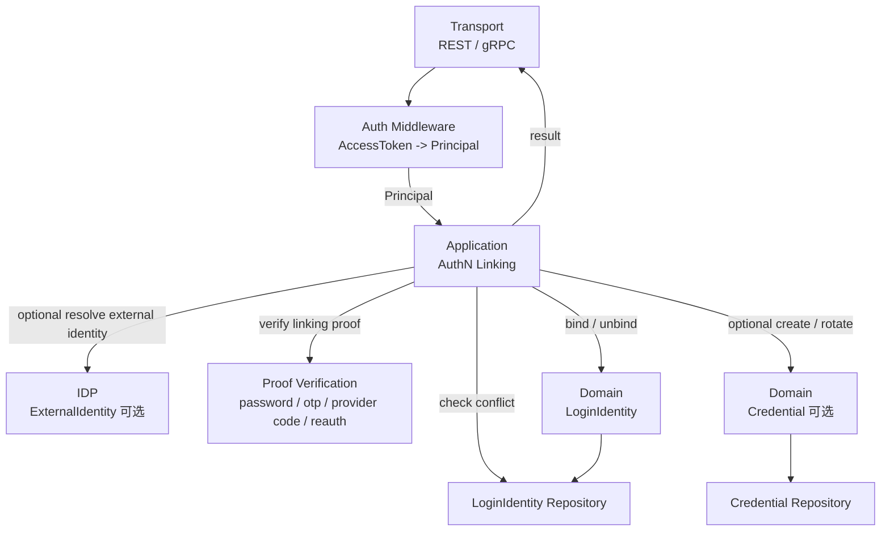
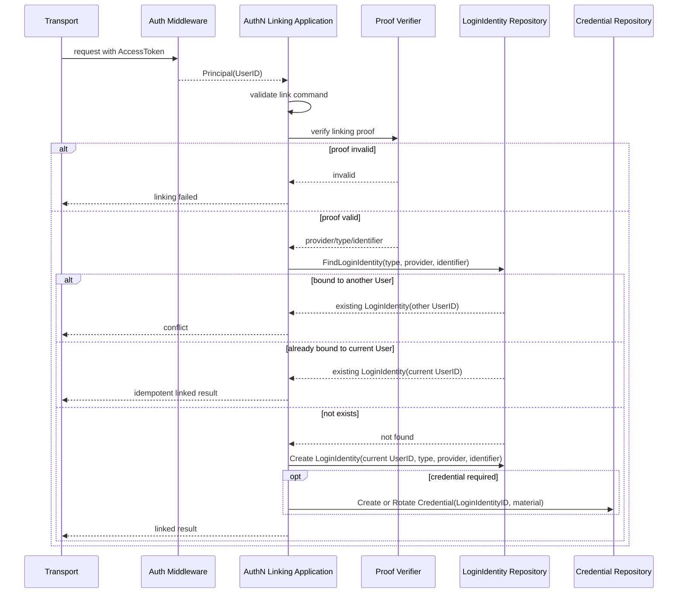
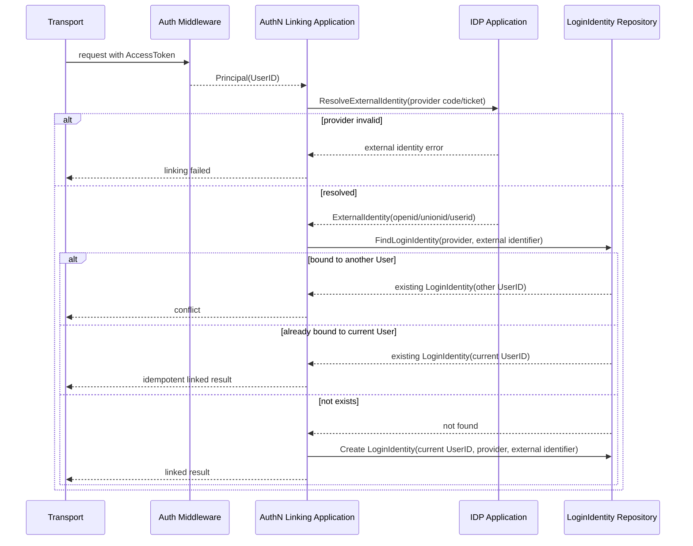
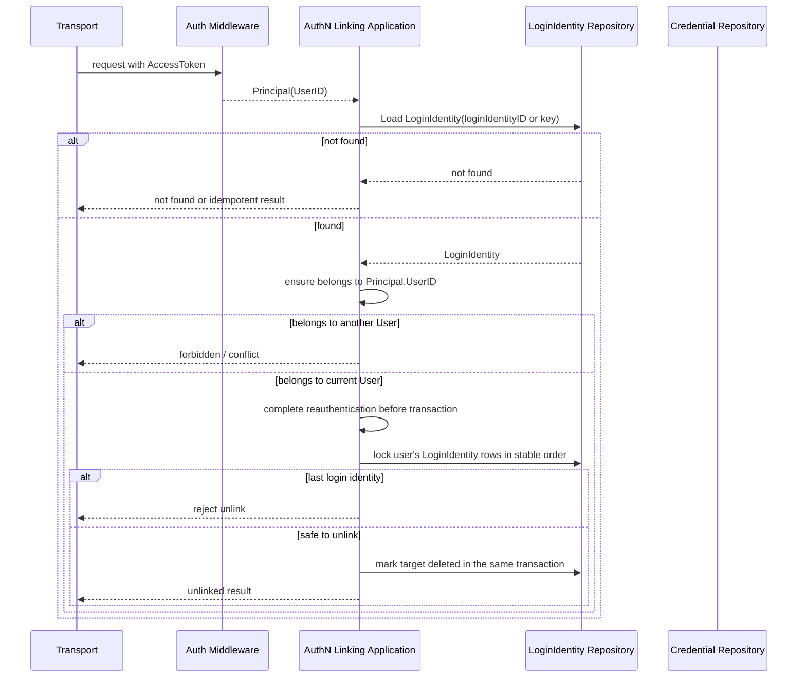

# 关键链路：Linking 登录身份绑定

> 状态：已实现 · 已核对当前解绑安全不变量；公开 REST/gRPC 契约未改变。

---

## 1. 本文回答

本文回答 8 个问题：

- Linking 登录身份绑定解决什么问题？
- Linking 与 Onboarding、Login、ProfileLink 的边界分别是什么？
- 为什么 Linking 必须基于已认证 `Principal`？
- 绑定新的 `LoginIdentity` 前需要哪些证明和冲突校验？
- 外部 IDP 登录身份绑定时，`ExternalIdentity` 如何变成 `LoginIdentity`？
- 解绑 LoginIdentity 时如何避免用户失去所有登录方式？
- Linking 的事务、幂等、并发和安全边界如何处理？
- 修改该链路时应该核对哪些代码和测试？

本文只讲“已认证用户绑定或解绑登录身份”的 AuthN 链路。Onboarding 身份开通见 [02-关键链路-Onboarding身份开通.md](02-关键链路-Onboarding身份开通.md)，AuthN 领域模型见 [01-领域模型-LoginIdentity-Credential-Challenge-Principal-Session-Token.md](01-领域模型-LoginIdentity-Credential-Challenge-Principal-Session-Token.md)。

---

## 2. 30 秒结论

Linking 是“已认证 User 给自己追加、替换或解绑登录身份”的链路。

它的前提是：

```text
当前请求已经认证成功；
请求上下文中存在 Principal；
Principal 能解析出当前 UserID。
```

核心主线：

```text
authenticated Principal
  -> verify linking proof
  -> resolve provider identifier / login identity key
  -> validate conflict
  -> bind or unbind LoginIdentity
  -> optional create / rotate Credential
```

最重要的边界：

```text
Linking 不是 Onboarding；
Linking 不是 Login；
Linking 不是 ProfileLink；
绑定登录身份不等于创建业务档案关系；
解绑 LoginIdentity 不等于删除 User；
解绑 LoginIdentity 不等于 revoke Session，除非明确有安全策略要求。
```

如果只记一句话：

> Linking 是在已认证 User 的上下文中管理 AuthN.LoginIdentity，不能绕过 Principal，也不能把登录身份绑定写成 Identity.ProfileLink。

---

## 3. Linking 的定位

Linking 用于管理一个已存在 User 的登录入口。

它回答：

```text
当前已认证 User 是否可以绑定一个新的登录方式？
该登录方式是否已经被其他 User 占用？
当前 User 是否已经绑定过该登录方式？
绑定前如何证明请求者控制该登录方式？
解绑后当前 User 是否仍保留至少一个可用登录方式？
```

典型场景：

```text
已登录用户绑定手机号；
已登录用户绑定微信小程序 openid；
已登录用户绑定企业微信 userid；
已登录用户设置或更换密码登录；
已登录用户解绑第三方登录；
后台为操作员追加登录方式，前提是有明确权限和审计。
```

---

## 4. Linking 与 Onboarding / Login / ProfileLink 的区别

| 链路 | 前提 | 目标 | 主要产物 |
| --- | --- | --- | --- |
| Onboarding | User 可能不存在 | 首次开通登录身份并绑定内部 User | User、LoginIdentity、可选 Credential |
| Login | 已有登录身份或挑战 | 证明请求者是谁 | Principal、Session、Token |
| Linking | 已有 Principal/UserID | 给当前 User 绑定或解绑登录身份 | LoginIdentity、可选 Credential |
| ProfileLink | 已有 User/Profile | 建立 User 与 Profile 的身份关系 | ProfileLink |

关键边界：

```text
Onboarding 可以创建 User；
Linking 通常不创建 User，而是基于当前 Principal.UserID；
Login 产生 Principal/Session/Token；
Linking 管理 LoginIdentity/Credential；
ProfileLink 属于 Identity，不属于 AuthN。
```

---

## 5. 链路总览



读图规则：

```text
Linking 必须从 Principal 出发；
Proof Verification 证明当前用户控制待绑定登录身份；
IDP 只解析外部身份声明；
LoginIdentity / Credential 属于 AuthN；
绑定目标 UserID 来自当前 Principal，而不是客户端传入。
```

---

## 6. 输入与输出

### 6.1 输入

Linking 输入通常包括：

| 输入类型 | 示例 | 说明 |
| --- | --- | --- |
| 当前认证上下文 | Principal / UserID | 从请求上下文获得，不应由客户端直接传入 |
| 待绑定登录身份 | type、provider、identifier | 手机号、用户名、openid、wecom userid 等 |
| 绑定证明 | password、OTP、provider code、reauth token | 用于证明控制该登录身份 |
| 凭据材料 | 新密码、credential material | 可选，取决于登录方式 |
| 安全上下文 | device、ip、risk signal | 可选，用于风控和审计 |

具体字段必须以 REST OpenAPI、gRPC proto 和当前 application command 为准。

---

### 6.2 输出

Linking 输出通常包括：

```text
UserID；
LoginIdentityID；
LoginIdentity Type；
Provider；
Identifier masked or normalized；
Linked / AlreadyLinked / Unlinked；
CreatedCredential / RotatedCredential；
NextStep。
```

注意：

```text
Credential material 不应出现在响应中；
password hash 不应出现在响应中；
provider access token 不应出现在响应中；
如果 Linking 不组合 Login，不应返回 AccessToken / RefreshToken。
```

---

## 7. 绑定 LoginIdentity 链路

### 7.1 链路目标

绑定 LoginIdentity 的目标是：

```text
把一个新的登录身份绑定到当前已认证 User。
```

绑定前必须确认：

```text
当前请求者已经认证；
待绑定登录身份可被证明控制；
该登录身份未被其他 User 绑定；
如果已绑定当前 User，应返回幂等结果；
需要 Credential 的登录方式已创建或更新 Credential。
```

---

### 7.2 标准绑定时序图



注意：

```text
UserID 必须来自 Principal；
客户端不应指定要绑定到哪个 UserID；
绑定证明的具体形式取决于登录方式；
幂等返回还是 conflict 需要以当前 API 语义为准。
```

---

## 8. 外部 IDP 绑定链路

外部 IDP 绑定通常用于微信、企业微信或 OAuth/OIDC provider。



关键边界：

```text
ExternalIdentity 不是 User；
ExternalIdentity 不是 LoginIdentity；
openid / unionid / wecom userid 是 LoginIdentity identifier；
IDP AppToken 不是 IAM AccessToken；
IDP 不签发 IAM Token；
外部 IDP 绑定通常不需要本地长期 Credential。
```

---

## 9. 绑定证明 Proof

Linking 必须证明当前用户确实控制待绑定登录身份。

| 登录身份类型 | 可能的绑定证明 | 说明 |
| --- | --- | --- |
| phone | SMS OTP Challenge | 证明当前用户控制手机号 |
| email | Email OTP Challenge | 证明当前用户控制邮箱 |
| username/password | 当前登录二次确认 + 新密码规则 | 可能需要 reauth |
| wx_minip | 微信 code -> ExternalIdentity | 证明当前用户控制该微信身份 |
| wecom | 企业微信 code -> ExternalIdentity | 证明当前用户控制该企微身份 |
| operation account | 管理端权限 + 初始密码 / 邀请链接 | 需要额外审计 |

关键规则：

```text
不能只凭客户端提交 identifier 就绑定；
手机号绑定需要验证码或等价 proof；
外部 provider 绑定需要 provider code/ticket 解析；
高风险绑定应要求 reauth 或二次确认；
Proof 成功不等于资源授权通过。
```

---

## 10. Credential 的创建与轮换

不是所有绑定都需要创建 Credential。

| 场景 | Credential 行为 |
| --- | --- |
| 绑定手机号 + OTP 登录 | 通常不创建长期 Credential，OTP 属于 Challenge |
| 绑定用户名密码 | 创建 password Credential |
| 修改密码 | 轮换 password Credential |
| 绑定微信 / 企微 | 通常只创建 LoginIdentity，不创建长期 Credential |
| 绑定后台操作账号 | 可能创建 password Credential 或邀请凭据 |

边界：

```text
Credential 不保存明文密码；
Credential 不应返回给客户端；
Credential 轮换不等于 LoginIdentity 改变；
Credential 创建失败时，LoginIdentity 是否保留需要明确事务或补偿策略。
```

---

## 11. 解绑 LoginIdentity 链路

### 11.1 链路目标

解绑 LoginIdentity 的目标是：

```text
让当前 User 不再能通过某个登录身份登录。
```

解绑不负责：

```text
删除 User；
删除 Profile；
删除 ProfileLink；
撤销所有 Session，除非有明确安全策略；
删除 AuthZ RoleBinding；
删除 Suggest Index。
```

---

### 11.2 解绑时序图



---

### 11.3 解绑规则

解绑需要重点保护“账户可恢复性”。

当前规则：

```text
不能解绑其他 User 的 LoginIdentity；
不能让当前 User 没有任何可用登录方式，除非有管理员恢复机制；
解绑高风险身份前要求 recent authentication；
reauthentication 在数据库事务前完成；
MySQL 事务按 user_id、id 固定顺序锁定该用户的 LoginIdentity 行；
归属、目标状态、active 数量和 deleted 更新在同一事务中重新确认；
两个活跃身份并发解绑只允许一个成功，另一个拒绝解绑最后一个活跃身份；
解绑当前不自动 revoke Session；
解绑应保留审计记录。
```

常见策略：

| 策略 | 说明 |
| --- | --- |
| 软解绑 / disable | 保留 LoginIdentity 历史，标记不可用 |
| 物理删除 | 简单但丢失历史，不推荐作为默认策略 |
| 解绑并 revoke 当前身份相关 Session | 更安全，但影响用户体验 |
| 解绑不 revoke Session | 用户仍可保持当前登录态，后续不能用该身份再次登录 |

具体策略必须以代码和产品安全要求为准。

---

## 12. 幂等与并发

### 12.1 绑定幂等

理想情况下：

```text
同一 User 重复绑定同一 LoginIdentity，返回已绑定结果；
同一 LoginIdentity 绑定到其他 User，返回 conflict；
同一 provider + identifier 不重复创建多条 active LoginIdentity。
```

---

### 12.2 解绑幂等

解绑幂等需要明确 API 语义：

```text
解绑不存在或不属于当前 User 的 LoginIdentity 返回 not found；
重复解绑已非 active 的 LoginIdentity 保持幂等删除；
解绑最后一个 active LoginIdentity 返回现有 invalid argument 错误。
```

---

### 12.3 并发风险

| 风险 | 说明 |
| --- | --- |
| 两个请求同时绑定同一个 provider identifier | 需要唯一约束兜底 |
| 两个请求同时把同一 identity 绑定到不同 User | 必须只有一个成功 |
| 解绑和登录同时发生 | 需要定义 LoginIdentity 状态读取一致性 |
| 同时解绑多个登录身份 | 可能绕过“至少保留一个登录方式”的检查 |
| Credential 轮换与登录同时发生 | 需要版本或事务保证一致性 |

建议：

```text
provider + identifier 建唯一约束；
绑定与解绑用例应有事务边界；
解绑最后一个身份的检查和写入已由 application-owned 原子端口落到同一 MySQL 事务；
并发冲突映射为 conflict 或可重试错误；
重要操作记录审计日志。
```

---

## 13. 事务边界

Linking 可能涉及：

```text
LoginIdentity；
Credential；
Challenge；
IDP ExternalIdentity；
Session revoke，可选；
Audit event，可选。
```

推荐原则：

```text
绑定 LoginIdentity 和创建/轮换 Credential 应在同一用例事务内完成；
解绑 LoginIdentity 和禁用相关 Credential 应保持一致；
外部 IDP 解析不应放在数据库事务中长时间持有锁；
IDP 解析成功但本地写失败，不应认为绑定成功；
安全审计可以通过 outbox/event 异步投递，但主状态要清晰。
```

---

## 14. 失败边界

| 场景 | 期望行为 | 说明 |
| --- | --- | --- |
| 未认证请求绑定身份 | 拒绝 | Linking 必须有 Principal |
| Principal.UserID 缺失 | 拒绝 | 不能由客户端补 UserID |
| 绑定证明失败 | 拒绝 | OTP/code/password/reauth 失败 |
| provider code 无效 | 拒绝 | IDP 解析失败 |
| LoginIdentity 已绑定其他 User | conflict | 防止账号串绑 |
| LoginIdentity 已绑定当前 User | 幂等返回或状态提示 | 以 API 语义为准 |
| Credential material 无效 | 拒绝 | 密码强度、格式、hash 失败等 |
| Credential 创建失败 | 整体失败或补偿 | 不能返回绑定成功但不可认证 |
| 解绑其他 User 的 LoginIdentity | forbidden / conflict | 防止越权解绑 |
| 解绑最后一个可用登录身份 | 拒绝 | 避免账户失联 |
| repository 保存失败 | 返回服务端错误 | 不应伪造成成功 |

---

## 15. 与其他模块的边界

### 15.1 与 Identity

```text
Linking 使用 Principal.UserID；
Principal.UserID 引用 Identity.User；
Linking 不创建 Profile；
Linking 不创建 ProfileLink；
解绑 LoginIdentity 不删除 User；
User 状态由 Identity 维护。
```

---

### 15.2 与 IDP

```text
IDP 负责解析外部身份证明；
ExternalIdentity 不是 LoginIdentity；
AuthN 根据 ExternalIdentity 创建或匹配 LoginIdentity；
IDP AppToken 不是 IAM AccessToken；
IDP 不直接修改 LoginIdentity repository。
```

---

### 15.3 与 AuthZ

```text
Linking 本身不是授权判定；
管理端代用户绑定身份可能需要 AuthZ Check；
普通用户给自己绑定身份主要依赖 Principal + Proof；
绑定 LoginIdentity 不创建 RoleBinding；
解绑 LoginIdentity 不删除 Permission。
```

---

### 15.4 与 Suggest

```text
Linking 不维护 Suggest Index；
绑定手机号或微信不等于创建 Profile 搜索项；
Suggest 可以使用 Principal/UserID 作为查询上下文；
搜索可见性仍由 Suggest/ProfileAccessScope/AuthZ 控制。
```

---

## 16. 常见反模式

| 反模式 | 问题 | 推荐做法 |
| --- | --- | --- |
| 客户端传 UserID 决定绑定对象 | 可越权绑定 | UserID 必须来自 Principal |
| 未登录也允许 Linking | 与 Onboarding 混淆 | 未登录首次开通走 Onboarding |
| 只提交手机号就绑定 | 无法证明控制手机号 | 需要 OTP Challenge |
| openid 直接当 UserID | 外部身份和内部身份混淆 | openid 是 LoginIdentity identifier |
| 绑定 LoginIdentity 时创建 ProfileLink | AuthN/Identity 关系混淆 | ProfileLink 只表达 User/Profile 业务档案关系 |
| 解绑 LoginIdentity 时删除 User | 登录入口和内部身份混淆 | 解绑只影响登录方式 |
| 允许解绑最后一个登录方式 | 用户可能无法恢复账户 | 至少保留一个可用登录方式或提供恢复机制 |
| 绑定成功但 Credential 创建失败 | 产生不可用登录身份 | 事务或补偿保证一致性 |
| Linking 直接写 RoleBinding | AuthN 吞并 AuthZ | 授权归 AuthZ 用例 |
| Linking 直接写 Suggest Index | AuthN 污染搜索读模型 | Suggest 通过读模型刷新处理 |

---

## 17. 代码事实源

| 事实 | 路径 |
| --- | --- |
| AuthN domain | `../../../internal/apiserver/domain/authn` |
| LoginIdentity 模型 | `../../../internal/apiserver/domain/authn` |
| Credential 模型 | `../../../internal/apiserver/domain/authn` |
| Challenge 模型 | `../../../internal/apiserver/domain/authn` |
| Principal 模型 | `../../../internal/apiserver/domain/authn/authentication/principal.go` |
| AuthN linking application | `../../../internal/apiserver/application/authn` |
| IDP ExternalIdentity | `../../../internal/apiserver/domain/idp` |
| AuthN infra repository | `../../../internal/apiserver/infra` |
| AuthN REST transport | `../../../internal/apiserver/transport/rest` |
| AuthN gRPC transport | `../../../internal/apiserver/transport/grpc` |
| AuthN container | `../../../internal/apiserver/container/authn` |
| REST 契约 | `../../../api/rest` |
| gRPC 契约 | `../../../api/grpc` |
| 架构测试 | `../../../internal/pkg/architecture` |

注意：上表中的具体路径需要继续与当前源码核对。如果源码目录已调整，应以代码为准并同步更新本文。

---

## 18. Verify

修改本文后至少执行：

```bash
make docs-hygiene
```

涉及 AuthN 领域模型：

```bash
go test ./internal/apiserver/domain/authn/...
```

涉及 AuthN linking / application 用例：

```bash
go test ./internal/apiserver/application/authn/...
```

涉及 IDP 协作：

```bash
go test ./internal/apiserver/domain/idp/...
```

涉及 REST/gRPC 契约或 transport：

```bash
make api-validate
make proto-gen
go test ./internal/apiserver/transport/rest/...
go test ./internal/apiserver/transport/grpc/...
```

涉及分层依赖或模块边界：

```bash
go test ./internal/pkg/architecture
```

---

## 19. 本文总结

Linking 登录身份绑定可以压缩成：

```text
AccessToken -> Principal(UserID)
  -> verify linking proof
  -> resolve provider/type/identifier
  -> check LoginIdentity conflict
  -> bind / unbind LoginIdentity
  -> optional create / rotate / disable Credential
```

最重要的边界是：

```text
Linking 必须基于已认证 Principal；
UserID 必须来自 Principal，不来自客户端参数；
Linking 不是 Onboarding；
Linking 不是 Login；
Linking 不是 ProfileLink；
绑定登录身份不等于创建业务档案关系；
解绑登录身份不等于删除 User；
解绑时必须避免让用户失去所有可用登录方式。
```

下一篇应继续编写 Login 认证主链路，说明请求者如何通过 Credential 或 Challenge 证明自己，并如何生成 Principal、Session、AccessToken 与 RefreshToken。
