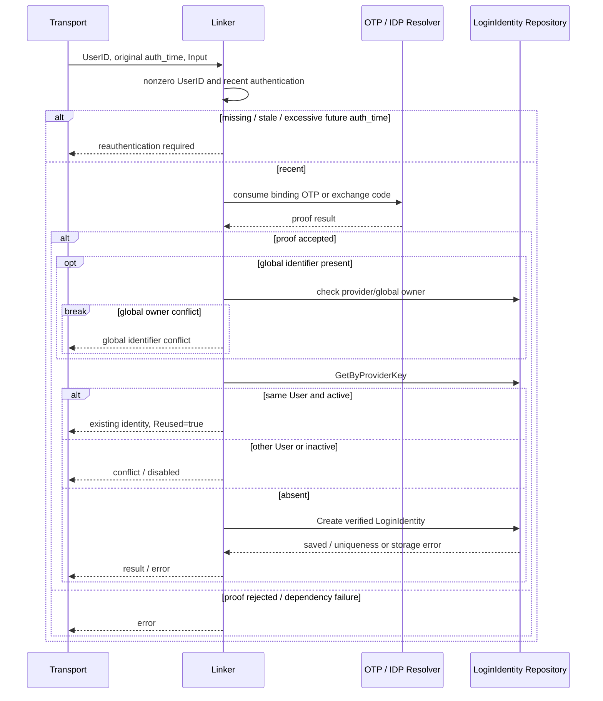
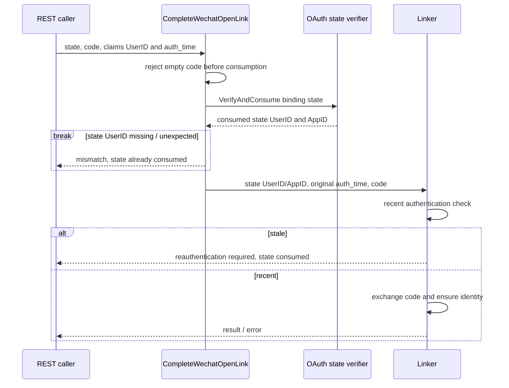
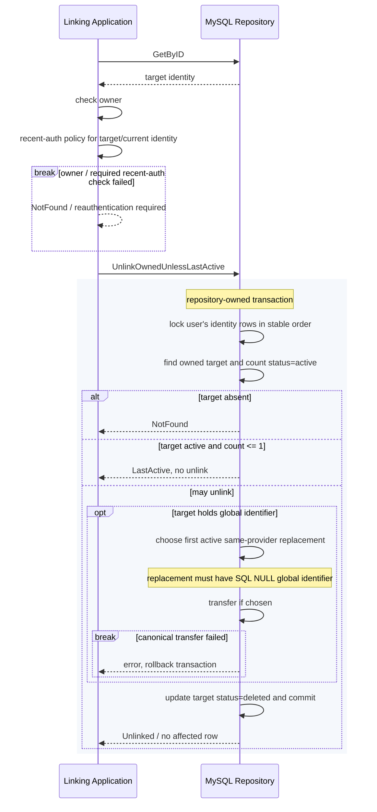

# 关键链路：Linking 登录身份绑定

> 状态：已实现 · 当前设计与实现。 本文负责绑定、解绑的证明来源、执行顺序、唯一性、失败窗口与会话影响；候选改进在第 8 节单独说明。

## 1. 结论：给已有主体增加入口，必须分别证明主体与新入口

Linking 将新的 LoginIdentity 归属于已有 User，或使其已有入口不可继续认证。新增绑定有两个独立条件：**当前主体最近完成过认证，请求者也控制待绑定入口**。原始 `auth_time` 用于前者，绑定 OTP / provider code 用于后者。拿到新手机号验证码，不证明可以修改任意 User；持有旧 access token，也不证明控制新微信身份。

当前 Link 只保存 LoginIdentity，不创建 User、Session、Token 或 password Credential，不修改 Profile 联系电话或 AuthZ Assignment。User 是稳定主体，登录手机号是入口，Profile 手机号是资料字段；同一号码出现在两处也不产生自动同步。注册事务见 [SignUp](02-注册登录与身份绑定.md)，对象定义见 [领域模型](01-领域模型与认证策略.md)。本文维护 Linking 的完整行为。

| 入口 | 新入口证明与长期 key | 公开能力 |
| --- | --- | --- |
| 手机号 | `link_phone` scene 的 OTP；`phone / global / phone` | REST、gRPC，另有发送绑定 OTP |
| 微信小程序 | Resolver 交换 code；`wechat_minip / appID / openid` | REST、gRPC |
| 微信开放平台 | Resolver 交换 code；`wechat_open / appID / openid`；扫码另核对 state | REST authorize / complete；没有对应 gRPC RPC |
| 企业微信 | Resolver 交换 code；`wecom / corpID / user_id` | REST、gRPC |

微信 unionid 是可选 GlobalIdentifier，不替代 realm 内 openid；索引包含 provider，小程序与开放平台不会仅凭相同 unionid 自动合并主体。企微 Linking 的 ProviderKey 要求 `user_id`，`open_user_id` 单独存在仍不能绑定。

gRPC `LoginIdentityService` 当前只有 ListLoginIdentities、SendPhoneLinkChallenge、LinkPhone、LinkWechatMiniProgram、LinkWecom、UnlinkLoginIdentity 六个方法。邮箱/用户名密码绑定、改密及独立再认证均没有当前公开 Linking 入口；不能把注册时创建 password Credential 当作这里的“设置密码”。

## 2. 可信操作者：REST 已验声明，gRPC 依赖获准服务正确断言

应用输入是 `LinkRequest{UserID, AuthenticatedAt, Input}`，结果是 `LinkResult{Identity, Reused}`。Input 有四种变体；归属 UserID 来自命令，AuthN mapper 只从 IDP ExternalIdentity 映射 provider key 和 VerifiedAt。**Linker 自身只检查 UserID 非零，不查询 User 是否存在/active，不重新验证用户令牌或 Session。**

| 字段/前置 | REST 自助入口 | gRPC 服务入口 |
| --- | --- | --- |
| UserID | JWT 中间件在线 Verify 后，从 claims 注入 | 请求 protobuf `Actor.user_id`，mapper 解析后转发 |
| 原始认证时间 | claims.AuthenticatedAt，缺失时有限兼容 `attributes.auth_time`；不取 body 时间 | `Actor.authenticated_at`；没有重新认证或与用户令牌比对 |
| 当前 LoginIdentityID | 已验 claims 注入的请求上下文 | `Actor.current_login_identity_id`，可空并解析成 0 |
| 调用准入 | `/api/v3/authn/login-identities/*` 挂 JWT；没有 AuthZ Permission 中间件 | 服务身份/方法准入与用户 Actor 是两层合同；IAM 不从服务证书构造用户 Actor |

REST 在线 Verify 检查签名/声明、access 类型、受众、撤销、Session 与 User/LoginIdentity Admission，再进入 handler。gRPC 调用服务负责验证最终用户、取原始认证时间及真实当前入口；“服务被 ACL 放行”本身不能证明目标用户最近认证。仓库 ACL 模板授予 `admin` 整个 LoginIdentityService，仅说明模板许可，不证明实际部署。完整服务准入见 [传输层安全](../../03-基础设施/05-传输层与服务间安全.md)。当前也没有独立的管理员代绑用例或用户委派授权检查。

这个区别会改变解绑分支：若获准服务遗漏真实的 current ID，目标外部身份即使实际上是当前登录入口，也可能按“非当前外部入口”处理而不要求最近认证；归属和最后 active 保护仍执行。协议调用方必须维持这个字段的真实性，不能从 mapper 的解析成功推导用户上下文已验证。

最近认证共用 RecentAuthenticationPolicy，默认 10 分钟窗口、1 分钟未来偏差。非零时间满足 `auth_time <= now + 1min` 且 `now - auth_time <= 10min` 才通过；恰好 10 分钟、恰好未来 1 分钟包含在默认边界内。缺失/零值、过旧或超过未来偏差拒绝。此策略检查时间新鲜度，不是一次操作级 MFA。

例如 t0 登录，t0+8min 可绑定；t0+12min 刚刷新 access token，原始认证时间仍是 t0，新增绑定依旧拒绝。OTP 校验时间、code 交换时间或令牌刷新时间都不能覆盖它。发送绑定 OTP、发起扫码 authorize 本身不检查最近认证；实际 Link 才检查，因此“发起成功”不保证最后提交成功。

## 3. Link：先检查当前认证，再证明新入口，最后裁决归属


```mermaid
sequenceDiagram
    participant T as Transport
    participant L as Linker
    participant V as OTP / IDP Resolver
    participant R as LoginIdentity Repository
    T->>L: UserID, original auth_time, Input
    L->>L: nonzero UserID and recent authentication
    alt missing / stale / excessive future auth_time
        L-->>T: reauthentication required
    else recent
        L->>V: consume binding OTP or exchange code
        V-->>L: proof result
        alt proof accepted
            opt global identifier present
                L->>R: check provider/global owner
                break global owner conflict
                    L-->>T: global identifier conflict
                end
            end
            L->>R: GetByProviderKey
            alt same User and active
                L-->>T: existing identity, Reused=true
            else other User or inactive
                L-->>T: conflict / disabled
            else absent
                L->>R: Create verified LoginIdentity
                R-->>L: saved / uniqueness or storage error
                L-->>T: result / error
            end
        else proof rejected / dependency failure
            L-->>T: error
        end
    end
```

三步各有不同事实来源：

1. 当前认证时间由 transport 提供，策略在 `prepareLink` 前判断。拒绝过旧主体时，不消费绑定 OTP、不调用 Resolver。
2. Phone 输入先规范化号码，验证并消费 `link_phone` scene 的 OTP；该 Challenge 按 scene/号码定位，不绑定当前 UserID。它证明控制号码，归属仍由第 1 步的主体上下文决定。登录 OTP 与绑定 OTP 不通用。微信/企微提交 provider、realm、code 给 Resolver，结果映射为长期 key，provider code 的使用受外部平台交换约束。
3. 微信带非空 global identifier 时先查其 owner，再查询精确 provider key。通过后复用旧行或新建带 VerifiedAt 的行；不持久化 provider token、Secret 或可重放 proof，也不返回 IAM token pair。

OTP 消费/外部交换不处于 MySQL 事务中。应用 Link 没有包住全部阶段的 SignUp UoW；仓储创建 canonical 锚点时可以内部开启本地事务，两者并不矛盾。把外部交换放进长数据库事务，也无法令第三方 code 随 MySQL rollback 恢复。

| 失败/结果 | 当前处理及调用方含义 |
| --- | --- |
| UserID 为零、Input 为空或入口字段不满足 | 参数错误；主体/Input 预检在 proof 前，各 prepare 再验证具体字段 |
| 认证时间不满足 | ErrReauthenticationRequired，HTTP 401 / gRPC Unauthenticated；尚未进入 proof 阶段 |
| OTP 不匹配 | ErrInvalidCredential；OTP 仓储错误则包装为内部错误，均不放行 |
| IDP 不可用、查询/解密失败 | 当前 MapLinkingError 多数映射 ErrInvalidArgument；交换失败/无效响应映射 ErrInvalidCredential，不能仅凭分类可靠判断参数还是依赖故障 |
| global identifier 属于其他 User | ErrGlobalIdentifierExists，先于 provider-key 复用判断 |
| provider key 属于其他 User | ErrLoginIdentityExists，即使旧行非 active 也不转移归属 |
| provider key 属于同 User、非 active | ErrLoginIdentityDisabled，不静默复活 |
| provider key 属于同 User、active，global 预检也通过 | 返回原记录，Reused=true；proof 此前已使用 |
| 查询/保存/唯一约束失败 | 返回错误，不伪造成功；已使用的 proof 不能由数据库 rollback 恢复 |

错误注册、实际映射与协议描述要分别检查；当前 OpenAPI Linking 操作主要列成功响应，没有完整声明上述失败面。机器字段契约见 [REST YAML](../../../api/rest/authn.v3.yaml)、[gRPC proto](../../../api/grpc/iam/authn/v3/authn.proto)，不能把 YAML 存在当作失败合同已完整覆盖。

## 4. 扫码绑定：state 是流程约束，不是最近认证证明

REST authorize 从当前 claims 取 UserID，AppID/RedirectURI 取服务端配置，body 只有可选 nonce。Start 先存 `wechat_open_link` scene 的 Challenge，再构造 URL；若 URL 构造失败，没有删除已存 state 的补偿，记录沿原期限失效。

Challenge 保存 AppID、RedirectURI、Nonce、UserID；校验 type/scene/期限和 state hash 后一次性消费。登录 scene 与绑定 scene 隔离。回调不以 nonce 或 state 代替主体认证，Complete 仍需要原始 auth_time。


```mermaid
sequenceDiagram
    participant T as REST caller
    participant C as CompleteWechatOpenLink
    participant S as OAuth state verifier
    participant L as Linker
    T->>C: state, code, claims UserID and auth_time
    C->>C: reject empty code before consumption
    C->>S: VerifyAndConsume binding state
    S-->>C: consumed state UserID and AppID
    break state UserID missing / unexpected
        C-->>T: mismatch, state already consumed
    end
    C->>L: state UserID/AppID, original auth_time, code
    L->>L: recent authentication check
    alt stale
        L-->>T: reauthentication required, state consumed
    else recent
        L->>L: exchange code and ensure identity
        L-->>T: result / error
    end
```

图中消费成功后才继续；state 校验失败直接拒绝。Complete 内部用例的 ExpectedUserID=0 明确跳过用户对照，REST handler 始终传入当前非零 UserID。跨用户回调保护依赖正确的调用方注入，不能把内部可选项写成公开 REST 绕过。

| 停止位置 | 已发生什么 | 重试判断 |
| --- | --- | --- |
| Complete 的 code 为空 | state 尚未读取/消费 | 修正参数；仍要满足 state 本身有效 |
| state 不存在/过期/scene 或 hash 不匹配 | 未进入成功消费，不调用 Linker | 拒绝；不能统称“失败都已消费” |
| state 消费成功后 UserID 缺失/不匹配 | state 已删，未交换 code | 重新发起，不复用该 state |
| state 消费成功后认证过旧 | state 已删，Link 尚未交换 code | 重新认证，再重新发起扫码 |
| proof 已使用后归属冲突或保存失败 | OTP 已消费，或 code 已交换；扫码 state 也已消费 | 取得新证明；重复原请求不保证成功 |
| state/OTP 消费调用发生基础设施错误 | 请求拒绝；错误不充分证明远端消费未发生 | 按证明可能已使用处理，不能宣称零副作用 |

这个先消费的顺序防止 state 重放进入绑定，但代价是用户不匹配、认证过旧和本地保存失败都可能要求重启流程。若产品想“先提示认证过旧再扫码”，可在发起前增加检查；最终 Link 的检查仍需保留，因为扫码过程中认证时间继续变旧。

## 5. 复用与 canonical 锚点：结果幂等，不等于证明可重放

先证明、后查重意味着绑定已经存在时仍需控制新入口。若先 ensure 后跳过 proof，知道一个 identifier 的请求者就可能复用绑定。当前选择前者，代价是重复提交仍会消耗 OTP/code。

Reused 直接返回旧记录，不更新 VerifiedAt/LinkedAt，也不补写这次 proof 的 unionid。过去创建时没有 unionid 的同 provider key，即使这次返回 unionid，也不会自动 enrich；仍需先通过本次 global 预检。两个同时创建同 key 的请求由唯一索引裁决，没有“重复键后 reload 并统一返回成功”的合同。

长期唯一键是 `(provider, realm, identifier)`，不按 active 过滤。`(provider, global_identifier)` 的非空值只能由一条 canonical 行持有，同 User 的其他 realm 行不重复保存。migration 000028 拒绝跨 User 冲突、收敛同 User 重复锚点，再建立唯一索引。

例如 User17 已绑定两个小程序：

| 操作 | 当前保存结果 |
| --- | --- |
| 新建 appA/openidA，proof 带 union1 | A 保存 union1，成为 canonical 行 |
| 再新建 appB/openidB，同 User17、同 union1 | A active 时保留锚点；B 保存 GlobalIdentifier=NULL，结果对象也同步为空 |
| User42 申请小程序 realm 内同 union1 | global 预检/唯一性保护拒绝，不自动合并 User17/User42 |
| 新 realm 绑定同 User17、同 union1，而旧锚点已非 active | 仓储本地事务释放旧锚点、创建新行；精确旧 provider key 的非 active 行仍不能复活 |

小程序与开放平台 provider 不同，上表的锚点唯一性不能跨两者类推。无 unionid 也不证明“此人只有这个微信入口”。单锚点降低重复占用冲突，但非 canonical 行不保存自己已证明的 unionid，这使解绑时判断“哪个入口属于同一个 global 标识”缺少直接事实；具体转移限制如下。

## 6. Unlink：归属与最近认证先判断，最后 active 在事务内重查

命令携带 UserID、目标 LoginIdentityID、当前 LoginIdentityID、AuthenticatedAt。应用先 GetByID 核对目标归属，再判断最近认证；不存在或属于其他 User 都返回 ErrLoginIdentityNotFound。非 active 目标也先经过这些检查。

| 目标 | 最近认证规则 |
| --- | --- |
| 真实当前 LoginIdentity，且 current ID 非零并匹配 | 必须 |
| username / phone | 必须，即使不是当前入口 |
| 其他非当前外部身份 | 不额外要求；仍检查归属和最后 active |

应用要求 AtomicIdentityUnlinker，不提供“先 count 再 update”的非原子退路。MySQL 仓储自己开启事务，锁同 User 的身份行，按 user_id/id 稳定排序，再重查目标和 active 数量。


```mermaid
sequenceDiagram
    participant A as Linking Application
    participant R as MySQL Repository
    A->>R: GetByID
    R-->>A: target identity
    A->>A: check owner
    A->>A: recent-auth policy for target/current identity
    break owner / required recent-auth check failed
        A-->>A: NotFound / reauthentication required
    end
    A->>R: UnlinkOwnedUnlessLastActive
    rect rgb(245, 248, 252)
        Note over R: repository-owned transaction
        R->>R: lock user's identity rows in stable order
        R->>R: find owned target and count status=active
        alt target absent
            R-->>A: NotFound
        else target active and count <= 1
            R-->>A: LastActive, no unlink
        else may unlink
            opt target holds global identifier
                R->>R: choose first active same-provider replacement
                Note over R: replacement must have SQL NULL global identifier
                R->>R: transfer if chosen
                break canonical transfer failed
                    R-->>A: error, rollback transaction
                end
            end
            R->>R: update target status=deleted and commit
            R-->>A: Unlinked / no affected row
        end
    end
```

两个并发请求解绑仅剩的两个 active 行时，MySQL 锁内串行判断；第一个成功后，第二个应看到只剩一条而被拒绝。这个不变量精确地说是**保留至少一条 status=active 行**，不是“用户一定还能成功登录”：计数不检查 password Credential 是否存在/可用、provider 是否可用、User 是否 active，亦不筛 deleted_at。历史异常行若 status=active 但 deleted_at 非空，当前通用读取/Admission 也不因该字段自动忽略它。

canonical 转移的实际条件比“还有其他活跃身份就转移”窄：

| 锁内情况 | 当前行为 |
| --- | --- |
| 目标没有 global identifier | 直接进入状态更新 |
| 目标有锚点，没有同 provider active 替代者 | 不转移，锚点保留在被置 deleted 的目标行，继续占用唯一性 |
| 首个同 provider active 候选的数据库 global_identifier 为 NULL | 释放目标锚点、赋给候选，再置目标 deleted；同一事务提交 |
| 首个候选已有非 NULL 锚点，即使后面还有 NULL 候选 | 条件 UPDATE 影响行数不是 1，整笔回滚；不继续寻找下一个 |

选择策略不比较 realm，也没有保存/核对候选自身 proof 的 unionid。例如 A(union1)、B(union2)、C(NULL) 都属于同 User、同 provider且依次排序，解绑 A 会先选 B 并因非 NULL 回滚；若 B 为 NULL，则按现有规则接收 union1，当前策略不额外证明 B 原来属于 union1。此处是源码边界及待评估的建模限制，现有测试未覆盖这些反例，不能据此声称已验证真实环境问题。

“删除”在本用例仅是 `status=deleted`：不物理删行，不写 deleted_at/deleted_by，不推进实体 Version，不清理 Credential 或 Session。通用 List/Get 仍可读到该行，provider key 仍被占用；同 User 重绑会被 disabled 规则拒绝，他人也不能取得它。非 active 目标不触发最后 active 限制，但重复解绑结果取决于 UPDATE 的 RowsAffected，不能无条件承诺每次重复成功。

这个事务不锁 User、不重做 Admission，也不把 Credential/授权事实纳入提交。REST 验证后 User 并发停用，Unlink 仍可能完成；后续在线 Admission 才读取新的 User 状态。身份行锁证明的是最后 active 约束，不是全账户生命周期的原子性。

## 7. 解绑与 Session：阻断后续在线准入，不是同步撤销屏障

Unlink 没有 SessionRevoker、Token Store 或 Credential 调用。canonical 转移也不修改旧 Session 的 LoginIdentityID，不能让旧会话自动“跟随”替代身份。

| 路径 | 在读取到目标身份 deleted 后的行为 |
| --- | --- |
| 原身份的 Session/refresh 记录 | 可能仍在 Redis；Unlink 未主动撤销/清理 |
| IAM 在线 Verify | Admission 用 access JWT 的 UserID/LoginIdentityID 读身份状态并拒绝；SID 活跃检查不替换这组 claims |
| Refresh | Admission 用 Session 的 UserID/LoginIdentityID 拒绝，发生在 mint/续期/旋转前；此次拒绝本身不删除 Session/refresh |
| 同 User 其他 active 身份的 Session | 本次解绑不直接撤销；仍受 User 状态等自身准入条件限制 |
| 纯 JWKS 本地验签 | 不读身份状态，可能继续通过到令牌到期；外部缓存也有自己的时效 |

这是 Unlink、Admission、Verifier/Refresher 组合得到的源码行为，不是当前已执行“真实解绑→Redis→在线拒绝”的专项端到端证据。并发请求也有窗口：Refresh 先读到 active 并通过 Admission，随后 Unlink 提交；前一个 Refresh 仍可能完成签发。其新令牌后续在线 Verify 若读到 deleted 再拒绝，不能据此倒推签发绝不会发生。解绑 commit 不是在途认证请求或所有下游缓存的同步屏障。

因此，t0+12min 的用户应重新登录获得新原始认证时间，再解绑当前 username；即使保留一个 active 手机号入口，当前 username Session 也不会因此改成手机号 Session。其他会话、在线状态与本地验签的完整合同见 [Session、Token 与 JWKS](03-Session-Token与JWKS.md)。

## 8. 设计取舍与后续候选

| 当前选择 | 收益与代价 | 候选变化需要补什么 |
| --- | --- | --- |
| proof 先于 ensure；复用不更新旧行 | 不因知道 identifier 就跳过控制权证明；重复会消耗证明，旧 unionid 不补全 | enrich 需定义 VerifiedAt 是否重置、global 冲突/并发更新与来源审计，不能只是 upsert |
| Complete 先成功消费 state，再检查用户/最近认证 | 防流程重放；失败也可能重启扫码 | 发起前预检可改善提示；保留最终检查，不能承诺整个扫码期间冻结认证时间 |
| 单 canonical 行代表 provider/global 占用 | 唯一索引防跨 User 占用；非锚点行失去直接 global 事实，候选可能不合条件 | 若需准确选同 unionid 接替者，应保留每个入口已验证的 global 关联，另建唯一 owner/claim 或定义可验证替代关系，并设计迁移及竞争处理 |
| 最后 active 只数身份行 | 同用户并发解绑有明确原子约束；不保证剩余 Credential/provider 实际可用 | 若产品要求“至少一个可用恢复入口”，需定义可用性及 Credential 事务；不能持 MySQL 锁等待 provider 在线检查 |
| status 删除 + 在线 Admission | 保存占用事实、后续在线请求拒绝；旧记录/在途请求/离线 JWT 仍有窗口 | 若要求清理该身份全部 Session，可用同事务 outbox 提交撤销意图、幂等重试；仍需说明传播与在途窗口 |
| gRPC 信任获准服务 Actor | 调用合同简单；服务错误断言会影响最近认证/当前入口分支 | 若缩小服务委派权，应定义用户 token/可验证委派证明和目标校验；不是把时间字段改必填就完成验证 |

这些是候选设计，当前均未新增。邮箱、用户名密码、改密、管理员邀请或 WebAuthn 若加入，应先界定新入口控制权、操作者权限、Credential 与 LoginIdentity 的本地事务和恢复策略；现有最近认证检查不能自动充当这些能力。

## 9. 代码责任与验证边界

| 规则 | 事实源 | 现有测试能证明什么 |
| --- | --- | --- |
| 最近认证先于 proof、四类输入 | [Linker](../../../internal/apiserver/application/authn/linking/linker.go)、[RecentAuthenticationPolicy](../../../internal/apiserver/domain/authn/loginidentity/recent_authentication_policy.go) | linking/service_test 的替身覆盖 missing/zero/stale/future，并断言未调用 proof；未覆盖恰好 10min/未来 1min |
| proof 映射与错误 | [externalidentity mapper](../../../internal/apiserver/application/authn/externalidentity/mapper.go)、[errors](../../../internal/apiserver/application/authn/externalidentity/errors.go) | Linking 外部输入测试以 Resolver 替身验证单次调用；没有真实 provider 交换 |
| provider key 复用/冲突 | [link_ensure](../../../internal/apiserver/application/authn/linking/link_ensure.go)、[BindingPolicy](../../../internal/apiserver/domain/authn/loginidentity/binding_policy.go) | 领域决策表覆盖复用/非 active；应用替身 global 查询总返回 nil，不能证明应用 global 冲突 |
| state 与 OTP scene/一次消费 | [Complete](../../../internal/apiserver/application/authn/linking/complete_wechat_open_link.go)、[OAuth verifier](../../../internal/apiserver/domain/authn/challenge/oauth_state.go)、[Redis repo](../../../internal/apiserver/infra/cache/redis/challenge_repository.go) | OAuth 用例/Challenge 替身覆盖分支与隔离；Redis 原子消费并发以 miniredis 核对，不等于真实 Redis 故障窗口 |
| 归属、最近认证、最后 active / canonical | [Unlink](../../../internal/apiserver/application/authn/linking/unlink_identity.go)、[MySQL repo](../../../internal/apiserver/infra/mysql/loginidentity/repo.go) | 最后 active、canonical 并发 claim 专项有双 goroutine，走可选 MySQL helper；无 host 时回退单连接 SQLite。canonical 顺序创建、非 active 锚点迁移及解绑转移固定用 SQLite |
| REST claims / gRPC Actor 来源 | [REST handler](../../../internal/apiserver/transport/rest/authn/handler/login_identity.go)、[gRPC mapper](../../../internal/apiserver/transport/grpc/service/authn/mappers.go)、[JWT middleware](../../../internal/pkg/middleware/authn/jwt_middleware.go) | REST 人工注入 claims、gRPC 人工构造 Actor，配 fake Linker 验证时间转发；未经过完整 mTLS/ACL 或用户真实认证链 |
| 解绑后在线准入 | [Admission](../../../internal/apiserver/domain/authn/admission/policy.go)、[Verifier](../../../internal/apiserver/domain/authn/token/verifier.go)、[Refresher](../../../internal/apiserver/domain/authn/token/refresher.go) | 现有 Admission 决策测试与 Token 测试分别核对规则；未发现真实 Unlink→Verify/Refresh、Admission 后竞态的专项 |

本篇的 MySQL 并发结论需要真实 MySQL 集成证据；SQLite 单连接通过不能证明行锁。还缺 canonical 候选已有锚点/不同 unionid、deleted_at 异常行、User 生命周期竞争及解绑后在途刷新等专项。代码分层和容器装配见 [代码索引](08-分层架构与代码索引.md)，当前公开契约偏移见 [契约治理](../../04-接口与SDK/01-REST-gRPC与契约治理.md)。

```bash
make docs-hygiene docs-facts docs-validation-tests
go test ./internal/apiserver/application/authn/linking \
  ./internal/apiserver/application/authn/externalidentity \
  ./internal/apiserver/application/authn/challenge \
  ./internal/apiserver/domain/authn/loginidentity \
  ./internal/apiserver/domain/authn/admission \
  ./internal/apiserver/domain/authn/token \
  ./internal/apiserver/domain/authn/challenge \
  ./internal/apiserver/infra/mysql/loginidentity \
  ./internal/apiserver/infra/cache/redis \
  ./internal/apiserver/transport/rest/authn/handler \
  ./internal/apiserver/transport/grpc/service/authn \
  ./internal/pkg/middleware/authn \
  ./internal/apiserver/container/authn \
  ./internal/pkg/architecture
```

以上为验证入口；实际执行与环境边界登记于 [阶段复核记录](../../_data/reviews/2026-10-06-docs-refactor.md)。文档修订不需要重新生成协议代码，也不构成部署或业务接受证据。
