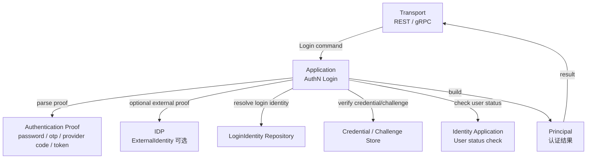
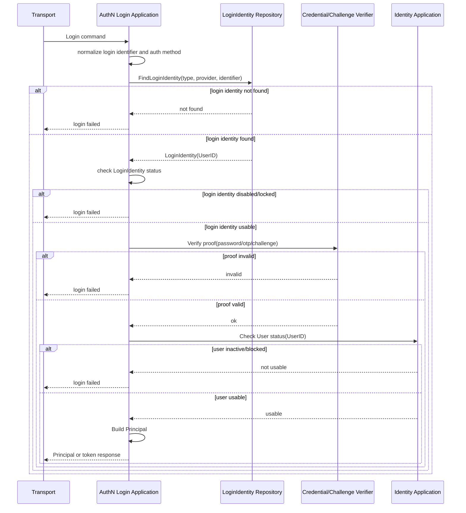
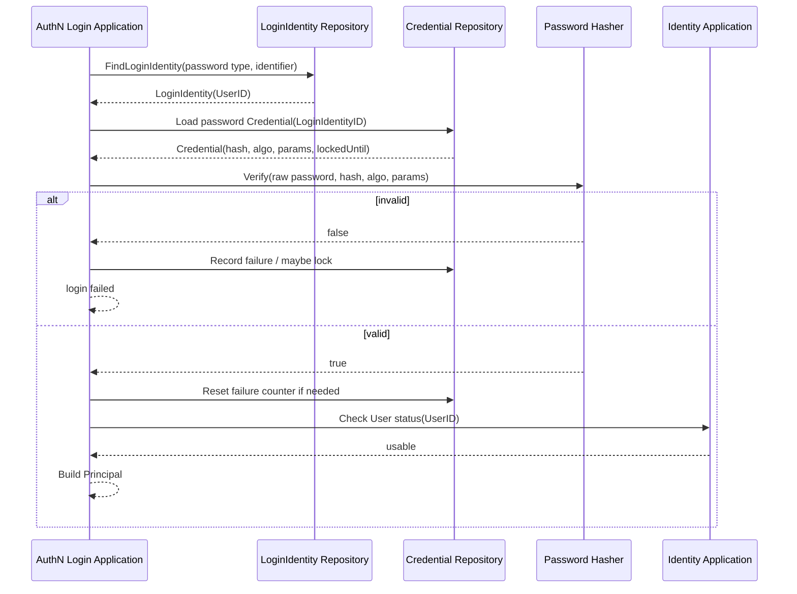
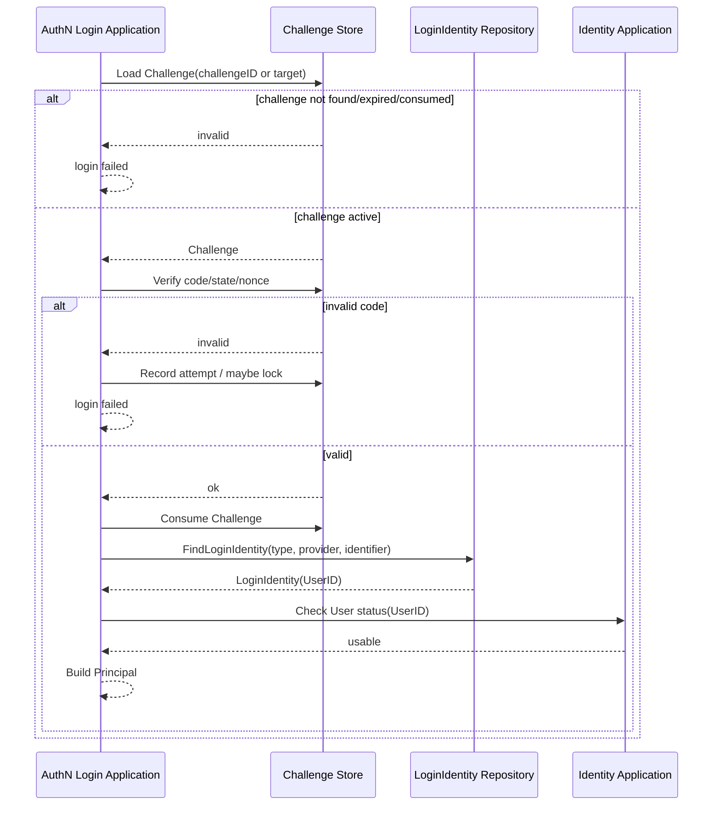
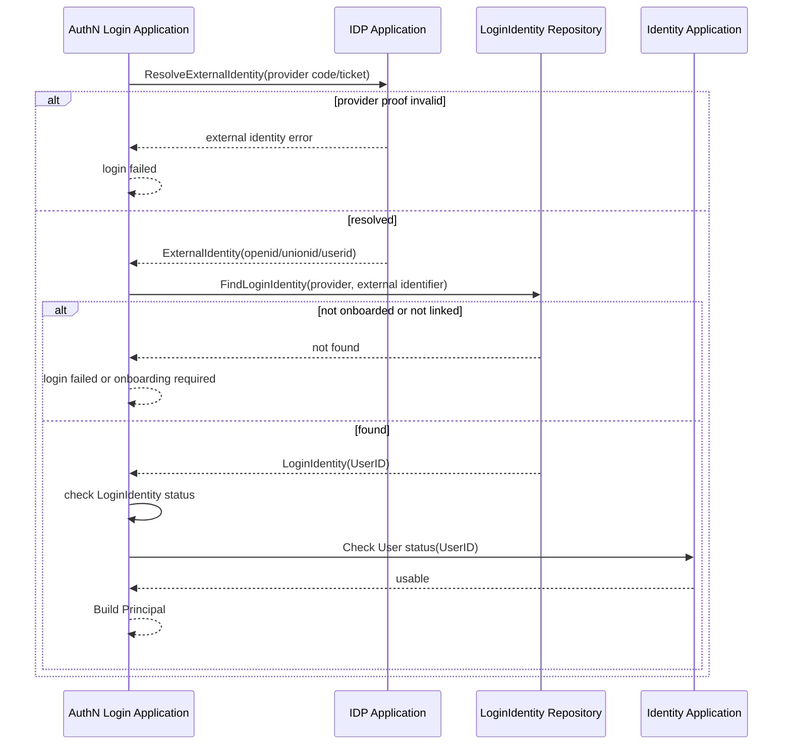

# 关键链路：Login 登录认证

> 状态：已实现 · 已核对当前安全不变量；公开 REST/gRPC 契约未改变。

---

## 1. 本文回答

本文回答 8 个问题：

- Login 登录认证链路解决什么问题？
- Login 与 Onboarding、Linking、Session/Token 签发的边界是什么？
- 登录请求如何解析为认证证明 proof？
- AuthN 如何定位 `LoginIdentity` 并校验 `Credential` / `Challenge` / external proof？
- 为什么 Login 的领域终点是 `Principal`？
- Login 过程中如何检查 `User` 和 `LoginIdentity` 状态？
- Login 的失败边界、安全策略、审计和防枚举如何处理？
- 修改该链路时应该核对哪些代码和测试？

本文只讲“登录请求如何被证明为 Principal”。
注册与身份开通见 [02-注册登录与身份绑定.md](02-注册登录与身份绑定.md)；
Linking 登录身份绑定见 [03-关键链路-Linking登录身份绑定.md](03-关键链路-Linking登录身份绑定.md)；
AuthN 领域模型见 [01-领域模型与认证策略.md](01-领域模型与认证策略.md)。

---

## 2. 30 秒结论

Login 的目标是把一次登录请求证明为一个 `Principal`。

核心主线：

```text
login request
  -> parse authentication proof
  -> resolve LoginIdentity
  -> verify Credential / Challenge / external proof
  -> evaluate User and LoginIdentity status
  -> build Principal
```

Login 的领域终点是：

```text
Principal
```

Login 不直接负责：

```text
首次开通 User / LoginIdentity；
已登录用户绑定新的 LoginIdentity；
创建业务 Profile 或 ProfileLink；
最终资源授权 Check；
Role / Assignment / PermissionGrant / ConstraintSet 判定。
```

Token 和 Session 的关系要严格区分：

```text
Login 证明身份并生成 Principal；
Session/Token 链路把 Principal 转换为登录态和访问凭证；
上层接口可以组合 Login + Session/Token，但领域文档应区分两段。
```

如果只记一句话：

> Login 只回答“请求者是否成功证明自己是谁”，不回答“他能访问什么资源”。

---

## 3. Login 的定位

Login 是 AuthN 的核心认证链路。

它回答：

```text
请求者提交的登录标识是什么？
请求者提交了什么认证证明？
这个证明是否能证明他控制某个 LoginIdentity？
该 LoginIdentity 是否可用？
对应的 User 是否可用？
认证成功后如何表达当前请求者？
```

Login 的输出应该是认证结果，而不是授权结果：

```text
Principal；
认证方法；
认证时间；
认证上下文；
可选风险信号；
可选下一步，例如 MFA required。
```

如果某个 REST/gRPC 登录接口直接返回 token，那是接口层或 application 层把：

```text
Login -> Principal
Principal -> Session/Token
```

组合到了一起。文档中仍应把两段语义拆开。

---

## 4. Login 与 Onboarding / Linking / Token / AuthZ 的区别

| 链路 | 前提 | 目标 | 主要产物 |
| --- | --- | --- | --- |
| Onboarding | 登录身份可能不存在 | 首次开通登录身份并绑定 User | `User`、`LoginIdentity`、可选 `Credential` |
| Linking | 已有 Principal/UserID | 给当前 User 绑定或解绑登录身份 | `LoginIdentity`、可选 `Credential` |
| Login | 已有登录身份或可解析外部身份 | 证明请求者是谁 | `Principal` |
| Session/Token | 已有 Principal | 维持登录态并签发访问凭证 | `Session`、`AccessToken`、`RefreshToken` |
| AuthZ Check | 已有 Principal 或 Subject | 判断是否允许访问资源 | `AuthorizationDecision` |

关键边界：

```text
Login 不创建 ProfileLink；
Login 不写 RoleBinding；
Login 不决定 Permission；
Login 不等于 Onboarding；
Login 不等于 Linking；
Token 验签成功不等于授权通过。
```

---

## 5. 链路总览



读图规则：

```text
transport 只解析请求并调用 application；
AuthN application 编排登录认证；
IDP 只解析外部身份声明；
LoginIdentity 用于定位登录身份；
Credential / Challenge 用于验证证明；
Identity 只提供 User 状态和事实；
Principal 是 Login 的领域终点。
```

---

## 6. 输入与输出

### 6.1 输入

Login 输入通常包含：

| 输入类型 | 示例 | 说明 |
| --- | --- | --- |
| 登录身份标识 | username、phone、provider、identifier | 用于定位 LoginIdentity |
| 认证证明 | password、otp、provider code、ticket | 用于证明控制该 LoginIdentity |
| 认证方式 | password、phone_otp、wx_minip、wecom、operation | 决定验证策略 |
| 客户端上下文 | device、ip、user-agent、appID | 用于风控、审计和 provider 选择 |
| 可选 challenge 信息 | challengeID、state、nonce | 用于 OTP/OAuth/扫码等流程 |

具体字段必须以 REST OpenAPI、gRPC proto 和当前 application command 为准。

---

### 6.2 输出

Login 领域输出应该是：

```text
Principal；
AuthMethod；
AuthenticatedAt；
LoginIdentityID；
UserID；
可选 AMR；
可选风险结果；
可选下一步，例如 MFA required。
```

如果接口返回：

```text
AccessToken；
RefreshToken；
ExpiresIn；
TokenType。
```

则说明该接口组合了 Session/Token 签发链路。该组合应在 Session/Token 文档中继续展开。

注意：

```text
Credential material 不应出现在响应中；
password hash 不应出现在响应中；
Challenge code 不应出现在响应中；
provider access token 不应出现在响应中；
Principal 不应携带完整 User/Profile/ProfileLink 写模型。
```

---

## 7. 标准 Login 时序图



注意：

```text
上图是领域流程图；
为防账户枚举，not found、password wrong、status disabled 对外是否统一错误，需要按安全策略决定；
具体函数名、repository 名称和错误类型以当前代码为准。
```

---

## 8. 密码登录链路

### 8.1 链路目标

密码登录用于证明：

```text
请求者知道某个 LoginIdentity 对应的有效密码凭据。
```

主线：

```text
username / phone
  -> resolve LoginIdentity
  -> load password Credential
  -> verify password with hash/algorithm/params
  -> check lock / expiry / failure policy
  -> build Principal
```

---

### 8.2 时序图



关键规则：

```text
不保存明文密码；
密码 hash 算法和参数需要可升级；
失败次数应计数或进入风控；
锁定策略不能被绕过；
密码错误不应泄露账户是否存在；
密码认证成功不等于授权通过。
```

当前实现保证：

```text
生产默认连续失败 5 次后锁定 15 分钟，开发默认关闭；
失败计数由数据库原子递增，并发失败不会读取后覆盖；
首次真正进入锁定时记录不含证明材料的安全日志；
成功认证用一次数据库更新清零失败次数、写成功时间并完成可选密码材料升级；
锁定截止前即使密码正确也返回 ErrCredentialLocked（HTTP 423）；
锁定过期后的成功登录会清零失败计数。
```

---

## 9. OTP / Challenge 登录链路

### 9.1 链路目标

OTP / Challenge 登录用于证明：

```text
请求者控制某个短期认证目标，例如手机号、邮箱或一次性挑战。
```

主线：

```text
phone/email/challengeID
  -> resolve Challenge
  -> verify code/state/nonce
  -> consume Challenge
  -> resolve or locate LoginIdentity
  -> check User/LoginIdentity status
  -> build Principal
```

---

### 9.2 时序图



关键规则：

```text
Challenge 必须短期有效；
Challenge 成功后必须消费，防重放；
同一 SMS Challenge 或 OAuth state 并发验证时只允许一个请求消费成功；
旧 verifier 不能删除后来覆盖的新 Challenge；
验证码不应明文保存；
OTP 通常不是长期 Credential；
OTP 登录是否允许自动 Onboarding，必须由上层用例明确。
```

同一 SMS Challenge 默认最多允许 5 次错误验证。错误次数与 Challenge 的当前 `SecretHash` 版本绑定：Challenge 被覆盖后，旧 verifier 不能消耗或累计到新 Challenge；
达到上限时 Challenge 与尝试记录原子删除。Redis 异常时验证 fail closed。该机制不是 IP/device 限流，外围暴力流量仍由 ingress/WAF 治理。

---

## 10. 外部 IDP 登录链路

外部 IDP 登录用于微信小程序、企业微信、OAuth/OIDC 等场景。

主线：

```text
provider code / ticket
  -> IDP ResolveExternalIdentity
  -> resolve LoginIdentity(provider, external identifier)
  -> check LoginIdentity status
  -> check User status
  -> build Principal
```



关键边界：

```text
ExternalIdentity 不是 User；
ExternalIdentity 不是 LoginIdentity；
IDP AppToken 不是 IAM AccessToken；
provider access token 不应作为 IAM Credential；
外部 IDP 登录失败是否自动 Onboarding，必须由接口语义明确。
```

---

## 11. LoginIdentity 与 User 状态检查

Login 不只验证 proof，还要检查状态。

### 11.1 LoginIdentity 状态

需要检查：

```text
LoginIdentity 是否存在；
LoginIdentity 是否 disabled；
LoginIdentity 是否 locked；
LoginIdentity 是否已解绑；
LoginIdentity 是否允许当前 auth method。
```

### 11.2 User 状态

需要通过 Identity 检查：

```text
User 是否存在；
User 是否 active；
User 是否 inactive；
User 是否 blocked。
```

当前 SignIn 在 proof 验证和 Credential 状态记录之后、创建 Session/Token 之前统一执行 `AdmissionPolicy`。`blocked User`、`inactive User`、
`disabled LoginIdentity` 和状态查询错误都禁止调用 `SessionEstablisher`；Refresh 和在线 Verify 复用同一错误映射。

边界：

```text
LoginIdentity 状态属于 AuthN；
User 状态属于 Identity；
Session 状态属于 AuthN；
User blocked 可以导致 Login 失败并触发 Session revoke；
User 状态不等于 LoginIdentity 状态。
```

---

## 12. Principal 构造

Login 成功后的领域终点是 `Principal`。

Principal 应至少表达：

```text
UserID；
LoginIdentityID；
AuthMethod；
AuthenticatedAt；
可选 AMR；
可选 tenant/app/source context。
```

Principal 不应包含：

```text
完整 User 实体；
完整 Profile/ProfileLink；
Credential material；
password hash；
完整 Assignment / RoleInheritance / PermissionGrant / ConstraintSet；
provider access token。
```

Principal 的后续用途：

```text
写入 Session；
写入 AccessToken claims；
放入 request context；
映射为 AuthZ Subject；
作为审计日志主体。
```

---

## 13. 失败边界

| 场景 | 期望行为 | 说明 |
| --- | --- | --- |
| 登录身份不存在 | 登录失败 | 对外错误可统一，防账户枚举 |
| LoginIdentity disabled/locked | 登录失败 | 不应继续验证或签发 Principal |
| Credential 不存在 | 登录失败 | 不应泄露配置细节 |
| password 错误 | 登录失败 | 记录失败次数或触发锁定策略 |
| Challenge 不存在/过期/已消费 | 登录失败 | 需要重新发起 Challenge |
| OTP 错误 | 登录失败 | 同一 SMS Challenge 达到配置上限后原子耗尽；不向客户端暴露剩余次数 |
| 外部 provider code 无效 | 登录失败 | IDP 返回外部身份错误 |
| LoginIdentity 未 Onboarding/Linking | 登录失败或提示开通 | 取决于接口语义 |
| User inactive/blocked | 登录失败 | User 状态来自 Identity |
| Identity 查询失败 | 登录失败或内部错误 | 不应伪造成登录成功 |
| Credential store 不可用 | 登录失败或内部错误 | 不应降级放行 |

---

## 14. 防枚举与安全策略

Login 是高风险入口，需要避免泄露敏感信息。

建议策略：

```text
账户不存在、密码错误、身份禁用等错误对外可统一为“认证失败”；
内部日志保留可诊断原因；
密码/OTP 失败次数计数；
高风险登录要求 MFA 或二次验证；
对 IP、设备、User-Agent、appID 做风控记录；
对登录成功和失败记录审计日志；
避免在响应中返回 Credential、Challenge、provider token、User 全量资料。
```

需要特别注意：

```text
防账户枚举和可观测性之间要平衡；
对外错误应克制；
内部日志应足够定位问题；
日志不能打印明文密码、验证码、token、private key。
```

---

## 15. 幂等与并发

Login 通常不是幂等写链路，但会修改安全状态。

可能的写入包括：

```text
记录失败次数；
锁定 Credential / Challenge / LoginIdentity；
消费 Challenge；
更新 lastLoginAt；
写审计日志；
后续创建 Session / Token。
```

并发风险：

| 风险 | 说明 |
| --- | --- |
| 同一 Challenge 被并发验证 | 必须只允许一次成功消费 |
| 多次密码错误并发计数 | 失败次数和锁定策略要一致 |
| 登录和解绑 LoginIdentity 并发 | 需要读取到一致的 LoginIdentity 状态 |
| 登录和 User blocked 并发 | blocked 后不应继续产生有效 Principal/Session |
| Refresh/Session 创建与 Login 失败混乱 | Login 失败不应创建 Session/Token |

建议：

```text
Challenge consume 已使用 Redis 条件删除保证一次性；
密码失败次数已使用数据库原子递增；
LoginIdentity 状态读取和认证结果生成需要一致；
User blocked 后的 Session revoke 应由独立链路保证；
登录审计可异步，但认证结果必须清晰。
```

---

## 16. 与其他模块的边界

### 16.1 与 Identity

```text
Login 通过 UserID 查询 User 状态；
Login 不创建 User，除非接口明确组合 Onboarding；
Login 不修改 Profile；
Login 不创建 ProfileLink；
User 状态来自 Identity；
Principal 不是 User。
```

---

### 16.2 与 IDP

```text
IDP 只解析外部身份声明；
ExternalIdentity 不是 User；
ExternalIdentity 不是 LoginIdentity；
AuthN 用 ExternalIdentity 查找 LoginIdentity；
IDP AppToken 不是 IAM AccessToken。
```

---

### 16.3 与 AuthZ

```text
Login 不做资源授权判定；
Principal 可以映射为 Subject；
Token 验签成功不等于授权通过；
AuthZ Check 在认证之后执行。
```

---

### 16.4 与 Suggest

```text
Login 不维护 Suggest Index；
Login 不创建 ProfileSearchTerm；
Suggest 可以使用 Principal/UserID 作为查询上下文；
Profile 可见性仍由 Suggest/ProfileAccessScope/AuthZ 控制。
```

---

## 17. 常见反模式

| 反模式 | 问题 | 推荐做法 |
| --- | --- | --- |
| Login 自动创建 User | Login 和 Onboarding 混淆 | 首次开通走 Onboarding 或显式组合用例 |
| Login 自动绑定新身份 | Login 和 Linking 混淆 | 已认证绑定走 Linking |
| Login 成功直接认为有资源权限 | 认证和授权混淆 | 认证后继续 AuthZ Check |
| Principal 塞完整 User/Profile | 认证上下文过重且泄露身份事实 | Principal 只携带必要主体引用 |
| password 错误返回“用户存在但密码错” | 账户枚举风险 | 对外统一认证失败 |
| Challenge 验证成功但不消费 | 可重放攻击 | 成功后必须消费 |
| provider access token 当 IAM AccessToken | 外部凭证和 IAM 凭证混淆 | IDP AppToken/provider token 只用于外部 provider |
| Token 签发写在 LoginIdentity 实体里 | 聚合职责混乱 | 由独立 Token 领域服务表达签发规则，application 编排登录用例 |
| 日志打印密码/验证码/token | 严重安全风险 | 日志脱敏并避免敏感材料 |
| Login 直接写 RoleBinding | AuthN 吞并 AuthZ | 授权归 AuthZ 用例 |

---

## 18. 代码事实源

| 事实 | 路径 |
| --- | --- |
| AuthN domain | `../../../internal/apiserver/domain/authn` |
| LoginIdentity 模型 | `../../../internal/apiserver/domain/authn` |
| Credential 模型 | `../../../internal/apiserver/domain/authn` |
| Challenge 模型 | `../../../internal/apiserver/domain/authn` |
| Principal 模型 | `../../../internal/apiserver/domain/authn/authentication/principal.go` |
| AuthN login application | `../../../internal/apiserver/application/authn` |
| Token 领域模型与生命周期服务 | `../../../internal/apiserver/domain/authn/token` |
| Token application facade/DTO | `../../../internal/apiserver/application/authn/token` |
| Identity User application | `../../../internal/apiserver/application/identity/user` |
| IDP ExternalIdentity | `../../../internal/apiserver/domain/idp` |
| AuthN infra repository/store | `../../../internal/apiserver/infra` |
| AuthN REST transport | `../../../internal/apiserver/transport/rest` |
| AuthN gRPC transport | `../../../internal/apiserver/transport/grpc` |
| AuthN container | `../../../internal/apiserver/container/authn` |
| REST 契约 | `../../../api/rest` |
| gRPC 契约 | `../../../api/grpc` |
| 架构测试 | `../../../internal/pkg/architecture` |

上表路径已按当前代码核对；目录调整时必须与本文和链接门禁同步更新。

---

## 19. Verify

修改本文后至少执行：

```bash
make docs-hygiene
```

涉及 AuthN 领域模型：

```bash
go test ./internal/apiserver/domain/authn/...
```

涉及 AuthN login / application 用例：

```bash
go test ./internal/apiserver/application/authn/...
```

涉及 Token / Session 后续链路：

```bash
go test ./internal/apiserver/application/authn/token/...
go test ./internal/apiserver/domain/authn/token/...
go test ./internal/apiserver/infra/...
```

具体路径以当前代码为准。

涉及 Identity 协作：

```bash
go test ./internal/apiserver/application/identity/...
go test ./internal/apiserver/domain/identity/...
```

涉及 IDP 协作：

```bash
go test ./internal/apiserver/domain/idp/...
```

涉及 REST/gRPC 契约或 transport：

```bash
make api-validate
make proto-gen
go test ./internal/apiserver/transport/rest/...
go test ./internal/apiserver/transport/grpc/...
```

涉及分层依赖或模块边界：

```bash
go test ./internal/pkg/architecture
```

---

## 20. 本文总结

Login 登录认证可以压缩成：

```text
login request
  -> parse authentication proof
  -> resolve LoginIdentity
  -> verify Credential / Challenge / external proof
  -> evaluate LoginIdentity and User status
  -> build Principal
```

最重要的边界是：

```text
Login 的领域终点是 Principal；
Token/Session 是后续链路；
Login 不是 Onboarding；
Login 不是 Linking；
Login 不创建 ProfileLink；
Login 不做 AuthZ Check；
Token 验签成功不等于授权通过。
```

下一篇应继续编写 Session / Token 签发链路，说明 Principal 如何转化为 Session、AccessToken、RefreshToken，以及 Refresh / Logout / Revoke 如何治理登录态。
