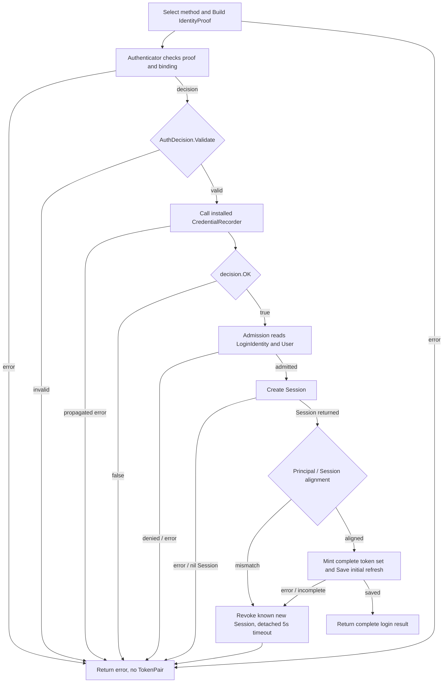
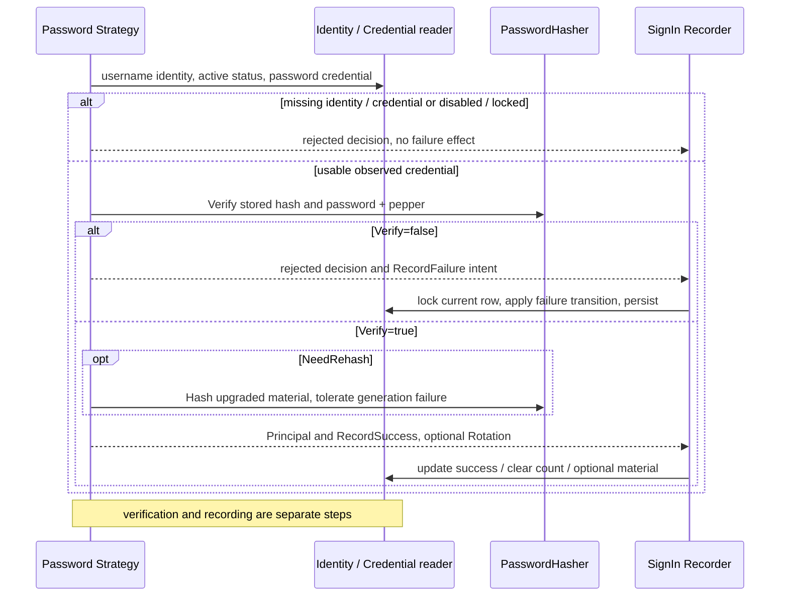
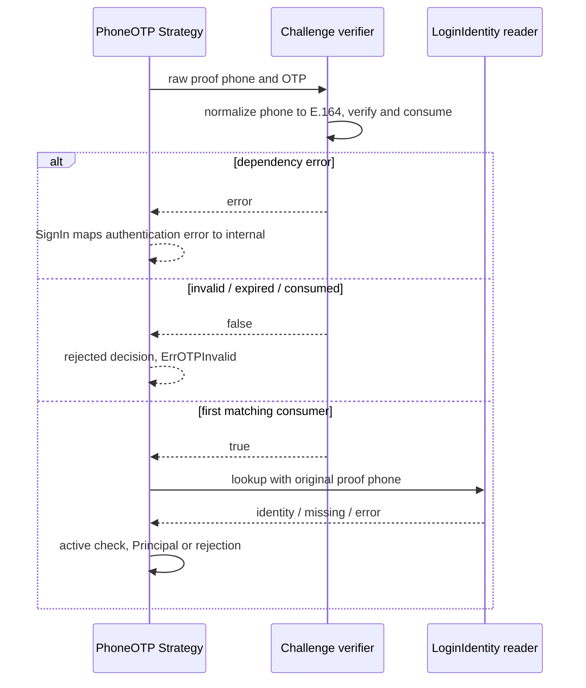

# 关键链路：Login 登录认证

> 状态：已实现 · 当前设计与实现。 本文维护 SignIn 的证明、决策、凭据记录、准入与登录结果；令牌生命周期由 Token 主文维护，候选变化单独说明。

## 1. 结论：证明成功、准入通过与登录成功是三个结果

公开 Login 由 SignIn 编排：选择方法并构造 IdentityProof → 身份核验 → 校验 AuthDecision → 执行已装配的 CredentialRecorder → 登录准入 → 创建 Session → 初始令牌颁发。全部完成才返回 TokenPair。

Principal 表示本次证明被接受；Credential 的 LastSuccessAt 表示密码核验成功被记录；两者都不证明 User 通过准入或客户端收到令牌。正确密码也可能先清零失败次数/重哈希，再因 User blocked/inactive 拒绝登录，后续失败不回退这笔记录。登录失败不交付候选 token pair，但可能已经消费证明、写 Credential 或创建在线记录。

Login 查找既有主体，不自动创建 User、注册入口或把当前访问者与 provider 账号绑定。首次开通走 [SignUp](02-注册登录与身份绑定.md)，追加入口走 [Linking](03-关键链路-Linking登录身份绑定.md)，资源动作权限仍由 AuthZ 判断。对象性质见 [领域模型](01-领域模型与认证策略.md)，完整初始颁发/续期见 [Token](05-关键链路-Token签发刷新吊销.md)。

## 2. 公开输入：方法名、证明类型与认证上下文各有含义

REST `POST /api/v3/authn/login`、发送登录 OTP 与发起扫码 authorize 是匿名入口，没有 JWT/AuthZ 中间件。gRPC `AuthService.Login` 先受服务调用准入约束，但请求没有用户 Actor；最终 User/LoginIdentity 来自本次证明与绑定查找，不由服务证书或 payload 中的 user/org/tenant 指定。仓库 ACL 模板中 `admin` 通配覆盖 Login/Challenge，不代表所有 SDK 宿主或实际部署都已获准。

REST/gRPC 经 `application/authn/session` 门面进入同一 SignIn。声明 wire 方法有五种；`wechat` 在公开 mapper 中归一为 `wechat_mini`。服务端白名单实际也接受 `wechat_mini`，REST SDK 的校验却只接受声明的五种。表中不同名称不能当作同一 enum 的别名集合：

| 声明 wire 方法与 payload | 应用选择的 CredentialKind → 领域 proof kind | 成功 AuthContext.Method / AMR |
| --- | --- | --- |
| password：username/password | password → password | password / pwd |
| phone_otp：phone/otp_code | phone_otp → phone_otp | phone_otp / otp |
| wechat：app_id/code | oauth_wx_minip → oauth_wx_minip | wechat_minip / wechat |
| wechat_scan：app_id/code/state | oauth_wx_scan → oauth_wx_open | oauth_wx_open / wechat_open |
| wecom：corp_id/auth_code | oauth_wecom → oauth_wecom | wecom / wecom |

Method Registry 校验方法与 typed payload 的形状，Proof Factory 构造策略输入；Authenticator 按领域 proof kind 分派，再生成描述实际核验方式的 AuthContext。这种分离使外部交换留在应用端口、领域策略只消费解析结果，不要求 handler 同时持有 provider SDK、仓储和 signer。它也带来多组名称的维护成本，不能从 wire 的 `wechat_scan` 推断存在同名领域 CredentialKind。

`device_id` 虽在 DTO/proto/REST SDK 中声明和发送，transport 没有把它带入 LoginRequest，SessionCreator 也不接收设备字段。REST 注入 RemoteIP/UserAgent 到 CommonPayload，但当前 proof builder 不用它们建立风险判断或会话绑定；gRPC 不补这些上下文。多次登录可产生独立 Session，没有由这些字段实现的设备复用、最大会话数或风险引擎。

公开 REST 成功返回 `{code:0,message:"success",data:TokenPair}`，gRPC 返回 `LoginResponse.token_pair`；均不直接返回 Session、User/Profile 或完整 AuthContext。TokenPair 的 expires_in 在 REST 为整数秒，gRPC 为 Duration。YAML 当前继承 bearerAuth 的安全声明与这些匿名路由有偏移，成功 schema 也没有表达 REST 封装，详见 [契约治理](../../04-接口与SDK/01-REST-gRPC与契约治理.md)。

## 3. 主链路：决策必须有效，记录步骤早于准入


```mermaid
flowchart TD
    P["Select method and Build IdentityProof"] --> A["Authenticator checks proof and binding"]
    P -->|error| F["Return error, no TokenPair"]
    A -->|error| F
    A -->|decision| V{"AuthDecision.Validate"}
    V -->|invalid| F
    V -->|valid| R["Call installed CredentialRecorder"]
    R -->|propagated error| F
    R --> Q{"decision.OK"}
    Q -->|false| F
    Q -->|true| AP["Admission reads LoginIdentity and User"]
    AP -->|denied / error| F
    AP -->|admitted| C["Create Session"]
    C -->|error / nil Session| F
    C -->|Session returned| AL{"Principal / Session alignment"}
    AL -->|mismatch| CL["Revoke known new Session, detached 5s timeout"]
    AL -->|aligned| I["Mint complete token set and Save initial refresh"]
    I -->|error / incomplete| CL
    CL --> F
    I -->|saved| OK["Return complete login result"]
```

图中只有依赖齐备才开始；ensureReady 要求 MethodRegistry、ProofFactory、Authenticator、Admission、SessionCreator、SessionRevoker、TokenIssuer，**不要求 CredentialRecorder 非 nil**。标准容器装配 Recorder，直接构造 SignIn 可以省略它，此时记录为 no-op。

Authenticator 与 SignIn 都校验决策结构：成功不能同时带失败 Code/RejectedLoginIdentityID，拒绝不能带 Principal，CredentialEffect 必须与成功/失败一致，失败不得附材料 Rotation。矛盾决策在 Record 前返回内部错误；这不是对任意 Principal 字段、用户存在性或完整 AuthContext 的认证。已返回的有效拒绝决策也先进入 Record，再映射稳定错误。

Recorder 在无 CredentialUpdate/仓储时 no-op；实际成功/失败记录的 ErrCredentialNotFound 也被吞作 no-op，其他向上传播的错误阻止准入与颁发。因此合同是“先调用已装配的记录步骤”，不能写成“所有凭据副作用必定持久化”。例如校验后凭据并发删除，旧成功决策仍可能继续 Admission；Admission 不重新核验 Credential。

阶段失败不整体回滚：OTP/state/code 的使用、Credential 更新、MySQL 状态读取、Redis Session 和 refresh 保存不是一个跨系统事务。下面按证明和副作用分别看。

## 4. 密码：Verify 的结果、计数更新与锁定时效必须一起解释

密码策略先查 username LoginIdentity 并检查 active，再查 password Credential，检查 enabled/LockedUntil，最后验证 `password + Hasher.Pepper()` 与存储材料。策略不查完整 User；User 状态留给后续 Admission。


```mermaid
sequenceDiagram
    participant A as Password Strategy
    participant R as Identity / Credential reader
    participant H as PasswordHasher
    participant C as SignIn Recorder
    A->>R: username identity, active status, password credential
    alt missing identity / credential or disabled / locked
        A-->>C: rejected decision, no failure effect
    else usable observed credential
        A->>H: Verify stored hash and password + pepper
        alt Verify=false
            A-->>C: rejected decision and RecordFailure intent
            C->>R: lock current row, apply failure transition, persist
        else Verify=true
            opt NeedRehash
                A->>H: Hash upgraded material, tolerate generation failure
            end
            A-->>C: Principal and RecordSuccess, optional Rotation
            C->>R: update success / clear count / optional material
        end
    end
    Note over A,R: verification and recording are separate steps
```

| 观察结果 | CredentialEffect 与后果 |
| --- | --- |
| username 不存在、password Credential 缺失 | InvalidCredentials，无计数意图 |
| LoginIdentity 非 active | LoginIdentityDisabled，不进入哈希验证 |
| Credential disabled，或观察到 LockedUntil 仍在未来 | 对应拒绝，Effect=None，不新增失败记录 |
| hasher.Verify 返回 false | InvalidCredentials + RecordFailure；不只包括用户输错，当前 Argon2 对部分格式/算法/参数/base64异常也返回 false |
| Verify=true | RecordSuccess；成功记录后才检查 User 准入 |

MySQL 失败记录在行锁内读取当前 failed_attempts/locked_until，调用领域 ApplyAuthenticationTransition，再写具体值；避免丢失这类计数更新或在 SQL 中复制阈值规则。prod 模板启用 5 次/15 分钟，dev 模板与 options 默认关闭；模板不证明部署已采用该策略。Enabled=false 仅停止产生新锁，不使已存在的未来 LockedUntil 被密码策略忽略。

以阈值 5、锁定 15 分钟为例：第 5 个失败记录加锁；观察到锁未到期的新请求不再哈希，也不增加计数。锁定到期不会自动清零：若期间没有成功记录，下一次错误从 5 增为 6，并再次锁 15 分钟。不能解读成“每次到期重新给五次机会”。成功记录清零 count、写 LastSuccessAt，但不清 LockedUntil/LastFailureAt。

行锁也不覆盖前面的密码核验。源码可推得这个在途例子：请求 A 已观察到 unlocked 并验对密码；请求 B 随后记录第 5 次失败加锁；A 再写成功，清零 count 但保留未来 LockedUntil，仍可通过只查 User/LoginIdentity 的 Admission 并完成登录。后续新密码请求却可能被该锁拒绝。成功更新仅按 ID，不比较刚核验的材料、Status、锁状态或 Version；现有并发专项只验证失败记录，不证明上述竞争已经消除或已在真实环境发生。

重哈希是机会性工作：只有 Verify=true 才进入 NeedRehash，无法凭它修复不可验证的损坏/不支持材料。生成新 hash 失败保留既有核验成功、不附 Rotation；写入 Rotation 失败且向上传播则终止登录。当前密码策略仅提供新 material，没有提供新 Algo；成功更新也没有针对原 material/version 的条件写。pepper 支持和标准装配的实际边界见 [密码学](../../03-基础设施/04-密码学密钥与令牌.md)，不能把接口支持秘密入参等同已经注入非空秘密。

## 5. OTP 与外部证明：消费成功后，仍可能没有登录结果

### 5.1 OTP：校验规范化，身份查询却使用原输入

Phone proof builder 只构造非空 PhoneOTPProof，不消费、不规范化号码。领域策略调用 LoginPhoneOTPVerifier 消费 `login` scene 后，按 `phone / global / proof.PhoneE164` 查既有入口，再检查 active。


```mermaid
sequenceDiagram
    participant P as PhoneOTP Strategy
    participant V as Challenge verifier
    participant R as LoginIdentity reader
    P->>V: raw proof phone and OTP
    V->>V: normalize phone to E.164, verify and consume
    alt dependency error
        V-->>P: error
        P-->>P: SignIn maps authentication error to internal
    else invalid / expired / consumed
        V-->>P: false
        P-->>P: rejected decision, ErrOTPInvalid
    else first matching consumer
        V-->>P: true
        P->>R: lookup with original proof phone
        R-->>P: identity / missing / error
        P->>P: active check, Principal or rejection
    end
```

公开 mapper 把 wire `phone` 原样交给 proof；Challenge verifier 用 meta.NewPhone 转成 E.164，但 identity 查询只有 trim。因此若绑定存为 `+8613800138000`，payload 提交 `13800138000`，从源码看可能验码成功并消费后，再返回 NoBinding。这是规范化边界的源码推论，当前没有该公开链专项；登录调用方应提交规范 E.164，不能把发送 OTP 支持国内格式当作登录查找也已统一。

每个当前 SMS Challenge 默认最多 5 次错误验证；发送 gate/quota、短信失败处理属于 Challenge 应用，不等于 IP/device 全局限流。错误计数与条件消费匹配 SecretHash；旧读结果不能消费/删除已换成**不同 hash**的记录。该 hash 只由 scene、号码、OTP 内容派生，没有独立 generation：同号同 scene 后来签发恰好相同 OTP 时，旧请求与新记录不能据 hash 区分。现有替换测试只覆盖不同 hash，不能扩大成任意新旧签发都隔离。

OTP 正确但号码没有绑定、入口非 active、MySQL 故障、User 拒绝或 Session/签发失败，都不能回滚已成功消费；不会自动注册。错误/耗尽/已消费通常归为 OTPInvalid，但 verifier 返回的技术错误走 Authenticator error 路径并被 SignIn 包装内部错误，不作为 proof 成功。

### 5.2 微信/企微：精确入口优先，回退不等于新增绑定

应用通过 IDP Resolver 交换 provider/realm/code，将请求级 ExternalIdentity 映射成 proof；不能回退信任客户端 openid、unionid、provider userid。长期绑定查找发生在领域策略：

| 路径 | 查找顺序及停止条件 |
| --- | --- |
| 小程序/开放平台 | 当前 AppID/openid 精确 key → 仅 miss 且有 unionid 时查同 provider/global → 仍 miss 时可选 legacy 当前 AppID/unionid。找到行或查询报错立即停止，之后才检查 active |
| legacy 微信行 | MySQL 额外要求 Meta 的 legacy_identifier_semantics=openid_or_unionid；普通行不取得这项回退语义 |
| 企业微信 | corpID/user_id 优先；miss 时可回退 corpID/open_user_id；首个结果/error 停止，不因 inactive 再换另一个候选 |

例如 User17 的 AppA/openidA 活跃行持有 union1；AppB/openidB 没有精确行，但本次可信 proof 带 union1，Login 可选到 AppA 的 LoginIdentityID/UserID，不创建 AppB 入口。AuthContext.Realm 此时仍是本次 proof 的 AppB，不能把它当作被选行的 Realm 或业务组织。若 AppB 精确行已存在但 inactive，会直接拒绝，不越过它去找活跃 global 行；当前也不同时比较精确行与 global 行的 owner。

小程序与开放平台的 global 查询隔离 provider；这不是跨 provider 账号合并。企微 Login 的 open_user_id 回退兼容与 Linking 只接受 user_id 是不同能力；没有既有匹配入口时返回 NoBinding。

### 5.3 扫码登录：Start + 普通 Login，没有独立 Complete

REST authorize 使用服务端 AppID/RedirectURI，保存登录 scene state，再构造 URL；URL 构造失败没有删除补偿。Start 只有 REST/REST SDK，没有对应 gRPC Start。回调经普通 Login 的 `wechat_scan(app_id,code,state)`，并非 Linking 的 Complete 用例。

登录 state 不绑定 User；domain 校验记录存在/type/scene/期限/hash后一次消费，proof builder **消费成功后**才比对保存 AppID与payload AppID，再交换 code。没有核对浏览器 cookie、原发起客户端或回调 nonce/redirectURI的步骤，不能把它描述成完整浏览器关联保证。AppID不匹配、Resolver缺失/交换失败、无绑定或后续登录失败都不能复用成功消费的旧 state；业务客户端如何绑定自身发起上下文需另有合同。登录/绑定 scene 隔离，state 不代替最终 provider 证明。

## 6. 准入、认证上下文与新会话补偿

所有当前策略在接受证明、构造 Principal 时取服务器当前 UTC 时间作为 AuthenticatedAt；它不是 OTP 生成时间、IDP ExternalIdentity.VerifiedAt 或 provider 历史认证时间。Refresh 保留本次原始时间，不能更新为续期时间。密码 Realm 来自被查到的入口；phone 为 global；微信/企微为本次 proof AppID/CorpID。AMR 描述当前手段，不证明 MFA 或操作级 step-up。

Admission 依次读取 LoginIdentity 存在/归属/active，然后 User active。missing、blocked、inactive、identity disabled、owner mismatch或读取错误均阻止 Session 创建；不检查 password Credential 当前状态、组织资格或 AuthZ 动作权限。独立读取不构成全局锁，与并发封禁/解绑仍有窗口，后续在线 Verify/Refresh继续复查状态；相关会话撤销 outbox 另承担最终收敛。

正常 SessionCreator 复制 Principal.AuthContext、设置空 BusinessContext，生成新 SID并保存 Session。之后 alignment 只比较 UserID/LoginIdentityID，以及双方非空时的 Method/Realm；不校验 AMR/AuthTime/BusinessContext、SessionID、状态或寿命。正常 creator 的构造保障与该有限防御检查必须分开，不能称为任意自定义 SessionCreator 的完整状态验证。新 JWT 投影 AMR/auth_time等必要声明，不写 Method/Realm 或任意 Principal.Claims。

| 失败位置 | 当前写入及补偿 |
| --- | --- |
| Admission 拒绝/无法评估 | proof/Credential副作用可能已有；不创建 Session，不回退 Credential |
| SessionCreator 返回 error 或 nil Session | SignIn直接返回，不补偿。实际 Save error 后 Creator 返回 nil/error；Redis TxPipelined写Session/索引，返回错误不足以证明没有已写状态 |
| 已拿到 Session，alignment不符、mint/保存失败或pair不完整 | 对已知 SID 调 SessionRevoker.Revoke；独立 WithoutCancel + 5s，不因客户端取消而取消补偿 |
| 初始 refresh 保存结果不确定，但 Session撤销成功 | 阻断其在线使用；Redis Revoke只改Session/移除索引，不物理删除可能保存的refresh，后者沿TTL保留 |
| 补偿也失败 | errors.Join保留主因与补偿原因，返回内部错误并记Session关联日志；不承诺已恢复干净 |
| 保存成功、结果写出前响应丢失 | 可能已有完整Session/refresh；客户端没有收到结果不证明服务器失败，当前没有Login请求幂等键/结果复用合同 |

完整 mint/保存、在线有效性与续期顺序以 [Token主文](05-关键链路-Token签发刷新吊销.md)为准；本表说明它们如何影响 Login 的成败，而非复制第二套令牌算法。

## 7. 错误与重试：各入口不会保留完全相同的分类

| 结果/阶段 | 应用与服务端合同 |
| --- | --- |
| 方法/JSON/payload非法，proof构造配置或参数错误 | 停止后续；阶段包装通常保留已登记code，构造成功不代表语义已核验 |
| username未找到/Verify=false | InvalidCredentials；仅后者可带失败记录 |
| 锁定 | ErrCredentialLocked=102302，HTTP423 / gRPC FailedPrecondition；不继续Verify |
| OTP拒绝 / 外部无绑定 / identity不可用 | OTPInvalid / NoBinding / LoginIdentityDisabled，各有注册错误 |
| Authenticator或OTP依赖返回error | SignIn包装InternalServerError；技术失败不返回Principal |
| IDP交换/无效回复 | 特殊AuthenticationStageError保持旧登录错误面，Build阶段也包装为InternalServerError；不能照抄Linking的InvalidCredential映射 |
| Recorder向上传播error | 内部错误，先于准入；CredentialNotFound no-op是例外 |
| Admission拒绝 / 评估error | 分别映射已登记准入错误/内部错误，不创建Session |
| mint/save及补偿失败 | 不交付token pair；保留阶段原因，不能从非成功响应推定零副作用 |

REST登录SDK保留IAM数值code，但自己的HTTP→gRPC分类没有423分支，锁定的 GRPCCode 为 Unknown；服务端gRPC则是FailedPrecondition，gRPC SDK包装保留标准status名称，不保留102302数值。应用保留code不等于所有客户端保留同一合同。YAML登录只列200/400/401，未完整声明423/500等；OTP/authorize也只列成功，不能用契约绿色代替错误面验证。

重试需按证明状态判断：密码可以重新核验，但每次错误可能继续计数，多次成功可能产生多个Session；OTP/state/code可能已经使用，重复不会保证复用结果。gRPC SDK默认全RPC重试配置最多3次，针对Unavailable/ResourceExhausted/Aborted，未排除Login；实际是否重放仍受gRPC条件约束，当前无Login重放专项。网络丢响应或保存结果不确定时，不能简单承诺“自动重试安全”。

锁定日志记录CredentialID/计数/期限，OTP指标区分结果，provider错误有阶段日志；不把这些称为完整风控/防枚举。日志不应记录密码、OTP、完整token或provider秘密，响应、耗时及外围限流仍需分别评估。

## 8. 具体设计取舍与候选

| 当前选择 | 收益/代价 | 候选变化需明确的合同 |
| --- | --- | --- |
| 校验与Credential记录分离；锁内迁移计数 | 领域不写SQL，不丢失败迁移更新；不能原子拒绝所有新锁后的在途登录，rehash无条件写 | 材料/version条件写可限制过旧rotation；若要求锁定同步阻断，还需定义原子准入/认证版本，普通重读不足。持锁运行昂贵hash也有等待成本 |
| 成功核验先记录，再User准入 | 凭据事实与主体状态分责；blocked User仍可能清零/rehash | 若要记录“完整登录成功”，应独立事件/状态，不改LastSuccessAt含义或在后续失败时盲目回退 |
| OTP先消费，身份再查找 | 首个匹配消费者才进入后续；无绑定/格式差异也可能消耗证明 | 登录proof统一E164需同步公开/内部调用与回归；先查绑定的替代顺序需评估枚举、竞争和proof消费，不只是交换两行 |
| hash作Challenge条件匹配 | 防不同秘密替换后的陈旧操作；不区分同hash新签发 | 独立generation需进入保存、attempt key和消费比较，迁移旧记录并覆盖同码替换专项 |
| 微信global/企微openuserid回退 | 兼容跨realm或旧绑定；选中行与当前证明命名空间可不同，inactive首选不会换候选 | 退役需盘点回退实际使用；若收紧一致性，定义精确/global冲突、迁移与显式Link，不自动合并User |
| state一次消费 + AppID对照 | 避免该流程记录重放；不自带浏览器关联，错误也重启 | 调用方发起关联或可验证client绑定必须有独立合同，不能用nonce字段存在代替校验 |
| 已知Session失败后补偿 | 客户端取消不取消清理；未知Save结果、遗留refresh和补偿失败仍有窗口 | 若需恢复/幂等Login结果，定义请求键、秘密交付期限、清理记录和重放规则，不能仅增加自动重试 |

上述是待评估设计，未新增实现。MFA、设备风险和操作级再认证也不能从AMR、device_id或当前SignIn流程推导为已有能力。

## 9. 责任与证据：测试名称不等于全登录链验证

| 规则 | 事实源 | 现有证明及限制 |
| --- | --- | --- |
| Method/typed payload与proof | [selector](../../../internal/apiserver/application/authn/signin/method/selector.go)、[proof](../../../internal/apiserver/application/authn/signin/proof/factory.go)、[wire mapper](../../../internal/apiserver/application/authn/signin/compatibility/explicit_payload.go) | method/proof测试用替身；没有真实provider交换 |
| 验决策→Record→准入 | [SignIn](../../../internal/apiserver/application/authn/signin/sign_in.go)、[decision](../../../internal/apiserver/domain/authn/authentication/decision.go)、[Recorder](../../../internal/apiserver/application/authn/credential/recorder.go) | access_test的矛盾决策与record/issue顺序；其blocked/inactive参数由issuer替身返回，不能作真实Admission证据 |
| 密码锁定与迁移 | [password](../../../internal/apiserver/domain/authn/authentication/password.go)、[transition](../../../internal/apiserver/domain/authn/credential/transition.go)、[repo](../../../internal/apiserver/infra/mysql/credential/repo.go) | 10个并发failure验证count10且一次NewlyLocked；可选MySQL helper，无host回退单连接SQLite，不覆盖成功/失败竞争 |
| OTP规范化/条件消费 | [phone strategy](../../../internal/apiserver/domain/authn/authentication/phone-otp.go)、[verifier](../../../internal/apiserver/application/authn/challenge/verifier.go)、[Redis repo](../../../internal/apiserver/infra/cache/redis/challenge_repository.go) | Challenge/Redis有miniredis并发与不同hash替换；无原号码查找/同hash新签发公开链专项 |
| 外部回退与state | [微信查找](../../../internal/apiserver/domain/authn/authentication/wechat-identity.go)、[企微](../../../internal/apiserver/domain/authn/authentication/wechat-com.go)、[扫码builder](../../../internal/apiserver/application/authn/signin/proof/wechat_scan.go) | 领域优先/回退和proof状态测试用替身；未完整覆盖跨realm、inactive首选、浏览器关联 |
| 准入、已知Session补偿 | [completion](../../../internal/apiserver/application/authn/signin/completion.go)、[alignment](../../../internal/apiserver/application/authn/signin/principal_session.go)、[initial issuer](../../../internal/apiserver/application/authn/token/initial_issuer.go) | completion替身覆盖Admission阻断、mint/save/incomplete与cleanup成败、取消隔离；不证明Create写后错误恢复或refresh物理删除 |
| 公开映射/机器契约/SDK | [REST](../../../internal/apiserver/transport/rest/authn/handler/auth_login.go)、[gRPC](../../../internal/apiserver/transport/grpc/service/authn/auth_login_service.go)、[REST SDK](../../../pkg/sdk/auth/loginv3/client.go) | REST/gRPC fake session、SDK httptest；enum测试只证明声明值被接受。LoginIssueToken_VerifyToken_GRPC_REST手工构造Principal签发，未走公开Login/SignIn证明链 |

尚缺核验后Credential禁用/删除/材料更新、锁到期再次失败、在途成功与锁定竞争、rehash生成失败、手机号格式差异、同hash替换、跨存储结果不确定/响应丢失与Login重试专项。本篇源案例在没有专项时明确按推论处理，不认定生产已出现相应问题。分层与装配见 [代码索引](08-分层架构与代码索引.md)。

```bash
make docs-hygiene docs-facts docs-validation-tests
go test ./internal/apiserver/application/authn/signin/... \
  ./internal/apiserver/application/authn/credential \
  ./internal/apiserver/application/authn/session \
  ./internal/apiserver/application/authn/token \
  ./internal/apiserver/application/authn/admission \
  ./internal/apiserver/application/authn/challenge \
  ./internal/apiserver/application/authn/externalidentity \
  ./internal/apiserver/domain/authn/authentication \
  ./internal/apiserver/domain/authn/credential \
  ./internal/apiserver/domain/authn/admission \
  ./internal/apiserver/domain/authn/session \
  ./internal/apiserver/domain/authn/token \
  ./internal/apiserver/domain/authn/challenge \
  ./internal/apiserver/infra/mysql/credential \
  ./internal/apiserver/infra/mysql/loginidentity \
  ./internal/apiserver/infra/cache/redis \
  ./internal/apiserver/infra/crypto \
  ./internal/apiserver/transport/rest/authn/handler \
  ./internal/apiserver/transport/rest/authn/request \
  ./internal/apiserver/transport/grpc/service/authn \
  ./internal/apiserver/container/authn \
  ./pkg/sdk/auth/loginv3 ./pkg/sdk/auth/challenge ./pkg/sdk ./pkg/sdk/auth/client \
  ./pkg/sdk/errors ./pkg/sdk/internal/transport ./internal/pkg/grpc \
  ./internal/pkg/architecture
```

命令是验证入口，实际执行及环境边界登记于 [阶段复核记录](../../_data/reviews/2026-10-06-docs-refactor.md)。文档修订未变更业务行为/机器契约，不构成部署或完整公开登录验收。
