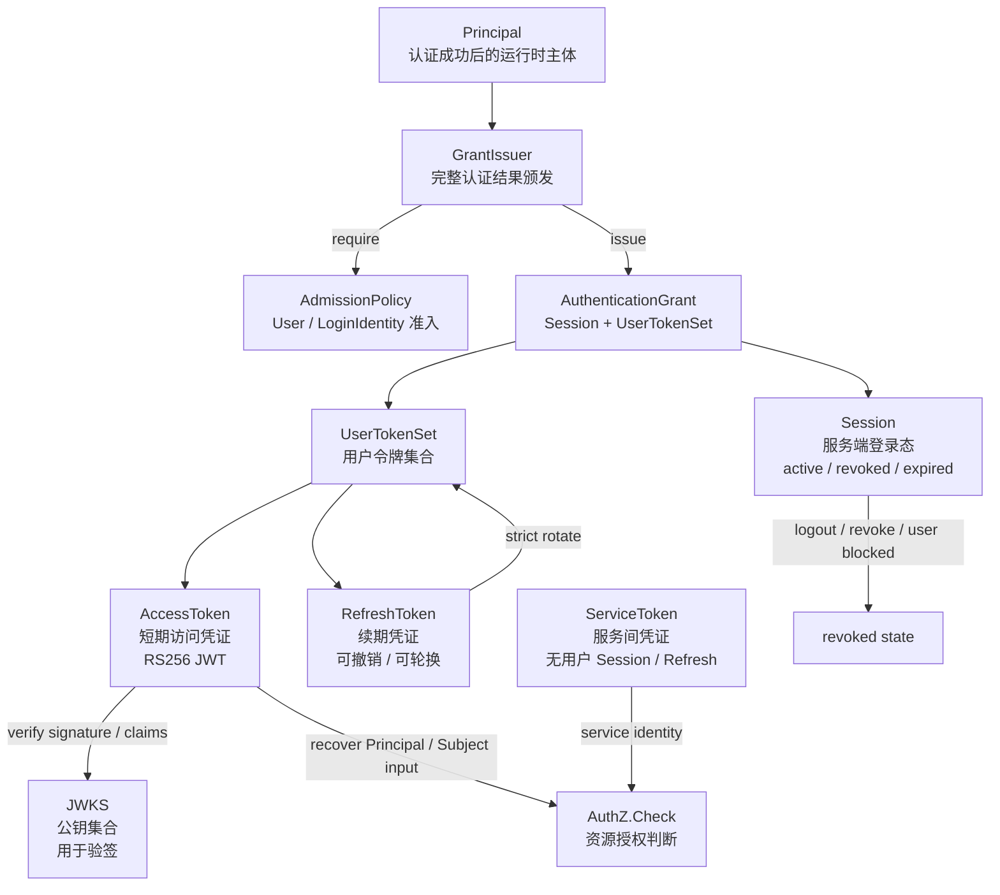
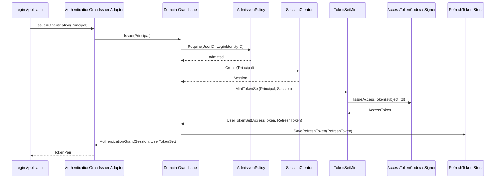
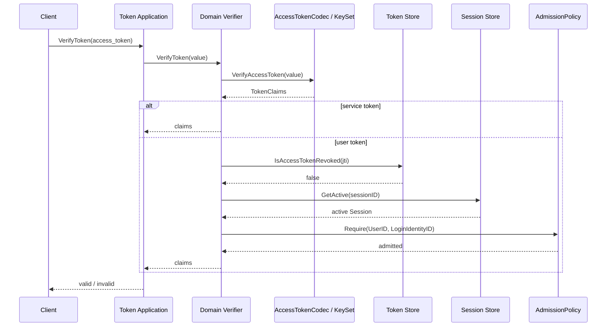
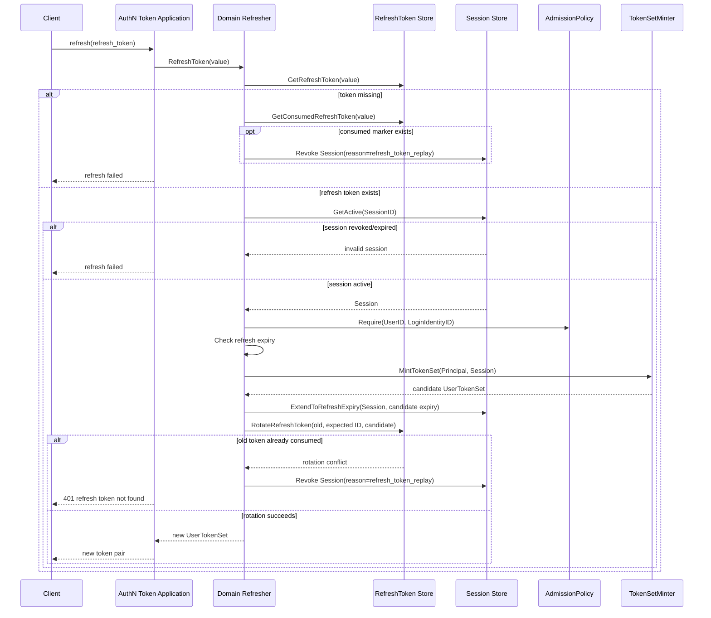
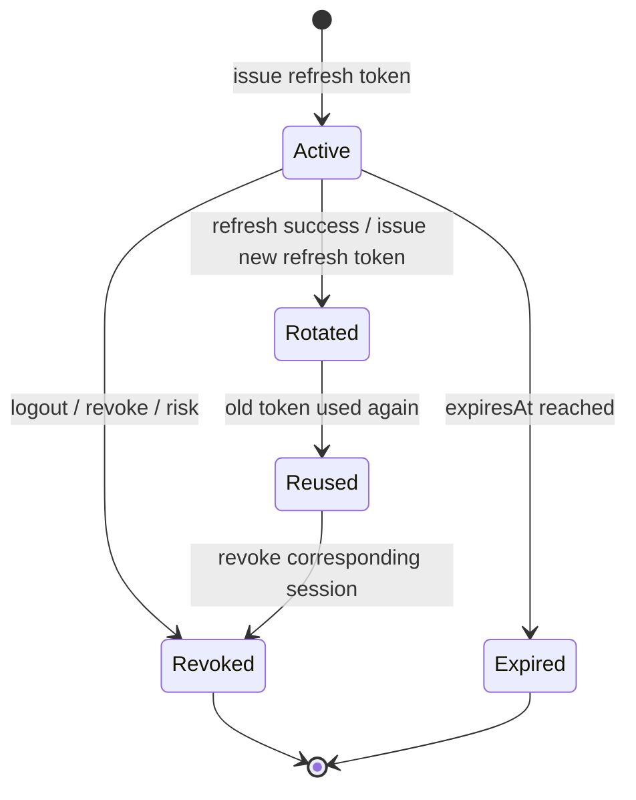
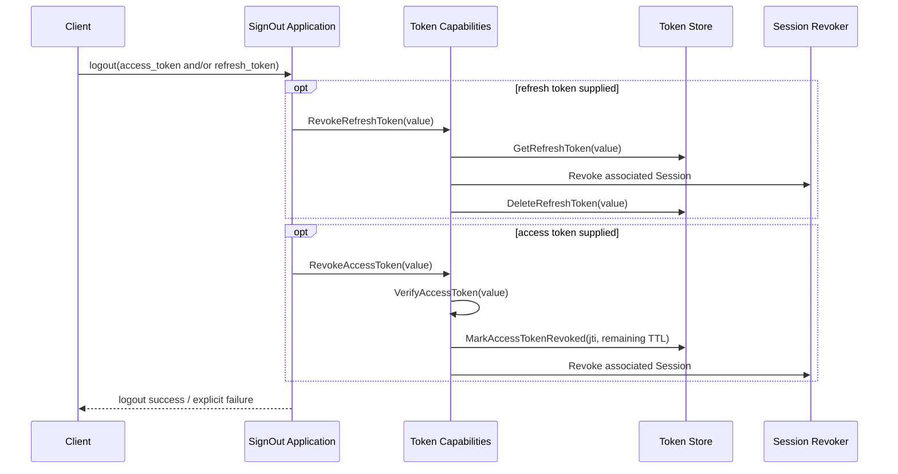
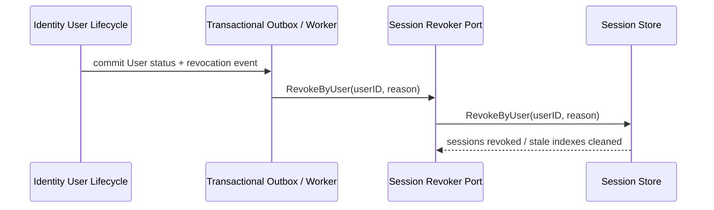
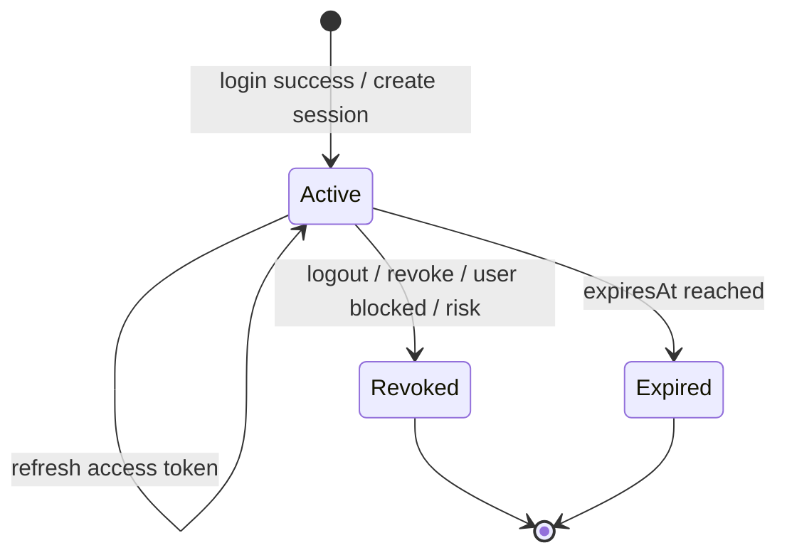
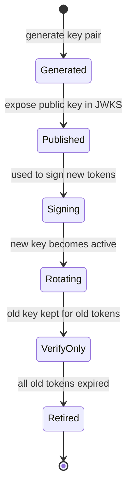

# 关键链路：Token 签发、刷新、吊销

> 状态：已实现 · 已核对 Refresh 单次轮换与 Session Redis 一致性；公开 REST/gRPC 契约未改变。

---

## 1. 本文回答

本文回答 8 个问题：

- Token 签发、刷新、吊销链路解决什么问题？
- `Principal`、`AuthenticationGrant`、`Session`、`UserTokenSet` 与三类 Token 的边界是什么？
- 登录成功后，AuthN 如何把 `Principal` 转换为可携带的访问凭证？
- AccessToken 与 RefreshToken 为什么必须拆开？
- RefreshToken 刷新时如何校验 Session、轮换 token、防重放？
- Logout / Revoke / User blocked 时如何让登录态失效？
- JWKS 在 AccessToken 验签中负责什么？
- 修改该链路时应该核对哪些代码和测试？

本文只讲 Principal 之后的 Session/Token 治理链路。
Login 如何生成 Principal 见 [04-关键链路-Login登录认证.md](04-关键链路-Login登录认证.md)；
AuthN 领域模型见 [01-领域模型与认证策略.md](01-领域模型与认证策略.md)。

---

## 2. 30 秒结论

Token 链路的目标是：

```text
把 Login 认证成功后的 Principal，转化为后续请求可携带、可验证、可刷新、可吊销的认证凭证。
```

核心主线：

```text
Principal
  -> GrantIssuer
       -> AdmissionPolicy
       -> AuthenticationGrant
            -> Session
            -> UserTokenSet(AccessToken + RefreshToken)
  -> verify AccessToken
  -> refresh AccessToken
  -> rotate RefreshToken
  -> revoke AccessToken / RefreshToken / Session
```

关键边界：

```text
Principal 是认证结果；
AuthenticationGrant 是 Session + UserTokenSet 的完整在线认证结果；
Session 是服务端登录态；
AccessToken 是短期访问凭证；
RefreshToken 是续期凭证；
ServiceToken 是不建立用户 Session 的服务间凭证；
JWKS 是公钥验签能力；
Token 验签成功不等于 AuthZ 授权通过。
```

如果只记一句话：

> AccessToken 解决“请求如何携带认证结果”，RefreshToken 解决“如何续期”，Session 解决“服务端如何撤销和治理登录态”。

---

## 3. Token 链路定位

`authentication.Authenticator` 的领域终点是 `Principal`；公开 SignIn 用例还会继续调用 `AuthenticationGrantIssuer`。

但客户端不能在每次请求里直接携带完整 Principal，因此 AuthN 需要把 Principal 转化为可携带凭证：

```text
Principal -> AuthenticationGrant(Session + UserTokenSet)
```

同时，Token 不能只有客户端自包含数据，还需要服务端治理能力：

```text
Session；
RefreshToken 状态；
撤销记录；
轮换记录；
key rotation；
JWKS。
```

该链路回答：

```text
登录成功后如何创建登录态？
客户端如何携带认证结果访问 API？
AccessToken 过期后如何续期？
用户退出后如何失效？
用户被封禁后如何失效？
RefreshToken 泄露后如何降低风险？
资源服务如何验证 AccessToken？
```

---

## 4. Token 与 Session 总览图



读图规则：

```text
Principal 不直接等于 token；
AuthenticationGrant 显式绑定本次建立的 Session 和 UserTokenSet；
Session 是服务端状态，不是 User 状态；
AccessToken 短期有效，通常用于 API 请求；
RefreshToken 较长期有效，只用于换取新 AccessToken；
RefreshToken 不应该被当作 Bearer AccessToken 使用；
ServiceToken 不得伪装成用户 Session，也不具有 Refresh 能力；
JWKS 只暴露公钥，不暴露私钥；
AuthZ.Check 不属于 Token 链路。
```

---

## 5. 核心对象边界

| 对象 | 作用 | 生命周期 | 不是什么 |
| --- | --- | --- | --- |
| `Principal` | 认证成功后的主体表达 | Login 成功后产生，请求或 Session 上下文中使用 | 不是 User，不是 JWT |
| `AuthenticationGrant` | 完整在线认证结果 | 初始颁发时产生 | 不是对外 DTO，不单独持久化 |
| `Session` | 服务端登录态 | 创建、刷新、撤销、过期 | 不是 User 状态，不是权限 |
| `UserTokenSet` | 一次建立或续期产生的用户令牌集合 | 初始颁发或刷新时产生 | 不是 Session，不包含 ServiceToken |
| `AccessToken` | 短期访问凭证 | 签发、验签、过期、撤销标记 | 不是 RefreshToken，不等于授权通过 |
| `RefreshToken` | 续期凭证 | 签发、校验、轮换、吊销、过期 | 不是 AccessToken |
| `ServiceToken` | 服务间访问凭证 | 签发、验签、过期 | 不是用户令牌，不建立 Session/RefreshToken |
| `JWKS` | 公钥发布 | key 发布、rotation、retire | 不暴露私钥，不表达授权 |

最重要的边界：

```text
AccessToken 验签成功，只说明认证上下文可信；
是否能访问某个资源，仍然要由 AuthZ Check 判定。
```

---

## 6. Token 签发链路

### 6.1 链路目标

Token 签发链路用于把 `Principal` 转换成客户端可携带凭证。

输入：

```text
Principal。
```

Session/Token TTL、issuer、audience 和当前签名密钥都是颁发器的组合时依赖或配置，不是每次 SignIn 由客户端传入的领域命令。

输出：

```text
领域输出：AuthenticationGrant(Session + UserTokenSet)；
对外 token pair：AccessToken、RefreshToken、ExpiresIn、TokenType。
```

SessionID 保留在领域 Grant 和 token claims 内部用于关联在线状态；当前 REST/gRPC 登录与刷新响应不单独暴露 SessionID。

响应中不应包含：

```text
private key；
password hash；
Credential material；
provider access token；
完整 User/Profile/ProfileLink 写模型；
完整 Assignment / RoleInheritance / PermissionGrant / ConstraintSet。
```

---

### 6.2 签发时序图



关键规则：

```text
Admission 必须在 Session 创建之前通过；
Session 应先创建，再 mint 与 Session 绑定的 UserTokenSet；
AccessToken 应短期有效；
RefreshToken 应与 Session 绑定；
Token claim 只携带必要认证上下文；
signing private key 不应越过 codec/signer 适配器边界；
签发失败不能伪造登录成功。
```

---

## 7. AccessToken 内容与校验

### 7.1 AccessToken 应携带什么

AccessToken 可以携带：

```text
issuer；
subject / UserID；
audience；
issuedAt；
expiresAt；
notBefore；
sessionID；
loginIdentityID；
auth method / AMR；
tokenID / jti。
```

`kid` 位于 JOSE header，用于选择验签公钥，不是 payload claim。具体声明以 Token 实现和契约为准。

AccessToken 不应携带：

```text
Credential material；
password hash；
RefreshToken；
private key；
完整 ProfileLink；
完整 Assignment / RoleInheritance / PermissionGrant / ConstraintSet；
敏感 provider token。
```

---

### 7.2 AccessToken 验证链路



验证至少应考虑：

```text
签名；
过期时间 exp；
生效时间 nbf；
签发方 iss；
受众 aud；
keyID / kid；
tokenID / jti；
用户 token 的 access-token revocation marker；
用户 token 的 active Session；
用户 token 的 User/LoginIdentity Admission。
```

这是 IAM 在线 `VerifyToken` 的固定用户令牌语义，不是“可选 Session check”。ServiceToken 在密码学验证后返回 claims，不走用户 Session/Admission；下游 SDK 的本地 JWKS 验签是另一种离线语义。

---

## 8. RefreshToken 刷新链路

### 8.1 链路目标

Refresh 链路用于在 AccessToken 过期后获取新的 AccessToken。

它回答：

```text
这个 RefreshToken 是否仍然有效？
对应 Session 是否仍然 active？
旧 RefreshToken 是否仍可被原子消费？
能否签发新的 AccessToken？
```

Refresh 输入：

```text
RefreshToken value。
```

当前领域 `Refresher` 从服务端 RefreshToken 事实恢复 SessionID、UserID、LoginIdentityID 与认证上下文；客户端不传入 device 或 rotation metadata 作为可信事实。

Refresh 输出：

```text
new AccessToken；
new RefreshToken；
expiresIn；
tokenType。
```

---

### 8.2 Refresh 时序图



关键规则：

```text
RefreshToken 只用于 refresh endpoint；
RefreshToken 不应作为 API Bearer token；
Session revoked 后不应继续 refresh；
User blocked 后相关 Session 应失效；
RefreshToken 过期或撤销后需要重新登录；
刷新失败不能签发新 AccessToken。
```

---

## 9. RefreshToken 轮换与重放防护

### 9.1 为什么需要轮换

RefreshToken 生命周期更长，泄露风险更高。

轮换策略用于：

```text
降低长期 token 泄露风险；
发现旧 RefreshToken 被重复使用；
把 refresh 行为纳入服务端治理；
支持设备级撤销和风险控制。
```

---

### 9.2 轮换模型



当前规则：

```text
每次 refresh 都严格轮换 RefreshToken；
同一个旧 RefreshToken 只能原子交换成功一次；
并发失败者不会获得已生成的 AccessToken，并继续得到现有 401 契约；
Session 延长失败时旧 RefreshToken 保持有效，新 RefreshToken 不落库；
轮换成功时原子写入 consumed marker，仅保留 SessionID / UserID，marker key 使用旧 token 摘要；
已消费旧 token 被重放时撤销对应 Session，任意未签发 token 不触发撤销；
当前不实现完整 token family，不跨 Session 批量撤销其他令牌家族；
交换成功但响应送达前进程崩溃时，客户端需要重新登录；当前没有重试宽限。
```

---

## 10. Logout / Revoke / 吊销链路

### 10.1 概念区分

| 概念 | 含义 | 常见触发 |
| --- | --- | --- |
| Logout | 当前用户主动退出 | 用户点击退出登录 |
| Revoke Session | 让某个 Session 失效 | 管理端踢下线、User blocked、风险控制 |
| Revoke RefreshToken | 让某个 refresh 凭证失效 | token 泄露、设备退出 |
| Revoke AccessToken | 写入 jti revocation marker 并撤销关联 Session | 当前 access token 泄露、退出 |

边界：

```text
Logout 不删除 User；
Revoke Session 不删除 LoginIdentity；
Revoke RefreshToken 不删除 Credential；
Token 吊销不删除 ProfileLink；
User blocked 可触发 Session revoke，但 User 状态仍属于 Identity。
```

---

### 10.2 Logout 时序图



Logout 命令使用调用方显式提供的 access token 和/或 refresh token，不从 middleware Principal 推导 SessionID。两类撤销都会根据令牌内的关联事实撤销对应 Session。

---

### 10.3 管理端吊销 / User blocked



这条状态收敛链只通过 `session.Revoker.RevokeByUser` 撤销 Session，不枚举或反查每个 AccessToken/RefreshToken，也不批量写 access-token revocation marker。在事件消费完成前，用户 token 的在线 Verifier 还会执行 Admission，关闭传播延迟窗口。

关键规则：

```text
User blocked 属于 Identity 状态变化；
Session revoke 属于 AuthN；
二者通过受控 port 协作，例如 session.Revoker；
Identity 不应直接操作 token store；
AuthN 不应修改 User 状态；
在线 Admission 与异步 Session revoke 同时保留，分别负责 fail-closed 与最终状态收敛。
```

---

## 11. Session 生命周期

Session 生命周期可以压缩为：

```text
created -> active -> refreshed -> revoked / expired
```



关键规则：

```text
Session 属于 AuthN；
Session 不是 User 状态；
Session 可以被 User blocked 间接撤销；
Session revoked 后不应 refresh；
Session expired 后不应 refresh；
Session 主对象与 User/LoginIdentity 两个 Redis 索引在同一事务保存；
Revoke 与 Extend 使用乐观事务，Revoke 是终态且 Extend 不能恢复索引；
批量撤销会清理索引存在但主对象缺失的陈旧成员；
Session 不表达权限。
```

旧版本可能遗留的“有主对象但无索引”Session 不做全库扫描，依靠最大 `session_max_ttl=24h` 自然收敛；在线 Verify 的 User/LoginIdentity 状态检查继续作为安全兜底。

---

## 12. JWKS 与 Key Rotation

### 12.1 JWKS 作用

JWKS 用于让其他服务验证 IAM 签发的 JWT。

它回答：

```text
这个 token header 中的 kid 对应哪把公钥？
该公钥是否仍在可验签窗口内？
资源服务如何不用私钥也能验证 token？
```

---

### 12.2 Key lifecycle



关键规则：

```text
JWKS 只暴露 public key；
private key 不应出现在响应、日志、文档示例中；
新 key 启用后，旧 key 应保留到旧 AccessToken 过期；
kid 必须能定位到正确 public key；
key rotation 不应导致未过期 token 大面积失效，除非安全事件要求。
```

---

## 13. 在线 Verify 与本地 JWKS 验签

AccessToken 在当前系统中存在两种明确不同的验证语义。

### 13.1 下游 SDK 本地 JWKS 验签

特点：

```text
AccessToken 自包含；
资源服务验证签名、issuer、audience、exp、nbf 等约束；
服务端不查 Session；
性能好；
强撤销能力弱，只能等短 TTL 过期。
```

适合：

```text
低风险接口；
AccessToken TTL 很短；
可接受几分钟撤销延迟。
```

---

### 13.2 IAM 在线 VerifyToken

特点：

```text
AccessToken 仍可自包含；
用户 token 验证时固定检查 jti revocation marker、active Session 和 Admission；
强撤销能力更好；
增加存储依赖和延迟。
```

适合：

```text
后台管理；
高风险操作；
User blocked 必须快速生效；
安全优先于极致性能。
```

当前 IAM 在线接口已选择第二种语义，并非未决策项；ServiceToken 是例外，密码学验证后不查用户 Session/Admission。下游服务若选择 SDK 本地验签，必须明确接受 access token 剩余寿命内的撤销延迟。详细取舍见 [03-Session-Token与JWKS.md](03-Session-Token与JWKS.md)。

---

## 14. 失败边界

| 场景 | 期望行为 | 说明 |
| --- | --- | --- |
| Principal 为空 | 拒绝签发 | Login 未成功不能签发 token |
| Admission 拒绝或状态查询失败 | 拒绝签发 | 不得创建 Session |
| Session 创建失败 | 签发失败 | 不应返回 token |
| AccessToken mint 失败 | 签发失败 | 不返回半成功响应；当前可留下孤儿 Session |
| RefreshToken mint / 初始保存失败 | 整体失败 | 不返回 token pair；当前可留下孤儿 Session |
| RefreshToken 无效/过期/撤销 | Refresh 失败 | 需要重新登录 |
| Session revoked/expired | Refresh 失败 | 不应签发新 AccessToken |
| 已消费 RefreshToken 重复使用 | 撤销对应 Session，并返回 `ErrRefreshTokenNotFound` / HTTP 401 | 不扩散为跨 Session 的 token-family 撤销 |
| 任意未签发 RefreshToken | `ErrRefreshTokenNotFound` / HTTP 401 | 没有 consumed marker，不触发 Session 撤销 |
| AccessToken 过期 | Verify 失败 | 客户端 refresh |
| JWT kid 不存在 | Verify 失败 | 可能是伪造 token 或 key rotation 异常 |
| JWKS 不可用 | 资源服务验签失败或降级 | 具体以运行时策略为准 |
| User blocked 后仍 refresh | 必须失败 | Session 应被撤销或 User 状态检查失败 |

---

## 15. 幂等与并发

### 15.1 签发并发

Login 成功后多次签发可能产生多个 Session。

需要明确策略：

```text
允许多设备多 Session；
限制单用户最大 Session 数；
同设备复用 Session；
新登录踢掉旧 Session；
高风险登录要求二次验证。
```

本文不假设已实现，必须以代码和产品安全策略为准。

---

### 15.2 Refresh 并发

并发 refresh 是高风险点。

风险：

```text
客户端重试导致同一个 RefreshToken 被使用多次；
攻击者拿到旧 RefreshToken 后重放；
两个 refresh 同时轮换，产生多个新 RefreshToken。
```

当前实现：

```text
RefreshToken 验证和轮换使用 Redis 原子脚本；
旧 RefreshToken 只能成功使用一次；
候选 TokenPair 在轮换成功前不会返回；
并发冲突按 replay 处理，撤销对应 Session 并返回现有未找到错误；
若胜者响应丢失或客户端重复提交旧 token，需要重新登录；
当前没有 grace window 或完整 token family，只执行当前 Session 级撤销。
```

---

### 15.3 Revoke 幂等

吊销操作建议幂等：

```text
重复 revoke 同一 Session 不应报内部错误；
重复 revoke 同一 RefreshToken 应保持 revoked；
logout 重复提交可以返回成功或已退出；
幂等不代表忽略审计。
```

---

## 16. 与其他模块的边界

### 16.1 与 Login

```text
Login 生成 Principal；
GrantIssuer 消费 Principal 并返回 AuthenticationGrant；
Token 领域服务负责 mint、refresh、verify、revoke 生命周期；
Login 失败不能创建 Session/Token；
当前 SignIn 应用用例组合 Login + Grant，但领域语义仍要分清。
```

---

### 16.2 与 Identity

```text
User 状态属于 Identity；
Session 状态属于 AuthN；
User blocked 可以通过受控 port 触发 AuthN Session revoke；
AuthN 不修改 User 状态；
Identity 不直接操作 token store。
```

---

### 16.3 与 AuthZ

```text
AccessToken 验签成功不等于授权通过；
Principal 可以映射为 Subject；
AuthZ Check 决定资源访问是否允许；
Token 不应携带完整 Assignment / RoleInheritance / PermissionGrant / ConstraintSet。
```

---

### 16.4 与 IDP

```text
IAM AccessToken 不等于 IDP AppToken；
IDP AppToken 用于调用外部 provider；
IAM AccessToken 用于访问 IAM 或业务 API；
RefreshToken 不应刷新 IDP AppToken，除非有明确 provider token 管理链路。
```

---

### 16.5 与 Suggest

```text
Token 链路不维护 Suggest Index；
Suggest 可以读取 request context 中的 Principal/UserID；
Profile 可见性仍由 Suggest 的 `visibility.Scope` 与 AuthZ facts 控制；
AccessToken 不能直接代表可搜索所有 Profile。
```

---

## 17. 常见反模式

| 反模式 | 问题 | 推荐做法 |
| --- | --- | --- |
| Login 失败仍签发 token | 严重认证绕过 | 只有 Principal 有效才签发 token |
| RefreshToken 当 AccessToken 用 | 令牌职责混淆 | RefreshToken 只走 refresh endpoint |
| AccessToken 长 TTL 且无撤销机制 | 被盗后风险窗口过长 | 短 TTL + RefreshToken / Session 治理 |
| RefreshToken 不绑定 Session | 难以统一撤销 | RefreshToken 应关联 Session |
| RefreshToken 不轮换且长期有效 | 泄露风险高 | 可采用轮换和重放检测 |
| JWT 验签成功直接放行资源 | 认证和授权混淆 | 认证后继续 AuthZ Check |
| JWKS 暴露 private key | 严重安全事故 | JWKS 只暴露 public key |
| User blocked 后 AccessToken 仍长期有效 | 封禁不生效 | 保留在线 Admission + Session revoke，并限制 TTL |
| Logout 只让客户端删除 token | 服务端无法治理 | 服务端 revoke Session/RefreshToken |
| Token claim 塞完整权限模型 | token 过大且权限漂移 | 只携带必要认证上下文，授权实时 Check |
| 日志打印 token | 凭证泄露 | 日志脱敏，避免打印完整 token |

---

## 18. 代码事实源

| 事实 | 路径 |
| --- | --- |
| Principal 模型 | `../../../internal/apiserver/domain/authn/authentication/principal.go` |
| AuthN domain | `../../../internal/apiserver/domain/authn` |
| AuthenticationGrant 与初始颁发 | `../../../internal/apiserver/domain/authn/grant` |
| Token 领域模型与生命周期服务 | `../../../internal/apiserver/domain/authn/token` |
| Token application facade/DTO | `../../../internal/apiserver/application/authn/token` |
| AuthN application | `../../../internal/apiserver/application/authn` |
| Session / RefreshToken store | `../../../internal/apiserver/infra` |
| JWT signer/verifier / JWKS provider | `../../../internal/apiserver/infra` |
| Identity User lifecycle 与 Session revoke 协作 | `../../../internal/apiserver/application/identity/user/service_lifecycle.go` |
| AuthN REST transport | `../../../internal/apiserver/transport/rest` |
| AuthN gRPC transport | `../../../internal/apiserver/transport/grpc` |
| AuthN container | `../../../internal/apiserver/container/authn` |
| REST 契约 | `../../../api/rest` |
| gRPC 契约 | `../../../api/grpc` |
| 架构测试 | `../../../internal/pkg/architecture` |
| 设计取舍 | `03-Session-Token与JWKS.md`、`../../06-专题设计/02-事务缓存与事件一致性.md` |

上表路径已按当前代码核对；目录调整时必须与本文和链接门禁同步更新。

---

## 19. Verify

修改本文后至少执行：

```bash
make docs-hygiene
```

涉及 Token / Session / JWKS：

```bash
go test ./internal/apiserver/application/authn/token/...
go test ./internal/apiserver/domain/authn/grant/...
go test ./internal/apiserver/domain/authn/token/...
go test ./internal/apiserver/application/authn/...
go test ./internal/apiserver/domain/authn/...
```

涉及 infra store / signer / verifier：

```bash
go test ./internal/apiserver/infra/...
```

具体路径以当前代码为准。

涉及 Identity 封禁协作：

```bash
go test ./internal/apiserver/application/identity/...
go test ./internal/apiserver/domain/identity/...
```

涉及 REST/gRPC 契约或 transport：

```bash
make api-validate
make proto-gen
go test ./internal/apiserver/transport/rest/...
go test ./internal/apiserver/transport/grpc/...
```

涉及 SDK：

```bash
go test ./pkg/sdk/...
```

涉及分层依赖或模块边界：

```bash
go test ./internal/pkg/architecture
```

---

## 20. 本文总结

Token 签发、刷新、吊销链路可以压缩成：

```text
Principal
  -> GrantIssuer
       -> AdmissionPolicy
       -> AuthenticationGrant(Session + UserTokenSet)
  -> verify AccessToken
  -> refresh AccessToken
  -> rotate RefreshToken
  -> revoke AccessToken / RefreshToken / Session
```

最重要的边界是：

```text
Principal 是认证结果；
AuthenticationGrant 是完整在线认证结果；
Session 是服务端登录态；
AccessToken 是短期访问凭证；
RefreshToken 是续期凭证；
ServiceToken 是无用户 Session/Refresh 的服务间凭证；
JWKS 只暴露公钥；
AccessToken 验签成功不等于 AuthZ 授权通过；
User blocked 通过受控 port 触发 AuthN Session revoke。
```

下游本地验签与跨模块传递边界分别见 [06-关键链路-JWKS与本地验签.md](06-关键链路-JWKS与本地验签.md) 和 [07-模块边界-AuthN与Identity-IDP-AuthZ.md](07-模块边界-AuthN与Identity-IDP-AuthZ.md)。
