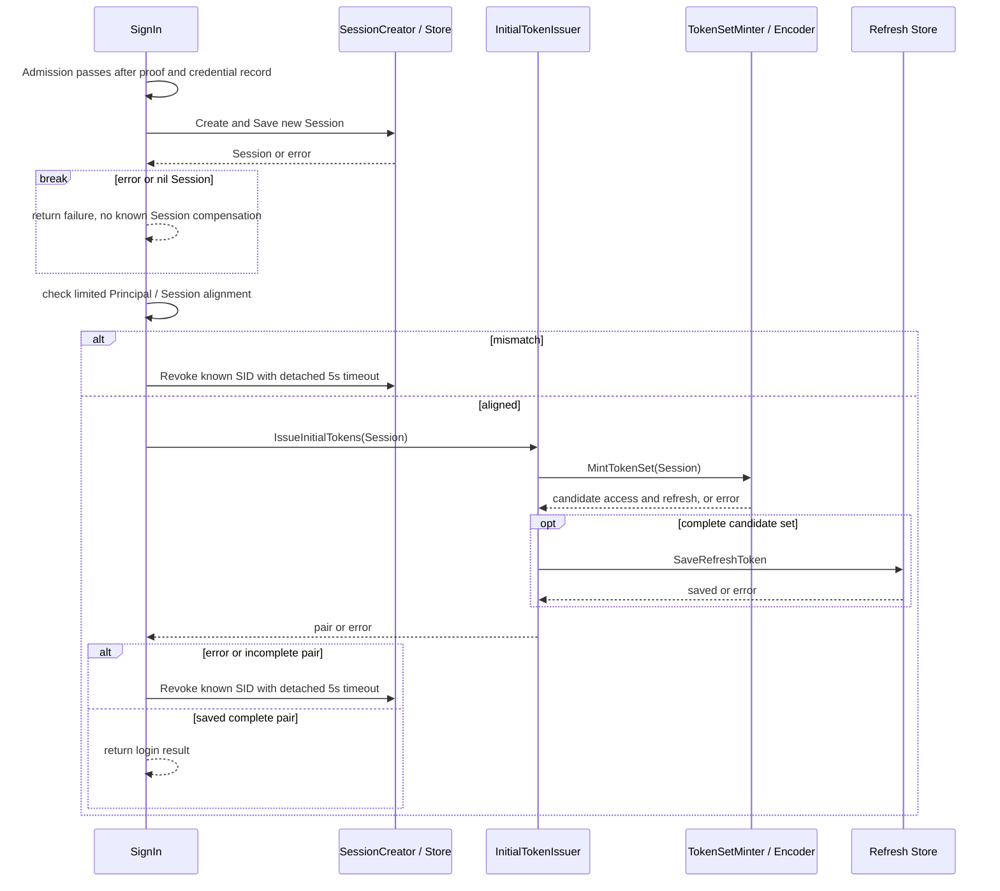
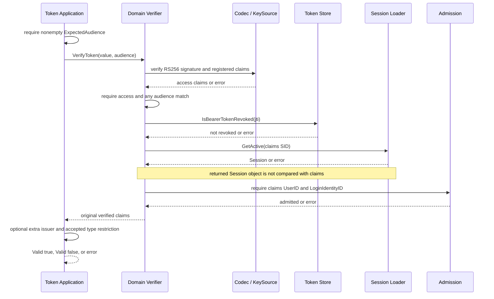
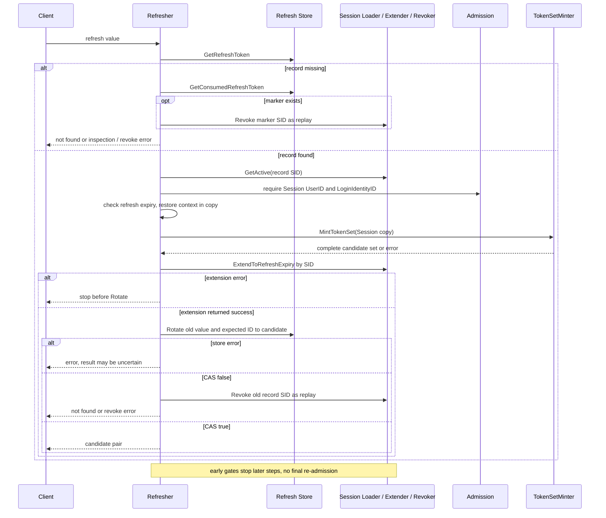
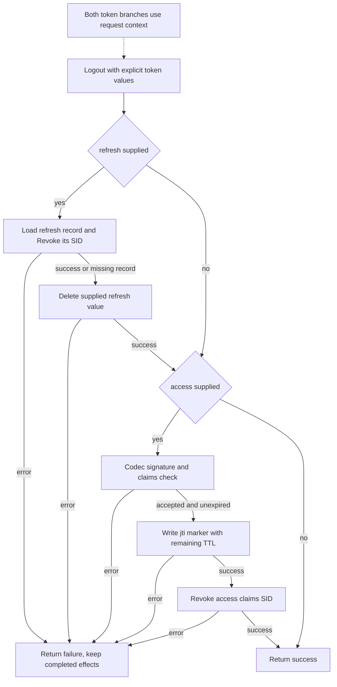

# 关键链路：Token 签发、刷新、吊销

> 状态：已实现 · 当前设计与实现。 本文拥有初始颁发、在线 Verify、Refresh、Logout/Revoke 的执行顺序、失败状态与设计取舍；模型、密钥与部署证据分别维护。

## 1. 结论：交付令牌、当前可用与完成清理是不同结果

Login 通过证明/记录/Admission后创建Session，再mint并保存初始refresh，全部完成才交付TokenPair。在线Verify依次检查JWT、受众、撤销标记、active Session和User/LoginIdentity准入。Refresh读取服务端refresh记录，再从Session重新投影，先延期、后轮换。Logout/Revoke是按提供的令牌或管理目标分步撤销，不是全局事务。

由此有三个实际区别：成功拿到pair不保证其Session在使用时仍active；Verify返回valid=false通常仍是成功HTTP/RPC响应；撤销请求失败可能已经撤掉Session或写了jti标记。正常签发保证声明来源，但在线Verify没有再把JWT身份/上下文与Session逐项对齐。下面分别说明检查到了哪里、留下什么状态。

| 对象 | 当前用途 | 不能据此推断 |
| --- | --- | --- |
| Principal / 登录结果 | 证明成功主体 / Principal与TokenPair的应用结果 | 已持久化User或完整业务授权 |
| Session | Redis保存原认证上下文、业务快照、状态与期限 | 主体当前组织资格、所有历史索引完整或所有请求已停 |
| AccessToken / AccessTokenClaims | RS256 Signed JWT / 声明值对象 | Claims构造即已验签，或本地验签即在线可用 |
| RefreshToken | 不透明、关联Session的单次续期凭证 | JWT、独立授权事实或无限续期能力 |
| consumed marker | 旧refresh轮换后用于识别重放的Session/User引用 | 永久记录或完整token-family图谱 |
| jti marker | 指定access的在线撤销事实 | 全部同Session令牌都被逐个标记或物理清理 |

对象与兼容协议见 [Session、Token与JWKS](03-Session-Token与JWKS.md)，证明副作用与新Session补偿由 [Login](04-关键链路-Login登录认证.md)维护；签名密钥生命周期归 [JWKS](06-关键链路-JWKS与本地验签.md)。服务身份本身通过mTLS/ACL建立，不靠Service Token或用户Session/refresh；获准服务执行用户Login仍需用户证明。

## 2. 公开入口：令牌从body进入，服务身份不等于用户身份

| 能力 | REST | gRPC / SDK Auth() |
| --- | --- | --- |
| 在线验证 | POST /api/v3/authn/verify，匿名路由 | VerifyToken，受已装配服务准入/方法ACL约束 |
| 续期 | POST /api/v3/authn/refresh_token，匿名路由 | RefreshToken，同上 |
| 显式退出 | POST /api/v3/authn/logout，匿名路由，至少一种令牌 | 无Logout RPC；可分别调用两种Revoke |
| 独立access/refresh撤销 | 两个handler存在，但当前没有公开注册 | RevokeToken / RevokeRefreshToken |
| 按SID/用户/登录入口管理撤销 | v2 admin三条路由，JWT + Resource/Action | 无对应批量RPC/SDK方法 |

匿名指路由不先要求一个用户JWT，仍会验证提交的续期/访问凭证；Logout不从Authorization header或middleware Principal自动取得当前SID。gRPC handler也不自行完成mTLS，是否接线服务拦截器/ACL必须由组合根和生效配置证明，模板不是部署证据。

Verify/Refresh不单独接受客户端SID。gRPC Verify的force_remote未进入服务端应用请求，服务器始终走在线验证；Refresh的context未被采用，两种Revoke的operator也未读取。accepted_token_types可以缩小接受结果，不能令真实domain支持refresh/service验签；include_metadata只在valid时投影同源claims。不要把proto字段存在写成已经改变业务语义。

Login/Refresh的公开TokenPair只有access_token、refresh_token、expires_in、token_type；没有单独SID、refresh expiry、Session状态或完整上下文。SID可在Verify claims中取得。REST expires_in按access剩余时间截断为整数秒，没有负数裁剪；gRPC使用Duration并把负数裁到零。REST响应还有code/message/data封装。机器契约当前继承bearer安全声明、成功payload和错误面有偏移，见 [契约治理](../../04-接口与SDK/01-REST-gRPC与契约治理.md)。

## 3. 初始颁发：先建立在线状态，再保存续期凭证


```mermaid
sequenceDiagram
    participant S as SignIn
    participant SS as SessionCreator / Store
    participant I as InitialTokenIssuer
    participant M as TokenSetMinter / Encoder
    participant R as Refresh Store
    S->>S: Admission passes after proof and credential record
    S->>SS: Create and Save new Session
    SS-->>S: Session or error
    break error or nil Session
        S-->>S: return failure, no known Session compensation
    end
    S->>S: check limited Principal / Session alignment
    alt mismatch
        S->>SS: Revoke known SID with detached 5s timeout
    else aligned
        S->>I: IssueInitialTokens(Session)
        I->>M: MintTokenSet(Session)
        M-->>I: candidate access and refresh, or error
        opt complete candidate set
            I->>R: SaveRefreshToken
            R-->>I: saved or error
        end
        I-->>S: pair or error
        alt error or incomplete pair
            S->>SS: Revoke known SID with detached 5s timeout
        else saved complete pair
            S-->>S: return login result
        end
    end
```

TokenSetMinter一次取服务器UTC时间：access jti随机生成，iat/nbf和exp精确到秒，exp为now+AccessTTL；encoder映射固定顶层声明及Session已有Attributes，选择active签名key。refresh另生成随机ID/value，期限交给SessionRefreshExpirer。AccessToken不是存入Redis的一份完整JWT记录，初始保存的是refresh；在线撤销另维护jti marker。refresh JSON没有IssuedAt，读取构造使用当前时间，该值不能作原始签发时间证据。

身份、SID、AMR、auth_time及已有BusinessContext从Session投影，issuer/audience/AccessTTL来自装配。新登录的BusinessContext为空，不通过签发查询组织或AuthZ权限；JWT不写Method/Realm或任意Principal.Claims。Attributes在投影/codec中原样复制，allowlist在legacy恢复等入口执行，不能把固定顶层字段理解为对任意内部Session属性统一过滤。私钥只在signer/codec内使用，公钥与发布过程归JWKS主文。

InitialTokenIssuer只要求已有Session，负责mint、pair完整性和refresh保存；它不另做Admission或创建Session。SignIn负责前置准入、有限alignment与已知SID补偿，不能把单独调用issuer当作完整Login。Creator返回nil/error时不会补偿未知写入结果；已返回Session后的失败使用WithoutCancel+独立5秒撤销，补偿失败保留两个原因。Revoke不物理删除可能已保存的refresh；响应丢失也没有登录结果复用合同，具体窗口回链Login。

## 4. 在线Verify：检查当前状态，返回的仍是JWT声明

下图是各步都通过的路径，任一步拒绝/错误立即结束；应用随后决定是无效结果还是error。


```mermaid
sequenceDiagram
    participant A as Token Application
    participant V as Domain Verifier
    participant C as Codec / KeySource
    participant TS as Token Store
    participant S as Session Loader
    participant P as Admission
    A->>A: require nonempty ExpectedAudience
    A->>V: VerifyToken(value, audience)
    V->>C: verify RS256 signature and registered claims
    C-->>V: access claims or error
    V->>V: require access and any audience match
    V->>TS: IsBearerTokenRevoked(jti)
    TS-->>V: not revoked or error
    V->>S: GetActive(claims SID)
    S-->>V: Session or error
    Note over V,S: returned Session object is not compared with claims
    V->>P: require claims UserID and LoginIdentityID
    P-->>V: admitted or error
    V-->>A: original verified claims
    A->>A: optional extra issuer and accepted type restriction
    A-->>A: Valid true, Valid false, or error
```

Codec检查RS256、kid及key算法一致、签名、canonical issuer、当前JWT库的exp/nbf/iat验证；领域还要求jti/sub/iss/aud、三种时间、exp>nbf及sid/非零User/入口ID，sub必须等于UserID。缺失token_type仍按access兼容并计指标，显式非access拒绝；auth_time优先numeric，再回退attributes的RFC3339，缺失不被Claims.Validate拒绝，也不与Session时间/iat逐项比较。

ExpectedAudience由接收方声明，非空且任一匹配即可；不是全部aud均相等。额外ExpectedIssuer在在线检查之后再约束，不能替代codec的canonical issuer。当前没有由Credential材料/锁定、Session实体版本、AuthZ版本或QS组织资格产生的在线逐次门禁。

**Session活跃检查与声明对齐不是同一保证。** GetActive的返回对象被丢弃，Admission查询JWT中UID/LIID，最终返回JWT中的Org/Attributes/AMR/auth_time。标准mint从Session投影保证正常来源；若历史/非标准签发状态不一致，Verify不会重投影修复或逐项发现。Refresh则使用Session主体，这两个路径的权威来源不同，不据缺少二次比较直接认定可伪造漏洞。

| 失败阶段 | 应用结果与公开表现 |
| --- | --- |
| ExpectedAudience缺失/非法 | 参数错误，在codec/在线存储前终止 |
| Codec任意错误，包括KeySource读取技术失败 | domain统一包装TokenInvalid；应用转Valid=false+FailureCode，error=nil |
| audience不匹配、jti已撤销、SessionInactive、已映射User/入口拒绝 | 已登记拒绝转Valid=false；不能按理想“业务/技术”分类推断所有错误面 |
| jti存储/Session读取技术失败或未映射准入错误 | 通常Internal等error，未产生有效claims |
| 额外issuer或accepted类型不匹配 | Valid=false，FailureCode为0 |
| REST公开Verify无效结果 | HTTP200封装valid=false，claims省略，不公开应用FailureCode |
| gRPC公开Verify无效结果 | 正常RPC响应，统一status=REVOKED及泛化failure_reason；不证明真的发生了撤销 |
| JWT middleware遇到error或!Valid | 统一拒绝401/102002；不能从独立Verify的响应合同推断受保护路由返回200 |

因此“Verify成功响应”不是业务接受，客户端必须读取valid。REST的TokenInvalid替身错误测试也不能用来证明真实应用所有无效令牌都会返回401。

### 4.1 SDK本地、远程与显式结果缓存

本地JWKS验签不查jti/Session/User状态；远程策略调用IAM在线Verify，再把无效结果转SDK错误。默认constructor选择local、remote或local→remote；只有JWKS获取错误/空集合允许远程fallback，未知kid、签名/声明无效不自动ForceRefresh或借远程放行，没有默认remote→local接管。

验证结果缓存另是宿主显式包装的CachingVerifyStrategy，标准constructor没有自动装配，也没有仓库内建VerifyResultCache实现。命中key只含token，当前只检查Claims非nil与type，不重新校验valid、exp、audience、issuer或调用选项；TTL原样交给宿主cache、没有按exp裁剪，直接返回同一结果pointer。具体推论：同一token先按audience A接受，随后按B查缓存，包装器不会按B重新检查；宿主缓存若允许结果活过exp，也没有命中时到期复核。现无这些缓存专项，不描述成默认SDK行为。

标准NewTokenVerifier保存可用remoteStrategy，调用级Verify(ForceRemote=true)直接走remote；没有远端时返回不可用错误。显式缓存用NewTokenVerifierWithStrategy(caching)构造时未配置remoteStrategy，该实例的ForceRemote会报错，并非现成提供缓存旁路；直接调用Caching.Verify也不解释该标志。JWKS公钥缓存与valid结果缓存不是同一个对象或撤销预算。接入合同与验证边界见 [SDK接入](../../04-接口与SDK/02-Go-SDK与业务系统接入.md)。

## 5. Refresh：从Session重投影，先延期再交换旧凭证


```mermaid
sequenceDiagram
    participant C as Client
    participant R as Refresher
    participant T as Refresh Store
    participant S as Session Loader / Extender / Revoker
    participant P as Admission
    participant M as TokenSetMinter
    C->>R: refresh value
    R->>T: GetRefreshToken
    alt record missing
        R->>T: GetConsumedRefreshToken
        opt marker exists
            R->>S: Revoke marker SID as replay
        end
        R-->>C: not found or inspection / revoke error
    else record found
        R->>S: GetActive(record SID)
        R->>P: require Session UserID and LoginIdentityID
        R->>R: check refresh expiry, restore context in copy
        R->>M: MintTokenSet(Session copy)
        M-->>R: complete candidate set or error
        R->>S: ExtendToRefreshExpiry by SID
        alt extension error
            R-->>C: stop before Rotate
        else extension returned success
            R->>T: Rotate old value and expected ID to candidate
            alt store error
                R-->>C: error, result may be uncertain
            else CAS false
                R->>S: Revoke old record SID as replay
                R-->>C: not found or revoke error
            else CAS true
                R-->>C: candidate pair
            end
        end
    end
    Note over R,S: early gates stop later steps, no final re-admission
```

GetActive/Admission/expiry/mint的任一步失败都会在延期前结束。refresh记录的User/入口字段不重新作为认证主体；新claims来自Session，历史重复字段只参与下面的兼容。没有轮换后的Session/Admission复核，也没有把成功返回与之后的请求原子绑定。

### 5.1 寿命：实际模板与可滑动能力分开

Session.ExpiresAt是当前有效期；当前LifetimePolicy计算绝对上限CreatedAt+**当前装配**sessionMaxTTL，未持久化每Session最初采用的policy版本：

```text
initial_session_expiry = min(created_now + refreshTTL, created_now + positive sessionMaxTTL)
new_refresh_expiry = min(now + refreshTTL, CreatedAt + positive sessionMaxTTL)
access_expiry = now + AccessTTL    # 秒级，未裁到Session期限
```

缺CreatedAt或正数绝对上限时，沿用现有Session.ExpiresAt作为保守边界；无有效未来期限则拒绝。原auth_time不提升为刷新时刻，续期本身不满足敏感绑定/解绑最近认证。

例如refresh窗口2h、绝对上限8h：10:00创建至12:00，11:00刷新可滑至13:00，17:30刷新最多至18:00。当前prod/dev模板却是refresh168h、Session24h，初始就到24h上限，通常只轮换而没有继续延期空间。prod access60m，dev/options access15m；模板不证明生效部署。

access寿命独立：假设上限次日10:00，09:50按60m签access可得到10:50的exp，但Session/refresh先在10:00失效；在线验证届时拒绝，本地验签仍可能按JWT期限接受。这是寿命计算的源码推论，不承诺已在生产观察到，也不把AccessTTL当作Session的绝对寿命。

### 5.2 历史上下文：整块回退只恢复到副本

只有AuthContext的Method/Realm/AMR/AuthenticatedAt**全部缺失**才读旧refresh的AuthMethod/Realm/AMR/SessionClaims，不是逐字段补洞。非空legacy claims可替换副本的整个BusinessContext；原Session的Org42并非在此分支一定优先于旧Org99。认证时间先取Session AuthenticatedAt/CreatedAt，仍缺失才读legacy auth_time；AMR为空时用jwt，不制造新的认证时间。

具体连续两轮案例：原Session认证/业务上下文空、CreatedAt=C；旧refresh带password/global/pwd和Org99。第一轮在副本上恢复并签发，但Extender按SID重新读取原Redis Session只改期限；新refresh也不保存legacy副本。第二轮仍加载空认证上下文，且新refresh已无旧字段，Method/Realm为空、AMR退为jwt、Org回到原Session值0，auth_time仍C。若C也缺失，首轮靠legacy恢复的时间下一轮可为zero。

当前单次测试证明副本恢复且原对象不变，没有覆盖真实store连续两轮的上述场景；因此不能写成“刷新完成历史Session迁移”。它也不查询QS当前组织资格。若要持久迁移，需另定义与Revoke/并发刷新兼容的条件写及缺失字段策略。

### 5.3 失败状态不能只用一个“刷新失败”概括

| 位置 | 当前后果 |
| --- | --- |
| GetRefreshToken技术错误/损坏记录 | 包装TokenInvalid；与missing后marker读取Internal的分类不同 |
| Session/Admission提前拒绝 | 不进入refresh过期删除，也不mint/rotate |
| record已过期且到达expiry检查 | 尽力Delete，忽略删除错误，返回RefreshTokenExpired；Redis正常TTL到期时往往已作为missing处理 |
| mint或延期返回error | 不调用Rotate；该请求不保存candidate。延期的写入结果仍可能不确定，不能把所有error当作零写入 |
| 延期成功、Rotate报错 | Session期限可能已变；通信错误不足以判定旧key保留或新key未生效 |
| Rotate=true，响应丢失 | 已消费旧refresh；重发旧value可能触发replay，没有结果复用/grace window |

## 6. 原子轮换与重放：原子范围是三种token key

Redis脚本读取旧refresh，比较token_id并要求旧key PTTL>0，再写新refresh、写旧value摘要对应的consumed marker、删除旧refresh。新refresh TTL来自candidate剩余寿命；marker TTL来自执行时旧key的PTTL，而非另给一个固定观察窗。marker只保留旧Session/User引用，不保存旧value明文；**可用refresh主key仍直接包含不透明value**，不能把marker摘要当作整个存储已摘要化。

脚本不读取Session，不校验new/old SessionID或UserID一致，也不重新检查User准入/refresh JSON中的ExpiresAt。正常minter从同Session生成candidate；这份应用构造保证不能扩大成store对任意candidate的验证。miniredis交换测试刻意使用不同candidate Session/User，仍可选中一个赢家。

| 原子交换结果 | Refresher当前处理 | 能推断什么 |
| --- | --- | --- |
| true | 返回candidate pair | 该旧key比较/交换完成，不证明Session此刻仍active |
| false | 按replay撤旧记录SID，返回not found或撤销错误 | 可由旧key缺失、ID不符、PTTL<=0触发，**不能确定已被别人消费** |
| error | 返回Internal | 需要区分脚本/通信阶段，不从错误响应推断旧/新记录状态 |
| 初次读取missing，marker存在 | 按marker SID撤销，再not found | 在marker有效窗口内识别旧value；不是永久family查找 |
| missing且marker不存在 | not found，不凭空撤Session | 任意未签发value不能定位一个撤销目标 |

并发A/B使用同一有效旧key时，原子比较最多一方交换成功；到达Rotate=false或missing+marker的请求会撤Session。其他请求也可能早在GetActive/Admission/mint/Extend处拒绝，不能统一说所有输家都执行replay。合法重复提交与被盗旧value当前使用同一处理，没有幂等回执、宽限或完整token-family。

两组跨步骤推论需要保留：A延期成功→管理员撤SID→A轮换成功，可能返回关联revoked Session的pair；或者A早先GetActive成功，但Extend读取时主对象已丢失，当前store该nil分支返回nil，后续仍可交换。Session WATCH保证普通Extend不恢复revoked状态，不保证后面的token Lua与Session同事务；成功pair不保证在线可用。

gRPC SDK默认全方法最多3次尝试，重试Unavailable/ResourceExhausted/Aborted，未排除Refresh。若已轮换但响应丢失且满足gRPC重试条件，重发旧value可触发replay撤SID；配置存在不证明每次网络失败都会重放。调用方应按不确定状态设计恢复，不能把自动重试称为安全续期。当前处理依赖请求ctx，replay撤销不采用Login补偿的独立5秒上下文，取消/撤销失败会明确返回错误。

## 7. Logout与管理撤销：持有凭证和管理权限是不同入口

Logout处理body中的refresh在前、access在后，第一次错误就停止。SID分别来自Redis refresh记录和验签access声明，没有比较当前User或两份令牌属于同一Session。持有A的access与B的refresh会先作用于B、再作用于A；不要按成功日志“当前登录会话已退出”推断只撤当前操作者。


```mermaid
flowchart TD
    L["Logout with explicit token values"] --> RF{"refresh supplied"}
    RF -->|yes| RS["Load refresh record and Revoke its SID"]
    RS -->|success or missing record| RD["Delete supplied refresh value"]
    RS -->|error| E["Return failure, keep completed effects"]
    RD -->|error| E
    RD -->|success| AF{"access supplied"}
    RF -->|no| AF
    AF -->|yes| CV["Codec signature and claims check"]
    CV -->|error| E
    CV -->|accepted and unexpired| JM["Write jti marker with remaining TTL"]
    JM -->|error| E
    JM -->|success| SR["Revoke access claims SID"]
    SR -->|error| E
    SR -->|success| OK["Return success"]
    AF -->|no| OK
    Note["Both token branches use request context"] -.-> L
```

access撤销直接用codec，不走在线Verifier、expected audience或Admission；先写jti再撤SID，revokedBy来自claims.Subject。refresh先撤其SID再删该value，revokedBy来自refresh.UserID，gRPC operator不改变它。已成功写marker但SID撤销失败时，这个access被在线拒绝，同SID其他access/refresh不由这笔marker自动全部清掉；refresh删除失败则可能留记录但SID已revoked。

没有“即使access已过期也保证退出原会话”的合同：真实codec先校验时间，可能在revoker的IsExpired no-op之前报错。缺失refresh可以按删除收敛；同一Session普通Revoke可重复，但两种令牌多步退出并非所有重复请求无条件成功。Token应用包装ErrTokenRevokeFailed，SignOut再次构造该错误会丢弃底层cause；不是Login补偿的errors.Join。整个Logout沿请求ctx，没有自动后台重试。

三条管理入口仍在v2，由路由先在线JWT与Resource/Action检查；缺保护链不注册，应用revoker不再做第二套目标所有权授权：

| 请求 | Resource / Action |
| --- | --- |
| POST /api/v2/admin/sessions/{sessionId}/revoke | iam:authn:collection:sessions / revoke |
| POST /api/v2/admin/login-identities/{loginIdentityId}/sessions/revoke | 同Resource / revoke_by_login_identity |
| POST /api/v2/admin/users/{userId}/sessions/revoke | 同Resource / revoke_by_user |

拥有相应动作者作用于路径目标，不只当前User。actor记录优先LoginIdentityID，再UserID，最后admin；不按管理员Role名称旁路，也不改变User/LoginIdentity事实或AuthZ Assignment。AuthN登录/令牌路由为v3，不据版本统一猜管理路径。

## 8. Session状态、索引与User撤销任务

Session主对象与User/入口ZSet在创建TxPipelined中保存，Revoke/Extend通过WATCH重试维护。正常Revoke改status=revoked并移除两份索引，保留主对象至原TTL；已过期则可删除。普通Extend检查active，不能恢复revoked；但底层Save可覆盖同SID，没有NX/终态检查，所以“Revoke终态”须限定正常Revoke/Extend路径，不是所有store写入。

GetActive使用status==active、未过期及LifetimePolicy，不把RevokedAt/Reason另作门禁。Save只检查非nil/正TTL，decode不拒绝任意schema/status组合；异常active+未来期限+非空RevokedAt不能仅据时间戳当作已撤销。这里说明恢复/内部构造的合同边界，不宣称外部用户能写这些记录。

两个索引score为ExpiresAt.Unix，索引自身没有EXPIRE。批量撤销先按当前Unix秒移除到期成员，一次ZRange读取全部SID，再逐个Get/Revoke；没有分页游标/创建截止线/全批事务。移除按秒可能较payload纳秒期限提前不足1秒。主对象缺失只清本次索引的陈旧member，不主动清另一个索引；主对象存在但索引缺失也没有全库修复器。

第N个SID失败时前N-1个可已撤销；重跑重新枚举当时索引，有效依赖索引完整和实际重试成功，不是“一次成功即所有并发新增Session都已撤”。后续新SID可出现在下一次重跑，但本次ZRange之后创建的SID不会自动追加。

User block/deactivate在状态改变时，于MySQL同事务更新状态并Stage identity_session_revocation_outbox意图；Stage可去重，不保证新增pending。worker按UserID批量撤Redis Session，不枚举refresh、写每个jti或撤AuthZ岗位。当前标准User更新不推进users.version，旧completed任务可能挡住后一次Stage；条件及验证缺口由[AuthN模块边界](07-模块边界-AuthN与Identity-IDP-AuthZ.md#3-停用用户状态判断与会话清理互补任务成功不是并发屏障)维护。独立在线Admission拒绝读到的inactive/blocked User，但多次读取不构成提交屏障。此任务与标准Broker Outbox是不同对象。

任务不按创建截止时间/UserVersion筛Session，也不重查当前User状态；Activate不取消旧任务。因此停用任务仍pending→激活并新登录→旧任务执行可撤新Session。反向窗口是Admission早先通过→停用任务枚举完成→在途Login后建SID，当前任务不再回访；User继续inactive时在线检查仍挡住，未来Activate没有认证epoch自动排除该SID。这些是源码时序推论，现无真实交错专项。

worker失败重试、stale processing恢复属于其持久任务协议，不保证每任务只执行一次；Complete/Fail也没有attempt租约fencing。测试使用SQLite/撤销替身，不证明真实MySQL锁、全部Redis效果或激活后任务竞态。索引与存储细节回链 [Redis](../../03-基础设施/02-Redis与缓存一致性.md)，User协作回链 [AuthZ模块边界](../03-AuthZ/07-模块边界-AuthZ与AuthN-Identity-Suggest.md)。

## 9. 设计选择与候选：先定义合同，再扩大原子范围

| 当前选择 | 收益与代价 | 候选需要证明什么 |
| --- | --- | --- |
| JWT + 在线Session/Admission | 签名可跨服务验证，状态可在线拒绝；本地/结果缓存并不等价 | 若要求声明与Session逐项绑定，定义需对齐字段、历史记录及变化时机；组织资格仍归业务 |
| AccessTTL独立，refresh有绝对上限 | 两种寿命各有用途；Session到期可早于access exp，当前policy影响旧Session上限 | 若裁剪access或冻结每Session政策，明确本地撤销预算、签发响应与旧数据迁移 |
| 先延期后token CAS | 避免新refresh生效后延期报错；仍有写结果不确定、缺主对象、并发撤销窗口 | 单Lua需同时定义SID/owner、状态/寿命、索引、旧ID和新记录；只加末尾重读不能形成持续屏障 |
| 冲突/识别旧值后撤Session | 安全处理重复凭证；合法重试也可使赢家失效，false不精准说明原因 | typed交换结果可区分miss/ID/TTL；宽限或结果回执须定义重放主体、秘密交付期限与撤销竞态 |
| 历史恢复仅会话副本，新refresh去冗余 | 正常Session保留权威来源；特殊空上下文可只恢复一轮 | 持久迁移需条件写、缺失字段/业务优先级、Revoke不被覆盖及两轮真实store回归 |
| 任务按User当前索引批量撤销 | 避免逐次JWT在线清理；无精确截止线，旧任务影响新会话 | epoch/截止线及租约fencing需与登录、激活、索引和部分重试一起定义，不能只取消一条任务 |
| 宿主显式验证结果缓存 | 能减少在线调用；token-only key和过期/options检查不足 | key纳入策略或强制复核、TTL裁exp、复制结果及ForceRemote路径需独立测试 |

均是候选，未改变当前实现。物理token清理、凭证可用、User准入、资源授权与业务接受仍是不同结果；公钥发布没有全消费者确认屏障，密钥流程由JWKS主文维护，不在这里复制第二套算法。

## 10. 责任与证据：测试证明到具体对象

| 规则 | 事实源 | 现有证明与限制 |
| --- | --- | --- |
| 初始mint/save与已知SID补偿 | [initial issuer](../../../internal/apiserver/application/authn/token/initial_issuer.go)、[completion](../../../internal/apiserver/application/authn/signin/completion.go) | completion使用真实issuer与协作者替身；不证明Create未知写结果恢复或跨存储原子提交 |
| 声明/时钟/类型与受众 | [issuer](../../../internal/apiserver/domain/authn/token/issuer.go)、[claims](../../../internal/apiserver/domain/authn/token/token.go)、[codec](../../../internal/apiserver/infra/token/jwt/signed_jwt_codec.go) | issuance一次时钟、claims不变量、真实RSA签验+KeySource替身；非所有类型只由bearer_revocation测试证明 |
| 在线状态与公开无效结果 | [verifier](../../../internal/apiserver/domain/authn/token/verifier.go)、[应用](../../../internal/apiserver/application/authn/token/capabilities.go)、[RPC](../../../internal/apiserver/transport/grpc/service/authn/auth_token_service.go) | integration用真实codec/miniredis、内存Session、allow-all Admission，直接调用handler/service；不证真实Login、网络mTLS或MySQL准入 |
| 刷新期限/上下文 | [lifetime](../../../internal/apiserver/domain/authn/session/lifetime_policy.go)、[refresher](../../../internal/apiserver/domain/authn/token/refresher.go) | 纯策略滑动/上限与单次副本恢复；没有连续两轮真实store或政策切换专项 |
| CAS/replay | [token store](../../../internal/apiserver/infra/cache/redis/token-store.go)、token/refresher_atomic_test.go | miniredis两写者唯一交换、ID不符不改旧key；领域内存CAS+固定SessionLoader/记录Revoker不实际改变Session状态，不证赢家在线失效 |
| Session状态/索引 | [store](../../../internal/apiserver/infra/cache/redis/session_store.go) | miniredis正常Save/Revoke、Revoke/Extend竞争与单missing成员；不覆盖Rotate跨操作、丢主对象、批量部分成功或Save覆盖 |
| User任务 | [lifecycle](../../../internal/apiserver/application/identity/user/service_lifecycle.go)、[worker](../../../internal/apiserver/infra/mysql/sessionrevocation/worker.go) | SQLite事务与失败一次revoker替身后重试；不证MySQL锁、多worker租约或重新激活/在途Login交错 |
| 公开管理/SDK | [admin routes](../../../internal/apiserver/transport/rest/admin_routes.go)、[SDK verifier](../../../pkg/sdk/auth/verifier/runtime.go)、[缓存](../../../pkg/sdk/auth/verifier/caching_strategy.go) | 路由注册/缺保护、传输替身、本地RSA/远端替身与ForceRemote用例；无真实Logout双SID、Refresh丢响应重放或缓存options命中专项 |

源码案例未由专项验证时按推论记录，不认定生产已经出现问题。没有用文档门禁、测试名称或本地race通过替代真实Redis持久化/故障切换、MySQL、provider、CI、部署与业务接受。

```bash
make docs-hygiene docs-facts docs-validation-tests
go test -race ./internal/apiserver/application/authn/signin \
  ./internal/apiserver/application/authn/token ./internal/apiserver/application/authn/session \
  ./internal/apiserver/application/authn/admission \
  ./internal/apiserver/domain/authn/token ./internal/apiserver/domain/authn/session \
  ./internal/apiserver/domain/authn/admission ./internal/apiserver/infra/cache/redis \
  ./internal/apiserver/infra/token/jwt ./internal/apiserver/application/identity/user \
  ./internal/apiserver/infra/mysql/sessionrevocation \
  ./internal/apiserver/transport/rest/authn/handler ./internal/apiserver/transport/rest/authn/request \
  ./internal/apiserver/transport/grpc/service/authn ./internal/pkg/middleware/authn \
  ./internal/apiserver/transport/rest ./internal/apiserver/container/authn \
  ./pkg/sdk/auth/verifier ./pkg/sdk/auth/loginv3 ./pkg/sdk ./pkg/sdk/config \
  ./internal/pkg/grpc ./internal/pkg/architecture
```

命令是验证入口，执行环境/结果和图源复核见 [阶段记录](../../_data/reviews/2026-10-06-docs-refactor.md)。本轮只重构文档，不修改业务行为或机器契约。
