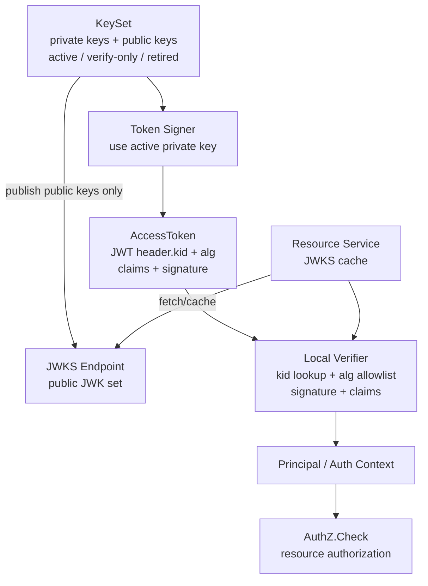
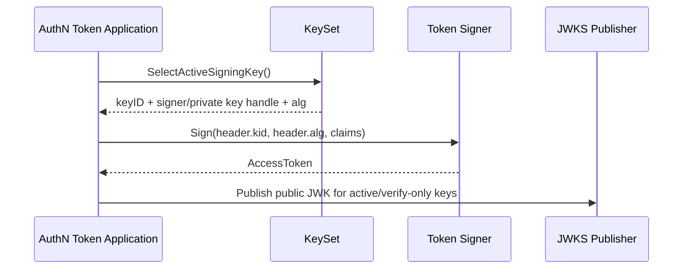
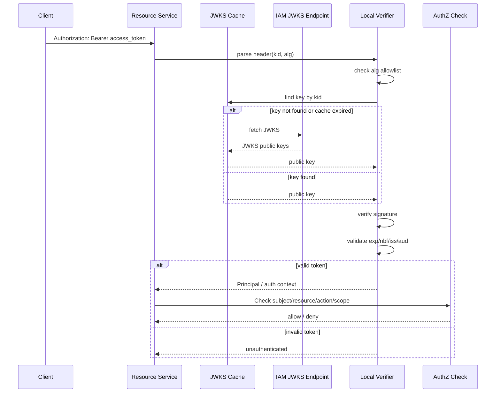
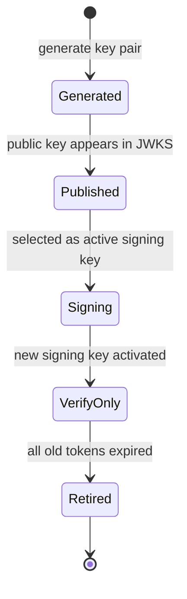

# 关键链路：JWKS 与本地验签

> 状态：待补证据 · 第一版正文，待继续按 `application/authn/token`、KeySet/JWKS runtime、REST/gRPC 契约、配置和测试逐项核对。

---

## 1. 本文回答

本文回答 8 个问题：

- JWKS 与本地验签链路解决什么问题？
- `JWK`、`JWKS`、`kid`、`alg`、`KeySet` 分别是什么？
- IAM 如何用私钥签发 AccessToken，并只向外发布公钥？
- 资源服务如何通过 JWKS 本地验证 AccessToken 签名？
- 为什么资源服务不能盲信 token header 里的 `alg`？
- JWKS 缓存、刷新、失败降级和 key rotation 如何处理？
- JWKS 验签成功与 AuthZ 授权通过有什么区别？
- 修改该链路时应该核对哪些代码和测试？

本文只讲 JWKS 与本地验签。Token 签发、刷新、吊销见 [05-关键链路-Token签发刷新吊销.md](05-关键链路-Token签发刷新吊销.md)，专题设计见 [../../05-专题设计/01-JWT-JWS-JWK-JWKS-KeyRotation.md](../../05-专题设计/01-JWT-JWS-JWK-JWKS-KeyRotation.md)。

---

## 2. 30 秒结论

JWKS 的目标是让资源服务无需访问 IAM 私钥，也能本地验证 IAM 签发的 AccessToken。

核心主线：

```text
KeySet
  -> active signing key
  -> sign AccessToken with private key
  -> publish public JWK in JWKS
  -> resource service fetches and caches JWKS
  -> verify token by kid + alg allowlist + signature + claims
  -> recover Principal / auth context
```

关键边界：

```text
JWKS 只发布公钥；
私钥绝不能进入 JWKS；
资源服务不能盲信 token header 中的 alg；
kid 只能用于定位候选 key，不能单独代表可信；
本地验签成功只说明 token 来源和完整性可信；
是否允许访问资源仍由 AuthZ Check 决定。
```

如果只记一句话：

> JWKS 让“验签能力”分发出去，但不会把“签发能力”和“授权决策”分发出去。

---

## 3. 核心概念

| 概念 | 全称 | 含义 | 关键边界 |
| --- | --- | --- | --- |
| `JWT` | JSON Web Token | token 的紧凑序列化格式 | 不等于一定可信，必须验签和校验 claims |
| `JWS` | JSON Web Signature | 对 JWT 做签名保护的格式 | 验签通过才说明内容未被篡改 |
| `JWK` | JSON Web Key | JSON 格式表示的 key | JWKS 中只应出现 public JWK |
| `JWKS` | JSON Web Key Set | JWK 集合 | 用于发布验签公钥集合 |
| `kid` | Key ID | token header 中的 key 标识 | 只用于定位 key，不能直接信任 |
| `alg` | Algorithm | 签名算法 | 必须由服务端 allowlist 校验 |
| `KeySet` | key 集合 / key 管理运行时 | 管理签名 key、验签 key、rotation | 不应泄露 private key |

---

## 4. JWKS 链路总览



读图规则：

```text
签发使用 private key；
JWKS 发布 public key；
资源服务只拿 public key；
kid 用于从 JWKS cache 中找到候选 key；
alg 必须与服务端允许算法匹配；
验签后还要检查 exp、nbf、iss、aud 等 claims；
Principal 是认证上下文，资源访问仍需 AuthZ。
```

---

## 5. 签发侧：KeySet 与 AccessToken

### 5.1 签发目标

签发侧要完成：

```text
选择当前 active signing key；
使用 private key 对 AccessToken 签名；
在 token header 中写入 kid 和 alg；
在 claims 中写入 issuer、audience、subject、expiresAt 等必要信息；
把对应 public key 暴露到 JWKS。
```

### 5.2 签发时序图



关键规则：

```text
private key 只留在签发侧；
JWKS 只发布 public key；
active signing key 必须有 kid；
token header 的 kid 应能在 JWKS 中找到对应 public key；
签名算法应由服务端配置和实现决定，不由客户端决定；
签发失败不应返回半成功 token。
```

---

## 6. JWKS Endpoint

### 6.1 Endpoint 目标

JWKS endpoint 负责发布当前可用于验签的 public keys。

它通常回答：

```text
当前有哪些 public key 可以用于验证 IAM AccessToken？
每个 public key 的 kid 是什么？
每个 key 的 kty/use/alg/n/e/crv 等参数是什么？
资源服务应该如何缓存这些 key？
```

### 6.2 JWKS 响应边界

JWKS 可以包含：

```text
keys[]；
kid；
kty；
use；
alg；
n/e 或 crv/x/y 等 public parameters；
cache headers，可选。
```

JWKS 不应包含：

```text
private key；
password；
Credential material；
RefreshToken；
provider access token；
内部 key seed；
密钥管理系统凭据。
```

### 6.3 Endpoint 可用性

JWKS endpoint 应满足：

```text
可公开读取或至少对资源服务可读取；
不需要用户登录才能读取；
可被资源服务缓存；
支持 key rotation 期间同时发布新旧 public key；
错误响应不泄露私钥或内部配置。
```

---

## 7. 资源服务本地验签链路

### 7.1 验签目标

资源服务本地验签要回答：

```text
这个 AccessToken 是否由 IAM 使用可信 key 签发？
token 内容是否未被篡改？
token 是否仍在有效期内？
token 是否面向当前服务？
能否从 token 中恢复 Principal 或认证上下文？
```

### 7.2 本地验签时序图



关键规则：

```text
先解析 header 只能用于选择验证策略，不能视为可信；
alg 必须在本地 allowlist 内；
kid 找不到时可以刷新 JWKS，但不能跳过验签；
验签通过后仍要验证 claims；
验签成功后仍要执行 AuthZ Check。
```

---

## 8. alg allowlist

资源服务不能盲信 token header 中的 `alg`。

风险包括：

```text
攻击者伪造 alg=none；
攻击者诱导服务使用错误算法验签；
算法混淆导致非预期 key 类型被接受；
配置漂移导致旧弱算法继续可用。
```

建议：

```text
服务端配置允许算法列表，例如 RS256 / ES256；
token header.alg 必须命中 allowlist；
JWK.alg 如果存在，也必须与 token header.alg 和本地策略一致；
禁止 alg=none；
禁止从 token header 动态决定是否跳过验签；
不同 issuer 的 alg 策略应隔离。
```

---

## 9. kid 查找与 key 选择

`kid` 的作用是帮助资源服务在 JWKS 中定位候选 key。

它不是信任依据。

正确流程：

```text
读取 token header.kid；
在本地 JWKS cache 中查找 kid；
找不到时刷新 JWKS；
仍找不到则验签失败；
找到 key 后仍要检查 alg/kty/use；
使用 public key 验签；
验签失败则拒绝。
```

错误做法：

```text
kid 存在就认为 token 可信；
kid 找不到就用任意 key 尝试；
kid 找不到就跳过验签；
根据 token 中的 kid 动态访问任意 URL 获取 key；
允许 token header 指定 jwk/jku 并直接信任。
```

---

## 10. claims 校验

签名验证只证明 token 内容未被篡改，还必须校验 claims。

至少应校验：

| claim | 作用 | 说明 |
| --- | --- | --- |
| `iss` | 签发方 | 必须匹配 IAM issuer |
| `aud` | 受众 | 必须包含当前资源服务或 API audience |
| `sub` | 主体 | 通常映射 UserID 或 subject identifier |
| `exp` | 过期时间 | 当前时间必须早于 exp |
| `nbf` | 生效时间 | 当前时间必须晚于 nbf，可选 leeway |
| `iat` | 签发时间 | 可用于过旧 token 策略 |
| `jti` | token ID | 可用于黑名单或审计 |
| `sid` | session ID | 可用于 Session check |
| `amr` | 认证方式 | 可用于高风险操作要求 MFA |

注意：

```text
claims 校验应考虑 clock skew；
aud/iss 不应省略；
sub 不应直接当成完整 User 实体；
amr 可以作为认证强度输入，但不是授权结果。
```

---

## 11. JWKS 缓存与刷新

### 11.1 为什么要缓存

资源服务不能每次请求都访问 IAM JWKS endpoint。

缓存用于：

```text
降低 IAM 压力；
提升请求延迟；
避免 JWKS endpoint 短暂不可用导致全站认证失败；
支持 key rotation 的平滑切换。
```

### 11.2 缓存策略

建议策略：

```text
按 issuer 缓存 JWKS；
按 kid 建立 key index；
遵守 Cache-Control / max-age，如果 endpoint 提供；
设置本地最大缓存时间；
kid not found 时触发主动刷新；
刷新失败时，如果旧 cache 未过安全窗口，可继续使用旧 cache 验证旧 token；
不要无限期信任过期 cache。
```

### 11.3 缓存失败边界

| 场景 | 期望行为 |
| --- | --- |
| cache 命中且 key 有效 | 本地验签 |
| cache 过期但 JWKS 可刷新 | 刷新后验签 |
| kid 不存在但 JWKS 可刷新 | 刷新后再次查找 kid |
| JWKS 不可用但旧 key 未过安全窗口 | 可用旧 cache 验签旧 token，具体看策略 |
| JWKS 不可用且无可用 cache | 验签失败 |
| JWKS 返回 malformed key | 忽略该 key 或整体刷新失败 |

---

## 12. Key Rotation

### 12.1 Rotation 目标

Key rotation 用于降低长期密钥泄露风险，同时保证旧 token 在过期前仍可验证。

典型生命周期：

```text
generate new key pair
  -> publish new public key
  -> switch active signing key
  -> keep old public key as verify-only
  -> wait old access tokens expire
  -> retire old key
```

### 12.2 Key 状态图



关键规则：

```text
active signing key 用于签发新 token；
verify-only key 只用于验证旧 token；
retired key 不再发布，也不再验签；
旧 public key 保留时间至少覆盖旧 AccessToken 最大 TTL + clock skew；
安全事件下可以强制 retire，但会导致未过期 token 失效。
```

---

## 13. 本地验签与 Session Check 的关系

本地验签回答：

```text
token 是否由可信 IAM key 签发，且 claims 是否有效？
```

Session Check 回答：

```text
这个 token 所属 Session 是否仍然 active？
```

两种模式：

| 模式 | 优点 | 缺点 |
| --- | --- | --- |
| 纯本地验签 | 性能好，资源服务无状态 | 强撤销依赖短 TTL |
| 本地验签 + Session Check | 强撤销能力好 | 依赖 Session store，延迟更高 |

建议：

```text
普通接口可以使用短 TTL + 本地验签；
高风险接口可以额外做 Session Check；
后台管理接口可优先考虑 Session Check 或黑名单；
User blocked 后快速生效需要短 TTL、Session Check 或 blacklist 配合。
```

---

## 14. 验签成功后的 Principal 恢复

验签成功后，资源服务可以从 token claims 中恢复认证上下文。

通常包括：

```text
UserID / subject；
SessionID；
LoginIdentityID；
AuthMethod / AMR；
Issuer；
Audience；
IssuedAt；
ExpiresAt。
```

恢复后的对象应该是：

```text
Principal；
AuthContext；
Subject input for AuthZ。
```

不应该恢复成：

```text
完整 User entity；
完整 Profile entity；
完整 ProfileLink；
完整 Permission / RoleBinding；
Credential；
RefreshToken。
```

---

## 15. 与 AuthZ 的边界

JWKS 本地验签属于 AuthN。

它只证明：

```text
token 来源可信；
token 未被篡改；
token claims 在当前时间和当前服务下有效；
可以恢复 Principal 或认证上下文。
```

它不证明：

```text
当前请求可以访问某个资源；
当前用户拥有某个角色；
当前用户可以操作某个 Profile；
当前用户可以搜索所有档案。
```

因此链路应该是：

```text
Bearer Token
  -> JWKS local verification
  -> Principal / Subject
  -> AuthZ Check(resource, action, scope)
  -> allow / deny
```

---

## 16. 失败边界

| 场景 | 期望行为 | 说明 |
| --- | --- | --- |
| token 缺失 | unauthenticated | 没有认证凭证 |
| token 格式错误 | unauthenticated | 不能解析 header/claims/signature |
| alg 不在 allowlist | unauthenticated | 防算法混淆 |
| kid 缺失 | unauthenticated | 除非系统明确允许单 key 且有安全约束 |
| kid 找不到 | 刷新 JWKS 后仍失败则 unauthenticated | 不应跳过验签 |
| 签名验证失败 | unauthenticated | token 可能被篡改或伪造 |
| exp 过期 | unauthenticated | 客户端应 refresh |
| nbf 未生效 | unauthenticated | 可考虑 clock skew |
| iss 不匹配 | unauthenticated | 防其他 issuer token 混入 |
| aud 不匹配 | unauthenticated | 防 token 被跨服务滥用 |
| JWKS endpoint 不可用 | 使用有效 cache 或失败 | 取决于缓存策略 |
| JWKS 暴露异常 key | 忽略或刷新失败 | 不应信任 malformed key |
| AuthZ Check 失败 | forbidden | 验签成功但无访问权 |

---

## 17. 常见反模式

| 反模式 | 问题 | 推荐做法 |
| --- | --- | --- |
| JWKS 暴露 private key | 严重安全事故 | JWKS 只发布 public key |
| 信任 token header.alg | 算法混淆风险 | 使用本地 alg allowlist |
| kid 找不到就跳过验签 | 认证绕过 | 刷新 JWKS，仍找不到则失败 |
| 根据 jku 动态拉任意 JWKS | 可被攻击者指定 key 源 | 固定 trusted issuer JWKS URI |
| 只验签不校验 exp/aud/iss | token 可跨域或过期使用 | 完整 claims 校验 |
| 验签成功直接放行资源 | AuthN/AuthZ 混淆 | 继续 AuthZ Check |
| JWKS cache 永不过期 | key retire 后仍被信任 | 设置最大缓存和刷新策略 |
| key rotation 立即删除旧 key | 未过期 token 大面积失效 | 保留 verify-only key 到旧 token 过期 |
| 日志打印完整 token | 凭证泄露 | 日志脱敏，仅记录 jti/kid 等必要字段 |
| 资源服务持有 IAM private key | 扩大签发能力风险面 | 资源服务只持有 public key/JWKS cache |

---

## 18. 代码事实源

| 事实 | 路径 |
| --- | --- |
| Token application/runtime | `../../../internal/apiserver/application/authn/token` |
| AuthN domain | `../../../internal/apiserver/domain/authn` |
| JWT signer/verifier / JWKS provider | `../../../internal/apiserver/infra` |
| KeySet / key config | `../../../internal/apiserver/infra`、配置路径以代码为准 |
| Auth middleware | `../../../internal/apiserver/transport/rest`、`../../../internal/apiserver/transport/grpc` |
| JWKS REST endpoint | `../../../internal/apiserver/transport/rest` |
| AuthN container | `../../../internal/apiserver/container/authn` |
| REST 契约 | `../../../api/rest` |
| gRPC 契约 | `../../../api/grpc` |
| 架构测试 | `../../../internal/pkg/architecture` |
| 专题设计 | `../../05-专题设计/01-JWT-JWS-JWK-JWKS-KeyRotation.md` |

注意：上表中的具体路径需要继续与当前源码核对。如果源码目录已调整，应以代码为准并同步更新本文。

---

## 19. Verify

修改本文后至少执行：

```bash
make docs-hygiene
```

涉及 Token/JWKS/KeySet：

```bash
go test ./internal/apiserver/application/authn/token/...
go test ./internal/apiserver/domain/authn/...
```

涉及 signer/verifier/JWKS provider：

```bash
go test ./internal/apiserver/infra/...
```

具体路径以当前代码为准。

涉及 REST/gRPC 契约或 middleware：

```bash
make api-validate
make proto-gen
go test ./internal/apiserver/transport/rest/...
go test ./internal/apiserver/transport/grpc/...
```

涉及 SDK：

```bash
go test ./pkg/sdk/...
```

涉及分层依赖或模块边界：

```bash
go test ./internal/pkg/architecture
```

---

## 20. 本文总结

JWKS 与本地验签链路可以压缩成：

```text
KeySet
  -> active signing key
  -> sign AccessToken with private key
  -> publish public JWK in JWKS
  -> resource service fetches JWKS
  -> verify by kid + alg allowlist + signature + claims
  -> recover Principal
  -> AuthZ Check
```

最重要的边界是：

```text
JWKS 只发布公钥；
私钥不进入 JWKS；
资源服务不能盲信 token header.alg；
kid 只用于定位 key，不是信任依据；
验签成功不等于授权通过；
key rotation 要保留旧 public key 到旧 token 过期。
```

下一篇应继续编写 Auth Middleware / Principal 注入链路，说明 REST/gRPC 请求如何从 Bearer Token 恢复 Principal，并把认证上下文传递给 application 和 AuthZ。
