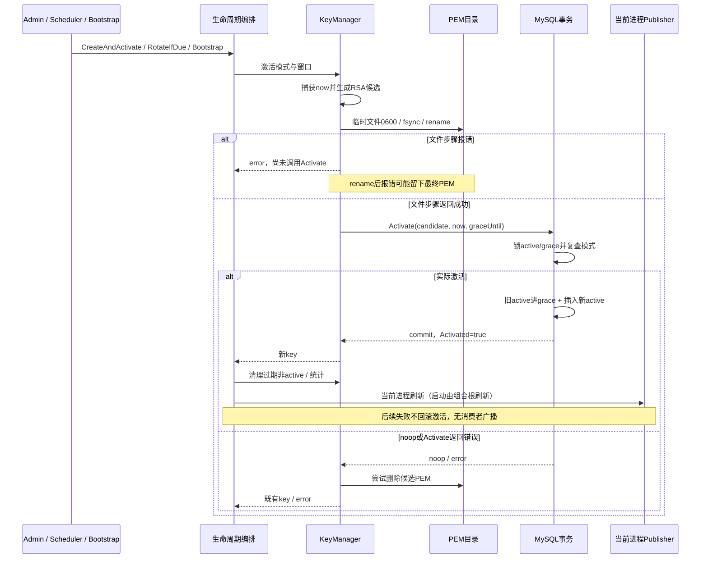
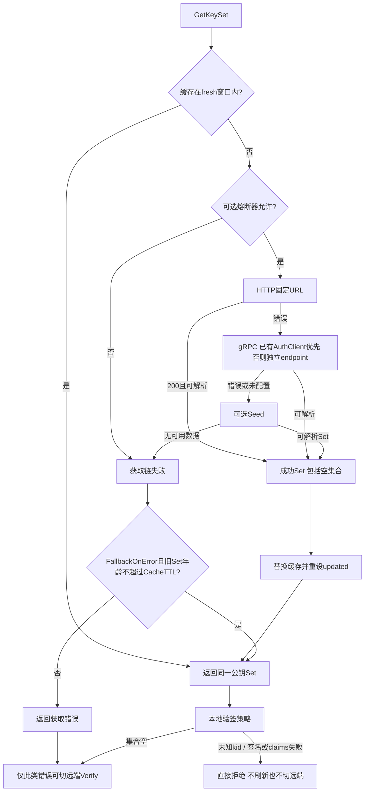
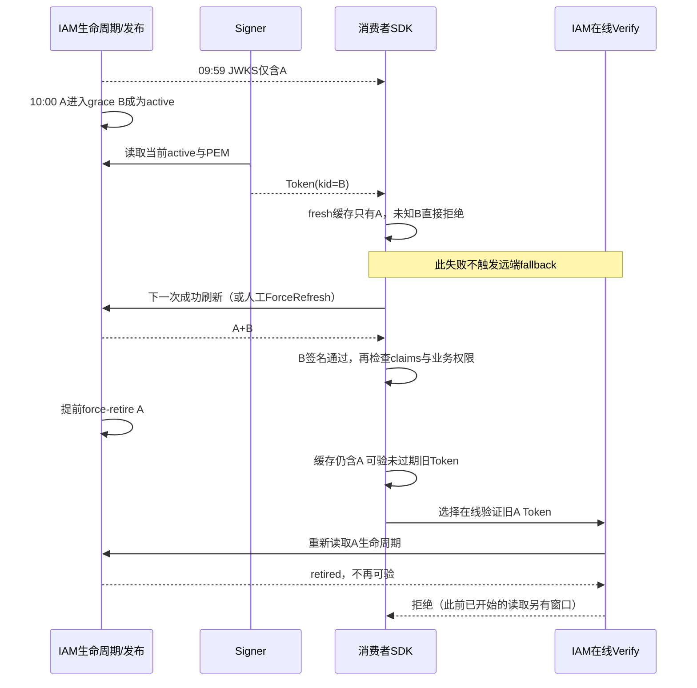

# 关键链路：签名密钥生命周期、JWKS 发布与本地验签

> 状态：已实现 · 当前源码事实、设计取舍与实现限制。本文维护密钥状态、PEM/数据库转换、发布与消费者缓存；源码推演、已有测试、环境验收分别标明。候选设计尚未实现。

## 1. 结论：可签发、当前可发布、消费者仍信任是三个问题

IAM 从数据库选择唯一且当前有效的 `active`，读取其 PEM 私钥签发 RS256 AccessToken；公共 JWKS 发布当前有效的 `active/grace` 公钥。资源服务拿到一份 JWKS 后可以独立验签，却不知道这把公钥此刻是否已被 IAM 退役，也不查询 Session、User 或 LoginIdentity。

因此数据库轮换成功，不代表每个消费者已认识新 `kid`；force-retire 成功，不代表消费者立刻拒绝旧 `kid`。在线验证重新读取密钥生命周期并检查登录态，但也没有终止此前已经开始的验证。动作与对象范围仍由 AuthZ 和业务用例负责，见 [Token 主链路](05-关键链路-Token签发刷新吊销.md)。

| 对象 | 维护的事实 | 不能从它推导什么 |
| --- | --- | --- |
| 领域 `signingkey.Key` | kid、算法、状态、有效窗口、记录时间 | 不持有私钥或 JWK wire 格式 |
| adapter `keyset.Key` / `jwks_keys` | 合并领域生命周期与 PublicJWK | 有 active 行不保证私钥可读或可签发 |
| `{kid}.pem` | RSA 私钥，标准生成器为 2048 位 | 文件存在不证明数据库已激活；目录里可有孤儿 |
| 公共 `JWKS.keys` | `kty/use/alg/kid/n/e` 公钥集合 | 不传递 status、not_before/not_after、退役时间或 Session 状态 |
| 服务端 publisher 快照 | 当前进程最近构建的集合、标签、时间 | 不决定 active，也不控制其他实例/消费者 |
| SDK `JWKSManager` | 获取与缓存公钥集合 | 名字相同不代表它能管理服务端私钥 |

这套拆分让私钥不离开签名服务、业务读流量不必逐次访问 IAM；代价是密钥撤销有独立传播窗口。公钥缓存与验证结果缓存是两种机制，后者的调用参数/过期限制由 [Token 篇](05-关键链路-Token签发刷新吊销.md) 维护。

## 2. 启动与配置：最多一个 active，不等于一个可用 signer

以下是 `configs/apiserver.prod.yaml` 的模板值，不是已部署配置的证明：

```yaml
jwks:
  keys_dir: "/app/data/keys"
  auto_init: true
  rotation:
    automatic_enabled: true
    check_cron: "@every 1h"
    rotation_interval: 720h
    grace_period: 168h
    max_publishable_keys: 3
```

Options 默认 `auto_init=false`、`automatic_enabled=false`、keys_dir 为空；生产模板显式开启，开发模板关闭自动轮换。release 模式要求非空绝对目录，不强制开启自动轮换。即使关闭自动轮换，仍校验 interval>0、`AccessTokenTTL <= grace < interval`、max>=2 和可解析 Cron。环境变量使用 `IAM_APISERVER_JWKS_ROTATION_*`，当前没有对应 CLI flags。

`container/authn.ensureJWKSReady` 按以下顺序执行，使用 Background context：

1. 查询 active；多于一个立即失败。迁移 `000016` 的生成列/唯一索引只保证**最多一个**，不能保证至少一个、有效窗口或 PEM 匹配；旧库多个 active 会使建索引失败，不会自动择优。
2. 没有 active 时，仅 development fallback 或显式 auto_init 允许 Bootstrap。现有 active 已过期时，同一准入允许创建替代；尚未到 NotBefore 的 active 不自动修复，启动失败。
3. 重新取得唯一、有效的 active，解析 RSA PEM，比较派生公钥的 N/E 与数据库 JWK。缺失、格式错误、算法或公钥不匹配会失败。
4. 首次构建 JWKS 快照失败也使启动失败；状态计数失败仅告警。启动成功不保证之后每次数据库、文件访问都成功。

正常写入使用 UUID kid 与秒级截断的默认 NotBefore，避免 MySQL DATETIME(0) 将小数秒存成未来时间。PEM resolver 兼容 `{kid}.pem` 和 `key-{kid}.pem`；启动验证不检查现有文件/目录权限，也不在每次签发时再次比较 PEM 与数据库 N/E。

多实例需要共同的数据库生命周期事实和可靠共享私钥目录。唯一索引只解决数据库竞争：实例 A 激活新 key 后，实例 B 若读不到该 PEM，签发仍失败。当前标准装配是 POSIX PEM，不提供 KMS/HSM、远端 signer 或独立目录间同步；共享存储的可见性、权限和持久性需要环境验收。

## 3. 激活：原子转换在数据库内，文件和发布另有结果


```mermaid
sequenceDiagram
    participant C as Admin / Scheduler / Bootstrap
    participant A as 生命周期编排
    participant M as KeyManager
    participant F as PEM目录
    participant D as MySQL事务
    participant P as 当前进程Publisher
    C->>A: CreateAndActivate / RotateIfDue / Bootstrap
    A->>M: 激活模式与窗口
    M->>M: 捕获now并生成RSA候选
    M->>F: 临时文件0600 / fsync / rename
    alt 文件步骤报错
        M-->>A: error，尚未调用Activate
        Note over M,F: rename后报错可能留下最终PEM
    else 文件步骤返回成功
        M->>D: Activate(candidate, now, graceUntil)
        D->>D: 锁active/grace并复查模式
        alt 实际激活
            D->>D: 旧active进grace + 插入新active
            D-->>M: commit，Activated=true
            M-->>A: 新key
            A->>M: 清理过期非active / 统计
            A->>P: 当前进程刷新（启动由组合根刷新）
            Note over A,P: 后续失败不回滚激活，无消费者广播
        else noop或Activate返回错误
            D-->>M: noop / error
            M->>F: 尝试删除候选PEM
            M-->>A: 既有key / error
        end
    end
```

标准 `KeyManager` 先捕获 now，生成 RSA、保存候选 PEM，再调用 `AtomicActivator`。仓储在 MySQL 事务内按 id 锁 active/grace，重新检查是否允许激活；旧 active→grace 与插入新 active 同事务提交。它没有先发布新公钥、等待消费者预热、再切 signer 的阶段。

`Activate` 使用基础DB另开事务，不采用context内借用事务；普通查询、retire/cleanup的CRUD可经WithContext借用宿主事务。标准HTTP/scheduler没有该外层事务，Activate返回代表自身事务结果；不能沿用AuthZ的Required/AfterCommit合同。若新调用方带外层事务，激活仍独立提交，后续清理却可能借用外层，需重新设计边界。

签发请求读active、检查当时状态、读取PEM后直接签名，没有最后重读或版本屏障；期间轮换/force-retire仍可发生，已有请求可签出旧kid。在线验签取得公钥后同样不重读退役状态。数据库最多一个active不能扩大成所有在途请求已经切换；此交错为源码推演，未有专项测试。

| 模式 | 事务内条件与结果 | 具体代价 |
| --- | --- | --- |
| Bootstrap | 已有 active 则返回它、不激活候选 | 并发初始化 loser 删除候选；随后各自验证共同 active 的 PEM |
| RotateIfDue | 当前 key 的 NotBefore 晚于 now−interval，且 NotAfter 仍有效，则 noop；否则替换 | 到期以 NotBefore 判定，不是 CreatedAt；没有 NotBefore 或已过期时也可轮换 |
| 管理 CreateAndActivate | 不检查 due；每次成功请求都激活 | 并发管理员请求可顺序轮换多次，不是同请求去重或预创建 |

**自动检查即使最后 noop，也先生成 RSA 和保存候选 PEM**，不是一次廉价时间查询。文件生成失败可以使一轮检查失败，即使当前 signer 仍有效。唯一索引保护最多一个 active，不保证每个并发请求都成功；DB 错误不能写成自动重试成功。

默认新 key 的 NotBefore≈now、NotAfter=now+interval+grace。旧 key 进入 grace 时，NotAfter 被**替换**为本次捕获的 now+grace，不取原窗口的最小值；过期 active 被替换时也会重新获得 grace 验证资格，JWT 自己的 exp 仍须通过。管理输入拒绝未来 NotBefore，只要求 NotAfter>NotBefore，未保证 NotAfter>当前时间或覆盖 AccessTokenTTL：两个过去时间可使创建成功、唯一 active 已过期，下次签发却失败。此为源码推演，模板校验没有拦截该管理输入。

### 3.1 失败矩阵：补偿不是跨存储事务

| 停止位置 | 当前结果 | 需要核对的遗留状态 |
| --- | --- | --- |
| 生成或 SavePrivateKey 报错 | 不进入数据库 Activate | rename 成功后目录 Sync 失败会留下最终 PEM；该分支不调用候选删除 |
| 明确未激活的 noop / 普通事务失败 | 尝试删除候选 PEM | 删除失败计数/告警，没有持久清理任务；原 key 通常仍在 |
| Activate 返回错误但提交结果不确定 | 当前代码仍尝试删除候选 | 若 DB 实际已提交，可能删除 active 的 PEM；已有测试只注入明确 activateErr，不证明此窗口 |
| 激活已提交，清理/计数/发布快照失败 | 激活仍成功；部分步骤记录告警 | 数据库active记录已切换，不保证材料可用、在途签发切换或缓存同步；没有自动回滚/消费者广播 |
| 创建成功但 HTTP 响应丢失 | 客户端不知道新 kid | 重发 create 是再次轮换，不能当作读取原结果 |

PEM 保存将目录设为 0700，同目录临时文件设为 0600，写入并 Sync/close 后 rename，再尝试打开并 Sync 目录。目录打开失败被忽略，Sync 失败则报错；文件与数据库没有共同 commit。候选文件补偿减少常见残留，不能宣称断电或模糊提交下的跨存储原子性。

### 3.2 退役与清理

| 操作/状态 | 签发 | IAM验签/新发布 | 当前规则 |
| --- | --- | --- | --- |
| 当前有效 active | 是 | 是 | 不允许直接 retire/force-retire 唯一 signer |
| 当前有效 grace | 否 | 是 | 普通 retire 要等 NotAfter；force 可提前退役 |
| retired / 尚未有效 / 已过期 | 否 | 否 | 本地已有公钥不自带此状态 |
| CleanupExpiredKeys | — | — | 查全部过期行，跳 active；其余逐项退役、删除 DB、再删 PEM |

清理不是整批事务：单行 Update/Delete 失败会 continue，返回的 DeletedCount 只计成功删除的数据库行；PEM 删除失败告警，但 DB 行已消失，下一次基于 DB 的扫描不会重新发现该孤儿。force-retire 保留记录/PEM直到满足过期清理条件，不等于立即销毁私钥。`max_publishable_keys` 只在激活后按 active+grace **状态数量**告警，包含可能已过期且清理失败的行，不硬截断公钥集合。

逐行DB失败没有单项错误输出；自动轮换noop不运行清理。force-retire不改原NotAfter，若旧行NotAfter为空，FindExpired不会选中它。运维要分别核对不再发布、行删除和材料销毁，不能用一个成功计数概括三者。

## 4. 发布：当前数据、HTTP标签、进程快照分别使用

公开 `GET /.well-known/jwks.json` 与 `/api/v2/.well-known/jwks.json` 无用户 JWT。`JWKSPublisher.BuildJWKS` 每次查数据库 active/grace 的当前有效窗口，再做领域过滤，按 kid 排序并构建原始 `{"keys":[...]}`；空集合也替换旧快照，数据库错误不会从快照兜底。

| 输出 | 实际合同 | 不能扩大成的承诺 |
| --- | --- | --- |
| REST 200 | 原始 JWKS，无普通 data 封装；ETag、Last-Modified、固定 `public, max-age=3600` | max-age 未按 key 剩余窗口收紧 |
| REST 304 | 先 Build，再精确比较 If-None-Match 字符串；匹配则空 body | 不读取 If-Modified-Since；此 handler 在写缓存头前返回，304不补这些头 |
| ETag / Last-Modified | ETag为排序后 JSON SHA-256前16字节；Last-Modified为本次构建时间 | 后者不是数据库最后变更时间；相同内容可有新 Last-Modified |
| GetCurrentCacheTag | 当前进程标签最多复用1分钟，否则重新 Build | REST请求不经此快速路径，不据此减少数据库读 |
| gRPC GetJWKS | 同样 Build，返回 JWKS bytes、ETag、Timestamp | 忽略 request；没有HTTP304，也没有管理RPC |

HTTP max-age、一分钟服务端标签缓存和 SDK 的 RefreshInterval/CacheTTL 是三套窗口。SDK HTTPFetcher 不自动发送条件标签，也不解析 Cache-Control；只接受 200，304 当成获取失败再尝试后继。宿主用 CustomHeaders 自行加 If-None-Match，也没有 SDK 自动合并304与旧内容的合同。

当前公钥投影不读取 PEM。只有数据库且缺少 PEM，可能仍能发布公钥却不能签发；这正是启动匹配检查存在的理由。只验证 JWKS 200 不能验收 signer。

## 5. SDK获取与验签：链路成功不代表取得最新公钥

`sdk.NewClient`只创建RPC连接与子客户端，不自动用Config.JWKS装配本地Manager/Verifier；宿主须显式创建并管理它们。`NewJWKSManager` 要求 URL 非空，即使给了 custom chain、gRPC或seed；构造时用 Background 首次 fetch，失败直接返回，没有返回半初始化 manager 等后台恢复。缓存默认开，熔断器仅显式配置启用。默认链如下：


```mermaid
flowchart TD
    G[GetKeySet] --> C{缓存在fresh窗口内?}
    C -->|是| O[返回同一公钥Set]
    C -->|否| B{可选熔断器允许?}
    B -->|否| E[获取链失败]
    B -->|是| H[HTTP固定URL]
    H -->|200且可解析| U[成功Set 包括空集合]
    H -->|错误| R[gRPC 已有AuthClient优先 否则独立endpoint]
    R -->|可解析| U
    R -->|错误或未配置| S[可选Seed]
    S -->|可解析Set| U
    S -->|无可用数据| E
    U --> N[替换缓存并重设updated]
    N --> O
    E --> F{FallbackOnError且旧Set年龄不超过CacheTTL?}
    F -->|是| O
    F -->|否| X[返回获取错误]
    O --> V[本地验签策略]
    X --> Q[仅此类错误可切远端Verify]
    V -->|集合空| Q
    V -->|未知kid / 签名或claims失败| Z[直接拒绝 不刷新也不切远端]
```

### 5.1 缓存、seed与并发

标准链fresh时长：RefreshInterval>0时先取它，再由较小的正CacheTTL收紧；RefreshInterval<=0且CacheTTL>0时取CacheTTL；两者都没有正值时取CacheFetcher默认5分钟。过fresh后获取失败，只有 `FallbackOnError=true` 且距离上次成功update不超过正CacheTTL才返回旧集合，不增加updated。

Seed 是每次可再次返回的静态集合，成功也会替换缓存并重设 updated；**CacheTTL 限制一次缓存更新的年龄，不能限制 seed 文件/公钥的原始年龄**。HTTP/gRPC失败但seed成功，整个链对熔断器仍是成功。空 JWKS 能被解析为成功，不继续下游 seed；本地策略看到空集合后才允许远端求证。

`ForceRefresh` 跳过外层缓存，但仍经过熔断器/HTTP/gRPC/seed；失败不走CacheFetcher的旧集合兜底，已有缓存也未因此清空。成功可能仍是旧seed，而非当前服务器集合。后台仅在cache存在且RefreshInterval>0时启动，定时用Background调ForceRefresh并忽略错误。NewClient既不装配Manager，也不补全JWKS子配置；Env/Viper loader才填RefreshInterval=5分钟、RequestTimeout=5秒。直接给 `JWKSConfig{URL: ...}` 时fresh仍为5分钟，却没有后台刷新，HTTP timeout被0覆盖；不能把loader默认值归给独立构造器。

缓存仅在读写 Set指针时加锁，I/O在锁外，没有 singleflight、版本比较或克隆；并发旧响应晚到可覆盖新响应，宿主也能拿到同一可变 Set。源码没有把“竞态检测通过”提升为内容单调收敛证明。非空畸形 seed 在默认链构造时被忽略解析错误后解引用 nil，存在 panic 路径；当前没有该专项测试，不能写成必定优雅返回 error。

JWKS熔断器包住整个获取链，半开时直接放行，当前未使用HalfOpenRequests限制并发；不能把标准RPC熔断器的配置说明套到这里。seed可用和源端最新性也不能从同一个success计数判断。

### 5.2 两种gRPC来源与生命周期

`WithAuthClient` 使用宿主已配置的 Auth 客户端，优先于 GRPCEndpoint。独立 endpoint fetcher 使用 insecure credentials、阻塞 Dial、sync.Once；首次 Dial 错误会被保存，不重新初始化，且管理器构造/后台没有总deadline，不能把 RequestTimeout 当作整链超时。它不是从 Config.TLS 自动取得 mTLS 的替代通道。

需要标准 IAM mTLS/ACL 接入时应复用配置好的 AuthClient。Manager.Stop 只 close后台通道：不等待在途刷新、不关闭独立endpoint连接，第二次调用会panic；不把它写成宿主全部资源关闭。此处说明当前合同，未修改连接实现。

### 5.3 本地可判定事实与未知kid

本地策略先校验可信配置（固定 issuer、非空 audience），再获取集合，检查算法allowlist并调用 pinned JWX 验签/claims验证，最后限制为支持的 access类型。调用级 ExpectedIssuer只能增加约束，不能覆盖可信issuer；header中的 jku/jwk 不能替换已配置 KeySet来源。当前IAM签发的JWT不包含Role/PermissionGrant事实；SDK仍兼容提取历史roles/scopes字段，不能据此宣称当前IAM会签发或已核验这些授权事实。

当前SDK只允许RS256配置和受保护header；获取的KeySet直接交给pinned JWX，未再次核对所选JWK.alg与header.alg，也没有统一拒绝私钥/对称JWK或重复kid。标准IAM发布RSA/RS256公钥，但自定义链、seed或异常源集合不能自动获得同样的profile保证。异常KeySet使实际验签算法与header不一致的输入属于源码推论，没有现有专项或生产证明。

ClockSkew零值为0，不自动补一分钟。默认不要求exp存在，RequireExpirationTime/RequiredClaims仅增加字段存在检查；pinned JWX在exp/iat/nbf的Unix值为0时跳过对应时间验证。因此已签名的`exp:0`即使满足required检查，也不能据此承诺有效截止时间；此输入同样只是源码推论，未作专项实验。

RequiredClaims不验证SID/UserID/LoginIdentityID有效性或sub与UserID相等；已有测试接受没有这三个身份字段的签名JWT。IAM在线codec/领域AccessClaims另有更强结构约束。“签名与配置claims通过”不能直接提升为完整IAM用户上下文成立，完整对照见[密码材料、密钥存储与令牌验签](../../03-基础设施/04-密码学密钥与令牌.md)。

**非空集合中缺少 kid 是解析/Token失败，既不 ForceRefresh，也不远端 fallback。**仅获取链报错或集合为空可以切远端，且须配置远端策略；本地签名/算法/时间/issuer/audience等语义失败直接拒绝。具体必填声明、兼容投影、类型与缓存结果合同见 [SDK接入](../../04-接口与SDK/02-Go-SDK与业务系统接入.md) 和 [Token篇](05-关键链路-Token签发刷新吊销.md)。

## 6. 两个时序：正常轮换和紧急退役需要不同证据

设旧 key A、新 key B、AccessTokenTTL=1小时、grace=7天，消费者在09:59取得只含A的非空集合，fresh窗口5分钟。10:00 IAM激活B并发布A+B：


```mermaid
sequenceDiagram
    participant I as IAM生命周期/发布
    participant S as Signer
    participant C as 消费者SDK
    participant V as IAM在线Verify
    I-->>C: 09:59 JWKS仅含A
    I->>I: 10:00 A进入grace B成为active
    S->>I: 读取当前active与PEM
    S-->>C: Token(kid=B)
    C->>C: fresh缓存只有A，未知B直接拒绝
    Note over C,V: 此失败不触发远端fallback
    C->>I: 下一次成功刷新（或人工ForceRefresh）
    I-->>C: A+B
    C->>C: B签名通过，再检查claims与业务权限
    I->>I: 提前force-retire A
    C->>C: 缓存仍含A 可验未过期旧Token
    C->>V: 选择在线验证旧A Token
    V->>I: 重新读取A生命周期
    I-->>V: retired，不再可验
    V-->>C: 拒绝（此前已开始的读取另有窗口）
```

正常轮换保留旧公钥，可以避免**认识A的消费者**因删A而失败，却不能让它自动认识B。SDK默认不存在预发布/未知kid刷新协议。若熔断、HTTP/gRPC或seed使刷新没有拿到B，不能承诺下一个5分钟内恢复；HTTP代理也可能按1小时max-age返回旧集合。

grace覆盖TTL的配置不等式是重叠预算的基础，不是严格传播SLA：轮换在生成RSA前捕获t0，实际提交为tc，旧key的截止是t0+grace。正常minter先捕获claims时间t1再读key；若t0<t1<tc，旧Token的exp=t1+TTL。当grace=TTL时，它可晚于旧key截止。例：t0=10:00:00、tc=10:00:02，10:00:01仍用A签发15分钟Token，则Token至10:15:01、A却在10:15:00失去在线验证资格。这个源码时间窗口尚无专项测试；7天grace/1小时TTL模板有更大裕量，但校验没有显式计入提交耗时、消费者ClockSkew或自定义窗口。

force-retire主动打破重叠：选择在线验证、协调每个消费者刷新/停止旧seed，与只停止新JWKS发布有不同效果。任何步骤都不自动终止已取得公钥的在途验证。

退役A后，静态seed若继续提供A，仍可能通过未过期且其他claims正确的旧Token；Token到期仍受本地时间检查限制。若事件涉及A私钥泄露，持有者还能伪造新声明，单靠CacheTTL无法给旧seed信任设截止。这是源码信任模型的推演，不是已确认生产事故。

## 7. 管理、运行与恢复：先明确目标状态再验收

管理入口 `/api/v3/authn/admin/jwks/keys` 需要在线用户 JWT 与 `iam:authn:collection:jwks` 的明确 Action；不按 super_admin角色名旁路。路由在 middleware/permission依赖缺失时不注册，没有逐把key的业务所有权校验。

| 请求（相对keys路径） | Action | 实际返回 |
| --- | --- | --- |
| POST 根路径 | create | 201裸KeyResponse，RS256必填，可选NotBefore/NotAfter；创建即激活 |
| GET 根路径 / `/{kid}` | list / read | 普通REST成功封装，分页/状态由DTO与应用解析 |
| POST `/{kid}/retire` / `/{kid}/force-retire` | retire / force_retire | 204；唯一active需先创建替代再退役 |
| POST `/cleanup` | cleanup | 封装DeletedCount，不能当全部PEM删除成功 |
| GET `/publishable` | list_publishable | 封装当前可发布列表，含生命周期元数据 |

gRPC只发布GetJWKS，不提供这些管理操作；其服务身份由已装配mTLS/方法ACL决定，公开HTTP不等于gRPC也匿名。ACL模板不是生效配置证明。机器YAML漏公开304和根路径，部分管理schema没有Success封装，force-retire仍描述“任何状态”；见 [契约治理](../../04-接口与SDK/01-REST-gRPC与契约治理.md)。

自动Scheduler只在 automatic_enabled=true时装配，Start注册Cron后等下一次，不立即Rotate。process在goroutine启动它，Start失败只log，不直接使整体启动返回失败；Stop先等Cron在途任务结束再cancel，无独立超时。readiness的JWKS检查只取唯一有效active，不检查PEM匹配或scheduler运行；不能以readyz ok验收签发材料和自动轮换。

恢复要求同时保存 `jwks_keys` 与实际 PEM，启动前只读核对active数量/窗口、解析匹配和权限，随后检查发布集合与真实签发。启动本身可能auto-init/替换expired active，不能替代恢复前只读检查。当前compose映射 `/data/ops/iam-keys`→`/app/data/keys`；`remote-deploy.sh`的部署备份只打包configs和logs，不包含该目录或数据库。**同批密钥备份/恢复演练仍需环境证据**，不能把本节要求当作现有备份实现。

紧急退役验收需要固定目标kid/事件批次，证明替代key可签发、旧key新发布中消失、在线拒绝、每个消费者/代理实际使用集合与seed策略。普通轮换则检查新kid可用和旧Token正常重叠；两者不能共用“JWKS返回200”作为结果。当前关键日志记录kid、operation、stage、algorithm、调度/目录等元数据，不主动输出PEM或Token；生命周期、post_commit_failures、scheduler_executions指标见 `keyset/metrics.go` 与scheduler，成功计数不包含消费者接受。

## 8. 候选设计与证据边界

| 要解决的具体问题 | 候选设计 | 新增成本/不能省略的合同 |
| --- | --- | --- |
| B已签发、缓存不认识B | 预发布B→预热确认→切signer；或未知kid限频刷新一次 | 新增pending状态/消费确认；刷新需限频与可信源，签名失败仍拒绝 |
| seed反复重置年龄、退役传播无截止 | seed绑定来源与不可续期截止；独立密钥集版本/撤销epoch | 离线可用性缩短，要定义截止后失败行为，不能只复用CacheTTL |
| 并发刷新旧结果覆盖新结果 | 单飞+集合版本或请求序号+复制所有权 | 单飞减少请求但不单独证明来源版本更新；需识别恢复场景 |
| Activate模糊提交与孤儿PEM | activation receipt/按kid回读确认后补偿，持久材料清理任务 | 区分明确未提交和unknown；不立即删除可能已激活私钥 |
| 多主机共享目录脆弱 | 可靠PrivateKeyStorage/Resolver或远端签名端口 | KMS/HSM改变生成/签名/版本/备份合同，当前并未具备 |
| 创建重试多次轮换、清理部分成功 | 请求回执、逐项清理结果、可验调度状态 | 定义回执寿命、并发请求、readiness策略，不只是多加日志 |

事实入口：`domain/authn/signingkey`维护非敏感规则；`application/authn/signingkey`编排变更；`infra/token/keyset`维护PEM、签名来源、发布；`infra/mysql/jwks`承载数据库原子激活；`container/authn`/`infra/scheduler`装配；`pkg/sdk/auth/jwks`与`verifier`消费。共享词汇见 [JWT专题](../../06-专题设计/04-JWT-JWS-JWK-JWKS与密钥轮换.md)。

| 本文规则 | 就地源码入口 |
| --- | --- |
| 状态与有效窗口 | [Key.IsValidAt/EnterGrace/ForceRetire](../../../internal/apiserver/domain/authn/signingkey/key.go) |
| 先生成再激活、清理/补偿 | [KeyManager.createAndActivate/CleanupExpiredKeys](../../../internal/apiserver/infra/token/keyset/key_manager.go)、[Activate](../../../internal/apiserver/infra/mysql/jwks/repository.go) |
| 私钥写入、运行签发/验签 | [writeAtomically](../../../internal/apiserver/infra/token/keyset/pem_storage.go)、[JWSKeySourceAdapter](../../../internal/apiserver/infra/token/keyset/jws_key_source_adapter.go) |
| 提交后刷新与启动门禁 | [KeyLifecycleAppService](../../../internal/apiserver/application/authn/signingkey/key_lifecycle.go)、[ensureJWKSReady](../../../internal/apiserver/container/authn/infra.go) |
| 发布与HTTP缓存头 | [BuildJWKS/generateCacheTag](../../../internal/apiserver/infra/token/keyset/jwks_publisher.go)、[GetJWKS](../../../internal/apiserver/transport/rest/authn/handler/jwks_public.go) |
| SDK获取、seed、熔断 | [buildDefaultChain](../../../pkg/sdk/auth/jwks/chain_builder.go)、[CacheFetcher](../../../pkg/sdk/auth/jwks/cache_fetcher.go)、[ForceRefresh](../../../pkg/sdk/auth/jwks/manager.go) |
| 本地声明与回退分类 | [verificationPolicy](../../../pkg/sdk/auth/verifier/policy.go)、[LocalVerifyStrategy](../../../pkg/sdk/auth/verifier/local_strategy.go)、[FallbackVerifyStrategy](../../../pkg/sdk/auth/verifier/fallback_strategy.go) |
| 模板校验、readyz与备份范围 | [validateSigningKeyOptions](../../../internal/apiserver/options/validation.go)、[readiness](../../../internal/apiserver/container/readiness.go)、[prepare_dirs_and_backup](../../../scripts/cd/remote-deploy.sh) |

| 已有测试 | 实际证据 | 尚未覆盖 |
| --- | --- | --- |
| Key领域/策略 | 状态、窗口、普通/强制退役规则 | 不证明数据库/文件原子性 |
| KeyManager/PEM | 真实临时文件/RSA，缺失/畸形/不匹配拒绝；明确Activate错误补偿 | 并发Bootstrap用mutex仓储替身；无模糊提交/断电/共享卷验收 |
| MySQL仓储/迁移 | 常规SQLite转换、due noop；真实MySQL有独立专项 | MySQL并发Activate和生成列语义依赖环境，本轮缺环境时Skip |
| 生命周期应用 | 端口替身证明commit返回后刷新与刷新失败不回滚 | 不证明实际数据库commit、消费者传播 |
| Publisher/REST | 替身仓储/应用、快照、空集合、200头/原JSON、304空body、201 | 未测试HTTP代理、IMS/304头、真实JWT/管理授权链 |
| SDK获取/验证 | httptest HTTP、stub及本机gRPC、fresh/maxStale字段计算与stale fallback分支、seed、首次熔断、真实RSA验签 | 无未知kid轮换、fresh命中/后台时序、半开并发、seed年龄/畸形seed、刷新乱序专项 |

具体本轮执行结果记录在 [阶段复核](../../_data/reviews/2026-10-06-docs-refactor.md)。验证命令不等于真实MySQL锁、生产共享存储、远程CI或业务验收；源码推演也不冒充已有专项测试。

```bash
go test -race -count=1 ./internal/apiserver/domain/authn/signingkey ./internal/apiserver/application/authn/signingkey ./internal/apiserver/application/authn/jwks ./internal/apiserver/infra/token/keyset ./internal/apiserver/infra/mysql/jwks ./internal/apiserver/infra/token/jwt ./internal/apiserver/infra/scheduler ./internal/apiserver/options ./internal/apiserver/container/authn ./internal/apiserver/transport/rest/authn/handler ./internal/apiserver/transport/rest/authn/request ./internal/apiserver/transport/rest ./internal/apiserver/transport/grpc/service/authn ./pkg/sdk/auth/jwks ./pkg/sdk/auth/verifier ./pkg/sdk/config ./pkg/sdk ./internal/pkg/migration ./internal/pkg/architecture
make docs-hygiene docs-facts docs-validation-tests
```
