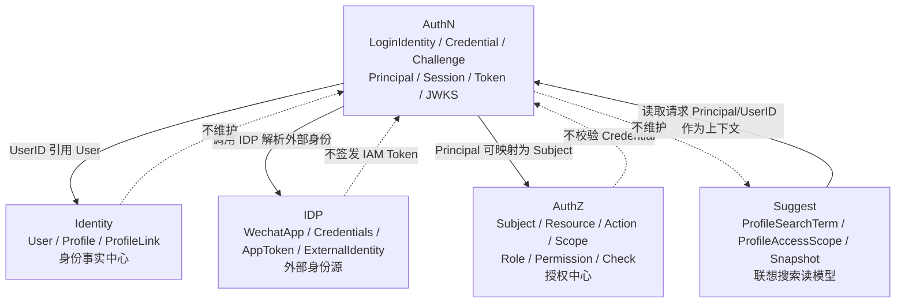

# 模块边界：AuthN 与 Identity / IDP / AuthZ

> 状态：待补证据 · 第一版正文，待继续按源码、组合根、跨模块 port、REST/gRPC 契约和架构测试逐项核对。

---

## 1. 本文回答

本文回答 8 个问题：

- AuthN 的模块边界是什么？
- AuthN 与 Identity 如何协作，为什么 `LoginIdentity` / `Principal` 都不是 `User`？
- AuthN 与 IDP 如何协作，为什么 `ExternalIdentity` 不是 `LoginIdentity`？
- AuthN 与 AuthZ 如何协作，为什么 `Principal` 不是 `Subject`？
- AuthN 与 Suggest 是否有直接关系？
- 哪些跨模块协作是允许的，哪些属于边界漂移？
- User blocked 触发 Session revoke 这类例外协作如何约束？
- 修改 AuthN 模块边界时应该核对哪些代码和测试？

本文只讲模块边界，不重复完整领域模型和关键链路。AuthN 领域模型见 [01-领域模型-LoginIdentity-Credential-Challenge-Principal-Session-Token.md](01-领域模型-LoginIdentity-Credential-Challenge-Principal-Session-Token.md)，Token/JWKS 链路见 [05-关键链路-Token签发刷新吊销.md](05-关键链路-Token签发刷新吊销.md) 和 [06-关键链路-JWKS与本地验签.md](06-关键链路-JWKS与本地验签.md)。

---

## 2. 30 秒结论

AuthN 是 IAM 的认证中心，只维护和产生：

```text
LoginIdentity；
Credential；
Challenge；
Principal；
Session；
AccessToken / RefreshToken；
JWKS / Token verification context。
```

它不拥有其他模块的写模型：

```text
Identity 负责 User / Profile / ProfileLink；
IDP 负责 provider app、credentials、AppToken、ExternalIdentity；
AuthZ 负责 Subject / Resource / Action / Scope / Role / Permission / RoleBinding / Check；
Suggest 负责 ProfileSearchTerm / ProfileAccessScope / Snapshot。
```

最重要的边界：

```text
LoginIdentity 不是 User；
Principal 不是 User；
Principal 不是 Subject；
ExternalIdentity 不是 LoginIdentity；
IDP AppToken 不是 IAM AccessToken；
AccessToken 验签成功不等于 AuthZ 授权通过；
Session 状态不是 User 状态；
授权事实不进入 AuthN。
```

如果只记一句话：

> AuthN 只证明“当前请求者是谁”，不维护“用户档案是谁”，不管理“外部身份源配置”，也不判断“能否访问资源”。

---

## 3. 模块边界总图



读图规则：

```text
AuthN 通过 UserID 引用 Identity.User；
AuthN 可以消费 IDP.ExternalIdentity；
AuthN 产出的 Principal 可以作为 AuthZ Subject 的输入；
Suggest 可以读取请求上下文中的 Principal/UserID；
AuthN 不维护 User/Profile/ProfileLink；
AuthN 不维护 provider app secret 和 AppToken；
AuthN 不维护 Role/Permission/RoleBinding；
AuthN 不维护 Suggest Snapshot。
```

---

## 4. AuthN 的职责边界

AuthN 负责：

| 能力 | 说明 |
| --- | --- |
| LoginIdentity 写模型 | 创建、绑定、解绑、禁用登录身份 |
| Credential 写模型 | 创建、校验、轮换、锁定认证凭据 |
| Challenge 写模型 | 创建、验证、消费、过期短期认证挑战 |
| Principal 构造 | 登录成功后生成运行时认证主体 |
| Session 治理 | 创建、刷新、吊销、过期服务端登录态 |
| Token 治理 | 签发、验证、刷新、吊销 AccessToken / RefreshToken |
| JWKS / 本地验签 | 发布公钥、支持资源服务验签、恢复认证上下文 |
| 认证安全策略 | 防枚举、失败计数、锁定、重放检测、审计输入 |

AuthN 不负责：

| 不负责 | 所属模块 |
| --- | --- |
| User / Profile / ProfileLink 写模型 | Identity |
| 外部 provider 应用配置 | IDP |
| 外部 provider AppToken 生命周期 | IDP |
| Subject / Resource / Action / Scope | AuthZ |
| Role / Permission / RoleBinding / Check | AuthZ |
| Profile 联想搜索索引 | Suggest |
| ProfileSearchTerm / Snapshot | Suggest |

---

## 5. AuthN 与 Identity

### 5.1 协作关系

AuthN 通过 `UserID` 引用 Identity 的 `User`。

典型引用关系：

```text
LoginIdentity.UserID -> Identity.User.ID
Principal.UserID -> Identity.User.ID
Session.UserID -> Identity.User.ID
AccessToken.sub 或 user claim -> Identity.User.ID
```

AuthN 可以从 Identity 获取：

```text
User 是否存在；
User 是否 active；
User 是否 inactive / blocked；
必要的 User 基础事实，例如 UserID。
```

Identity 不应把认证模型塞进 User。

---

### 5.2 LoginIdentity 不是 User

| 概念 | 所属模块 | 生命周期 | 含义 |
| --- | --- | --- | --- |
| `User` | Identity | 长期持久化 | IAM 内部稳定身份主体 |
| `LoginIdentity` | AuthN | 长期持久化 | 某种登录方式和 UserID 的绑定关系 |

关键边界：

```text
一个 User 可以有多个 LoginIdentity；
一个 LoginIdentity 不应绑定多个 User；
LoginIdentity 只表达登录入口，不表达业务档案；
LoginIdentity 不是 Profile；
openid、phone、username 是登录标识，不是 User 本体。
```

---

### 5.3 Principal 不是 User

| 概念 | 所属模块 | 生命周期 | 含义 |
| --- | --- | --- | --- |
| `User` | Identity | 长期持久化 | 系统内部稳定身份主体 |
| `Principal` | AuthN | 认证成功后的运行时上下文 | 当前请求者的认证结果表达 |

关键边界：

```text
Principal 可以携带 UserID；
Principal 不应该内嵌完整 User；
Principal 不应该内嵌 Profile/ProfileLink；
Principal 不应该内嵌 Credential material；
Principal 可以被写入 Session/Token/Request Context；
Principal 可以映射为 AuthZ Subject。
```

---

### 5.4 Session 状态不是 User 状态

| 概念 | 所属模块 | 说明 |
| --- | --- | --- |
| User.Status | Identity | 表达内部身份主体是否可用 |
| Session.Status / RevokedAt | AuthN | 表达某次登录态是否仍有效 |

关键边界：

```text
User blocked 可以触发 Session revoke；
Session revoke 不等于 User blocked；
logout 不删除 User；
Session expired 不改变 User.Status；
User active 不代表某个 Session active。
```

---

### 5.5 允许的协作

允许：

```text
AuthN Onboarding 通过 Identity application service 创建或解析 User；
AuthN Login 查询 User 状态；
AuthN Token verify 可根据需要检查 Session/User 状态；
Identity User blocked 通过受控 port 触发 AuthN Session revoke；
AuthN 使用 UserID 写入 Principal、Session、Token claim。
```

当前已知例外协作：

```text
封禁 User 会连带撤销该用户的 AuthN Session。
```

该协作应通过最小 port 完成，例如：

```text
session.Revoker.RevokeByUser(userID, reason)
```

而不是 Identity 直接访问 AuthN repository、token store 或 Redis key。

代码事实源：

```text
../../../internal/apiserver/application/identity/user/service_lifecycle.go
```

---

### 5.6 禁止的耦合

禁止：

```text
AuthN 直接写 Identity repository concrete；
AuthN 直接创建 Profile / ProfileLink；
Identity 直接写 LoginIdentity / Credential；
Identity 直接签发 AccessToken / RefreshToken；
User 实体出现 password、openid、sessionID、refreshToken、amr 等认证字段；
LoginIdentity 被当成 User 持久化；
Principal 被当成 User 存储。
```

---

## 6. AuthN 与 IDP

### 6.1 协作关系

IDP 是外部身份源辅助模块。

IDP 负责：

```text
外部 provider 应用配置；
provider credentials / app secret；
provider AppToken 获取、缓存、刷新；
provider code / ticket 解析；
ExternalIdentity 生成。
```

AuthN 负责：

```text
消费 ExternalIdentity；
查找或创建 LoginIdentity；
校验登录身份状态；
生成 Principal；
创建 Session / Token。
```

典型链路：

```text
provider code / ticket
  -> IDP.ResolveExternalIdentity
  -> AuthN.FindLoginIdentity(provider, external identifier)
  -> AuthN.BuildPrincipal
  -> AuthN.CreateSessionAndToken
```

---

### 6.2 ExternalIdentity 不是 LoginIdentity

| 概念 | 所属模块 | 含义 |
| --- | --- | --- |
| `ExternalIdentity` | IDP | 外部 provider 返回的身份声明 |
| `LoginIdentity` | AuthN | IAM 内部登录身份，绑定 UserID |
| `User` | Identity | IAM 内部稳定身份主体 |

关键边界：

```text
ExternalIdentity 是外部身份声明；
LoginIdentity 是 IAM 内部登录身份；
ExternalIdentity 需要经过 AuthN 映射或绑定才能成为 LoginIdentity；
openid / unionid / wecom userid 通常是 LoginIdentity identifier；
ExternalIdentity 不直接等于 User；
ExternalIdentity 不直接等于 Principal。
```

---

### 6.3 IDP AppToken 不是 IAM AccessToken

| Token | 所属模块 | 用途 |
| --- | --- | --- |
| IDP AppToken | IDP | IAM 调用外部 provider API |
| IAM AccessToken | AuthN | 客户端访问 IAM 或业务 API |
| IAM RefreshToken | AuthN | 客户端刷新 IAM AccessToken |

关键边界：

```text
IDP AppToken 不应返回给 IAM 客户端；
IDP AppToken 不应作为 IAM Credential；
IDP AppToken 不应写入 IAM AccessToken claim；
IAM RefreshToken 不刷新 IDP AppToken，除非有明确 provider token 管理链路。
```

---

### 6.4 允许的协作

允许：

```text
AuthN 调用 IDP 解析 provider code / ticket；
AuthN 使用 ExternalIdentity 的 provider identifier 查找 LoginIdentity；
AuthN 在 Onboarding/Linking 中把 ExternalIdentity 绑定为 LoginIdentity；
IDP 返回标准化 ExternalIdentity，不理解 Session/Token 策略。
```

---

### 6.5 禁止的耦合

禁止：

```text
IDP 直接写 LoginIdentity repository；
IDP 直接创建 User；
IDP 直接签发 IAM AccessToken；
AuthN 保存 provider app secret；
LoginIdentity 存储 provider app token；
Credential 保存 provider access token；
ExternalIdentity 被当作 Principal 使用。
```

---

## 7. AuthN 与 AuthZ

### 7.1 协作关系

AuthN 证明“是谁”。

AuthZ 判断“能不能做”。

```text
AuthN -> Principal
AuthZ -> AuthorizationDecision
```

认证之后，接入层或 application 可以把 `Principal` 转换为 AuthZ 所需的 `Subject`。

```text
Principal.UserID -> Subject{Type: user, ID: UserID}
```

具体映射规则应由 AuthZ 模型和接入层约定决定。

---

### 7.2 Principal 不是 Subject

| 概念 | 所属模块 | 含义 |
| --- | --- | --- |
| `Principal` | AuthN | 当前请求者的认证结果表达 |
| `Subject` | AuthZ | 授权判断中的主体引用 |

关键边界：

```text
Principal 可以映射为 Subject；
Subject 不是 Principal；
Principal 不携带完整 Role/Permission；
Subject 不校验 Credential；
AuthZ 不签发 Token；
AuthN 不执行资源级 Check。
```

---

### 7.3 Token 验签成功不等于授权通过

AccessToken 验签成功只说明：

```text
token 来自可信 issuer；
token 未被篡改；
token 在时间、audience、issuer 等 claims 上有效；
可以恢复 Principal 或认证上下文。
```

它不说明：

```text
用户能访问某个资源；
用户拥有某个角色；
用户能管理某个 Profile；
用户能搜索某个档案；
用户能执行某个 Action。
```

正确链路：

```text
Bearer Token
  -> AuthN verify
  -> Principal
  -> map to Subject
  -> AuthZ Check(resource, action, scope)
  -> allow / deny
```

---

### 7.4 允许的协作

允许：

```text
接入层从 Principal 构造 AuthZ Subject；
application 在执行资源操作前调用 AuthZ Check；
AuthZ 在决策中使用 Principal 派生出的 Subject；
AuthN 在 token claim 中携带最小认证上下文，例如 userID、sessionID、amr；
AuthZ 可使用 amr 作为认证强度输入，但最终仍由 AuthZ 规则判断。
```

---

### 7.5 禁止的耦合

禁止：

```text
AuthN 直接写 Role / Permission / RoleBinding；
AuthN Login 成功后自动授予业务权限；
Token claim 塞完整权限列表作为唯一事实源；
AuthZ 直接校验 password / otp / provider code；
AuthZ 直接操作 Session / RefreshToken；
Principal 被当成 RoleBinding；
AccessToken 验签成功后绕过 AuthZ Check。
```

---

## 8. AuthN 与 Suggest

AuthN 与 Suggest 通常没有直接写模型协作。

Suggest 可能使用 AuthN 输出的认证上下文：

```text
Principal.UserID；
AuthMethod / AMR；
request context；
session context，可选。
```

但 Suggest 的核心边界是：

```text
ProfileSearchTerm / ProfileAccessScope / Snapshot 属于 Suggest；
Profile 主事实属于 Identity；
资源可见性仍需 AuthZ 或访问范围控制；
AuthN 不维护 Suggest index；
Suggest 不签发 Token。
```

禁止：

```text
AuthN Login 时直接写 Suggest Snapshot；
AccessToken claim 直接包含可搜索 Profile 列表；
Suggest 只凭 token 存在就返回所有 Profile；
Suggest 绕过 ProfileAccessScope / AuthZ 可见范围。
```

---

## 9. 跨模块协作方式

跨模块协作应显式，而不是隐式共享 repository 或全局变量。

推荐方式：

| 方式 | 适用场景 | 说明 |
| --- | --- | --- |
| application service 调用 | 同进程同步用例协作 | 例如 AuthN 调用 Identity 解析 User 状态 |
| domain/application port | 只暴露最小能力 | 例如 Identity 调用 session.Revoker |
| query service | 只读跨模块查询 | 例如查询 User 是否 active |
| event / outbox | 异步传播状态变化 | 例如 User blocked 后异步安全审计 |
| middleware context | 传递 Principal | REST/gRPC 接入层恢复认证上下文 |
| runtime adapter | Token/JWKS/Session store 等技术能力 | 不泄露到 domain 实体 |

禁止方式：

```text
跨模块直接 import 对方 repository concrete；
跨模块直接写对方数据库表；
通过全局变量访问对方 service；
把其他模块字段冗余进 AuthN 实体；
把认证、授权、外部身份源、搜索索引混进一个“账号大对象”。
```

---

## 10. 允许依赖与禁止依赖

### 10.1 允许依赖

AuthN application 可以依赖：

```text
AuthN domain；
AuthN repository port；
Identity 查询或创建 User 的最小 port；
IDP ResolveExternalIdentity port；
Session / Token runtime port；
时钟、ID 生成器、hasher、signer/verifier 等基础能力；
事务管理 port；
事件/outbox port。
```

AuthN domain 可以依赖：

```text
AuthN 内部 value object；
通用 meta value object；
本领域定义的 port interface。
```

AuthN transport 可以依赖：

```text
AuthN application service；
DTO/proto mapper；
Auth middleware / Principal context。
```

---

### 10.2 禁止依赖

AuthN domain 不应依赖：

```text
Identity domain concrete；
IDP domain concrete；
AuthZ domain concrete；
Suggest domain concrete；
transport/rest 或 transport/grpc；
infra repository concrete；
Casbin / Redis / JWT library / WeChat SDK concrete。
```

AuthN application 不应直接依赖：

```text
Identity repository concrete；
IDP provider concrete；
AuthZ repository concrete；
Suggest index concrete；
transport handler；
数据库 client concrete，除非通过 infra adapter/transaction abstraction。
```

---

## 11. 边界漂移检查清单

如果出现以下变化，需要警惕 AuthN 边界漂移：

```text
LoginIdentity 增加 Profile/ProfileLink 字段；
LoginIdentity 增加 Role/Permission 字段；
Credential 保存明文密码或 provider app secret；
Principal 内嵌完整 User/Profile/Permission；
Session 状态写入 Identity.User；
Token claim 塞完整权限模型并作为唯一授权事实；
AuthN service 直接调用 Casbin Enforce；
AuthN service 直接写 Identity repository；
IDP service 直接写 LoginIdentity repository；
AuthZ service 直接校验 password/otp；
Suggest service 直接信任 token 后返回所有 Profile；
AuthN domain import identity/authz/idp/suggest 包。
```

一旦发现，应回到以下问题：

```text
这是认证事实吗？
这是身份事实吗？
这是外部 provider 配置或 token 吗？
这是授权判断吗？
这是搜索读模型吗？
应该通过哪个 application service、port、query service、middleware context 或 event 协作？
```

---

## 12. 常见反模式

| 反模式 | 问题 | 推荐做法 |
| --- | --- | --- |
| LoginIdentity 当 User | 登录身份和内部身份主体混淆 | LoginIdentity 通过 UserID 引用 User |
| Principal 当 User | 运行时认证上下文污染身份事实 | Principal 只表达认证结果 |
| Principal 当 Subject | 认证主体和授权主体引用混淆 | Principal 映射为 Subject 后再 AuthZ Check |
| AccessToken 验签后直接放行资源 | 认证和授权混淆 | 验签后继续 AuthZ Check |
| IDP AppToken 当 IAM AccessToken | 外部平台凭证和 IAM 凭证混淆 | IDP AppToken 只用于 provider API |
| ExternalIdentity 直接当 LoginIdentity | 外部声明和内部登录身份混淆 | AuthN 显式创建/匹配 LoginIdentity |
| AuthN 写 User/ProfileLink | AuthN 吞并 Identity | 通过 Identity application/port 协作 |
| AuthN 写 RoleBinding | AuthN 吞并 AuthZ | 授权开通归 AuthZ 用例 |
| AuthN 写 Suggest Snapshot | AuthN 污染搜索读模型 | Suggest 通过事件/刷新读取事实 |
| Token claim 作为权限事实源 | 权限漂移且难撤销 | AuthZ 维护权限事实并实时 Check |

---

## 13. 代码事实源

| 事实 | 路径 |
| --- | --- |
| AuthN domain | `../../../internal/apiserver/domain/authn` |
| LoginIdentity / Credential / Challenge | `../../../internal/apiserver/domain/authn` |
| Principal 模型 | `../../../internal/apiserver/domain/authn/authentication/principal.go` |
| AuthN application | `../../../internal/apiserver/application/authn` |
| Token application/runtime | `../../../internal/apiserver/application/authn/token` |
| Identity User application | `../../../internal/apiserver/application/identity/user` |
| User lifecycle 与 Session revoke 协作 | `../../../internal/apiserver/application/identity/user/service_lifecycle.go` |
| IDP domain/application | `../../../internal/apiserver/domain/idp`、`../../../internal/apiserver/application/idp` |
| AuthZ domain/application | `../../../internal/apiserver/domain/authz`、`../../../internal/apiserver/application/authz` |
| Suggest domain/application | `../../../internal/apiserver/domain/suggest`、`../../../internal/apiserver/application/suggest` |
| AuthN REST transport | `../../../internal/apiserver/transport/rest` |
| AuthN gRPC transport | `../../../internal/apiserver/transport/grpc` |
| AuthN container | `../../../internal/apiserver/container/authn` |
| 架构测试 | `../../../internal/pkg/architecture` |

注意：上表中的具体路径需要继续与当前源码核对。如果源码目录已调整，应以代码为准并同步更新本文。

---

## 14. Verify

修改本文后至少执行：

```bash
make docs-hygiene
```

涉及 AuthN 领域或应用层边界：

```bash
go test ./internal/apiserver/domain/authn/...
go test ./internal/apiserver/application/authn/...
go test ./internal/apiserver/application/authn/token/...
```

涉及 Identity 协作：

```bash
go test ./internal/apiserver/domain/identity/...
go test ./internal/apiserver/application/identity/...
```

涉及 IDP/AuthZ/Suggest 边界时，按实际影响执行：

```bash
go test ./internal/apiserver/domain/idp/...
go test ./internal/apiserver/domain/authz/...
go test ./internal/apiserver/domain/suggest/...
```

涉及 REST/gRPC 契约或 middleware：

```bash
make api-validate
make proto-gen
go test ./internal/apiserver/transport/rest/...
go test ./internal/apiserver/transport/grpc/...
```

涉及组合根和依赖方向：

```bash
go test ./internal/pkg/architecture
go test ./internal/apiserver/...
```

---

## 15. 本文总结

AuthN 的模块边界可以压缩成：

```text
AuthN 只拥有认证事实和认证运行时：
LoginIdentity / Credential / Challenge / Principal / Session / Token / JWKS。
```

与其他模块的关系是：

```text
Identity 提供 User 事实，但 LoginIdentity / Principal 都不是 User；
IDP 提供 ExternalIdentity，但 ExternalIdentity 不是 LoginIdentity，IDP AppToken 不是 IAM AccessToken；
AuthZ 使用 Subject 做授权判断，但 Principal 不是 Subject，Token 验签成功不等于授权通过；
Suggest 可以读取 Principal/UserID 作为上下文，但 AuthN 不维护 Suggest Snapshot。
```

最重要的工程规则是：

```text
跨模块协作必须通过 application service、port、query service、middleware context 或 event 显式表达；
不允许为了方便，把身份事实、外部身份源、授权事实或搜索读模型字段塞回 AuthN。
```

下一篇应继续编写 AuthN 分层架构与代码索引，说明 AuthN 的 domain、application、infra、transport、container、contract 分别从哪里进入。
