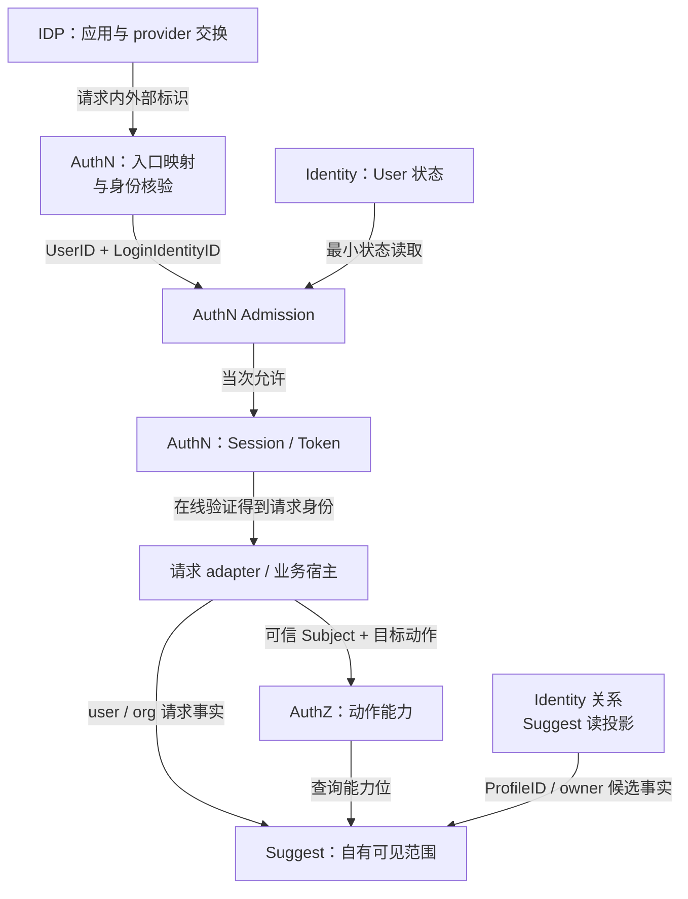
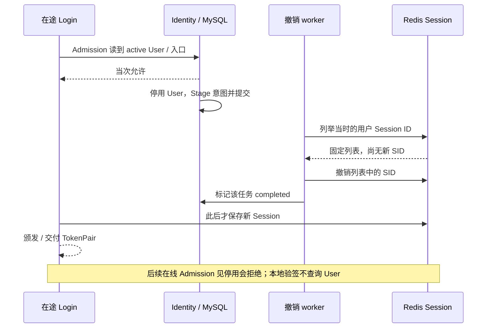

# 模块边界：AuthN 与 Identity、IDP、AuthZ

> 状态：已实现 · 当前设计与实现。本文维护跨模块事实来源、调用前置和一致性边界；候选方案明确标注，源码推演不表示已在实际环境复现。

## 1. 结论：每个模块回答不同的问题，跨模块调用保留前置与时间边界

一次登录需要证明入口控制权、通过用户准入、建立会话并交付令牌；访问业务对象还需要动作能力和业务范围。它们并不共享一个“身份已经可信”的永久状态。

| 问题 | 决策与事实所有者 | 交给下一环的内容 | 不能由此推出 |
| --- | --- | --- | --- |
| 外部 code 对应谁 | IDP：应用配置、Secret、provider 交换 | 请求内 ExternalIdentity | 已有 IAM User、允许登录、拥有业务权限 |
| 哪个入口属于哪个用户 | AuthN：LoginIdentity、Credential、身份核验策略 | Principal / 本次身份核验结果 | User 当前允许使用、Session 已建立 |
| 这个用户与入口允许继续认证吗 | AuthN Admission 组合 Identity User 状态与 AuthN 入口事实 | 当次准入 Decision | 之后不会停用、业务动作允许 |
| 登录态是否有效 | AuthN：Session、令牌与撤销状态 | 在线验证结果、TokenClaims | 当前组织成员资格、授权快照与对象状态 |
| 能否做目标动作 | AuthZ：Subject、Role、PermissionGrant、Assignment | Check / Snapshot | 服务断言的 Subject 就是当前终端用户 |
| 哪些 Profile 可见 | Suggest：能力位、principal、visibility 与索引 | Suggest 自有 Scope 下的结果 | 等同 AuthZ Assignment Scope、投影仍然新鲜 |

```mermaid
flowchart TB
    IDP["IDP：应用与 provider 交换"] -->|"请求内外部标识"| N["AuthN：入口映射<br/>与身份核验"]
    N -->|"UserID + LoginIdentityID"| A["AuthN Admission"]
    I["Identity：User 状态"] -->|"最小状态读取"| A
    A -->|"当次允许"| S["AuthN：Session / Token"]
    S -->|"在线验证得到请求身份"| C["请求 adapter / 业务宿主"]
    C -->|"可信 Subject + 目标动作"| Z["AuthZ：动作能力"]
    C -->|"user / org 请求事实"| Q["Suggest：自有可见范围"]
    Z -->|"查询能力位"| Q
    V["Identity 关系<br/>Suggest 读投影"] -->|"ProfileID / owner 候选事实"| Q
```

图中的 IDP 分支针对外部身份方法，用户名 / OTP 核验不经过 provider；“在线验证得到请求身份”是用户请求路径。服务请求另由启用的 mTLS / ACL 建立服务身份，再分别提交待验证 token 或目标 Subject；服务身份不会自动变成用户身份。具体边界见第 5 节。

## 2. Identity：共享注册事务是明确例外，User 存在不等于允许登录

### 2.1 三种使用 User 的方式

| 场景 | 当前调用形式 | AuthN 的责任 |
| --- | --- | --- |
| SignUp 开通 | AuthN UoW 同时装配 User、LoginIdentity、Credential 仓储 | 协调三个聚合的本地提交；User 规则仍由 Identity 定义 |
| 登录、刷新、在线 Verify | Admission 经 UserStatusReader 读取最小状态 | 检查入口存在、归属与 active，再检查 User 状态 |
| Linking | 使用命令中的 UserID，不重新查询 User 存在或 active | 依赖 adapter 的认证前置，处理新入口证明与归属冲突 |

SignUp 的外部解析先于它自己的 UoW 调用；本地 User、入口和 Credential 使用同一 MySQL 事务。若 context 已有事务，Required 直接借用它，SignUp 返回成功仍可能早于最外层提交；事务的 commit / rollback 由拥有它的调用者负责。外部解析沿用传入 context，已有外层事务时仍可能在其存续期调用 provider；实现没有强制把外部交换移到外层事务之外。provider、state、Redis 的效果不受 MySQL 原子提交或 rollback 覆盖。

这里没有强制所有跨模块交互都走远程接口。**候选设计**是改由 Identity 创建端口封装 User 规则：若端口明确共享同一事务，仍可保留本地原子性；若改为独立 RPC 或独立提交，就必须定义 User 已创建但入口失败时的幂等、补偿和恢复，不能只更换接口名称。

已有 blocked User 在 SignUp 复用分支中不重新做 active 判断，因而开通成功后，登录仍可被 Admission 拒绝。Assignment 的 UserResolver 也只证明稳定锚点存在；赋权不是解除封禁。孤儿入口 repair 会按原 UserID 构造默认 active User，其历史状态与来源限制由 [SignUp](02-注册登录与身份绑定.md)维护。

Linking 的 REST 前置是此前在线 Verify；gRPC 前置是获准服务正确断言用户 Actor。Link 不因此获得独立的 User 状态证明。Unlink 锁身份行并维护最后 active 入口约束，不锁 User、不主动撤销 Session；active 数量也不证明 Credential 或 provider 实际可用。详细行为归 [Linking](03-关键链路-Linking登录身份绑定.md)。

### 2.2 “当前状态”是当次查询可见的状态

Admission 先读 LoginIdentity，再读 User，没有联合行锁或共同版本。仓储还可能复用 context 中的事务，因此可见性受该事务的既有快照影响。这里的当前状态不能扩展为“与会话建立、权限检查、业务提交同时成立”。

在线 Verify 的准入 subject 取 JWT 的 UserID / LoginIdentityID；Refresh 则从 refresh token 定位的 Session 取这两个 ID。两者均查询入口归属和 User 状态，但不能统一描述成“每次都按 Session 当前身份核对 claims”。声明与 Session 的实际对齐范围由 [Token](05-关键链路-Token签发刷新吊销.md)维护。

AuthN 不把 provider openid 放进 User，不用删除 User 表达解绑，也不把 ProfileLink 当作登录入口。Profile / ProfileLink 属于业务档案与关系；请求中的 OrgID 是业务透传值，不是 Admission 的组织资格条件。

## 3. 停用用户：状态判断与会话清理互补，任务成功不是并发屏障

### 3.1 已实现的协作协议

标准 Identity UoW 中，Deactivate / Block 在状态确需改变时写 User，再 Stage 撤销意图；状态与 Stage 写入或去重在同一事务中提交。若任务端口未装配，用例仍可仅更新状态，不能把所有装配都说成必有撤销任务。

持久任务属于 Identity 的状态后果，执行能力是 AuthN 的 Session Revoker。worker 直接领取表中任务，按 User 调用 Redis 撤销，再 Complete；失败保存重试时间，过期 processing 可重新领取。这条链不经过 NSQ，也不是通用 reliable-messaging Relay。

worker 只有具备配置、数据库、撤销能力等装配前提才启动。readiness 读取未完成任务的年龄，不能证明 worker 正在执行，也不能证明所有会话都已清理。单 SID 清理、部分失败和任务重试由 [Token](05-关键链路-Token签发刷新吊销.md)与 [Identity 生命周期](../01-Identity/04-模块边界-Identity与AuthN-AuthZ-Suggest.md)维护。

### 3.2 在途登录可以晚于撤销批次保存 Session

SignIn completion 先 Admission，再建立 Session，没有与停用事务共享屏障。Redis RevokeByUser 先列举一次用户 Session 索引，再逐 SID 撤销。下面以 Stage 确实产生待处理任务为前提，是源码允许的一种交错，不是已经执行的并发复现：

```mermaid
sequenceDiagram
    participant L as 在途 Login
    participant U as Identity / MySQL
    participant W as 撤销 worker
    participant R as Redis Session
    L->>U: Admission 读到 active User / 入口
    U-->>L: 当次允许
    U->>U: 停用 User，Stage 意图并提交
    W->>R: 列举当时的用户 Session ID
    R-->>W: 固定列表，尚无新 SID
    W->>R: 撤销列表中的 SID
    W->>U: 标记该任务 completed
    L->>R: 此后才保存新 Session
    L-->>L: 颁发 / 交付 TokenPair
    Note over L,R: 后续在线 Admission 见停用会拒绝；本地验签不查询 User
```

所以“worker 完成”不能推出“此后不存在 Session”。用户再次在线使用时仍受状态门禁约束；本地 JWKS 验签没有这项门禁，已经通过在线 Verify 的业务请求也不会自动取消。已完成的撤销批次不是业务请求的撤销屏障。

### 3.3 激活、重复停用与任务版本还有两类不同窗口

| 情境 | 当前代码行为与条件 | 不能承诺的结果 |
| --- | --- | --- |
| 停用后任务尚待执行或重试，随后激活并新登录 | Activate 不取消旧任务；worker 不比较任务 UserVersion 与当前 User 状态，按执行时 User 的 Session 列表撤销 | 新会话必然避开旧任务 |
| 停用任务已 completed，激活、新登录后再次停用 | Stage 以 `user_id + user_version + action` 去重；两种状态动作均使用 `revoke_all`，reason 不在唯一键内 | 每次状态转换必然生成一条新的待执行任务 |

Activate 当前是 application 能力，没有公开 REST / gRPC 激活入口；表中交错以前置调用该能力或另行改变状态为条件。第二行还要结合版本实现理解：UserPO 创建时置 version=1；当前 UserMapper、BeforeUpdate 与通用 UpdateAndSync 没有递增 users.version。仓库迁移也没有 User 状态版本 trigger。若使用标准更新路径、数据库具有迁移 000018 的唯一索引、版本未被额外机制改变，且旧任务行仍保留，后一次 Stage 可命中旧 completed 行并 DoNothing；状态改变成功不代表产生了新的清理任务。

这是基于当前更新路径、唯一索引与冲突行为的**源码推论**。SQLite 的任务测试通过 AutoMigrate 创建表，没有该迁移的真实唯一索引，不能用其通过证明这个重复停用场景。实际数据库的版本、索引、外部 trigger 与任务保留情况尚未核验，本文不据此认定已发生生产问题。

### 3.4 若要收紧保证，需要先确定哪种时效合同

**候选设计，不是已实现能力：**

| 要收紧的保证 | 可以采用的机制 | 必须同时解决的代价或边界 |
| --- | --- | --- |
| 每次生命周期变化都有独立撤销意图 | 状态事务推进 lifecycle generation，以代次构造幂等键 | generation 必须由所有状态写入路径维护；历史行与重试不能随意重置 |
| 旧任务不误撤新登录 | Session 保存代次，或任务按 cutoff 选择会话 | 截止前通过准入、截止后保存的在途登录怎样归类；历史 Session 怎样处理 |
| 停用完成后禁止旧准入创建新会话 | 会话建立校验共享代次 / fencing | MySQL 与 Redis 的原子边界、失败恢复与兼容需要明确；简单再查一次仍有下一次竞态 |
| 已通过 Verify 的敏感动作也受停用约束 | 业务提交前核验状态或绑定状态版本 | 由业务事务拥有执行屏障；IAM Check 本身没有该业务提交事务 |

不能把延迟清理、禁止新登录和取消在途业务动作合成一个撤销 SLA。采用哪一种取决于业务要撤销的对象和允许的时间窗口。

## 4. IDP：外部交换负责证明来源，AuthN 按用例决定本地归属

### 4.1 依赖的是 Resolver 合同，不是结构名称

AuthN 的标准外部分支提交 provider / realm / code。IDP Resolver 校验 provider、应用注册、类型与 enabled，解密 Secret，调用对应 exchanger，再构造 ExternalIdentity。Realm 表示 appID / corpID 等外部应用范围；它不是业务 OrgID。

ExternalIdentity 构造器检查标识形状和非零 VerifiedAt，不携带独立签名、请求绑定、有效期或一次性消费证明。因此可信性来自被组合根安装的标准 Resolver / Exchanger，而不是“某个结构能成功构造”。AuthN mapper 不另行核对返回 Realm 与请求 Realm；替换端口实现必须维持来源和范围合同。

AuthN 不接触 IDP 仓储、SecretVault、企微 AgentID 或第三方 SDK 类型。小程序 session_key、开放平台 access / refresh token 不作为 IAM 身份协议返回；请求内 ExternalIdentity 也不作为可持久化重放的登录票据。内部预解析 openid / unionid 是受信兼容输入，不在公共协议中；限制见 [SignUp](02-注册登录与身份绑定.md)。

### 4.2 相同外部结果，三个用例可以有不同本地结果

| 用例 | 归属与副作用 | 时间字段的实际使用 |
| --- | --- | --- |
| SignIn | 找既有入口；微信先精确 openid，再按同 provider 的 unionid / legacy 回退；不新建 User 或入口 | 不保留 provider VerifiedAt 作为本次 AuthTime；策略以当前时间构造 AuthContext |
| SignUp | 外部解析先于自身 UoW 调用；本地事务内复用 / 创建 / repair User，ensure 当前 Realm 的入口 | 新入口没有设置 provider VerifiedAt |
| Linking | recent-auth 后解析，把入口关联到命令 UserID；处理冲突，不重新做 User 准入 | 新入口保存 VerifiedAt；复用既有同用户 active 入口不刷新它 |

例如 appB 的 openid 没有精确绑定，但 unionid 命中同 provider 下 appA 的入口：SignIn 可使用 appA 的 LoginIdentityID，同时记录本次 Realm=appB；SignUp 则可能为同一 User 补建 appB 入口。不能看到 Realm=appB 就推断持久绑定中一定有 appB。

企微仅OpenUserID结果可用于登录查询，Link的ProviderKey仍坚持UserID；标准企微adapter另有nil-cache构造断点，不能据替身映射成功证明实际交换。Resolver分类也不是最终公开code：mini SignUp的Prepare会再次包装错误，Login保留交换cause而Link/SignUp通常格式化丢失。具体交接矩阵、取消/日志及验证边界由[IDP解析](../04-IDP/02-外部身份解析与AuthN协作.md)维护。

企微结果也并非所有用例通用：Resolver 接受只有 `open_user_id` 的身份，登录支持该 fallback；Linking 的 key mapper 仍要求 `user_id`，因此解析成功后绑定可能失败。ProviderVerifiedAt、入口 VerifiedAt、Session AuthTime 是各自的事实，不是一份跨模块认证时间。

### 4.3 应用停用、Secret 轮换与 IAM 会话生命周期分开

| 变化或故障 | 当前影响 | 不具备的联动 |
| --- | --- | --- |
| 应用被停用 | 标准 Resolver 新读取到 disabled 时拒绝交换 | 已通过应用读取的在途交换不复查；Admission 不查询 IDP 应用状态 |
| 轮换 AuthSecret | 更新密文、指纹、Secret.Version 与时间并持久化 | 不清 AppAccessToken 缓存，不撤销 IAM Session，没有旧 Secret 兼容槽 |
| 获取 / 刷新 AppAccessToken | 读取应用，经缓存或 provider 获取其 API 凭证 | 当前这条路径不执行 Resolver 的 enabled 校验，不能泛称所有 IDP 调用都会拒绝停用应用 |
| provider 成功但本地保存失败 | code / state 的外部效果可能已经发生 | MySQL rollback 不恢复 provider 交换或一次性 state |

应用状态 / Secret 在读取后变化，与外部交换及本地保存没有共同事务。若需要停用应用立即阻断全部关联登录态，**候选方案**必须明确按哪些入口、Realm、历史 Session 撤销，以及如何处理当前交换；不能只把应用状态检查加入 IDP 就宣称已有会话被撤销。

扫码登录先消费 state，再比较 appID 和调用 Resolver；扫码绑定也先消费，再校验 UserID，随后才进入 recent-auth、外部解析和保存。后续失败不能用同一 state 原样重试，应取得新证明或使用另行设计的恢复协议。接口接受 context 也不证明真实 provider 调用均能取消：当前小程序与企微 SDK 调用未传递 ctx，开放平台分支使用 context 方法。细节回链 [Login](04-关键链路-Login登录认证.md)、[Linking](03-关键链路-Linking登录身份绑定.md)与 [IDP](../04-IDP/02-外部身份解析与AuthN协作.md)。

## 5. AuthZ：区分请求操作者、待验证用户和授权目标

### 5.1 REST 与 gRPC 分别建立可信上下文

| 入口 | 调用方事实从哪里来 | 用户事实或目标从哪里来 | 谁负责前置 |
| --- | --- | --- | --- |
| REST 用户请求 | JWT middleware 在线验证 access token 与资源 audience | 将 TokenClaims 中 user / login / org / token 放入请求上下文，建立用户管理 Actor | 标准 adapter 负责验证与投影，应用 Guard 消费 Actor |
| gRPC Verify | 启用的 mTLS / 方法 ACL 建立服务身份 | 核验 request 的 access token；ExpectedAudience 来自 request | 宿主选定目标 audience；接口没有把它绑定到 caller service |
| gRPC Refresh | 服务身份与方法准入 | refresh token 定位 Session；UserID / LoginIdentityID 取 Session | 不按调用服务另行声明的 UserID 刷新 |
| gRPC Linking | 服务身份与方法准入 | mapper 解析服务断言的 UserID、当前入口和认证时间 | 获准服务拥有用户认证前置；IAM 不重新在线 Verify 这些 Actor 字段 |
| gRPC AuthZ Check | 服务身份与方法准入 | Subject 来自 request；Snapshot 的 AppName 是过滤输入 | 宿主将当前业务请求身份绑定到 Subject / 应用，IAM 不加载 User 或 Session 再认证 |

这张表中服务准入以 mTLS / ACL **实际启用**为条件；mTLS 与方法 ACL 默认关闭，生产配置模板与某次部署生效不是同一证据。方法准入与 SDK 接入由 [gRPC 服务间授权](../03-AuthZ/06-关键链路-gRPC服务间授权与SDK.md)维护。

例如服务持有合法证书，却把另一个人的 `user:17` 填入 Check：IAM 回答的是 user:17 的动作能力，服务证书不会证明这个用户属于当前请求。类似地，WithAuthenticatedUser / WithAuthenticatedService 是上下文 setter，Guard 不重新验 JWT 或证书；手工调用 setter 不能代替可信 adapter。

### 5.2 准入、动作、范围和最近认证分别成立

REST 路由检查将上下文 UserID 映射成 Subject。AuthZ 单次 Check 使用一份新鲜的原子授权快照，但不读取 User 状态、Session 或对象关系。JWT 不携带完整 Assignment / PermissionGrant；角色与权限展示也不是实时范围凭证。

一个请求可以先通过在线 Admission，随后 User 被封禁，再得到动作 ALLOW：User 状态事务不推进 AuthZ PolicyVersion，在途请求也没有联合状态屏障。路由检查、应用内二次检查与业务范围读取分别发生，不能假定都看到同一版本。下一次读取到封禁的在线 Admission 会拒绝；直接服务 Check 的目标用户状态仍由宿主负责。

最近认证的 auth_time / AMR 回答时间与方式，AuthZ 回答目标动作能力。REST 的 JWKS / Session 管理使用明确 Resource / Action，不按角色名旁路；gRPC Token 撤销使用服务方法准入，不能写成两类接口都执行同一用户动作检查。完整管理前置归 [JWKS](06-关键链路-JWKS与本地验签.md)与 [Token](05-关键链路-Token签发刷新吊销.md)，Assignment 范围归 [AuthZ](../03-AuthZ/07-模块边界-AuthZ与AuthN-Identity-Suggest.md)。

## 6. Suggest：AuthZ 能力位与业务 OrgID 确实参与不同范围决策

Suggest 从请求上下文构造 visibility.Principal；REST adapter 直接把 JWT 业务 OrgID 放入该对象。AuthZ FactsReader 检查 `list_all`、`search_by_mobile_all`、`search_by_mobile` 能力，不读取 Assignment Scope；Suggest 再结合 visibility reader 返回的 ProfileIDs 解析自身 Scope。

| 条件 | 当前 Suggest 范围或输出规则 |
| --- | --- |
| list_all 允许 | 全 Profile 范围；手机号搜索能力另查 search_by_mobile_all |
| list_all 不允许 | owner OperatorID、principal 的 OrgIDs / 正数 OrgID、visibility ProfileIDs 合并为并集；手机号能力另查 search_by_mobile |
| 命中同一 OrgID 的候选 | 在普通范围分支可见，即使没有 owner 或显式 ProfileID 命中 |
| 只有 JWT 中的 OrgID | 它会参与上述同组织范围，但不等于全平台 list_all，也不证明当前成员关系已复查 |

因此不能笼统写“OrgID 不参与授权”或“必须读取 Assignment Scope 才能同组织可见”。准确边界是：IAM AuthN 不证明当前组织资格，现行 Suggest 却使用该历史透传值作为范围输入；签名可信不等于业务组织事实仍新鲜。

若业务要求退出组织后立即收紧可见性，**候选方案**是从当前成员事实解析 OrgIDs，或绑定成员关系版本及缓存期限。它先收紧同组织分支：权威空成员集合不能继续回退旧 OrgID 声明。若退出后必须拒绝该组织全部候选，还需确定成员资格是否成为所有 OR 分支的共同前置，还是 owner / ProfileID 保留独立许可；不能只把这些许可称作传播延迟。各自读投影仍有传播窗口，AuthZ 的几次能力检查、visibility 和索引也没有共同版本。召回、最终 limit 前过滤与手机号脱敏由 [Suggest 查询](../05-Suggest/03-关键链路-SuggestProfile查询.md)维护，本篇不复制查询算法。

## 7. 选择协作形式时，先写清需要哪一笔原子提交

| 协作形式 | 本项目例子 | 适用判断 | 明确的边界 |
| --- | --- | --- | --- |
| 同事务 UoW | SignUp 三聚合；User 状态与 Stage 意图 | 本地事实缺一不可，同库并有明确事务 owner | 原子范围不包含 provider / Redis；借用事务由最外层提交 |
| 同步窄端口 | IDP Resolver、UserStatusReader、AuthZ Check | 当次决策必须取得结果，错误须按该用例处理 | 多次读取不是共同锁，也不是业务提交屏障 |
| 持久异步任务 | User 状态后的 Session 清理 | 可重试提交后副作用，允许状态与清理存在窗口 | 去重、代次、完成状态与最终效果必须分别定义 |

Link 只保存 LoginIdentity，不套用 SignUp UoW；仓储 canonical 创建 / 转移的本地事务不覆盖 state、OTP 或 provider。通用事件与可靠消息有另一套事实、投递和 ACK 边界，不能用“有 Outbox”替代这里的任务协议。

改动前应写出一个具体交错或失败情境：谁先读取、谁提交、哪个 proof 已消费、由谁重试，以及重试可以影响哪些新状态。再选择同事务、同步调用或异步任务。新的端口只传业务输入 / 结果，容器安装 adapter，不把 GORM、SDK 类型或借用事务的生命周期转移给不知情消费者。

## 8. 源码与验证：已有单测没有覆盖所有跨模块时序

| 事实 | 源码入口 |
| --- | --- |
| 共享事务、借用与三仓储装配 | [SignUp](../../../internal/apiserver/application/authn/signup/service.go)、[AuthN UoW](../../../internal/apiserver/infra/mysql/uow/authn/uow.go)、[Required](../../../pkg/uow/gorm/uow.go) |
| User 状态与 Admission | [状态用例](../../../internal/apiserver/application/identity/user/service_lifecycle.go)、[准入](../../../internal/apiserver/domain/authn/admission/policy.go)、[普通仓储读](../../../internal/pkg/database/mysql/base.go) |
| 任务去重、执行与版本更新路径 | [Store](../../../internal/apiserver/infra/mysql/sessionrevocation/store.go)、[Worker](../../../internal/apiserver/infra/mysql/sessionrevocation/worker.go)、[唯一索引](../../../internal/pkg/migration/migrations/000018_identity_session_revocation_outbox.up.sql)、[UserPO](../../../internal/apiserver/infra/mysql/user/user.go)、[Mapper](../../../internal/apiserver/infra/mysql/user/mapper.go) |
| 在途建立与批量列举 | [completion](../../../internal/apiserver/application/authn/signin/completion.go)、[Redis SessionStore](../../../internal/apiserver/infra/cache/redis/session_store.go) |
| 外部结果与用例映射 | [Resolver](../../../internal/apiserver/application/idp/externalidentity/resolver.go)、[ExternalIdentity](../../../internal/apiserver/domain/idp/externalidentity/external_identity.go)、[AuthN mapper](../../../internal/apiserver/application/authn/externalidentity/mapper.go)、[Linker](../../../internal/apiserver/application/authn/linking/linker.go) |
| 请求身份与服务断言 | [JWT middleware](../../../internal/pkg/middleware/authn/jwt_middleware.go)、[gRPC Actor mapper](../../../internal/apiserver/transport/grpc/service/authn/mappers.go)、[AuthZ 服务](../../../internal/apiserver/transport/grpc/service/authz/service.go) |
| Suggest 范围输入与并集 | [REST principal](../../../internal/apiserver/transport/rest/suggest/principal.go)、[能力读取](../../../internal/apiserver/infra/suggest/authorization/facts_reader.go)、[ResolutionPolicy](../../../internal/apiserver/domain/suggest/visibility/resolution_policy.go)、[Scope](../../../internal/apiserver/domain/suggest/visibility/scope.go) |

| 已有测试 | 可以证明 | 仍缺的证据 |
| --- | --- | --- |
| admission / signin completion | 替身事实下的拒绝、技术错误，以及先准入再建立会话 | 数据库快照、停用并发与新会话屏障 |
| signup / AuthN UoW / Required | 解析先于 SignUp 自身 UoW 调用、借用事务及本地仓储协作 | provider 与本地提交的共同恢复；外层真实业务事务验收 |
| sessionrevocation / Redis SessionStore | SQLite 回滚、替身撤销重试；miniredis 的 SID 行为与部分竞争 | MySQL 真实生命周期更新、completed 后重复 Stage、批量撤销与并发创建、激活后旧任务 |
| IDP Resolver / Linking / scan proof | 替身 exchanger 的配置与结果校验、映射；内存 state 消费顺序 | 真实 provider 取消、应用停用竞态、端到端身份绑定 |
| middleware / AuthZ gRPC / Suggest visibility | 上下文投影、人工 Subject 转换；真实 TLS / ACL 配合替身 checker；范围并集规则 | 用户认证、权限、当前成员关系和业务提交的全链一致 |

另有 [MySQL 迁移专项](../../../internal/pkg/migration/identity_consistency_mysql_test.go)验证同 version / action、不同 reason 的重复 INSERT 被唯一索引拒绝；它没有串起 User 生命周期更新、completed 后 Stage 与新 Session。专项需要真实测试数据库，不能与上述 SQLite 单测互换，也不表示本轮已执行。

检查入口为 `make docs-hygiene docs-facts docs-validation-tests`，行为验证按目标包选择已有测试；具体执行记录、图文渲染与未执行专项见 [本轮记录](../../_data/reviews/2026-10-06-docs-refactor.md)。本文中的命令不是部署证据，单测通过也不替代上表列出的实际环境与业务验收。查找完整装配和改动面继续进入 [AuthN 分层索引](08-分层架构与代码索引.md)。
