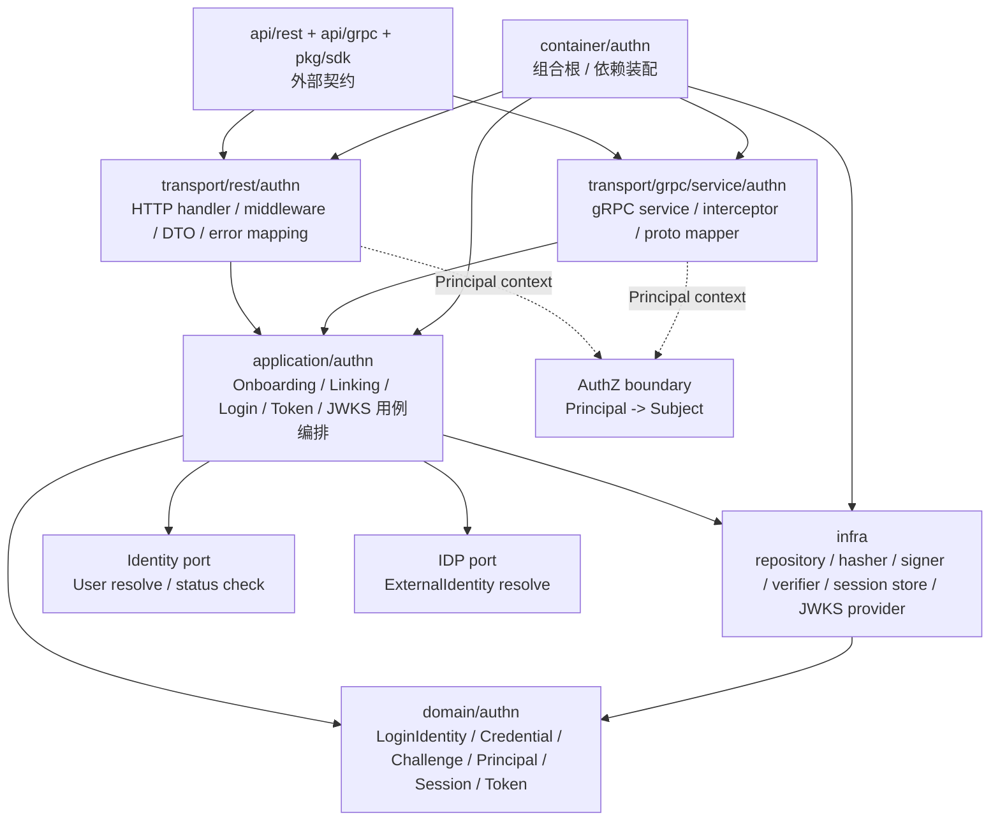

# AuthN 分层架构与代码索引

> 状态：设计目标 · 第一版正文，待继续按源码目录、契约文件、组合根、配置和架构测试逐项核对。

---

## 1. 本文回答

本文回答 8 个问题：

- AuthN 模块在代码中如何分层？
- `domain / application / infra / transport / container / contract` 各层分别负责什么？
- 维护 `LoginIdentity / Credential / Challenge / Principal / Session / Token / JWKS` 时应该从哪些入口开始读？
- Onboarding、Linking、Login、Token、JWKS 链路如何串起来？
- 哪些依赖方向是允许的，哪些依赖方向是边界漂移？
- REST/gRPC 契约与 AuthN application/domain 如何对应？
- 修改登录方式、Token 策略、JWKS、Session revoke 时应该检查哪些文件？
- 修改 AuthN 代码或文档时应该运行哪些 Verify？

本文是 AuthN 的代码导航文档，不重复完整领域模型与关键链路。
领域模型见 [01-领域模型-LoginIdentity-Credential-Challenge-Principal-Session-Token.md](01-领域模型-LoginIdentity-Credential-Challenge-Principal-Session-Token.md)；
模块边界见 [07-模块边界-AuthN与Identity-IDP-AuthZ.md](07-模块边界-AuthN与Identity-IDP-AuthZ.md)。

---

## 2. 30 秒结论

AuthN 模块按 IAM 通用分层组织：

```text
transport/rest + transport/grpc
  -> application/authn
  -> domain/authn
  -> infra/repository + token runtime + session store + crypto adapter
  -> container/authn
  -> api/rest + api/grpc + pkg/sdk
```

各层职责：

```text
domain：表达 LoginIdentity / Credential / Challenge / Principal / Session / Token 的模型和规则；
application：编排 Onboarding、Linking、Login、Token 签发刷新吊销、JWKS 验签等用例；
infra：实现 repository、hasher、challenge store、session store、JWT signer/verifier、JWKS provider；
transport：把 REST/gRPC 请求转换为 application command/query，并注入 Principal；
container：组合根，装配 AuthN repository、service、strategy、runtime、handler；
contract：OpenAPI/proto/SDK 对外接入契约。
```

如果只记一句话：

> AuthN 的认证规则应优先落在 domain/application，密码哈希、JWT、Redis/MySQL、JWKS 等技术细节应留在 infra/runtime，transport 只做协议适配，container 只做依赖装配。

---

## 3. 分层总图



读图规则：

```text
transport 依赖 application，不直接依赖 repository concrete；
application 可以依赖 domain、repository port、token/session runtime port、Identity/IDP 最小 port；
domain 不依赖 transport、infra concrete、REST/gRPC、MySQL、Redis、JWT library、WeChat SDK、Casbin；
infra 可以依赖 domain 做模型映射和技术实现；
container 可以知道具体实现，但不能执行业务用例；
contract 是外部机器契约，不等同于 domain 模型。
```

---

## 4. 代码事实源总表

| 层 | 路径 | 说明 |
| --- | --- | --- |
| Domain | `../../../internal/apiserver/domain/authn` | AuthN 领域模型与认证规则 |
| Principal | `../../../internal/apiserver/domain/authn/authentication/principal.go` | 认证成功后的运行时主体表达 |
| Application | `../../../internal/apiserver/application/authn` | Onboarding、Linking、Login、Session/Token/JWKS 用例编排 |
| Token application/runtime | `../../../internal/apiserver/application/authn/token` | Token 签发、验证、刷新、JWKS 相关逻辑，具体以代码为准 |
| Token infra | `../../../internal/apiserver/infra/token` | Token signer/verifier/JWKS provider，具体以代码为准 |
| MySQL LoginIdentity | `../../../internal/apiserver/infra/mysql/loginidentity` | LoginIdentity repository 实现，具体以代码为准 |
| MySQL Credential | `../../../internal/apiserver/infra/mysql/credential` | Credential repository 实现，具体以代码为准 |
| MySQL JWKS | `../../../internal/apiserver/infra/mysql/jwks` | key/JWKS 持久化实现，具体以代码为准 |
| Session / Challenge store | `../../../internal/apiserver/infra` | Redis/MySQL/内存等 store 实现，具体以代码为准 |
| REST transport | `../../../internal/apiserver/transport/rest/authn` | AuthN REST handler、middleware、DTO、错误映射 |
| gRPC transport | `../../../internal/apiserver/transport/grpc/service/authn` | AuthN gRPC service、interceptor、proto mapper |
| Container | `../../../internal/apiserver/container/authn` | AuthN 模块装配 |
| REST 契约 | `../../../api/rest/authn.v2.yaml` | AuthN REST OpenAPI 契约 |
| gRPC 契约 | `../../../api/grpc/iam/authn/v2/authn.proto` | AuthN gRPC proto 契约 |
| SDK | `../../../pkg/sdk` | 对外 Go SDK 接入封装，具体路径以当前代码为准 |
| 架构测试 | `../../../internal/pkg/architecture` | 分层依赖边界测试 |

注意：上表中的路径需要继续与当前仓库目录逐项核对。如果源码目录已调整，应以代码为准并同步更新本文。

---

## 5. Domain 层

### 5.1 职责

Domain 层负责表达 AuthN 的核心认证模型和认证不变量。

它应该回答：

```text
LoginIdentity 是什么？
Credential 是什么？
Challenge 是什么？
Principal 是什么？
Session 是什么？
AccessToken / RefreshToken 的领域边界是什么？
Credential 和 Challenge 为什么不同？
Principal 为什么不是 User？
Token 验签成功为什么不等于授权通过？
```

Domain 层不应该负责：

```text
HTTP/gRPC 参数解析；
OpenAPI/proto DTO；
SQL 查询；
MySQL/GORM 细节；
Redis key 细节；
JWT library 调用细节；
WeChat / WeCom SDK 调用；
Casbin Enforce；
事务开启和提交；
错误码到 HTTP/gRPC status 的映射。
```

---

### 5.2 代码索引

| 对象 / 能力 | 路径 | 说明 |
| --- | --- | --- |
| LoginIdentity | `../../../internal/apiserver/domain/authn` | 登录身份模型，具体文件以源码为准 |
| Credential | `../../../internal/apiserver/domain/authn` | 认证凭据模型，具体文件以源码为准 |
| Challenge | `../../../internal/apiserver/domain/authn` | 认证挑战模型，具体文件以源码为准 |
| Principal | `../../../internal/apiserver/domain/authn/authentication/principal.go` | 认证成功后的运行时主体表达 |
| Session | `../../../internal/apiserver/domain/authn` | 服务端登录态模型，具体文件以源码为准 |
| Token | `../../../internal/apiserver/domain/authn` | AccessToken / RefreshToken 相关领域对象，具体文件以源码为准 |
| AuthN value objects | `../../../internal/apiserver/domain/authn` | AuthMethod、AMR、Status、TokenID、SessionID 等，具体以代码为准 |

---

### 5.3 修改入口

如果要修改：

| 目标 | 优先阅读 |
| --- | --- |
| 新增登录身份类型 | `domain/authn` 中 LoginIdentity 类型定义与 application strategy |
| 修改 Credential 规则 | Credential 模型、hasher adapter、login application |
| 修改 Challenge 规则 | Challenge 模型、challenge store、OTP application |
| 修改 Principal 字段 | `authentication/principal.go`、Token claims、middleware context |
| 修改 Session 语义 | Session 模型、Session store、Token refresh/revoke application |
| 修改 AccessToken claims | Token domain/application/runtime、REST/gRPC 契约、middleware |
| 修改 RefreshToken 轮换策略 | Token application/runtime、Session store、infra store |
| 修改 JWKS/key rotation | Token runtime、KeySet/JWKS provider、配置、JWKS endpoint |

---

## 6. Application 层

### 6.1 职责

Application 层负责认证用例编排。

它应该处理：

```text
Onboarding 身份开通；
Linking 登录身份绑定 / 解绑；
Login 登录认证；
Credential 校验与轮换；
Challenge 创建、验证、消费；
Principal 构造；
Session 创建、刷新、吊销；
AccessToken / RefreshToken 签发、验证、刷新、吊销；
JWKS 查询和本地验签支持；
跨模块最小 port 协作；
事务边界和应用错误归一化。
```

Application 层不应该处理：

```text
HTTP/gRPC 细节；
SQL 细节；
JWT library 底层细节；
Redis key 拼接细节；
WeChat SDK 细节；
Casbin matcher；
Profile 搜索索引构建。
```

---

### 6.2 代码索引

| 用例组 | 路径 | 说明 |
| --- | --- | --- |
| AuthN application | `../../../internal/apiserver/application/authn` | AuthN 用例总入口，具体子目录以代码为准 |
| Token application | `../../../internal/apiserver/application/authn/token` | Token/JWKS/JWK 相关用例，具体以代码为准 |
| Onboarding | `../../../internal/apiserver/application/authn` | 身份开通用例，具体文件以代码为准 |
| Linking | `../../../internal/apiserver/application/authn` | 登录身份绑定/解绑用例，具体文件以代码为准 |
| Login | `../../../internal/apiserver/application/authn` | 登录认证用例，具体文件以代码为准 |
| Verify / Middleware support | `../../../internal/apiserver/application/authn`、`token` | Bearer token 验证和 Principal 恢复，具体以代码为准 |

---

### 6.3 用例调用主线

Onboarding：

```text
transport
  -> application/authn onboarding
  -> Identity resolve/create User
  -> LoginIdentity repository
  -> optional Credential repository
```

Linking：

```text
AccessToken -> Principal
  -> application/authn linking
  -> verify linking proof
  -> LoginIdentity repository
  -> optional Credential create/rotate/disable
```

Login：

```text
transport
  -> application/authn login
  -> resolve LoginIdentity
  -> verify Credential / Challenge / IDP ExternalIdentity
  -> check User status through Identity
  -> build Principal
```

Token 签发：

```text
Principal
  -> application/authn token
  -> create Session
  -> issue AccessToken
  -> issue RefreshToken
```

Token 刷新：

```text
RefreshToken
  -> validate refresh token
  -> check Session active
  -> issue new AccessToken
  -> optional rotate RefreshToken
```

Token 吊销：

```text
logout / revoke / user blocked
  -> revoke Session
  -> revoke RefreshToken
  -> optional blacklist AccessToken
```

JWKS / 本地验签：

```text
Bearer AccessToken
  -> resolve public key by kid from JWKS
  -> alg allowlist
  -> verify signature and claims
  -> recover Principal
```

---

### 6.4 跨模块 port

AuthN application 可以通过最小 port 与其他模块协作。

典型 port：

| 协作 | 建议 port 语义 |
| --- | --- |
| 查询或创建 User | `IdentityUserResolver` / `UserCreator` / `UserStatusChecker`，具体以代码为准 |
| 解析外部身份 | `ExternalIdentityResolver` |
| User blocked 撤销 Session | `SessionRevoker` |
| AuthZ 检查 | 通常不在 AuthN 内部执行，由接入层或业务 application 调用 AuthZ |
| 审计事件 | `AuditEventPublisher` / outbox port，具体以设计为准 |

要求：

```text
只暴露最小能力；
不直接 import 对方 repository concrete；
不直接操作对方数据库表；
组合根负责装配具体实现；
跨模块协作必须可测试。
```

---

## 7. Infra 层

### 7.1 职责

Infra 层负责认证相关技术实现。

它应该处理：

```text
LoginIdentity repository concrete；
Credential repository concrete；
Challenge store concrete；
Session store concrete；
RefreshToken store concrete；
password hasher；
OTP code hasher / verifier；
JWT signer / verifier；
JWK / JWKS provider；
KeySet / key rotation adapter；
domain entity 与 persistence record 映射；
数据库错误到应用错误的转换辅助。
```

Infra 层不应该处理：

```text
决定 AuthN 领域概念；
决定 Login 是否成功的完整业务流程；
决定 User/Profile 写模型；
决定 AuthZ 是否放行；
维护 Suggest Index；
把 provider app secret 泄露给 AuthN response。
```

---

### 7.2 代码索引

| 能力 | 路径 | 说明 |
| --- | --- | --- |
| LoginIdentity repository | `../../../internal/apiserver/infra/mysql/loginidentity` | LoginIdentity 持久化与查询，具体以代码为准 |
| Credential repository | `../../../internal/apiserver/infra/mysql/credential` | Credential 持久化与查询，具体以代码为准 |
| JWKS repository | `../../../internal/apiserver/infra/mysql/jwks` | Key/JWKS 持久化，具体以代码为准 |
| Token infra | `../../../internal/apiserver/infra/token` | signer/verifier/JWKS provider，具体以代码为准 |
| Session store | `../../../internal/apiserver/infra` | Redis/MySQL/内存实现，具体以代码为准 |
| Challenge store | `../../../internal/apiserver/infra` | OTP/OAuth state/nonce 存储，具体以代码为准 |
| Password hasher | `../../../internal/apiserver/infra` | 密码 hash/verify adapter，具体以代码为准 |

---

### 7.3 需要重点核对的实现点

| 实现点 | 为什么重要 |
| --- | --- |
| provider + identifier 唯一约束 | 防止同一登录身份绑定多个 User |
| Credential material 不可明文保存 | 防止认证材料泄露 |
| Challenge 短 TTL 和消费语义 | 防止验证码重放 |
| Session revoke 查询 | 保证 logout/user blocked 生效 |
| RefreshToken 轮换与重放检测 | 降低长期 token 泄露风险 |
| JWT alg allowlist | 防算法混淆 |
| JWKS 只发布 public key | 防私钥泄露 |
| key rotation verify-only 窗口 | 防未过期 token 大面积失效 |
| 错误映射 | 唯一约束、认证失败、过期、撤销等错误不能泄露敏感细节 |

---

## 8. Transport 层

### 8.1 职责

Transport 层负责协议适配和认证上下文注入。

它应该处理：

```text
REST path/query/body/header 解析；
gRPC request metadata/message 解析；
Authorization: Bearer token 提取；
基础参数校验；
DTO/proto 与 application command/result 的转换；
调用 AuthN application service；
把 application error 映射为 HTTP/gRPC 错误；
把验证后的 Principal 写入 request context；
JWKS endpoint response 组装。
```

Transport 层不应该处理：

```text
直接访问 repository；
直接开启事务；
直接构造 SQL；
直接调用 JWT library 完整实现业务流程；
直接校验 password hash 后绕过 application；
直接执行 AuthZ Check，除非它是明确的 middleware 编排入口；
直接修改 domain entity 后绕过 application 保存。
```

---

### 8.2 代码索引

| 协议 | 路径 | 说明 |
| --- | --- | --- |
| REST AuthN | `../../../internal/apiserver/transport/rest/authn` | AuthN REST handler、DTO、路由入口 |
| REST middleware | `../../../internal/apiserver/transport/rest` | Bearer token 验证与 Principal 注入，具体以代码为准 |
| gRPC AuthN | `../../../internal/apiserver/transport/grpc/service/authn` | AuthN gRPC service、proto mapper |
| gRPC interceptor | `../../../internal/apiserver/transport/grpc` | gRPC metadata token 验证与 Principal 注入，具体以代码为准 |
| JWKS endpoint | `../../../internal/apiserver/transport/rest/authn` | JWKS REST endpoint，具体以代码为准 |

---

### 8.3 错误映射建议

| 应用错误 | REST | gRPC |
| --- | --- | --- |
| 参数错误 | `400 Bad Request` | `InvalidArgument` |
| 未认证 / token 无效 | `401 Unauthorized` | `Unauthenticated` |
| 无权限 | `403 Forbidden` | `PermissionDenied` |
| 登录失败 | `401 Unauthorized` | `Unauthenticated` |
| 唯一性冲突 | `409 Conflict` | `AlreadyExists` 或 `FailedPrecondition` |
| 状态冲突 | `409 Conflict` | `FailedPrecondition` |
| Challenge 过期 | `400 Bad Request` 或 `401 Unauthorized` | `InvalidArgument` 或 `Unauthenticated` |
| RefreshToken 失效 | `401 Unauthorized` | `Unauthenticated` |
| 内部错误 | `500 Internal Server Error` | `Internal` |

具体映射必须以当前 REST/OpenAPI、proto 和错误处理实现为准。

安全建议：

```text
登录失败错误对外应避免账户枚举；
内部日志保留诊断原因；
日志不打印密码、验证码、完整 token、private key。
```

---

## 9. Container 层

### 9.1 职责

Container 是组合根，负责把 AuthN 模块装配进 iam-apiserver。

它应该处理：

```text
创建 LoginIdentity/Credential/Challenge repository concrete；
创建 Session/RefreshToken store；
创建 password hasher / OTP verifier；
创建 JWT signer/verifier / KeySet / JWKS provider；
创建 AuthN application service；
注入 Identity / IDP / SessionRevoker 等跨模块 port；
创建 REST handler 和 middleware；
创建 gRPC service 和 interceptor；
把模块对象暴露给 process/transport 注册。
```

Container 不应该处理：

```text
执行业务用例；
处理 HTTP/gRPC 请求；
直接做登录认证；
直接签发 token；
直接做授权判定；
隐藏跨模块业务流程。
```

---

### 9.2 代码索引

| 能力 | 路径 | 说明 |
| --- | --- | --- |
| AuthN module wiring | `../../../internal/apiserver/container/authn` | AuthN repository、service、strategy、runtime、handler 装配 |
| Root container | `../../../internal/apiserver/container` | 全局组合根入口，具体路径以代码为准 |

---

## 10. 契约与 SDK

### 10.1 REST 契约

REST 契约路径：

```text
../../../api/rest/authn.v2.yaml
```

REST 契约应回答：

```text
有哪些 AuthN HTTP endpoint；
Onboarding / Linking / Login / Refresh / Logout / JWKS endpoint 如何命名；
请求/响应 DTO 字段是什么；
错误码如何表达；
哪些接口需要 Bearer token；
哪些接口公开访问，例如 JWKS；
字段命名是否与 application result 对齐。
```

---

### 10.2 gRPC 契约

gRPC 契约路径：

```text
../../../api/grpc/iam/authn/v2/authn.proto
```

gRPC 契约应回答：

```text
有哪些 AuthN RPC；
request/response message 字段是什么；
是否提供 Onboarding / Linking / Login / Refresh / Logout / Verify / JWKS 等能力；
metadata 中如何携带 token；
错误语义如何映射；
字段是否与 REST 和 application 语义一致。
```

---

### 10.3 SDK

SDK 应基于 REST/OpenAPI 或 gRPC/proto 契约生成或封装。

SDK 不应该：

```text
绕过服务端 application；
伪造 Credential / Challenge 规则；
把 SDK DTO 当作 domain entity；
在客户端决定 alg 或 kid 信任策略；
隐藏服务端 Unauthenticated/Conflict/FailedPrecondition 错误；
在日志中打印完整 token、密码或验证码。
```

---

## 11. 典型修改路径

### 11.1 新增登录方式

推荐检查顺序：

```text
1. domain/authn：LoginIdentity type / AuthMethod / Credential or Challenge 语义
2. application/authn：Onboarding / Linking / Login strategy
3. IDP：是否需要 ExternalIdentity resolver
4. infra：repository / hasher / challenge store / provider adapter
5. transport/rest + transport/grpc：DTO/proto mapper
6. api/rest/authn.v2.yaml
7. api/grpc/iam/authn/v2/authn.proto
8. container/authn：装配 strategy / adapter
9. tests + docs
```

---

### 11.2 修改密码策略

推荐检查顺序：

```text
1. domain/authn：Credential 语义、锁定/过期规则
2. infra：password hasher / verify / algorithm params
3. application/authn：Login failure counter、lock policy、rotate credential
4. transport：错误映射和安全响应
5. config：hash 算法、cost、失败阈值
6. tests + docs
```

---

### 11.3 修改 Challenge / OTP 策略

推荐检查顺序：

```text
1. domain/authn：Challenge 状态、过期、消费语义
2. infra：Challenge store、code hash、attempt counter
3. application/authn：issue / verify / consume 流程
4. transport：DTO、错误映射、防枚举响应
5. config：TTL、发送频率、失败阈值
6. tests + docs
```

---

### 11.4 修改 Token claims

推荐检查顺序：

```text
1. domain/authn：Principal / Token 语义
2. application/authn/token：claim 构造和验证
3. infra/token：signer/verifier 实现
4. middleware：Principal 恢复逻辑
5. AuthZ：Subject 映射是否受影响
6. REST/gRPC 契约与 SDK
7. tests + docs
```

---

### 11.5 修改 RefreshToken 轮换策略

推荐检查顺序：

```text
1. application/authn/token：refresh flow、rotation policy
2. infra：RefreshToken store、token family、replay detection
3. Session store：session active/revoked 状态
4. transport：refresh endpoint 错误映射
5. SDK：客户端 token 存储和重试行为
6. tests + docs
```

---

### 11.6 修改 JWKS / Key Rotation

推荐检查顺序：

```text
1. application/authn/token：KeySet/JWKS use case
2. infra/token：signer/verifier/JWKS provider
3. config：active key、verify-only key、alg allowlist、issuer/audience
4. transport/rest：JWKS endpoint
5. resource service verifier / SDK
6. 专题设计文档
7. tests + docs
```

---

### 11.7 修改 User blocked -> Session revoke

推荐检查顺序：

```text
1. Identity application：User lifecycle
2. AuthN application：SessionRevoker port
3. infra：Session/RefreshToken store revoke implementation
4. container：Identity -> AuthN port 装配
5. tests：Identity/AuthN 协作和架构边界
6. docs
```

---

## 12. 依赖方向规则

### 12.1 允许

```text
transport -> application
application -> domain
application -> repository/runtime port
application -> Identity/IDP 最小 port
infra -> domain
container -> all concrete wiring targets
contract -> transport implementation alignment
```

### 12.2 禁止

```text
domain -> application；
domain -> infra/mysql；
domain -> transport/rest；
domain -> transport/grpc；
domain -> api/rest or api/grpc；
domain -> JWT library concrete；
domain -> Redis/MySQL client concrete；
application -> transport；
transport -> infra repository concrete；
infra -> transport；
AuthN domain -> identity/authz/idp/suggest concrete；
AuthN application -> identity/authz/idp/suggest repository concrete。
```

---

## 13. 常见反模式

| 反模式 | 问题 | 推荐做法 |
| --- | --- | --- |
| handler 直接查 Credential repository | 绕过 application 安全策略 | handler 调 application service |
| middleware 自己完整实现 Login | transport 吞并认证用例 | middleware 只做 token verify / Principal 注入 |
| domain 调 JWT library 签发 token | 领域层依赖技术实现 | 通过 Token runtime port |
| repository 决定登录是否成功 | 持久化层吞并认证规则 | Login 编排放 application |
| container 中执行登录或签发 token | 组合根混入业务流程 | container 只装配依赖 |
| proto message 直接当 Principal | 契约模型污染领域模型 | transport 做 mapper |
| AuthN 直接写 Identity repository | 跨模块绕过边界 | 通过 Identity application/port 协作 |
| AuthN 直接调用 Casbin Enforce | AuthN 吞并 AuthZ | 由业务 application 或 middleware 调 AuthZ |
| JWKS provider 暴露 private key | 严重安全事故 | JWKS 只发布 public key |
| Token claim 塞完整权限模型 | 权限漂移且难撤销 | AuthZ 实时 Check |

---

## 14. Verify

修改本文后至少执行：

```bash
make docs-hygiene
```

涉及 AuthN domain：

```bash
go test ./internal/apiserver/domain/authn/...
```

涉及 AuthN application：

```bash
go test ./internal/apiserver/application/authn/...
go test ./internal/apiserver/application/authn/token/...
```

涉及 infra repository / token runtime / store：

```bash
go test ./internal/apiserver/infra/...
```

如果实际 infra 测试路径更细，以当前代码为准，例如：

```bash
go test ./internal/apiserver/infra/token/...
go test ./internal/apiserver/infra/mysql/loginidentity/...
go test ./internal/apiserver/infra/mysql/credential/...
go test ./internal/apiserver/infra/mysql/jwks/...
```

涉及 Identity / IDP / AuthZ / Suggest 边界：

```bash
go test ./internal/apiserver/domain/identity/...
go test ./internal/apiserver/application/identity/...
go test ./internal/apiserver/domain/idp/...
go test ./internal/apiserver/domain/authz/...
go test ./internal/apiserver/domain/suggest/...
```

涉及 REST 契约或 REST transport：

```bash
make api-validate
go test ./internal/apiserver/transport/rest/...
```

涉及 gRPC 契约或 gRPC transport：

```bash
make proto-gen
go test ./internal/apiserver/transport/grpc/...
```

涉及 SDK：

```bash
go test ./pkg/sdk/...
```

涉及分层依赖边界：

```bash
go test ./internal/pkg/architecture
```

---

## 15. 本文总结

AuthN 的代码结构可以压缩成：

```text
domain       定义 LoginIdentity / Credential / Challenge / Principal / Session / Token / JWKS 领域语义
application  编排 Onboarding / Linking / Login / Token / Refresh / Revoke / Verify / JWKS 用例
infra        实现 repository、hasher、challenge store、session store、JWT signer/verifier、JWKS provider
transport    适配 REST/gRPC 请求、响应、middleware 和 interceptor
container    装配 AuthN 模块依赖和跨模块 port
contract     约束 REST/gRPC/SDK 对外接入语义
```

维护 AuthN 时最重要的工程规则是：

```text
认证规则不要写进 transport；
JWT/Redis/MySQL/WeChat SDK 细节不要写进 domain；
跨模块协作不要直接共享 repository；
Principal 不要膨胀成 User/Profile/Permission 大对象；
Token 验签不要被写成 AuthZ 授权通过；
组合根只装配依赖，不执行业务用例。
```

读完本文后，AuthN 模块主文档已经形成闭环：

```text
00-模块总览.md
01-领域模型-LoginIdentity-Credential-Challenge-Principal-Session-Token.md
02-关键链路-Onboarding身份开通.md
03-关键链路-Linking登录身份绑定.md
04-关键链路-Login登录认证.md
05-关键链路-Token签发刷新吊销.md
06-关键链路-JWKS与本地验签.md
07-模块边界-AuthN与Identity-IDP-AuthZ.md
08-分层架构与代码索引.md
```
