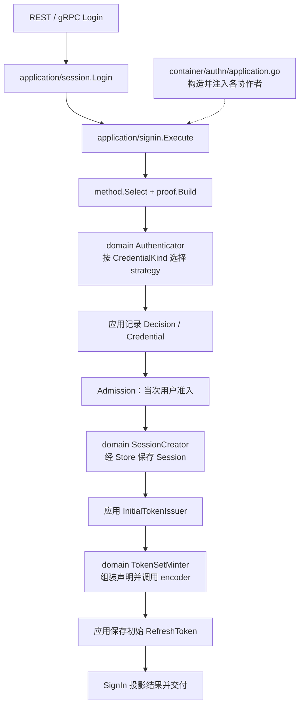
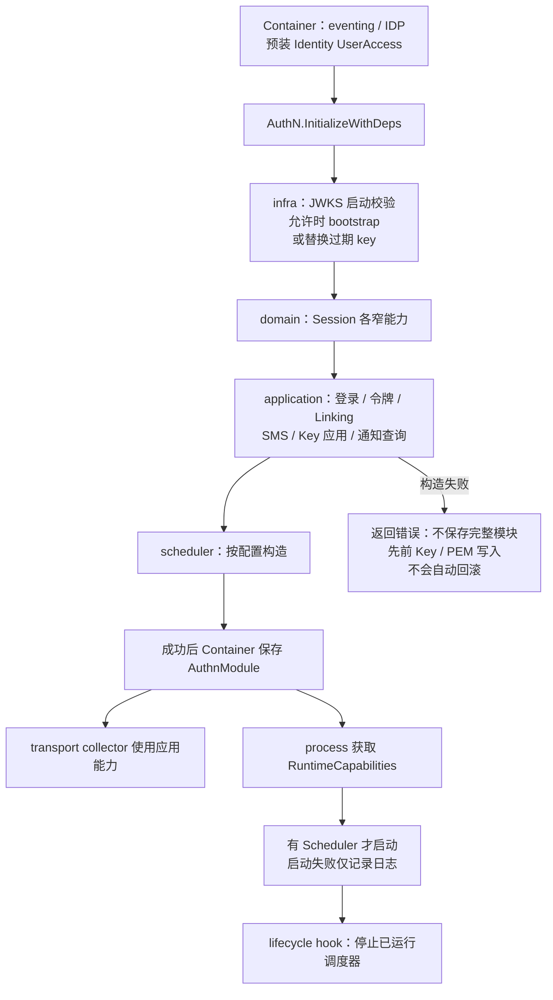

# AuthN 分层架构与代码索引

> 状态：已实现 · 当前设计与实现。本文维护调用、端口、装配与改动面索引；具体规则和失败窗口由各链路主文维护。目录、接口非 nil 和护栏通过均不等于业务能力已经验证。

## 1. 结论：先定位正在修改的决策，再沿真实入口核对

“新增一个 strategy”“给 JWT 加字段”“调整轮换配置”都不止涉及一个文件，但也不必机械改遍五层。先明确改变的是公开请求、身份核验、用户准入、会话、令牌还是运行配置，再核对调用方、持久化、装配与消费者。

| 当前要解决的问题 | 从哪里开始 | 必须接着确认 |
| --- | --- | --- |
| method 已加入，公开登录仍拒绝 | [wire 适配](../../../internal/apiserver/application/authn/signin/compatibility/explicit_payload.go)与[方法选择](../../../internal/apiserver/application/authn/signin/method/selector.go) | 公开白名单、payload switch、proof builder、领域策略和 SDK 并非一个注册表 |
| 密码通过，登录仍失败 | [SignIn](../../../internal/apiserver/application/authn/signin/sign_in.go)与[completion](../../../internal/apiserver/application/authn/signin/completion.go) | 记录、Admission、Session 保存、初始 refresh 保存与交付分开 |
| Verify 或 Refresh 与本地验签结果不同 | [token 应用能力](../../../internal/apiserver/application/authn/token/capabilities.go) | 在线领域 verifier / refresher、Session、撤销和 SDK 选择的验证器 |
| AuthN 初始化成功，某条方法仍不可用 | [module](../../../internal/apiserver/container/authn/module.go)、[application 装配](../../../internal/apiserver/container/authn/application.go) | Resolver、SMS、方法分派和具体端口；readiness 没有逐方法调用 |
| 密钥或后台轮换异常 | [infra 初始化](../../../internal/apiserver/container/authn/infra.go)、[scheduler 装配](../../../internal/apiserver/container/authn/scheduler.go) | DB / PEM / publish snapshot、进程 Start / Stop、当前就绪检查的范围 |

AuthN 的请求进入已经装配好的对象。Container 是构造与选择实现的位置，不是每次请求调用链的终点；“Domain → ports → Infra → Container”的线性图会混淆请求执行和依赖注入。

## 2. 登录主链：Session 门面转交 SignIn，编排不藏在领域策略里

```mermaid
flowchart TB
    T["REST / gRPC Login"] --> S["application/session.Login"]
    S --> I["application/signin.Execute"]
    I --> P["method.Select + proof.Build"]
    P --> A["domain Authenticator<br/>按 CredentialKind 选择 strategy"]
    A --> R["应用记录 Decision / Credential"]
    R --> G["Admission：当次用户准入"]
    G --> C["domain SessionCreator<br/>经 Store 保存 Session"]
    C --> E["应用 InitialTokenIssuer"]
    E --> M["domain TokenSetMinter<br/>组装声明并调用 encoder"]
    M --> F["应用保存初始 RefreshToken"]
    F --> O["SignIn 投影结果并交付"]
    AS["container/authn/application.go<br/>构造并注入各协作者"] -.-> I
```

图省略 transport 的 wire 适配，见第 5 节；核验后的阶段顺序由 SignIn 调用决定，失败会在相应阶段停止，并非所有阶段共用一个事务。Session 已建立但初始颁发失败时，SignIn 负责已知 SID 的补偿；InitialTokenIssuer 不创建或撤销 Session。具体错误、补偿和响应丢失由 [Login](04-关键链路-Login登录认证.md)维护。

| 位置 | 实际责任 | 为什么保留这个分界 |
| --- | --- | --- |
| `application/session` | transport 使用的 Login / RenewSession / Logout 门面；Login 转交 SignIn | 续期、登出不重复装配登录方法，也不持有完整 proof 依赖 |
| `application/signin/method` | 选择公开 AuthMethod，校验并构造类型化 payload 与 CommonPayload | 请求方法和领域 CredentialKind 可以不同；wire 别名在边缘归一 |
| `application/signin/proof` | 从 selection 构造 IdentityProof；外部分支调用 Resolver，扫码分支消费 state | 请求适配与一次性证明效果不藏进通用 Authenticator |
| `domain/authn/authentication` | 按 proof 的 CredentialKind 分派，形成 AuthDecision / Principal / 更新意图 | 身份核验不自行创建 Session，不将 User 准入等同核验 |
| `application/authn/credential` | 执行 Decision 中的更新意图 | 核验决策与持久化结果分开；SignIn 允许 recorder 缺省，标准容器显式注入 |
| `domain/authn/admission` | 组合 LoginIdentity 与 Identity 窄状态事实 | 不加载 Profile，也不回答 Resource / Action 权限 |
| `domain/authn/session` | Creator / Loader / Extender / Revoker 与 LifetimePolicy | 会话寿命不散落在 transport；具体存储由 Store 实现 |
| `application/authn/token` | 装配领域 mint / verify / refresh / revoke，映射 DTO 与错误；初始颁发另保存 refresh | 跨步骤交付与领域令牌规则有不同 owner |

`SignIn.New` 只保存依赖，执行时才检查必要协作者；`token.NewCapabilities` 也不是一次完整健康检查。构造出非 nil 能力，不能证明字段配置、存储或外部方法当前可用。正常流程和所有权的完整解释分别见 [模型](01-领域模型与认证策略.md)、[Session 合同](03-Session-Token与JWKS.md)与 [Token](05-关键链路-Token签发刷新吊销.md)。

## 3. 端口由需求定义，事务和唯一性仍要追到实现

Domain 不直接依赖 Gin、gRPC、GORM、Redis 客户端或微信 SDK；它仍使用项目 meta、错误码与日志等公共包，不宜概括为完全无外部依赖的纯计算。Application 使用领域能力及窄端口，Infra 负责具体存储 / 网络机制，Container 选择并组合实现。

| 需求与端口 | 定义位置 | 标准实现或装配 | 不能只由接口证明 |
| --- | --- | --- | --- |
| 密码核验与 OTP 消费 | [authentication ports](../../../internal/apiserver/domain/authn/authentication/ports.go) | Argon2 hasher；Challenge 适配到 LoginPhoneOTPVerifier | 真实秘密配置、OTP 规范化与消费代次 |
| 用户状态读取 | [Identity useraccess](../../../internal/apiserver/domain/identity/useraccess/capabilities.go)被 Admission 消费 | Container 预先装配 Identity 窄读能力 | 完整 IdentityModule 已启动、跨次读取一致 |
| SignUp 三仓储 UoW | [应用 UoW](../../../internal/apiserver/application/authn/uow/uow.go) | [MySQL AuthN UoW](../../../internal/apiserver/infra/mysql/uow/authn/uow.go)，Required 可借用外层事务 | provider / Redis 原子性、外层调用者已经提交 |
| 会话存取 / 索引 / 批量撤销 | [session.Store](../../../internal/apiserver/domain/authn/session/repository.go) | [Redis SessionStore](../../../internal/apiserver/infra/cache/redis/session_store.go) | 整批原子、索引完整、新登录屏障 |
| refresh 交换 / consumed / bearer 撤销 | [token.Store](../../../internal/apiserver/domain/authn/token/ports.go) | [RedisStore](../../../internal/apiserver/infra/cache/redis/token-store.go) | Session 延期、签名与交付也属于同一原子交换 |
| access 编码与验签 | 同一 token ports 中的 Encoder / SignatureVerifier | [SignedJWTCodec](../../../internal/apiserver/infra/token/jwt/signed_jwt_codec.go)经 key source 找密钥 | 在线准入、调用方 audience 和业务范围已校验 |
| 初始 refresh 保存 | [InitialTokenIssuer](../../../internal/apiserver/application/authn/token/initial_issuer.go)定义 RefreshTokenSaver | 复用 TokenStore 的保存能力 | Session 创建 / 补偿由该 issuer 承担 |
| 外部身份解析 | [IDP Resolver](../../../internal/apiserver/application/idp/externalidentity/resolver.go) | AuthN 取 IDPModule 暴露的 Resolver | 任意替身保持真实 provider 来源与 Realm 合同 |

应用 token 的部分依赖是领域接口的 type alias，Session 门面也保留 method / proof / signin 的 alias；它们不是新的业务模型或额外适配层。追索时应继续到原接口与实现，不按同名类型重复抽取概念。

LoginIdentity 的 key 形状和归属规则在领域对象 / policy 中表达，canonical 竞争、唯一索引及 Unlink 的身份行锁在 MySQL 仓储与迁移中落实。Credential 的更新依赖 recorder 和仓储；Challenge 的一次性消费依赖实际存储操作。不能在“Domain 不变量”表中把数据库并发结果全归功于实体方法。

事务位置也随用例不同：SignUp 应用拥有跨聚合意图，UoW 执行事务传播；Link / Unlink 的仓储拥有其局部原子操作；密钥 DB / PEM 编排实际落在 keyset adapter。它们分别由 [SignUp](02-注册登录与身份绑定.md)、[Linking](03-关键链路-Linking登录身份绑定.md)和 [JWKS](06-关键链路-JWKS与本地验签.md)维护。

## 4. 持久化与适配器地图：先辨别权威数据，再讨论缓存替换

| 要定位的事实或机制 | 实现入口 | 替换前必须保留的合同 |
| --- | --- | --- |
| LoginIdentity / Credential / User | `infra/mysql/{loginidentity,credential,user}` | 入口归属、唯一约束与 canonical、密码记录和共享注册事务 |
| OTP / OAuth state | `infra/cache/redis/{challenge_repository,otp_verifier}.go` | scene / TTL / 消费顺序；不是删缓存即可恢复的材料 |
| Session / refresh / consumed / revoked | `infra/cache/redis/{session_store,token-store}.go` | 认证在线状态、历史恢复、交换 CAS、索引和部分失败 |
| JWT / JWS 与 key source | `infra/token/jwt`、`infra/token/keyset/jws_key_source_adapter.go` | 声明来源、算法 / issuer / audience 分层，以及在线与本地验证差异 |
| Key metadata / PEM / publish snapshot | `infra/mysql/jwks`、`infra/token/keyset` | DB 激活、私钥材料、发布集合和消费者缓存的独立寿命 |
| provider / SMS | IDP 安装 `infra/wechat`、`infra/wechatapi`；AuthN 选择 `infra/sms` | 外部 proof 与消息交付合同；Secret / SDK 留在各 adapter |

Redis 的认证状态不能统一当作可丢缓存。JWKS publish snapshot 可以从数据库公钥事实重建，Session / refresh / consumed 的丢失则直接改变续期或撤销行为。选存储前要先写出丢失、重复、模糊提交和恢复的具体后果；完整机制归 [Redis](../../03-基础设施/02-Redis与缓存一致性.md)。

`notificationrecipient` 是另一条应用读能力：[Query](../../../internal/apiserver/application/authn/notificationrecipient/query.go)只读指定 app 的 active 小程序入口并检查 User 状态，输出通知接收者；不创建登录态，也不泛列所有 provider。gRPC caller、app 白名单与批量限制由其 service 落实，不应因其放在 AuthN 目录就复用 Login / Admission 全链描述。

## 5. 公开契约、注册与 SDK 是三处检查

| 入口或客户端 | 当前路径 | 实际前置或覆盖 |
| --- | --- | --- |
| REST 登录 / challenge / refresh / logout / verify / 公开微信开通 | [AuthN router](../../../internal/apiserver/transport/rest/authn/router.go)，主要 `/api/v3/authn` | 这些路由没有统一挂 AuthRequired；分别以密码 / OTP / code / refresh / access 输入执行用例 |
| REST Linking | 同一 router 的受保护组 | 整组在线 JWT；Link 写入检查 recent-auth 与新证明，Unlink 按 policy 条件再认证；列表 / 发码 / 扫码授权发起不统一要求 recent-auth |
| REST JWKS 管理 | AuthN router 的 `/api/v3/authn/admin/jwks` | JWT 与明确 Resource / Action；公开 JWKS 另行注册 |
| REST Session 管理 | [admin_routes](../../../internal/apiserver/transport/rest/admin_routes.go)的 `/api/v2/admin` | JWT 与明确 Resource / Action；不能据 authn.v3 名字推导所有路径都是 v3 |
| gRPC AuthN | [authn.proto](../../../api/grpc/iam/authn/v3/authn.proto)、[services](../../../internal/apiserver/transport/grpc/service/authn)、[collector](../../../internal/apiserver/container/authn/grpc.go) | 启用的服务 mTLS / 方法 ACL；用户 token 核验与 Actor 断言各有前置 |
| SDK `client.Auth()` | [SDK Client](../../../pkg/sdk/client.go)及 `pkg/sdk/auth/client` | gRPC 包装：包括登录 / 令牌，以及 Signup / Challenge / LoginIdentity / 通知接收者 / GetJWKS |
| SDK 独立 REST 客户端 | `pkg/sdk/auth/{loginv3,challenge,signup,loginidentity}` | baseURL 归一到 API v3；loginidentity 使用 bearer，但当前没有扫码绑定两步封装 |
| SDK JWKS / verifier | `pkg/sdk/auth/{jwks,verifier}` | 本地材料与验证器选择；不自动等同 IAM 在线 Verify |

标准 SDK Client 只装配 gRPC 包装客户端；独立 REST 客户端、JWKSManager 和 TokenVerifier 由调用方显式构造，填写 JWKS 配置不会自动装配这些对象。获取与验证的细节归 [JWKS](06-关键链路-JWKS与本地验签.md)。

Transport 还拥有入口准入装配与可信上下文转换：REST 从在线验证后的上下文投影用户 Actor，gRPC Linking 则解析获准服务的请求断言，不再次在线验票。字段同名不代表同一来源，完整前置归 [模块边界](07-模块边界-AuthN与Identity-IDP-AuthZ.md)。

REST / gRPC Login 都先用应用 compatibility 适配显式 payload，再调 SessionService.Login。当前协议中的 device_id 没有投影到应用 LoginRequest；REST 另补 ClientIP / UserAgent，gRPC 不补。SDK 测试能证明 device_id 发给 HTTP 替身，不能证明服务端建立了设备约束。方法、字段与错误矩阵由 [Login](04-关键链路-Login登录认证.md)维护。

AuthN OpenAPI 位于 [authn.v3.yaml](../../../api/rest/authn.v3.yaml)，管理与公开 JWKS 的实际注册还须查 router 及最终模块注册。实现了 handler / service、生成了 proto，仍不代表 collector 已安装到当前服务。公共 JWKS、管理能力和用户登录不能合成一种认证前置；具体注册见 [REST collector](../../../internal/apiserver/container/authn/rest.go)、[Router](../../../internal/apiserver/transport/rest/router.go)与 [module_routes](../../../internal/apiserver/transport/rest/module_routes.go)。

`ApplicationCapabilities` 汇集 transport 使用的应用协作者，包含接口及若干具体应用对象指针；它没有暴露 transport handler。`RuntimeCapabilities` 当前只暴露 RotationScheduler，inspectors 经另一方法提供。不能把能力集合称为全由窄接口组成，也不能虚构公开 AuthN InfraCapabilities。

## 6. 组合根与进程生命周期：初始化成功不等于完整服务可用

### 6.1 构造与启动分别由谁拥有

标准模块顺序是 eventing → IDP → AuthN → AuthZ → Identity → Suggest。AuthN 在完整 IdentityModule 之前取得预装的 UserAccess 窄能力；后续 Identity worker 再借用 AuthN SessionRevoker，不形成“必须先启动对方完整模块”的循环。

```mermaid
flowchart TB
    B["Container：eventing / IDP<br/>预装 Identity UserAccess"] --> N["AuthN.InitializeWithDeps"]
    N --> J["infra：JWKS 启动校验<br/>允许时 bootstrap<br/>或替换过期 key"]
    J --> D["domain：Session 各窄能力"]
    D --> A["application：登录 / 令牌 / Linking<br/>SMS / Key 应用 / 通知查询"]
    A --> H["scheduler：按配置构造"]
    H --> K["成功后 Container 保存 AuthnModule"]
    K --> T["transport collector 使用应用能力"]
    K --> P["process 获取 RuntimeCapabilities"]
    P --> S["有 Scheduler 才启动<br/>启动失败仅记录日志"]
    S --> Q["lifecycle hook：停止已运行调度器"]
    A -->|"构造失败"| F["返回错误：不保存完整模块<br/>先前 Key / PEM 写入<br/>不会自动回滚"]
```

图示初始化中的关键依赖和一种失败分支；不是全套启动事务。DB / RedisClient / UserStatusReader 缺失会在入口被拒绝。JWKS 先检查 active 数量和当期有效性，必要时按配置 bootstrap / 替换，再验证私钥和刷新 publish snapshot；其状态指标刷新失败只告警。

| 依赖或状态 | 当前默认 / 分支 | 实际含义 |
| --- | --- | --- |
| hasher 未注入 | 使用 Argon2、空 pepper | 对象可构造，不证明秘密配置符合宿主要求 |
| TTL 为零 | Access 15 分钟、Refresh 7 天、SessionMax 24 小时 | 三种寿命分别参与领域 policy，不是一个统一期限 |
| IDP 或 Resolver 缺失 | externalResolver 可保持 nil | 不是装配“不可用实现”；相应 proof / 开通 / 绑定调用时才报配置错误 |
| SMS provider 空 | 选择 log；mq 缺 publisher 或未知 provider 会初始化失败 | log 不是短信实际送达，publisher 非 nil 也不证明消费方接受 |
| JWKS AutoInit | configured 为 true，或 environment 为 development | 启动可能写 DB / PEM；不能当作只读恢复检查 |
| JWKS automatic rotation 关闭 | 不构造调度器 | 不影响已有密钥能力的构造；轮换不因此自动运行 |

例如 JWKS bootstrap 已写入数据库和 PEM，随后 SMS 构造失败：AuthN 返回错误，标准 Container 不保存该完整模块，但前面写入不会由模块级 rollback 撤回。重启前应核对已存在的材料与事实，不以“初始化失败”推断没有变化；详细恢复边界归 [JWKS](06-关键链路-JWKS与本地验签.md)。

### 6.2 资源 owner、停止与检查的范围

| 对象 | 构造 / 启动 | 停止 / 关闭 | 当前检查不证明什么 |
| --- | --- | --- | --- |
| DB / Redis 连接 | process 的连接管理交给 Container | DBManager 关闭共享 registry；AuthN 不关闭借来的池 | 指针非 nil 不证明连通或全部 schema |
| Session / Token services | AuthN domain / application 装配 | 无独立后台 Start / Stop | token 能力非 nil 不证明真实请求成功 |
| JWKS publish snapshot | infrastructure 初始化刷新，后续生命周期应用刷新 | 没有独立网络池由 AuthN 关闭 | readiness 的 GetActiveKey 不重验 PEM 或发布快照 |
| RotationScheduler | AuthN 构造，process 在 goroutine 中 Start | lifecycle hook Stop；AuthN Cleanup 可重复停止 running scheduler | initialized 日志不证明正在运行；readiness 不查 scheduler |
| User 撤销 worker | 后启动的 IdentityModule 仅在 Revoker 非 nil 且 PollInterval > 0 时启动 | Identity Cleanup 取消并等待 | 不属于 AuthN scheduler，任务年龄不证明已启动或每个 Session 已清理 |

scheduler Stop 先等待正在执行的 cron job 完成，再取消；该等待没有独立超时。AuthN Cleanup 忽略传入 ctx，不关闭 DB / Redis；标准进程还先处理 policy subscriber 与可靠消息 drain，之后才关闭后续资源。drain 失败与 hook 失败的处置不同，完整顺序归 [运行时关闭](../../01-运行时/03-后台任务就绪与优雅关闭.md)。

Container.Initialize在bootstrap正常返回后才设置initialized，并对已返回的模块error给出组合错误；不能扩大到panic。普通IDP初始化失败后，缓存收集存在typed-nil方法调用的条件路径；标准process又把IDP列为critical，release不允许degraded。AuthN下层缺Resolver与标准进程启动是两层合同，详见[IDP装配边界](../04-IDP/04-模块边界与代码索引.md#3-装配与失败哪些检查在哪个阶段发生)。模块可用性和critical非nil检查也不是实际行为调用；readiness的authn项核对四个token能力，jwks项读取active key，不检查全部方法、Resolver、SMS、PEM、scheduler或外部业务。

## 7. 常见改动：用具体场景确定改动面

### 7.1 新增公开方法，例如未来的 email_otp

这是扩展检查示例，当前没有实现该方法。先判断新方法是否复用已有 provider / 入口，是否需要新的 proof 类型、发行与消费能力；新增 AuthMethod 不必然新增 provider，更不自动让 SignUp / Linking 支持它。

| 步骤 | 要核对的实际位置 | 只改相邻一处的后果 |
| --- | --- | --- |
| wire 与公共准入 | PublicAuthMethods、NormalizeWireAuthMethod、compatibility 的固定 payload switch | 白名单放行但 switch 仍拒绝；或公开边缘根本不放行 |
| 方法与 payload | method.DefaultSelector / LoginMethod / CommonPayload | 请求能解码，选择器仍不认识或字段未带入 |
| proof 构造 | proof.DefaultFactory；builder 按 CredentialKind 注册 | selector 成功但没有 builder；扫码 builder 还取决于 state verifier 是否注入 |
| 身份核验 | Authenticator 与具体策略，检查 proof / 入口 / AuthContext | 有 proof 但没有策略，或映射到错误入口语义 |
| 容器与 side effects | application.go 的策略、factory、challenge / 外部端口 | 仅包内测试替身成功，标准服务不具备依赖 |
| 契约与消费者 | REST / proto DTO、SDK loginv3 白名单和请求构造 | 服务支持但 SDK 仍本地拒绝，或字段发出却被服务端遗漏 |

method.NewSelector 和 proof.NewFactory 拒绝重复 key，领域 Authenticator.Register 则按 kind 覆盖已有策略；三份结构没有启动时全量交叉覆盖校验。标准容器只在构造时注册，当前不是可热更新的冻结快照；若要运行时替换，需另定并发与一致性合同，不能直接在请求间改 map。

扫码例子说明覆盖检查不能简单比较三份 key 相同：wechat_scan 的应用 selection kind 为 oauth_wx_scan，builder 构造 WechatOpenProof，领域再按该 proof 的种类选开放平台策略。应核对映射边，而不是为了统一列表强行把公开方法与领域证明种类改成同名。

可选的**候选设计**是以统一方法描述生成各层校验清单，检查完整覆盖；它可以发现漏装配，但不能替代 payload 规则、proof 来源、失败副作用和真实方法验收。保留独立分派也有价值：公开方法、证明种类和领域策略不用强行成为一个概念。取舍必须同时考虑哪些扩展允许只在内部开放。

### 7.2 新增声明，例如 provider_verified_at

这是声明扩展示例。先确定它表示本次外部交换、入口历史验证还是 Session 登录时间；当前这三个时间并不相等，SignIn / SignUp / Linking 的保存方式不同。不能因为某条 provider response 带时间，就直接更换全体 auth_time 含义。

随后沿 Principal / AuthContext → Session 保存与历史 decoder → claims 投影 → SignedJWTCodec → REST / gRPC / middleware → SDK 与业务消费者逐处核对。要定义缺字段、旧 typed / legacy 字段组合、过大 ID / 非法时间、响应丢失与缓存结果的兼容；不要只修改签名 codec。实际模型与来源归 [Session 合同](03-Session-Token与JWKS.md)及 [模块边界](07-模块边界-AuthN与Identity-IDP-AuthZ.md)。

### 7.3 改 Refresh 或 User 停用语义

Refresh 从应用 facade 继续追到 domain.Refresher、Session LifetimePolicy 和 Redis 原子交换；现有 RotateRefreshToken 不包含所有签名、Session 延期和交付步骤。扩大原子范围前先明确 old / consumed / new 的状态迁移、失败恢复与历史副本，不能用函数名推断已经原子。完整时序归 [Token](05-关键链路-Token签发刷新吊销.md)。

User 状态规则在 Identity，在线准入在 AuthN，任务 Stage / worker 又有各自 owner。若增加代次，必须贯通所有状态更新、幂等键、Session 建立和旧任务 / 历史会话；只改 Admission 或只加一个 version 字段不能同时关闭重复去重与在途登录窗口。候选与源码推论归 [模块边界](07-模块边界-AuthN与Identity-IDP-AuthZ.md)。

### 7.4 改 JWKS 轮换与恢复

从 SigningKeyOptions → RotationPolicy / KeyLifecycleApp → keyset DB / PEM 操作 → publish snapshot → scheduler / public endpoint → SDK 缓存核对。active DB guard、grace、私钥写入、发布集合、客户端更新时间是不同机制；单 active 不证明全部消费者已接受新 key。

恢复过程还要区分只读取证与允许启动写入：AutoInit 能创建或替换材料，启动成功也不证明调度持续运行。调整期限须核对实际签发窗口、历史 token 和缓存，而非只比较配置数字。完整例子与验收归 [JWKS](06-关键链路-JWKS与本地验签.md)。

## 8. 验证矩阵：结构、替身行为与真实环境各有证据

AuthN 相关护栏在 [architecture_test.go](../../../internal/pkg/architecture/architecture_test.go)，既有 AST import 检查，也有文件存在性、固定字符串与 regex。扫描没有类型检查或调用图分析，不按 build tags 选择文件；通用 Domain 禁止集合也未穷举 Gin / gRPC / Redis SDK 等第三方依赖。下面是范围摘要，不是从测试名称推导行为保证：

| 护栏类型 | 当前检查 | 没有证明 |
| --- | --- | --- |
| Domain 禁用依赖；token 不引入 JOSE adapter | AST 检查直接 import；token 专项含测试源码 | 完整传递依赖、所有类型签名纯净或运行时不触网 |
| SignIn / token / Session 责任 | 固定文件含有或不含某些名字 / 字符串 | 实际执行顺序、借用事务提交、补偿成功 |
| method / proof 与退役旧路由 | 既有路径不存在、新结构片段存在 | 公共白名单与所有 builder / strategy 覆盖相同 |
| transport 消费 capabilities；密钥共用 lifecycle | import / 片段 / 固定 wiring 检查 | 每个入口可达、Actor可信、真实后台 Start成功 |
| JWKS application 仅发布 | 禁止若干生命周期或私钥字符串 | 任意新命名都无法越界、public response完全正确 |

例如 TestAuthnGrantOwnsAdmissionAndSessionTokenCoordination 实际检查四个包含片段，并禁止一个旧类型声明，不执行登录；该禁用检查的失败文案还留有旧 establishment 路径，实际编排应以 SignIn 源码为准。若新增安全规则，先补行为与负例，再选择有针对性的结构护栏，不靠改名字使检查变绿。

| 改动面 | 已有本地验证入口 | 必须另行取得的证据 |
| --- | --- | --- |
| method / proof / 策略 | signin/method、compatibility、proof、domain/authentication | 新方法标准装配、真实证明来源及失败后的消费行为 |
| Session / token / 初始交付 | application/session、token、signin；领域与Redis测试 | 真实 Redis / DB、模糊提交、在途竞争与客户端交付 |
| 注册 / Linking | signup、linking、UoW与transport | 当前schema并发约束、获准服务断言、provider真实效果 |
| 密钥 / JWKS | signingkey、keyset、handler、SDK | MySQL guard、共享PEM、完整轮换传播 / 恢复 |
| 启动 / 关闭 | container/authn、container、process | 当前环境配置、真实依赖、后台运行与关闭结果 |
| 协议 / 消费 | REST / gRPC / SDK测试及契约检查 | 注册覆盖、字段意义、真实caller与业务验收 |

container/authn 的 redis_smoke 使用仅迁移 KeyPO 的 SQLite、miniredis 和 UserStatus 替身，主要断言能力与 inspector；不能证明完整schema、登录成功、真实provider可用。SDK httptest 证明请求发送与响应解析；gRPC handler 测试与真实 mTLS 专项又各有范围。OpenAPI / 路由脚本有自身选择范围，绿色输出不表示所有版本、字段或语义均已比较。

`make docs-hygiene docs-facts docs-validation-tests`检查已编码事实与引用，目标包测试按这次变化选择；执行结果、Skip、仅编译包及实际图文渲染见 [本轮复核记录](../../_data/reviews/2026-10-06-docs-refactor.md)。这份索引不维护另一套 Login / Token / JWKS 正文，也不以检查通过替代真实环境与业务接受。
