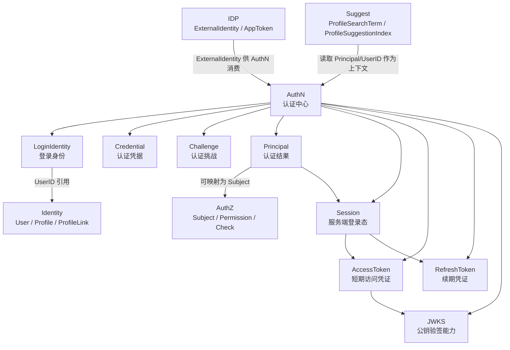

# AuthN

> 状态：规划改造 · 已完成当前事实盘点；正文仍含待实现或尚未收敛的设计内容，不得作为现有能力承诺。

---

## 1. 本目录定位

`02-AuthN/` 是 IAM AuthN 模块的文档入口。

AuthN 是 IAM 的认证中心，负责回答：

```text
当前请求者如何证明自己是谁？
认证成功后，系统如何表达这个认证结果？
认证结果如何转化为 Session、AccessToken、RefreshToken 和 JWKS 可验证能力？
```

AuthN 维护和产生：

```text
LoginIdentity；
Credential；
Challenge；
Principal；
Session；
AccessToken / RefreshToken；
JWKS / Token verification context。
```

AuthN 不负责维护用户档案、不负责外部身份源配置、不负责资源授权判定、不负责 Profile 联想搜索索引。

对应边界：

```text
Identity 负责 User / Profile / ProfileLink；
IDP 负责外部 provider 配置、凭据、AppToken 和 ExternalIdentity；
AuthZ 负责 Subject / Resource / Action / Scope / Role / Permission / RoleBinding / Check；
Suggest 负责 ProfileSearchTerm / ProfileAccessScope / ProfileSuggestionIndex。
```

---

## 2. 30 秒结论

AuthN 可以压缩成一条认证主线：

```text
LoginIdentity / Credential / Challenge
  -> Principal
  -> Session
  -> AccessToken / RefreshToken
  -> JWKS
```

每个对象的职责是：

| 对象 | 一句话 | 不是什么 |
| --- | --- | --- |
| `LoginIdentity` | 用户用什么方式登录 | 不是 `User` |
| `Credential` | 如何证明控制登录身份 | 不是明文密码，也不是登录身份本身 |
| `Challenge` | 一次短期认证挑战如何完成 | 不是长期凭据，也不是登录态 |
| `Principal` | 认证成功后的运行时主体 | 不是 `User`，也不是 `Subject` |
| `Session` | 服务端登录态 | 不是 User 状态，也不是权限 |
| `AccessToken` | 短期访问凭证 | 不是 RefreshToken，不等于授权通过 |
| `RefreshToken` | 续期凭证 | 不是 AccessToken |
| `JWKS` | 公钥验签能力 | 不暴露私钥，不表达授权 |

最重要的边界：

```text
LoginIdentity 不是 User；
Principal 不是 User；
Principal 不是 Subject；
ExternalIdentity 不是 LoginIdentity；
IDP AppToken 不是 IAM AccessToken；
AccessToken 验签成功不等于 AuthZ 授权通过；
Session 状态不是 User 状态；
授权事实不进入 AuthN。
```

如果只记一句话：

> AuthN 只证明“当前请求者是谁”，不维护“用户档案是谁”，不管理“外部身份源配置”，也不判断“能否访问资源”。

---

## 3. 文档结构

当前 AuthN 模块保留 8 篇主文档：

| 文档 | 作用 | 阅读重点 |
| --- | --- | --- |
| [00-模块总览.md](00-模块总览.md) | AuthN 职责、核心对象、关键链路和模块协作总览 | 建立对 AuthN 的整体认知 |
| [01-领域模型-LoginIdentity-Credential-Challenge-Principal-Session-Token.md](01-领域模型-LoginIdentity-Credential-Challenge-Principal-Session-Token.md) | AuthN 核心模型、模型图、状态流转、生命周期和不变量 | 唯一模型主文档，已合并原“领域模型图”和“生命周期”内容 |
| [02-关键链路-Onboarding身份开通.md](02-关键链路-Onboarding身份开通.md) | 首次让登录身份进入 IAM，并绑定内部 User | 区分 Onboarding、Register、Login 和 Bind |
| [03-关键链路-Linking登录身份绑定.md](03-关键链路-Linking登录身份绑定.md) | 已认证用户绑定或解绑登录身份 | UserID 必须来自 Principal，绑定前必须有 proof |
| [04-关键链路-Login登录认证.md](04-关键链路-Login登录认证.md) | 登录请求如何证明为 Principal | Login 的领域终点是 Principal，不是授权结果 |
| [05-关键链路-Token签发刷新吊销.md](05-关键链路-Token签发刷新吊销.md) | Principal 如何转化为 Session、AccessToken、RefreshToken，并支持刷新和吊销 | AccessToken / RefreshToken / Session 的边界 |
| [06-关键链路-JWKS与本地验签.md](06-关键链路-JWKS与本地验签.md) | JWKS 发布、公钥验签、本地缓存、Key Rotation | JWKS 只发布公钥，验签成功不等于授权通过 |
| [07-模块边界-AuthN与Identity-IDP-AuthZ.md](07-模块边界-AuthN与Identity-IDP-AuthZ.md) | AuthN 与 Identity、IDP、AuthZ、Suggest 的协作边界 | 防止 LoginIdentity/User、Principal/Subject、Token/AuthZ 混淆 |
| [08-分层架构与代码索引.md](08-分层架构与代码索引.md) | domain/application/infra/transport/container/contract 代码索引 | 修改代码时的导航入口和 Verify |

注意：

```text
原 02-领域模型图.md 和 03-核心对象生命周期.md 的核心内容已经合并进 01-领域模型-LoginIdentity-Credential-Challenge-Principal-Session-Token.md。
后续如果文件仍存在，应考虑删除、归档或改成跳转说明，避免重复维护。
```

---

## 4. AuthN 模块总图



读图规则：

```text
LoginIdentity 通过 UserID 引用 Identity.User；
Credential / Challenge 证明请求者控制 LoginIdentity；
Principal 是 Login 的认证结果；
Session/Token 让 Principal 可持续使用；
JWKS 只提供公钥验签能力；
AuthZ Check 不属于 AuthN；
Suggest 只读取 Principal/UserID 作为查询上下文，不由 AuthN 维护索引。
```

---

## 5. 核心对象

### 5.1 LoginIdentity

`LoginIdentity` 是登录身份。

它回答：

```text
用户通过哪一种登录方式进入系统？
这个登录方式的内部或外部标识是什么？
这个登录身份最终绑定到哪个 IAM User？
```

关键边界：

```text
LoginIdentity 不是 User；
LoginIdentity 通过 UserID 引用 User；
一个 User 可以有多个 LoginIdentity；
一个 LoginIdentity 不应绑定多个 User；
LoginIdentity 不表达权限。
```

---

### 5.2 Credential

`Credential` 是认证凭据或认证材料。

它回答：

```text
请求者如何证明自己控制某个 LoginIdentity？
```

关键边界：

```text
Credential 不是 LoginIdentity；
Credential 不保存明文密码；
Credential 不应出现在 response 中；
Credential 不表达 User/Profile 关系；
Credential 不表达 Role/Permission。
```

---

### 5.3 Challenge

`Challenge` 是短期认证挑战。

它回答：

```text
一次登录证明过程如何发起、校验、过期和消费？
```

关键边界：

```text
Challenge 必须短期有效；
Challenge 成功后应消费，防止重放；
Challenge 不应保存明文验证码；
Challenge 不是长期 Credential；
Challenge 不是 Session。
```

---

### 5.4 Principal

`Principal` 是认证成功后的运行时主体表达。

它回答：

```text
当前请求者是谁？
对应哪个 UserID？
由哪个 LoginIdentity 认证而来？
这次认证使用了什么认证方式？
```

关键边界：

```text
Principal 不是 User；
Principal 不是 Subject；
Principal 不是 JWT；
Principal 可以映射为 AuthZ Subject；
Principal 不决定最终资源访问权。
```

---

### 5.5 Session / AccessToken / RefreshToken / JWKS

| 对象 | 说明 | 边界 |
| --- | --- | --- |
| `Session` | 服务端登录态 | 不是 User 状态，不表达权限 |
| `AccessToken` | 短期访问凭证 | 验签成功不等于授权通过 |
| `RefreshToken` | 续期凭证 | 不能当 AccessToken 使用 |
| `JWKS` | 公钥集合 | 只发布 public key，不暴露 private key |

---

## 6. 关键链路

### 6.1 Onboarding 身份开通

Onboarding 用于首次让一个登录身份进入 IAM。

主线：

```text
Onboarding input
  -> resolve external identity if needed
  -> resolve or create Identity.User
  -> create or resolve AuthN.LoginIdentity
  -> optional create AuthN.Credential
  -> onboarding result
```

重点边界：

```text
Onboarding 不是 Login；
Onboarding 不是 Bind；
Onboarding 不必然签发 Token；
创建 User 属于 Identity；
创建 LoginIdentity / Credential 属于 AuthN。
```

详细说明见 [02-关键链路-Onboarding身份开通.md](02-关键链路-Onboarding身份开通.md)。

---

### 6.2 Linking 登录身份绑定

Linking 用于已认证用户绑定或解绑登录身份。

主线：

```text
AccessToken -> Principal(UserID)
  -> verify linking proof
  -> resolve provider/type/identifier
  -> check LoginIdentity conflict
  -> bind / unbind LoginIdentity
  -> optional create / rotate / disable Credential
```

重点边界：

```text
Linking 必须基于已认证 Principal；
UserID 必须来自 Principal，不来自客户端参数；
Linking 不是 Onboarding；
Linking 不是 Login；
Linking 不是 ProfileLink。
```

详细说明见 [03-关键链路-Linking登录身份绑定.md](03-关键链路-Linking登录身份绑定.md)。

---

### 6.3 Login 登录认证

Login 用于把一次登录请求证明为 Principal。

主线：

```text
login request
  -> parse authentication proof
  -> resolve LoginIdentity
  -> verify Credential / Challenge / external proof
  -> evaluate LoginIdentity and User status
  -> build Principal
```

重点边界：

```text
Login 的领域终点是 Principal；
Token/Session 是后续链路；
Login 不是 Onboarding；
Login 不是 Linking；
Login 不做 AuthZ Check。
```

详细说明见 [04-关键链路-Login登录认证.md](04-关键链路-Login登录认证.md)。

---

### 6.4 Token 签发、刷新、吊销

Token 链路用于把 Principal 转化为可携带、可验证、可刷新、可吊销的认证凭证。

主线：

```text
Principal
  -> create Session
  -> issue AccessToken
  -> issue RefreshToken
  -> verify AccessToken
  -> refresh AccessToken
  -> rotate RefreshToken
  -> revoke Session / RefreshToken
```

重点边界：

```text
AccessToken 是短期访问凭证；
RefreshToken 是续期凭证；
Session 是服务端登录态；
AccessToken 验签成功不等于 AuthZ 授权通过。
```

详细说明见 [05-关键链路-Token签发刷新吊销.md](05-关键链路-Token签发刷新吊销.md)。

---

### 6.5 JWKS 与本地验签

JWKS 用于让资源服务无需访问 IAM 私钥，也能本地验证 IAM 签发的 AccessToken。

主线：

```text
KeySet
  -> active signing key
  -> sign AccessToken with private key
  -> publish public JWK in JWKS
  -> resource service fetches JWKS
  -> verify by kid + alg allowlist + signature + claims
  -> recover Principal
  -> AuthZ Check
```

重点边界：

```text
JWKS 只发布公钥；
私钥不进入 JWKS；
资源服务不能盲信 token header.alg；
kid 只用于定位 key，不是信任依据；
验签成功不等于授权通过。
```

详细说明见 [06-关键链路-JWKS与本地验签.md](06-关键链路-JWKS与本地验签.md)。

---

## 7. 模块边界

| 边界 | 正确理解 | 错误理解 |
| --- | --- | --- |
| `LoginIdentity` 与 `User` | LoginIdentity 通过 UserID 引用 User | LoginIdentity 就是 User |
| `Principal` 与 `User` | Principal 是认证结果，可携带 UserID | Principal 就是 User |
| `Principal` 与 `Subject` | Principal 可映射为 Subject | Principal 就是 Subject |
| `ExternalIdentity` 与 `LoginIdentity` | ExternalIdentity 由 AuthN 映射或绑定为 LoginIdentity | ExternalIdentity 就是 LoginIdentity |
| `IDP AppToken` 与 `IAM AccessToken` | IDP AppToken 用于调用外部 provider | IDP AppToken 可访问 IAM API |
| `AccessToken` 与 AuthZ | AccessToken 只证明认证上下文 | Token 验签成功就是授权通过 |
| `Session` 与 User 状态 | Session 属于 AuthN 登录态 | Session 状态就是 User 状态 |
| AuthN 与 Suggest | Suggest 可读取 Principal/UserID 作为上下文 | AuthN 维护 Suggest Index |

详细说明见 [07-模块边界-AuthN与Identity-IDP-AuthZ.md](07-模块边界-AuthN与Identity-IDP-AuthZ.md)。

---

## 8. 分层架构

AuthN 代码按以下分层维护：

```text
transport/rest + transport/grpc
  -> application/authn
  -> domain/authn
  -> infra/repository + token runtime + session store + crypto adapter
  -> container/authn
  -> api/rest + api/grpc + pkg/sdk
```

| 层 | 职责 |
| --- | --- |
| domain | 定义 LoginIdentity / Credential / Challenge / Principal / Session / Token / JWKS 领域语义 |
| application | 编排 Onboarding / Linking / Login / Token / Refresh / Revoke / Verify / JWKS 用例 |
| infra | 实现 repository、hasher、challenge store、session store、JWT signer/verifier、JWKS provider |
| transport | 适配 REST/gRPC 请求、响应、middleware 和 interceptor |
| container | 装配 AuthN 模块依赖和跨模块 port |
| contract | 约束 REST/gRPC/SDK 对外接入语义 |

详细代码索引见 [08-分层架构与代码索引.md](08-分层架构与代码索引.md)。

---

## 9. 推荐阅读路径

### 9.1 新读者

```text
00-模块总览.md
  -> 01-领域模型-LoginIdentity-Credential-Challenge-Principal-Session-Token.md
  -> 07-模块边界-AuthN与Identity-IDP-AuthZ.md
```

目标：先理解 AuthN 是什么，以及它不是什么。

---

### 9.2 准备新增登录方式

```text
01-领域模型-LoginIdentity-Credential-Challenge-Principal-Session-Token.md
  -> 02-关键链路-Onboarding身份开通.md
  -> 03-关键链路-Linking登录身份绑定.md
  -> 04-关键链路-Login登录认证.md
  -> 08-分层架构与代码索引.md
```

目标：明确新增登录方式时要改 LoginIdentity、Credential、Challenge、IDP 还是 application strategy。

---

### 9.3 准备修改登录认证

```text
04-关键链路-Login登录认证.md
  -> 01-领域模型-LoginIdentity-Credential-Challenge-Principal-Session-Token.md
  -> 07-模块边界-AuthN与Identity-IDP-AuthZ.md
  -> 08-分层架构与代码索引.md
```

目标：理解 Login 到 Principal 的证明链路、失败边界和安全策略。

---

### 9.4 准备修改 Token / Session

```text
05-关键链路-Token签发刷新吊销.md
  -> 06-关键链路-JWKS与本地验签.md
  -> 08-分层架构与代码索引.md
```

目标：理解 Principal 如何转为 Session/Token，以及 refresh/revoke/JWKS/key rotation 如何治理登录态。

---

### 9.5 准备排查认证与授权混淆

```text
07-模块边界-AuthN与Identity-IDP-AuthZ.md
  -> ../03-AuthZ/00-模块总览.md
  -> ../../04-架构护栏/01-分层依赖边界.md
```

目标：确认 AuthN 是否只做认证，不做授权判定。

---

## 10. 代码事实源

| 事实 | 路径 |
| --- | --- |
| AuthN domain | `../../../internal/apiserver/domain/authn` |
| Principal 模型 | `../../../internal/apiserver/domain/authn/authentication/principal.go` |
| AuthN application | `../../../internal/apiserver/application/authn` |
| Token application/runtime | `../../../internal/apiserver/application/authn/token` |
| AuthN infra | `../../../internal/apiserver/infra` |
| AuthN REST transport | `../../../internal/apiserver/transport/rest` |
| AuthN gRPC transport | `../../../internal/apiserver/transport/grpc` |
| AuthN container | `../../../internal/apiserver/container/authn` |
| Identity User application | `../../../internal/apiserver/application/identity/user` |
| User lifecycle 与 Session revoke 协作 | `../../../internal/apiserver/application/identity/user/service_lifecycle.go` |
| IDP domain/application | `../../../internal/apiserver/domain/idp`、`../../../internal/apiserver/application/idp` |
| AuthZ domain/application | `../../../internal/apiserver/domain/authz`、`../../../internal/apiserver/application/authz` |
| Suggest domain/application | `../../../internal/apiserver/domain/suggest`、`../../../internal/apiserver/application/suggest` |
| REST 契约 | `../../../api/rest` |
| gRPC 契约 | `../../../api/grpc` |
| 架构测试 | `../../../internal/pkg/architecture` |

注意：上表中的具体路径需要继续与当前源码核对。如果源码目录已调整，应以代码为准并同步更新本文。

---

## 11. 常见反模式

| 反模式 | 问题 | 推荐做法 |
| --- | --- | --- |
| LoginIdentity 当 User | 登录身份和内部身份主体混淆 | LoginIdentity 通过 UserID 引用 User |
| Principal 当 User | 运行时认证上下文污染身份事实 | Principal 只表达认证结果 |
| Principal 当 Subject | 认证主体和授权主体引用混淆 | Principal 映射为 Subject 后再 AuthZ Check |
| Login 自动创建 User | Login 和 Onboarding 混淆 | 首次开通走 Onboarding 或显式组合用例 |
| AuthN 直接写 User/ProfileLink | AuthN 吞并 Identity | 通过 Identity application/port 协作 |
| AuthN 直接写 RoleBinding | AuthN 吞并 AuthZ | 授权开通归 AuthZ 用例 |
| Token 验签成功直接放行资源 | 认证和授权混淆 | 验签后继续 AuthZ Check |
| IDP AppToken 当 IAM AccessToken | 外部平台凭证和 IAM 凭证混淆 | IDP AppToken 只用于 provider API |
| JWKS 暴露 private key | 严重安全事故 | JWKS 只发布 public key |
| AuthN 直接维护 Suggest Index | AuthN 污染搜索读模型 | Suggest 通过事件/刷新读取事实 |

---

## 12. Verify

修改本目录文档后至少执行：

```bash
make docs-hygiene
```

涉及 AuthN 领域模型：

```bash
go test ./internal/apiserver/domain/authn/...
```

涉及 AuthN 用例编排：

```bash
go test ./internal/apiserver/application/authn/...
go test ./internal/apiserver/application/authn/token/...
```

涉及 infra repository / token runtime / store：

```bash
go test ./internal/apiserver/infra/...
```

如果实际 infra 测试路径更细，以当前代码为准，例如：

```bash
go test ./internal/apiserver/infra/token/...
go test ./internal/apiserver/infra/mysql/loginidentity/...
go test ./internal/apiserver/infra/mysql/credential/...
go test ./internal/apiserver/infra/mysql/jwks/...
```

涉及 Identity / IDP / AuthZ / Suggest 边界：

```bash
go test ./internal/apiserver/domain/identity/...
go test ./internal/apiserver/application/identity/...
go test ./internal/apiserver/domain/idp/...
go test ./internal/apiserver/domain/authz/...
go test ./internal/apiserver/domain/suggest/...
```

涉及 REST/gRPC 契约或 transport：

```bash
make api-validate
make proto-gen
go test ./internal/apiserver/transport/rest/...
go test ./internal/apiserver/transport/grpc/...
```

涉及 SDK：

```bash
go test ./pkg/sdk/...
```

涉及分层依赖或模块边界：

```bash
go test ./internal/pkg/architecture
```

---

## 13. 本目录总结

AuthN 模块的主线是：

```text
LoginIdentity / Credential / Challenge
  -> Principal
  -> Session
  -> AccessToken / RefreshToken
  -> JWKS
```

AuthN 的核心职责是：

```text
识别登录身份；
验证认证凭据或认证挑战；
生成认证成功后的 Principal；
创建和治理 Session；
签发、验证、刷新和吊销 Token；
通过 JWKS 提供公钥验签能力。
```

AuthN 的核心边界是：

```text
不维护 User/Profile/ProfileLink 写模型；
不拥有 IDP provider 配置和 AppToken；
不做 Role/Permission/RoleBinding/Check；
不维护 Suggest 索引；
不把 Token 验签成功写成授权通过。
```

读完本目录后，应能清楚说明 AuthN 的模型、链路、边界和代码入口，并能在修改代码时避免把 Identity、IDP、AuthZ、Suggest 的职责混入 AuthN。
