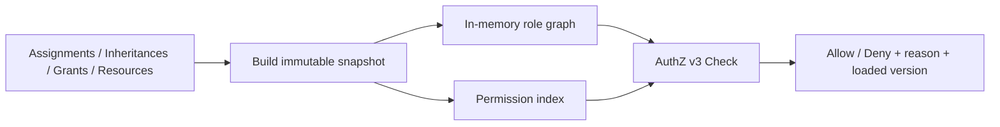

# AuthZ 模块总览

> 状态：已实现 · 当前授权模型是 RBAC + 版本化对象属性条件；不存在在线兼容或双运行时。

## 1. 模块回答的问题

```text
Subject × Tenant × Resource × Action × ObjectAttributes -> Decision
```

这组输入来自可信服务端上下文：Subject 和 Tenant 来自认证结果，Resource 与 Action 来自服务端注册，ObjectAttributes 来自已加载的领域对象。终端用户不能直接声明可影响授权的属性。

## 2. 权威事实

| 事实 | 表 | 含义 |
| --- | --- | --- |
| Role | `authz_roles` | 稳定岗位或能力集合 |
| Assignment | `authz_assignments` | Subject 在租户内获得 Role |
| RoleInheritance | `authz_role_inheritances` | Role 继承另一个 Role |
| Resource | `authz_resources` | 资源、动作及对象属性 Schema |
| PermissionGrant | `authz_permission_grants` | Role 对资源动作的 allow 规则及条件 |
| PolicyVersion | `authz_policy_versions` | 已提交策略版本 |

Grant 是不可变事实；修改通过撤销旧 Grant 并创建新 Grant 完成。首版只支持 allow，不支持显式 Deny。

## 3. 运行时



reload 从一致性数据库视图完整构建新快照，成功后原子替换。构建失败保留上一份原生快照并降低 readiness；决策不会切换到其他授权来源。

## 4. 对象级授权边界

IAM 只求值注册属性，例如 Assessment 的 `object.origin_type`。组织归属、Testee 关系、医生关系等业务事实继续由拥有这些数据的服务检查。调用顺序是：加载对象与校验业务关系，构造受信属性，调用 IAM，然后才检查可被探测的业务状态并进入事务。

## 5. Assessment retry 首个闭环

| Role | adhoc | plan |
| --- | --- | --- |
| `qs:admin` | allow | allow |
| `qs:evaluator` | allow | deny |
| `qs:evaluation_plan_manager` | deny | allow |
| 其他 | deny | deny |

`retry` 可以有对象条件；`force_retry` 与 `batch_evaluate` 仍要求无条件授权。
