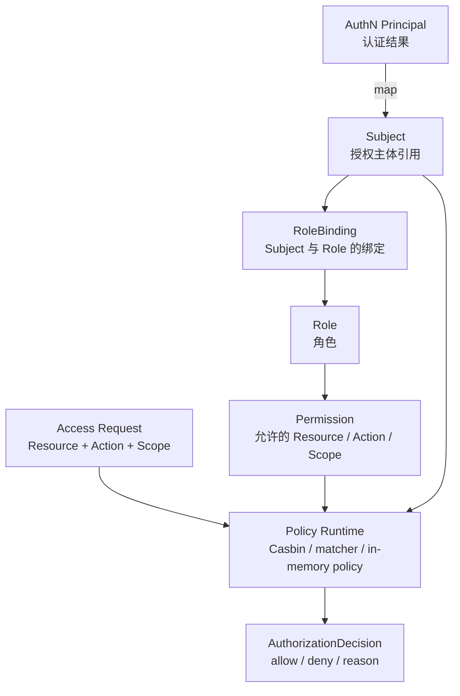

# AuthZ 模块总览

> 状态：设计目标 · 第一版正文，待继续按 `internal/apiserver/domain/authz`、`application/authz`、Casbin runtime、Outbox/PolicyVersion 传播、REST/gRPC 契约和测试逐项核对。

---

## 1. 本文回答

本文回答 8 个问题：

- AuthZ 模块在 IAM 中负责什么？
- AuthZ 为什么是“授权中心”，而不是“认证中心”或“用户中心”？
- `Subject`、`Resource`、`Action`、`Scope` 分别表达什么授权语义？
- `Role`、`Permission`、`RoleBinding` 如何组合成访问权？
- `AuthorizationDecision` 是如何产生的？
- `PolicyVersion`、Outbox、Casbin runtime 在 AuthZ 中分别承担什么职责？
- AuthZ 与 Identity、AuthN、IDP、Suggest 的边界在哪里？
- 阅读 AuthZ 代码和后续文档应该从哪里进入？

本文是 AuthZ 模块入口，只做总览。后续细节应拆到领域模型、授权写入链路、策略发布链路、权限检查链路、模块边界和代码索引文档中。

---

## 2. 30 秒结论

AuthZ 是 IAM 的**授权中心**。

它只回答一个核心问题：

```text
某个 Subject 在某个授权域下，
能不能对某个 Resource 执行某个 Action，
并满足某个 Scope？
```

AuthZ 的核心模型可以压缩成：

```text
Subject
  -> RoleBinding
  -> Role
  -> Permission
  -> Resource / Action / Scope
  -> AuthorizationDecision
```

AuthZ 不负责：

```text
登录认证；
Credential / Challenge 校验；
Session / Token / JWKS；
User / Profile / ProfileLink 写模型；
外部 provider 身份解析；
Profile 联想搜索索引。
```

如果只记一句话：

> AuthN 证明“当前请求者是谁”，AuthZ 判断“这个主体能不能对某个资源执行某个动作”。

---

## 3. 模块定位

AuthZ 是授权域，负责建模、写入、发布、加载和检查访问权。

它回答：

| 问题 | AuthZ 的回答 |
| --- | --- |
| 谁在请求访问？ | `Subject` |
| 访问什么资源？ | `Resource` |
| 执行什么动作？ | `Action` |
| 在什么范围内执行？ | `Scope` |
| 主体被赋予了什么角色？ | `RoleBinding` |
| 角色包含哪些权限？ | `Role` + `Permission` |
| 当前访问是否允许？ | `AuthorizationDecision` |
| 授权策略如何传播到运行时？ | `PolicyVersion` + Outbox + runtime reload |
| 运行时如何高效匹配策略？ | Casbin runtime / policy engine adapter |

AuthZ 是访问控制中心，不是登录中心，也不是身份档案中心。

---

## 4. AuthZ 授权主线图



读图规则：

```text
Principal 属于 AuthN；
Subject 属于 AuthZ；
Principal 可以映射为 Subject，但不是 Subject 本身；
RoleBinding 绑定 Subject 与 Role；
Permission 描述 Resource / Action / Scope；
AuthorizationDecision 是授权检查结果；
Casbin 是运行时策略引擎或 infra adapter，不是领域模型本身。
```

---

## 5. 核心对象

### 5.1 Subject

`Subject` 是授权主体引用。

它用于回答：

```text
谁在请求访问资源？
这个主体在授权域中如何被引用？
```

典型 Subject 可以来自：

```text
AuthN Principal.UserID；
后台 Staff ID；
服务账号；
组织 / 租户主体；
系统内部 actor。
```

具体类型以当前 AuthZ domain 和契约为准。

关键边界：

```text
Subject 不是 User；
Subject 不是 Principal；
Subject 可以由 Principal 映射而来；
Subject 不校验 Credential；
Subject 不签发 Token。
```

---

### 5.2 Resource

`Resource` 是被访问的资源。

它用于回答：

```text
主体想访问什么？
这个资源在授权域中如何命名？
```

典型 Resource：

```text
user；
profile；
profile_link；
role；
permission；
assessment；
organization；
admin_console；
api endpoint；
业务系统自定义资源。
```

具体资源类型以 AuthZ 契约和当前代码为准。

关键边界：

```text
Resource 是授权对象引用；
Resource 不等于数据库表；
Resource 不等于 REST path；
REST path 可以映射成 Resource；
业务实体可以映射成 Resource。
```

---

### 5.3 Action

`Action` 是对资源执行的动作。

它用于回答：

```text
主体想对资源做什么？
```

典型 Action：

```text
read；
create；
update；
delete；
search；
manage；
assign；
revoke；
export；
```

关键边界：

```text
Action 是授权语义，不是 HTTP method 本身；
HTTP GET 可以映射为 read/search；
HTTP POST 可以映射为 create/assign/check；
具体映射应由接入层或 application 明确。
```

---

### 5.4 Scope

`Scope` 是授权范围。

它用于回答：

```text
允许在什么范围内访问？
```

典型 Scope：

```text
self；
owned；
linked_profile；
organization；
tenant；
global；
custom condition。
```

关键边界：

```text
Scope 是授权范围，不是 OAuth scope 的简单同义词；
Scope 不等于 ProfileLink；
ProfileLink 可以作为判断某些 Scope 的事实输入；
Scope 不等于 Suggest ProfileAccessScope；
Scope 最终要进入 AuthZ Check。
```

---

### 5.5 Permission

`Permission` 表达一个允许项。

它通常回答：

```text
允许对哪个 Resource 执行哪个 Action，并在什么 Scope 内生效？
```

可以压缩成：

```text
Permission = Resource + Action + Scope + optional condition
```

关键边界：

```text
Permission 不是 Role；
Permission 不是 RoleBinding；
Permission 不直接绑定 User；
Permission 不校验登录态；
Permission 不等于 ProfileLink。
```

---

### 5.6 Role

`Role` 是权限集合。

它用于回答：

```text
某类主体通常应该拥有哪组 Permission？
```

典型 Role：

```text
admin；
operator；
doctor；
teacher；
guardian；
viewer；
service_account；
业务系统自定义角色。
```

关键边界：

```text
Role 是 Permission 的组合；
Role 不直接证明请求者是谁；
Role 不等于 Subject；
Role 是否生效取决于 RoleBinding 和 PolicyVersion/runtime。
```

---

### 5.7 RoleBinding

`RoleBinding` 是 Subject 与 Role 的绑定事实。

它用于回答：

```text
某个 Subject 在某个授权域或范围内拥有哪些 Role？
```

可以压缩成：

```text
RoleBinding = Subject + Role + Scope/Domain + lifecycle
```

关键边界：

```text
RoleBinding 不是 ProfileLink；
RoleBinding 不表达 User 与 Profile 的亲属或业务档案关系；
RoleBinding 不校验密码或 token；
RoleBinding 是授权事实，属于 AuthZ。
```

---

### 5.8 AuthorizationDecision

`AuthorizationDecision` 是授权检查结果。

它用于回答：

```text
这次访问允许还是拒绝？
为什么允许或拒绝？
使用了哪个 policy version 或 runtime 快照？
```

典型结果：

```text
allow；
deny；
reason；
matched policy；
policy version；
evaluation context。
```

关键边界：

```text
AuthorizationDecision 不是 Token；
AuthorizationDecision 不签发登录态；
AuthorizationDecision 是一次 Check 的结果，不应被无限期当作权限事实缓存。
```

---

## 6. PolicyVersion / Outbox / Runtime

AuthZ 不只有写模型，还需要把授权策略传播到运行时检查环境。

### 6.1 PolicyVersion

`PolicyVersion` 用于表达授权策略的版本。

它回答：

```text
当前授权策略处于哪个版本？
运行时加载的是哪个版本？
某次 AuthorizationDecision 基于哪个策略版本？
```

关键边界：

```text
PolicyVersion 是策略发布和运行时一致性的治理对象；
PolicyVersion 不是 Role；
PolicyVersion 不是 Permission；
PolicyVersion 不等于 Casbin policy line 本身。
```

---

### 6.2 Outbox

Outbox 用于把授权写入后的策略变更可靠传播出去。

它回答：

```text
Role/Permission/RoleBinding 写入成功后，如何通知 runtime reload？
如何避免数据库写成功但事件丢失？
如何重试策略发布？
```

关键边界：

```text
Outbox 是事务内事件记录和异步发布机制；
Outbox 不等于 exactly-once；
Outbox 不替代领域模型；
Outbox 失败时需要重试、监控和补偿策略。
```

---

### 6.3 Casbin Runtime

Casbin 可以作为 AuthZ 的运行时策略引擎或 infra adapter。

它负责：

```text
加载策略；
执行 matcher；
返回 allow/deny；
支撑高效运行时检查。
```

关键边界：

```text
Casbin 是 infra runtime，不是 AuthZ 领域模型；
不要把 Casbin policy line 当作领域唯一事实源；
领域事实仍应是 Subject / Role / Permission / RoleBinding / PolicyVersion；
Casbin matcher 变化要由架构测试、契约测试和授权用例测试保护。
```

---

## 7. 关键链路

### 7.1 授权写入链路

授权写入包括：

```text
创建 / 更新 Role；
创建 / 更新 Permission；
创建 / 撤销 RoleBinding；
生成 PolicyVersion；
写入 Outbox。
```

主线：

```text
transport
  -> application/authz write use case
  -> domain/authz model validation
  -> repository save
  -> PolicyVersion update
  -> Outbox record
```

重点边界：

```text
授权写入不属于 AuthN；
授权写入不创建 LoginIdentity；
授权写入不创建 ProfileLink；
RoleBinding 不是 ProfileLink。
```

---

### 7.2 策略发布 / Runtime Reload 链路

策略发布用于把写模型变更同步到运行时检查环境。

主线：

```text
Outbox event
  -> policy publisher / relay
  -> rebuild or patch runtime policy
  -> update loaded PolicyVersion
  -> expose metrics / health
```

重点边界：

```text
runtime reload 失败不能伪装成已生效；
Check 应明确使用哪个 loaded policy version；
发布延迟需要可观测；
AuthZ 写模型和 runtime 快照要有一致性治理。
```

---

### 7.3 权限检查 Check 链路

权限检查用于对一次访问请求做授权判定。

主线：

```text
Principal / request context
  -> map to Subject
  -> build Resource / Action / Scope
  -> AuthZ Check
  -> runtime evaluate
  -> AuthorizationDecision
```

重点边界：

```text
Check 不是 Login；
Check 不校验 password / otp / token signature；
Check 的输入可以来自 Principal，但 Principal 不是 Subject；
AccessToken 验签成功不等于 Check allow。
```

---

## 8. 与其他模块的边界

### 8.1 与 AuthN

AuthN 证明“是谁”，AuthZ 判断“能不能做”。

```text
AuthN -> Principal
AuthZ -> AuthorizationDecision
```

关键边界：

```text
Principal 不是 Subject；
Principal 可以映射为 Subject；
AuthZ 不校验 Credential / Challenge；
AuthZ 不签发 Token；
AccessToken 验签成功不等于授权通过。
```

---

### 8.2 与 Identity

Identity 提供身份事实，AuthZ 可以引用这些事实做授权判断。

```text
Identity.User -> Subject input
Identity.Profile / ProfileLink -> Scope or condition input
```

关键边界：

```text
User 不是 Subject；
ProfileLink 不是 RoleBinding；
ProfileLink 可以作为某些 Scope 的事实输入；
Identity 不维护 Role / Permission / RoleBinding；
AuthZ 不修改 User/Profile/ProfileLink 写模型。
```

---

### 8.3 与 IDP

IDP 提供外部身份源，通常不直接参与授权决策。

关键边界：

```text
ExternalIdentity 不是 Subject；
IDP AppToken 不是授权凭证；
IDP 不创建 RoleBinding；
AuthZ 不管理 provider app secret；
外部身份应先经过 AuthN 映射为 Principal，再映射为 Subject。
```

---

### 8.4 与 Suggest

Suggest 负责 Profile 联想搜索读模型，AuthZ 可以参与可见范围判断。

关键边界：

```text
Suggest ProfileAccessScope 不是 AuthZ Scope，但可能映射或使用 AuthZ Scope；
Suggest Index 不是权限事实源；
AuthZ 不维护 Suggest 索引；
Suggest 不能只凭 token 存在返回所有 Profile；
Profile 搜索可见性应结合 Principal/UserID、ProfileAccessScope 和 AuthZ Check。
```

---

## 9. 分层架构入口

AuthZ 模块应遵循 IAM 通用分层：

```text
transport/rest + transport/grpc
  -> application/authz
  -> domain/authz
  -> infra/repository + policy runtime + outbox relay
  -> container/authz
  -> api/rest + api/grpc + pkg/sdk
```

各层职责：

| 层 | 职责 |
| --- | --- |
| domain | 定义 Subject、Resource、Action、Scope、Role、Permission、RoleBinding、PolicyVersion、AuthorizationDecision |
| application | 编排授权写入、策略发布、权限检查、版本治理等用例 |
| infra | 实现 repository、Casbin runtime、policy loader、outbox relay、runtime snapshot |
| transport | 适配 REST/gRPC 请求和响应，构造 Check 输入和错误映射 |
| container | 装配 AuthZ repository、service、runtime、outbox、handler |
| contract | 约束 REST/gRPC/SDK 对外接入语义 |

---

## 10. 推荐阅读路径

### 10.1 新读者

```text
00-模块总览.md
  -> 01-领域模型-Subject-Role-Permission-Policy.md
  -> 06-模块边界-AuthZ与Identity-AuthN-Suggest.md
```

目标：先理解 AuthZ 是什么，以及它不是什么。

---

### 10.2 准备修改授权模型

```text
01-领域模型-Subject-Role-Permission-Policy.md
  -> 02-授权写入链路-Role-Permission-RoleBinding.md
  -> 07-分层架构与代码索引.md
```

目标：明确 Role、Permission、RoleBinding、PolicyVersion 的模型和写入链路。

---

### 10.3 准备修改权限检查

```text
04-权限检查链路-Check-AuthorizationDecision.md
  -> 01-领域模型-Subject-Role-Permission-Policy.md
  -> 05-Casbin运行时与策略加载.md
  -> 07-分层架构与代码索引.md
```

目标：理解 Principal 如何映射为 Subject，Resource/Action/Scope 如何进入 runtime，并如何得到 AuthorizationDecision。

---

### 10.4 准备修改策略发布

```text
03-策略发布链路-PolicyVersion-Outbox-RuntimeReload.md
  -> 05-Casbin运行时与策略加载.md
  -> 07-分层架构与代码索引.md
```

目标：理解授权写入后如何传播到运行时，以及版本一致性如何治理。

---

### 10.5 准备排查认证与授权混淆

```text
06-模块边界-AuthZ与Identity-AuthN-Suggest.md
  -> ../02-AuthN/07-模块边界-AuthN与Identity-IDP-AuthZ.md
  -> ../../04-架构护栏/01-分层依赖边界.md
```

目标：确认 AuthZ 是否只做授权，不做认证和登录态治理。

---

## 11. 常见反模式

| 反模式 | 问题 | 推荐做法 |
| --- | --- | --- |
| Subject 当 User | 授权主体引用和身份实体混淆 | Subject 由 UserID/Principal 映射而来 |
| Principal 当 Subject | 认证结果和授权主体混淆 | 接入层显式映射 Principal -> Subject |
| ProfileLink 当 RoleBinding | 身份关系和授权事实混淆 | ProfileLink 归 Identity，RoleBinding 归 AuthZ |
| Token 验签成功直接放行资源 | 认证和授权混淆 | Token 验签后继续 AuthZ Check |
| AuthZ 校验 password/otp | AuthZ 吞并 AuthN | Credential/Challenge 校验归 AuthN |
| RoleBinding 写进 User 表 | 授权事实污染身份模型 | RoleBinding 归 AuthZ 写模型 |
| Casbin policy line 当领域唯一事实源 | infra runtime 吞并领域模型 | 领域事实仍是 Role/Permission/RoleBinding |
| Runtime reload 失败仍宣称策略已生效 | 授权策略一致性风险 | 使用 PolicyVersion、Outbox、监控和重试治理 |
| Permission 直接绑定 User | 绕过 Role/RoleBinding 模型 | 用 RoleBinding 或明确直接授权模型 |
| Suggest 只凭 token 返回所有 Profile | 搜索可见性绕过授权 | 结合 Principal、ProfileAccessScope、AuthZ Check |

---

## 12. 事实源

本文是 AuthZ 总览，不是机器契约。

当本文与代码、契约、测试冲突时，按以下优先级判断：

1. 源码与运行时行为。
2. 机器可读契约与配置：OpenAPI、proto、配置、迁移。
3. 测试：领域测试、应用测试、契约测试、架构测试、SDK compile test。
4. 现行维护中的 `docs/`。
5. `_archive/` 历史材料。

当前主要事实源：

| 事实 | 路径 |
| --- | --- |
| AuthZ domain | `../../../internal/apiserver/domain/authz` |
| AuthZ application | `../../../internal/apiserver/application/authz` |
| AuthZ infra repository | `../../../internal/apiserver/infra` |
| Casbin runtime / policy adapter | `../../../internal/apiserver/infra` |
| AuthZ REST transport | `../../../internal/apiserver/transport/rest` |
| AuthZ gRPC transport | `../../../internal/apiserver/transport/grpc` |
| AuthZ container | `../../../internal/apiserver/container/authz` |
| REST 契约 | `../../../api/rest` |
| gRPC 契约 | `../../../api/grpc` |
| 架构测试 | `../../../internal/pkg/architecture` |

注意：上表中的具体路径需要继续与当前源码核对。如果源码目录已调整，应以代码为准并同步更新本文。

---

## 13. Verify

修改本文后至少执行：

```bash
make docs-hygiene
```

涉及 AuthZ 领域模型：

```bash
go test ./internal/apiserver/domain/authz/...
```

涉及 AuthZ 应用用例：

```bash
go test ./internal/apiserver/application/authz/...
```

涉及 Casbin runtime、policy loader、outbox relay：

```bash
go test ./internal/apiserver/infra/...
```

具体路径以当前代码为准。

涉及 Identity/AuthN/Suggest 边界：

```bash
go test ./internal/apiserver/domain/identity/...
go test ./internal/apiserver/domain/authn/...
go test ./internal/apiserver/domain/suggest/...
```

涉及 REST/gRPC 契约或 transport：

```bash
make api-validate
make proto-gen
go test ./internal/apiserver/transport/rest/...
go test ./internal/apiserver/transport/grpc/...
```

涉及 SDK：

```bash
go test ./pkg/sdk/...
```

涉及分层依赖或模块边界：

```bash
go test ./internal/pkg/architecture
```

---

## 14. 本文总结

AuthZ 模块的主线是：

```text
Subject
  -> RoleBinding
  -> Role
  -> Permission
  -> Resource / Action / Scope
  -> AuthorizationDecision
```

AuthZ 的核心职责是：

```text
建模授权主体、资源、动作和范围；
维护 Role、Permission、RoleBinding 等授权事实；
通过 PolicyVersion、Outbox 和 runtime reload 治理策略传播；
执行权限检查并返回 AuthorizationDecision。
```

AuthZ 的核心边界是：

```text
不做登录认证；
不校验 Credential / Challenge；
不签发 Token；
不维护 User/Profile/ProfileLink 写模型；
不管理 IDP 外部身份源；
不维护 Suggest 搜索索引；
不把 Casbin runtime 写成领域事实源。
```

读完本文后，应继续编写并阅读 AuthZ 的领域模型文档；
把 `Subject`、`Resource`、`Action`、`Scope`、`Role`、`Permission`、`RoleBinding`、`PolicyVersion`、`AuthorizationDecision` 的模型和生命周期讲清楚。
