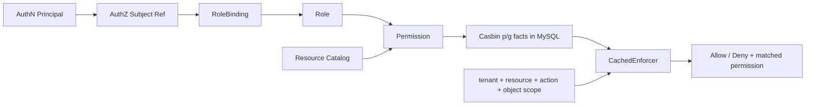

# AuthZ 模块总览

> 状态：已实现 · 本文是 AuthZ 的总入口，统一解释管理事实、运行时投影、授权判定与多实例传播；局部细节由本目录其他文档展开。

## 1. AuthZ 解决的不是“有没有某个角色”

AuthZ 要回答的业务问题是：

```text
某类 Subject
在某个 Tenant 授权域内
是否可以对某个 Resource
执行某个 Action
并覆盖本次 Object Scope
```

这是一条五元关系，不是单独检查 `role == admin`。当前系统把它分成三层事实：

| 层次 | 事实 | 解决的问题 |
| --- | --- | --- |
| 资源目录 | Resource、Action、允许的 ScopeKind | 系统里什么可以被保护、可做什么 |
| 管理授权 | Role、RoleBinding、Permission、PolicyVersion | 谁在什么域获得了哪些规则 |
| 运行时投影 | Casbin `g` / `p` facts、CachedEnforcer | 怎样低延迟完成高频判定 |

如果只保存角色名，系统无法表达对象范围；如果每次 Check 都联表查询管理数据，延迟和可用性会被数据库绑定；如果只保存 Casbin rule，又会丢失资源目录、授权人、变更原因等管理语义。当前设计因此保留“领域事实 + 执行投影”两套表示，但明确 MySQL 才是权威事实源。

## 2. 总体模型



核心对象之间的关系是：

```text
Subject --RoleBinding--> Role --Permission--> ResourcePattern + ActionPattern + Scope
```

它与 AuthN 的关系只有一个窄转换：认证完成后，把已验证主体转换成 `user:<id>`、`group:<id>` 或 `service:<id>` 形式的 Subject。后续能否访问资源，仍由 AuthZ 独立决定。

## 3. 两条主链和一条传播链

### 3.1 Check：高频读链

```text
transport input
  -> typed CheckCommand
  -> domain decision.Request
  -> Casbin fact projection
  -> EnforceEx
  -> AuthorizationDecision
  -> attach current committed PolicyVersion
```

Check 默认拒绝。没有匹配规则是正常业务结果，不是基础设施错误；Enforcer、数据库或模型加载失败才是错误。`EnforceEx` 还返回命中的策略行，所以允许结果可以携带 `MatchedRole` 和 `MatchedPermission`，而不是只给一个裸 `true`。

### 3.2 Grant/Revoke/Bind/Unbind：低频写链

```text
validate catalog and tenant invariants
  -> build PolicyChange
  -> one MySQL transaction:
       management row changes
       + Casbin fact changes
       + PolicyVersion increment
       + outbox event stage
  -> commit
  -> reload local runtime
```

`PolicyChangeCommitter` 是这条链的事务所有者。它把角色绑定表、Casbin facts、版本和 outbox 放入同一事务，避免“管理界面说已授权，但执行表没有事实”或“数据库已改，通知却丢失”。

对同一 Subject、Role 和 Tenant 的 active RoleBinding，数据库还通过 migration `000025` 引入的生成列 `active_guard` 和复合唯一索引阻止并发重复写入。应用层的冲突检查用于提供业务错误，数据库约束才是并发竞态下的最终保护。

### 3.3 PolicyVersion 传播：多实例最终一致

```text
committed change
  -> outbox relay
  -> iam.authz.version
  -> each process has an ephemeral channel
  -> LoadPolicy from MySQL
```

事件只携带 tenant/version，不携带完整策略。它是失效提示，不是事实复制通道；消费者收到事件后重新从 MySQL 加载完整规则。

## 4. 四类状态必须分开

授权系统最容易被一句“已经更新”掩盖。实际至少有四个不同状态：

| 状态 | 含义 | 当前可否直接证明 |
| --- | --- | --- |
| committed | 管理数据、Casbin facts、版本、outbox 已在 MySQL 提交 | 可以，由事务成功证明 |
| published | outbox 已被 relay 到消息系统 | 需看 outbox/relay 观测 |
| observed | 某实例已收到 version event | 当前 health 记录最近 event tenant/version/time |
| loaded | 某实例的 Enforcer 已成功执行 `LoadPolicy` | 只能知道最近 reload 成败/时间，不能证明加载的是指定 tenant/version |

当前 `AuthorizationDecision.PolicyVersion` 读取的是数据库当前版本，它表示判定返回时看到的 committed version，不是 Enforcer 内存中的 loaded version。健康状态虽然记录最近事件与 reload 时间，但没有维护每租户 `loaded_policy_version`，也没有写请求等待所有实例追平的 barrier。

这一区分直接决定故障判断：看到 `PolicyVersion=12` 不能推导“本实例肯定用版本 12 判定”。这不是文字游戏，而是最终一致系统里避免错误承诺的关键。

## 5. 当前匹配语义

Casbin request 和 policy 都是五列：

```text
r = sub, dom, obj, act, scope
p = sub, dom, obj, act, scope
g = sub, role, dom
```

matcher 要求：

```text
g(r.sub, p.sub, r.dom)
&& r.dom == p.dom
&& resourceMatch(r.obj, p.obj)
&& actionMatch(r.act, p.act)
&& scopeMatch(r.scope, p.scope)
```

当前具体规则：

- `SubjectKey` 为 `user:<id>`、`group:<id>`、`service:<id>`；
- Role 在 Casbin 中加 `role:` 前缀，避免与 Subject key 混淆；
- Resource 必须是四段 `<app>:<domain>:<type>:<name-or-pattern>`；
- policy resource 的每一段可用 `*`，request resource 必须是合法四段模式；
- request Action 必须是具体动词，不能含 `|` 或 `*`；
- policy ActionPattern 当前按锚定正则表达式匹配；
- `all:*` scope 匹配任意 request scope；`origin:<value>` 只精确匹配相同 origin。

ActionPattern 允许正则带来表达力，也带来治理风险：规则作者可能写出代价高或意外放宽的表达式。当前 `policylint` 是治理入口之一，但它不能替代资源目录校验和变更审查。

## 6. 为什么采用 RBAC + Scope，而不是纯 RBAC 或纯 ABAC

### 6.1 纯 RBAC

优点是模型简单、管理界面容易理解；缺点是“只能操作某来源/组织/对象”会膨胀成大量角色，例如 `org_1_editor`、`org_2_editor`。当前用 Role 聚合能力，用 Scope 限定对象范围，避免把数据范围编码进角色名。

### 6.2 纯 ABAC

ABAC 可以表达主体、资源、环境属性的复杂布尔关系，但规则可解释性、静态审计和管理体验成本更高。当前业务主要是稳定角色能力加少量范围，因此没有直接把策略做成通用表达式语言。

### 6.3 ACL

按对象记录主体权限适合协作分享，但对象量大时授权事实数量和查询成本显著增加。当前 `origin` 是粗粒度范围，不是每对象 ACL；若将来需要单对象分享，应单独建模而不是把所有对象 ID 填入角色规则。

### 6.4 当前选择

当前选择可概括为：

```text
RBAC 负责“具备哪类能力”
+ Scope 负责“能力覆盖哪些对象范围”
+ Casbin 负责“执行匹配”
+ MySQL/领域模型负责“管理事实与不变量”
```

## 7. 一致性与安全取舍

授权写入成功后，本实例同步 reload；其他实例靠 outbox/event 最终追平。其收益是写接口不依赖所有实例在线，故障隔离较好；代价是存在短暂不一致窗口。

窗口的安全方向取决于变更类型：

| 变更 | 旧实例尚未 reload 的风险 |
| --- | --- |
| Grant / Bind | 暂时拒绝本应允许的访问，偏可用性问题 |
| Revoke / Unbind | 暂时允许本应拒绝的访问，偏安全问题 |

因此高风险撤权若要求“返回成功即全球生效”，当前方案不够。可选演进包括：缩短 access path 缓存、在 Check 前比较 loaded/committed version、按实例回执等待 quorum/all、或把关键撤权切到强一致的集中判定服务。它们都会提高延迟、耦合或可用性成本，不能只加一个字段就宣称完成。

## 8. 失败语义

| 失败位置 | 当前语义 | 是否回滚已提交事实 |
| --- | --- | --- |
| 命令输入/领域不变量失败 | 写入失败 | 无提交 |
| 管理表或 Casbin fact 写失败 | 整个事务失败 | 是 |
| PolicyVersion / outbox stage 失败 | 整个事务失败 | 是 |
| commit 后本实例 reload 失败 | 写请求仍成功，记录 degraded 并重试三次 | 否 |
| 远端实例 event/reload 失败 | 该实例继续使用旧快照，靠重投/运维收敛 | 否 |
| Check 无匹配 | `Deny(not_matched)` | 不适用 |
| Check 执行错误 | 返回错误，不能降级为 allow | 不适用 |

commit 后 reload 失败不能反向回滚数据库，因为外部世界已经可能看到提交，强行补偿反而会产生新的并发竞态。正确做法是把它当“事实已提交、投影滞后”的显式降级状态。

## 9. 模块边界

- AuthN 证明主体并产生 Principal；AuthZ 不校验密码、OTP、JWT 签名。
- Identity 拥有 User/Profile/ProfileLink；AuthZ 只可在绑定时验证所需主体存在，不接管身份关系。
- Suggest 的 `ProfileAccessScope` 是已经解析好的读模型可见范围，不是 AuthZ 的 `scope.Scope`。
- Casbin 是基础设施执行引擎，不是领域聚合根；业务代码不应直接散落 `AddPolicy`/`Enforce`。
- JWT 中的 role snapshot 适合调用方展示或减少部分查询，但不替代权威 Check。

## 10. 阅读与修改路径

1. [授权模型与匹配语义](01-授权模型与匹配语义.md)
2. [权限检查与 Casbin 运行时](02-权限检查与Casbin运行时.md)
3. [授权写入与多实例一致性](03-授权写入与多实例一致性.md)
4. [Casbin 运行时模型](04-Casbin运行时模型.md)
5. [模块边界与代码索引](05-模块边界与代码索引.md)

修改前先判断改的是哪一层：资源目录、管理事实、运行时 matcher、传播协议或 transport 契约。跨层修改必须同时更新相应测试，不能只改 `casbin_model.conf` 或只改接口 DTO。

## 11. 事实源与验证

- 领域对象：`internal/apiserver/domain/authz`
- 应用写链：`internal/apiserver/application/authz/policy`
- 应用读链：`internal/apiserver/application/authz/authorization`
- Casbin 投影：`internal/apiserver/infra/casbin`
- 事务：`internal/apiserver/infra/mysql/uow/authz`
- 多实例同步：`internal/apiserver/application/authz/policysync`、`internal/apiserver/container/authz/policy_sync.go`
- matcher：`configs/casbin_model.conf`

```bash
go test \
  ./internal/apiserver/domain/authz/... \
  ./internal/apiserver/application/authz/... \
  ./internal/apiserver/infra/casbin/... \
  ./internal/apiserver/infra/mysql/uow/authz/... \
  ./internal/apiserver/container/authz/...
```
