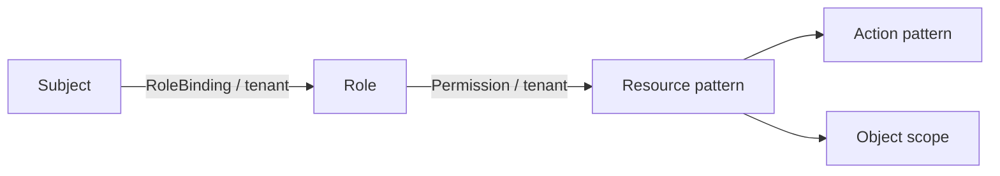

# AuthZ 授权模型与匹配语义

> 状态：已实现 · 本文从业务语义解释 Subject、Role、Permission、Resource、Action、Scope 和 Tenant，而不是把 Casbin 的 p/g 行当作领域模型。

## 1. AuthZ 回答一个五元问题

```text
Subject × Tenant × Resource × Action × ObjectScope -> allow / deny
```

当前模型是带租户域和对象范围的 RBAC：Subject 通过 RoleBinding 获得 Role，Role 再通过 Permission 获得对资源的动作与范围。



这不是简单的 `user -> permission` 表。Role 让权限集合可以复用和治理，Tenant 防止跨授权域串权，Scope 表达同一种动作对不同对象范围的限制。

## 2. Subject 与 Principal 的边界

`subject.Ref` 由类型和 ID 构成，当前允许 `user`、`group`、`service`：

```text
user:123
group:456
service:789
```

AuthN Principal 是一次认证的结果，包含登录身份、Session 和认证方式；AuthZ Subject 是一个可被赋权的稳定引用。把两者拆开，才能让同一 User 的多个 LoginIdentity 共享业务权限，也能给服务或组授权。

边界约束：

- 不能直接信任请求体传来的 Subject；应从已认证 Principal 或服务身份构造；
- AuthZ 不拥有 User 生命周期，只引用其 ID；
- 认证通过只产生可信 Subject，不产生 allow 结论。

## 3. Tenant：Casbin domain 不是普通标签

Role、RoleBinding、Permission 和 Check 都带 TenantID。Casbin 的 `dom` 同时出现在 grouping 和 policy 中，matcher 要求 `r.dom == p.dom`。

因此同名角色在不同 tenant 下是不同授权事实：

```text
g, user:1, role:app.admin, tenant-a
g, user:1, role:app.viewer, tenant-b
```

TenantID 必须由可信路由/服务上下文确定，不能仅取客户端随意传入的值。否则模型本身即使隔离正确，调用方仍可选择错误授权域。

## 4. Role 与 RoleBinding

`Role` 是权限集合的业务实体，包含稳定 ID、名称、显示名、TenantID 和描述。`RoleBinding` 是“某 Subject 在某 Tenant 持有某 Role”的赋权事实，并记录 `GrantedBy`。

同一 `(subject_type, subject_id, role_id, tenant_id)` 在任意时刻只能有一条 active RoleBinding。这个不变量不只由应用服务检查，还由 migration `000025_authz_active_rolebinding_guard` 中的数据库生成列 `active_guard` 和复合唯一索引 `uk_authz_assignments_active` 作为最终并发保护。`deleted_at` 非空的历史绑定会得到 `NULL` guard，因此不妨碍后续重新授予。

持久化管理模型和运行时事实并不完全相同：

- 管理表以 RoleID、BindingID 支持查询和生命周期；
- Casbin grouping fact 使用 `subject key -> role name -> tenant`；
- 应用服务在一个事务内维护两者的一致性。

为什么运行时用 role name 而不是数据库 ID：策略可读性和跨环境种子更好，但角色重命名会比 display name 修改昂贵。当前 `Role.Name` 是值对象，展示名称才用于普通 Rename。

## 5. Permission

Permission 表达：

```text
RoleName + TenantID + ResourcePattern + ActionPattern + Scope
```

它不是一条对 User 的直接赋权，也不是 HTTP 路径。RoleBinding 决定“谁拥有角色”，Permission 决定“角色可以做什么”。

当前管理命令对 action 使用具体值并拒绝 `|` 和 `*`，避免通过普通写接口注入宽泛正则；底层 `ActionPattern` 和历史事实仍支持正则匹配，因此策略治理与 lint 仍然必要。

## 6. 四段式 Resource Key

资源统一为：

```text
<app>:<domain>:<type>:<name-or-pattern>
```

例如可把某应用、业务域、资源类型和具体名称放在四个稳定维度。具体 `Key` 只允许最后一段为 `*`；策略 `Pattern` 允许四段任意位置为 `*`。Casbin 的 `resourceMatch` 逐段比较，策略段为 `*` 时匹配请求段。

相比直接使用 REST path：

- API 路径重构不必改变业务权限名；
- REST 和 gRPC 可以共享同一资源；
- 资源可以表达“能力”而不是传输细节；
- 四段结构使 lint 和按 app 投影成为可能。

当前 `CheckCommand` 的 ResourceKey 类型实际是 `Pattern`，不是严格 concrete `Key`。这给内部批量/模式查询留下空间，也要求调用者不能把“对一个通配 pattern 的 Check”擅自解释为每个具体对象都已授权。路由守卫应使用注册表中固定、可信的资源键。

## 7. Action：业务动词，不是 HTTP Method

请求 Action 必须是具体操作；Permission 的 ActionPattern 在 Casbin 中按完整字符串正则匹配：

```go
regexp.MatchString("^(?:" + policyAction + ")$", requestAction)
```

因此 `GET` 不天然等于 `read`，`POST` 也不天然等于 `create`。路由注册表应显式声明资源与 action，避免仅靠 HTTP method 推断业务授权。

正则提供表达力，也带来两类风险：错误 pattern 可能过宽；复杂表达式增加审核难度。当前普通命令拒绝 pattern，`policylint` 检查持久事实，属于对既有兼容能力的治理护栏。

## 8. Scope：all 与 origin

当前支持：

- `all:*`：策略对任意请求 scope 匹配；
- `origin:<value>`：只与完全相同的请求 scope 匹配。

matcher 规则是“policy 为 `all:*` 则全匹配，否则请求与策略 scope 相等”。路由级 `AuthorizeRoute` 固定使用 `all:*`，它只验证路由能力；需要对象来源范围的业务操作必须构造带 `origin` 的 `Check`。

Scope 不是 Identity 的 ProfileLink，也不是 Suggest 的可见 ID 集。它只是一个授权匹配维度；对象所有权、组织树等事实必须由可信代码先解析成 scope，不能让客户端自报 `origin`。

## 9. 默认拒绝与 Decision

Casbin effect 只有 allow，没有显式 deny：无匹配策略即拒绝。领域 `Decision` 记录 allowed、reason、deny code、匹配的 Role/Permission、PolicyVersion 和判定时间。

显式 deny 可表达例外优先级，但会显著增加冲突消解和审计复杂度。当前采用 allow-list/default-deny，更适合 IAM 的可解释性目标。

## 10. 备选模型

| 模型 | 优点 | 局限 | 当前判断 |
| --- | --- | --- | --- |
| ACL | 对单对象直观 | 规模大时难治理和复用 | 不作为主模型 |
| 纯 RBAC | 简单成熟 | 难表达对象范围 | 以 Scope 增强 |
| ABAC | 上下文表达力强 | 规则调试、审计和数据依赖复杂 | 暂未采用 |
| ReBAC | 适合组织/分享关系 | 需要关系图与专门查询引擎 | 当前规模无必要 |
| 当前 domain-scoped RBAC | 可解释、Casbin 支持、能覆盖租户和来源范围 | pattern 与同步链需要治理 | 当前选择 |

## 11. 面试追问

### RBAC 为什么还需要 Scope？

角色只能说明权限集合，不能区分“读取全部”和“读取某个来源”。Scope 把对象范围作为判定输入，避免为每个来源组合创建角色。

### 为什么不把权限直接放进 JWT？

权限变化会被 token TTL 冻结，角色和策略集合还可能使 token 膨胀。当前 token 只建立可信身份，AuthZ runtime 读取可刷新策略；快照接口可以用于客户端展示，但不替代服务端 Check。

### Casbin 是领域层吗？

不是。领域层定义 Subject、Permission 和 Decision；Casbin 只是把这些对象投影为 p/g/r fact 并执行 matcher 的基础设施实现。

## 12. 事实来源与验证

- 值对象：`internal/apiserver/domain/authz/{subject,tenant,resource,scope,role,permission,rolebinding,decision}`
- Casbin 投影：`internal/apiserver/infra/casbin/facts.go`
- matcher：`configs/casbin_model.conf`、`internal/apiserver/infra/casbin/adapter.go`
- lint：`internal/apiserver/application/authz/policylint`

```bash
go test ./internal/apiserver/domain/authz/... ./internal/apiserver/infra/casbin/... ./internal/apiserver/application/authz/policylint
```
