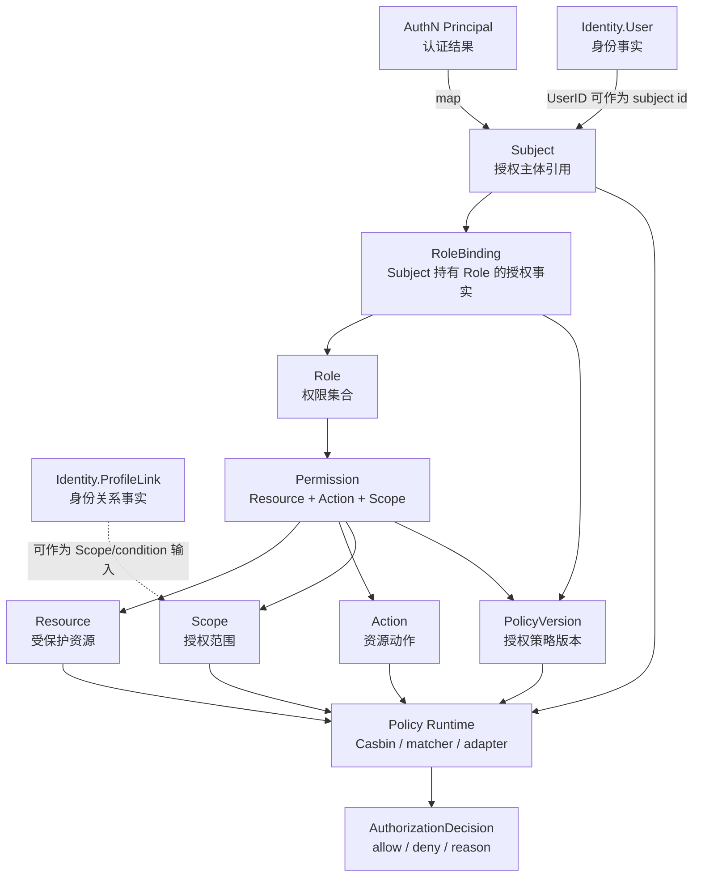
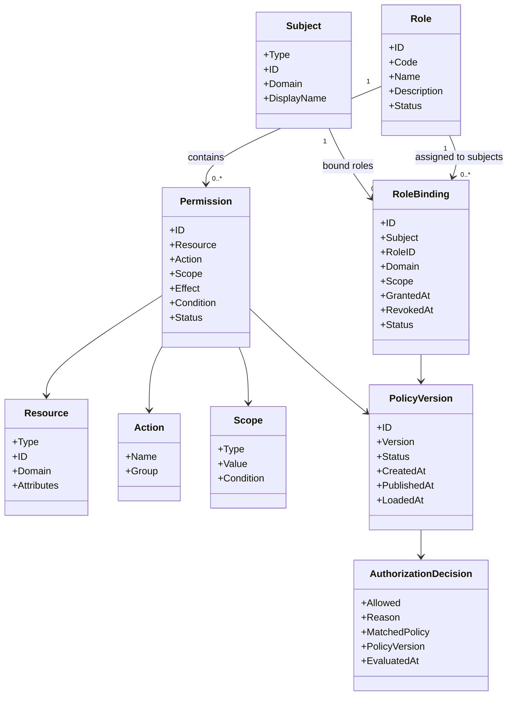
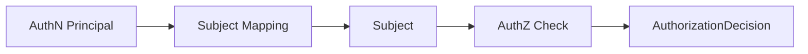
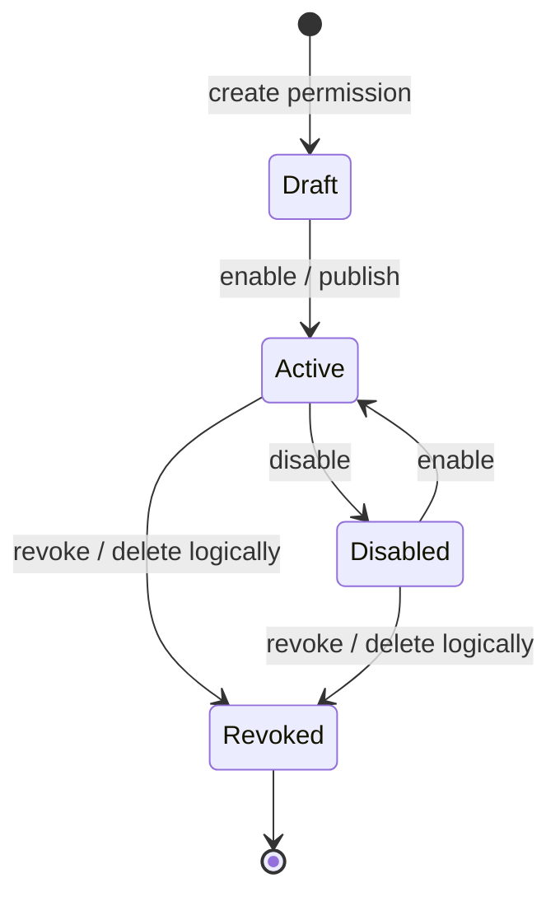
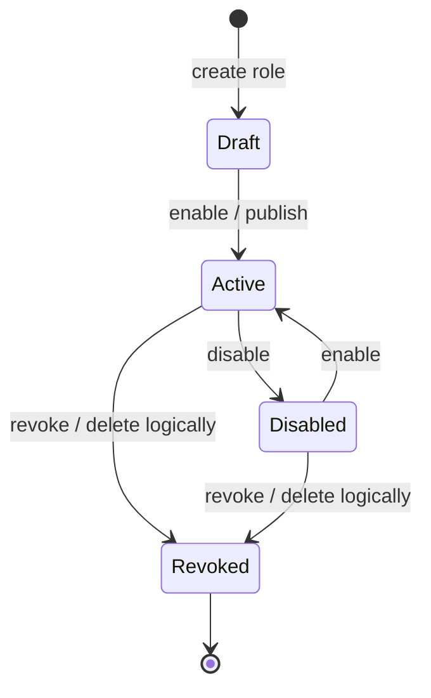
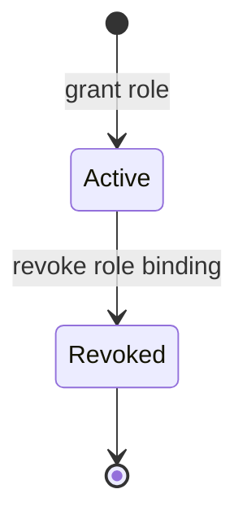
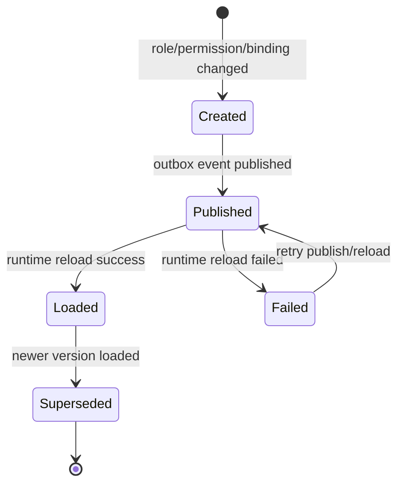

# 领域模型：Subject / Resource / Action / Scope / Role / Permission / RoleBinding

> 状态：待补证据 · 第一版正文，待继续按 ：
> `internal/apiserver/domain/authz`、`application/authz`、Casbin runtime、Outbox/PolicyVersion、REST/gRPC 契约和测试逐项核对；
> 本文合并原“领域模型 / 领域模型图 / 核心对象生命周期”三类内容，作为 AuthZ 模型主文档维护。

---

## 1. 本文回答

本文回答 10 个问题：

- AuthZ 领域模型由哪些核心对象组成？
- `Subject`、`Resource`、`Action`、`Scope` 分别表达什么授权语义？
- `Role`、`Permission`、`RoleBinding` 如何组合成访问权？
- `PolicyVersion` 为什么属于授权策略治理，而不是 Role 或 Permission？
- `AuthorizationDecision` 如何表达一次授权检查结果？
- 为什么 `Subject` 不是 `User`，`Principal` 也不是 `Subject`？
- 为什么 `ProfileLink` 不是 `RoleBinding`？
- 为什么 `Casbin` 是 infra runtime，而不是 AuthZ 领域模型本身？
- AuthZ 核心对象的生命周期如何流转？
- 修改 AuthZ 模型时应该核对哪些代码和测试？

本文是 AuthZ 模型主文档，集中说明模型定义、模型图、生命周期、状态流转、不变量和边界。模块总览见 [00-模块总览.md](00-模块总览.md)。

---

## 2. 30 秒结论

AuthZ 的领域模型可以压缩成一条授权主线：

```text
Subject
  -> RoleBinding
  -> Role
  -> Permission
  -> Resource / Action / Scope
  -> AuthorizationDecision
```

每个对象回答的问题不同：

| 对象 | 一句话 | 领域含义 | 不是什么 |
| --- | --- | --- | --- |
| `Subject` | 授权主体引用 | 谁在请求访问资源 | 不是 `User`，也不是 `Principal` |
| `Resource` | 受保护资源 | 主体想访问什么 | 不是数据库表，也不是 REST path 本身 |
| `Action` | 资源动作 | 主体想对资源做什么 | 不是 HTTP method 本身 |
| `Scope` | 授权范围 | 允许在什么范围内访问 | 不是 `ProfileLink`，也不是 Suggest 的 `ProfileAccessScope` |
| `Permission` | 允许项 | 允许对 Resource 执行 Action，并受 Scope 约束 | 不是 Role，也不直接绑定 User |
| `Role` | 权限集合 | 某类主体通常拥有的一组 Permission | 不是 Subject，也不是登录身份 |
| `RoleBinding` | 授权绑定事实 | 某个 Subject 在某个范围内持有某个 Role | 不是 `ProfileLink` |
| `PolicyVersion` | 授权策略版本 | 授权事实发布到 runtime 的版本治理对象 | 不是 Role/Permission/Casbin policy line |
| `AuthorizationDecision` | 授权检查结果 | 某次 Check 的 allow/deny 结果和原因 | 不是 Token，也不是长期权限事实 |

如果只记一句话：

> AuthZ 只维护授权事实和授权决策；认证结果、身份档案、外部身份源、搜索索引都只能作为输入，不能变成 AuthZ 的替代模型。

---

## 3. 为什么拆成 Subject / Resource / Action / Scope

授权检查不是简单判断“用户有没有某个角色”。

完整授权问题至少包含 4 个维度：

```text
谁在访问？       -> Subject
访问什么？       -> Resource
做什么动作？     -> Action
在什么范围内？   -> Scope
```

因此，一次标准授权请求可以表达为：

```text
Check(subject, resource, action, scope, context) -> AuthorizationDecision
```

示例：

| Subject | Resource | Action | Scope | 含义 |
| --- | --- | --- | --- | --- |
| `user:1001` | `profile:2001` | `read` | `linked_profile` | 用户 1001 能否读取与自己有关联的档案 2001 |
| `staff:3001` | `profile` | `search` | `organization:10` | 员工 3001 能否在组织 10 范围内搜索档案 |
| `service:qs` | `assessment` | `create` | `tenant:default` | qs 服务账号能否创建测评资源 |
| `user:1001` | `role_binding` | `assign` | `global` | 用户 1001 能否全局分配角色 |

这种拆分可以避免几个常见错误：

```text
把 User 当 Subject；
把 Principal 当 Subject；
把 ProfileLink 当 RoleBinding；
把 HTTP method 当 Action；
把 REST path 当 Resource；
把 token 验签成功当成授权通过；
把 Casbin policy line 当领域唯一事实源。
```

---

## 4. 领域模型总图



读图规则：

```text
Principal 属于 AuthN，不属于 AuthZ；
User/ProfileLink 属于 Identity，不属于 AuthZ；
Subject 是授权主体引用，不是 User 本体；
RoleBinding 是授权绑定事实，不是 ProfileLink；
Permission 描述 Resource/Action/Scope；
PolicyVersion 治理策略发布和运行时一致性；
Casbin 是 runtime adapter，不是领域模型本身。
```

---

## 5. 类图：核心对象与关系



注意：

```text
上图是领域语义图，不等于数据库物理表结构；
字段名称和数量以当前源码、迁移和契约为准；
如果代码尚未完全实现某个字段，应在具体文档中标记为规划改造或待补证据。
```

---

## 6. Subject

### 6.1 定位

`Subject` 是授权主体引用。

它用于回答：

```text
谁在请求访问资源？
这个主体在授权域中如何被引用？
```

典型 Subject：

```text
user:1001；
staff:3001；
service:qs-worker；
organization:10；
tenant:default；
system:internal-job。
```

具体类型以当前 AuthZ domain 和契约为准。

---

### 6.2 核心字段

| 字段 | 含义 | 说明 |
| --- | --- | --- |
| `Type` | 主体类型 | user / staff / service / organization / tenant 等，具体以代码为准 |
| `ID` | 主体 ID | 对应外部模块的稳定引用 ID |
| `Domain` | 授权域 | 可选，用于租户、组织或业务域隔离 |
| `DisplayName` | 展示名 | 可选，只用于展示，不参与核心授权判断 |

---

### 6.3 生命周期

Subject 通常是授权域中的引用对象，不一定是独立生命周期实体。

生命周期可以压缩为：

```text
由 Principal/User/Service 映射产生
  -> 进入 AuthZ Check
  -> 匹配 RoleBinding / Policy
  -> 参与 AuthorizationDecision
```



---

### 6.4 边界

```text
Subject 不是 User；
Subject 不是 Principal；
Subject 可以由 Principal.UserID 映射而来；
Subject 不校验 Credential；
Subject 不签发 Token；
Subject 不代表一定拥有权限；
Subject 是否拥有访问权取决于 RoleBinding/Permission/Policy runtime。
```

---

## 7. Resource

### 7.1 定位

`Resource` 是受保护资源。

它用于回答：

```text
主体想访问什么？
这个资源在授权域中如何命名？
```

典型 Resource：

```text
user；
profile；
profile_link；
role；
permission；
role_binding；
assessment；
organization；
admin_console；
api endpoint；
业务系统自定义资源。
```

---

### 7.2 核心字段

| 字段 | 含义 | 说明 |
| --- | --- | --- |
| `Type` | 资源类型 | profile / assessment / role_binding 等 |
| `ID` | 资源 ID | 可选，资源实例级授权时使用 |
| `Domain` | 授权域 | 可选，用于租户、组织或系统边界 |
| `Attributes` | 资源属性 | 可选，用于条件授权或 scope 计算 |

---

### 7.3 生命周期

Resource 在 AuthZ 中通常是引用，而不是资源主数据本身。

生命周期：

```text
业务模块定义资源语义
  -> 接入层或 application 构造 Resource
  -> AuthZ Check 使用 Resource
  -> AuthorizationDecision 返回
```

---

### 7.4 边界

```text
Resource 是授权对象引用；
Resource 不等于数据库表；
Resource 不等于 REST path；
REST path 可以映射为 Resource；
业务实体可以映射为 Resource；
AuthZ 不拥有业务资源的写模型。
```

---

## 8. Action

### 8.1 定位

`Action` 是对资源执行的动作。

它用于回答：

```text
主体想对资源做什么？
```

典型 Action：

```text
read；
create；
update；
delete；
search；
manage；
assign；
revoke；
export；
check。
```

---

### 8.2 生命周期

Action 通常是稳定枚举或受控字符串。

生命周期：

```text
定义 Action
  -> 绑定到 Permission
  -> 请求时由 transport/application 映射
  -> 进入 AuthZ Check
```

---

### 8.3 边界

```text
Action 是授权语义，不是 HTTP method 本身；
GET 可以映射为 read/search；
POST 可以映射为 create/assign/check；
DELETE 可以映射为 delete/revoke；
同一 HTTP method 在不同资源上可以映射为不同 Action；
Action 映射规则应由接入层或 application 明确维护。
```

---

## 9. Scope

### 9.1 定位

`Scope` 是授权范围。

它用于回答：

```text
允许在什么范围内访问？
```

典型 Scope：

```text
self；
owned；
linked_profile；
organization；
tenant；
global；
custom condition。
```

---

### 9.2 核心字段

| 字段 | 含义 | 说明 |
| --- | --- | --- |
| `Type` | 范围类型 | self / organization / tenant / global 等 |
| `Value` | 范围值 | organizationID、tenantID 等，可选 |
| `Condition` | 条件表达 | 可选，复杂条件授权时使用 |

---

### 9.3 生命周期

Scope 生命周期通常和 Permission、RoleBinding、Check 请求相关。

```text
定义 Scope
  -> 写入 Permission 或 RoleBinding
  -> Check 时由请求上下文和资源事实计算
  -> runtime matcher 评估
```

---

### 9.4 边界

```text
Scope 是授权范围；
Scope 不等于 OAuth scope 的简单同义词；
Scope 不等于 Identity.ProfileLink；
ProfileLink 可以作为 linked_profile 等 Scope 的事实输入；
Scope 不等于 Suggest.ProfileAccessScope；
Suggest 的可见范围可以映射或调用 AuthZ Scope，但两者不是同一个模型。
```

---

## 10. Permission

### 10.1 定位

`Permission` 是一个允许项。

它回答：

```text
允许对哪个 Resource 执行哪个 Action，并在什么 Scope 内生效？
```

可以压缩成：

```text
Permission = Resource + Action + Scope + optional condition
```

---

### 10.2 核心字段

| 字段 | 含义 | 说明 |
| --- | --- | --- |
| `ID` | Permission 标识 | 授权模型内部权限 ID |
| `Resource` | 受保护资源 | 资源类型或实例 |
| `Action` | 资源动作 | read/create/update/delete/search 等 |
| `Scope` | 授权范围 | self/org/tenant/global 等 |
| `Effect` | 效果 | allow / deny，具体是否支持 deny 以代码为准 |
| `Condition` | 条件 | 可选，复杂授权条件 |
| `Status` | 状态 | active / disabled / revoked，具体以代码为准 |

---

### 10.3 生命周期



注意：

```text
状态图是领域语义图，具体状态枚举以代码为准；
Permission 变化通常需要触发 PolicyVersion 更新和 runtime reload；
如果当前实现没有 Draft/Disabled/Revoked，应以代码为准，并避免写成已实现事实。
```

---

### 10.4 边界

```text
Permission 不是 Role；
Permission 不是 RoleBinding；
Permission 不直接绑定 User；
Permission 不校验登录态；
Permission 不等于 ProfileLink；
Permission 变化不自动代表 runtime 已加载。
```

---

## 11. Role

### 11.1 定位

`Role` 是权限集合。

它回答：

```text
某类主体通常应该拥有哪组 Permission？
```

典型 Role：

```text
admin；
operator；
doctor；
teacher；
guardian；
viewer；
service_account；
业务系统自定义角色。
```

---

### 11.2 核心字段

| 字段 | 含义 | 说明 |
| --- | --- | --- |
| `ID` | Role 标识 | 授权模型内部角色 ID |
| `Code` | 角色编码 | 稳定机器语义，例如 admin/viewer |
| `Name` | 角色名称 | 人类可读名称 |
| `Description` | 描述 | 可选 |
| `Permissions` | 权限集合 | Role 包含的 Permission |
| `Status` | 状态 | active / disabled / revoked，具体以代码为准 |

---

### 11.3 生命周期



关键规则：

```text
Role 创建不等于主体获得权限；
Role 必须通过 RoleBinding 赋给 Subject 才对主体生效；
Role 的 Permission 变化需要进入策略版本治理；
Role disabled 后是否影响已有 RoleBinding，必须以代码策略为准。
```

---

### 11.4 边界

```text
Role 不是 Subject；
Role 不是 LoginIdentity；
Role 不证明请求者是谁；
Role 不直接绑定 User；
Role 是否生效取决于 RoleBinding 和 runtime policy。
```

---

## 12. RoleBinding

### 12.1 定位

`RoleBinding` 是 Subject 持有 Role 的授权事实。

它回答：

```text
某个 Subject 在某个授权域或范围内拥有哪些 Role？
```

可以压缩成：

```text
RoleBinding = Subject + Role + Domain/Scope + lifecycle
```

---

### 12.2 核心字段

| 字段 | 含义 | 说明 |
| --- | --- | --- |
| `ID` | RoleBinding 标识 | 授权绑定 ID |
| `Subject` | 授权主体引用 | 绑定哪个主体 |
| `RoleID` | 角色引用 | 绑定哪个 Role |
| `Domain` | 授权域 | 可选，租户/组织/业务域 |
| `Scope` | 生效范围 | 可选，限制 Role 生效范围 |
| `GrantedAt` | 授予时间 | 授权开始时间 |
| `RevokedAt` | 撤销时间 | 软撤销语义 |
| `Status` | 状态 | active / revoked 等，具体以代码为准 |

---

### 12.3 生命周期



关键规则：

```text
RoleBinding 通常应支持软撤销；
撤销 RoleBinding 不删除 Subject；
撤销 RoleBinding 不删除 Role；
RoleBinding 变化需要触发 PolicyVersion 更新和 runtime reload；
重复授权和重复撤销需要明确幂等或 conflict 语义。
```

---

### 12.4 RoleBinding 不是 ProfileLink

| 概念 | 所属模块 | 表达事实 |
| --- | --- | --- |
| `ProfileLink` | Identity | User 与 Profile 的身份关系事实 |
| `RoleBinding` | AuthZ | Subject 持有 Role 的授权事实 |

区别：

```text
ProfileLink 表达“这个 User 与这个 Profile 有什么身份关系”；
RoleBinding 表达“这个 Subject 被授予了哪个 Role”；
ProfileLink 不等于 Permission；
RoleBinding 不等于亲属关系或档案关系；
某些 Scope 可以参考 ProfileLink，但不能用 ProfileLink 替代 RoleBinding。
```

---

## 13. PolicyVersion

### 13.1 定位

`PolicyVersion` 是授权策略版本治理对象。

它回答：

```text
授权写模型当前处于哪个策略版本？
runtime 当前加载了哪个策略版本？
某次 AuthorizationDecision 基于哪个版本？
```

---

### 13.2 生命周期



关键规则：

```text
Role/Permission/RoleBinding 变化应生成或推进 PolicyVersion；
PolicyVersion published 不等于 runtime loaded；
runtime loaded version 应可观测；
AuthorizationDecision 应尽量记录或暴露 policy version；
reload 失败不能伪装成已生效。
```

---

### 13.3 边界

```text
PolicyVersion 不是 Role；
PolicyVersion 不是 Permission；
PolicyVersion 不等于 Casbin policy line；
PolicyVersion 是策略一致性和发布治理对象；
PolicyVersion 不做认证，也不校验 Token。
```

---

## 14. AuthorizationDecision

### 14.1 定位

`AuthorizationDecision` 是一次权限检查结果。

它回答：

```text
这次访问允许还是拒绝？
为什么允许或拒绝？
基于哪个策略版本或 runtime 快照？
```

---

### 14.2 核心字段

| 字段 | 含义 | 说明 |
| --- | --- | --- |
| `Allowed` | 是否允许 | true / false |
| `Reason` | 原因 | allow/deny 的原因或错误码 |
| `MatchedPolicy` | 命中的策略 | 可选，调试或审计使用 |
| `PolicyVersion` | 策略版本 | 可选，说明基于哪个版本决策 |
| `EvaluatedAt` | 检查时间 | 决策时间 |
| `Context` | 上下文摘要 | 可选，避免泄露敏感信息 |

---

### 14.3 生命周期

AuthorizationDecision 通常是瞬时结果。

```text
build check request
  -> runtime evaluate
  -> return AuthorizationDecision
  -> optional audit/log/metrics
```

边界：

```text
AuthorizationDecision 不是长期权限事实；
AuthorizationDecision 不是 Token；
AuthorizationDecision 不应被无限期缓存；
AuthorizationDecision 不修改 Role/Permission/RoleBinding。
```

---

## 15. Casbin Runtime 边界

Casbin 可以作为 AuthZ 的运行时策略引擎或 infra adapter。

它负责：

```text
加载策略；
执行 matcher；
返回 allow/deny；
支撑高效运行时检查。
```

它不负责：

```text
定义 AuthZ 领域模型；
替代 Role/Permission/RoleBinding；
替代 PolicyVersion；
替代授权写入用例；
替代 Outbox/reload 可靠性治理；
校验 AuthN Credential/Challenge；
签发 Token。
```

正确关系：

```text
Role / Permission / RoleBinding / PolicyVersion
  -> policy loader / adapter
  -> Casbin runtime policy
  -> AuthorizationDecision
```

禁止：

```text
把 Casbin policy line 当作领域唯一事实源；
让业务代码直接散落调用 Casbin Enforce；
绕过 AuthZ application 直接改 Casbin policy；
Casbin matcher 变化不补测试；
runtime reload 失败仍宣称策略已生效。
```

---

## 16. 核心不变量汇总

| 不变量 | 所属对象 | 说明 |
| --- | --- | --- |
| Subject 是授权主体引用 | Subject | 不等于 User/Principal 本体 |
| Resource 是授权对象引用 | Resource | 不等于数据库表或 REST path 本身 |
| Action 是授权动作 | Action | 不等于 HTTP method 本身 |
| Scope 是授权范围 | Scope | 不等于 ProfileLink 或 Suggest ProfileAccessScope |
| Permission 描述 Resource/Action/Scope | Permission | 不直接绑定 User |
| Role 是 Permission 集合 | Role | Role 创建不等于主体获得权限 |
| RoleBinding 绑定 Subject 与 Role | RoleBinding | 不是 ProfileLink |
| RoleBinding 撤销不删除 Subject/Role | RoleBinding | 应优先使用软撤销或明确历史策略 |
| PolicyVersion 治理策略发布 | PolicyVersion | published 不等于 loaded |
| Casbin 是 runtime adapter | Runtime | 不是领域模型本身 |
| Check 返回 AuthorizationDecision | Check | Token 验签成功不等于 Check allow |

---

## 17. 失败边界

| 场景 | 期望行为 | 说明 |
| --- | --- | --- |
| Subject 无法构造 | Check 失败 | 通常返回 unauthenticated 或 invalid argument，取决于入口 |
| Resource/Action 缺失 | Check 失败 | 授权请求不完整 |
| Scope 无法计算 | Check 失败或 deny | 不能默认放行 |
| Role 不存在 | 授权写入失败 | RoleBinding 不能绑定不存在的 Role |
| Permission 不存在 | Role 更新失败 | Role 不能引用不存在的 Permission |
| RoleBinding 已存在 | 幂等返回或 conflict | 以 API 语义为准 |
| RoleBinding 已撤销 | Check 不应继续生效 | runtime 需要加载正确版本 |
| PolicyVersion 发布失败 | 策略未完全生效 | 需要重试、告警和可观测 |
| Runtime reload 失败 | Check 使用旧版本或 fail closed | 具体策略需明确 |
| Casbin matcher 错误 | Check 失败或 deny | 不应默认 allow |
| Token 验签成功但无权限 | forbidden | AuthN 成功，AuthZ 拒绝 |

---

## 18. 与其他模块的边界

### 18.1 与 AuthN

```text
AuthN 证明“是谁”；
AuthZ 判断“能不能做”；
Principal 可以映射为 Subject；
Principal 不是 Subject；
AuthZ 不校验 Credential / Challenge；
AuthZ 不签发 Token；
AccessToken 验签成功不等于授权通过。
```

### 18.2 与 Identity

```text
Identity 提供 User/Profile/ProfileLink 身份事实；
User 不是 Subject；
ProfileLink 不是 RoleBinding；
ProfileLink 可以作为某些 Scope 或 condition 的事实输入；
AuthZ 不修改 User/Profile/ProfileLink 写模型；
Identity 不维护 Role/Permission/RoleBinding。
```

### 18.3 与 IDP

```text
ExternalIdentity 不是 Subject；
IDP AppToken 不是授权凭证；
外部身份应先经过 AuthN 映射为 Principal，再映射为 Subject；
AuthZ 不管理 provider app secret；
IDP 不创建 RoleBinding。
```

### 18.4 与 Suggest

```text
Suggest ProfileAccessScope 不是 AuthZ Scope，但可以映射或调用 AuthZ Scope；
Suggest Snapshot 不是权限事实源；
AuthZ 不维护 Suggest 索引；
Profile 搜索可见性应结合 Principal/UserID、ProfileAccessScope 和 AuthZ Check。
```

---

## 19. 常见反模式

| 反模式 | 问题 | 推荐做法 |
| --- | --- | --- |
| Subject 当 User | 授权主体引用和身份实体混淆 | Subject 由 UserID/Principal 映射而来 |
| Principal 当 Subject | 认证结果和授权主体混淆 | 接入层显式映射 Principal -> Subject |
| ProfileLink 当 RoleBinding | 身份关系和授权事实混淆 | ProfileLink 归 Identity，RoleBinding 归 AuthZ |
| Permission 直接绑定 User | 绕过 Role/RoleBinding 模型 | 用 RoleBinding 或明确直接授权模型 |
| Role 创建后默认所有人拥有 | 授权绑定缺失 | 通过 RoleBinding 授予 Subject |
| Token 验签成功直接放行资源 | 认证和授权混淆 | 验签后继续 AuthZ Check |
| AuthZ 校验 password/otp | AuthZ 吞并 AuthN | Credential/Challenge 校验归 AuthN |
| Casbin policy line 当领域唯一事实源 | infra runtime 吞并领域模型 | 领域事实仍是 Role/Permission/RoleBinding |
| Runtime reload 失败仍宣称策略已生效 | 授权策略一致性风险 | 使用 PolicyVersion、Outbox、监控和重试治理 |
| Suggest 只凭 token 返回所有 Profile | 搜索可见性绕过授权 | 结合 Principal、ProfileAccessScope、AuthZ Check |

---

## 20. 代码事实源

| 事实 | 路径 |
| --- | --- |
| AuthZ domain | `../../../internal/apiserver/domain/authz` |
| Subject / Resource / Action / Scope | `../../../internal/apiserver/domain/authz` |
| Role / Permission / RoleBinding | `../../../internal/apiserver/domain/authz` |
| PolicyVersion / AuthorizationDecision | `../../../internal/apiserver/domain/authz` |
| AuthZ application | `../../../internal/apiserver/application/authz` |
| AuthZ infra repository | `../../../internal/apiserver/infra` |
| Casbin runtime / policy adapter | `../../../internal/apiserver/infra` |
| Outbox / policy relay | `../../../internal/apiserver/infra`、`../../../internal/apiserver/application/authz`，具体以代码为准 |
| AuthZ REST transport | `../../../internal/apiserver/transport/rest` |
| AuthZ gRPC transport | `../../../internal/apiserver/transport/grpc` |
| AuthZ container | `../../../internal/apiserver/container/authz` |
| REST 契约 | `../../../api/rest` |
| gRPC 契约 | `../../../api/grpc` |
| 架构测试 | `../../../internal/pkg/architecture` |

注意：上表中的具体路径需要继续与当前源码核对。如果源码目录已调整，应以代码为准并同步更新本文。

---

## 21. Verify

修改本文后至少执行：

```bash
make docs-hygiene
```

涉及 AuthZ 领域模型：

```bash
go test ./internal/apiserver/domain/authz/...
```

涉及 AuthZ 应用用例：

```bash
go test ./internal/apiserver/application/authz/...
```

涉及 Casbin runtime、policy loader、outbox relay：

```bash
go test ./internal/apiserver/infra/...
```

具体路径以当前代码为准。

涉及 Identity/AuthN/Suggest 边界：

```bash
go test ./internal/apiserver/domain/identity/...
go test ./internal/apiserver/domain/authn/...
go test ./internal/apiserver/domain/suggest/...
```

涉及 REST/gRPC 契约或 transport：

```bash
make api-validate
make proto-gen
go test ./internal/apiserver/transport/rest/...
go test ./internal/apiserver/transport/grpc/...
```

涉及 SDK：

```bash
go test ./pkg/sdk/...
```

涉及分层依赖或模块边界：

```bash
go test ./internal/pkg/architecture
```

---

## 22. 本文总结

AuthZ 的领域模型可以压缩成：

```text
Subject
  -> RoleBinding
  -> Role
  -> Permission
  -> Resource / Action / Scope
  -> AuthorizationDecision
```

每个对象的职责是：

```text
Subject：谁在请求访问；
Resource：访问什么资源；
Action：执行什么动作；
Scope：在什么范围内执行；
Permission：允许对 Resource 执行 Action，并受 Scope 约束；
Role：Permission 集合；
RoleBinding：Subject 持有 Role 的授权事实；
PolicyVersion：授权策略发布和 runtime 一致性治理；
AuthorizationDecision：一次 Check 的 allow/deny 结果。
```

最重要的边界是：

```text
Subject 不是 User；
Principal 不是 Subject；
ProfileLink 不是 RoleBinding；
Permission 不直接绑定 User；
Casbin 是 infra runtime，不是领域模型；
Token 验签成功不等于授权通过；
PolicyVersion published 不等于 runtime loaded。
```

由于本文已经合并模型图和生命周期内容，后续可以将独立的 `02-领域模型图.md` 和 `03-核心对象生命周期.md` 调整为删除、归档或轻量索引页，避免三处重复维护。
