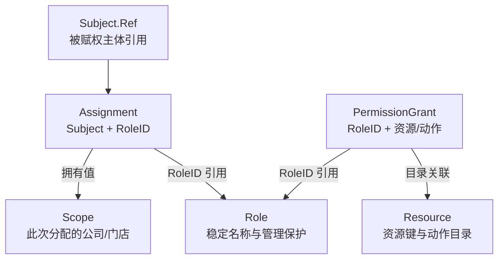

# AuthZ 领域模型设计

> 状态：已实现 · 2026-10-06 对照当前源码修订；本文拥有现行 AuthZ 概念、模型不变量与设计取舍。

## 1. 模型结论：岗位能力和此次授予的范围分别变化

当前模型用四种事实回答四个问题：Role 给岗位一个稳定名称，PermissionGrant 定义该岗位可执行的资源动作，Assignment 记录哪个 Subject 直接持有岗位，Scope 表达这次分配的公司和门店范围。Role 本身没有 Grant 集合字段；Grant 通过 RoleID 引用 Role，范围则属于 Assignment。

以同一个测评员为例：增加批量评估能力，要改岗位的 Grant；让他在公司1从门店10转到门店20，要调整他的 Assignment Scope，并提交该公司受管岗位的完整目标集合；撤销他在公司1的岗位，要从这个目标集合移除相应岗位；修改岗位展示名称，只改 Role。把这些变化放进一条“用户权限”记录，容易把岗位能力与某个人的范围一起改掉。

| 变化 | 当前应改变的事实 | 影响范围与边界 |
| --- | --- | --- |
| 给 `qs:evaluator` 增加 `batch_evaluate` | 为 Role 创建对应 PermissionGrant | 所有直接持有该 Role 的主体获得该动作；数据范围仍各取自己的 Assignment |
| 同一人在公司1的负责门店由10改为20 | 按公司提交受管集合M的完整目标T及各岗位Scope | 不改 Role 的能力，也不改另一人的门店；该岗位范围变化会删除旧分配并创建新分配，其他仍需保留的受管岗位必须留在T中 |
| 撤销此人在公司1的岗位 | 从公司1的完整受管目标集合移除此岗位 | 按公司范围替换保留公司2分配；普通按主体/Role撤销会删除该Role在全部公司的分配，不删除Role/Grant；合同见 [授权写入](03-关键链路-授权写入与受管Assignment.md) |
| 将岗位展示名改为“测评专员” | `Role.Rename` 更新 DisplayName | 稳定 Name、RoleID、既有分配和能力引用不变 |

Role、Assignment、Resource、PermissionGrant 按独立的小聚合管理。这个划分不意味着它们可以各自独立提交：角色存在性、目录动作与 Grant 的一致性等跨聚合不变量，由应用服务和同一数据库事务协调。

图中的目录关联针对普通 Grant，可信系统 Grant 可没有 ResourceID；PermissionEntry 由 Assignment、Scope 和 Grant 等事实重建为资源/动作及配对范围的读取投影，不是写聚合。

## 2. 名称相近，但拥有的事实不同

| 概念 | 拥有的事实 | 构造或读取本身不能证明什么 |
| --- | --- | --- |
| Subject.Ref | `user/group/service` 类型和主体ID | 主体确实存在、本次已认证或能调用管理RPC；当前普通赋权参数只支持 `user` |
| Role | ID、全局稳定 Name、展示信息、ManagementProtection | 主体是业务运营人员、拥有某公司范围，或天然继承另一岗位 |
| Assignment | Subject→Role 的直接分配、分配ID、GrantedBy、可选 Scope | Role 支持哪个动作、业务对象仍归属某门店；当前实体不持有撤销历史 |
| Scope | 单个公司内的 `all_stores` 或显式 `stores` | 公司/门店在业务系统存在、门店有效，或对象当前属于它 |
| Resource / Action | 四段资源键及该目录项支持的具体动作 | 业务对象主表、对象状态机或用户关系 |
| PermissionGrant | Role 对资源模式/动作的无条件允许；ID、来源、撤销状态和记录 Version | 该主体已被分配 Role，或具有数据范围 |
| Request / Decision | 主体、资源键、动作，以及匹配结果、命中证据和策略版本 | 查询结果已过滤、对象状态允许或当前身份有效 |
| PolicyVersion / runtime Snapshot | 全局变更水位 / 可重建的只读事实投影 | 每个实例已加载该版本，或所有外部缓存已撤销旧权限 |

`Subject.Ref` 是引用值对象，不是 AuthN 的 Principal。用户请求使用可信认证上下文中的 UserID 构造 `user:<id>`；管理调用人、被分配人和审计字符串也不能混为一人。mTLS 服务身份决定谁在调用RPC，不自动成为这个RPC正在判定的用户 Subject。

`group/service` 名称保留在引用类型中，不表示当前管理接口已经支持给群组或服务赋权。Assignment Validator 对普通 grant/revoke 参数只接受 `user`；Grant和Replace用例另由SubjectResolver核对主体存在，普通按主体/Role的Revoke不执行这项存在性检查。`NewAssignment` 自身只检查引用格式、非零RoleID和授予来源。当前User适配器检查主体存在，不要求其状态为active；不能把“可被赋权”写成“可登录”。入口差异见 [授权写入](03-关键链路-授权写入与受管Assignment.md)。

## 3. 一个反例说明：为什么范围不能先全局合并

现有 `runtime/scopes_test.go` 使用同一测评资源，给 `user:2` 三次分配：

| 分配 | Role 的动作能力 | 此次 Assignment Scope |
| --- | --- | --- |
| 公司1测评员 `qs:evaluator` | `retry`、`batch_evaluate` | 公司1，门店10 |
| 公司1计划管理员 `qs:evaluation_plan_manager` | `retry` | 公司1，门店20 |
| 公司2计划管理员，同一 Role | `retry` | 公司2，`all_stores` |

因此，`retry` 在公司1可以覆盖门店10和20，在公司2可以覆盖该公司门店；`batch_evaluate` 只覆盖公司1门店10。若先把此人的所有门店合成 `{10,20}`，再看“是否有批量动作”，就会错误地让门店20借用测评员能力。若把 `all_stores` 当成全局标记，又会把公司2范围扩大到公司1。

配对还包含资源维度：即使两个Grant都叫 `read`，一个授予测评结果、另一个授予计划，也不能先按动作名合并它们的门店。这是当前精确资源/动作键规则的直接推论，不是上述测试另行覆盖的跨资源用例。

当前投影有两个步骤，不能压成一个“主体范围”：

1. Snapshot 按导出的 `(ResourceKey, Action)` Grant 内容查找贡献它的 Assignment，再按公司合并这些 Assignment 的 Scope。这里比较的是 Grant 的原始键/动作，不提前把通配 Grant 展开成所有具体动作。
2. 消费者针对实际请求匹配权限条目的资源/动作模式，只合并匹配条目在同一公司的范围，再检查当前对象。某次Assignment的Scope不能借给不匹配该能力的另一分配。

同一 Role 可按不同公司多次分配。直接角色索引将 RoleID 去重，用于动作求值；逐 Assignment 的范围仍各自保留。读取汇总角色名称会丢失“公司1门店10”和“公司2全部门店”的区别，所以汇总角色不能替代 AssignmentScopeFact。

如果一个 Assignment 没有 Scope，它仍能使 Check 匹配该 Role 的 Grant，但不贡献业务数据范围。`UNCONDITIONAL` 只表示 Grant 没有对象属性条件；不能把无范围的 ALLOW 解释成“所有门店”。Check 与范围投影的详细读取合同见 [授权判定与快照](02-关键链路-授权判定与不可变快照.md)。

Check在首个匹配Grant处返回，MatchedRole/MatchedGrantID只解释这次动作允许的一个依据，不枚举所有贡献范围的分配。不能从这个命中Role重建完整门店范围，否则上例retry会漏掉另一岗位贡献的门店；需要范围时读取配对权限投影。

## 4. Scope 的边界：公司内全部门店仍是有限含义

Scope 构造要求公司ID为正数。`stores` 至少一个正数门店ID，构造时复制、排序、去重；读取 StoreIDs 再返回副本。`all_stores` 不携带门店列表，表达该公司门店的动态范围，不冻结创建时的名单。Union 只接受两个合法、同公司的范围，有一项 `all_stores` 时结果仍属于这一个公司。

| 输入或对象 | 当前语义 | 设计后果 |
| --- | --- | --- |
| 未配置 Scope | Assignment.Scope 返回不存在；范围投影不贡献它 | 不根据管理员角色名称补成全公司；旧数据迁移必须显式配置 |
| 显式零值 Scope | Assignment 构造和 Snapshot 构建拒绝 | “没有配置”与“配置了坏范围”不能静默等同 |
| 公司1 `all_stores`，对象公司2 | ContainsStore 为 false | 公司ID是范围边界，不恢复旧 tenant 授权空间 |
| 公司1 `all_stores`，对象门店ID为0 | ContainsStore 为 false | 未归属对象不能通过门店通配符获得访问资格 |
| 公司1 `all_stores`，门店ID为正数 | Scope 允许该ID | 业务方仍需确认门店真实存在、有效，且对象当前属于它 |

IAM的AuthZ保存被授予的公司/门店ID，不维护业务门店目录，也不验证它们的存在性。显式门店下线或对象转店后，Scope 中旧ID不会自动消失；业务方必须按当前事实判定，不能只凭历史授予ID放行。反过来，在同一公司新建有效门店时，`all_stores` 的语义会覆盖它；如果业务希望“只包含今天这批门店”，应使用显式 `stores`。

迁移36把活跃唯一键扩展为 `(subject_type, subject_id, role_id, org_id, active_guard)`。它允许同一主体/Role在不同公司并存，但同一公司不能用多条活跃分配表达两个独立范围；需要把它们合成一个Scope或执行范围替换。历史无范围记录的org_id为0，迁移没有自动授予全部门店。存在deleted_at列和active_guard，不能单凭schema认定删除路径已经保存历史，实际限制见第6节。

## 5. Resource 与 Grant：目录合同在写入和加载时验证

资源键形如 `qs:assessment:collection:assessments`，描述一类可授权能力，不编码某份测评记录的数据库ID。目录和Request要求前三段具体，末段可以是完整 `*`；动作必须具体。可信系统Grant可使用更广的资源模式和动作 `*`，普通管理入口不接受这种动作通配写法。

| 路径 | 当前校验责任 |
| --- | --- |
| `NewRequest` | 主体非零、合法目标资源键、具体动作；没有公司/门店/对象属性输入 |
| 普通 `permissiongrant.New` | RoleID、ResourceID、动作和来源等基本合法性；构造成功不证明目录绑定一致 |
| `Grant.ValidateAgainst` | ResourceID非零时校验ID、ResourceKey与目录一致，Action在目录动作集中；零ID跳过目录绑定 |
| PermissionGrant 应用创建 | 先复核 `permission_grants/create`；事务内锁定Role和Resource，核对角色保护、Grant与目录，再写入 |
| `NewSystem` | 允许无ResourceID和通配动作，是可信引导/迁移入口；有效事实仍需满足角色敏感能力保护 |
| Snapshot 构建 | 有效Grant的Role引用与保护合法；有ResourceID时再次核对目录，坏事实阻止整份发布 |

例如目录当前有 `retry` 和 `batch_evaluate`，已有Grant授予 `retry`：直接把目录改为只剩 `batch_evaluate`，会让已有Grant违反目录合同。当前Resource应用更新读取有效Grant并拒绝这样的候选变化；须先撤销/调整依赖，不能把加载失败留给下一次快照刷新。

上述依赖检查针对引用该ResourceID的目录Grant。零ID系统模式Grant不由目录引用查询追踪；删除一个目录项或移除其动作，不自动撤销覆盖它的系统模式能力。`NewSystem`只是构造入口，本身不验证调用者授权，正常管理Create也没有允许客户端切换到系统Grant的开关。

这不是Evaluator在每次请求内“再检查数据库目录”。Evaluator 使用已经验证的有效候选Grant，找到任一资源/动作匹配即ALLOW，否则正常DENY。它不检查对象属性，也没有deny Grant来覆盖allow Grant。多个直接Role的能力取并集，撤销其中一个Role的Grant后，另一Role若仍贡献同一能力，主体仍可允许。

GrantKey是内容标识，不是PolicyVersion：当前固定沿用v2规范编码和历史无条件集合占位，角色、资源、动作相同但授予人不同会得到相同Key，不能靠换GrantedBy复制一份活跃能力。Grant.Version是单条记录版本，也不能用来表示全局策略新鲜度。保留算法是现有键的兼容要求，不代表活动领域仍支持条件集合。

## 6. 聚合自身、应用事务和历史存储分别保证什么

Role只拥有命名/展示/保护属性，Grant有独立ID、撤销状态和Repository；应用用RoleID协调两者。将Grant嵌进Role集合也是可选建模方式，便于从一个根审阅全部能力，但需要同时承载能力记录的持久化、历史与变更。当前独立结构便于分别定位和撤销某条授予，代价是Role删除、目录更新等跨聚合规则必须显式查询和协调，不能只调用一个实体方法便认为完成。

| 不变量 | 当前实现保证的位置 |
| --- | --- |
| RoleName格式、展示名非空、保护类别合法 | Role/Name构造与方法；全局名称唯一仍依赖持久化约束 |
| Scope格式、公司内Union、避免可变集合泄漏 | Scope值对象；Assignment拒绝显式零Scope |
| 普通Grant目录关联 | Grant.ValidateAgainst + 应用写入 + Snapshot加载 |
| Role删除前没有被查询到的Assignment或有效Grant | Role应用删除查询引用，领域删除策略判断，并在事务中协调；当前Assignment查询包含手工软删行 |
| Resource删除/动作变更不破坏引用该ID的有效目录Grant | Resource应用服务和领域ResourceChangePolicy；不能由Resource单实体保证，也不撤销零ID系统模式Grant |
| 同公司活跃Assignment唯一 | 数据库active unique guard；集合替换还需要锁与版本校验 |
| 授权事实、全局PolicyVersion、通知意图一起持久化 | AuthZ UoW、事务仓储、PolicyVersion Increment和Outbox staging |

普通顶层管理写入在一个事务内修改事实、递增全局版本、写策略变更Outbox。任一环节失败应回滚这次事实变化；顶层WithinTx成功返回后已提交，再尝试本实例重载。提交本身仍不证明其他实例已加载。

当前UoW采用Required语义，检测到外层事务则复用它，不负责最终commit/rollback。应用仍在WithinTx返回后即时调用reload，没有AfterCommit回调，所以借用事务时reload可能先于外层提交；不能把它当作提交后发布保证。完整提交与收敛窗口见 [授权写入](03-关键链路-授权写入与受管Assignment.md)。

授权聚合与快照不作双写：写事实后从数据库重建投影。范围替换无变化时不制造新分配、版本或事件；新增只Create、移除只Delete，Scope改变才删除旧Assignment并创建新ID。领域计划的注释表达“保留历史审计”，但当前仓储实际调用GORM Delete，AuditFields.DeletedAt是普通 `*time.Time`，没有软删类型或专用删除回调；旧分配行并未保留。PermissionGrant另有显式RevokedAt更新，不能据此推导Assignment也保存撤销历史。

普通Assignment按主体/Role查询也没有自动追加deleted_at过滤；Runtime加载则显式过滤有效行，Scope维护回滚另有显式软删除。维护留下的历史行可能阻止Role删除或影响集合替换，不能因为线上Check排除了它们，就认为管理读写也同样排除。

全局版本和Outbox记录提交的版本变动，没有完整的旧公司/门店分配明细，不能拿它们恢复每次历史范围；版本递增也不总表示有效能力变化，例如Role同值更新、普通Assignment零行撤销仍可能递增。如果业务要求历史追溯，候选方案是显式更新撤销字段并统一有效记录谓词，或另存不可变分配审计；两者都需要覆盖读取、唯一约束、并发和补偿。本轮只校正文档，不宣称其中一个方案已实现。

跨角色锁顺序、当前读与CAS由写入正文统一说明，不把SQLite用例结果写成真实MySQL并发保证。

## 7. 管理保护与业务范围没有隐式转换

ManagementProtection控制受保护Role的管理可见性和额外保护要求。敏感集合由 `role.RequiresProtectedRole` 固定列举：`iam:authz:collection:roles/manage_protected`、Resource目录的create/update/delete、`iam:identity:collection:profiles`的list_all/search_by_mobile_all；资源或动作模式覆盖这些能力时也要求protected Role。Snapshot加载再次校验。分类依据是能力覆盖与Role保护属性，角色名称不产生豁免。

`permission_grants/create`是被信任的策略配置权。普通创建核对管理动作、目标Role保护和目录合同，没有要求待授予能力是操作者已有能力的子集，也没有禁止自授或限制同Org；给共享Role增添Grant会影响所有持有它的主体。敏感Grant仍受上述固定集合与Role分类约束。具体权限场景和治理取舍由 [REST管理](05-关键链路-REST管理与路由授权.md) 解释。

REST管理的read/list原始动作由路由检查；Role关联查询的应用Guard只负责受保护对象可见性，Resource查询直接读目录，不能承诺所有应用query都重查原始动作。Resource写入另检查command.Actor的目录动作；Actor由可信adapter从认证身份建立，应用不重新认证它，也不将它与management上下文actor比较。

路由、应用原始动作与受保护能力是多次独立Check，没有绑定同一Snapshot或把判定版本绑定到写入提交。事务行锁保护Role/Resource等事实依赖，不锁操作者的权限快照；二次检查不能解释为即时撤权或权限与数据库提交的原子保证。检查顺序与失败语义见 [REST管理](05-关键链路-REST管理与路由授权.md)。

protected不是Check的“超级管理员”布尔条件。Evaluator仍匹配已加载的Grant：没有Grant的受保护Role没有相应动作能力，有Grant但没有Scope也不自动获得门店范围。`manage_protected`能力、mTLS方法ACL、服务赋权白名单各有自己的准入责任，不能从一个protected标签推导它们全部成立。

对用户业务动作执行Check，与可信服务代表用户配置Assignment，是两条责任链。当前非admin服务的管理写入走部署的assignmentadmission白名单；delegated actor是受约束的审计声明，没有重新认证该用户或逐次Check他的管理动作。可信admin服务也有显式管理通道。详见 [模块协作](07-模块边界-AuthZ与AuthN-Identity-Suggest.md)。

受管集合M由当前可信caller和准入配置确定，不是Assignment持久化的服务所有权：实体没有managed_by或独立caller字段。GrantedBy、PolicyVersion的ChangedBy等字段保存变更来源声明，在带delegated actor的服务写入中取自actor输入；可信caller用于准入校验，不能仅凭这些持久字段宣称完整的双身份审计。完整M的替换与审计字段边界见 [授权写入](03-关键链路-授权写入与受管Assignment.md)。

同样，AuthZ Scope与Suggest的 `visibility.Scope` 是不同概念。后者由Suggest组合动作事实与其可见性输入生成，不直接把门店Scope当作Profile可见名单。Identity保存User–Profile关系，业务调用方决定这些关系的准入意义；AuthZ不拥有对象归属、医生关系或对象状态。

## 8. 为什么选择这套划分，以及何时需要重新评估

以下是针对当前变化场景的设计分析，不推断历史决策过程，也不声明候选方案已经实现。

| 范围存放方案 | 可得到的便利 | 对当前场景的代价 |
| --- | --- | --- |
| 放在Role | 一个岗位即可携带固定范围 | 同一岗位按公司/门店复制；能力调整要同步多份Role，人员转店可能改变共享岗位 |
| 放在Grant | 一条记录同时说明动作与范围 | 共用岗位的每个动作都要表达人员范围，转店需要改多条能力记录；能力和分配不再独立变化 |
| 主体只有一份全局Scope | 调用方只读取一份范围 | 丢失哪个岗位贡献动作，导致上面的门店20借用批量能力；即使保留每个动作的范围，也须维护新的配对事实 |
| 当前Assignment + Scope | 岗位能力共用，人员范围独立变化 | 同一Assignment的范围适用于该Role贡献的所有动作；调用方必须保留Grant与Scope的配对 |

当前方案不能在同一个Assignment中表达“同一Role的retry管门店10/20，但batch_evaluate只管门店10”。现在需拆分能力不同的Role/分配；若这种差异成为普遍需求，才有理由重新评估按能力授予范围的模型，而不是在消费端任意扩大或缩小范围。

把对象条件放进IAM会让一次Check同时表达能力与对象准入，也会引入对象事实的来源、时效、关系变化和查询过滤合同。当前求值器保持资源/动作匹配，代价是采用公司/门店范围的后台入口必须组合配对Scope与当前业务规则，列表还需在分页、计数、缓存前应用约束。关系自服务和Suggest执行各自的可见性规则，不统一套用Assignment Scope。该边界不能仅靠前端隐藏按钮维持。

活动领域没有RoleInheritance、Constraints、AttributeSchema或ObjectContext。旧wire符号用于拒绝非空旧用法，历史列用于迁移/审计；不能因为存储中仍有列，就把条件、继承或tenant分区写回现行能力。退役与兼容详见 [gRPC与SDK](06-关键链路-gRPC服务间授权与SDK.md)。

## 9. 事实来源与验证边界

| 要验证的结论 | 当前源码与已有测试 | 不能由这些证据推导 |
| --- | --- | --- |
| 独立Role/Assignment/Grant，引用与格式分开校验 | `internal/apiserver/domain/authz/role/role.go`、`assignment/assignment.go`、`assignment/validator.go`、`permissiongrant/grant.go`及各包测试 | 构造器已校验数据库所有引用；group/service写入口已开放 |
| Grant构造与目录绑定是两次检查 | `permissiongrant/grant_test.go`的`TestGrantResourceKeyKeepsCatalogAndSystemBoundaries`，`application/authz/permissiongrant/service.go` | 直接调用New可以绕过应用合同成为有效策略 |
| 只合并贡献同一能力的Assignment范围 | `internal/apiserver/infra/authz/runtime/scopes.go`、`scopes_test.go`的`TestSnapshotUnionsOnlyAssignmentsGrantingTheAction` | 每个外部业务接口都已正确过滤范围 |
| all_stores不跨公司、不覆盖未归属对象，集合独立持有 | `internal/apiserver/domain/authz/scope/scope_test.go`及runtime范围测试 | 门店存在性、业务当前归属已经被IAM验证 |
| 目录更新不能破坏有效Grant | `internal/apiserver/application/authz/resource/command_service_integration_test.go`的`TestUpdateResourceRejectsCandidateThatInvalidatesActiveGrant` | 全部真实MySQL竞争、故障与手工改表已被覆盖 |
| 范围替换保留其他公司并检测版本冲突 | `internal/apiserver/infra/mysql/uow/authz/replace_managed_assignments_test.go`、迁移36 | SQLite原子性用例证明生产行锁；替换后保留逐分配历史 |
| Assignment删除与借用事务的真实边界 | `infra/mysql/assignment/repo.go`、`internal/pkg/database/mysql/base.go`、`audit.go`、`pkg/uow/gorm/uow.go`及应用reload位置 | schema/注释替代真实删除行为；WithinTx返回等于外层已提交 |

正文描述当前设计和源码规则。本地相关包回归、真实MySQL专项、部署配置与业务普通账号验收分别记录；本篇不把源码规则当作后三层验收结论。
