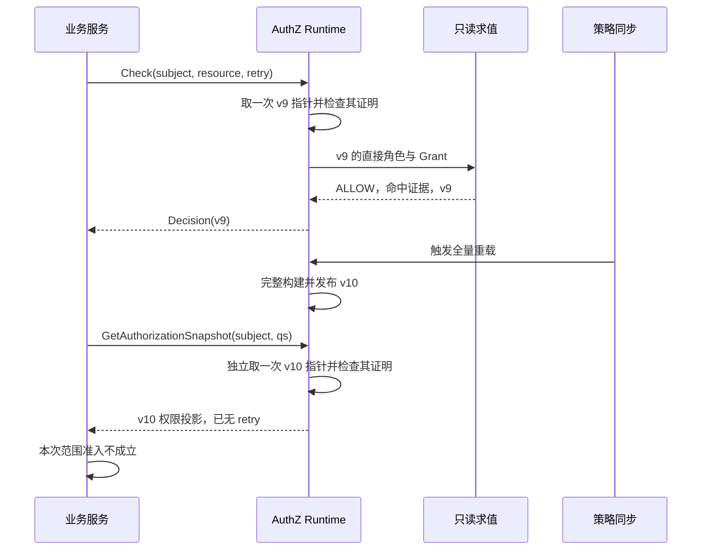

# 关键链路：授权判定与不可变快照

> 状态：已实现 · 2026-10-06 对照当前源码修订；本文拥有判定、单次读取一致性及主体快照投影语义。

## 1. 读取结论：一次使用一份策略，动作与范围分别解释

MySQL 保存 Role、Assignment、PermissionGrant、Resource 与全局 PolicyVersion。Runtime 从一致视图加载这些事实，先构建完整候选，再原子发布不可变快照。Check 在内存中匹配主体直接角色的 Grant，不查数据库，也不加载业务对象；需要公司/门店范围的消费者读取配对权限投影，并执行业务过滤。

这个设计保证一次 Check 或一次 Snapshot 查询内部使用同一份策略，不能保证先后两次调用属于同一版本。应用快照还有自己的 AppName 过滤规则，不能宣称它完整复刻任意 Check。以下三个结果尤其要分清：

| 结果 | 已经知道什么 | 还不能推断什么 |
| --- | --- | --- |
| Check ALLOW，命中一个 Grant | 此次读取的策略中有资源/动作许可 | 对象属于允许公司/门店、用户仍有效，或命中 Role 贡献了全部范围 |
| 某权限条目有 Scope | 贡献该条目的 Assignment 提供了这些公司/门店范围 | 任意其他动作可借用此范围，或对象当前仍在其中 |
| Assignment facts 完整 | 此主体在这份已发布快照内的角色及逐分配事实完整 | 数据库最新提交已加载、全部实例已同步，或调用人获得管理权 |

沿用[领域模型中的现有范围用例](01-领域模型设计.md#3-一个反例说明为什么范围不能先全局合并)：测评员贡献公司1门店10的 retry 和 batch_evaluate；计划管理员另贡献公司1门店20、公司2全部门店的 retry。Check 的一个命中只能解释动作允许；retry 的完整范围需要汇集两个岗位的配对事实，batch_evaluate 则不能借用门店20。若某个 Assignment 没有 Scope，Check 仍可能 ALLOW，但它不贡献数据范围。

## 2. 判定入口：输入校验和事实校验各有位置

正常 gRPC Check 先验证可信服务身份，解析 Subject，拒绝非空旧 ObjectContext，再用 NewRequest 构造请求；REST 路由应用也先解析和构造。构造器检查主体非零、目标资源键与具体动作格式，不认证用户，也不证明用户存在或 active。

DecisionService 只检查 Runtime 已装配并转发 Request；Runtime.Check 不重跑 NewRequest。Request 字段公开，内部直接构造结构体会绕过构造器，因此新增入口必须自己维持输入合同。服务能调用 Check 与被判定用户能操作对象，是两层资格。

| 层次 | 当前承担的校验 | 不能交给它的责任 |
| --- | --- | --- |
| 传输入口 / 路由应用 | 可信调用上下文、Subject 解析、请求构造、旧字段拒绝 | 授权事实是否完整、业务对象归属 |
| MySQL Mapper | 从持久化记录恢复领域对象；拒绝残留条件和资源属性模式等不支持事实 | 当前用户认证、跨表引用整体有效 |
| Snapshot 构建 | 引用、角色保护、目录绑定、Scope 等构建规则 | 重跑所有领域构造器，或替任意自定义 Source 修复坏输入 |
| Evaluator | 只读候选 Grant，匹配资源和动作，产生 Decision | 再查目录、用户状态、Grant 撤销状态或业务对象 |

实际求值按直接 RoleID 升序遍历，每个 Role 内按 GrantID 升序遍历，首个匹配立即 ALLOW；没有匹配才 DENY。这个稳定次序使解释可重复，不表示优先级、最具体模式或更小范围。例如较小 RoleID 的通配 Grant 可以先于另一 Role 的精确 Grant 命中，这是遍历规则的推论，并非一个“最具体优先”策略。

MatchedRole、MatchedGrantID 只给出一个允许依据，不用于计算全部 Scope。Evaluator 也不是完整坏事实验证器：遇到 nil 候选才报错；已经匹配后不会继续检查后面的候选，且不自行核对 IsActive、RoleID 归属或目录绑定。普通 Runtime 路径依靠前面的加载和构建建立这些前提。

具体入口见 [gRPC Check](../../../internal/apiserver/transport/grpc/service/authz/service.go)、[路由请求构造](../../../internal/apiserver/application/authz/authorization/route_decision_service.go)、[DecisionService](../../../internal/apiserver/application/authz/authorization/decision_service.go) 和 [Evaluator](../../../internal/apiserver/domain/authz/authorization/evaluator.go)。服务准入配置由[gRPC/SDK正文](06-关键链路-gRPC服务间授权与SDK.md)维护。

## 3. 两次调用可能跨版本：撤权时序如何解释

以下用例是假设消费者先做 Check、再取范围，并不要求所有业务入口都必须发这两个 RPC：

1. Check 取到 v9，其中主体拥有 retry，返回 ALLOW。
2. 撤销相应 Assignment 的新策略 v10 发布。
3. 随后的 Scope Snapshot 取到 v10，已经没有该许可及范围。
4. 消费者不能拿 v9 的 ALLOW 补回 v10 中缺失的范围，也不能套用另一动作的门店。

Check 和 Snapshot 各自只读取一次 atomic.Pointer，之后使用局部指针。两个读取采用同一套新鲜度规则，但没有绑定为同一份快照。若 v10 在一个已取得 v9 的 Check 求值期间发布，该请求仍可完成 v9 的 Decision；发布新版本不会取消旧读者，也不让旧读者混入新索引。

当前接口没有固定版本读取或跨调用一致性令牌。比较两个 PolicyVersion 能识别变化，不能锁住后续策略或业务状态。如果业务采用 scoped snapshot 判定，应在该份结果中同时匹配当前动作和对应范围，缺失许可或范围就不成立；若用例还要求 Check 与范围读取共享版本，需要另行定义版本约束协议，不能由“都读了 Runtime”推导出来。

即使两个返回版本相同，IAM 快照也不包含业务对象的当前归属。对象在范围检查后转店、岗位在业务提交前撤销，仍有检查与使用的时间窗口；需要提交时重验、对象版本约束或锁的用例，由业务服务设计。IAM 当前未提供跨库统一事务。外部缓存的旧 ALLOW 也不会因为内存指针切换而自动失效。

## 4. 构建与发布：一致来源、候选校验和原子替换缺一不可

### 4.1 一致视图由 Source 建立

当前 MySQLSource 使用只读、可重复读事务，在同一个事务句柄依次读取有效 Role、Assignment、Grant、Resource，最后读取 PolicyVersion。即使加载期间有并发提交，后读版本也属于这个事务视图，不能把旧事实和新版本拼接。非 MySQL 分支使用默认事务，本文不将 MySQL 隔离级别保证泛化到测试数据库或其他 Source。

有效记录有明确过滤：Role、Assignment、Resource 排除 deleted_at 非空行，Grant 还排除 revoked_at 非空行。版本行 id=1 必须存在，读取失败不会自动创建版本。这个视图不读取 User 状态、QS Operator、门店目录或业务对象。

原子指针不能修复 Source 已经提供的混合数据。替换 Source 时，还必须提供构建期间稳定、具有一致版本含义的 Dataset；允许另一个协程同时修改输入，不属于 Clone 能解决的合同。事实变更须遵守[写入与版本事务](03-关键链路-授权写入与受管Assignment.md)，不能期待不推进版本的数据库修改一定被周期版本核对发现。

### 4.2 构建失败拒绝整份候选，但不是所有输入都报错

| 候选事实 | 当前构建行为 |
| --- | --- |
| Role ID为零、名称非法/重复、保护类别非法 | 拒绝 |
| Resource 为空、ID为零、资源键重复 | 拒绝 |
| Assignment 引用未知 Role、Subject 格式非法、显式零 Scope | 拒绝；未配置 Scope 可以保留 |
| 活跃 Grant 引用未知 Role、违反敏感能力保护 | 拒绝 |
| 活跃 Grant 有 ResourceID，但目录不存在或键/动作冲突 | 拒绝 |
| Grant 为 nil 或已撤销 | 跳过，不进入候选索引 |
| Grant 的 ResourceID 为零 | 不做目录绑定核对；仍核对所属 Role 和保护 |
| 新快照版本低于已发布版本 | LoadPolicy 拒绝发布 |

这是 [BuildSnapshot](../../../internal/apiserver/infra/authz/runtime/snapshot.go) 和 LoadPolicy 的具体规则，不能概括为“每一种坏输入都报错”。BuildSnapshot 不重跑每个对象的全部构造校验，也不要求 Dataset.Version 为正数；正常持久化路径的 Mapper、数据库唯一约束和初始化协议承担额外前提。自定义 Source 不能把它当成任意数据的清洗器。

目录绑定的特殊情况还影响请求判定：Evaluator 不使用 EvaluationContext.Resource 做目录存在性检查。一个合法格式但未登记的目标，例如 qs:future:collection:items/read，仍可能被零 ResourceID 的系统 Grant qs:*:*:* + * 允许。这个例子是代码推论；“加载拒绝非法目录引用”不等于“Check 必须先找到目录项”。系统 Grant 的引导与删除边界由[领域模型](01-领域模型设计.md#5-resource-与-grant目录合同在写入和加载时验证)解释。

### 4.3 发布版本和续期证明是不同结果

LoadPolicy 串行执行全量重载：等待重载门禁、读取 Source、构建、检查版本倒退和 context，然后才发布。等待门禁计入超时预算；Check 不等待这个重载门禁，也不访问数据库。首次加载失败使 NewRuntime 返回错误；已有快照后的加载失败保留旧对象，不发布部分候选。

Snapshot 同时保存事实和自己的 verifiedAt。新鲜度确认会复制 Snapshot 头部，更新证明时间，再用 CompareAndSwap 替换原指针；其中事实索引继续共享且只读。若期间另一个发布已经替换指针，针对旧指针的确认不能覆盖新发布。这样旧策略读者不能借新策略的证明时间续期。confirm遇到更高target可不更新，CAS失败也不向Reconcile回传错误；所以Reconcile返回成功不等于本次证明实际续期，读取资格最终由当前快照的证明年龄决定。

| 时间或水位 | 表达什么 | 易混淆之处 |
| --- | --- | --- |
| PolicyVersion | 本次事实视图的全局水位 | 不表示全部实例已加载 |
| LoadedAt | 该次构建开始时记录的时间 | 后续仅核对版本也能续期，加载时间旧不等于过期 |
| verifiedAt | 这份发布所持有的确认时间 | 使用读开始时间，读取耗时消耗证明预算 |
| Decision.EvaluatedAt | 领域Decision的求值时间，当前独立于新鲜度注入时钟 | 不证明策略刚从数据库读取；当前gRPC Check响应不输出它 |
| target | 此实例已获知的最高目标版本 | 获知目标不表示已经得到相应事实 |

例如 v9 原证明在 T0；T30 获知 target=10，全量 Source 仍返回 v9。LoadPolicy 可以成功发布 v9，但沿用 T0 的证明；Reconcile 会报告未达到目标。成功加载、覆盖目标、续期证明不能当成一个状态。旧快照能否继续读取仍取决于证明年龄；默认60秒上限、readiness、事件与对账时序由[多实例收敛](04-关键链路-多实例策略收敛.md)统一维护。

## 5. 主体输出：按应用投影，与跨应用事实有不同用途

当前没有继承，DirectRoles 与 EffectiveRoles 来源相同；对外 roles/direct_roles 保留应用过滤。具体过滤却分成三类，不能从角色名称反推权限：

| 输出 | 过滤与保留规则 | 用途 |
| --- | --- | --- |
| roles / direct_roles | Role.Name 的应用前缀等于 AppName | 应用岗位展示；不表达每次分配的公司范围 |
| permissions | Grant.ResourceKey 的具体应用段等于 AppName | 资源/动作及配对 Scope；按原始键/动作去重、排序 |
| AssignmentFacts | 此主体全部直接角色，按 RoleID 去重；不按 AppName 过滤 | 跨应用持有核对；没有逐分配ID和范围 |
| AssignmentScopes | 此主体每条 Assignment 的 ID、Role、可选 Scope；不按 AppName 过滤 | 区分同一 Role 在多个公司的分配 |
| 本人资料权限 | Runtime 不按应用过滤；REST 只输出 resource/action/mode | 导航展示；REST 不输出 Scope 或策略版本 |

例如 AppName=qs 时，qs:*:*:* 的 Grant 会导出，但 *:*:*:* 因没有具体应用段而被排除；后者仍参与 Check，也可出现在本人权限中。一个全局或其他应用命名的 Role 持有 qs Grant 时，QS 权限可以出现，而该 Role 名称不出现在 QS roles 列表。这是当前投影的边界，不能描述成应用权限列表与 Check 完全等价。

本人资料的 roles 和 permissions 也是两次独立 Runtime 读取；REST 输出经过裁剪，不能把它当成带版本、带范围的服务端准入证明。需要范围的业务用例使用 scoped snapshot，并明确自己的模式匹配和全局通配处理合同。

权限 Scope 只汇集贡献同一原始 (ResourceKey, Action) 的 Assignment，再按公司合并；不把通配 Grant 展开成目录中的每个具体动作。消费者匹配实际资源/动作后，再合并匹配条目在同一公司的范围。范围算法和公司内 all_stores 的含义由[领域模型](01-领域模型设计.md#3-一个反例说明为什么范围不能先全局合并)拥有。

所有权限 mode=UNCONDITIONAL，只说明没有属性条件，不能解释为无限范围。gRPC 输出 scope_contract_version=1；scoped SDK 要求契约版本和正数 PolicyVersion，并校验范围。合法空 Scope 表示不贡献数据访问，缺失/旧契约则不能按当前范围规则消费。SDK 不验证业务公司/门店存在，也不重新认证用户。

内部 Runtime 构建完整 Assignment facts；gRPC 仅在显式 include_assignment_facts、且受管替换准入通过时输出，并要求完整标志。这里的完整性限于这份已发布策略内的该主体，不是最新数据库证明，也不授予撤销权；取完整 facts 不改变 permissions 和 roles 的应用过滤。传输合同与SDK校验细节见[gRPC/SDK正文](06-关键链路-gRPC服务间授权与SDK.md)。

## 6. 不可变的实现依据：隔离所有权，求值按只读协议使用

Snapshot 的索引字段私有，构建时重建集合，查询时返回新的输出集合；但 Go 类型没有把所有对象强制冻结。具体隔离方式如下：

| 对象 | 当前处理 | 保证成立的前提 |
| --- | --- | --- |
| RoleRecord / 角色索引 | 值拷贝并重建名称、保护和直接角色索引 | 字段为值，不暴露可变集合 |
| Resource | Clone 结构和 Actions slice | 构建期间 Source 不并发修改输入 |
| Grant | Clone 结构及非空 RevokedAt 指针 | 不把原始输入 Grant 指针留在索引中 |
| Assignment / Scope | 重建记录集合，复制 Scope 值与顶层指针 | 内部门店slice虽共享，但字段私有，构造和 StoreIDs() 均复制 |
| 查询结果 | 新角色、权限、角色事实及逐分配集合；Scope 顶层副本 | 调用人修改自己的结果不改已发布对象 |

内部 EvaluationContext 借用 Snapshot 的 map 和对象指针，没有每个请求深拷贝整份策略；当前 Evaluator 只读取它们。如果以后引入会修改候选的插件，必须重新审查这条协议，不能仅因类型叫 Snapshot 就假定安全。

全量构建在发布前完成，旧读者继续持有旧对象，新读者得到新对象；旧对象在没有引用后才被回收。这个方案避免多个索引逐项更新时的混合状态，但会使 Dataset、新旧快照在重载期间短时并存。仅续期证明时共享事实索引，避免为不变策略重新分配全部事实。

## 7. 为什么采用全量不可变重建

| 候选方案 | 收益 | 具体代价或缺口 |
| --- | --- | --- |
| 每请求读数据库 | 可在该次事务中取得最新可见 IAM 事实 | 查询延迟、数据库压力及故障依赖；仍不自动统一业务对象视图 |
| 共享可变索引，增量更新 | 可减少重建与分配 | 角色、Grant、分配、范围等索引须整体同步；删除与引用校验复杂，锁可能阻塞读取，返回指针仍需隔离 |
| 当前全量构建后原子替换 | 单次读无数据库依赖；候选完整才发布，失败保留可信旧对象 | 全量加载、校验、排序和内存成本；异步收敛、证明预算与外部缓存合同仍需治理 |

当前 Check 先定位主体直接角色，再遍历这些角色的 Grant，首次匹配结束；它不是恒定复杂度的单次 map 查询。主体快照还要遍历、去重、排序，并为每个权限求配对范围。仓库有[固定小数据集的基准入口](../../../internal/apiserver/infra/authz/runtime/runtime_test.go)，本文未给出绑定运行环境、数据规模的基准结果或容量压测证据，不能把“热路径不查数据库”延伸成任意规模的低延迟保证。

## 8. 失败边界与验证证据

合法请求没有匹配 Grant 是正常 DENY；策略没有可信快照或证明过期是策略不可用，两者不得合并。REST 路由分别表达拒绝和服务不可用，gRPC 保留 Decision 与 Unavailable 的区别。非空 ObjectContext 为 InvalidArgument；SDK CheckObject 直接报退役错误，不发RPC或回退普通 Check。

| 结论 | 现有代码/测试证据 | 证据范围 |
| --- | --- | --- |
| Request 由入口构造；应用只转发 | [请求边界测试](../../../internal/apiserver/domain/authz/authorization/action_boundary_test.go)、[应用转发测试](../../../internal/apiserver/application/authz/authorization/decision_service_test.go) | 格式和分层责任，不证明用户已认证 |
| 首个候选保留命中证据；无匹配正常拒绝 | [Evaluator测试](../../../internal/apiserver/domain/authz/authorization/evaluator_test.go)、[Decision测试](../../../internal/apiserver/domain/authz/authorization/model_test.go) | 覆盖同角色候选次序，未单测跨角色通配/精确优先 |
| 同能力配对范围、跨公司事实和输出隔离 | [Scope测试](../../../internal/apiserver/infra/authz/runtime/scopes_test.go)、[直接角色测试](../../../internal/apiserver/infra/authz/runtime/direct_roles_test.go) | 不证明真实业务对象归属或跨库提交 |
| 失败保留旧快照、版本倒退拒绝 | [Runtime测试](../../../internal/apiserver/infra/authz/runtime/runtime_test.go)、[加固测试](../../../internal/apiserver/infra/authz/runtime/hardening_test.go) | 内存 Source 的加载/发布行为 |
| 证明年龄、读取开始时间、已知目标未覆盖 | [加固测试](../../../internal/apiserver/infra/authz/runtime/hardening_test.go) | 使用假时钟，不能当真实数据库耗时和超时验收 |
| 并发读取及发布、部分输出隔离 | [并发发布测试](../../../internal/apiserver/infra/authz/runtime/hardening_test.go) | 反复发布相同版本/许可；不能据此证明不同策略交替的完整性 |
| 全局通配保留在本人权限 | [本人权限测试](../../../internal/apiserver/infra/authz/runtime/hardening_test.go) | 不等于已测试 Check 与应用投影的全部差异 |
| 完整事实准入、范围契约及不可用语义 | [gRPC测试](../../../internal/apiserver/transport/grpc/service/authz/service_test.go)、[SDK范围测试](../../../pkg/sdk/authz/scope_test.go) | 传输与消费合同，业务过滤另验 |

跨调用 v9/v10 时序、旧确认与新发布的 CAS 竞争、未知目录目标的系统模式匹配，有当前源码依据，尚未找到固定调度的专项测试。MySQL 加载的一致事务见 [MySQLSource](../../../internal/apiserver/infra/authz/runtime/mysql_source.go)；现有 [MySQL加固集成测试](../../../internal/apiserver/infra/authz/integration/hardening_mysql_test.go) 是写入竞争后核对结果，不是加载期间跨 SELECT 并发提交的专项验证。本地替身测试及竞态检查不能替代真实 MySQL、NSQ 多实例或业务验收。

改变读取、过滤、求值或发布协议时，应同时复核本篇、[写入链路](03-关键链路-授权写入与受管Assignment.md)、[多实例收敛](04-关键链路-多实例策略收敛.md)和[gRPC/SDK合同](06-关键链路-gRPC服务间授权与SDK.md)；Runtime 实现通过不代表接入方已经正确执行范围。
