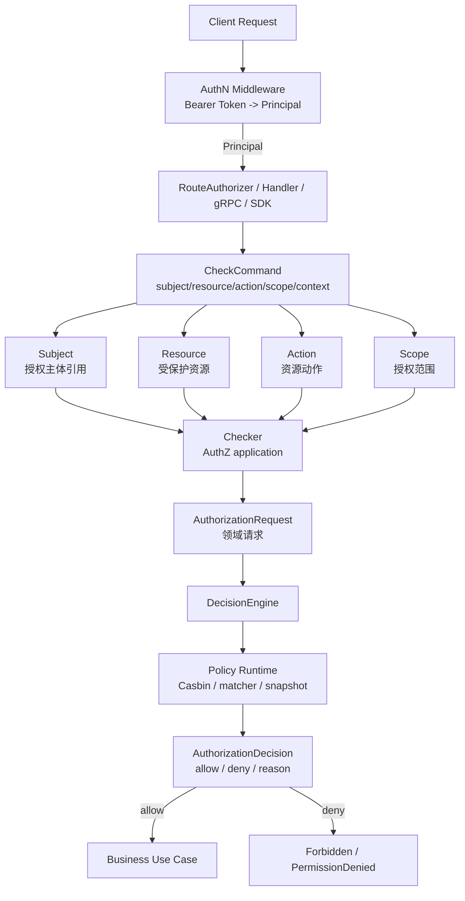
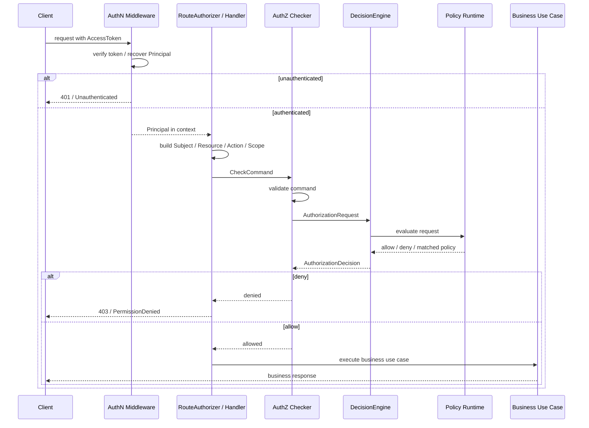

# 关键链路：权限检查 Check

> 状态：待补证据 · 第一版正文，待继续按 `application/authz`、`domain/authz`、Casbin runtime、REST/gRPC middleware、SDK 和测试逐项核对。

---

## 1. 本文回答

本文回答 9 个问题：

- AuthZ Check 链路解决什么问题？
- Check 为什么是读链路，而不是授权写入链路？
- REST / gRPC / SDK / RouteAuthorizer 如何构造 Check 请求？
- `Principal` 如何映射成 AuthZ 的 `Subject`？
- `Resource`、`Action`、`Scope` 如何从路由、业务对象和上下文中构造？
- `Checker`、`AuthorizationRequest`、`DecisionEngine`、Casbin runtime 分别承担什么职责？
- `AuthorizationDecision` 如何表达 allow / deny / reason / policy version？
- Check 与 AuthN Token 验签、Identity ProfileLink、Suggest 可见范围的边界在哪里？
- 修改 Check 链路时应该核对哪些代码和测试？

本文只讲权限检查读链路。
AuthZ 领域模型见 [01-领域模型-Subject-Resource-Action-Scope-Role-Permission-RoleBinding.md](01-领域模型-Subject-Resource-Action-Scope-Role-Permission-RoleBinding.md)；
模块总览见 [00-模块总览.md](00-模块总览.md)。

---

## 2. 30 秒结论

Check 是 AuthZ 的核心读链路。

它只回答一个问题：

```text
某个 Subject，
能不能对某个 Resource，
执行某个 Action，
并满足某个 Scope？
```

核心主线：

```text
RouteAuthorizer / REST / gRPC / SDK
  -> build CheckCommand
  -> map Principal to Subject
  -> build Resource / Action / Scope
  -> Checker
  -> AuthorizationRequest
  -> DecisionEngine
  -> Casbin Runtime / Policy Runtime
  -> AuthorizationDecision
```

最重要的边界：

```text
Check 是读链路，不写授权事实；
Check 返回 AuthorizationDecision，不做自动修复；
Check 不主动修改 runtime；
Check 不校验 password / otp / token signature；
Token 验签成功不等于 Check allow；
Principal 不是 Subject，需要显式映射；
ProfileLink 不是 RoleBinding，只能作为 Scope/condition 的事实输入。
```

如果只记一句话：

> AuthN 先证明“是谁”，AuthZ Check 再判断“能不能做”。

---

## 3. Check 的定位

Check 是授权判断链路。

它用于在业务操作执行前判断：

```text
当前请求主体是否被允许访问目标资源？
```

它不是：

```text
登录认证；
Token 签发；
Token 验签；
Role / Permission / RoleBinding 写入；
PolicyVersion 发布；
Casbin runtime reload；
权限自动修复；
审计补偿。
```

Check 的输入是授权请求，输出是授权决策：

```text
AuthorizationRequest -> AuthorizationDecision
```

---

## 4. Check 总览图



读图规则：

```text
AuthN middleware 只负责恢复 Principal；
RouteAuthorizer/handler 负责构造授权语义；
Checker 编排 Check 用例；
DecisionEngine 负责领域判断入口；
Casbin runtime 是策略执行引擎；
AuthorizationDecision 是 Check 的输出；
业务用例只有在 allow 后才继续执行。
```

---

## 5. 输入与输出

### 5.1 输入

Check 输入通常包含 5 类信息。

| 输入 | 示例 | 说明 |
| --- | --- | --- |
| `Subject` | `user:1001`、`staff:3001`、`service:qs` | 授权主体引用，通常由 Principal 映射而来 |
| `Resource` | `profile:2001`、`assessment`、`role_binding` | 受保护资源 |
| `Action` | `read`、`search`、`create`、`assign`、`revoke` | 授权动作 |
| `Scope` | `self`、`linked_profile`、`organization:10`、`global` | 授权范围或条件 |
| `Context` | tenant、organization、profileLinkFacts、request metadata | 可选，用于条件授权 |

具体字段必须以当前 AuthZ domain、REST/gRPC 契约和 application command 为准。

---

### 5.2 输出

Check 输出是 `AuthorizationDecision`。

通常包含：

```text
Allowed；
Reason；
MatchedPolicy；
PolicyVersion；
EvaluatedAt；
可选 EvaluationContext。
```

对外协议通常映射为：

| Decision | REST | gRPC |
| --- | --- | --- |
| allow | 继续执行业务请求 | 继续执行业务请求 |
| deny | `403 Forbidden` | `PermissionDenied` |
| unauthenticated input | `401 Unauthorized` | `Unauthenticated` |
| invalid check request | `400 Bad Request` | `InvalidArgument` |
| runtime unavailable | `500` 或 fail closed 的 `403` | `Internal` 或 `PermissionDenied` |

具体映射必须以当前 transport 和契约为准。

---

## 6. 标准 Check 时序图



注意：

```text
Check 发生在业务写入或敏感读取之前；
Check allow 才能继续业务用例；
Check deny 不应继续执行业务写入；
Check 失败应默认拒绝或 fail closed，不能默认放行。
```

---

## 7. Principal -> Subject 映射

AuthN 输出的是 `Principal`。

AuthZ 使用的是 `Subject`。

因此必须有显式映射：

```text
Principal.UserID
  -> Subject{Type: user, ID: UserID}
```

也可能存在其他映射：

```text
Principal.StaffID
  -> Subject{Type: staff, ID: StaffID}

service credential
  -> Subject{Type: service, ID: ServiceName}

system job
  -> Subject{Type: system, ID: JobName}
```

关键边界：

```text
Principal 不是 Subject；
User 不是 Subject；
Subject 是授权域中的主体引用；
Subject 不校验 Credential；
Subject 不签发 Token；
Subject 是否允许访问，取决于 RoleBinding/Permission/runtime。
```

---

## 8. Resource / Action / Scope 构造

### 8.1 Resource 构造

Resource 可以来自：

```text
REST route；
gRPC method；
业务对象类型；
业务对象 ID；
管理后台资源名；
SDK 显式参数。
```

示例：

| 来源 | Resource |
| --- | --- |
| `GET /profiles/{id}` | `profile:{id}` |
| `GET /profiles?keyword=...` | `profile` |
| `POST /role-bindings` | `role_binding` |
| `DELETE /role-bindings/{id}` | `role_binding:{id}` |
| `POST /authz/check` | 由请求 body 显式提供 |

注意：

```text
REST path 不等于 Resource；
REST path 需要经过授权语义映射；
同一路由在不同业务上下文下可能构造不同 Resource；
资源实例级授权应带 Resource ID。
```

---

### 8.2 Action 构造

Action 可以来自 HTTP method，但不能简单等同于 HTTP method。

示例：

| HTTP / RPC | Action |
| --- | --- |
| `GET /profiles/{id}` | `read` |
| `GET /profiles` | `search` |
| `POST /profiles` | `create` |
| `PATCH /profiles/{id}` | `update` |
| `DELETE /profiles/{id}` | `delete` |
| `POST /role-bindings` | `assign` |
| `DELETE /role-bindings/{id}` | `revoke` |
| `POST /authz/check` | `check` |

关键边界：

```text
Action 是授权语义；
HTTP method 只是输入来源之一；
不要把 GET/POST/PUT/DELETE 直接写成唯一 Action 模型；
Action 映射应集中维护，避免散落在 handler 中。
```

---

### 8.3 Scope 构造

Scope 可以来自：

```text
请求参数；
Principal/UserID；
Identity ProfileLink 事实；
组织 / 租户上下文；
业务对象归属；
管理后台授权域；
route metadata；
SDK 显式参数。
```

示例：

| 场景 | Scope |
| --- | --- |
| 用户访问自己的资料 | `self` |
| 家长访问儿童档案 | `linked_profile` |
| 员工搜索组织内 Profile | `organization:{orgID}` |
| 系统管理员管理角色 | `global` |
| 租户内业务操作 | `tenant:{tenantID}` |

关键边界：

```text
Scope 不等于 ProfileLink；
ProfileLink 可以作为 linked_profile scope 的事实输入；
Scope 不等于 Suggest ProfileAccessScope；
Scope 计算失败时不应默认放行；
Scope 映射规则应可测试。
```

---

## 9. Checker

`Checker` 是 AuthZ application 层的检查入口。

它负责：

```text
接收 CheckCommand；
校验 Subject / Resource / Action / Scope 是否完整；
补充必要上下文；
构造 AuthorizationRequest；
调用 DecisionEngine；
归一化 AuthorizationDecision；
记录必要 metrics / audit 输入，具体以设计为准。
```

它不负责：

```text
校验 password / otp；
签发 Token；
创建 Role / Permission / RoleBinding；
修改 PolicyVersion；
主动 reload runtime；
直接访问 HTTP request；
直接访问数据库 concrete。
```

---

## 10. AuthorizationRequest

`AuthorizationRequest` 是 AuthZ 领域检查请求。

它应该表达：

```text
Subject；
Resource；
Action；
Scope；
Context；
RequestedAt；
可选 TraceID / RequestID。
```

关键边界：

```text
AuthorizationRequest 是领域输入；
不是 REST DTO；
不是 gRPC proto message；
不是 Casbin policy line；
transport 需要把 DTO/proto 转换成 AuthorizationRequest 或 application command。
```

---

## 11. DecisionEngine

`DecisionEngine` 是授权决策编排入口。

它负责：

```text
接收 AuthorizationRequest；
选择或调用策略 runtime；
执行 runtime evaluation；
解释 allow/deny；
补充 reason / matched policy / policy version；
返回 AuthorizationDecision。
```

它不负责：

```text
维护 Role/Permission 写模型；
发布 PolicyVersion；
消费 Outbox；
校验 Token 签名；
创建 Subject 的身份事实；
执行业务用例。
```

---

## 12. Casbin Runtime / Policy Runtime

Casbin runtime 是 AuthZ 的运行时策略执行引擎或 infra adapter。

它负责：

```text
加载 runtime policy；
执行 matcher；
返回 allow/deny；
暴露 loaded policy version；
支持 runtime reload 或 snapshot 替换。
```

它不负责：

```text
定义领域模型；
替代 Role/Permission/RoleBinding；
替代 PolicyVersion；
替代授权写入用例；
校验 AuthN Credential/Challenge；
签发 Token；
自动修复授权数据。
```

正确关系：

```text
Role / Permission / RoleBinding / PolicyVersion
  -> policy loader / adapter
  -> Casbin runtime policy
  -> AuthorizationDecision
```

---

## 13. AuthorizationDecision

`AuthorizationDecision` 是 Check 的输出。

建议包含：

```text
Allowed；
Reason；
MatchedPolicy；
PolicyVersion；
EvaluatedAt；
可选 EvaluationContext。
```

典型决策：

| Decision | 含义 | 对外响应 |
| --- | --- | --- |
| allow | 授权通过 | 继续执行业务 |
| deny | 授权拒绝 | 403 / PermissionDenied |
| indeterminate | 无法判断 | 默认拒绝或内部错误，具体以策略为准 |
| runtime_unavailable | runtime 不可用 | fail closed，具体以策略为准 |

关键边界：

```text
AuthorizationDecision 是一次 Check 结果；
AuthorizationDecision 不是长期权限事实；
AuthorizationDecision 不是 Token；
AuthorizationDecision 不写 Role/Permission/RoleBinding；
AuthorizationDecision 不应被无限期缓存。
```

---

## 14. Check 是读链路

Check 不应该写授权事实。

允许的副作用通常只有：

```text
metrics；
trace；
audit log；
debug log；
短期本地 cache hit/miss 统计。
```

不允许：

```text
自动创建 Role；
自动创建 Permission；
自动创建 RoleBinding；
自动修复 PolicyVersion；
主动 reload runtime；
修改 User/Profile/ProfileLink；
修改 LoginIdentity/Session/Token。
```

原因：

```text
Check 应可预测、可审计、可缓存、可限流；
授权写入必须走明确的 write use case；
读链路自动写权限容易引入提权漏洞；
runtime reload 应由策略发布链路治理。
```

---

## 15. Runtime 版本与一致性

Check 应尽量明确基于哪个 runtime policy version。

关键字段：

```text
requested policy version，可选；
loaded policy version；
matched policy version；
decision evaluated at。
```

常见策略：

| 策略 | 说明 |
| --- | --- |
| 使用当前 loaded version | 简单，适合多数请求 |
| 要求最低版本 | 写后读一致性更强，但可能导致等待或失败 |
| runtime 不可用 fail closed | 安全优先，默认拒绝 |
| runtime 不可用使用旧 snapshot | 可用性优先，但需要风险边界 |

关键边界：

```text
PolicyVersion published 不等于 runtime loaded；
Runtime reload 失败不能伪装成已生效；
Check 决策最好携带 loaded policy version；
高风险操作可以要求最低 policy version。
```

---

## 16. 与 AuthN 的边界

AuthN 先做认证，AuthZ 再做授权。

```text
Bearer Token
  -> AuthN verify
  -> Principal
  -> AuthZ subject mapping
  -> AuthZ Check
```

边界：

```text
Check 不校验 password；
Check 不校验 OTP；
Check 不验 JWT signature；
Check 不签发 Token；
Principal 不是 Subject；
AccessToken 验签成功不等于 Check allow。
```

错误示例：

```text
只要 token 验签成功就允许访问资源；
在 AuthZ Check 中校验 password；
把 Principal 直接当 RoleBinding；
把 AccessToken claims 中的角色列表当唯一授权事实源。
```

---

## 17. 与 Identity 的边界

Identity 提供身份事实，AuthZ Check 可以使用这些事实作为输入。

典型输入：

```text
UserID；
ProfileID；
ProfileLink；
User status；
组织/业务档案归属，具体以业务模型为准。
```

边界：

```text
User 不是 Subject；
ProfileLink 不是 RoleBinding；
ProfileLink 可以作为 Scope/condition 输入；
AuthZ Check 不修改 User/Profile/ProfileLink；
Identity 不维护 Role/Permission/RoleBinding。
```

示例：

```text
用户读取儿童档案：
Principal.UserID -> Subject{type:user,id:userID}
ProfileID -> Resource{type:profile,id:profileID}
Identity.ProfileLink(userID, profileID) -> Scope/condition input
AuthZ Check -> allow/deny
```

---

## 18. 与 Suggest 的边界

Suggest 的 Profile 搜索可见性可能需要 AuthZ Check。

典型链路：

```text
Principal/UserID
  -> Suggest ProfileAccessScope
  -> candidate profiles from Snapshot
  -> optional AuthZ Check / filter
  -> visible results
```

边界：

```text
Suggest ProfileAccessScope 不是 AuthZ Scope；
Suggest Snapshot 不是权限事实源；
AuthZ Check 不维护 Suggest index；
Suggest 不能只凭 token 存在返回所有 Profile；
Profile 搜索可见性应结合 Principal/UserID、ProfileAccessScope 和 AuthZ Check。
```

---

## 19. 失败边界

| 场景 | 期望行为 | 说明 |
| --- | --- | --- |
| 未认证请求进入受保护 Check | `401 / Unauthenticated` | 先由 AuthN middleware 拦截 |
| Principal 无法映射 Subject | deny 或 invalid argument | 不应默认放行 |
| Resource 缺失 | invalid argument | 授权请求不完整 |
| Action 缺失 | invalid argument | 授权请求不完整 |
| Scope 计算失败 | deny 或 invalid argument | 不应默认 global |
| runtime 未加载 policy | fail closed | 通常拒绝或内部错误 |
| runtime reload 中 | 使用旧版本或等待 | 以策略为准 |
| Casbin matcher 错误 | deny 或 internal | 不应默认 allow |
| PolicyVersion 过旧 | deny / retry / wait | 高风险场景可要求最低版本 |
| AuthZ deny | `403 / PermissionDenied` | 认证成功但授权失败 |

---

## 20. 安全策略

Check 是安全敏感链路。

建议：

```text
默认拒绝，而不是默认允许；
Subject / Resource / Action / Scope 缺失时拒绝；
runtime 不可用时 fail closed，除非明确有降级策略；
禁止在 Check 中自动创建权限；
高风险操作记录 audit；
denied reason 对外克制，对内可观测；
避免把敏感资源属性、完整 token、权限细节泄露到响应中。
```

---

## 21. 常见反模式

| 反模式 | 问题 | 推荐做法 |
| --- | --- | --- |
| Token 验签成功直接放行 | 认证和授权混淆 | 验签后继续 AuthZ Check |
| Principal 直接当 Subject | 认证结果和授权主体混淆 | 显式 Principal -> Subject 映射 |
| GET/POST 直接当 Action | HTTP 与授权语义混淆 | 映射为 read/search/create 等动作 |
| REST path 直接当 Resource | 路由和资源模型混淆 | 映射为业务 Resource |
| Check 里自动创建 RoleBinding | 读链路写授权事实 | 授权写入走 write use case |
| Check 主动 reload runtime | 读链路修改运行时 | runtime reload 由策略发布链路治理 |
| Scope 计算失败默认 global | 提权风险 | 缺失或失败时拒绝 |
| Casbin policy line 当领域唯一事实源 | infra runtime 吞并领域模型 | 领域事实仍是 Role/Permission/RoleBinding |
| Deny 后继续执行业务 | 授权绕过 | deny 必须终止业务用例 |
| Suggest 只凭 token 返回所有 Profile | 搜索可见性绕过授权 | 结合 ProfileAccessScope 和 AuthZ Check |

---

## 22. 代码事实源

| 事实 | 路径 |
| --- | --- |
| AuthZ domain | `../../../internal/apiserver/domain/authz` |
| Subject / Resource / Action / Scope | `../../../internal/apiserver/domain/authz` |
| AuthorizationRequest / AuthorizationDecision | `../../../internal/apiserver/domain/authz` |
| AuthZ application checker | `../../../internal/apiserver/application/authz` |
| DecisionEngine | `../../../internal/apiserver/application/authz`、`../../../internal/apiserver/domain/authz`，具体以代码为准 |
| Casbin runtime / policy adapter | `../../../internal/apiserver/infra` |
| RouteAuthorizer / REST middleware | `../../../internal/apiserver/transport/rest` |
| gRPC interceptor / service | `../../../internal/apiserver/transport/grpc` |
| AuthZ container | `../../../internal/apiserver/container/authz` |
| REST 契约 | `../../../api/rest` |
| gRPC 契约 | `../../../api/grpc` |
| 架构测试 | `../../../internal/pkg/architecture` |

注意：上表中的具体路径需要继续与当前源码核对。如果源码目录已调整，应以代码为准并同步更新本文。

---

## 23. Verify

修改本文后至少执行：

```bash
make docs-hygiene
```

涉及 AuthZ 领域模型：

```bash
go test ./internal/apiserver/domain/authz/...
```

涉及 AuthZ Check 用例：

```bash
go test ./internal/apiserver/application/authz/...
```

涉及 Casbin runtime / policy adapter：

```bash
go test ./internal/apiserver/infra/...
```

具体路径以当前代码为准。

涉及 AuthN/Identity/Suggest 边界：

```bash
go test ./internal/apiserver/domain/authn/...
go test ./internal/apiserver/domain/identity/...
go test ./internal/apiserver/domain/suggest/...
```

涉及 REST/gRPC 契约或 middleware：

```bash
make api-validate
make proto-gen
go test ./internal/apiserver/transport/rest/...
go test ./internal/apiserver/transport/grpc/...
```

涉及 SDK：

```bash
go test ./pkg/sdk/...
```

涉及分层依赖或模块边界：

```bash
go test ./internal/pkg/architecture
```

---

## 24. 本文总结

权限检查 Check 可以压缩成：

```text
Principal / route / request context
  -> Subject / Resource / Action / Scope
  -> CheckCommand
  -> AuthorizationRequest
  -> DecisionEngine
  -> Casbin Runtime / Policy Runtime
  -> AuthorizationDecision
```

最重要的边界是：

```text
Check 是读链路，不写授权事实；
Check 返回决策，不做自动修复；
Check 不主动修改 runtime；
Check 不校验 password / otp / token signature；
Principal 不是 Subject；
ProfileLink 不是 RoleBinding；
Token 验签成功不等于 Check allow；
Deny 后必须终止业务用例。
```

下一篇应继续编写授权写入链路，说明 Role、Permission、RoleBinding 如何创建、更新、撤销，并如何触发 PolicyVersion 与 Outbox。
