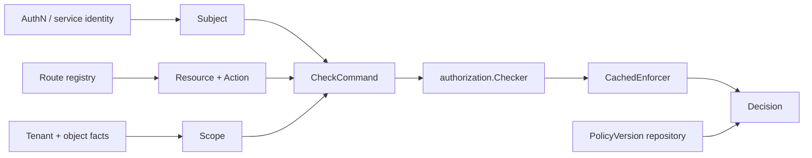

# 权限检查与 Casbin 运行时

> 状态：已实现 · 本文追踪一个 Check 从可信身份上下文到内存 Enforcer 的完整读链路。

## 1. 一次 Check 的责任链



Check 的安全性取决于输入构造，而不只取决于 matcher：Subject、Tenant、Resource、Action 和 Scope 中任一项来自不可信请求，都可能造成 confused deputy。

## 2. 输入从哪里来

- Subject：从已验证 Principal 或服务身份映射；
- Tenant：从经过认证/绑定的租户上下文取得；
- Resource/Action：优先从服务端路由权限注册表取得；
- Scope：由服务端根据对象或来源事实计算；
- 客户端 body/query 只提供业务目标，不能直接成为最终授权元组。

`NewCheckCommand` 对 subject、tenant、四段 resource、具体 action 和 scope 做值对象校验。校验能阻止空值与非法形状，但无法判断调用方是否选择了正确的业务资源，因此注册表和调用点仍属于安全边界。

## 3. Casbin 的运行时投影

当前模型：

```ini
r = sub, dom, obj, act, scope
p = sub, dom, obj, act, scope
g = _, _, _
```

投影规则：

```text
Subject Ref      -> user:123
Role Name        -> role:app.admin
RoleBinding Fact -> g(user:123, role:app.admin, tenant-a)
Permission       -> p(role:app.admin, tenant-a, app:domain:type:*, read, all:*)
```

matcher 要求：

1. Subject 在同一 domain 下拥有 policy role；
2. 请求 domain 等于 policy domain；
3. resource 四段模式匹配；
4. action 具体值被 policy pattern 完整匹配；
5. scope 为 all 或精确相等。

## 4. 为什么用 CachedEnforcer

每次请求直接查询所有 RoleBinding 和 Permission 会让数据库成为授权热路径，还需要在 SQL 中复制继承和 pattern 语义。`CachedEnforcer` 把策略载入内存，以读写锁保护 Check 与 reload，并提供 Casbin 的角色图计算。

代价是运行时策略只是派生副本：写成功不等于所有实例已经加载最新值。系统必须同时维护事实版本、传播事件、reload 健康和过期窗口，详见 [授权写入与多实例一致性](03-授权写入与多实例一致性.md)。

## 5. DB 是事实源，Enforcer 不是

`NewCasbinAdapter` 使用 gorm adapter 从 `casbin_rule` 加载策略，随后关闭 `EnableAutoSave`。应用写链不直接修改某个进程内的 Enforcer，而是事务性写 `casbin_rule`，提交后再 reload。

这条原则解决两个问题：

- 进程重启能从数据库恢复完整策略；
- 多实例不会各自持有无法对账的本地写入。

运行时的 `addPolicyFacts` 等方法存在于适配器内部，但 canonical 写链以 `PolicyChangeCommitter + MySQL AuthorizationFactStore` 为准。

## 6. 判定结果和 PolicyVersion

`CasbinAdapter.Check` 使用 `EnforceEx`：拒绝时返回 default-deny；允许时把命中的 p fact 还原为领域 Permission，使 Decision 带有 MatchedRole/MatchedPermission。

应用 `Checker` 之后尝试读取当前 PolicyVersion 并放入 Decision。版本读取失败不会把一个已经得到的 Casbin 判定改成错误，因而 `PolicyVersion` 是可观测元数据，不是“此判定必定来自该版本”的强一致证明。

原因是 DB version 可能已经提交，而本实例 runtime 尚未 reload；这时 Decision 可能显示新 version，却仍由旧内存策略判定。若要强证明，需要 runtime 自己记录 loaded version，并在结果中返回 `loaded_policy_version`，当前尚未实现该字段。

## 7. 路由授权和业务对象授权

`AuthorizeRoute` 固定 scope 为 `all:*`，适合判断“是否具备调用这个能力”。对象级 Check 允许传入 `origin:<value>`，适合判断“是否对这个来源范围有权限”。

两者不能互相替代：

- 只做路由检查，可能遗漏对象范围；
- 只在业务深处做对象检查，可能让大量未授权请求进入昂贵链路；
- 实际服务可采用路由粗筛 + 对象细筛，但必须避免两层使用不同资源命名。

## 8. 失败策略

| 失败 | 正确语义 |
| --- | --- |
| 无匹配 policy | deny |
| Enforcer 未装配或执行异常 | error，由调用方 fail closed |
| 输入值对象非法 | 拒绝请求，不做宽松归一化 |
| PolicyVersion 读取失败 | 当前实现仍返回判定，但缺少版本元数据 |
| runtime reload 失败 | 保留旧快照，健康状态暴露失败 |

reload 使用 holder 写锁，因此不会让 Check 读到装载一半的策略；失败时底层 Enforcer 是否保持旧快照取决于 Casbin LoadPolicy 行为，但系统至少不会把 reload 失败标记为成功，运维上必须把健康信号视为风险。

## 9. Snapshot 不是 Check

`SnapshotReader` 可返回某 Subject 在某 app 下的 roles、permissions 和 authz version，适合前端能力展示或客户端缓存提示。它按 app 过滤和去重，但不接收具体资源对象上下文。

因此：

```text
Snapshot 用于“我大概拥有哪些能力”；
Check 用于“这次操作是否允许”。
```

前端隐藏按钮不是安全边界，服务端仍必须 Check。

## 10. 备选实现

### 每请求查数据库

一致性直观但延迟和数据库压力高，还需自行实现角色继承和 pattern。适合低 QPS 管理系统，不符合当前通用 IAM 的定位。

### 把完整权限放 JWT

读路径最快，但权限撤销受 token TTL 约束，token 体积和跨应用投影复杂。当前不采用。

### 专用授权服务远程 Check

语义集中，但增加网络跳转和中心服务可用性要求。当前 IAM 自身提供 Check，同时内部以本地 Enforcer 判定；下游服务可按风险选择远程或受控快照。

## 11. 面试追问

### 为什么缓存授权比普通数据缓存更危险？

普通缓存旧值常导致展示过期；授权缓存旧值可能继续放行已撤销权限。必须观测事实版本、加载版本、事件积压和 reload 失败，并明确 fail-closed 策略。

### `EnforceEx` 比 `Enforce` 多解决什么？

它返回命中的 policy 行，使系统能解释匹配角色/权限并审计；只返回 bool 难以回答“为什么允许”。

### PolicyVersion 为什么不等于 loaded version？

前者是数据库事实提交序号，后者是某实例内存快照状态。事件传播和 reload 之间必然存在时间窗口，必须分别观测。

## 12. 事实来源与验证

- Check 编排：`internal/apiserver/application/authz/authorization/service.go`
- 路由权限：`internal/apiserver/application/authz/authorization/route_permissions.go`
- Casbin：`internal/apiserver/infra/casbin`
- 模型：`configs/casbin_model.conf`
- 组合根：`internal/apiserver/container/authz`

```bash
go test ./internal/apiserver/application/authz/authorization ./internal/apiserver/infra/casbin ./internal/apiserver/container/authz
```
