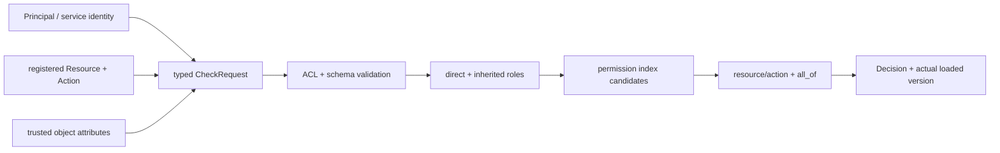

# 权限检查与原生运行时

> 状态：已实现 · 文件名为历史链接保留；权限判定已由 IAM 原生运行时负责，Casbin 只计算内存角色图。

## 1. v3 Check 责任链

所有 v3 RPC 要求服务身份。Assessment 的对象属性首批只允许 `qs-apiserver.svc` 提交。重复、未知或类型错误的属性返回 `InvalidArgument`；不可信身份返回 `PermissionDenied`；缺失的求值属性返回正常拒绝。

## 2. 决策顺序

1. 解析 Subject 在 Tenant 内的直接及继承 Role。
2. 按 Tenant、Role、Resource、Action 查候选 Grant。
3. 执行受控的资源和动作匹配。
4. 按 Resource AttributeSchema 校验对象属性。
5. 对每条 Grant 执行全部谓词。
6. 任一 Grant 命中即 allow，否则返回可解释 deny。

Response 包含 `allowed`、reason/deny code、matched Grant、matched Role、实际加载的 policy version 和缺失属性键。

## 3. 不可变快照和故障语义

快照包含角色图、PermissionIndex、Resource Schema 和已加载版本。reload 只有在全部数据读取、校验和编译成功后才原子发布。失败时旧原生快照继续服务，readiness 降级并记录告警；Check 不会回退到退役数据或自动放行。

## 4. capability 快照

`GetAuthorizationSnapshot` 将可见资源动作聚合为：

- `UNCONDITIONAL`：存在无条件 Grant，可供通用 capability 中间件使用。
- `OBJECT_CHECK_REQUIRED`：只有条件 Grant，仅表示对象级路由候选，必须加载对象后 Check。

条件 Grant 永远不能直接授权列表、搜索或批量操作。
