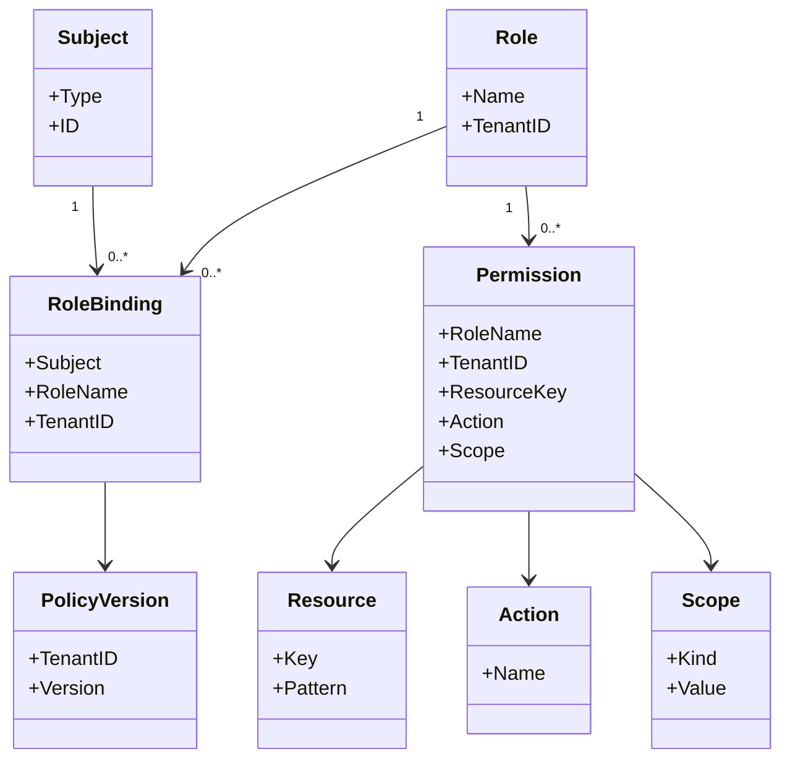

# AuthZ 领域模型图

```mermaid
classDiagram
    class Subject {
        +Type
        +ID
    }
    class Resource {
        +Key
        +Pattern
    }
    class Action {
        +Name
    }
    class Scope {
        +Kind
        +Value
    }
    class Role {
        +Name
        +TenantID
    }
    class Permission {
        +RoleName
        +TenantID
        +ResourceKey
        +Action
        +Scope
    }
    class RoleBinding {
        +Subject
        +RoleName
        +TenantID
    }
    class PolicyVersion {
        +TenantID
        +Version
    }
    Role "1" --> "0..*" Permission
    Subject "1" --> "0..*" RoleBinding
    Role "1" --> "0..*" RoleBinding
    Permission --> Resource
    Permission --> Action
    Permission --> Scope
    RoleBinding --> PolicyVersion
```
