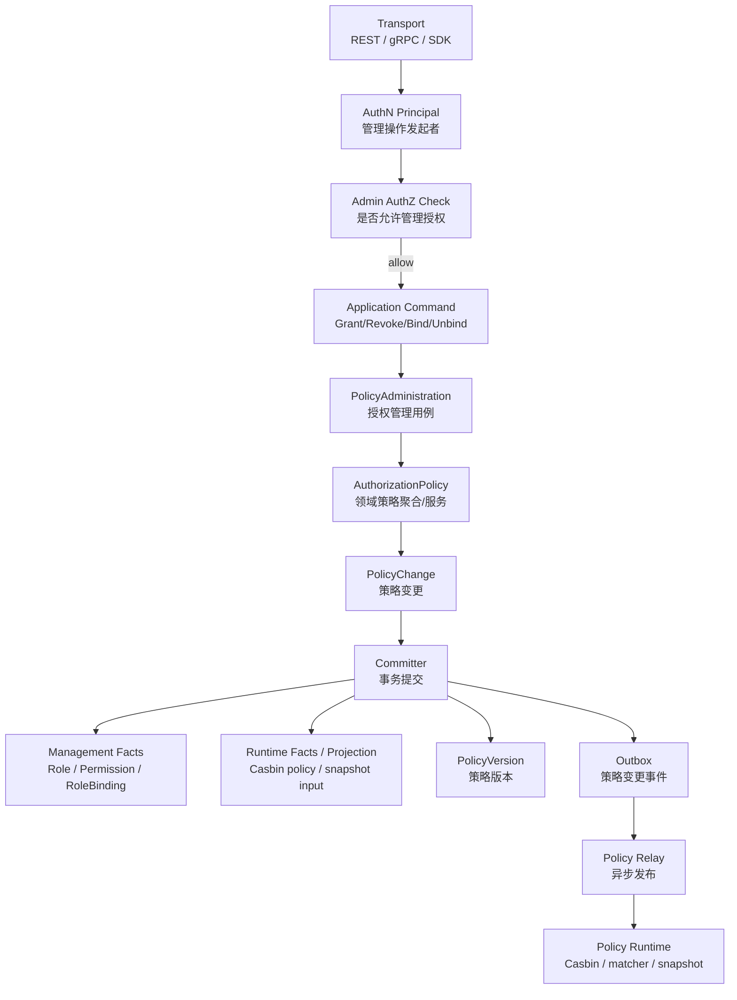
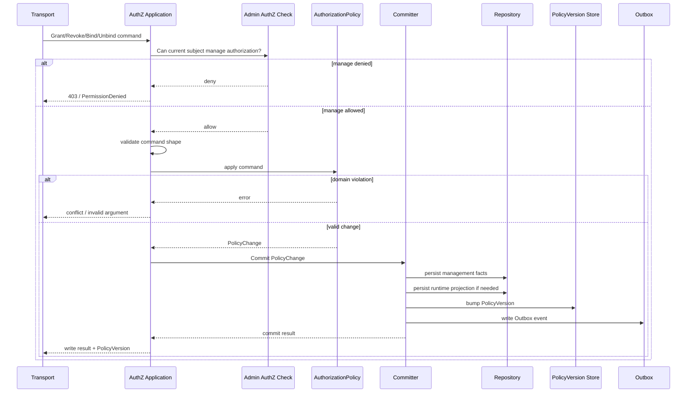
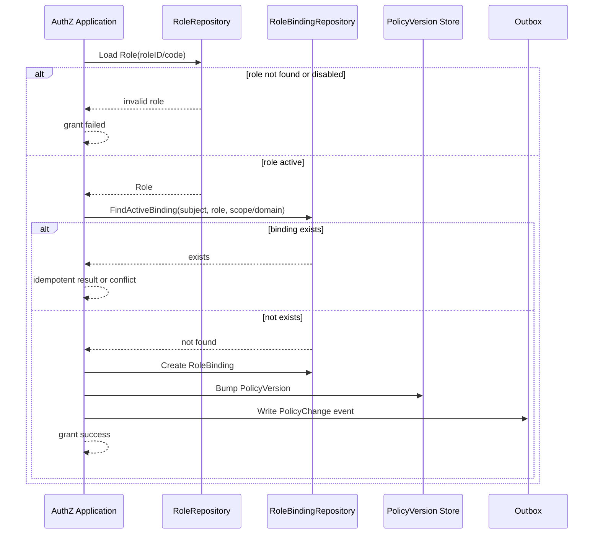
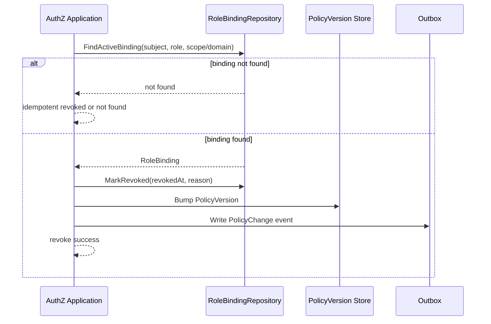

# 关键链路：授权写入 Grant / Revoke / Bind / Unbind

> 状态：规划改造 · 已完成当前事实盘点；正文仍含待实现或尚未收敛的设计内容，不得作为现有能力承诺。

---

## 1. 本文回答

本文回答 10 个问题：

- AuthZ 授权写入链路解决什么问题？
- Grant / Revoke / Bind / Unbind 分别表达什么授权操作？
- 授权写入为什么不是简单 CRUD？
- 管理事实和运行时事实分别是什么，为什么要区分？
- `PolicyAdministration`、`AuthorizationPolicy`、`PolicyChange`、`Committer` 分别承担什么职责？
- Role、Permission、RoleBinding 的创建、更新、撤销如何触发 PolicyVersion 变化？
- 写入成功后如何通过 Outbox 推动 runtime reload？
- 授权写入与 AuthN 登录认证、Identity ProfileLink、Suggest 可见范围的边界在哪里？
- 授权写入的事务、幂等、并发、失败边界如何处理？
- 修改该链路时应该核对哪些代码和测试？

本文只讲授权写入链路。
AuthZ 领域模型见 [01-领域模型-Subject-Resource-Action-Scope-Role-Permission-RoleBinding.md](01-领域模型-Subject-Resource-Action-Scope-Role-Permission-RoleBinding.md)；
权限检查链路见 [02-关键链路-权限检查Check.md](02-关键链路-权限检查Check.md)。

---

## 2. 30 秒结论

授权写入是 AuthZ 的写侧主链路。

它的目标是：

```text
把 Grant / Revoke / Bind / Unbind 等授权管理操作，
转换为一致、可审计、可发布、可被 runtime 加载的授权事实变更。
```

核心主线：

```text
Grant / Revoke / Bind / Unbind
  -> Application Command
  -> PolicyAdministration
  -> AuthorizationPolicy
  -> PolicyChange
  -> Committer
  -> persist management facts
  -> persist runtime facts / policy projection
  -> bump PolicyVersion
  -> write Outbox
  -> runtime reload later
```

最重要的边界：

```text
授权写入不是简单 CRUD；
授权写入不做登录认证；
授权写入不校验 password / otp / token signature；
授权写入不创建 ProfileLink；
授权写入成功不等于 runtime 已加载；
PolicyVersion changed 不等于 Check 立即使用新策略；
Outbox 是可靠传播机制，不等于 exactly-once。
```

如果只记一句话：

> 授权写入负责改变授权事实，权限检查负责读取 runtime 策略做决策，二者之间必须通过 PolicyVersion、Outbox 和 runtime reload 做一致性治理。

---

## 3. Grant / Revoke / Bind / Unbind 的语义

授权写入不是只有“增删改查”。

不同操作表达不同领域语义：

| 操作 | 领域语义 | 常见影响对象 | 说明 |
| --- | --- | --- | --- |
| `Grant` | 授予访问权 | RoleBinding / Permission / direct grant | 给某个 Subject、Role 或授权域增加可访问能力 |
| `Revoke` | 撤销访问权 | RoleBinding / Permission / direct grant | 让既有授权不再生效，通常保留历史 |
| `Bind` | 建立绑定关系 | RoleBinding / Role-Permission binding | 把 Subject 绑定到 Role，或把 Permission 绑定到 Role |
| `Unbind` | 解除绑定关系 | RoleBinding / Role-Permission binding | 解除授权关联，通常软撤销或禁用 |

建议使用方式：

```text
Grant/Revoke 更偏“授予/撤销访问权”的业务语义；
Bind/Unbind 更偏“建立/解除模型关联”的结构语义；
具体 API 可以使用 grant/revoke，也可以使用 bind/unbind，但 domain 语义必须清楚。
```

---

## 4. 授权写入为什么不是简单 CRUD

授权写入会影响后续所有 Check 结果。

它至少涉及 4 类事实：

```text
管理事实：Role、Permission、RoleBinding 等可管理对象；
运行时事实：Casbin/runtime 可加载的策略投影；
版本事实：PolicyVersion；
传播事实：Outbox / PolicyChange event。
```

因此，授权写入不能只做：

```text
insert role_binding;
return success;
```

还必须回答：

```text
这次写入是否违反授权模型不变量？
是否重复授权？
是否撤销了不存在或已撤销的授权？
是否需要生成新的 PolicyVersion？
是否写入了可发布的 PolicyChange？
runtime 什么时候能加载到新策略？
如果发布失败，如何重试和观测？
Check 使用旧版本还是新版本？
```

---

## 5. 链路总览



读图规则：

```text
管理授权本身通常也需要 AuthZ Check；
PolicyAdministration 编排写入用例；
AuthorizationPolicy 承载领域规则和不变量；
PolicyChange 表达一次授权变更；
Committer 负责事务内持久化多个事实；
Outbox 负责后续可靠传播；
runtime reload 是异步后续链路，不应混进写入事务的核心语义。
```

---

## 6. 输入与输出

### 6.1 输入

授权写入输入通常包括：

| 输入 | 示例 | 说明 |
| --- | --- | --- |
| 操作类型 | grant / revoke / bind / unbind | 授权管理动作 |
| 操作发起者 | Principal / Subject | 谁在管理授权，通常需要先做管理权限 Check |
| 目标 Subject | user:1001 / staff:3001 / service:qs | 被授权或被撤销授权的主体 |
| Role | admin / viewer / guardian | 被绑定或解绑的角色 |
| Permission | profile:read:linked_profile | 被授予、撤销或绑定到角色的权限 |
| Scope / Domain | organization:10 / tenant:default / global | 授权生效范围 |
| Reason | manual grant / risk revoke / system init | 审计原因 |
| Request metadata | requestID / traceID / operatorIP | 审计和追踪信息 |

具体字段必须以当前 REST/gRPC 契约和 application command 为准。

---

### 6.2 输出

授权写入输出通常包括：

```text
operation result；
changed facts；
PolicyChangeID；
PolicyVersion；
Outbox message ID；
是否需要等待 runtime reload；
可选 audit reference。
```

注意：

```text
写入成功只能说明管理事实和变更事件已提交；
不能默认说明所有 runtime 已加载；
如果接口需要强一致，应明确等待 runtime loaded version >= expected version；
否则应返回 accepted/pending 或暴露 policy version 给调用方。
```

---

## 7. 标准授权写入时序图



注意：

```text
管理权限 Check 与被管理的授权事实不是同一个概念；
管理权限 Check 不应被省略；
写入事务内应同时提交管理事实、PolicyVersion 和 Outbox；
runtime reload 通常由后续异步链路完成。
```

---

## 8. Grant 链路

### 8.1 链路目标

Grant 表达“授予访问权”。

常见 Grant：

```text
GrantRoleToSubject；
GrantPermissionToRole；
GrantDirectPermissionToSubject，是否支持以代码为准；
GrantDomainScopedRole；
GrantSystemRole。
```

---

### 8.2 Grant Role to Subject

主线：

```text
GrantRole(subject, role, scope/domain)
  -> validate subject reference
  -> validate role exists and active
  -> check duplicate active RoleBinding
  -> create RoleBinding
  -> bump PolicyVersion
  -> write Outbox
```

时序图：



关键规则：

```text
Grant 不应创建不存在的 Role，除非明确是初始化用例；
重复 Grant 应明确幂等或 conflict；
Grant 成功后应推动 PolicyVersion 变化；
Grant 成功不等于 runtime 已加载。
```

---

## 9. Revoke 链路

### 9.1 链路目标

Revoke 表达“撤销访问权”。

常见 Revoke：

```text
RevokeRoleFromSubject；
RevokePermissionFromRole；
RevokeDirectPermissionFromSubject，是否支持以代码为准；
RevokeDomainScopedRole；
RevokeSystemRole。
```

---

### 9.2 Revoke Role from Subject

主线：

```text
RevokeRole(subject, role, scope/domain)
  -> load active RoleBinding
  -> mark revoked / disabled
  -> bump PolicyVersion
  -> write Outbox
```

时序图：



关键规则：

```text
Revoke 应保留审计历史；
Revoke 不删除 Subject；
Revoke 不删除 Role；
Revoke 不修改 LoginIdentity/Session/Token；
Revoke 成功后 runtime 需要加载新策略后才对 Check 生效。
```

---

## 10. Bind 链路

### 10.1 链路目标

Bind 表达“建立授权模型关联”。

常见 Bind：

```text
BindPermissionToRole；
BindRoleToSubject；
BindRoleToDomain；
BindPolicyToRuntimeProjection，是否存在以代码为准。
```

Bind 和 Grant 的差异：

```text
Grant 偏业务语义：授予访问权；
Bind 偏结构语义：建立 Role/Permission/Subject 之间的关联。
```

---

### 10.2 Bind Permission to Role

主线：

```text
BindPermission(role, permission)
  -> validate role exists and active
  -> validate permission exists and active
  -> check duplicate binding
  -> persist role-permission relation
  -> bump PolicyVersion
  -> write Outbox
```

关键规则：

```text
Role 不存在时不能绑定；
Permission 不存在时不能绑定；
重复绑定应明确幂等或 conflict；
Permission 绑定到 Role 后，不代表任何 Subject 获得权限，除非已有 RoleBinding 生效；
Bind 成功后 runtime 需要 reload。
```

---

## 11. Unbind 链路

### 11.1 链路目标

Unbind 表达“解除授权模型关联”。

常见 Unbind：

```text
UnbindPermissionFromRole；
UnbindRoleFromSubject；
UnbindRoleFromDomain。
```

---

### 11.2 Unbind Permission from Role

主线：

```text
UnbindPermission(role, permission)
  -> load active role-permission relation
  -> mark revoked / remove relation according to strategy
  -> bump PolicyVersion
  -> write Outbox
```

关键规则：

```text
Unbind 应保留审计历史或有明确删除策略；
Unbind Permission from Role 会影响所有持有该 Role 的 Subject；
Unbind 不删除 Permission；
Unbind 不删除 Role；
Unbind 成功不等于 runtime 已加载。
```

---

## 12. 管理事实与运行时事实

授权写入至少要区分两类事实。

### 12.1 管理事实

管理事实是领域事实源。

包括：

```text
Role；
Permission；
RoleBinding；
PolicyVersion；
PolicyChange；
审计信息。
```

特点：

```text
可管理；
可审计；
可回放；
可重建 runtime；
应作为领域事实源。
```

---

### 12.2 运行时事实

运行时事实是为了高效 Check 而构建的策略投影。

包括：

```text
Casbin policy lines；
in-memory policy snapshot；
runtime matcher input；
compiled policy；
resource-action-scope index。
```

特点：

```text
服务于快速检查；
可从管理事实重建；
不应成为唯一事实源；
可以缓存或异步加载；
需要标记 loaded PolicyVersion。
```

关键边界：

```text
Casbin policy line 是运行时投影，不是领域唯一事实源；
运行时事实丢失时，应能从管理事实和 PolicyVersion 重建；
管理事实写成功不代表所有运行时事实已刷新。
```

---

## 13. PolicyChange

`PolicyChange` 表达一次授权策略变化。

它可以包含：

```text
changeID；
operation：grant/revoke/bind/unbind；
affected subject；
affected role；
affected permission；
affected scope/domain；
old policy version；
new policy version；
reason；
operator；
createdAt。
```

它用于：

```text
驱动 PolicyVersion；
写入 Outbox；
触发 runtime reload；
审计授权变更；
排查授权延迟或策略漂移。
```

关键边界：

```text
PolicyChange 是一次变更描述；
PolicyChange 不等于 runtime 已加载；
PolicyChange 不替代 Role/Permission/RoleBinding；
PolicyChange 应可追踪和可重试。
```

---

## 14. Committer 与事务边界

授权写入应明确事务边界。

当前事务内提交：

```text
管理事实变更；
Casbin runtime projection 的持久化事实变更；
PolicyVersion bump；
Outbox event。
```

事务外执行：

```text
Outbox relay；
Casbin runtime reload；
跨实例广播；
指标上报；
非强一致审计投递。
```

关键规则：

```text
不能只写 RoleBinding 而不写 PolicyVersion；
不能只更新 runtime 而不更新管理事实；
不能在数据库事务中长时间执行远程 runtime reload；
Outbox 写入应和管理事实在同一事务内；
runtime reload 失败应可重试和可观测。
```

---

## 15. PolicyVersion 与 Outbox

授权写入成功后应推动 PolicyVersion 变化。

主线：

```text
Role/Permission/RoleBinding changed
  -> new PolicyVersion
  -> Outbox PolicyChanged event
  -> Policy Relay
  -> Runtime Reload
  -> loaded PolicyVersion updated
```

关键边界：

```text
PolicyVersion changed 不等于 runtime loaded；
Outbox event published 不等于 runtime loaded；
Runtime loaded version 应可观测；
Check 决策最好携带 loaded PolicyVersion；
高风险写入后如果需要强一致，应等待 loaded version。
```

---

## 16. 幂等与并发

### 16.1 幂等

授权写入要明确幂等语义。

| 操作 | 推荐幂等语义 |
| --- | --- |
| Grant existing active binding | 返回已存在或 conflict，必须明确 |
| Revoke missing binding | 返回已撤销或 not found，必须明确 |
| Bind existing relation | 返回已绑定或 conflict，必须明确 |
| Unbind missing relation | 返回已解绑或 not found，必须明确 |

建议：

```text
管理端 API 更适合返回明确状态；
自动化脚本或初始化场景更适合幂等；
幂等不代表忽略审计；
幂等响应应避免误导调用方以为产生了新变更。
```

---

### 16.2 并发

并发风险：

| 风险 | 说明 |
| --- | --- |
| 两个 Grant 同时创建同一 RoleBinding | 需要唯一约束兜底 |
| Grant 与 Revoke 同时发生 | 需要明确最终状态和版本顺序 |
| Bind 与 Unbind 同时发生 | 需要事务和版本序列保证 |
| Role 修改和 Check 同时发生 | Check 可能使用旧 runtime version |
| PolicyVersion bump 并发 | 需要单调版本或乐观锁 |
| Outbox relay 重复投递 | runtime reload 应幂等 |

建议：

```text
使用唯一约束保护 active binding；
使用事务或乐观锁保护 PolicyVersion 单调递增；
使用 outbox event id 保证 relay 幂等；
runtime reload 以 version 为准，旧版本事件不能覆盖新版本；
Check 返回或记录 loaded policy version。
```

---

## 17. 失败边界

| 场景 | 期望行为 | 说明 |
| --- | --- | --- |
| 管理者无授权管理权限 | 拒绝写入 | 返回 403 / PermissionDenied |
| Subject 无效 | 写入失败 | 不应创建不可解析授权主体 |
| Role 不存在 | Grant/Bind 失败 | 不能绑定不存在 Role |
| Permission 不存在 | Bind 失败 | 不能把不存在 Permission 绑到 Role |
| 重复 Grant | 幂等或 conflict | 以 API 语义为准 |
| Revoke 不存在 binding | 幂等或 not found | 以 API 语义为准 |
| PolicyVersion bump 失败 | 整体失败 | 不能只写管理事实 |
| Outbox 写入失败 | 整体失败 | 防止变更无法传播 |
| runtime reload 失败 | 写入已成功但未加载 | 后续重试和告警，不应伪装成已加载 |
| Casbin policy projection 失败 | 写入失败或标记待修复 | 以事务策略为准 |
| 审计写入失败 | 取决于强一致要求 | 高风险操作建议强一致审计 |

---

## 18. 与 Check 链路的关系

授权写入和权限检查必须分开。

```text
写入链路：改变授权事实
Check 链路：读取 runtime 策略并返回决策
```

关系：

```text
Grant/Revoke/Bind/Unbind
  -> PolicyVersion changed
  -> Outbox event
  -> Runtime reload
  -> Check sees new loaded version
```

关键边界：

```text
Check 不自动创建授权事实；
写入不直接代表当前请求已允许；
写入成功不等于 runtime 已加载；
高风险写后读要关注 loaded PolicyVersion。
```

---

## 19. 与其他模块的边界

### 19.1 与 AuthN

```text
AuthN 证明操作发起者是谁；
AuthZ 判断该发起者是否能管理授权；
授权写入不校验 password / otp；
授权写入不签发 Token；
授权写入不修改 Session / RefreshToken；
Token 验签成功不等于允许修改授权。
```

### 19.2 与 Identity

```text
Identity 提供 User/Profile/ProfileLink 身份事实；
授权写入可以引用 UserID/ProfileID 作为 Subject/Resource/Scope 输入；
授权写入不创建 User/Profile/ProfileLink；
RoleBinding 不是 ProfileLink；
ProfileLink 不应被写成 Permission。
```

### 19.3 与 IDP

```text
ExternalIdentity 不是 Subject；
IDP AppToken 不是授权凭证；
授权写入不管理 provider app secret；
外部身份应先通过 AuthN 变成 Principal，再映射为 Subject。
```

### 19.4 与 Suggest

```text
授权写入不维护 Suggest Index；
Suggest 可见性可以使用 AuthZ Check；
Suggest ProfileAccessScope 不是 AuthZ Scope；
权限变更后是否影响搜索结果，需要由 Suggest 刷新或查询时过滤治理。
```

---

## 20. 安全策略

授权写入是高风险链路。

建议：

```text
所有授权管理操作都应先做管理权限 Check；
默认拒绝，而不是默认允许；
高风险 Grant/Revoke 记录审计；
不允许普通用户直接给自己 grant admin；
Role/Permission/RoleBinding 变更必须有 traceID/operator/reason；
批量授权应限流、可审计、可回滚或可补偿；
对外错误不泄露过多内部策略细节；
内部日志不打印敏感 token 或 provider secret。
```

---

## 21. 常见反模式

| 反模式 | 问题 | 推荐做法 |
| --- | --- | --- |
| 授权写入当普通 CRUD | 忽略版本、发布和 runtime 一致性 | 写入同时治理 PolicyVersion 和 Outbox |
| Grant 不做管理权限 Check | 任意提权风险 | 写入前先 Check 管理权限 |
| RoleBinding 写进 User 表 | 授权事实污染身份模型 | RoleBinding 归 AuthZ |
| ProfileLink 当 RoleBinding | 身份关系和授权事实混淆 | ProfileLink 归 Identity |
| 写入只改 Casbin policy line | runtime 吞并领域事实 | 管理事实是领域事实源 |
| 写入成功后宣称 runtime 已生效 | 策略传播状态不实 | 区分 committed/published/loaded |
| Outbox 失败但返回成功 | 策略变更无法传播 | Outbox 与管理事实同事务 |
| runtime reload 放进长事务 | 性能和可用性风险 | reload 事务外异步执行 |
| Revoke 物理删除无审计 | 难以追踪权限变更 | 软撤销或审计记录 |
| Check 里自动 Grant | 读链路提权风险 | 授权写入必须显式调用 |

---

## 22. 代码事实源

| 事实 | 路径 |
| --- | --- |
| AuthZ domain | `../../../internal/apiserver/domain/authz` |
| Role / Permission / RoleBinding | `../../../internal/apiserver/domain/authz` |
| PolicyVersion / PolicyChange | `../../../internal/apiserver/domain/authz` |
| AuthZ application administration | `../../../internal/apiserver/application/authz` |
| AuthorizationPolicy / PolicyAdministration | `../../../internal/apiserver/application/authz`、`../../../internal/apiserver/domain/authz` |
| AuthZ repository | `../../../internal/apiserver/infra` |
| Policy projection / Casbin adapter | `../../../internal/apiserver/infra` |
| Outbox / policy relay | `../../../internal/apiserver/infra`、`../../../internal/apiserver/application/authz` |
| AuthZ REST transport | `../../../internal/apiserver/transport/rest` |
| AuthZ gRPC transport | `../../../internal/apiserver/transport/grpc` |
| AuthZ container | `../../../internal/apiserver/container/authz` |
| REST 契约 | `../../../api/rest` |
| gRPC 契约 | `../../../api/grpc` |
| 架构测试 | `../../../internal/pkg/architecture` |

注意：上表中的具体路径需要继续与当前源码核对。如果源码目录已调整，应以代码为准并同步更新本文。

---

## 23. Verify

修改本文后至少执行：

```bash
make docs-hygiene
```

涉及 AuthZ 领域模型：

```bash
go test ./internal/apiserver/domain/authz/...
```

涉及 AuthZ 授权写入用例：

```bash
go test ./internal/apiserver/application/authz/...
```

涉及 repository / policy projection / outbox：

```bash
go test ./internal/apiserver/infra/...
```

具体路径以当前代码为准。

涉及 Check、runtime 或 Casbin：

```bash
go test ./internal/apiserver/application/authz/...
go test ./internal/apiserver/infra/...
```

涉及 AuthN/Identity/Suggest 边界：

```bash
go test ./internal/apiserver/domain/authn/...
go test ./internal/apiserver/domain/identity/...
go test ./internal/apiserver/domain/suggest/...
```

涉及 REST/gRPC 契约或 transport：

```bash
make api-validate
make proto-gen
go test ./internal/apiserver/transport/rest/...
go test ./internal/apiserver/transport/grpc/...
```

涉及 SDK：

```bash
go test ./pkg/sdk/...
```

涉及分层依赖或模块边界：

```bash
go test ./internal/pkg/architecture
```

---

## 24. 本文总结

授权写入 Grant / Revoke / Bind / Unbind 可以压缩成：

```text
Grant / Revoke / Bind / Unbind
  -> Application Command
  -> PolicyAdministration
  -> AuthorizationPolicy
  -> PolicyChange
  -> Committer
  -> persist management facts
  -> persist runtime facts / policy projection
  -> bump PolicyVersion
  -> write Outbox
  -> runtime reload later
```

最重要的边界是：

```text
授权写入不是简单 CRUD；
授权写入要同时维护管理事实、策略版本和传播事件；
授权写入不做登录认证；
授权写入不创建 ProfileLink；
写入成功不等于 runtime 已加载；
Outbox 是可靠传播机制，不等于 exactly-once；
Check 是读链路，不应自动写授权事实。
```

下一篇应继续编写策略发布链路，说明 PolicyVersion、Outbox、Policy Relay、Runtime Reload 如何让授权写入最终影响 Check。
