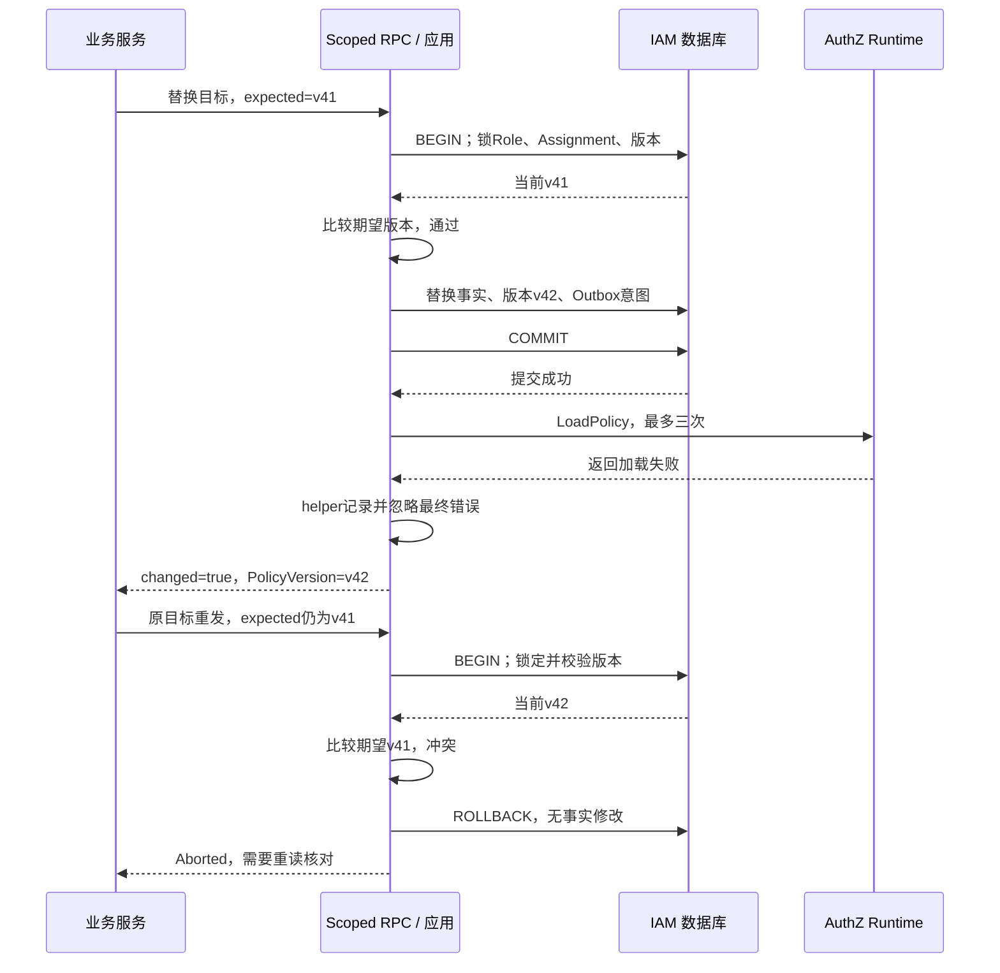

# 关键链路：授权写入与受管 Assignment

> 状态：已实现 · 2026-10-06 对照当前写模型、准入、事务与并发实现修订；本文拥有 Assignment 命令、受管集合及提交边界。

## 1. 写入结论：管理集合、修改范围和提交结果是三个合同

普通顶层调用把授权事实、全局 PolicyVersion 和策略版本 Outbox 意图放在同一个事务内；失败回滚，提交后再尝试重载本实例。受管替换表达“把允许管理的岗位集合调整为目标集合”，公司范围替换再限定实际修改的公司。它们不按记录创建者区分所有权，也不保证写入成功时所有读者都已切换。

先区分几个容易产生不同后果的请求：

| 意图或入口 | 当前写入语义 | 需要注意的范围 |
| --- | --- | --- |
| GrantAssignment / REST grant | 创建无 Scope 的 Subject→Role 分配 | 不能表达公司门店；可能与该 Role 的有范围分配并存 |
| RevokeAssignment / REST subject+role revoke | 删除此 Subject 的这个 Role 的全部分配 | 没有 OrgID 条件，跨所有公司；不是单公司撤权 |
| REST 按 AssignmentID 删除 | 找到具体分配，再删除这一条 | 不等于受管集合替换，也不重新验证 User 存在 |
| ReplaceManagedAssignments | 替换部署策略确定的完整受管无范围集合 | 集合外保留；任何受管有 Scope 关系都会拒绝 |
| ReplaceScopedAssignments | 替换一个公司内完整受管集合及每个岗位的 Scope | 保留其他公司和集合外关系；RPC要求正数期望版本 |

例如 user:100 在公司1门店10、公司2门店20都持有 qs:assessment_operator。清空公司1的 scoped 目标可以保留公司2；增量 RevokeAssignment(assessment_operator) 会同时删除两家公司；按公司1那条 AssignmentID 删除则只定位一条。这由当前删除谓词决定，不能因为接口名都叫 revoke 就认为范围相同。

原始实现见 [Assignment仓储](../../../internal/apiserver/infra/mysql/assignment/repo.go) 和 [命令应用](../../../internal/apiserver/application/authz/assignment/command_service.go)。REST 当前没有集合/Scope替换入口，响应也不输出 Scope 或 PolicyVersion；公司管理与完整退出核对不能只读 REST Assignment 列表。

## 2. 谁能修改：用户管理动作与服务内容准入不同

| 调用通道 | 身份及准入来源 | 应用继续核对什么 |
| --- | --- | --- |
| REST 用户 | 验证 AccessToken；路由检查 assignments 的 grant/revoke 动作；handler从当前UserID生成actor | Guard再检查用户原始管理动作，protected Role还需专门管理权限 |
| 普通 gRPC 服务 | mTLS服务身份、方法ACL；按部署策略限制 Subject类型、Role名称、必要的delegated actor格式 | Guard从可信service上下文重算准入和管理集合，再检查Role保护 |
| 当前 admin 服务 | ACL及配置的 allow_all 增量通道 | 输入、主体写类型、Role存在等规则仍生效；protected管理检查允许 |
| 可信内部应用调用 | 显式设置已认证的用户/service上下文及命令 | 必须维持同样的应用合同；它与公开RPC的内容准入并不等同 |

普通 Grant 和 Replace 在事务回调中调用注入的 SubjectResolver。当前 User 适配器只查稳定主体存在，不要求 active；blocked User 仍能被解析为赋权对象。Revoke 不再解析 User 存在性，按ID撤销依赖能找到已有 Assignment，按subject+Role撤销只核对输入、Role及管理资格。不能把所有写操作都归纳成“锁定并验证有效用户”。

mTLS认证的是 caller service，GrantedBy/ChangedBy 是受约束的审计声明，不会把 Guard 中的服务身份替换成该用户。REST忽略请求中的 granted_by，保存当前UserID的十进制字符串；gRPC当前规则更具体：

| 当前 qs-apiserver.svc 操作 | delegated actor 规则 | 不提供的证明 |
| --- | --- | --- |
| Grant | user: 后缀非空 | 后缀是合法UserID、该人存在或有管理动作 |
| Replace（两种RPC） | 同样的user格式，或恰为service:qs-apiserver.svc | 用户重新认证、用户管理动作已Check |
| Revoke | 不验证actor格式；省略时使用service:caller | 委托用户当前资格 |

Assignment 保存 GrantedBy，没有独立持久化 caller service 或 managed_by 字段；全局版本行保存最新 ChangedBy/Reason。caller用于可信上下文、准入和指标，不能据这些字段宣称已有完整的双身份逐分配审计。物理删除后的旧范围也不会由一个版本通知恢复，历史存储限制由[领域模型](01-领域模型设计.md#6-聚合自身应用事务和历史存储分别保证什么)维护。

当前 admin 的 allow_all 只提供增量内容准入。AuthorizeReplacement 遇到 allow_all 直接拒绝，因此本配置下 admin 的两种公开 Replace 均被拒；include_assignment_facts=true 复用替换准入，也被拒。内部测试使用 admin 应用上下文并明确 M，不能当成 admin RPC 已开放替换的证据。

入口见 [REST handler](../../../internal/apiserver/transport/rest/authz/handler/assignment.go)、[gRPC服务](../../../internal/apiserver/transport/grpc/service/authz/service.go)、[准入策略](../../../internal/apiserver/application/authz/assignmentadmission/policy.go) 和 [Guard](../../../internal/apiserver/application/authz/management/protection.go)。方法与部署配置详见[服务间接入](06-关键链路-gRPC服务间授权与SDK.md)。

## 3. 受管集合 M：可修改的岗位集合，不是授予者归属

令 M 为部署策略授予 caller service 的全部受管Role名称，T 为本次目标。必须 T ⊆ M。当前配置给 qs-apiserver.svc 的 M 是五个名称：

```text
qs:admin
qs:content_manager
qs:assessment_operator
qs:result_reviewer
qs:evaluation_plan_manager
```

M不是本次T，不是全部qs前缀角色，也不是“这个服务曾创建的Assignment”。服务请求只提供T；准入策略返回完整M，Guard再次从部署策略求M，要求命令中集合完全一致，连自行缩小M也拒绝。若Role在M中，即使由REST用户或admin授予，也会进入此次替换；若两个服务配置重叠M，也不是按GrantedBy分开管理。这是代码和配置的组合推论，没有独立的创建者所有权模型。

对无范围关系，结果是：

```text
新角色集合 = (原角色集合 - M) ∪ T
```

假设原集合为 {iam_admin, qs:content_manager}，T={qs:result_reviewer}。结果保留集合外的 iam_admin、移除 content_manager、加入 result_reviewer；响应 direct_roles 只有 result_reviewer。这个基于当前M的例子用于解释合同；现有SQLite测试另用明确的测试M验证保留集合外角色、移除旧目标、增加新目标及no-op。

空T清空M中全部现有无范围关系，不是清空“本次页面展示的一个岗位”。空M非法，allow_all不能推导无边界替换权。普通服务不能用角色管理员用户的权限绕过部署M。

替换会解析、锁定并检查M中的所有Role，包含不在T中的Role。M中的某个Role缺失，或者变为protected而caller不具备保护资格，即使请求空T也可能失败。这样才能核对被删除和被保留的全部受管事实，但部署白名单新增一个名称也会改变现有替换的范围和依赖；应把它当作管理合同变化。

此旧无范围接口只要读到任一受管 scoped Assignment 就拒绝，不能把公司1/公司2岗位合并成一条无范围关系。它也不能作为新Scope RPC返回Unimplemented后的降级方案。

## 4. 按公司替换：目标必须包含该公司希望保留的全部受管岗位

Scope RPC独立传入 Subject、OrgID、目标Role+Scope、ChangedBy和expected_policy_version，应用复用同一个Replace用例的公司分支。以下例子说明目标集合并非“只更新其中一个岗位”：

| 替换前事实 | 公司1目标T | 当前结果 |
| --- | --- | --- |
| 公司1 assessment_operator / 门店10 | assessment_operator / 门店30 | 删除旧分配，新建ID与门店30范围 |
| 公司1 result_reviewer / all_stores | T中省略该岗位 | 删除公司1 reviewer |
| 公司2 assessment_operator / 门店20 | 请求OrgID=1 | 保留公司2旧分配 |
| 公司1 other:auditor，不在M | 不在受管目标中 | 保留集合外事实 |

这是算法推演，现有范围测试覆盖一个Role的公司隔离、范围变化、空目标及重复请求的no-op，并未逐项执行上述四行组合。调用方编辑一个岗位时，仍要构造该公司最终希望保留的完整T，否则其他M内岗位会被移除。

每个目标Scope必须合法且属于请求公司，不能重复同一Role。相同岗位和规范化范围保留原Assignment；改变范围物理删除旧分配再新建，新增只创建、移除只删除。stores在构造时排序去重，比较使用Scope种类和规范化门店列表，不以输入顺序制造变化。

已有任何受管无Scope关系都会要求显式迁移，然后才按公司过滤。不能因请求OrgID=1就把历史org=0关系猜成公司1；增量Grant重新创建的无Scope关系也会触发这个边界。IAM只验证Scope结构，不验证门店真实存在、有效或属于公司。

修改边界是公司内的M，查询和锁定边界更宽。管理仓储读没有deleted_at过滤，Mapper也不保留删除状态，手工软删历史可能参与计划；例如同范围被认为已存在，或同公司同Role多行被拒。这些是当前代码的组合推论，尚未找到专项验证；不能用Runtime已经过滤历史行来推断管理计划也过滤了它们。

## 5. 替换执行：计划依赖事务当前读，唯一键不能替代集合协议

1. 在事务回调中核对Subject存在，按稳定名称解析M。
2. 按RoleID升序锁定M中的全部Role，并用锁定对象检查管理保护。
3. 对该Subject全部Assignment执行ListBySubjectForUpdate；MySQL使用锁定当前读，等待Role锁后读取最新可见的已提交集合。
4. ExpectedPolicyVersion非零时锁全局版本行、校验期望值；负数拒绝，不匹配返回ErrStaleVersion。
5. 根据普通/公司分支计算完整计划，再删除和创建；不能边判断目标边提交。
6. 有变化则只递增一次全局版本、暂存一条策略版本事件；无变化不写事件，普通事务读取得版本。

相同M的Role锁使集合替换按完整计划相互协调，也与使用同Role锁的其他写路径协调；Assignment当前读避免等待结束后仍按旧集合计算。数据库唯一键只保护单条活跃关系，不证明两个并发目标会得到完整的一个集合。

生产active guard唯一键包含(subject_type, subject_id, role_id, org_id, active_guard)，允许同Role在不同公司存在，限制同公司重复活跃分配。MySQL索引、隔离级别、查询谓词或锁顺序改变后，需要真实并发专项；SQLite不执行同样的行/范围锁，不能替代该验证。

代价是锁范围比修改范围大：不同Subject使用同一个M也会争抢Role行；主体Assignment锁涵盖其他公司及集合外关系；有变化的写入还会竞争全局版本行。RoleID排序降低本用例交叉取锁的风险，不能据此宣称全系统无死锁、FIFO或有限等待。

## 6. 期望版本：检测过期编辑，不是请求去重

公开ReplaceScopedAssignments强制expected_policy_version为正数，不匹配映射为gRPC Aborted。应用服务仅在该值非零时做替换前的锁定与期望值比较，直接调用可以传0跳过此检查；有实际变化时Increment仍锁全局版本并条件更新，不能把0解释成“整个用例不锁版本”。

CAS在计划/no-op之前。因此，一个带旧期望版本的请求，即使目标已经相同，仍会冲突。令编辑者A、B都读到v41：A提交公司1范围得到v42；B仍以v41提交，应重读并核对。别的Subject、公司、Role或Grant的版本化写入也能使v41过期，因为这是全局水位，不是Subject+OrgID集合版本。

提交成功后响应丢失也有同样现象：第一次用v41已经提交为v42，客户端原样重发v41将Aborted，不能据第二次冲突判断第一次没提交。客户端需要重读已提交版本及完整分配事实，确认目标是否已实现，再决定是否提交新意图；单独读取更高版本只证明发生了变更，不能证明恰好是自己的请求。

当前没有Assignment替换请求ID与结果回执协议。SDK Assignment包装只是代理RPC，但连接默认配置确实启用全方法gRPC重试策略：maxAttempts=3，状态含UNAVAILABLE、RESOURCE_EXHAUSTED、ABORTED。相同请求的自动重试不会替调用方重读CAS版本；实际是否重试还受gRPC状态、响应元数据及调用方配置影响，本轮未做丢响应网络模拟。接入方不能把默认重试当成写入去重或冲突合并，详见[SDK接入](../../04-接口与SDK/02-Go-SDK与业务系统接入.md)。

## 7. 事务成功与快照收敛：重载失败不会撤销已提交事实

普通顶层调用的顺序是：

```text
BEGIN
  -> 事实校验/锁定/替换计划
  -> 写事实
  -> 递增PolicyVersion
  -> 在相同事务暂存Outbox意图
COMMIT
  -> 尝试本实例LoadPolicy
  -> 返回写入结果；事件与数据库对账推动后续收敛
```

在这个顶层边界内，事实、版本或事件暂存失败会使事务回滚；不能先独立提交删除，再单独提交新增。Outbox将“已提交后应传播”的意图保存在同一数据库事务，relay发送失败延迟传播，不回滚原事实。标准部署的Stager/Relay所有权及确认语义由[Outbox正文](../../03-基础设施/03-事件与Transactional-Outbox.md)维护。

Assignment普通命令和Changed=true的集合替换都调用ReloadRuntimePolicy。它最多调用LoadPolicy三次，失败间隔100ms，context取消可结束等待；最终错误被void包装丢弃。reloader未装配时不执行加载。DB提交成功后，命令仍可能返回成功，PolicyVersion只表示本次写入水位，不表示本实例已加载或其他实例已收敛。

以下是RPC顶层调用的一个具体失败窗口：



无变化的替换不尝试reload。若第一次DB成功而重载失败，随后使用有效的新期望版本重发相同目标，会成为no-op，并不会主动修复Runtime；修复仍依靠同步/对账路径。no-op通过GetCurrent普通事务读返回版本，不能统一称为“响应时最新已提交版本”；MySQL旧读视图的具体调度尚无专项测试。新鲜度和撤权窗口由[多实例收敛](04-关键链路-多实例策略收敛.md)拥有。

### 借用事务必须由宿主决定最终提交或回滚

共享UoW采用Required：有事务上下文就复用，不开保存点，不提交/回滚宿主，也不自动标记rollback-only。若内层删除后创建或Stage失败，宿主吞错再commit，已经执行的部分写入可能被提交；“任一失败都回滚”的保证只能在顶层回调错误传播到事务拥有者时成立。

共享UoW提供AfterCommit，但Assignment应用未注册它，而是在WithinTx返回后即时reload。借用情况下这发生在外层提交之前；标准Runtime Source使用独立读事务，可能读取旧已提交事实。此时方法成功、返回版本乃至本实例加载成功，都不能证明宿主最终commit。宿主必须传播写错误并负责最终事务结局；本篇不把内层回调返回当作AfterCommit屏障。

## 8. 设计取舍：替换、并发编辑和重放各解决一个问题

| 方案 | 得到什么 | 需要承担的成本或缺口 |
| --- | --- | --- |
| 客户端逐次grant/revoke | 接口简单，可表达单项增减 | 中间集合可见、部分失败恢复、跨公司删除边界，以及反复版本/事件 |
| 当前完整M目标替换 | 事务内形成完整受管结果，保留M之外事实，no-op减少版本与事件 | M配置变化会改变可删范围；全M及主体集合锁较宽；没有授予者所有权 |
| 当前Scope替换+全局CAS | 单公司岗位/范围原子调整，识别任何版本化写入后的过期编辑 | 无关主体/公司变化也冲突；不解决响应丢失后的请求结果识别 |
| 候选Subject+OrgID集合revision | 可减少无关编辑冲突，仍保留全局发布水位 | 需定义哪些Role/Grant变化影响集合，增加事务和迁移合同；当前未实现 |
| 候选请求ID+输入指纹+事务回执 | 可识别相同请求重放并返回既有结果 | 需定义保存期、冲突输入和未知提交恢复；不能替代CAS或管理准入 |

如果要按创建服务保留Assignment，需显式拥有者字段、可修改规则及迁移，不能从GrantedBy前缀猜测。若要求公平调度或有限等待，需另行定义排队、取消和超时合同；改变版本粒度本身不会提供公平性。上述候选方案是设计讨论，不作为当前能力。

## 9. 验证证据：事务回滚、锁语义与业务验收分开

| 结论 | 当前证据 | 能证明的边界 |
| --- | --- | --- |
| M之外保留、完整目标、no-op及失败回滚 | [SQLite替换测试](../../../internal/apiserver/infra/mysql/uow/authz/replace_managed_assignments_test.go) | 内存event.Stager替身；不证明标准Outbox落盘 |
| Scope范围变化、空目标保留其他公司、旧版本拒绝 | [领域Scope测试](../../../internal/apiserver/domain/authz/assignment/scoped_replacement_test.go)、[UoW测试](../../../internal/apiserver/infra/mysql/uow/authz/replace_managed_assignments_test.go) | SQLite应用初始范围命令传expected=0，不能当公开RPC强制CAS证据 |
| ID/name授予共享解析器和事务，事件失败不提交 | [Grant应用集成测试](../../../internal/apiserver/application/authz/assignment/command_service_integration_test.go) | 临时SQLite及BootstrapStager/旧测试Outbox；不是生产standard rm_outbox |
| 两个并发非空目标得到完整单目标集合、版本+2 | [MySQL并发测试](../../../internal/apiserver/infra/mysql/uow/authz/replace_managed_assignments_mysql_concurrent_test.go) | 只测旧无Scope替换；主体和事件用替身；需MYSQL_HOST，本轮未执行 |
| 两个Scope写者同expected，只有一个提交范围、版本+1与一条事件 | [MySQL Scope竞争专项](../../../internal/apiserver/maintenance/scopemigrate/scoped_writer_mysql_test.go) | 内部admin应用路径、主体替身与BootstrapStager；需SCOPE_MIGRATION_MYSQL_DSN，本轮未执行，不证明公开RPC或standard rm_outbox |
| 服务M不可伪造、用户原始动作与保护分别核对 | [Guard测试](../../../internal/apiserver/application/authz/management/protection_test.go)、[准入测试](../../../internal/apiserver/application/authz/assignmentadmission/policy_test.go) | 不证明部署每个consumer的完整生效规则 |
| Scoped RPC正数期望、Aborted；完整事实读取准入 | [gRPC测试](../../../internal/apiserver/transport/grpc/service/authz/service_test.go) | 传输合同，不能证明真实编辑者重读与网络丢响应 |
| 三次加载及成功后停止 | [重载helper测试](../../../internal/apiserver/application/authz/policychange/reloader_test.go) | 没有专项串起Assignment提交、加载失败、no-op重试 |
| SDK全方法重试配置可被gRPC接受 | [transport测试](../../../pkg/sdk/internal/transport/dial_test.go) | 配置格式，不证明所有网络失败都会重试或不会重复副作用 |

当前启动ACL/内容约束交叉检查只枚举Grant、Revoke、ReplaceManaged，未枚举ReplaceScoped；不能声称已覆盖所有写RPC。运行时Scope准入仍执行，缺失policy或未配置caller不会因此被放行。相关实现与测试见 [loader](../../../internal/apiserver/infra/authz/assignmentconstraints/loader.go) 和 [loader测试](../../../internal/apiserver/infra/authz/assignmentconstraints/loader_test.go)；既有nil-policy测试直接覆盖三个旧写方法，Scope拒绝由共用helper及当前源码推导。

跨公司增量撤销、手工软删行参与替换、admin allow_all替换拒绝、宿主吞错提交、Scope重复角色目标拒绝、no-op旧版本响应及丢响应重放，已有源码依据，尚未找到完整专项测试。普通Assignment零行revoke仍可能递增版本；重复PermissionGrant撤销和受管替换no-op跳过版本，不能混称所有撤销都幂等。

改动写入协议时，需同时复核[领域模型](01-领域模型设计.md)、[读链](02-关键链路-授权判定与不可变快照.md)、[多实例收敛](04-关键链路-多实例策略收敛.md)、[RPC/SDK](06-关键链路-gRPC服务间授权与SDK.md)及[Scope维护](../../operations/assignment-scope-migration.md)。本文的代码与本地回归证据不替代真实MySQL专项、部署或业务验收。
