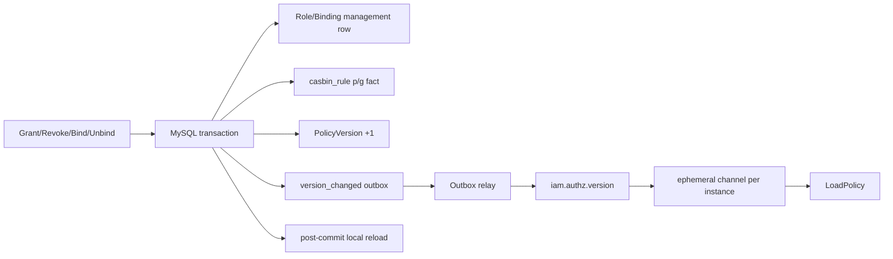

# 授权写入与多实例一致性

> 状态：已实现 · 本文区分 committed、published、delivered、loaded 四种状态，解释为什么授权写成功后不能立刻假定全实例一致。

## 1. 一条写链有两个一致性问题

授权变更需要同时解决：

1. 管理实体、Casbin fact、PolicyVersion 和 Outbox 是否原子提交；
2. 每个运行实例的内存 Enforcer 是否最终加载到新事实。

当前设计：本地数据库强一致，跨实例传播最终一致。



## 2. PolicyChangeCommitter 是事务所有者

Grant/Revoke Permission、Bind/Unbind Role 最终进入 `PolicyChangeCommitter.Commit`。它在 AuthZ UnitOfWork 中按顺序执行：

1. builder 读取事务仓储并构造 `PolicyChange`；
2. 可选 `BeforeFacts` 写管理侧事实；
3. `writeAuthorizationFact` 写 `casbin_rule` 的 p/g fact；
4. 可选 `AfterFacts` 做关联修改；
5. 按 tenant 原子递增 PolicyVersion；
6. stage `iam.authz.version_changed`；
7. 整笔事务提交；
8. 提交后触发本实例 best-effort reload。

`event.Stager` 在事务上下文中写 durable outbox。只要任一步失败，授权事实、版本和事件一起回滚，从根源上避免“策略已改但没有传播信号”。

### 为什么 reload 必须在提交后

若事务未提交就 reload，Enforcer 从另一个数据库连接看不到未提交 fact；更糟的是事务最终回滚而 runtime 已提前放行。当前只在 `WithinTx` 成功返回后 reload。

## 3. 本实例 reload 失败为何不回滚业务写入

事务提交后无法安全“回滚”数据库事实。`ReloadRuntimePolicy` 记录日志/健康状态，但 Commit 返回语义由代码测试明确保护：runtime reload 失败不否定已提交授权事实。

这意味着 API 的写成功表达：

```text
committed = true
```

而不是：

```text
all_instances_loaded = true
```

调用方若需要“新权限已经可用”的强保证，未来必须增加可轮询的 loaded-version readiness，或针对目标实例执行确认 Check；当前既没有 per-tenant loaded-version readiness，也没有全实例 barrier，不能由现有接口获得这一保证。

## 4. Outbox 到每个实例

`configs/events.yaml` 把 `iam.authz.version_changed` 配置为 `durable_outbox`，路由到 topic `iam.authz.version`。Relay 认领 outbox 记录、发布消息并标记状态；失败会重试，因此消费处理必须可重复。

每个 IAM 实例订阅独立 channel：

```text
iam-policy-sync.<hostname>.<pid>#ephemeral
```

不能让所有实例共用一个竞争消费 channel，因为那只会让一个实例收到 reload 信号；授权缓存失效属于广播语义，每个持有缓存的实例都必须收到。

Handler 校验 event type 和 payload，记录 tenant/version 事件时间，然后调用 `LoadPolicy`。重复事件只造成重复全量 reload，结果幂等但有性能成本。

## 5. 四个状态必须分开观测

| 状态 | 证据 | 不能推出什么 |
| --- | --- | --- |
| committed | MySQL fact/version/outbox 同事务成功 | 消息已发布 |
| published | relay 已向 topic 发布 | 每个实例已收到 |
| delivered | 某实例 handler 已记录事件 | reload 成功 |
| loaded | 某实例最近 reload 成功 | 所有实例都同版本 |

当前 runtime health 记录 reload error/time、最近 version event 及 channel。它能发现“收到事件但最近 reload 更早/失败”的异常，但尚未把每个 tenant 的 `loaded_policy_version` 作为强状态保存；因此版本滞后判断仍不完备。

## 6. 一致性窗口与安全方向

策略传播延迟对 grant 和 revoke 的风险方向不同：

- grant 延迟：用户暂时拿不到新权限，影响可用性；
- revoke 延迟：用户暂时仍保留旧权限，影响安全性。

因此授权缓存不能笼统地说“最终一致即可”。对于紧急撤权，可选增强包括：

- 写接口返回 version，目标服务等待自身 loaded version 至少达到该值；
- 高风险 Check 直接读取中心策略或远程 IAM；
- 引入按 tenant 的版本栅栏，检测 runtime 落后时 fail closed；
- 缩短 access path 缓存，但这不能代替事件可靠性。

当前实现采用 durable outbox + 广播 reload + 健康观测，没有实现请求级 version barrier。

## 7. 为什么不直接通过消息传完整策略

版本事件只携带 tenant/version，实例收到后从数据库全量 `LoadPolicy`。优点是消息可小、可重复，数据库仍是唯一事实源，不需要处理消息乱序下的增量合并。

代价是每次变更都可能全量 reload，策略量大或变更频繁时成本上升。可演进为按 tenant/增量加载，但必须先解决 Casbin adapter 的原子快照替换、缺消息追赶和顺序校验。

## 8. Outbox 能保证什么

Outbox 保证“数据库事务提交则事件记录也存在”，并在 relay 重试下趋向至少一次发布。它不自动保证：

- broker 永不丢消息；
- 消费者恰好一次处理；
- 所有实例同时完成 reload；
- shutdown 时不会留下未处理积压；
- 业务已经观测到新策略。

因此 event ID/幂等处理、积压监控、dead-letter/失败治理、优雅关闭顺序仍属于完整方案。基础设施通用语义见 [事件与 Transactional Outbox](../../03-基础设施/03-事件与Transactional-Outbox.md)。

## 9. 面试追问

### 为什么“写 DB 后发消息”会丢通知？

进程可能在 commit 与 publish 之间崩溃。Outbox 把业务事实和待发事件写进同一事务，再由独立 relay 重试，关闭这个双写窗口。

### 为什么每个实例要独立订阅 channel？

这里的消息不是一个只能执行一次的任务，而是所有缓存副本的失效通知。竞争消费只更新一个副本，广播才符合语义。

### reload 失败时写接口应失败吗？

提交前的 reload 错误应阻止提交；但当前 reload 发生在提交后，事实已不可逆地成功。返回“事务失败”会诱导调用方重试同一变更并混淆结果。更准确的做法是承认 committed、告警并等待传播修复。

## 10. 事实来源与验证

- 事务编排：`internal/apiserver/application/authz/policy/committer.go`
- UoW：`internal/apiserver/application/authz/uow`、`internal/apiserver/infra/mysql/uow/authz`
- fact store：`internal/apiserver/infra/mysql/casbinrule`
- 事件配置：`configs/events.yaml`
- 消费：`internal/apiserver/application/authz/policysync`、`internal/apiserver/container/authz/policy_sync.go`
- runtime health：`internal/apiserver/infra/casbin/runtime_health_state.go`

```bash
/Users/yangshujie/.gvm/gos/go1.25.12/bin/go test \
  ./internal/apiserver/application/authz/... \
  ./internal/apiserver/infra/mysql/uow/authz \
  ./internal/apiserver/infra/mysql/casbinrule \
  ./internal/apiserver/infra/messaging \
  ./internal/apiserver/container/authz
```
