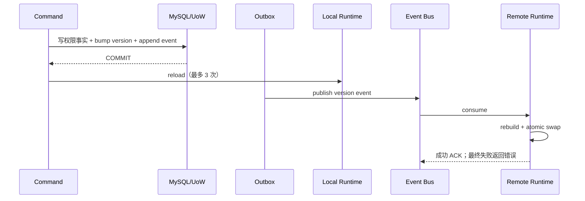

# 关键链路：多实例策略收敛

> 状态：已实现 · 本文区分事务提交、多实例收敛、数据维护与生产验收四类证据。

## 结论

AuthZ 使用“数据库事实 + 策略版本 + Outbox 事件 + 不可变快照”实现多实例最终收敛。事务原子性不等于所有实例瞬时一致；配置、消息重试、版本滞后和部署后验证共同决定撤权是否可靠。

对收敛的正确理解是一条单调目标版本链，而不是请求级 barrier：

```text
V(n) 事实提交
  -> 通知每个实例“有新版本”
  -> 每个实例从 MySQL 重建完整快照
  -> 已加载版本追上数据库版本
```

事件不携带完整 policy delta，消费方也不在旧快照上做可变 patch。它只是重建信号，因此重复、乱序或跳过中间版本不会要求按顺序回放每个 delta；实例始终重读当前权威事实。

## 提交与发布链



Outbox 的“事件已发布”只说明消息离开数据库队列，不单独证明每个实例已经加载目标版本。

## 四类状态不能混为“已生效”

| 状态 | 可由什么证明 | 仍然不能证明 |
| --- | --- | --- |
| 事实已提交 | command 成功 + DB 事实/version/outbox | 当前进程已切换 |
| Outbox 已发布 | relay 状态/消息 ACK | 所有订阅实例已处理 |
| 单实例已加载 | 该实例健康详情的 loaded version | 其他实例已加载 |
| 集群已收敛 | 数据库目标版本与全部存活实例版本对齐 | 部署 SHA/业务样例必然正确 |

“撤权成功”是安全敏感结论。除了版本收敛，还应在至少一条真实请求链上验证原允许动作已变为拒绝。

## 本地与远端 reload

- 当前写实例提交后立即尝试 reload。
- 本地 reload 最多 3 次，固定间隔 100ms。
- 其他实例消费策略版本事件后 reload。
- 事件处理器最终失败会返回错误，保留消息层重试机会。
- 新快照完整构建成功后才原子替换旧快照。

事件 topic 为 `iam.authz.version`，event type 为 `iam.authz.version_changed`。每个进程使用由 hostname + PID 组成的
`iam-policy-sync.<host>.<pid>#ephemeral` channel，使每个活跃实例都能收到重建信号，而不是同一消费组只有一个实例处理。

事件处理先记录收到的 Tenant/version/时间，再 reload。载荷无法解析、Tenant 空或 version 非正数会直接失败，不会转成“已消费但没有做任何事”。

需要同时观察数据库最新版本和各实例当前版本。仅凭请求返回成功、Outbox ACK 或 readiness 200，不能证明所有实例已经收敛。

## 关键配置

| 配置 | 作用 | 风险 |
| --- | --- | --- |
| `grpc.authz-assignment-constraints-file` | 限制服务可管理的 Assignment | 缺失时写 RPC 行为不对称 |
| `grpc_assignment_constraints.yaml` | 服务、RPC 与角色范围约束 | 配置遗漏会拒绝 Replace 或扩大写入面 |
| events 配置 | 策略版本事件发布/订阅 | 错配会导致远端实例滞后 |
| MySQL | 权限事实和版本 | 不可用时不能构建新快照 |

开发与生产配置都显式引用 Assignment constraints 文件；默认空值不能作为安全生产配置。

### 启动时必须装配的能力

AuthZ 不是某个 handler 被调用后才懒加载的附件。组合根需要在启动阶段完成：

1. MySQL Source 与 immutable-snapshot Runtime 创建；初始 `LoadPolicy` 失败时 Runtime 无法构建。
2. REST `RoutePermissionChecker`、gRPC decision/snapshot service 和 Identity/Suggest 所需查询能力注入。
3. Assignment constraints 文件加载并与 gRPC ACL 配合。
4. policy sync subscriber 启动并注册进程级 ephemeral channel。
5. runtime health reporter 接入全局 readiness。

仅有 `/api/v3/authz/health` 模块局部路由可访问，不能代替组合根对 runtime、subscriber 和依赖的完整检查。

## Bootstrap 与数据不变量

当前 bootstrap 提供：

- 平台域全局管理所需通配 PermissionGrant；
- Tenant 管理角色的明确 Resource/Action Grant；
- Suggest profile list 与 mobile search 等明确能力；
- AuthN JWKS、Session 管理和运维路由所需能力。

这些是当前数据基线。代码不会自动保证生产库始终只存在这一种平台全局授权方式，因此发布后仍需数据校验。

Resource catalog 是全局数据，Grant 则按 Tenant 存在。当 Resource action/schema 变更影响多个 Tenant 的活跃 Grant 时，command 需要递增所有受影响 Tenant 的
PolicyVersion，而不是仅递增发起管理请求的 Tenant。这是全局 catalog 与 Tenant 策略之间的关键边界。

## 历史切换与当前收敛工具

两类工具必须区分：

- 历史 AuthZ v2→v3 cutover：一次性模型迁移，已经退役；旧命令、旧 workflow 和兼容路径不应恢复。
- 当前 `iam-maintenance authz-v3-converge`：面向现行 v3 模型的语义收敛与证据工具，提供 preflight、apply、verify、evidence 阶段。

`authz-v3-converge` 不是旧 cutover 的新名字，也不意味着可以绕过正常 migration。它用于校验和收敛当前模型数据，工作流位于
`.github/workflows/authz-v3-converge.yml`。

### 现行收敛工具的安全边界

`authz-v3-converge` 不是通用的“修复所有 AuthZ 数据”脚本。它对一个明确的 source state 和 target state 做可证明收敛：

- preflight 计算对象计数、引用完整性、计划变更、blocker 与 state hash；
- apply 必须提交 preflight 产生的 64 位精确 source hash，并输入完整确认词 `APPLY_AUTHZ_V3_CONVERGENCE`；
- 执行期使用 MySQL named lock，且 apply 前重新校验 source state，防止用过期 preflight 对新数据下手；
- verify 对目标计数、关系和策略版本做后置检查；
- evidence 生成不包含数据库密钥的可审计输出。

生产 workflow 在运行容器中执行前还会比较已部署镜像标签与 workflow commit SHA。这使“对哪一版代码的数据契约做收敛”不再是隐含假设。

## 生产证据边界

仓库中保留的生产验收记录绑定历史 SHA、workflow run 和当时数据库状态。后续代码重构不会自动继承这些结论。

当前 HEAD 要声明“已发布并验收”，至少需要：

1. 精确 commit SHA 与构建产物；
2. CI/测试结果；
3. 部署目标与完成记录；
4. `/healthz`、`/readyz` 和依赖连通性；
5. 策略版本/快照收敛与关键授权样例；
6. `authz-v3-converge verify/evidence` 或等价数据证据。

只通过仓库门禁，最多证明代码和选定契约一致，不能证明生产数据库与所有运行实例一致。

## 故障矩阵

| 故障点 | 当前行为 | 安全/可用性影响 | 应观察的证据 |
| --- | --- | --- | --- |
| 事实事务回滚 | 事实/version/outbox 全部不提交 | 旧权限保持 | command 错误、DB 状态 |
| Outbox relay 暂时失败 | 记录保留，后续再 dispatch | 远端实例收敛延迟 | pending/retry/last error |
| subscriber 未启动 | 当前进程收不到事件 | 长期使用旧快照 | 启动日志、channel、readiness |
| 事件载荷无效 | handler 返错 | 该消息不被当成成功 | 消息重试/DLQ、handler error |
| MySQL 可读但数据不可建照 | reload 失败，保留旧快照 | 撤权窗口延长 | reload failure、runtime health |
| 单实例事件处理失败 | 最多 3 次尝试后返错 | 其他实例可能已是新版本 | per-instance loaded versions |
| 进程重启 | 创建新 ephemeral channel，启动时从 DB 全量建照 | 不依赖离线期间每条事件重放 | startup LoadPolicy 与当前 version |

## 健康与指标如何解读

runtime 记录最后 reload 结果、时间与耗时，也记录最后收到的 Tenant/version/event time 与已加载版本映射。全局 readiness 会把 reload health 作为 AuthZ runtime
组件状态之一。

Prometheus 指标包括：

- `iam_authz_native_reloads_total{result}`；reload 成功/失败次数。
- `iam_authz_native_reload_duration_seconds`；数据读取、校验、构建与原子切换的总耗时。
- `iam_authz_native_loaded_policy_version_max`；活跃快照中最大 Tenant version。
- `iam_authz_native_policy_version_lag_max`；运行时已观察事件与已加载版本之间的最大滞后。

后两个 gauge 为避免 Tenant 高基数而没有 Tenant label，因此只适合告警“可能滞后”，不能用来对单个 Tenant 做精确证明。要验证集群收敛，应同时读取每个存活实例的 health details。

## 运维验证建议

发布前：

- 校验 Assignment constraints 配置可加载；
- 运行 migration 与 bootstrap 契约测试；
- 运行 `authz-v3-converge preflight`；
- 验证新增 Resource/Action 已进入 permission catalog。

发布后：

- 对比数据库策略版本与所有实例快照版本；
- 验证普通租户、平台管理者、无权限主体和条件 Grant；
- 验证撤权后所有实例拒绝；
- 保存 verify/evidence 输出，并绑定部署 SHA。

### 撤权专项验证

撤权比授权更敏感，因为旧快照会延长访问权。一次可信验证应完成：

1. 撤销前用固定 Subject/Tenant/Resource/Action 得到 ALLOW，记录 matched Grant/Role 和 policy version。
2. 执行 Revoke，记录返回的 committed policy version。
3. 举全部存活实例，等待其 loaded version 不小于目标版本，且 reload health 正常。
4. 对每个实例或经负载均衡的足够样本重复 Check，确认已 DENY。
5. 保存数据库版本、实例版本、请求结果、部署 SHA 和时间窗口。

如果只完成第 2 步，它只是写入验证，不是撤权收敛验证。

## 当前已知风险

- 同一 Subject 的并发 `ReplaceManagedAssignments` 尚无 MySQL 并发线性化证明。
- constraints 缺失时增量与批量 Assignment 写入失败行为不一致。
- 平台域全局放行边界依赖数据基线，而非强制代码不变量。
- reload 失败期间可能继续使用旧快照，撤权窗口需要指标和告警约束。

## 设计取舍

### 为什么不发完整 policy delta

delta 可以减少每次全量加载，但会要求消费方严格处理顺序、去重、缺口回放、版本分叉和快照修复。当前用 version signal + full rebuild 把正确性优先级放在增量性能之上。

### 为什么不做同步全实例 barrier

同步 barrier 可以让写请求等待所有实例确认，但会把某一失联实例变成整个管理面的可用性瓶颈，还需要可靠实例成员视图。当前选择最终收敛，同时要求撤权路径有滞后告警和严格验证。

### 为什么保留旧快照

直接清空快照能更严格 fail closed，但一次数据污染会让所有授权请求不可用。保留旧快照选择了请求可用性与版本内部一致，代价是撤权延迟。这个取舍只有在 reload 失败被快速告警和处置时才成立。
