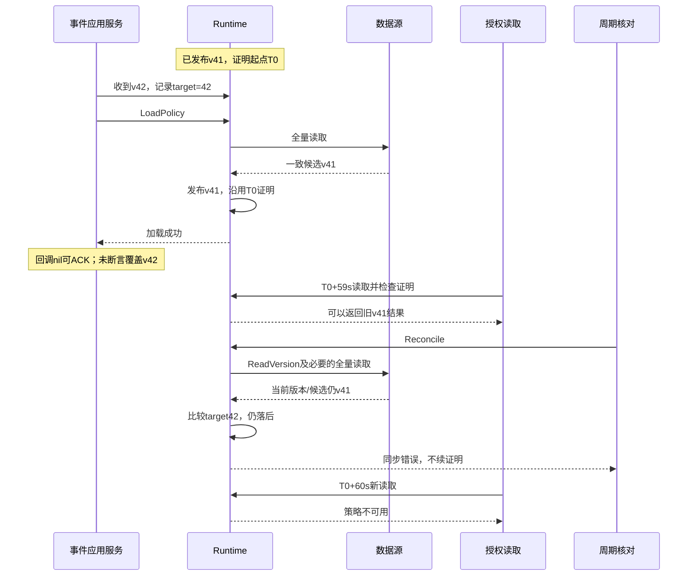

# 关键链路：多实例策略收敛

> 状态：已实现 · 2026-10-06 对照当前源码深化；版本推进、快照加载、证明续期、就绪与业务验收分别取证。

## 1. 先回答撤权何时生效

假设公司1撤销了用户的某个岗位，数据库提交全局版本42。写入实例可能已经使用v42，另一实例仍使用v41；写入成功、Outbox发布成功、事件回调成功，都不证明后者已经停止返回旧ALLOW。

当前方案允许有预算的异步收敛：通知促使实例重载，默认每10秒的数据库版本核对补偿漏通知；授权读取只使用完整不可变快照。读取入口检查这份快照的确认年龄，默认达到60秒时返回策略不可用。已知更高目标并不立即禁止旧快照读取，注册失败也不直接改变这个读取门禁。

这个预算从数据库证明所依据的读取开始时刻计算，不从撤权提交时刻、事件到达时刻或最近重载结束时刻计算。它约束**新进入门禁的IAM读取**；已通过检查的在途求值、业务服务的旧权限缓存和已经开始的操作，需要另外定义时限。

写入事务、Required借用事务及本地reload错误语义由[授权写入](03-关键链路-授权写入与受管Assignment.md)拥有；单次快照内部一致性与跨调用版本差异由[授权判定](02-关键链路-授权判定与不可变快照.md)拥有。本文解释各实例怎样接近数据库事实，以及证据不足时怎样停止接受新的授权读取。

## 2. 四个状态不能合成“同步成功”

| 状态 | 当前对象/行为 | 能证明什么 |
| --- | --- | --- |
| committed version | 数据库id=1的PolicyVersion，与受治理事实及Outbox同事务提交 | 持久写入水位，不是任一实例已加载 |
| loaded version | 当前原子Snapshot的version | 该实例已发布一份相应版本的完整视图 |
| target | 已观察事件与数据库版本的最大值 | 此实例知道应追到哪里；不会因旧事件回退 |
| verifiedAt | 与Snapshot同一原子值发布的确认时间 | 该份策略的证明起点，读取是否过期由它决定 |

loaded达到某次写入版本，只证明该实例至少加载过这个水位。若之后又观察到更高target，或者证明已过期，单看loaded仍不足以判断读取资格。相反，长时间没有事实变化时，周期核对可以只更新verifiedAt，不重建事实；加载时间很旧也可以保持可读。

确认协议依赖一个明确的写入约束：**所有会影响授权投影的事实变化必须同步推进全局版本**。若直接SQL删除Assignment却不递增版本，ReadVersion仍等于内存水位，Reconcile会走仅确认分支，不重新查询分配；旧权限可能持续获得新证明。这是当前算法的代码推论，不是本轮运行过的故障演练。周期核对不是事实校验和，维护必须使用有版本/事件合同的写入入口。

## 3. 通知负责催促，数据库负责事实

### 3.1 通知不携带权限增量

事件类型为`iam.authz.version_changed.v2`，topic为`iam.authz.version.v2`；二者不是同一个字符串。业务载荷携带全局version，消费者从MySQL重新取得Role、Assignment、Grant、Resource及版本，不能用消息直接增加或删除内存权限。

[PolicyPublication.Handle](../../../internal/apiserver/application/authz/policypublication/service.go)的顺序是：

1. 非空event_type若不是版本事件则忽略；解析载荷，拒绝非正数version。
2. 记录该版本到target，并记录此次本地接收时间。
3. 如果当前loaded已覆盖**本事件版本**，直接返回；否则调用重载helper。
4. helper最多调用3次LoadPolicy，失败之间等待100ms；最终错误返回给消息SDK。

最高target用于防止证明在未覆盖已知变化时续期；它不是一个将所有等待通知压成一次加载的调度队列。去重判断发生在重载前，两个并发回调都可能先发现loaded不足，之后排队各自做一次全量加载。加载入口串行、版本单调发布，不能据此宣称每个目标只加载一次。PolicyVersionLoaded只比较水位，不检查fresh；已过期快照对旧通知也可能直接返回成功，但这个通知不能续证明。

事件重排也有两个不同含义：target保持最大值，但健康详情的last_event_version记录最近收到的事件，收到旧事件时可以降低；不能把这个字段当最高目标水位。事件时间是本地接收时间，不是数据库commit时间。

### 3.2 回调成功与覆盖通知版本不同

LoadPolicy校验一份候选并成功发布，并不承诺达到所有已知target。当内存v41、target42，Source仍给出v41时，它可以成功发布同版本对象，同时保留旧verifiedAt。事件handler没有在加载后再检查目标覆盖，因此会返回nil；SDK可按回调成功ACK。Reconcile则会在需要加载的分支再次检查lag，仍落后时返回错误。

这个区别由下面的具体时序表达。Source再次给出v41是代码允许的输入情境；不将它描述为本轮已在真实MySQL复现的故障。


```mermaid
sequenceDiagram
    participant E as 事件应用服务
    participant R as Runtime
    participant DB as 数据源
    participant Q as 授权读取
    participant S as 周期核对
    Note over R: 已发布v41，证明起点T0
    E->>R: 收到v42，记录target=42
    E->>R: LoadPolicy
    R->>DB: 全量读取
    DB-->>R: 一致候选v41
    R->>R: 发布v41，沿用T0证明
    R-->>E: 加载成功
    Note over E: 回调nil可ACK；未断言覆盖v42
    Q->>R: T0+59s读取并检查证明
    R-->>Q: 可以返回旧v41结果
    S->>R: Reconcile
    R->>DB: ReadVersion及必要的全量读取
    DB-->>R: 当前版本/候选仍v41
    R->>R: 比较target42，仍落后
    R-->>S: 同步错误，不续证明
    Q->>R: T0+60s新读取
    R-->>Q: 策略不可用
```

回调返回错误后，SDK还有独立的消息重试预算；耗尽时经确认的failed handoff承接失败审计。失败审计持久化不等于权限投影已恢复。Broker确认、业务回调与失败审计的ACK合同由[标准Outbox](../../03-基础设施/03-事件与Transactional-Outbox.md#6-策略同步与-ack)统一解释。

## 4. 周期核对怎样补偿遗漏

[Reconcile](../../../internal/apiserver/infra/authz/runtime/freshness.go)对每次核对设置SyncTimeout，先读数据库全局版本，再合并target：

| 核对所见状态 | 当前动作 |
| --- | --- |
| 尚无快照，或loaded低于已知target | 调用LoadPolicy；完成后仍落后则报错 |
| 数据库版本低于当前loaded，且无须追赶target | 报持久版本倒退，不确认旧数据库水位；需追赶时先走上面的全量加载分支 |
| 数据库版本等于loaded且无需追赶 | 不读完整事实；尝试更新该Snapshot的证明时间 |
| 读取失败、context取消或超时 | 不续证明，保留旧快照 |

全量Source在MySQL上使用只读、可重复读事务，多次SELECT来自同一数据库视图；其他dialect只使用普通事务，不能套用MySQL隔离保证。ReadVersion只查询id=1，不创建记录。PolicyRepository.GetCurrent也只读，可能创建记录的是GetOrCreate；独立端口的目的包括让版本核对不需要完整管理Repository，并对版本行缺失明确报错。

无须重载时，confirm会复制Snapshot头部、共享只读事实，并对旧指针执行CompareAndSwap。期间发生新发布或更高target，可使本次确认不更新；confirm不将这个结果作为错误返回。因此Reconcile返回nil也不等于本次verifiedAt必然推进。最终读取资格依当前原子快照判断，具体所有权协议见[读取与发布](02-关键链路-授权判定与不可变快照.md#43-发布版本和续期证明是不同结果)。

漏事件恢复的前提是之后的版本核对成功：数据库同样不可用、事实构建被拒绝或目标无法覆盖时，恢复不会凭空完成。若事件指向错误的过高正版本，当前target不会回退；应查明数据库路由、版本记录和通知来源，不能靠强行续证明遮盖差异。

## 5. 预算、超时与恢复时间

默认配置如下，随部署生效，不提供热更新：

```yaml
authz:
  policy-sync:
    check-interval: 10s
    sync-timeout: 10s
    max-unconfirmed: 60s
```

三个时长必须为正，核对间隔和单次同步超时均严格小于最大未确认时间。这个校验不保证任意故障都能在预算内恢复，也不保证撤权10秒内生效。step结束后才开始首次ticker；后续长step、注册尝试、重载排队及失败会影响实际时序。注册/Provision使用循环context，不在Runtime的SyncTimeout内，慢注册会推迟核对。事件helper的最多3次加载与SDK消息重试又是另外两层预算。

LoadPolicy等待reloadGate的时间计入超时，但读取证明起点在取得gate后、调用Source前记录；加载耗时指标也从这里开始，不包含排队。Reconcile的外层deadline覆盖ReadVersion、后续排队与全量加载，嵌套LoadPolicy不会扩展这个deadline。

两个慢读例子说明为什么不能统一用“同步开始时间”：

- T75开始ReadVersion，T83返回相同版本，只需确认；新证明起点是T75，8秒等待已经消耗预算。
- T75开始ReadVersion，T83发现落后；T83若取得加载入口，就以全量读取开始时刻证明候选，起点可为T83。但默认外层deadline仍是T85，加载、构建和发布只剩约2秒；若排队，还要从这2秒扣除。

假设最后一次有效证明起点是T10，之后所有确认失败：T69新读取的年龄为59秒，可使用旧策略；T70新读取被拒。若T69的请求已通过门禁，其求值可能在T70之后结束，当前不会在返回前重新检查，也不会因新快照发布取消它。这个场景来自代码时序推演，已有假时钟测试覆盖入口边界，未固定调度验证跨边界在途结果。

`Check`、主体快照、有效角色以及本人权限读取按当前快照检查`0 <= age < max-unconfirmed`。过期返回`ErrAuthorizationPolicyUnavailable`（103002），映射HTTP503/gRPC Unavailable；没有匹配Grant仍是正常DENY，不能将不可用降级为ALLOW。外部服务缓存的旧ALLOW不随IAM门禁自动失效。

## 6. 启动和停止：生命周期状态不是传播屏障

### 6.1 首次核对补偿启动窗口

模块初始化先同步构建初始Runtime，失败阻止该模块装配；随后RequireSync使AuthZ就绪依赖同步循环和订阅注册。Subscriber.Start创建唯一循环，等待首个step完成或启动context取消，再返回。

每个step先在尚未注册时尝试EnsureTopic、failure channel和Subscribe，随后设置循环/注册状态，并执行Reconcile。**首次注册失败也执行数据库核对**；注册或核对错误记日志，Start仍可以返回nil。下一周期重试注册，不需要启动第二个循环。已有测试明确在初始加载和Start之间推进数据库水位而不发事件，以验证启动窗口补偿。

实例业务channel按`iam-policy-sync.<sanitized-hostname>.<pid>#ephemeral`生成。独立channel让各实例分别接收通知，而不是共享一个工作队列；部署需保持进程标识组合唯一，同hostname和pid会得到同名channel。ephemeral不承诺新进程重放全部历史，初始加载和核对承担冷启动恢复。稳定failure group另用于继承失败审计，不能和实例业务channel混用。

注册成功后registered被保留，当前循环不会因连接断开重新把它置false；SDK负责传输连接行为。因此subscription_registered只证明本地注册操作成功过，不证明当前持续连通。生产Start没有广播握手/全部副本加载屏障；真实NSQ测试里的test-barrier是测试准备步骤。

### 6.2 停止可重试，但对象不能重新启动

Stop取消循环context，同时通过callback context联动取消事件处理；等待循环结束，再调用SDK Close。Stop默认采用30秒context，进程也可传入自己的有界关闭预算。成功后再次Stop不再Close；等待超时或Close失败时保留未关闭状态，后续StopWithContext可继续重试。对象一旦进入stopped便不能再次Start，应创建新模块实例。

停止后循环/注册状态被置false，AuthZ组件不就绪；读取方法本身仍只检查快照年龄。负载摘除和draining由进程负责，不能靠Stop使已经持有快照的所有调用立即失效。Subscriber和Relay停止失败时保留数据库等依赖、失败退出的完整顺序由[运行时关闭](../../01-运行时/03-后台任务就绪与优雅关闭.md)拥有。

## 7. 三层可用性与排障

| 信号 | 当前判据 | 具体限制 |
| --- | --- | --- |
| Runtime授权读 | 已发布Snapshot且证明年龄有效 | 不直接检查target lag、订阅状态或同步错误；可返回旧版本 |
| AuthZ ReloadHealth | fresh且syncReady；当前模块RequireSync后需循环与注册正常 | 不直接要求lag=0或最近错误为空；错误/degraded另作观测 |
| 整实例/readyz | 所有required组件、backlog及draining | MySQL、Redis、Outbox等可在60秒之前让实例摘流量；不是集群水位比较 |

例如订阅首次失败但数据库核对成功：新快照可以用于读取，AuthZ组件却不就绪。订阅已注册、target高于loaded、加载失败但证明尚有效：AuthZ组件仍可能就绪，degraded可为true，查询返回旧版本。数据库连接中断则即便AuthZ尚fresh，整个实例也可能因MySQL或Outbox probe失败而not ready。探针是采样，具体流量路由还依赖接入方使用它。

观测时按“持久事实→该实例水位/证明→具体请求”核对，指标不能代替这些事实：

| 信号 | 用法与不能推出的结论 |
| --- | --- |
| `iam_authz_native_loaded_policy_version_max` | 当前进程快照水位；名称max不表示已聚合全副本 |
| `iam_authz_native_policy_version_lag_max` | max(0, target-loaded)，是版本差，不是秒数或待处理事件数量 |
| `iam_authz_native_freshness_age_seconds` | 最近确认年龄；由查询/核对等更新，不是持续自增的计时器 |
| `iam_authz_native_version_check_failures_total` | 核对失败次数；不等于此刻已过期 |
| `iam_authz_native_reloads_total{result}`、`iam_authz_native_reload_duration_seconds` | 每次完整加载尝试及耗时；success不等于覆盖最高target或续期 |
| `iam_authz_native_subscription_registered` | 注册状态；不是NSQ连接健康 |
| `iam_authz_native_expired_checks_total` | Check、主体快照、有效角色因不可用被拒的计数；本人权限门禁未增加此计数，也不是普通DENY次数 |

详情中的degraded由最近加载/核对错误决定；仅版本核对成功不会清除lastReloadErr，后续成功加载才清除此加载错误。last_event_version、last_event_at和reload_lag_ms描述最近通知与重载时间关系。重复旧事件也能推进last_event_at，即使已覆盖版本、不需要重载；reload_lag_ms不能单独证明未收敛。应同时比较loaded、版本差、fresh与证明年龄。target和verifiedAt是内部状态，当前健康details不直接导出它们；水位差来自指标。details中的loaded、年龄与fresh也通过分开的读取采样，不能把整张健康详情当成与某个请求绑定的原子证明。

数据校验失败时依具体对象修复事实或配置，再经过受治理写入和同步路径重建；不能跳过非法Grant/Scope、降低已发布版本或强制更新时间。当前维护入口由[加固与发布验收](09-安全加固与发布验收.md)索引；已退役命令不能作为修复当前投影的入口。

## 8. 为什么选择这些取舍

| 方案 | 收益 | 成本与缺口 |
| --- | --- | --- |
| 每请求查询数据库 | 该次查询可取得最新可见持久视图 | 请求延迟、数据库负载与故障耦合；仍非跨业务库一致事务 |
| 只用事件，无核对/预算 | 热路径简单、正常传播较快 | 漏通知或订阅窗口可能无限延续旧ALLOW |
| 当前事件＋版本核对＋有预算快照 | 无变化只读单版本；通知加速、漏消息可补偿，证明不足停止新读取 | 有意保留旧结果窗口；全量重载与每实例周期数据库负载；依赖完整版本协议 |
| 一见target领先即拒绝（候选） | 已知撤权后可更早停用旧结果 | 一条延迟/错误高水位可立即使全部读取不可用；没有通知时仍需核对 |
| 写入等待实例屏障/读请求要求最低版本（候选） | 可为特定操作提供更强传播证据 | 要定义副本成员、实例选择、超时和失败；只等一个LB响应不能覆盖全部实例 |

当前没有后两项协议，也没有公开SDK传播等待helper。调用方自行轮询到一个响应version达到目标，只证明当次命中实例；后续负载均衡到另一实例仍可能返回旧版本。GetCommittedPolicyVersion读取数据库水位，不能替代GetAuthorizationSnapshot的实例加载水位。

预算应从业务风险和恢复时间设定：更短max-unconfirmed缩短旧证明使用窗口，但会在短暂数据库故障中更早拒绝；更频繁核对降低漏消息发现延迟，却增加每实例数据库读取。即使各时长合法，也需要单独验证数据规模、完整重载耗时、故障恢复和下游缓存失效。本文不给没有运行证据的容量或撤权SLA承诺。

## 9. 代码与验证边界

| 关注点 | 已有证据 | 范围 |
| --- | --- | --- |
| 59/60秒入口边界、漏事件恢复、旧通知不续期 | [Runtime加固测试](../../../internal/apiserver/infra/authz/runtime/hardening_test.go) | 假时钟与内存Source；不是真实数据库延迟 |
| 慢读起点、未覆盖目标不续期、可取消排队 | 同上 | 慢ReadVersion与慢Load分别测试；未覆盖两阶段合计预算 |
| 初始窗口补偿、注册失败重试、Stop取消/幂等 | [生命周期加固测试](../../../internal/apiserver/container/authz/policy_sync_hardening_test.go) | 真实Runtime配内存Source、订阅替身 |
| 事件解析、忽略其他事件、最终加载失败交还消息重试 | [应用事件测试](../../../internal/apiserver/application/authz/policypublication/service_test.go)、[重载helper测试](../../../internal/apiserver/application/authz/policychange/reloader_test.go) | 不验证真实SDK ACK、目标未覆盖但handler nil或并发重复加载 |
| 两实例撤权、漏通知及重连 | [NSQ条件测试](../../../internal/apiserver/infra/authz/runtime/message_integration_test.go) | 需IAM_AUTHZ_TEST_NSQD；Source为内存，使用直接NSQ测试handler，不是生产SDK/标准Outbox全链 |
| SDK失败交接跨实例channel、旧驱动到当前冷启动 | [SDK专项](../../../internal/apiserver/container/authz/policy_sync_sdk_integration_test.go)、[cutover专项](../../../internal/apiserver/container/authz/policy_sync_legacy_cutover_integration_test.go) | reliable_messaging构建标签及隔离MySQL/NSQ；前者同一进程内替换两实例，后者另需历史binary与当前子进程，不能由普通go test推出已运行 |
| 停止失败阻止关闭MySQL，重试drain | [可靠关闭测试](../../../internal/apiserver/process/reliable_shutdown_test.go) | 关闭替身及失败退出检查，不是负载均衡摘流或真实连接排空演练 |

loaded落后于target但fresh仍可读取/就绪、回调nil而未覆盖目标、版本协议外修改不被核对发现、跨边界在途求值、两个事件并发重复重载及旧确认CAS竞争，均有当前代码依据，尚未找到覆盖这些完整时序的专项测试。它们不能由相同版本发布的竞态检查替代。

源码入口为[Runtime](../../../internal/apiserver/infra/authz/runtime/runtime.go)、[证明与核对](../../../internal/apiserver/infra/authz/runtime/freshness.go)、[MySQLSource](../../../internal/apiserver/infra/authz/runtime/mysql_source.go)、[同步协作者](../../../internal/apiserver/container/authz/policy_sync.go)和[事件应用服务](../../../internal/apiserver/application/authz/policypublication/service.go)。修改任何一层时，应同步本文、写入/读取正文及运行时/Outbox的相应所有权段落。事实提交、各实例证明、真实消息与数据库行为、下游正反业务验收仍分别取证。
